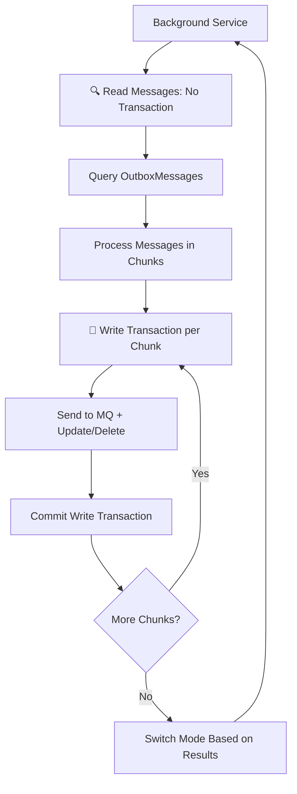
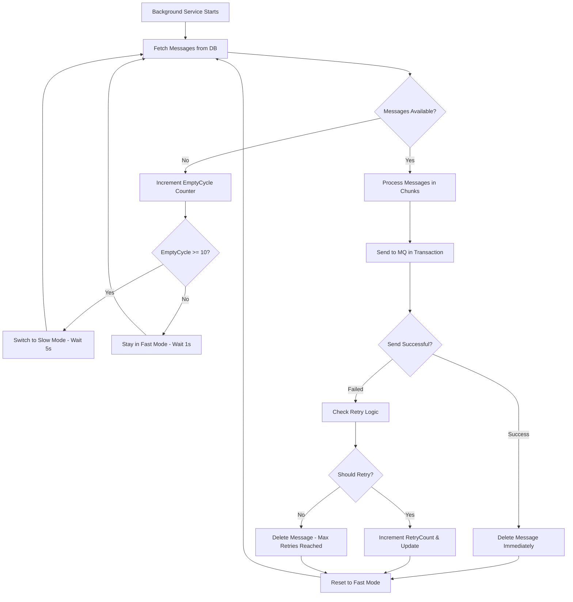

# 📦 Outbox Pattern Guide

## 🎯 Overview
The Outbox Pattern ensures **message delivery** and **transaction consistency** by storing messages in the database before sending them to the message queue.

## 🚀 Quick Start

### 1. Registration in Module
```csharp
public static class RequestModule
{
    public static IServiceCollection AddRequestModule(
        this IServiceCollection services, 
        IConfiguration configuration)
    {
        // ... other services ...
        
        // 🔥 Register Outbox Pattern
        services.AddOutbox<RequestDbContext>("request");
        
        return services;
    }
}
```

### 2. Configuration in appsettings.json
```json
{
  "OutboxConfigurations": {
    "BatchSize": 20,        // Number of messages per batch
    "Chunk": 5,             // Group size within transaction  
    "TimeSpanSlow": 5,      // Seconds (when no messages)
    "TimeSpanFast": 1       // Seconds (when messages exist)
  }
}
```

### 3. Database Schema
```sql
CREATE TABLE [request].[OutboxMessages] (
    [Id] uniqueidentifier NOT NULL PRIMARY KEY,
    [OccurredOn] datetime2 NOT NULL,
    [Payload] nvarchar(max) NOT NULL,
    [EventType] nvarchar(450) NOT NULL,
    [ExceptionInfo] nvarchar(max) NULL,
    [RetryCount] int NOT NULL DEFAULT 0,
    [LastRetryAt] datetime2 NULL,
    [MaxRetries] int NOT NULL DEFAULT 3,
    [IsInfrastructureFailure] bit NOT NULL DEFAULT 0
);

-- Important: No ProcessedOn or IsProcessed columns
-- Messages are deleted immediately after successful sending
```

## 🔄 Process Flow & Transaction Strategy

The background service uses **adaptive timing** and **optimal transaction management** for best performance:

### Transaction Strategy (Recommended)



### Optimal Implementation

```csharp
// ✅ No transaction for read operations - simple and fast
public async Task<List<OutboxMessage>> GetAllAsync(string schema, CancellationToken cancellationToken)
{
    using var connection = _sqlConnectionFactory.CreateNewConnection();
    
    var messages = await connection.QueryAsync<OutboxMessage>(sql, parameters);
    
    return messages.ToList();
}

// ✅ Separate write transactions per chunk
private async Task ProcessChunk(OutboxMessage[] chunk, CancellationToken cancellationToken)
{
    using var writeTransaction = await _repository.BeginTransaction(cancellationToken);
    
    try
    {
        foreach (var message in chunk)
        {
            await _publishEndpoint.PublishDeserializedEvent(...);
            await _repository.DeleteAsync(message.Id, cancellationToken);
        }
        
        await _repository.SaveChangeAsync(cancellationToken);
        await writeTransaction.CommitAsync(cancellationToken);
    }
    catch
    {
        await writeTransaction.RollbackAsync(cancellationToken);
        throw;
    }
}
```

### Background Service Workflow



### Key Behaviors

- **Fast Mode (1 second)**: When messages are being processed
- **Slow Mode (5 seconds)**: After 10 consecutive empty cycles
- **Delete Immediately**: No message retention after successful send
- **Smart Retry**: Infrastructure failures get 24-hour window, business failures get MaxRetries limit

## ⚙️ Configuration Details

### BatchSize (default: 20)
- Maximum number of messages fetched per batch
- **Increase** = Faster processing but higher memory usage
- **Decrease** = Slower processing but lower memory usage

```json
"BatchSize": 50  // For high-throughput scenarios
"BatchSize": 10  // For low-memory environments
```

### Chunk (default: 5)
- Group messages within a single transaction
- **Increase** = Larger transactions, potentially longer table locks
- **Decrease** = Smaller transactions but more frequent commits

```json
"Chunk": 10  // For high-performance scenarios
"Chunk": 3   // For high-concurrency scenarios
```

### TimeSpanSlow (default: 5 seconds)

- Wait time when **no messages** exist in database after 10 empty cycles
- **Increase** = Save CPU but slower response
- **Decrease** = Faster response but higher CPU usage

```json
"TimeSpanSlow": 10  // For low-priority processing
"TimeSpanSlow": 2   // For real-time requirements
```

### TimeSpanFast (default: 1 second)

- Wait time when **messages are being processed** or within 10 empty cycles
- **Increase** = Slower processing
- **Decrease** = Faster processing but higher CPU usage

```json
"TimeSpanFast": 0.5  // For high-throughput scenarios  
"TimeSpanFast": 2    // For batch processing scenarios
```

**Note**: The service automatically switches between Fast/Slow modes based on message availability for optimal performance.

## 🔁 Retry Logic

### Smart Retry Classification
```csharp
// Infrastructure Failures (longer retry window)
- Connection timeout
- Network issues  
- RabbitMQ down
- MassTransit errors
→ Unlimited retries within 24 hours

// Business Logic Failures (limited retries)
- JSON serialization error
- Invalid payload format  
- Schema validation error
→ Retry according to MaxRetries (default: 3 times)
```

### Exponential Backoff
```csharp
// Business Logic: 2^n minutes
Retry 1: Wait 2 minutes
Retry 2: Wait 4 minutes  
Retry 3: Wait 8 minutes

// Infrastructure: 2^n minutes (max 64 minutes)
Retry 1: Wait 2 minutes
Retry 2: Wait 4 minutes
...
Retry 7+: Wait 64 minutes
```

## 📊 Monitoring

### Database Queries

```sql
-- Check pending messages (all unprocessed messages)
SELECT COUNT(*) FROM [schema].[OutboxMessages];

-- Check failed messages with retry information
SELECT * FROM [schema].[OutboxMessages] 
WHERE RetryCount > 0 
ORDER BY OccurredOn DESC;

-- Check infrastructure failures (24-hour retry window)
SELECT * FROM [schema].[OutboxMessages]
WHERE IsInfrastructureFailure = 1
ORDER BY OccurredOn DESC;

-- Check messages approaching retry limits
SELECT EventType, COUNT(*) as Count, AVG(RetryCount) as AvgRetries
FROM [schema].[OutboxMessages]
WHERE RetryCount > 0
GROUP BY EventType;
```

### Performance Metrics

```csharp
// Log entries from OutboxHostedService will show
[INFO] OutboxHostedService<RequestDbContext> started
[DEBUG] Processed 15 messages, switching to fast mode
[DEBUG] No messages for 10 cycles, switching to slow mode
[ERROR] Error in outbox processing for RequestDbContext: [exception details]
```

**Important**: Since messages are deleted immediately after successful processing, you won't see processed messages in monitoring queries. Only pending and failed messages remain in the database.

## 🛠️ Usage Examples

### 1. Simple Domain Event
```csharp
public class UserCreatedEvent : IDomainEvent
{
    public Guid UserId { get; set; }
    public string Email { get; set; }
    public DateTime CreatedAt { get; set; }
}

// In Domain Service
public async Task CreateUserAsync(User user)
{
    // Save user to database
    _context.Users.Add(user);
    
    // Add domain event (will be stored in OutboxMessages automatically)
    user.AddDomainEvent(new UserCreatedEvent 
    { 
        UserId = user.Id,
        Email = user.Email,
        CreatedAt = DateTime.UtcNow
    });
    
    await _context.SaveChangesAsync(); // Transaction consistency!
}
```

### 2. Integration Event  
```csharp
public class DocumentProcessedEvent : IIntegrationEvent
{
    public Guid DocumentId { get; set; }
    public string Status { get; set; }
    public DateTime ProcessedAt { get; set; }
}

// In Application Service
public async Task ProcessDocumentAsync(Guid documentId)
{
    var document = await _repository.GetByIdAsync(documentId);
    
    // Business logic
    document.Process();
    
    // Publish integration event
    await _publishEndpoint.Publish(new DocumentProcessedEvent
    {
        DocumentId = documentId,
        Status = "Completed",
        ProcessedAt = DateTime.UtcNow
    });
    
    await _repository.SaveChangesAsync();
}
```

## 🎛️ Performance Tuning

### High Throughput Setup
```json
{
  "OutboxConfigurations": {
    "BatchSize": 100,      // Increase batch size
    "Chunk": 20,           // Increase chunk size
    "TimeSpanSlow": 2,     // Reduce wait time
    "TimeSpanFast": 0.5    // Faster processing
  }
}
```

### Low Resource Setup
```json
{
  "OutboxConfigurations": {
    "BatchSize": 10,       // Reduce batch size
    "Chunk": 3,            // Reduce chunk size  
    "TimeSpanSlow": 10,    // Increase wait time
    "TimeSpanFast": 2      // Slower processing
  }
}
```

### Real-time Setup
```json
{
  "OutboxConfigurations": {
    "BatchSize": 50,       // Moderate size
    "Chunk": 10,           // Moderate size
    "TimeSpanSlow": 1,     // Quick message fetch
    "TimeSpanFast": 0.1    // Immediate processing
  }
}
```

## ⚠️ Best Practices

### ✅ DO
- Use **small transactions** (Chunk = 3-10)
- Set **appropriate timeouts** based on use case
- **Monitor** failed messages regularly
- Use **structured logging** for debugging
- **Test** retry behavior during MQ downtime

### ❌ DON'T  
- Set `BatchSize` too large (> 200)
- Set `TimeSpanFast` to 0 (will consume excessive CPU)
- Let failed messages accumulate in database
- Use retry for business validation errors
- Forget to monitor database size regularly

## 🔧 Troubleshooting

### Messages Not Sending

```sql
-- Check for pending messages
SELECT COUNT(*), AVG(RetryCount) 
FROM [schema].[OutboxMessages];

-- View error messages
SELECT TOP 10 ExceptionInfo, RetryCount 
FROM [schema].[OutboxMessages] 
WHERE ExceptionInfo IS NOT NULL;
```

### Poor Performance

1. Increase `BatchSize` and `Chunk`
2. Decrease `TimeSpanFast`
3. Check for database locks
4. Add index on `OccurredOn` column

### High Memory Usage

1. Decrease `BatchSize`
2. Decrease `Chunk` 
3. Increase `TimeSpanSlow`
4. Check for memory leaks in message handlers

### Common Issues

- **Too many retries**: Check if MQ is down for extended periods
- **Messages stuck**: Verify `LastRetryAt` exponential backoff is working
- **High CPU**: Reduce `TimeSpanFast` or increase empty cycle threshold
- **Database growth**: Messages accumulate only when retry limits are reached

## 🏗️ Architecture Integration

```csharp
// Module structure
Modules/
  Request/
    Request/
      Data/
        RequestDbContext.cs     // Contains OutboxMessages table
      Extensions/
        RequestModule.cs        // Register AddOutbox<RequestDbContext>
      
// Shared components  
Shared/
  Shared.Messaging/
    Services/
      OutboxService.cs          // Core business logic
    Extensions/
      Outbox.cs                 // DI registration
    Workers/
      OutboxHostedService.cs    // Background processing
```

---

*🔄 Last updated: September 2025*