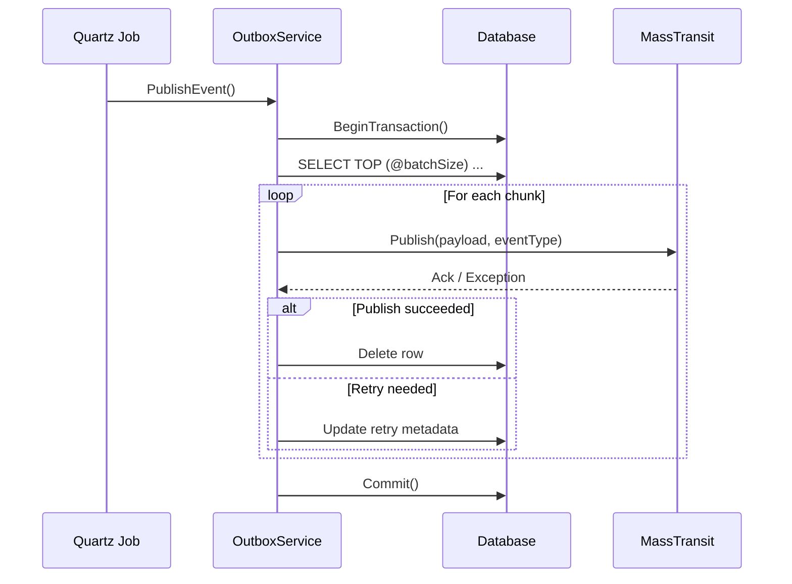

# Outbox/Inbox Pattern Deep Dive

This document expands on `docs/Outbox_Pattern_Guide.md` and explains how the shared Outbox/Inbox infrastructure works under the hood. Use it when you need to reason about reliability guarantees, operational concerns, or when extending the pattern to new modules.

---

## Message lifecycle overview

1. **Aggregate raises an externalized domain event.** While `DbContext.SaveChanges` runs, the `DispatchDomainEventInterceptor` converts the event to an integration payload.
2. **Event is serialized into the outbox.** `OutboxMessage.Create` records the payload, type, and retry metadata in the module schema. The insert occurs within the same transaction as your domain updates.
3. **Quartz wakes the processor.** `OutboxProcessorJob<TDbContext>` resolves a keyed `IOutboxService` (one per DbContext/schema) and calls `PublishEvent`.
4. **Messages are published in chunks.** `OutboxService` fetches rows via `OutboxReadRepository`, publishes each payload through MassTransit, and either deletes the row or increments retry counters.
5. **Inbox wrappers guard consumers.** `ConsumeWrapper<TMessage, TConsumer>` persists inbound messages, checks for duplicates via `IInboxService`, and only then executes your handler.
6. **Cleanup jobs reclaim storage.** `InboxCleanupJob<TDbContext>` prunes aged inbox rows, while the outbox service naturally deletes successfully published entries.

---

## Components and responsibilities

| Area | Implementation | Responsibility |
| --- | --- | --- |
| Outbox persistence | `OutboxMessage`, `OutboxRepository`, `OutboxReadRepository` | Store outgoing events, fetch batches, manage transactions. |
| Outbox publishing | `OutboxService`, `OutboxProcessorJob` | Publish payloads, apply retry rules, chunk work. |
| Inbox persistence | `InboxMessage`, `InboxRepository`, `InboxReadRepository` | Record inbound messages, detect duplicates, perform SQL purge. |
| Inbox execution | `InboxService`, `ConsumeWrapper` | Enforce idempotency around consumer logic. |
| Scheduling | `QuartzJobExtensions` | Register `OutboxProcessorJob` and `InboxCleanupJob` with module-specific identities. |
| MassTransit wiring | `MassTransitExtensions`, `ConsumerWrapperRegistry` | Ensure wrappers are discoverable and registered alongside real consumers. |

---

## Outbox publishing pipeline

### Fetching strategy

- `OutboxReadRepository` issues raw SQL with `ROWLOCK`, `READPAST`, and `UPDLOCK` hints. Multiple processor instances can run concurrently without contention because locked rows are skipped.
- The `Jobs:OutboxProcessor:BatchSize` setting caps how many rows are returned per query. Adjust it to balance throughput and memory usage.

### Transactional processing



- `_chunk` (from `Jobs:OutboxProcessor:Chunk`) breaks the batch into sub-groups between calls to `SaveChangeAsync` to keep transactions short.
- If a publish throws an exception, `OutboxMessage.ShouldTreatAsInfrastructureFailure` classifies it. Infrastructure failures permit up to 24 hours of retries; business failures respect `MaxRetries`.
- Any exception during the outer loop triggers a rollback and the job exits. The rows remain for the next schedule run.

### Deserialization and publishing

`OutboxExtensions.PublishDeserializedEvent` converts the stored `EventType` string back to a .NET `Type` using `Type.GetType`. Ensure your integration events set `EventType = GetType().AssemblyQualifiedName` so this lookup succeeds. The payload is deserialized with `System.Text.Json` and published via `IPublishEndpoint`.

---

## Inbox idempotency pipeline

### Consumer wrapping

`services.AddInbox<TDbContext>(...)` scans the provided assembly for `IConsumer<T>` implementations. For each consumer:

- The concrete consumer type is registered in DI.
- A unique `ConsumeWrapper<TMessage, TConsumer>` is generated and registered.
- `ConsumerWrapperRegistry` remembers wrapper types so `MassTransitExtensions` can add them when the bus is configured.

```csharp
services.AddInbox<RequestDbContext>(configuration, typeof(RequestModule).Assembly, "request");
services.AddMassTransitWithAssemblies(configuration, typeof(RequestModule).Assembly);
```

If you register MassTransit manually, include the wrapper collection:

```csharp
var wrappers = ConsumerWrapperRegistry.GetRegistered();
config.AddConsumers(wrappers.ToArray());
```

### Duplicate detection flow

1. `ConsumeWrapper` resolves `IInboxService` keyed by the module schema.
2. `IInboxService.CheckDuplicate` queries the inbox table with locking hints to detect existing rows for the `MessageId`.
3. On the first encounter, `AddMessageInboxAsync` serializes the payload, storing `EventId`, `OccurredOn`, and the JSON body.
4. The inner consumer executes. If it succeeds, the inbox row remains for auditing; if it fails, the message stays recorded, guarding against replay duplicates.
5. `InboxCleanupJob` periodically removes rows older than `Jobs:RetentionDays` (interpreted by `InboxService` as `DateTime.UtcNow.AddDays(value)`).

### SQL-based cleanup helper

`InboxRepository.DeleteMessageTimeout` offers a direct SQL path for purging rows based on `OutboxConfigurations:CutOffDay`. Negative values delete messages older than `abs(days)`; positive values look forward (usually not desired). Wire it into operational scripts or call it from the cleanup job once the TODO comments are resolved.

---

## Configuration summary

```json
{
  "Jobs": {
    "RetentionDays": 7,
    "InboxCleanup": {
      "CronExpression": "0 0 0 * * ?"
    },
    "OutboxProcessor": {
      "CronExpression": "0/5 * * * * ?",
      "BatchSize": 50,
      "Chunk": 5
    }
  },
  "OutboxConfigurations": {
    "CutOffDay": -7
  }
}
```

| Setting | Consumers | Notes |
| --- | --- | --- |
| `Jobs:RetentionDays` | `InboxService.ClearTimeOutMessage` | Keep inbox rows newer than the calculated cutoff (use negative numbers for "older than"). |
| `Jobs:OutboxProcessor:BatchSize` | `OutboxReadRepository` | Maximum rows retrieved per query. |
| `Jobs:OutboxProcessor:Chunk` | `OutboxService` | Size of sub-batches between `SaveChangeAsync` calls. |
| `Jobs:OutboxProcessor:CronExpression` | Quartz | Frequency of outbox publishing. |
| `Jobs:InboxCleanup:CronExpression` | Quartz | Schedule for inbox pruning. |
| `OutboxConfigurations:CutOffDay` | `InboxRepository.DeleteMessageTimeout` | SQL-level cleanup horizon (negative for past days). |

---

## Operational guidance

- **Scaling horizontally:** Multiple application instances can run the same Quartz jobs. Lock hints in repositories ensure only one instance removes a given row.
- **Observability:** Monitor logs for `OutboxProcessorJob` and `InboxCleanupJob`. Enable structured logging for retry exceptions; the `ExceptionInfo` column stores the last error message with a `[BUSINESS]` or `[INFRA]` prefix.
- **Back-pressure:** If the outbox grows faster than it is consumed, increase `BatchSize` and `Chunk`, scale MassTransit consumers, or provision dedicated workers for the Quartz jobs.
- **Recovery:** When an infrastructure outage occurs (for example, RabbitMQ is down), the outbox retains messages and retries for up to 24 hours. Once the broker is back, processing resumes automatically.
- **Schema isolation:** All keyed registrations use either the DbContext type name or the schema string. This lets you host multiple modules (Request, Notification, Assignment, etc.) without service collisions.

---

## Extending the pattern

- **Custom retry policies:** Update `OutboxMessage.ShouldRetry` if new infrastructure scenarios require longer retention or module-specific behavior.
- **Alternative serializers:** Replace `PublishDeserializedEvent` if you need custom serialization (for example, `Newtonsoft.Json`). Preserve the ability to resolve the `.NET` type by name.
- **Feature toggles:** The configuration currently ignores `Jobs:*:Enabled`. Wire these values into job registration if you need runtime toggles.
- **Alternate storage:** The repositories target SQL Server. For other databases, implement provider-specific repositories but keep the same interfaces.

---

## Reference checklist

- [ ] `modelBuilder.AddOutboxSupport(schema)` and `AddInboxSupport(schema)` execute during model creation.
- [ ] `DispatchDomainEventInterceptor` (and optional audit interceptors) registered for the module DbContext.
- [ ] `services.AddOutbox<TDbContext>(configuration, schema)` invoked.
- [ ] `services.AddInbox<TDbContext>(configuration, assembly, schema)` invoked when consuming events.
- [ ] Quartz jobs configured with suitable cron expressions.
- [ ] MassTransit setup includes wrapper types from `ConsumerWrapperRegistry`.
- [ ] Configuration sources provide `Jobs:*` and `OutboxConfigurations` values.
- [ ] Monitoring dashboards / alerts track outbox size, retry counts, and job failures.

Use this checklist plus the lifecycle diagrams to verify modules remain reliable as the system evolves.
