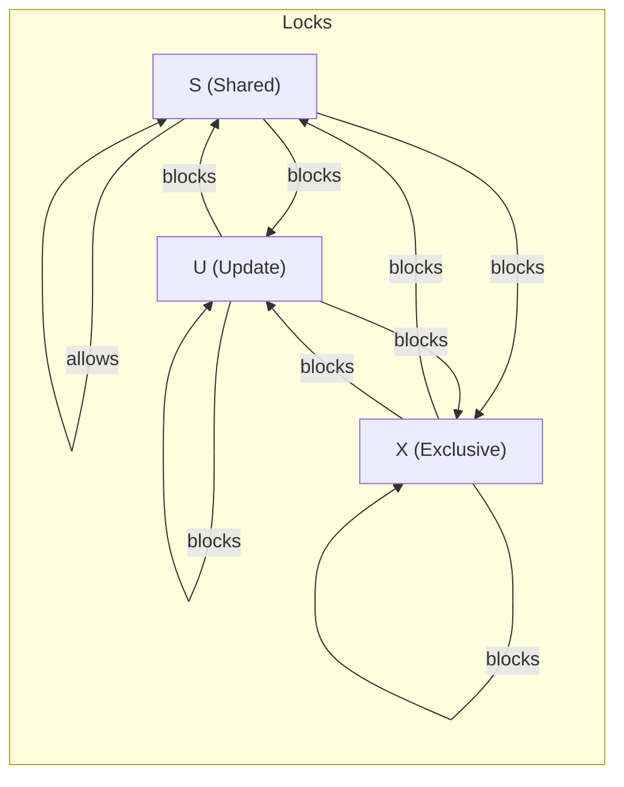

# 📘 SQL Server Locking & Isolation Reference

## 1. Locking Basics
- SQL Server uses locks to guarantee **consistency** and **isolation** between concurrent transactions.
- Locks exist at multiple **granularities**: row → page → extent → table → database.
- Locks are acquired automatically depending on:
    - **Operation** (SELECT, INSERT, UPDATE, DELETE)
    - **Isolation level**
    - **Hints** explicitly applied

---

## 2. Common Lock Types

| Lock | Purpose | Behavior | Blocks |
|------|---------|----------|--------|
| **S (Shared)** | For reads | Multiple S can coexist. Released at end of statement (unless repeatable/serializable). | X, U |
| **X (Exclusive)** | For writes | Blocks all other locks. Held until commit. | S, X, U |
| **U (Update)** | “Intend to write” lock | Only one U per resource. Upgrades to X when writing. Prevents deadlock. | Other U, X |
| **IS / IX / SIX (Intent)** | Show intent at higher level | Used with row/page locks. Prevents table lock conflicts. | Conflicting intent types |
| **Key-range** | Prevents phantom rows | Held under SERIALIZABLE. Locks index ranges. | Inserts/deletes in range |
| **Sch-S (Schema stability)** | Read schema | Non-blocking metadata lock. | Sch-M |
| **Sch-M (Schema modification)** | Alter schema | Blocks everything until done. | All |

🔑 **Lock escalation**: if row/page locks exceed ~5,000, SQL Server escalates to a table lock.

---

## 3. Transaction Isolation Levels

| Isolation Level | Dirty Reads | Non-Repeatable Reads | Phantom Reads | Locks / Versioning |
|-----------------|-------------|----------------------|---------------|--------------------|
| **READ UNCOMMITTED** | ✅ Allowed | ✅ Allowed | ✅ Allowed | Minimal locking, unsafe |
| **READ COMMITTED (default)** | ❌ No | ✅ Possible | ✅ Possible | S locks released after statement |
| **READ COMMITTED SNAPSHOT (RCSI)** | ❌ No | ❌ No | ✅ Possible | Row versioning, readers don’t block writers |
| **REPEATABLE READ** | ❌ No | ❌ No | ✅ Possible | Holds S locks until commit |
| **SNAPSHOT** | ❌ No | ❌ No | ❌ No | Uses row versioning, consistent snapshot |
| **SERIALIZABLE** | ❌ No | ❌ No | ❌ No | Key-range locks, strictest, most blocking |

---

## 4. Lock Hints

| Hint | Meaning | Behavior | Usage |
|------|---------|----------|-------|
| **NOLOCK** | Dirty reads | Reads without S locks | Reporting queries, risk inconsistency |
| **UPDLOCK** | Update lock on read | Prevents deadlock, reserves row | “SELECT FOR UPDATE” semantics |
| **HOLDLOCK** | Serializable scope | Holds locks until commit | Combine with UPDLOCK |
| **TABLOCK** | Lock table | Whole table lock | Bulk ops |
| **TABLOCKX** | Exclusive table | Blocks all access | Maintenance |
| **ROWLOCK** | Force row lock | Reduce escalation, more overhead | High concurrency scenarios |
| **XLOCK** | Exclusive lock | Blocks all | Critical updates |
| **READPAST** | Skip locked rows | Skips busy rows | Queue consumers |

---

## 5. Best Practices

- **Keep transactions short**: open late, commit early.
- **Avoid I/O inside transactions**: don’t call HTTP/file operations while holding locks.
- **Enable RCSI** for OLTP systems to reduce reader/writer blocking.
- **Use optimistic concurrency** (`rowversion`/`timestamp`) for conflict detection.
- **Use UPDLOCK + HOLDLOCK** for counters or sequence rows (SELECT FOR UPDATE pattern).
- **Use READPAST + UPDLOCK** for queue consumers.
- **Use NOLOCK** only for non-critical reporting (accepting inconsistent results).
- **Index foreign keys and predicates** to reduce lock footprint.
- **Consistent table access order** in code to reduce deadlocks.

---

## 6. EF Core Notes

- `SaveChangesAsync` auto-wraps in a transaction if multiple statements.
- Default isolation = **READ COMMITTED** (or RCSI if enabled at DB).
- Use `BeginTransaction(IsolationLevel.X)` to control isolation explicitly.
- For **SELECT FOR UPDATE** semantics:
```csharp
  var row = await db.NumberSequences
      .FromSqlRaw("SELECT * FROM NumberSequences WITH (UPDLOCK, HOLDLOCK) WHERE Name = {0}", "AppraisalNo")
      .FirstAsync();
```

- Use ExecutionStrategy.ExecuteAsync if also using retries with explicit transactions.
## 7. Blocking Matrix (who blocks whom)

### 7.1 Data locks at the **same row/key** (core idea)
**Held** ↓ vs **Incoming** → | **S** (Shared) | **U** (Update) | **X** (Exclusive)
:--|:--:|:--:|:--:
**S** (Shared) | ✅ | ❌ | ❌
**U** (Update) | ❌ | ❌ | ❌
**X** (Exclusive) | ❌ | ❌ | ❌

- ✅ = allowed (compatible) ❌ = blocked (incompatible)
- Intuition:
    - **S allows S**, but **blocks U/X**.
    - **U** is conservative: **blocks S/U/X** on the same row, then upgrades to X to modify.
    - **X** blocks everything else on the same row.

> Note: Locks also exist at **higher granularities** (page/table) with **intent locks (IS/IX/SIX)**. Intent locks advertise lower-level locks and can conflict with incompatible table-level locks.

---

### 7.2 Visual: who blocks whom (S/U/X)


### 7.3 Intent locks (table/page vs row)

At **table/page** level you’ll see **IS / IX / SIX**:

- **IS** (Intent Shared): “I hold or plan to hold **S** locks on lower granularity (row/page).”
- **IX** (Intent Exclusive): “I hold or plan to hold **X** locks on lower granularity.”
- **SIX** (Shared with Intent Exclusive): Table-level **S** + intent to take **X** on some rows.

**Purpose:** intent locks make sure SQL Server can quickly decide if a **table-level lock** conflicts with lower-level row/page locks.

**Common effects:**
- A session with many row-level **X** locks will hold **IX** on the table. Another session requesting a table-level **S** or **X** lock will be blocked by that IX.
- If row/page locks exceed ~5,000, SQL Server may **escalate** them into a single table lock (S or X).

---

### 7.4 Isolation & reader/writer blocking quick map

| Isolation | Reader gets S? | Reader vs Writer | Phantoms? |
|-----------|----------------|------------------|-----------|
| **READ UNCOMMITTED** | ❌ | Readers don’t block writers; writers block writers | ✅ |
| **READ COMMITTED** | ✅ (per statement) | Readers **can block** writers and vice versa | ✅ |
| **RCSI (READ COMMITTED SNAPSHOT)** | ❌ (uses versions) | Readers **do not** block writers | ✅ |
| **REPEATABLE READ** | ✅ (held until commit) | More blocking (S held to end of tx) | ✅ |
| **SNAPSHOT** | ❌ (uses versions) | Readers don’t block writers | ❌ |
| **SERIALIZABLE** | ✅ + key-range | Most blocking (range locks) | ❌ |

ℹ️ **Tip:** Enabling **RCSI** at the database level is often the simplest way to reduce reader↔writer blocking in OLTP systems.

---

### 7.5 Practical hint patterns (quick recall)

| Use case | Recommended hint(s) | Why |
|----------|----------------------|-----|
| Generate next number / “select for update” | `WITH (UPDLOCK, HOLDLOCK)` | Reserve the row and hold until commit; prevents races |
| Work queue consumer | `WITH (READPAST, UPDLOCK, ROWLOCK)` | Skip locked rows, process one row at a time, row-level granularity |
| Heavy reporting | Prefer **RCSI** (DB option); if needed, `NOLOCK` | RCSI gives consistent non-blocking reads; `NOLOCK` can give dirty/inconsistent reads |
| Bulk insert | `TABLOCK` (with bulk-logged or bulk ops) | Improves throughput, but blocks readers; use in short, controlled ops |
| Hot row updates | `ROWLOCK` | Encourage row-level instead of escalation; higher overhead |

**Heads-up on hints:**
- `NOLOCK` / `READUNCOMMITTED` can return **dirty, duplicate, or missing rows**. Use only when acceptable.
- `HOLDLOCK` ≈ `SERIALIZABLE` for that statement/table.
- `UPDLOCK` reduces deadlocks in read-then-update workflows.
- `TABLOCK(X)` can cause severe blocking — only for maintenance or controlled operations.

---
