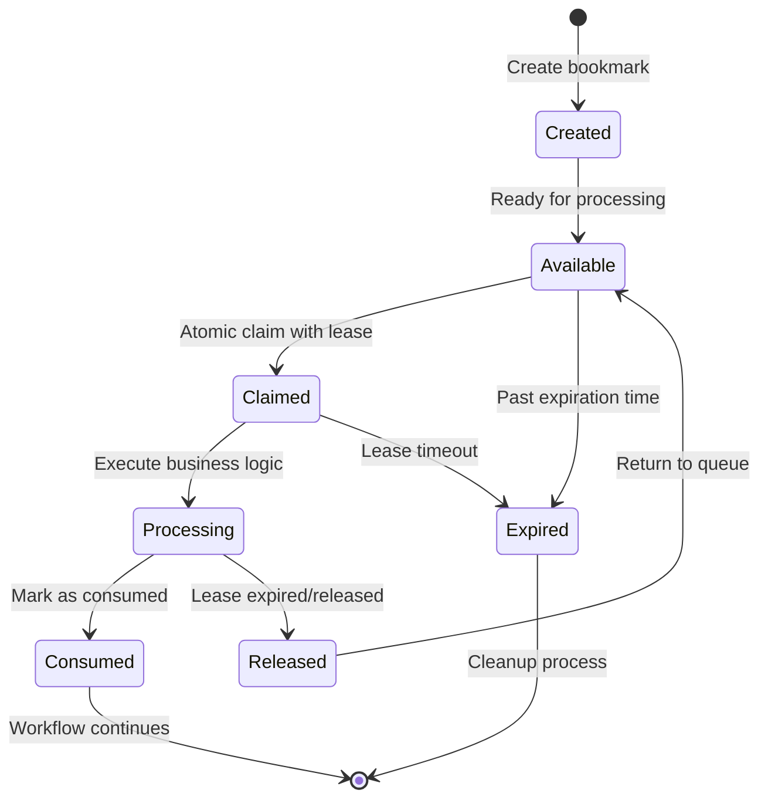

# Workflow Bookmark Patterns Guide

## Overview

The Workflow Bookmark system provides advanced patterns for managing long-running workflows with wait states. It implements atomic claim/lease mechanisms, correlation tracking, and comprehensive lifecycle management for production reliability.

## Core Concepts

### Bookmark Types

The system supports 5 distinct bookmark types for different use cases:

```csharp
public enum BookmarkType
{
    UserAction,         // Human tasks requiring user interaction
    Timer,             // Time-based delays and scheduled execution
    ExternalMessage,   // External callbacks and webhook responses
    ManualIntervention,// Admin actions and error recovery
    Approval          // Structured approval processes
}
```

### Bookmark Lifecycle



## Atomic Claim/Lease Pattern

### Basic Claim Mechanism

The claim/lease pattern ensures atomic processing in concurrent environments:

```csharp
public class WorkflowTaskProcessor
{
    private readonly IWorkflowBookmarkService _bookmarkService;
    private readonly TimeSpan _defaultLeaseDuration = TimeSpan.FromMinutes(30);
    
    public async Task<ProcessingResult> ProcessNextTaskAsync(
        string processorId,
        BookmarkType taskType = BookmarkType.UserAction,
        CancellationToken cancellationToken = default)
    {
        // Step 1: Atomically claim an available bookmark
        var claimedBookmark = await _bookmarkService.ClaimNextAvailableAsync(
            taskType,
            claimedBy: processorId,
            leaseDuration: _defaultLeaseDuration,
            cancellationToken);
        
        if (claimedBookmark == null)
        {
            return ProcessingResult.NoTasksAvailable();
        }
        
        try
        {
            // Step 2: Process the claimed bookmark
            var result = await ProcessBookmarkAsync(claimedBookmark, cancellationToken);
            
            if (result.Success)
            {
                // Step 3: Mark as consumed (removes from queue)
                await _bookmarkService.ConsumeBookmarkAsync(
                    claimedBookmark.Id,
                    consumedBy: processorId,
                    cancellationToken);
            }
            else
            {
                // Step 4: Release claim for retry by another processor
                await _bookmarkService.ReleaseClaimAsync(
                    claimedBookmark.Id,
                    cancellationToken);
            }
            
            return result;
        }
        catch (Exception ex)
        {
            // Always release claim on exception
            await _bookmarkService.ReleaseClaimAsync(claimedBookmark.Id, cancellationToken);
            throw;
        }
    }
}
```

### Advanced Claim Strategies

```csharp
public class PriorityBookmarkProcessor
{
    public async Task<ClaimedBookmark?> ClaimHighestPriorityTaskAsync(
        string processorId,
        string[] allowedTypes = null,
        CancellationToken cancellationToken = default)
    {
        // Claim with priority ordering and filtering
        var claimRequest = new ClaimBookmarkRequest
        {
            ClaimedBy = processorId,
            LeaseDuration = TimeSpan.FromMinutes(45),
            BookmarkTypes = allowedTypes ?? new[] { "UserAction", "Approval" },
            OrderBy = ClaimOrdering.PriorityDescThenCreatedAsc,
            MaxLeaseExtensions = 2 // Allow lease renewal
        };
        
        return await _bookmarkService.ClaimWithOptionsAsync(claimRequest, cancellationToken);
    }
    
    public async Task<bool> ExtendLeaseAsync(
        Guid bookmarkId, 
        TimeSpan additionalTime,
        CancellationToken cancellationToken = default)
    {
        // Extend processing time for complex operations
        return await _bookmarkService.ExtendLeaseAsync(
            bookmarkId,
            additionalTime,
            cancellationToken);
    }
}
```

## User Action Bookmarks

### Basic Human Tasks

```csharp
public class UserApprovalActivity : HumanTaskActivityBase
{
    protected override async Task<ActivityResult> OnExecuteAsync(
        ActivityContext context,
        CancellationToken cancellationToken = default)
    {
        var requestId = GetVariable<string>(context, "RequestId");
        var amount = GetVariable<decimal>(context, "Amount");
        var assignee = DetermineAssignee(context);
        
        // Create user action bookmark
        var bookmarkKey = $"approval-{requestId}-{context.ActivityId}";
        var bookmark = await _bookmarkService.CreateBookmarkAsync(
            workflowInstanceId: context.WorkflowInstanceId,
            activityId: context.ActivityId,
            type: BookmarkType.UserAction,
            key: bookmarkKey,
            correlationId: requestId,
            payload: JsonSerializer.Serialize(new
            {
                RequestId = requestId,
                Amount = amount,
                AssignedTo = assignee,
                TaskType = "Approval",
                Priority = amount > 10000 ? "High" : "Normal",
                DueDate = DateTime.UtcNow.AddDays(amount > 50000 ? 1 : 3)
            }),
            cancellationToken: cancellationToken);
        
        // Send notification to assigned user
        await _notificationService.NotifyUserAsync(
            assignee,
            "Approval Required",
            $"Please review and approve request {requestId} for {amount:C}",
            new Dictionary<string, object>
            {
                ["WorkflowId"] = context.WorkflowInstanceId,
                ["BookmarkKey"] = bookmarkKey,
                ["ActionUrl"] = $"/tasks/{bookmarkKey}"
            },
            cancellationToken);
        
        return ActivityResult.Suspended(new Dictionary<string, object>
        {
            ["PendingApproval"] = true,
            ["AssignedTo"] = assignee,
            ["BookmarkKey"] = bookmarkKey
        });
    }
}
```

### Bulk Task Processing

```csharp
public class BulkTaskProcessor : BackgroundService
{
    private readonly IWorkflowBookmarkService _bookmarkService;
    private readonly IServiceProvider _serviceProvider;
    private readonly ILogger<BulkTaskProcessor> _logger;
    
    protected override async Task ExecuteAsync(CancellationToken stoppingToken)
    {
        while (!stoppingToken.IsCancellationRequested)
        {
            try
            {
                // Process up to 10 tasks concurrently
                var tasks = new List<Task>();
                var semaphore = new SemaphoreSlim(10, 10);
                
                for (int i = 0; i < 10; i++)
                {
                    tasks.Add(ProcessSingleTaskAsync(semaphore, stoppingToken));
                }
                
                await Task.WhenAll(tasks);
                await Task.Delay(TimeSpan.FromSeconds(30), stoppingToken);
            }
            catch (Exception ex)
            {
                _logger.LogError(ex, "Error in bulk task processing");
                await Task.Delay(TimeSpan.FromMinutes(1), stoppingToken);
            }
        }
    }
    
    private async Task ProcessSingleTaskAsync(SemaphoreSlim semaphore, CancellationToken cancellationToken)
    {
        await semaphore.WaitAsync(cancellationToken);
        try
        {
            using var scope = _serviceProvider.CreateScope();
            var bookmarkService = scope.ServiceProvider.GetRequiredService<IWorkflowBookmarkService>();
            var processor = scope.ServiceProvider.GetRequiredService<ITaskProcessor>();
            
            var bookmark = await bookmarkService.ClaimNextAvailableAsync(
                BookmarkType.UserAction,
                claimedBy: Environment.MachineName,
                leaseDuration: TimeSpan.FromMinutes(10),
                cancellationToken);
            
            if (bookmark != null)
            {
                await processor.ProcessBookmarkAsync(bookmark, cancellationToken);
            }
        }
        finally
        {
            semaphore.Release();
        }
    }
}
```

## Timer Bookmarks

### Simple Delays

```csharp
public class DelayActivity : WorkflowActivityBase
{
    protected override async Task<ActivityResult> OnExecuteAsync(
        ActivityContext context,
        CancellationToken cancellationToken = default)
    {
        var delayMinutes = GetProperty<int>(context, "delayMinutes", 60);
        var dueAt = DateTime.UtcNow.AddMinutes(delayMinutes);
        
        await _bookmarkService.CreateBookmarkAsync(
            context.WorkflowInstanceId,
            context.ActivityId,
            BookmarkType.Timer,
            key: $"delay-{context.WorkflowInstanceId}-{context.ActivityId}",
            dueAt: dueAt,
            payload: JsonSerializer.Serialize(new
            {
                DelayMinutes = delayMinutes,
                ScheduledTime = dueAt,
                Reason = "Workflow delay"
            }),
            cancellationToken: cancellationToken);
        
        return ActivityResult.Suspended(new Dictionary<string, object>
        {
            ["DelayUntil"] = dueAt,
            ["DelayMinutes"] = delayMinutes
        });
    }
}
```

### Recurring Timers with Cron

```csharp
public class CronTimerActivity : WorkflowActivityBase
{
    private readonly ICronExpressionService _cronService;
    
    protected override async Task<ActivityResult> OnExecuteAsync(
        ActivityContext context,
        CancellationToken cancellationToken = default)
    {
        var cronExpression = GetProperty<string>(context, "cronExpression"); // "0 9 * * MON-FRI"
        var maxOccurrences = GetProperty<int>(context, "maxOccurrences", 10);
        var currentOccurrence = GetVariable<int>(context, "CurrentOccurrence", 0);
        
        if (currentOccurrence >= maxOccurrences)
        {
            return ActivityResult.Completed(new Dictionary<string, object>
            {
                ["CompletedOccurrences"] = currentOccurrence,
                ["Reason"] = "Maximum occurrences reached"
            });
        }
        
        var nextRun = _cronService.GetNextOccurrence(cronExpression, DateTime.UtcNow);
        if (!nextRun.HasValue)
        {
            return ActivityResult.Failed("Invalid cron expression or no future occurrences");
        }
        
        await _bookmarkService.CreateBookmarkAsync(
            context.WorkflowInstanceId,
            context.ActivityId,
            BookmarkType.Timer,
            key: $"cron-{context.WorkflowInstanceId}-{currentOccurrence + 1}",
            dueAt: nextRun.Value,
            payload: JsonSerializer.Serialize(new
            {
                CronExpression = cronExpression,
                OccurrenceNumber = currentOccurrence + 1,
                ScheduledFor = nextRun.Value
            }),
            cancellationToken: cancellationToken);
        
        return ActivityResult.Suspended(new Dictionary<string, object>
        {
            ["NextRun"] = nextRun.Value,
            ["CurrentOccurrence"] = currentOccurrence + 1
        });
    }
}
```

### Timeout Handling

```csharp
public class TimeoutWatcherActivity : WorkflowActivityBase
{
    protected override async Task<ActivityResult> OnExecuteAsync(
        ActivityContext context,
        CancellationToken cancellationToken = default)
    {
        var timeoutMinutes = GetProperty<int>(context, "timeoutMinutes", 1440); // 24 hours default
        var monitoredActivityId = GetProperty<string>(context, "monitoredActivityId");
        
        // Create timeout bookmark
        var timeoutDate = DateTime.UtcNow.AddMinutes(timeoutMinutes);
        await _bookmarkService.CreateBookmarkAsync(
            context.WorkflowInstanceId,
            context.ActivityId,
            BookmarkType.Timer,
            key: $"timeout-{monitoredActivityId}-{context.WorkflowInstanceId}",
            dueAt: timeoutDate,
            payload: JsonSerializer.Serialize(new
            {
                MonitoredActivityId = monitoredActivityId,
                TimeoutMinutes = timeoutMinutes,
                Action = "escalate"
            }),
            cancellationToken: cancellationToken);
        
        return ActivityResult.Suspended(new Dictionary<string, object>
        {
            ["TimeoutAt"] = timeoutDate,
            ["MonitoredActivity"] = monitoredActivityId
        });
    }
}
```

## External Message Bookmarks

### Webhook Integration

```csharp
public class WebhookCallbackActivity : WorkflowActivityBase
{
    private readonly IWebhookRegistrationService _webhookService;
    
    protected override async Task<ActivityResult> OnExecuteAsync(
        ActivityContext context,
        CancellationToken cancellationToken = default)
    {
        var externalApiUrl = GetProperty<string>(context, "externalApiUrl");
        var webhookTimeout = GetProperty<int>(context, "webhookTimeoutHours", 24);
        var correlationId = $"{context.WorkflowInstanceId}-{context.ActivityId}";
        
        // Register webhook with external system
        var callbackUrl = $"{GetProperty<string>(context, "baseUrl")}/api/workflows/webhook/{correlationId}";
        await _webhookService.RegisterWebhookAsync(
            externalApiUrl,
            correlationId,
            callbackUrl,
            timeoutHours: webhookTimeout,
            cancellationToken);
        
        // Create external message bookmark
        await _bookmarkService.CreateBookmarkAsync(
            context.WorkflowInstanceId,
            context.ActivityId,
            BookmarkType.ExternalMessage,
            key: correlationId,
            correlationId: correlationId,
            dueAt: DateTime.UtcNow.AddHours(webhookTimeout), // Timeout for cleanup
            payload: JsonSerializer.Serialize(new
            {
                ExternalApiUrl = externalApiUrl,
                CallbackUrl = callbackUrl,
                RegisteredAt = DateTime.UtcNow,
                ExpectedResponse = GetProperty<string>(context, "expectedResponseType", "confirmation")
            }),
            cancellationToken: cancellationToken);
        
        return ActivityResult.Suspended(new Dictionary<string, object>
        {
            ["WebhookRegistered"] = true,
            ["CorrelationId"] = correlationId,
            ["CallbackUrl"] = callbackUrl,
            ["TimeoutAt"] = DateTime.UtcNow.AddHours(webhookTimeout)
        });
    }
}

// Webhook endpoint controller
[ApiController]
[Route("api/workflows/webhook")]
public class WorkflowWebhookController : ControllerBase
{
    private readonly IMediator _mediator;
    private readonly IWorkflowBookmarkService _bookmarkService;
    
    [HttpPost("{correlationId}")]
    public async Task<IActionResult> HandleWebhook(
        string correlationId,
        [FromBody] JsonDocument payload,
        CancellationToken cancellationToken = default)
    {
        // Find the bookmark by correlation ID
        var bookmark = await _bookmarkService.GetByCorrelationIdAsync(
            correlationId,
            cancellationToken);
        
        if (bookmark == null || bookmark.IsConsumed)
        {
            return NotFound($"No active bookmark found for correlation ID: {correlationId}");
        }
        
        // Complete the activity with webhook payload
        var command = new CompleteActivityCommand(
            WorkflowInstanceId: bookmark.WorkflowInstanceId,
            ActivityId: bookmark.ActivityId,
            CompletedBy: "external-webhook",
            OutputData: new Dictionary<string, object>
            {
                ["WebhookPayload"] = payload.RootElement,
                ["ReceivedAt"] = DateTime.UtcNow,
                ["CorrelationId"] = correlationId
            },
            BookmarkKey: correlationId
        );
        
        var result = await _mediator.Send(command, cancellationToken);
        return result.Success ? Ok() : BadRequest(result.ErrorMessage);
    }
    
    [HttpPost("{correlationId}/status")]
    public async Task<IActionResult> HandleStatusUpdate(
        string correlationId,
        [FromBody] WebhookStatusUpdate statusUpdate,
        CancellationToken cancellationToken = default)
    {
        // Handle status updates without completing the workflow
        var bookmark = await _bookmarkService.GetByCorrelationIdAsync(
            correlationId,
            cancellationToken);
            
        if (bookmark == null)
        {
            return NotFound();
        }
        
        // Update bookmark payload with status information
        await _bookmarkService.UpdatePayloadAsync(
            bookmark.Id,
            JsonSerializer.Serialize(new
            {
                Status = statusUpdate.Status,
                Progress = statusUpdate.Progress,
                LastUpdated = DateTime.UtcNow,
                Message = statusUpdate.Message
            }),
            cancellationToken);
        
        return Ok();
    }
}
```

### Message Queue Integration

```csharp
public class MessageQueueActivity : WorkflowActivityBase
{
    private readonly IMessageQueueService _messageQueue;
    
    protected override async Task<ActivityResult> OnExecuteAsync(
        ActivityContext context,
        CancellationToken cancellationToken = default)
    {
        var queueName = GetProperty<string>(context, "queueName");
        var messageFilter = GetProperty<string>(context, "messageFilter");
        var timeoutMinutes = GetProperty<int>(context, "timeoutMinutes", 60);
        
        var correlationId = Guid.NewGuid().ToString();
        
        // Subscribe to message queue
        await _messageQueue.SubscribeAsync(
            queueName,
            correlationId,
            messageFilter,
            callbackUrl: $"/api/workflows/message/{correlationId}",
            cancellationToken);
        
        // Create external message bookmark
        await _bookmarkService.CreateBookmarkAsync(
            context.WorkflowInstanceId,
            context.ActivityId,
            BookmarkType.ExternalMessage,
            key: correlationId,
            correlationId: correlationId,
            dueAt: DateTime.UtcNow.AddMinutes(timeoutMinutes),
            payload: JsonSerializer.Serialize(new
            {
                QueueName = queueName,
                MessageFilter = messageFilter,
                SubscribedAt = DateTime.UtcNow
            }),
            cancellationToken: cancellationToken);
        
        return ActivityResult.Suspended(new Dictionary<string, object>
        {
            ["MessageQueueSubscribed"] = true,
            ["QueueName"] = queueName,
            ["CorrelationId"] = correlationId
        });
    }
}
```

## Manual Intervention Bookmarks

### Error Recovery

```csharp
public class ErrorRecoveryActivity : WorkflowActivityBase
{
    protected override async Task<ActivityResult> OnExecuteAsync(
        ActivityContext context,
        CancellationToken cancellationToken = default)
    {
        var errorDetails = GetVariable<string>(context, "LastErrorDetails");
        var failedActivityId = GetVariable<string>(context, "FailedActivityId");
        var interventionLevel = DetermineInterventionLevel(errorDetails);
        
        // Create manual intervention bookmark
        var interventionKey = $"intervention-{context.WorkflowInstanceId}-{DateTime.UtcNow:yyyyMMdd-HHmmss}";
        await _bookmarkService.CreateBookmarkAsync(
            context.WorkflowInstanceId,
            context.ActivityId,
            BookmarkType.ManualIntervention,
            key: interventionKey,
            payload: JsonSerializer.Serialize(new
            {
                ErrorDetails = errorDetails,
                FailedActivityId = failedActivityId,
                InterventionLevel = interventionLevel,
                RequiredRole = interventionLevel == "Critical" ? "senior-admin" : "workflow-admin",
                PossibleActions = new[]
                {
                    "retry-activity",
                    "skip-activity",
                    "modify-variables",
                    "cancel-workflow"
                },
                CreatedAt = DateTime.UtcNow
            }),
            cancellationToken: cancellationToken);
        
        // Notify administrators with different urgency based on level
        var priority = interventionLevel switch
        {
            "Critical" => NotificationPriority.Critical,
            "High" => NotificationPriority.High,
            _ => NotificationPriority.Normal
        };
        
        await _notificationService.NotifyRoleAsync(
            interventionLevel == "Critical" ? "senior-admin" : "workflow-admin",
            $"Manual Intervention Required - {interventionLevel} Priority",
            $"Workflow {context.WorkflowInstanceId} requires manual intervention due to: {errorDetails}",
            new Dictionary<string, object>
            {
                ["InterventionKey"] = interventionKey,
                ["WorkflowId"] = context.WorkflowInstanceId,
                ["ActionUrl"] = $"/admin/interventions/{interventionKey}"
            },
            priority,
            cancellationToken);
        
        return ActivityResult.Suspended(new Dictionary<string, object>
        {
            ["InterventionRequested"] = true,
            ["InterventionKey"] = interventionKey,
            ["InterventionLevel"] = interventionLevel
        });
    }
    
    private string DetermineInterventionLevel(string errorDetails)
    {
        return errorDetails switch
        {
            var s when s.Contains("database") || s.Contains("connection") => "Critical",
            var s when s.Contains("external") || s.Contains("timeout") => "High",
            var s when s.Contains("validation") || s.Contains("business") => "Normal",
            _ => "Normal"
        };
    }
}
```

### Administrative Actions

```csharp
[ApiController]
[Route("api/admin/interventions")]
[Authorize(Roles = "workflow-admin,senior-admin")]
public class ManualInterventionController : ControllerBase
{
    private readonly IMediator _mediator;
    private readonly IWorkflowBookmarkService _bookmarkService;
    
    [HttpGet]
    public async Task<IActionResult> GetPendingInterventions(
        CancellationToken cancellationToken = default)
    {
        var interventions = await _bookmarkService.GetActiveBookmarksByTypeAsync(
            BookmarkType.ManualIntervention,
            cancellationToken);
        
        var interventionSummaries = interventions.Select(b => new
        {
            InterventionKey = b.Key,
            WorkflowId = b.WorkflowInstanceId,
            CreatedAt = b.CreatedAt,
            Payload = JsonSerializer.Deserialize<Dictionary<string, object>>(b.Payload ?? "{}"),
            ClaimedBy = b.ClaimedBy,
            ClaimedAt = b.ClaimedAt
        });
        
        return Ok(interventionSummaries);
    }
    
    [HttpPost("{interventionKey}/resolve")]
    public async Task<IActionResult> ResolveIntervention(
        string interventionKey,
        [FromBody] InterventionResolution resolution,
        CancellationToken cancellationToken = default)
    {
        var command = new ResolveManualInterventionCommand(
            InterventionKey: interventionKey,
            Action: resolution.Action,
            ModifiedVariables: resolution.ModifiedVariables,
            Comments: resolution.Comments,
            ResolvedBy: User.Identity.Name
        );
        
        var result = await _mediator.Send(command, cancellationToken);
        return result.Success ? Ok(result) : BadRequest(result.ErrorMessage);
    }
}

public record InterventionResolution(
    string Action, // "retry-activity", "skip-activity", "modify-variables", "cancel-workflow"
    Dictionary<string, object>? ModifiedVariables,
    string Comments
);
```

## Approval Bookmarks

### Multi-Level Approval

```csharp
public class MultiLevelApprovalActivity : WorkflowActivityBase
{
    protected override async Task<ActivityResult> OnExecuteAsync(
        ActivityContext context,
        CancellationToken cancellationToken = default)
    {
        var amount = GetVariable<decimal>(context, "Amount");
        var currentLevel = GetVariable<int>(context, "ApprovalLevel", 1);
        var maxLevel = DetermineMaxApprovalLevel(amount);
        
        if (currentLevel > maxLevel)
        {
            return ActivityResult.Completed(new Dictionary<string, object>
            {
                ["AllApprovalsCompleted"] = true,
                ["FinalApprovalLevel"] = currentLevel - 1
            });
        }
        
        var approver = GetApproverForLevel(currentLevel, amount);
        var approvalKey = $"approval-L{currentLevel}-{context.WorkflowInstanceId}";
        
        // Create approval bookmark with escalation
        await _bookmarkService.CreateBookmarkAsync(
            context.WorkflowInstanceId,
            context.ActivityId,
            BookmarkType.Approval,
            key: approvalKey,
            dueAt: DateTime.UtcNow.AddHours(GetApprovalTimeoutHours(currentLevel)),
            payload: JsonSerializer.Serialize(new
            {
                ApprovalLevel = currentLevel,
                MaxLevel = maxLevel,
                Amount = amount,
                Approver = approver,
                EscalationHours = GetApprovalTimeoutHours(currentLevel),
                RequiredRole = GetRequiredRoleForLevel(currentLevel)
            }),
            cancellationToken: cancellationToken);
        
        return ActivityResult.Suspended(new Dictionary<string, object>
        {
            ["PendingApprovalLevel"] = currentLevel,
            ["Approver"] = approver,
            ["ApprovalKey"] = approvalKey
        });
    }
    
    private int DetermineMaxApprovalLevel(decimal amount) => amount switch
    {
        > 100000 => 3, // Team Lead, Manager, Director
        > 25000 => 2,  // Team Lead, Manager  
        > 5000 => 1,   // Team Lead only
        _ => 0         // Auto-approved
    };
    
    private string GetApproverForLevel(int level, decimal amount) => level switch
    {
        1 => "team-lead@company.com",
        2 => "manager@company.com", 
        3 => amount > 500000 ? "ceo@company.com" : "director@company.com",
        _ => "auto-approved"
    };
}
```

### Parallel Approval (Any/All)

```csharp
public class ParallelApprovalActivity : WorkflowActivityBase
{
    protected override async Task<ActivityResult> OnExecuteAsync(
        ActivityContext context,
        CancellationToken cancellationToken = default)
    {
        var approvers = GetProperty<string[]>(context, "approvers");
        var approvalMode = GetProperty<string>(context, "approvalMode", "any"); // "any" or "all"
        var requestId = GetVariable<string>(context, "RequestId");
        
        // Create individual approval bookmarks for each approver
        var approvalTasks = new List<Task>();
        var approvalKeys = new List<string>();
        
        foreach (var approver in approvers)
        {
            var approvalKey = $"parallel-approval-{requestId}-{approver.Replace("@", "-")}";
            approvalKeys.Add(approvalKey);
            
            approvalTasks.Add(_bookmarkService.CreateBookmarkAsync(
                context.WorkflowInstanceId,
                $"{context.ActivityId}-{approver}",
                BookmarkType.Approval,
                key: approvalKey,
                correlationId: requestId,
                dueAt: DateTime.UtcNow.AddDays(3),
                payload: JsonSerializer.Serialize(new
                {
                    Approver = approver,
                    ApprovalMode = approvalMode,
                    ParallelGroup = requestId,
                    RequiredApprovals = approvalMode == "all" ? approvers.Length : 1
                }),
                cancellationToken: cancellationToken));
        }
        
        await Task.WhenAll(approvalTasks);
        
        return ActivityResult.Suspended(new Dictionary<string, object>
        {
            ["ParallelApprovalStarted"] = true,
            ["ApprovalMode"] = approvalMode,
            ["PendingApprovers"] = approvers,
            ["ApprovalKeys"] = approvalKeys
        });
    }
}

// Handler for parallel approval completion
public class ParallelApprovalCompletionHandler : INotificationHandler<ActivityCompletedEvent>
{
    public async Task Handle(ActivityCompletedEvent notification, CancellationToken cancellationToken)
    {
        if (!notification.ActivityId.Contains("parallel-approval"))
            return;
            
        var approvalData = JsonSerializer.Deserialize<Dictionary<string, object>>(
            notification.OutputData.GetValueOrDefault("ApprovalData")?.ToString() ?? "{}");
            
        var approvalMode = approvalData.GetValueOrDefault("ApprovalMode")?.ToString();
        var parallelGroup = approvalData.GetValueOrDefault("ParallelGroup")?.ToString();
        
        if (approvalMode == "any")
        {
            // Cancel other pending approvals in the same group
            await CancelRelatedApprovalsAsync(parallelGroup, notification.WorkflowInstanceId, cancellationToken);
        }
        else if (approvalMode == "all")
        {
            // Check if all approvals are complete
            var allComplete = await CheckAllApprovalsCompleteAsync(parallelGroup, cancellationToken);
            if (allComplete)
            {
                // Continue with next activity
                await ContinueWorkflowAsync(notification.WorkflowInstanceId, cancellationToken);
            }
        }
    }
}
```

## Bookmark Monitoring and Cleanup

### Health Monitoring

```csharp
public class BookmarkHealthService : BackgroundService
{
    private readonly IWorkflowBookmarkService _bookmarkService;
    private readonly ILogger<BookmarkHealthService> _logger;
    
    protected override async Task ExecuteAsync(CancellationToken stoppingToken)
    {
        while (!stoppingToken.IsCancellationRequested)
        {
            try
            {
                await PerformHealthChecksAsync(stoppingToken);
                await Task.Delay(TimeSpan.FromMinutes(15), stoppingToken);
            }
            catch (Exception ex)
            {
                _logger.LogError(ex, "Error in bookmark health monitoring");
                await Task.Delay(TimeSpan.FromMinutes(5), stoppingToken);
            }
        }
    }
    
    private async Task PerformHealthChecksAsync(CancellationToken cancellationToken)
    {
        // Check for expired leases
        var expiredLeases = await _bookmarkService.GetExpiredLeasesAsync(cancellationToken);
        _logger.LogInformation("Found {Count} expired leases", expiredLeases.Count);
        
        foreach (var lease in expiredLeases)
        {
            await _bookmarkService.ReleaseClaimAsync(lease.Id, cancellationToken);
            _logger.LogWarning("Released expired lease for bookmark {BookmarkId} claimed by {ClaimedBy}", 
                lease.Id, lease.ClaimedBy);
        }
        
        // Check for overdue bookmarks
        var overdueBookmarks = await _bookmarkService.GetOverdueBookmarksAsync(cancellationToken);
        _logger.LogInformation("Found {Count} overdue bookmarks", overdueBookmarks.Count);
        
        foreach (var bookmark in overdueBookmarks)
        {
            await HandleOverdueBookmarkAsync(bookmark, cancellationToken);
        }
        
        // Report metrics
        var stats = await _bookmarkService.GetStatisticsAsync(cancellationToken);
        _logger.LogInformation("Bookmark Statistics: {Stats}", JsonSerializer.Serialize(stats));
    }
    
    private async Task HandleOverdueBookmarkAsync(WorkflowBookmark bookmark, CancellationToken cancellationToken)
    {
        var payloadData = JsonSerializer.Deserialize<Dictionary<string, object>>(bookmark.Payload ?? "{}");
        
        switch (bookmark.Type)
        {
            case BookmarkType.UserAction:
            case BookmarkType.Approval:
                // Escalate to manager or next approval level
                await EscalateApprovalAsync(bookmark, payloadData, cancellationToken);
                break;
                
            case BookmarkType.ExternalMessage:
                // Mark as timed out and continue workflow
                await TimeoutExternalCallAsync(bookmark, cancellationToken);
                break;
                
            case BookmarkType.ManualIntervention:
                // Escalate to higher admin level
                await EscalateInterventionAsync(bookmark, cancellationToken);
                break;
                
            case BookmarkType.Timer:
                // Should be processed by timer service, log warning
                _logger.LogWarning("Overdue timer bookmark {BookmarkId} - check timer service health", bookmark.Id);
                break;
        }
    }
}
```

### Automatic Cleanup

```csharp
public class BookmarkCleanupService : BackgroundService
{
    protected override async Task ExecuteAsync(CancellationToken stoppingToken)
    {
        while (!stoppingToken.IsCancellationRequested)
        {
            try
            {
                await PerformCleanupAsync(stoppingToken);
                
                // Run cleanup every 4 hours during off-peak times
                await Task.Delay(TimeSpan.FromHours(4), stoppingToken);
            }
            catch (Exception ex)
            {
                _logger.LogError(ex, "Error in bookmark cleanup service");
                await Task.Delay(TimeSpan.FromHours(1), stoppingToken);
            }
        }
    }
    
    private async Task PerformCleanupAsync(CancellationToken cancellationToken)
    {
        var cutoffDate = DateTime.UtcNow.AddDays(-30);
        
        // Clean up consumed bookmarks older than 30 days
        var consumedCount = await _bookmarkService.CleanupConsumedBookmarksAsync(
            cutoffDate, 
            batchSize: 1000,
            cancellationToken);
        _logger.LogInformation("Cleaned up {Count} consumed bookmarks", consumedCount);
        
        // Clean up expired bookmarks older than 7 days
        var expiredCutoff = DateTime.UtcNow.AddDays(-7);
        var expiredCount = await _bookmarkService.CleanupExpiredBookmarksAsync(
            expiredCutoff,
            batchSize: 1000, 
            cancellationToken);
        _logger.LogInformation("Cleaned up {Count} expired bookmarks", expiredCount);
        
        // Archive old bookmarks to cold storage
        await ArchiveOldBookmarksAsync(DateTime.UtcNow.AddDays(-90), cancellationToken);
    }
}
```

This comprehensive bookmark pattern system provides the foundation for building sophisticated, reliable long-running workflows with robust state management and fault tolerance.