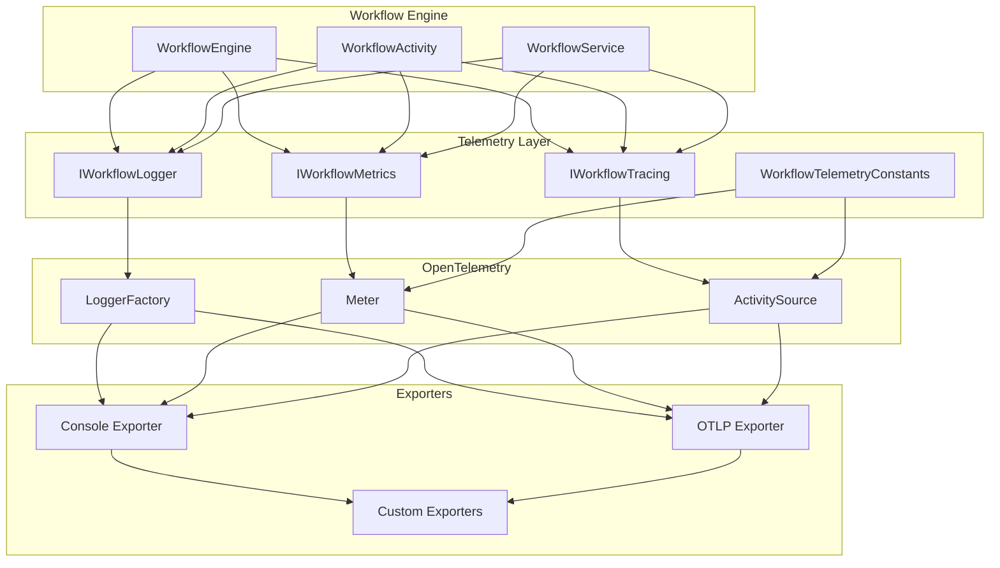

# Workflow Engine Observability Guide

## Table of Contents

1. [Overview](#overview)
2. [Architecture](#architecture)
3. [Getting Started](#getting-started)
4. [Configuration](#configuration)
5. [Structured Logging](#structured-logging)
6. [Metrics Collection](#metrics-collection)
7. [Distributed Tracing](#distributed-tracing)
8. [Health Checks](#health-checks)
9. [Developer Guide](#developer-guide)
10. [Operations Guide](#operations-guide)
11. [Integration Examples](#integration-examples)
12. [Troubleshooting](#troubleshooting)
13. [Best Practices](#best-practices)

## Overview

The Workflow Engine observability enhancements provide comprehensive telemetry for monitoring, debugging, and optimizing workflow executions across distributed systems. The implementation follows OpenTelemetry standards and includes three pillars of observability: structured logging, metrics collection, and distributed tracing.

### Key Features

✅ **OpenTelemetry Integration**: Standards-compliant telemetry with vendor-neutral data collection  
✅ **Structured Logging**: High-performance logging with correlation context and semantic attributes  
✅ **Metrics Collection**: Counter, histogram, and gauge metrics for workflow performance monitoring  
✅ **Distributed Tracing**: End-to-end request tracing across workflow execution boundaries  
✅ **Health Checks**: Comprehensive telemetry system health monitoring  
✅ **Production Ready**: Configurable sampling, batching, and export strategies  

### Benefits

- **Enhanced Visibility**: Complete insight into workflow execution flow and performance
- **Faster Debugging**: Correlation context and structured data accelerate problem resolution
- **Performance Optimization**: Detailed metrics enable data-driven performance improvements
- **Operational Excellence**: Comprehensive monitoring supports proactive operational management
- **Compliance Ready**: Audit trails and execution logs support regulatory requirements

## Architecture

### Telemetry Pipeline Flow



### Component Overview

| Component | Purpose | Technology |
|-----------|---------|------------|
| **IWorkflowLogger** | Structured logging with correlation context | Microsoft.Extensions.Logging + LoggerMessage.Define |
| **IWorkflowMetrics** | Performance metrics collection | System.Diagnostics.Metrics |
| **IWorkflowTracing** | Distributed tracing and span management | System.Diagnostics.Activity |
| **WorkflowTelemetryConstants** | Semantic attributes and naming standards | OpenTelemetry conventions |
| **WorkflowTelemetryConfiguration** | OpenTelemetry setup and service registration | OpenTelemetry SDK |
| **WorkflowTelemetryHealthCheck** | Telemetry system health verification | Microsoft.Extensions.Diagnostics.HealthChecks |

## Getting Started

### 1. Basic Setup

Add telemetry to your workflow service registration:

```csharp
// Program.cs or Startup.cs
builder.Services.AddWorkflowTelemetry(builder.Configuration, builder.Environment);
builder.Services.AddWorkflowTelemetryServices();

// Add health checks
builder.Services.AddHealthChecks()
    .AddWorkflowTelemetry();
```

### 2. Minimal Configuration

```json
{
  "WorkflowTelemetry": {
    "Enabled": true,
    "ServiceName": "CollateralAppraisal.Workflow",
    "ServiceVersion": "1.0.0",
    "EnableConsoleExporter": true
  }
}
```

### 3. Quick Example

```csharp
public class MyWorkflowActivity : WorkflowActivityBase
{
    private readonly IWorkflowLogger _logger;
    private readonly IWorkflowMetrics _metrics;
    private readonly IWorkflowTracing _tracing;

    public MyWorkflowActivity(
        IWorkflowLogger logger,
        IWorkflowMetrics metrics,
        IWorkflowTracing tracing)
    {
        _logger = logger;
        _metrics = metrics;
        _tracing = tracing;
    }

    public override async Task<ActivityResult> ExecuteAsync(
        WorkflowExecutionContext context, 
        CancellationToken cancellationToken)
    {
        var stopwatch = Stopwatch.StartNew();
        
        using var scope = _logger.CreateActivityCorrelationScope(
            context.WorkflowInstance.Id, 
            "my-activity", 
            "CustomActivity");
            
        using var span = _tracing.CreateActivitySpan(
            "my-activity",
            "CustomActivity", 
            context.WorkflowInstance.Id, 
            Guid.NewGuid());

        try
        {
            _logger.LogActivityStarting("my-activity", "CustomActivity", context.WorkflowInstance.Id);
            _metrics.RecordActivityStarted("CustomActivity", "my-activity", "MyWorkflow");
            
            // Your business logic here
            await DoBusinessLogicAsync(context, cancellationToken);
            
            stopwatch.Stop();
            _metrics.RecordActivityDuration(
                "CustomActivity", "my-activity", "MyWorkflow", 
                stopwatch.Elapsed, "Success");
                
            span.Complete();
            return ActivityResult.Success();
        }
        catch (Exception ex)
        {
            stopwatch.Stop();
            _logger.LogActivityFailed("my-activity", "CustomActivity", context.WorkflowInstance.Id, ex.Message, ex);
            _metrics.RecordActivityDuration(
                "CustomActivity", "my-activity", "MyWorkflow", 
                stopwatch.Elapsed, "Failed");
                
            span.RecordException(ex).Fail("Activity execution failed", ex);
            throw;
        }
    }
}
```

## Configuration

### Complete Configuration Schema

```json
{
  "WorkflowTelemetry": {
    "Enabled": true,
    "EnableTracing": true,
    "EnableMetrics": true,
    "EnableConsoleExporter": true,
    "EnableOtlpExporter": false,
    "OtlpEndpoint": "http://localhost:4317",
    "ServiceName": "CollateralAppraisal.Workflow",
    "ServiceVersion": "1.0.0",
    "ResourceAttributes": {
      "environment": "production",
      "datacenter": "us-east-1",
      "application": "collateral-appraisal"
    },
    "Sampling": {
      "TraceRatio": 1.0,
      "SamplingStrategy": "AlwaysOn",
      "CustomRules": {
        "workflow.activity.execute": 0.5,
        "workflow.external_call": 1.0
      }
    },
    "Performance": {
      "MaxQueueSize": 2048,
      "ExportTimeoutSeconds": 30,
      "BatchExportSize": 512,
      "MaxAttributes": 128,
      "MaxAttributeLength": 1024
    },
    "Export": {
      "Console": {
        "IncludeTimestamps": true,
        "IncludeScopes": true,
        "SingleLine": false
      },
      "Otlp": {
        "Protocol": "grpc",
        "Headers": {
          "Authorization": "Bearer your-token"
        },
        "TimeoutSeconds": 10,
        "UseCompression": true
      }
    }
  }
}
```

### Environment-Specific Configurations

#### Development
```json
{
  "WorkflowTelemetry": {
    "Enabled": true,
    "EnableConsoleExporter": true,
    "EnableOtlpExporter": false,
    "Sampling": {
      "TraceRatio": 1.0,
      "SamplingStrategy": "AlwaysOn"
    }
  }
}
```

#### Staging
```json
{
  "WorkflowTelemetry": {
    "Enabled": true,
    "EnableConsoleExporter": false,
    "EnableOtlpExporter": true,
    "OtlpEndpoint": "http://jaeger-staging:14268",
    "Sampling": {
      "TraceRatio": 0.5,
      "SamplingStrategy": "TraceIdRatio"
    }
  }
}
```

#### Production
```json
{
  "WorkflowTelemetry": {
    "Enabled": true,
    "EnableConsoleExporter": false,
    "EnableOtlpExporter": true,
    "OtlpEndpoint": "https://otel-collector.company.com:4317",
    "Sampling": {
      "TraceRatio": 0.1,
      "SamplingStrategy": "TraceIdRatio"
    },
    "Performance": {
      "MaxQueueSize": 4096,
      "BatchExportSize": 1024
    }
  }
}
```

## Structured Logging

### IWorkflowLogger Interface

The `IWorkflowLogger` interface provides high-performance structured logging with correlation context:

```csharp
public interface IWorkflowLogger
{
    // Correlation Context
    IDisposable CreateCorrelationScope(Guid workflowInstanceId, string? correlationId = null, string? operationName = null);
    IDisposable CreateActivityCorrelationScope(Guid workflowInstanceId, string activityId, string activityType, string? correlationId = null);

    // Workflow Lifecycle
    void LogWorkflowStarting(Guid workflowDefinitionId, string instanceName, string startedBy, string? correlationId);
    void LogWorkflowStarted(WorkflowInstance workflowInstance);
    void LogWorkflowCompleted(WorkflowInstance workflowInstance, TimeSpan totalDuration);
    void LogWorkflowFailed(WorkflowInstance workflowInstance, string errorMessage, Exception? exception = null);

    // Activity Lifecycle
    void LogActivityStarting(string activityId, string activityType, Guid workflowInstanceId, bool isResume = false);
    void LogActivityCompleted(string activityId, string activityType, Guid workflowInstanceId, TimeSpan duration, ActivityResultStatus status);
    void LogActivityFailed(string activityId, string activityType, Guid workflowInstanceId, string errorMessage, Exception? exception = null);

    // External Operations
    void LogExternalCallStarting(string url, string method, Guid workflowInstanceId, string activityId);
    void LogExternalCallCompleted(string url, string method, Guid workflowInstanceId, string activityId, int statusCode, TimeSpan duration);
    
    // Performance & Metrics
    void LogPerformanceMetric(string metricName, Guid workflowInstanceId, TimeSpan duration, object? additionalData = null);
}
```

### Usage Examples

#### Basic Logging with Correlation
```csharp
public async Task<WorkflowResult> StartWorkflowAsync(StartWorkflowRequest request)
{
    using var scope = _logger.CreateCorrelationScope(
        request.WorkflowInstanceId, 
        request.CorrelationId, 
        "StartWorkflow");

    _logger.LogWorkflowStarting(
        request.WorkflowDefinitionId, 
        request.InstanceName, 
        request.StartedBy, 
        request.CorrelationId);

    try
    {
        var result = await _workflowEngine.StartAsync(request);
        _logger.LogWorkflowStarted(result.WorkflowInstance);
        return result;
    }
    catch (Exception ex)
    {
        _logger.LogError("Failed to start workflow", request.WorkflowInstanceId, ex);
        throw;
    }
}
```

#### Activity Scoped Logging
```csharp
public override async Task<ActivityResult> ExecuteAsync(WorkflowExecutionContext context, CancellationToken cancellationToken)
{
    using var activityScope = _logger.CreateActivityCorrelationScope(
        context.WorkflowInstance.Id,
        "approval-activity",
        "HumanTaskActivity",
        context.CorrelationId);

    _logger.LogActivityStarting("approval-activity", "HumanTaskActivity", context.WorkflowInstance.Id);

    var stopwatch = Stopwatch.StartNew();
    try
    {
        var result = await ProcessApprovalAsync(context, cancellationToken);
        stopwatch.Stop();
        
        _logger.LogActivityCompleted(
            "approval-activity", 
            "HumanTaskActivity", 
            context.WorkflowInstance.Id, 
            stopwatch.Elapsed, 
            result.Status);
            
        return result;
    }
    catch (Exception ex)
    {
        stopwatch.Stop();
        _logger.LogActivityFailed(
            "approval-activity", 
            "HumanTaskActivity", 
            context.WorkflowInstance.Id, 
            ex.Message, 
            ex);
        throw;
    }
}
```

### Log Output Examples

#### Console Output (Development)
```
[12:34:56.789 INF] Workflow starting {WorkflowDefinitionId} {InstanceName} {StartedBy} {CorrelationId}
[12:34:56.790 INF] Workflow started {WorkflowInstanceId} {WorkflowDefinitionId} {Status} {CreatedAt}
[12:34:56.791 INF] Activity starting {ActivityId} {ActivityType} {WorkflowInstanceId} {IsResume}
[12:34:56.892 INF] Activity completed {ActivityId} {ActivityType} {WorkflowInstanceId} {Duration} {Status}
```

#### Structured JSON Output (Production)
```json
{
  "@timestamp": "2024-01-15T12:34:56.789Z",
  "@level": "Information",
  "@message": "Workflow starting",
  "WorkflowDefinitionId": "approval-process-v2",
  "InstanceName": "Approval-12345",
  "StartedBy": "user@company.com",
  "CorrelationId": "req-abc-123",
  "SourceContext": "Workflow.Services.WorkflowService",
  "SpanId": "1234567890abcdef",
  "TraceId": "fedcba0987654321"
}
```

## Metrics Collection

### IWorkflowMetrics Interface

The `IWorkflowMetrics` interface provides comprehensive metrics collection using System.Diagnostics.Metrics:

```csharp
public interface IWorkflowMetrics
{
    // Workflow Metrics
    void RecordWorkflowStarted(string workflowType, string workflowDefinitionId, params KeyValuePair<string, object?>[] tags);
    void RecordWorkflowCompleted(string workflowType, string workflowDefinitionId, string status, params KeyValuePair<string, object?>[] tags);
    void RecordWorkflowDuration(string workflowType, string workflowDefinitionId, TimeSpan duration, string status, params KeyValuePair<string, object?>[] tags);

    // Activity Metrics
    void RecordActivityStarted(string activityType, string activityName, string workflowType, params KeyValuePair<string, object?>[] tags);
    void RecordActivityCompleted(string activityType, string activityName, string workflowType, string status, params KeyValuePair<string, object?>[] tags);
    void RecordActivityDuration(string activityType, string activityName, string workflowType, TimeSpan duration, string status, params KeyValuePair<string, object?>[] tags);

    // System Metrics
    void UpdateActiveWorkflowsCount(int count, string? workflowType = null, params KeyValuePair<string, object?>[] tags);
    void UpdatePendingActivitiesCount(int count, string? activityType = null, params KeyValuePair<string, object?>[] tags);
    void RecordExternalCall(string url, string method, int statusCode, TimeSpan duration, params KeyValuePair<string, object?>[] tags);
}
```

### Built-in Metrics

| Metric Name | Type | Description |
|-------------|------|-------------|
| **workflow_executions_total** | Counter | Total number of workflow executions by status |
| **workflow_execution_duration** | Histogram | Workflow execution duration in seconds |
| **workflow_activity_executions_total** | Counter | Total activity executions by type and status |
| **workflow_activity_execution_duration** | Histogram | Activity execution duration in seconds |
| **workflow_errors_total** | Counter | Total number of workflow errors by type |
| **workflow_active_instances** | Gauge | Current number of active workflow instances |
| **workflow_external_call_duration** | Histogram | External call duration in seconds |
| **workflow_bookmark_operations_total** | Counter | Bookmark operations by type |

### Usage Examples

#### Recording Workflow Metrics
```csharp
public async Task<WorkflowResult> ExecuteWorkflowAsync(WorkflowExecutionContext context)
{
    var stopwatch = Stopwatch.StartNew();
    
    _metrics.RecordWorkflowStarted(
        "ApprovalWorkflow", 
        context.WorkflowDefinition.Id.ToString(),
        new KeyValuePair<string, object?>("environment", "production"),
        new KeyValuePair<string, object?>("priority", "high"));

    try
    {
        var result = await _engine.ExecuteAsync(context);
        stopwatch.Stop();
        
        _metrics.RecordWorkflowCompleted(
            "ApprovalWorkflow",
            context.WorkflowDefinition.Id.ToString(),
            result.Status.ToString());
            
        _metrics.RecordWorkflowDuration(
            "ApprovalWorkflow",
            context.WorkflowDefinition.Id.ToString(),
            stopwatch.Elapsed,
            result.Status.ToString());
            
        return result;
    }
    catch (Exception ex)
    {
        stopwatch.Stop();
        _metrics.RecordWorkflowFailed(
            "ApprovalWorkflow",
            context.WorkflowDefinition.Id.ToString(),
            ex.GetType().Name);
        throw;
    }
}
```

#### Activity Performance Tracking
```csharp
public override async Task<ActivityResult> ExecuteAsync(WorkflowExecutionContext context, CancellationToken cancellationToken)
{
    var stopwatch = Stopwatch.StartNew();
    
    _metrics.RecordActivityStarted(
        "HumanTaskActivity",
        "manager-approval",
        "ApprovalWorkflow",
        new KeyValuePair<string, object?>("assignee_type", "manager"));

    try
    {
        var result = await ProcessAsync(context, cancellationToken);
        stopwatch.Stop();
        
        _metrics.RecordActivityCompleted(
            "HumanTaskActivity",
            "manager-approval", 
            "ApprovalWorkflow",
            result.Status.ToString());
            
        _metrics.RecordActivityDuration(
            "HumanTaskActivity",
            "manager-approval",
            "ApprovalWorkflow", 
            stopwatch.Elapsed,
            result.Status.ToString(),
            new KeyValuePair<string, object?>("assignment_time", context.CreatedAt));
            
        return result;
    }
    catch (Exception ex)
    {
        stopwatch.Stop();
        _metrics.RecordActivityDuration(
            "HumanTaskActivity",
            "manager-approval",
            "ApprovalWorkflow", 
            stopwatch.Elapsed,
            "Failed");
        throw;
    }
}
```

#### System Health Metrics
```csharp
public class WorkflowMetricsService : BackgroundService
{
    private readonly IWorkflowMetrics _metrics;
    private readonly IWorkflowInstanceRepository _repository;

    protected override async Task ExecuteAsync(CancellationToken stoppingToken)
    {
        while (!stoppingToken.IsCancellationRequested)
        {
            // Update active workflows count
            var activeCount = await _repository.GetActiveWorkflowCountAsync();
            _metrics.UpdateActiveWorkflowsCount(activeCount);

            // Update pending activities count  
            var pendingCount = await _repository.GetPendingActivitiesCountAsync();
            _metrics.UpdatePendingActivitiesCount(pendingCount);

            await Task.Delay(TimeSpan.FromMinutes(1), stoppingToken);
        }
    }
}
```

## Distributed Tracing

### IWorkflowTracing Interface

The `IWorkflowTracing` interface provides comprehensive distributed tracing capabilities:

```csharp
public interface IWorkflowTracing
{
    // Span Creation
    IWorkflowSpan CreateWorkflowSpan(string operationName, Guid workflowInstanceId, Guid workflowDefinitionId, string? correlationId = null);
    IWorkflowSpan CreateActivitySpan(string activityName, string activityType, Guid workflowInstanceId, Guid activityExecutionId);
    IWorkflowSpan CreateExternalCallSpan(string operationType, string targetUrl, string httpMethod, Guid workflowInstanceId);
    IWorkflowSpan CreateDatabaseSpan(string operationType, string entityType, Guid workflowInstanceId);
    IWorkflowSpan CreateBookmarkSpan(string operationType, string bookmarkName, Guid workflowInstanceId);

    // Context Management
    void SetBaggage(string key, string value);
    string? GetBaggage(string key);
    string? GetCurrentTraceId();
    string? GetCurrentSpanId();
}
```

### IWorkflowSpan Interface

The `IWorkflowSpan` interface provides semantic attribute management and automatic completion:

```csharp
public interface IWorkflowSpan : IDisposable
{
    Activity? Activity { get; }
    
    // Fluent API for span enrichment
    IWorkflowSpan SetAttribute(string key, object value);
    IWorkflowSpan SetWorkflowInstanceId(Guid workflowInstanceId);
    IWorkflowSpan SetWorkflowDefinitionId(Guid workflowDefinitionId);
    IWorkflowSpan SetActivityExecutionId(Guid activityExecutionId);
    IWorkflowSpan SetWorkflowStatus(string status);
    IWorkflowSpan SetActivityType(string activityType);
    IWorkflowSpan SetCorrelationId(string correlationId);
    
    // Error Handling
    IWorkflowSpan RecordException(Exception exception);
    IWorkflowSpan SetStatus(ActivityStatusCode status, string? description = null);
    
    // Events
    IWorkflowSpan AddEvent(string name, IDictionary<string, object>? attributes = null);
    
    // Completion
    void Complete();
    void Fail(string error, Exception? exception = null);
}
```

### Usage Examples

#### Complete Workflow Trace
```csharp
public async Task<WorkflowResult> StartWorkflowAsync(StartWorkflowRequest request)
{
    using var workflowSpan = _tracing.CreateWorkflowSpan(
        "workflow.start",
        request.WorkflowInstanceId,
        request.WorkflowDefinitionId,
        request.CorrelationId);

    workflowSpan
        .SetWorkflowStatus("Starting")
        .SetCorrelationId(request.CorrelationId)
        .SetAttribute("workflow.name", request.InstanceName)
        .SetAttribute("workflow.started_by", request.StartedBy);

    try
    {
        var result = await _engine.StartAsync(request);
        
        workflowSpan
            .SetWorkflowStatus("Started")
            .SetAttribute("workflow.execution_id", result.ExecutionId)
            .AddEvent("workflow.initialized", new Dictionary<string, object>
            {
                ["initial_variables_count"] = request.InitialVariables?.Count ?? 0,
                ["workflow_version"] = result.WorkflowInstance.Version
            });
            
        workflowSpan.Complete();
        return result;
    }
    catch (Exception ex)
    {
        workflowSpan
            .RecordException(ex)
            .SetWorkflowStatus("Failed")
            .Fail("Workflow start failed", ex);
        throw;
    }
}
```

#### Activity Execution Trace
```csharp
public override async Task<ActivityResult> ExecuteAsync(WorkflowExecutionContext context, CancellationToken cancellationToken)
{
    using var activitySpan = _tracing.CreateActivitySpan(
        "approval-activity",
        "HumanTaskActivity",
        context.WorkflowInstance.Id,
        Guid.NewGuid());

    activitySpan
        .SetWorkflowDefinitionId(context.WorkflowDefinition.Id)
        .SetActivityType("HumanTaskActivity")
        .SetAttribute("activity.assignee", context.Variables.GetValueOrDefault("assignee"))
        .SetAttribute("activity.priority", context.Variables.GetValueOrDefault("priority"));

    try
    {
        var result = await ProcessActivityAsync(context, cancellationToken);
        
        activitySpan
            .SetAttribute("activity.result", result.Status.ToString())
            .SetAttribute("activity.duration_ms", result.Duration.TotalMilliseconds)
            .AddEvent("activity.completed", new Dictionary<string, object>
            {
                ["output_variables_count"] = result.OutputVariables?.Count ?? 0,
                ["next_activity"] = result.NextActivity ?? "none"
            });
            
        activitySpan.Complete();
        return result;
    }
    catch (Exception ex)
    {
        activitySpan
            .RecordException(ex)
            .AddEvent("activity.error", new Dictionary<string, object>
            {
                ["error_type"] = ex.GetType().Name,
                ["retry_count"] = context.RetryCount
            })
            .Fail("Activity execution failed", ex);
        throw;
    }
}
```

#### External Call Tracing
```csharp
public async Task<HttpResponseMessage> CallExternalServiceAsync(string url, string method, object payload)
{
    using var externalSpan = _tracing.CreateExternalCallSpan(
        "webhook",
        url,
        method,
        _currentWorkflowInstanceId);

    externalSpan
        .SetAttribute("http.url", url)
        .SetAttribute("http.method", method)
        .SetAttribute("http.request_payload_size", JsonSerializer.Serialize(payload).Length);

    var stopwatch = Stopwatch.StartNew();
    try
    {
        var response = await _httpClient.SendAsync(CreateRequest(url, method, payload));
        stopwatch.Stop();
        
        externalSpan
            .SetAttribute("http.status_code", (int)response.StatusCode)
            .SetAttribute("http.response_size", response.Content.Headers.ContentLength ?? 0)
            .SetAttribute("http.duration_ms", stopwatch.Elapsed.TotalMilliseconds)
            .AddEvent("http.response_received", new Dictionary<string, object>
            {
                ["status_code"] = (int)response.StatusCode,
                ["content_type"] = response.Content.Headers.ContentType?.MediaType ?? "unknown"
            });
            
        if (response.IsSuccessStatusCode)
        {
            externalSpan.Complete();
        }
        else
        {
            externalSpan.Fail($"HTTP {response.StatusCode}: {response.ReasonPhrase}");
        }
        
        return response;
    }
    catch (Exception ex)
    {
        stopwatch.Stop();
        externalSpan
            .RecordException(ex)
            .SetAttribute("http.duration_ms", stopwatch.Elapsed.TotalMilliseconds)
            .Fail("External call failed", ex);
        throw;
    }
}
```

### Trace Context Propagation

#### Setting Baggage for Cross-Service Context
```csharp
public async Task StartWorkflowAsync(StartWorkflowRequest request)
{
    // Set baggage for cross-service propagation
    _tracing.SetBaggage("workflow.instance.id", request.WorkflowInstanceId.ToString());
    _tracing.SetBaggage("workflow.correlation.id", request.CorrelationId);
    _tracing.SetBaggage("workflow.started.by", request.StartedBy);
    
    // Baggage is automatically propagated to child spans and external calls
    await CallExternalServiceAsync("https://api.company.com/webhooks", "POST", payload);
}
```

#### Retrieving Context in Services
```csharp
public class ExternalService
{
    private readonly IWorkflowTracing _tracing;
    
    public async Task ProcessCallbackAsync(CallbackData data)
    {
        // Retrieve context from baggage
        var workflowInstanceId = _tracing.GetBaggage("workflow.instance.id");
        var correlationId = _tracing.GetBaggage("workflow.correlation.id");
        
        if (Guid.TryParse(workflowInstanceId, out var instanceId))
        {
            await _workflowService.ResumeWorkflowAsync(instanceId, data);
        }
    }
}
```

## Health Checks

### WorkflowTelemetryHealthCheck

The health check verifies proper initialization and connectivity of telemetry components:

```csharp
public class WorkflowTelemetryHealthCheck : IHealthCheck
{
    public async Task<HealthCheckResult> CheckHealthAsync(
        HealthCheckContext context, 
        CancellationToken cancellationToken = default)
    {
        // Validates:
        // - Telemetry configuration
        // - ActivitySource initialization  
        // - Meter initialization
        // - OTLP endpoint connectivity (if enabled)
        // - Export pipeline health
    }
}
```

### Registration and Usage

```csharp
// Program.cs
builder.Services.AddHealthChecks()
    .AddWorkflowTelemetry(
        name: "workflow_telemetry",
        failureStatus: HealthStatus.Degraded,
        tags: new[] { "workflow", "telemetry", "observability" });

// Health check endpoint
app.MapHealthChecks("/health", new HealthCheckOptions
{
    ResponseWriter = UIResponseWriter.WriteHealthCheckUIResponse
});
```

### Health Check Response
```json
{
  "status": "Healthy",
  "totalDuration": "00:00:00.0123456",
  "entries": {
    "workflow_telemetry": {
      "data": {
        "telemetry_enabled": true,
        "tracing_enabled": true,
        "metrics_enabled": true,
        "console_exporter": true,
        "otlp_exporter": false,
        "service_name": "CollateralAppraisal.Workflow",
        "service_version": "1.0.0",
        "activity_source_status": true,
        "meter_status": true
      },
      "description": "All telemetry components are healthy",
      "duration": "00:00:00.0098765",
      "status": "Healthy"
    }
  }
}
```

## Developer Guide

### Creating Custom Activities with Observability

```csharp
public class CustomBusinessActivity : WorkflowActivityBase
{
    private readonly IWorkflowLogger _logger;
    private readonly IWorkflowMetrics _metrics; 
    private readonly IWorkflowTracing _tracing;
    private readonly IBusinessService _businessService;

    public CustomBusinessActivity(
        IWorkflowLogger logger,
        IWorkflowMetrics metrics,
        IWorkflowTracing tracing,
        IBusinessService businessService)
    {
        _logger = logger;
        _metrics = metrics;
        _tracing = tracing;
        _businessService = businessService;
    }

    public override async Task<ActivityResult> ExecuteAsync(
        WorkflowExecutionContext context,
        CancellationToken cancellationToken)
    {
        var stopwatch = Stopwatch.StartNew();
        
        // Create correlation scope for all logs within this activity
        using var logScope = _logger.CreateActivityCorrelationScope(
            context.WorkflowInstance.Id,
            "custom-business-activity",
            nameof(CustomBusinessActivity),
            context.CorrelationId);

        // Create span for distributed tracing
        using var span = _tracing.CreateActivitySpan(
            "custom-business-activity",
            nameof(CustomBusinessActivity),
            context.WorkflowInstance.Id,
            Guid.NewGuid());

        // Enrich span with business context
        span
            .SetWorkflowDefinitionId(context.WorkflowDefinition.Id)
            .SetCorrelationId(context.CorrelationId)
            .SetAttribute("business.entity.id", context.Variables.GetValueOrDefault("EntityId"))
            .SetAttribute("business.entity.type", context.Variables.GetValueOrDefault("EntityType"))
            .SetAttribute("business.operation", "process_application");

        try
        {
            _logger.LogActivityStarting("custom-business-activity", nameof(CustomBusinessActivity), context.WorkflowInstance.Id);
            _metrics.RecordActivityStarted(nameof(CustomBusinessActivity), "custom-business-activity", "BusinessWorkflow");

            span.AddEvent("activity.validation.start");
            
            // Business logic with observability
            var validationResult = await ValidateInputAsync(context, cancellationToken);
            if (!validationResult.IsValid)
            {
                span.AddEvent("activity.validation.failed", new Dictionary<string, object>
                {
                    ["validation_errors"] = validationResult.Errors.Count,
                    ["error_types"] = string.Join(",", validationResult.Errors.Select(e => e.ErrorType))
                });
                
                return ActivityResult.Failed(validationResult.ErrorMessage);
            }

            span.AddEvent("activity.validation.succeeded");
            span.AddEvent("activity.business_processing.start");

            // Main business processing
            var result = await _businessService.ProcessAsync(
                context.Variables.GetValueOrDefault("EntityId")?.ToString(),
                context.Variables,
                cancellationToken);

            span
                .SetAttribute("business.result.status", result.Status)
                .SetAttribute("business.result.processing_time_ms", result.ProcessingTime.TotalMilliseconds)
                .AddEvent("activity.business_processing.completed", new Dictionary<string, object>
                {
                    ["processed_items"] = result.ProcessedItems,
                    ["generated_outputs"] = result.Outputs?.Count ?? 0
                });

            stopwatch.Stop();

            // Record successful completion metrics
            _metrics.RecordActivityCompleted(nameof(CustomBusinessActivity), "custom-business-activity", "BusinessWorkflow", "Success");
            _metrics.RecordActivityDuration(nameof(CustomBusinessActivity), "custom-business-activity", "BusinessWorkflow", stopwatch.Elapsed, "Success");

            _logger.LogActivityCompleted("custom-business-activity", nameof(CustomBusinessActivity), context.WorkflowInstance.Id, stopwatch.Elapsed, ActivityResultStatus.Success);

            span.Complete();
            
            return ActivityResult.Success(result.Outputs);
        }
        catch (BusinessValidationException ex)
        {
            stopwatch.Stop();
            
            _logger.LogActivityFailed("custom-business-activity", nameof(CustomBusinessActivity), context.WorkflowInstance.Id, ex.Message, ex);
            _metrics.RecordActivityDuration(nameof(CustomBusinessActivity), "custom-business-activity", "BusinessWorkflow", stopwatch.Elapsed, "ValidationFailed");

            span
                .RecordException(ex)
                .SetAttribute("error.validation.type", ex.ValidationType)
                .SetAttribute("error.validation.field", ex.FieldName)
                .AddEvent("activity.validation_error", new Dictionary<string, object>
                {
                    ["validation_type"] = ex.ValidationType,
                    ["field_name"] = ex.FieldName,
                    ["error_code"] = ex.ErrorCode
                })
                .Fail("Business validation failed", ex);

            return ActivityResult.Failed(ex.Message);
        }
        catch (Exception ex)
        {
            stopwatch.Stop();
            
            _logger.LogActivityFailed("custom-business-activity", nameof(CustomBusinessActivity), context.WorkflowInstance.Id, ex.Message, ex);
            _metrics.RecordActivityDuration(nameof(CustomBusinessActivity), "custom-business-activity", "BusinessWorkflow", stopwatch.Elapsed, "Failed");

            span
                .RecordException(ex)
                .SetAttribute("error.type", ex.GetType().Name)
                .AddEvent("activity.error", new Dictionary<string, object>
                {
                    ["error_type"] = ex.GetType().Name,
                    ["is_retriable"] = IsRetriableException(ex)
                })
                .Fail("Activity execution failed", ex);

            throw; // Re-throw to trigger workflow error handling
        }
    }

    private async Task<ValidationResult> ValidateInputAsync(WorkflowExecutionContext context, CancellationToken cancellationToken)
    {
        using var validationSpan = _tracing.CreateActivitySpan(
            "input-validation",
            "ValidationActivity",
            context.WorkflowInstance.Id,
            Guid.NewGuid());

        validationSpan.SetAttribute("validation.input_count", context.Variables.Count);

        // Validation logic with observability
        var errors = new List<ValidationError>();
        
        if (!context.Variables.ContainsKey("EntityId"))
        {
            errors.Add(new ValidationError("EntityId", "Required field missing"));
            validationSpan.AddEvent("validation.error", new Dictionary<string, object>
            {
                ["field"] = "EntityId",
                ["error"] = "Required field missing"
            });
        }

        var result = new ValidationResult
        {
            IsValid = !errors.Any(),
            Errors = errors,
            ErrorMessage = errors.Any() ? string.Join("; ", errors.Select(e => e.Message)) : null
        };

        validationSpan
            .SetAttribute("validation.result", result.IsValid ? "success" : "failed")
            .SetAttribute("validation.error_count", errors.Count);

        if (result.IsValid)
        {
            validationSpan.Complete();
        }
        else
        {
            validationSpan.Fail("Validation failed");
        }

        return result;
    }

    private static bool IsRetriableException(Exception ex)
    {
        return ex is not BusinessValidationException and not ArgumentException;
    }
}
```

### Adding Telemetry to Services

```csharp
public class WorkflowService : IWorkflowService
{
    private readonly IWorkflowLogger _logger;
    private readonly IWorkflowMetrics _metrics;
    private readonly IWorkflowTracing _tracing;
    private readonly IWorkflowEngine _engine;

    public async Task<WorkflowResult> StartWorkflowAsync(StartWorkflowRequest request)
    {
        using var span = _tracing.CreateWorkflowSpan(
            "workflow.service.start",
            request.WorkflowInstanceId,
            request.WorkflowDefinitionId,
            request.CorrelationId);

        span
            .SetAttribute("service.operation", "start_workflow")
            .SetAttribute("workflow.name", request.InstanceName)
            .SetAttribute("workflow.started_by", request.StartedBy)
            .SetAttribute("workflow.initial_variables_count", request.InitialVariables?.Count ?? 0);

        var stopwatch = Stopwatch.StartNew();
        
        try
        {
            _logger.LogWorkflowStarting(request.WorkflowDefinitionId, request.InstanceName, request.StartedBy, request.CorrelationId);
            _metrics.RecordWorkflowStarted("GenericWorkflow", request.WorkflowDefinitionId.ToString());

            var result = await _engine.StartAsync(request);
            stopwatch.Stop();

            _metrics.RecordWorkflowDuration("GenericWorkflow", request.WorkflowDefinitionId.ToString(), stopwatch.Elapsed, "Success");
            _logger.LogWorkflowStarted(result.WorkflowInstance);

            span
                .SetWorkflowStatus("Started")
                .SetAttribute("workflow.execution_id", result.ExecutionId)
                .SetAttribute("workflow.duration_ms", stopwatch.Elapsed.TotalMilliseconds)
                .Complete();

            return result;
        }
        catch (Exception ex)
        {
            stopwatch.Stop();
            
            _logger.LogWorkflowFailed(new WorkflowInstance { Id = request.WorkflowInstanceId }, ex.Message, ex);
            _metrics.RecordWorkflowFailed("GenericWorkflow", request.WorkflowDefinitionId.ToString(), ex.GetType().Name);

            span
                .RecordException(ex)
                .SetAttribute("workflow.duration_ms", stopwatch.Elapsed.TotalMilliseconds)
                .Fail("Workflow start failed", ex);
            
            throw;
        }
    }
}
```

### Testing with Observability

```csharp
[TestClass]
public class CustomActivityObservabilityTests
{
    private Mock<IWorkflowLogger> _mockLogger;
    private Mock<IWorkflowMetrics> _mockMetrics;
    private Mock<IWorkflowTracing> _mockTracing;
    private Mock<IWorkflowSpan> _mockSpan;
    private CustomBusinessActivity _activity;

    [TestInitialize]
    public void Setup()
    {
        _mockLogger = new Mock<IWorkflowLogger>();
        _mockMetrics = new Mock<IWorkflowMetrics>();
        _mockTracing = new Mock<IWorkflowTracing>();
        _mockSpan = new Mock<IWorkflowSpan>();

        // Setup fluent interface returns
        _mockSpan.Setup(s => s.SetAttribute(It.IsAny<string>(), It.IsAny<object>())).Returns(_mockSpan.Object);
        _mockSpan.Setup(s => s.SetWorkflowDefinitionId(It.IsAny<Guid>())).Returns(_mockSpan.Object);
        _mockSpan.Setup(s => s.SetCorrelationId(It.IsAny<string>())).Returns(_mockSpan.Object);
        _mockSpan.Setup(s => s.AddEvent(It.IsAny<string>(), It.IsAny<Dictionary<string, object>>())).Returns(_mockSpan.Object);

        _mockTracing.Setup(t => t.CreateActivitySpan(It.IsAny<string>(), It.IsAny<string>(), It.IsAny<Guid>(), It.IsAny<Guid>()))
                   .Returns(_mockSpan.Object);

        _mockLogger.Setup(l => l.CreateActivityCorrelationScope(It.IsAny<Guid>(), It.IsAny<string>(), It.IsAny<string>(), It.IsAny<string>()))
                   .Returns(Mock.Of<IDisposable>());

        _activity = new CustomBusinessActivity(_mockLogger.Object, _mockMetrics.Object, _mockTracing.Object, Mock.Of<IBusinessService>());
    }

    [TestMethod]
    public async Task ExecuteAsync_Success_LogsAndMetricsRecorded()
    {
        // Arrange
        var context = CreateTestContext();
        
        // Act
        var result = await _activity.ExecuteAsync(context, CancellationToken.None);

        // Assert - Verify logging
        _mockLogger.Verify(l => l.CreateActivityCorrelationScope(
            context.WorkflowInstance.Id,
            "custom-business-activity", 
            nameof(CustomBusinessActivity),
            context.CorrelationId), Times.Once);

        _mockLogger.Verify(l => l.LogActivityStarting(
            "custom-business-activity",
            nameof(CustomBusinessActivity), 
            context.WorkflowInstance.Id), Times.Once);

        _mockLogger.Verify(l => l.LogActivityCompleted(
            "custom-business-activity",
            nameof(CustomBusinessActivity),
            context.WorkflowInstance.Id,
            It.IsAny<TimeSpan>(),
            ActivityResultStatus.Success), Times.Once);

        // Assert - Verify metrics
        _mockMetrics.Verify(m => m.RecordActivityStarted(
            nameof(CustomBusinessActivity),
            "custom-business-activity", 
            "BusinessWorkflow"), Times.Once);

        _mockMetrics.Verify(m => m.RecordActivityCompleted(
            nameof(CustomBusinessActivity),
            "custom-business-activity",
            "BusinessWorkflow", 
            "Success"), Times.Once);

        _mockMetrics.Verify(m => m.RecordActivityDuration(
            nameof(CustomBusinessActivity),
            "custom-business-activity",
            "BusinessWorkflow",
            It.IsAny<TimeSpan>(), 
            "Success"), Times.Once);

        // Assert - Verify tracing
        _mockTracing.Verify(t => t.CreateActivitySpan(
            "custom-business-activity",
            nameof(CustomBusinessActivity),
            context.WorkflowInstance.Id,
            It.IsAny<Guid>()), Times.Once);

        _mockSpan.Verify(s => s.SetWorkflowDefinitionId(context.WorkflowDefinition.Id), Times.Once);
        _mockSpan.Verify(s => s.SetCorrelationId(context.CorrelationId), Times.Once);
        _mockSpan.Verify(s => s.AddEvent("activity.validation.start"), Times.Once);
        _mockSpan.Verify(s => s.Complete(), Times.Once);
    }

    [TestMethod]
    public async Task ExecuteAsync_Exception_ErrorTelemetryRecorded()
    {
        // Arrange
        var context = CreateTestContext();
        var exception = new InvalidOperationException("Test error");
        
        // Setup business service to throw
        var mockBusinessService = new Mock<IBusinessService>();
        mockBusinessService.Setup(s => s.ProcessAsync(It.IsAny<string>(), It.IsAny<Dictionary<string, object>>(), It.IsAny<CancellationToken>()))
                          .ThrowsAsync(exception);

        var activity = new CustomBusinessActivity(_mockLogger.Object, _mockMetrics.Object, _mockTracing.Object, mockBusinessService.Object);

        // Act & Assert
        await Assert.ThrowsExceptionAsync<InvalidOperationException>(() => 
            activity.ExecuteAsync(context, CancellationToken.None));

        // Verify error logging
        _mockLogger.Verify(l => l.LogActivityFailed(
            "custom-business-activity",
            nameof(CustomBusinessActivity),
            context.WorkflowInstance.Id,
            exception.Message,
            exception), Times.Once);

        // Verify error metrics
        _mockMetrics.Verify(m => m.RecordActivityDuration(
            nameof(CustomBusinessActivity),
            "custom-business-activity", 
            "BusinessWorkflow",
            It.IsAny<TimeSpan>(),
            "Failed"), Times.Once);

        // Verify error span
        _mockSpan.Verify(s => s.RecordException(exception), Times.Once);
        _mockSpan.Verify(s => s.Fail("Activity execution failed", exception), Times.Once);
    }
}
```

## Operations Guide

### Production Configuration

#### Docker Compose Example
```yaml
version: '3.8'
services:
  workflow-api:
    image: collateral-appraisal/workflow-api:latest
    environment:
      - ASPNETCORE_ENVIRONMENT=Production
      - WorkflowTelemetry__Enabled=true
      - WorkflowTelemetry__EnableOtlpExporter=true
      - WorkflowTelemetry__OtlpEndpoint=http://jaeger:14268
      - WorkflowTelemetry__ServiceName=CollateralAppraisal.Workflow
      - WorkflowTelemetry__ServiceVersion=1.2.3
      - WorkflowTelemetry__Sampling__TraceRatio=0.1
    depends_on:
      - jaeger
      
  jaeger:
    image: jaegertracing/all-in-one:latest
    ports:
      - "16686:16686"
      - "14268:14268"
    environment:
      - COLLECTOR_OTLP_ENABLED=true
      
  prometheus:
    image: prom/prometheus:latest
    ports:
      - "9090:9090"
    volumes:
      - ./prometheus.yml:/etc/prometheus/prometheus.yml
```

#### Kubernetes Deployment
```yaml
apiVersion: apps/v1
kind: Deployment
metadata:
  name: workflow-api
spec:
  replicas: 3
  template:
    spec:
      containers:
      - name: workflow-api
        image: collateral-appraisal/workflow-api:1.2.3
        env:
        - name: WorkflowTelemetry__Enabled
          value: "true"
        - name: WorkflowTelemetry__EnableOtlpExporter
          value: "true"
        - name: WorkflowTelemetry__OtlpEndpoint
          value: "http://otel-collector:4317"
        - name: WorkflowTelemetry__Sampling__TraceRatio
          value: "0.05"
        livenessProbe:
          httpGet:
            path: /health
            port: 8080
        readinessProbe:
          httpGet:
            path: /health/ready
            port: 8080
```

### Monitoring Setup

#### Prometheus Configuration
```yaml
# prometheus.yml
scrape_configs:
  - job_name: 'workflow-api'
    static_configs:
      - targets: ['workflow-api:8080']
    metrics_path: '/metrics'
    scrape_interval: 15s
```

#### Grafana Dashboard Example
```json
{
  "dashboard": {
    "title": "Workflow Engine Observability",
    "panels": [
      {
        "title": "Workflow Execution Rate",
        "type": "graph",
        "targets": [
          {
            "expr": "rate(workflow_executions_total[5m])",
            "legendFormat": "{{status}}"
          }
        ]
      },
      {
        "title": "Workflow Duration Percentiles",
        "type": "graph",
        "targets": [
          {
            "expr": "histogram_quantile(0.95, rate(workflow_execution_duration_bucket[5m]))",
            "legendFormat": "95th percentile"
          },
          {
            "expr": "histogram_quantile(0.50, rate(workflow_execution_duration_bucket[5m]))",
            "legendFormat": "50th percentile"
          }
        ]
      },
      {
        "title": "Active Workflows",
        "type": "singlestat",
        "targets": [
          {
            "expr": "workflow_active_instances"
          }
        ]
      },
      {
        "title": "Error Rate",
        "type": "graph", 
        "targets": [
          {
            "expr": "rate(workflow_errors_total[5m])",
            "legendFormat": "{{error_type}}"
          }
        ]
      }
    ]
  }
}
```

### Alert Rules

#### Prometheus Alert Rules
```yaml
groups:
  - name: workflow.rules
    rules:
      - alert: WorkflowHighErrorRate
        expr: rate(workflow_errors_total[5m]) > 0.1
        for: 2m
        labels:
          severity: warning
        annotations:
          summary: "High workflow error rate detected"
          description: "Workflow error rate is {{ $value }} errors/sec"

      - alert: WorkflowHighLatency
        expr: histogram_quantile(0.95, rate(workflow_execution_duration_bucket[5m])) > 30
        for: 5m
        labels:
          severity: warning
        annotations:
          summary: "High workflow execution latency"
          description: "95th percentile latency is {{ $value }}s"

      - alert: WorkflowTelemetryDown
        expr: up{job="workflow-api"} == 0
        for: 1m
        labels:
          severity: critical
        annotations:
          summary: "Workflow API is down"
          description: "Workflow API has been down for more than 1 minute"
```

### Performance Tuning

#### High-Volume Configuration
```json
{
  "WorkflowTelemetry": {
    "Sampling": {
      "TraceRatio": 0.01,
      "CustomRules": {
        "workflow.execute": 0.05,
        "workflow.activity.execute": 0.02,
        "workflow.external_call": 1.0
      }
    },
    "Performance": {
      "MaxQueueSize": 8192,
      "BatchExportSize": 2048,
      "ExportTimeoutSeconds": 10
    }
  }
}
```

#### Resource Optimization
```csharp
// Custom sampler for high-volume scenarios
public class WorkflowAdaptiveSampler : Sampler
{
    private readonly IWorkflowMetrics _metrics;
    private double _currentSamplingRate = 1.0;
    
    public override SamplingResult ShouldSample(in SamplingParameters samplingParameters)
    {
        // Adaptive sampling based on system load
        var operationName = samplingParameters.Name;
        
        if (operationName.Contains("health-check"))
        {
            return SamplingResult.Create(SamplingDecision.NotRecord);
        }
        
        if (operationName.Contains("external_call"))
        {
            return SamplingResult.Create(SamplingDecision.RecordAndSample);
        }
        
        // Sample based on current load
        var random = Random.Shared.NextDouble();
        return random < _currentSamplingRate 
            ? SamplingResult.Create(SamplingDecision.RecordAndSample)
            : SamplingResult.Create(SamplingDecision.NotRecord);
    }
}
```

## Integration Examples

### Jaeger Integration

#### Setup
```csharp
builder.Services.AddWorkflowTelemetry(builder.Configuration, builder.Environment);

// Additional Jaeger-specific configuration
builder.Services.Configure<WorkflowTelemetryOptions>(options =>
{
    options.EnableOtlpExporter = true;
    options.OtlpEndpoint = "http://jaeger:14268";
    options.Export.Otlp.Headers["Authorization"] = "Bearer " + Environment.GetEnvironmentVariable("JAEGER_TOKEN");
});
```

#### Jaeger Query Examples
```
# Find all traces for a specific workflow instance
workflow.instance.id="550e8400-e29b-41d4-a716-446655440000"

# Find failed workflow executions
workflow.instance.status="Failed"

# Find long-running activities
duration>30s AND operation="workflow.activity.execute"

# Find external call failures
http.status_code>=400 AND operation="workflow.external_call"
```

### Application Insights Integration

```csharp
// Program.cs
builder.Services.AddApplicationInsightsTelemetry();
builder.Services.AddWorkflowTelemetry(builder.Configuration, builder.Environment);

// Custom telemetry processor
public class WorkflowTelemetryProcessor : ITelemetryProcessor
{
    private ITelemetryProcessor Next { get; set; }

    public WorkflowTelemetryProcessor(ITelemetryProcessor next)
    {
        Next = next;
    }

    public void Process(ITelemetry item)
    {
        if (item is DependencyTelemetry dependency)
        {
            // Enrich external call telemetry
            if (dependency.Type == "Http" && dependency.Data?.Contains("workflow") == true)
            {
                dependency.Properties["workflow.telemetry"] = "true";
            }
        }
        
        Next.Process(item);
    }
}
```

### ELK Stack Integration

#### Elasticsearch Mapping
```json
{
  "mappings": {
    "properties": {
      "@timestamp": { "type": "date" },
      "level": { "type": "keyword" },
      "message": { "type": "text" },
      "WorkflowInstanceId": { "type": "keyword" },
      "WorkflowDefinitionId": { "type": "keyword" }, 
      "ActivityId": { "type": "keyword" },
      "ActivityType": { "type": "keyword" },
      "CorrelationId": { "type": "keyword" },
      "TraceId": { "type": "keyword" },
      "SpanId": { "type": "keyword" },
      "Duration": { "type": "long" },
      "Status": { "type": "keyword" }
    }
  }
}
```

#### Logstash Configuration
```ruby
input {
  beats {
    port => 5044
  }
}

filter {
  if [fields][service] == "workflow-api" {
    json {
      source => "message"
    }
    
    date {
      match => [ "@timestamp", "ISO8601" ]
    }
    
    if [WorkflowInstanceId] {
      mutate {
        add_tag => ["workflow"]
      }
    }
  }
}

output {
  elasticsearch {
    hosts => ["elasticsearch:9200"]
    index => "workflow-logs-%{+YYYY.MM.dd}"
  }
}
```

#### Kibana Dashboard
```json
{
  "version": "7.10.0",
  "objects": [
    {
      "attributes": {
        "title": "Workflow Execution Timeline",
        "type": "visualization",
        "visState": {
          "type": "timeline",
          "params": {
            "expression": ".es(index='workflow-logs-*', q='WorkflowInstanceId:*').label('Workflow Events')"
          }
        }
      }
    }
  ]
}
```

### DataDog Integration

```csharp
// Custom DataDog exporter
public class DataDogMetricsExporter
{
    private readonly DogStatsdService _statsdService;
    
    public DataDogMetricsExporter()
    {
        var dogstatsdConfig = new StatsdConfig
        {
            StatsdServerName = Environment.GetEnvironmentVariable("DD_AGENT_HOST") ?? "localhost",
            StatsdPort = 8125,
        };
        
        _statsdService = new DogStatsdService();
        _statsdService.Configure(dogstatsdConfig);
    }
    
    public void RecordWorkflowMetric(string metricName, double value, string[] tags)
    {
        _statsdService.Histogram(metricName, value, tags: tags);
    }
}

// Integration with workflow metrics
public class DataDogWorkflowMetrics : IWorkflowMetrics
{
    private readonly IWorkflowMetrics _baseMetrics;
    private readonly DataDogMetricsExporter _dataDogExporter;
    
    public void RecordWorkflowDuration(string workflowType, string workflowDefinitionId, TimeSpan duration, string status, params KeyValuePair<string, object?>[] tags)
    {
        _baseMetrics.RecordWorkflowDuration(workflowType, workflowDefinitionId, duration, status, tags);
        
        var ddTags = new[] 
        {
            $"workflow_type:{workflowType}",
            $"status:{status}",
            "service:workflow-engine"
        };
        
        _dataDogExporter.RecordWorkflowMetric("workflow.execution.duration", duration.TotalSeconds, ddTags);
    }
}
```

## Troubleshooting

### Common Issues

#### 1. Telemetry Not Appearing

**Problem**: Telemetry data is not being collected or exported.

**Diagnosis**:
```csharp
// Check health endpoint
curl http://localhost:8080/health

// Look for telemetry status
{
  "workflow_telemetry": {
    "data": {
      "telemetry_enabled": false  // ← Problem here
    }
  }
}
```

**Solutions**:
1. Verify configuration:
   ```json
   {
     "WorkflowTelemetry": {
       "Enabled": true  // Ensure this is true
     }
   }
   ```

2. Check service registration:
   ```csharp
   builder.Services.AddWorkflowTelemetry(builder.Configuration, builder.Environment);
   builder.Services.AddWorkflowTelemetryServices();
   ```

3. Verify environment-specific settings:
   ```csharp
   // Development
   if (environment.IsDevelopment())
   {
       options.EnableConsoleExporter = true;
   }
   ```

#### 2. High Memory Usage

**Problem**: Memory consumption increases over time.

**Diagnosis**:
```bash
# Check metrics queue sizes
curl http://localhost:8080/metrics | grep workflow_queue_size

# Monitor GC pressure
dotnet-counters monitor --process-id <pid> --counters System.Runtime
```

**Solutions**:
1. Reduce sampling rate:
   ```json
   {
     "WorkflowTelemetry": {
       "Sampling": {
         "TraceRatio": 0.01  // Sample 1% of traces
       }
     }
   }
   ```

2. Optimize batch sizes:
   ```json
   {
     "WorkflowTelemetry": {
       "Performance": {
         "BatchExportSize": 256,  // Smaller batches
         "ExportTimeoutSeconds": 5  // Faster exports
       }
     }
   }
   ```

3. Implement adaptive sampling:
   ```csharp
   public class MemoryAwareSampler : Sampler
   {
       public override SamplingResult ShouldSample(in SamplingParameters samplingParameters)
       {
           var memoryUsage = GC.GetTotalMemory(false);
           var samplingRate = memoryUsage > 100_000_000 ? 0.01 : 0.1; // 1% if high memory
           
           return Random.Shared.NextDouble() < samplingRate
               ? SamplingResult.Create(SamplingDecision.RecordAndSample)
               : SamplingResult.Create(SamplingDecision.NotRecord);
       }
   }
   ```

#### 3. Performance Degradation

**Problem**: Application performance degrades after enabling telemetry.

**Diagnosis**:
```csharp
// Add performance monitoring
public class TelemetryPerformanceMonitor : BackgroundService
{
    protected override async Task ExecuteAsync(CancellationToken stoppingToken)
    {
        while (!stoppingToken.IsCancellationRequested)
        {
            var gcInfo = GC.GetGCMemoryInfo();
            var queueSize = GetTelemetryQueueSize(); // Custom method
            
            if (queueSize > 1000)
            {
                _logger.LogWarning("Telemetry queue size high: {QueueSize}", queueSize);
            }
            
            await Task.Delay(TimeSpan.FromSeconds(30), stoppingToken);
        }
    }
}
```

**Solutions**:
1. Use high-performance logging patterns:
   ```csharp
   // Use LoggerMessage.Define for performance
   private static readonly Action<ILogger, Guid, string, Exception?> _logWorkflowStarted = 
       LoggerMessage.Define<Guid, string>(
           LogLevel.Information,
           new EventId(1, "WorkflowStarted"),
           "Workflow {WorkflowInstanceId} started with status {Status}");
   ```

2. Minimize allocations:
   ```csharp
   // Reuse tag arrays
   private static readonly KeyValuePair<string, object?>[] EmptyTags = Array.Empty<KeyValuePair<string, object?>>();
   
   public void RecordMetric()
   {
       _metrics.RecordWorkflowStarted("WorkflowType", "DefinitionId", EmptyTags);
   }
   ```

3. Implement circuit breaker for telemetry:
   ```csharp
   public class CircuitBreakerTelemetryWrapper : IWorkflowMetrics
   {
       private readonly IWorkflowMetrics _inner;
       private readonly CircuitBreaker _circuitBreaker;
       
       public void RecordWorkflowStarted(string workflowType, string workflowDefinitionId, params KeyValuePair<string, object?>[] tags)
       {
           if (_circuitBreaker.State == CircuitBreakerState.Closed)
           {
               try
               {
                   _inner.RecordWorkflowStarted(workflowType, workflowDefinitionId, tags);
                   _circuitBreaker.RecordSuccess();
               }
               catch
               {
                   _circuitBreaker.RecordFailure();
                   // Silently fail to protect application performance
               }
           }
       }
   }
   ```

#### 4. Missing Correlation Context

**Problem**: Logs are not correlated across workflow activities.

**Diagnosis**:
```csharp
// Check if correlation scopes are being created
_logger.LogInformation("Testing correlation - WorkflowInstanceId should appear in all logs within this scope");

using var scope = _logger.CreateCorrelationScope(workflowInstanceId);
_logger.LogInformation("This log should include WorkflowInstanceId");
_logger.LogInformation("This log should also include WorkflowInstanceId");
```

**Solutions**:
1. Ensure correlation scopes are used:
   ```csharp
   public async Task<ActivityResult> ExecuteAsync(WorkflowExecutionContext context, CancellationToken cancellationToken)
   {
       // Always create correlation scope at activity start
       using var scope = _logger.CreateActivityCorrelationScope(
           context.WorkflowInstance.Id,
           "my-activity",
           nameof(MyActivity),
           context.CorrelationId);
   
       // All logs within this scope will include correlation context
       _logger.LogActivityStarting("my-activity", nameof(MyActivity), context.WorkflowInstance.Id);
   }
   ```

2. Verify async context flow:
   ```csharp
   // Ensure correlation context flows across async boundaries
   public async Task ProcessAsync()
   {
       using var scope = _logger.CreateCorrelationScope(workflowInstanceId);
       
       // Context should flow to this async call
       await SomeAsyncOperation();
       
       // And to this one
       await AnotherAsyncOperation();
   }
   ```

#### 5. OTLP Export Failures

**Problem**: Telemetry data is not reaching the OTLP endpoint.

**Diagnosis**:
```bash
# Test OTLP endpoint connectivity
curl -X POST http://your-otlp-endpoint:4317/v1/traces \
  -H "Content-Type: application/x-protobuf" \
  -d ""

# Check application logs for export errors
docker logs workflow-api | grep -i "otlp\|export\|telemetry"
```

**Solutions**:
1. Verify endpoint configuration:
   ```json
   {
     "WorkflowTelemetry": {
       "EnableOtlpExporter": true,
       "OtlpEndpoint": "http://jaeger:14268",  // Correct endpoint
       "Export": {
         "Otlp": {
           "Protocol": "grpc",  // or "http/protobuf"
           "TimeoutSeconds": 30
         }
       }
     }
   }
   ```

2. Add retry logic:
   ```csharp
   builder.Services.AddOpenTelemetry()
       .WithTracing(tracerBuilder => tracerBuilder
           .AddOtlpExporter(otlpOptions =>
           {
               otlpOptions.Endpoint = new Uri(telemetryOptions.OtlpEndpoint);
               otlpOptions.ExportProcessorType = ExportProcessorType.Batch;
               otlpOptions.BatchExportProcessorOptions = new BatchExportProcessorOptions<Activity>
               {
                   MaxExportBatchSize = 512,
                   ScheduledDelayMilliseconds = 1000,
                   ExporterTimeoutMilliseconds = 30000
               };
           }));
   ```

3. Implement fallback exporters:
   ```csharp
   public class FallbackExporterConfiguration
   {
       public static void Configure(TracerProviderBuilder builder, WorkflowTelemetryOptions options)
       {
           if (options.EnableOtlpExporter)
           {
               try
               {
                   builder.AddOtlpExporter(/* configuration */);
               }
               catch (Exception ex)
               {
                   // Fall back to console exporter
                   builder.AddConsoleExporter();
                   // Log the fallback
               }
           }
       }
   }
   ```

### Diagnostic Tools

#### Telemetry Health Check
```bash
# Check overall telemetry health
curl http://localhost:8080/health | jq '.entries.workflow_telemetry'

# Expected healthy response:
{
  "data": {
    "telemetry_enabled": true,
    "tracing_enabled": true,
    "metrics_enabled": true,
    "activity_source_status": true,
    "meter_status": true
  },
  "status": "Healthy"
}
```

#### Activity Source Verification
```csharp
public class TelemetryDiagnostics
{
    public static void VerifyActivitySource()
    {
        var activitySource = WorkflowTelemetryConstants.ActivitySource;
        
        Console.WriteLine($"ActivitySource Name: {activitySource.Name}");
        Console.WriteLine($"ActivitySource Version: {activitySource.Version}");
        Console.WriteLine($"HasListeners: {activitySource.HasListeners()}");
        
        using var activity = activitySource.StartActivity("diagnostic-test");
        if (activity != null)
        {
            Console.WriteLine($"Activity Created: {activity.DisplayName}");
            Console.WriteLine($"Activity Id: {activity.Id}");
            Console.WriteLine($"Trace Id: {activity.TraceId}");
        }
        else
        {
            Console.WriteLine("No activity created - check if listeners are configured");
        }
    }
}
```

#### Metrics Verification
```csharp
public class MetricsDiagnostics
{
    public static void VerifyMeter()
    {
        var meter = WorkflowTelemetryConstants.Meter;
        
        Console.WriteLine($"Meter Name: {meter.Name}");
        Console.WriteLine($"Meter Version: {meter.Version}");
        
        // Create test metrics
        var counter = meter.CreateCounter<int>("diagnostic_counter");
        counter.Add(1, new KeyValuePair<string, object?>("test", "value"));
        
        var histogram = meter.CreateHistogram<double>("diagnostic_histogram");
        histogram.Record(123.45, new KeyValuePair<string, object?>("test", "value"));
        
        Console.WriteLine("Test metrics created successfully");
    }
}
```

## Best Practices

### 1. Correlation Context Management

**Always use correlation scopes** for workflow operations:

```csharp
// ✅ Good - Creates correlation context
public async Task<ActivityResult> ExecuteAsync(WorkflowExecutionContext context, CancellationToken cancellationToken)
{
    using var scope = _logger.CreateActivityCorrelationScope(
        context.WorkflowInstance.Id,
        "activity-id",
        nameof(MyActivity),
        context.CorrelationId);
    
    _logger.LogActivityStarting("activity-id", nameof(MyActivity), context.WorkflowInstance.Id);
    // All logs within this scope will include correlation context
    
    var result = await ProcessAsync(context);
    return result;
}

// ❌ Bad - No correlation context
public async Task<ActivityResult> ExecuteAsync(WorkflowExecutionContext context, CancellationToken cancellationToken)
{
    _logger.LogInformation("Activity starting"); // Missing workflow context
    var result = await ProcessAsync(context);
    return result;
}
```

### 2. Span Lifecycle Management

**Always use using statements** for proper span disposal:

```csharp
// ✅ Good - Proper span lifecycle
using var span = _tracing.CreateActivitySpan("operation", "ActivityType", workflowInstanceId, executionId);
try
{
    span.SetAttribute("custom.attribute", "value");
    
    var result = await DoWorkAsync();
    
    span.SetAttribute("result.status", result.Status);
    span.Complete(); // Explicit success
    return result;
}
catch (Exception ex)
{
    span.RecordException(ex).Fail("Operation failed", ex);
    throw;
}

// ❌ Bad - Manual span management
var span = _tracing.CreateActivitySpan("operation", "ActivityType", workflowInstanceId, executionId);
var result = await DoWorkAsync();
span.Dispose(); // Missing error handling and status
```

### 3. Performance-Conscious Logging

**Use LoggerMessage.Define** for high-frequency logs:

```csharp
// ✅ Good - High-performance logging
private static readonly Action<ILogger, Guid, string, TimeSpan, Exception?> _logActivityCompleted = 
    LoggerMessage.Define<Guid, string, TimeSpan>(
        LogLevel.Information,
        new EventId(2, "ActivityCompleted"),
        "Activity completed for workflow {WorkflowInstanceId} with status {Status} in {Duration}");

public void LogActivityCompleted(Guid workflowInstanceId, string status, TimeSpan duration)
{
    _logActivityCompleted(_logger, workflowInstanceId, status, duration, null);
}

// ❌ Bad - Runtime string interpolation
_logger.LogInformation($"Activity completed for workflow {workflowInstanceId} with status {status} in {duration}");
```

### 4. Semantic Attribute Standardization

**Use consistent semantic attributes** across the application:

```csharp
// ✅ Good - Consistent attributes using constants
span
    .SetAttribute(WorkflowTelemetryConstants.SemanticAttributes.WorkflowInstanceId, workflowInstanceId.ToString())
    .SetAttribute(WorkflowTelemetryConstants.SemanticAttributes.WorkflowActivityType, "HumanTaskActivity")
    .SetAttribute(WorkflowTelemetryConstants.SemanticAttributes.WorkflowActivityName, "approval-task");

// ❌ Bad - Inconsistent attribute names
span
    .SetAttribute("workflow_id", workflowInstanceId.ToString()) // Different naming
    .SetAttribute("activityType", "HumanTaskActivity")          // Different casing
    .SetAttribute("activity-name", "approval-task");           // Different separator
```

### 5. Error Handling and Resilience

**Implement telemetry circuit breakers** for production resilience:

```csharp
public class ResilientWorkflowMetrics : IWorkflowMetrics
{
    private readonly IWorkflowMetrics _inner;
    private readonly ICircuitBreaker _circuitBreaker;
    
    public void RecordWorkflowStarted(string workflowType, string workflowDefinitionId, params KeyValuePair<string, object?>[] tags)
    {
        try
        {
            if (_circuitBreaker.State == CircuitBreakerState.Closed)
            {
                _inner.RecordWorkflowStarted(workflowType, workflowDefinitionId, tags);
            }
        }
        catch (Exception ex)
        {
            _circuitBreaker.RecordFailure();
            // Log but don't throw - telemetry should never break application flow
            _logger.LogWarning(ex, "Failed to record workflow metric");
        }
    }
}
```

### 6. Configuration Management

**Use environment-specific configurations** for different deployment targets:

```csharp
// ✅ Good - Environment-aware configuration
public static IServiceCollection AddWorkflowTelemetry(
    this IServiceCollection services,
    IConfiguration configuration,
    IHostEnvironment environment)
{
    services.Configure<WorkflowTelemetryOptions>(options =>
    {
        configuration.GetSection(WorkflowTelemetryOptions.SectionName).Bind(options);
        
        // Environment-specific defaults
        if (environment.IsDevelopment())
        {
            options.EnableConsoleExporter = true;
            options.Sampling.TraceRatio = 1.0; // Sample all in development
        }
        else if (environment.IsProduction())
        {
            options.EnableConsoleExporter = false;
            options.Sampling.TraceRatio = 0.01; // Sample 1% in production
        }
    });
    
    return services;
}
```

### 7. Testing Strategy

**Include telemetry in your testing strategy**:

```csharp
[TestClass]
public class WorkflowTelemetryTests
{
    [TestMethod]
    public async Task Activity_Success_RecordsCompleteMetrics()
    {
        // Arrange
        var mockLogger = new Mock<IWorkflowLogger>();
        var mockMetrics = new Mock<IWorkflowMetrics>();
        var mockTracing = new Mock<IWorkflowTracing>();
        var mockSpan = new Mock<IWorkflowSpan>();
        
        mockSpan.Setup(s => s.SetAttribute(It.IsAny<string>(), It.IsAny<object>())).Returns(mockSpan.Object);
        mockTracing.Setup(t => t.CreateActivitySpan(It.IsAny<string>(), It.IsAny<string>(), It.IsAny<Guid>(), It.IsAny<Guid>()))
                  .Returns(mockSpan.Object);
        
        var activity = new TestActivity(mockLogger.Object, mockMetrics.Object, mockTracing.Object);
        
        // Act
        await activity.ExecuteAsync(CreateContext(), CancellationToken.None);
        
        // Assert - Verify complete telemetry pipeline
        mockLogger.Verify(l => l.LogActivityStarting(It.IsAny<string>(), It.IsAny<string>(), It.IsAny<Guid>()), Times.Once);
        mockLogger.Verify(l => l.LogActivityCompleted(It.IsAny<string>(), It.IsAny<string>(), It.IsAny<Guid>(), It.IsAny<TimeSpan>(), It.IsAny<ActivityResultStatus>()), Times.Once);
        
        mockMetrics.Verify(m => m.RecordActivityStarted(It.IsAny<string>(), It.IsAny<string>(), It.IsAny<string>()), Times.Once);
        mockMetrics.Verify(m => m.RecordActivityCompleted(It.IsAny<string>(), It.IsAny<string>(), It.IsAny<string>(), It.IsAny<string>()), Times.Once);
        mockMetrics.Verify(m => m.RecordActivityDuration(It.IsAny<string>(), It.IsAny<string>(), It.IsAny<string>(), It.IsAny<TimeSpan>(), It.IsAny<string>()), Times.Once);
        
        mockSpan.Verify(s => s.Complete(), Times.Once);
    }
}
```

### 8. Documentation Standards

**Document telemetry requirements** in your workflow definitions:

```csharp
/// <summary>
/// Custom approval activity with comprehensive telemetry.
/// 
/// Telemetry:
/// - Logs: Activity lifecycle events with correlation context
/// - Metrics: Execution count, duration, and success rate
/// - Traces: Distributed tracing across approval workflow
/// - Attributes: assignee_id, approval_type, business_impact
/// </summary>
public class ApprovalActivity : WorkflowActivityBase
{
    // Implementation with telemetry following documented patterns
}
```

---

This comprehensive observability guide provides everything needed to implement, configure, and operate the Workflow Engine's telemetry system. The implementation follows OpenTelemetry standards and provides production-ready monitoring capabilities for enterprise workflow orchestration.