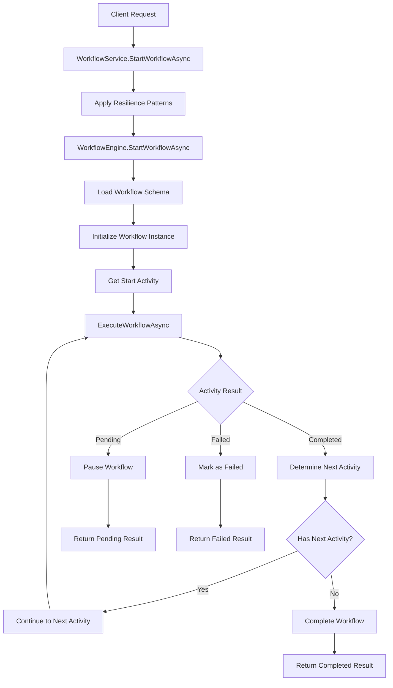
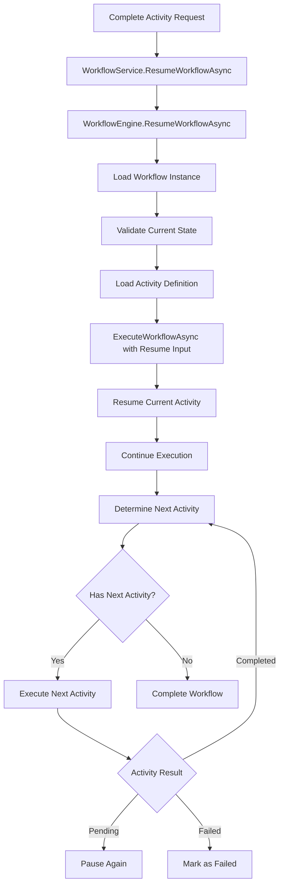
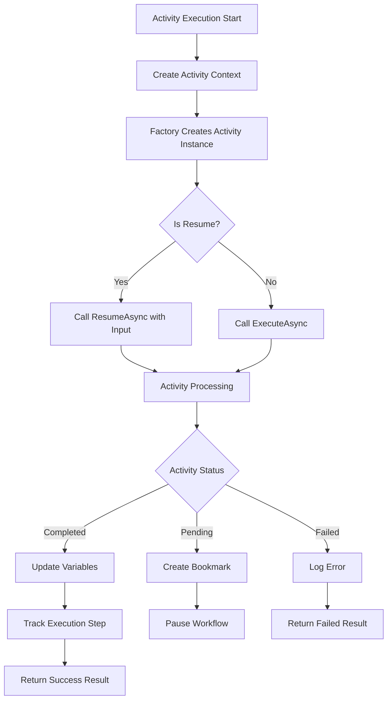

# Workflow Module Comprehensive Guide
## Architecture, Configuration, and Usage Documentation

### Table of Contents
1. [Architecture Overview](#architecture-overview)
2. [Core Components](#core-components)
3. [Workflow Execution Flow](#workflow-execution-flow)
4. [Entity Schema](#entity-schema)
5. [Background Services](#background-services)
6. [Getting Started](#getting-started)
7. [Advanced Features](#advanced-features)

---

## Architecture Overview

The Workflow Module follows a clean, layered architecture that separates concerns and provides enterprise-grade reliability patterns.

### High-Level Architecture

```
┌─────────────────────────────────────────────────────────────────┐
│                      CLIENT/API LAYER                          │
├─────────────────────────────────────────────────────────────────┤
│  Carter Endpoints (Features/)                                  │
│  • StartWorkflowEndpoint                                       │
│  • CompleteActivityEndpoint                                    │
│  • GetWorkflowDefinitionsEndpoint                             │
└─────────────────┬───────────────────────────────────────────────┘
                  │
┌─────────────────▼───────────────────────────────────────────────┐
│                    SERVICE LAYER                               │
├─────────────────────────────────────────────────────────────────┤
│  WorkflowService (Enhanced with Resilience)                   │
│  ├─ Coordinates workflow operations                           │
│  ├─ Applies resilience patterns                              │
│  └─ Delegates business logic to WorkflowEngine               │
└─────────────────┬───────────────────────────────────────────────┘
                  │
┌─────────────────▼───────────────────────────────────────────────┐
│                   ENGINE LAYER                                 │
├─────────────────────────────────────────────────────────────────┤
│  WorkflowEngine (Core Orchestration)                          │
│  ├─ StartWorkflowAsync()                                      │
│  ├─ ResumeWorkflowAsync()                                     │
│  ├─ ExecuteWorkflowAsync()                                    │
│  └─ Coordinates specialized managers                          │
│                                                               │
│  Specialized Managers:                                        │
│  ├─ FlowControlManager (Activity transitions)                │
│  ├─ WorkflowLifecycleManager (State transitions)             │
│  ├─ WorkflowStateManager (Variables & checkpoints)           │
│  └─ WorkflowPersistenceService (Data access)                 │
└─────────────────┬───────────────────────────────────────────────┘
                  │
┌─────────────────▼───────────────────────────────────────────────┐
│                 ACTIVITY LAYER                                 │
├─────────────────────────────────────────────────────────────────┤
│  Activities (Business Logic Implementation)                    │
│  ├─ TaskActivity (Human tasks)                               │
│  ├─ StartActivity, EndActivity                               │
│  ├─ ForkActivity, JoinActivity (Parallel execution)          │
│  ├─ IfElseActivity, SwitchActivity (Conditional logic)       │
│  └─ Custom Activities (AppraisalActivities)                  │
└─────────────────┬───────────────────────────────────────────────┘
                  │
┌─────────────────▼───────────────────────────────────────────────┐
│                PERSISTENCE LAYER                               │
├─────────────────────────────────────────────────────────────────┤
│  Repositories & Data Access                                   │
│  ├─ WorkflowInstanceRepository                                │
│  ├─ WorkflowActivityExecutionRepository                       │
│  ├─ WorkflowBookmarkRepository (Workflow waits)              │
│  ├─ WorkflowExecutionLogRepository (Audit trail)             │
│  └─ WorkflowOutboxRepository (Event publishing)              │
└─────────────────────────────────────────────────────────────────┘

┌─────────────────────────────────────────────────────────────────┐
│                 BACKGROUND SERVICES                            │
├─────────────────────────────────────────────────────────────────┤
│  OutboxDispatcherService    │  WorkflowTimerService            │
│  • Processes outbox events  │  • Handles timer-based bookmarks │
│  • Exponential backoff     │  • Workflow timeout detection    │
│  • Dead letter handling    │  • Automatic resumption         │
│                            │                                  │
│  WorkflowCleanupService                                       │
│  • Cleans up completed workflows                             │
│  • Archive old execution logs                                │
│  • Manages storage optimization                              │
└─────────────────────────────────────────────────────────────────┘
```

---

## Core Components

### 1. WorkflowService (Enhanced)
**Role**: Service layer coordination with resilience patterns
**Key Responsibilities**:
- Applies retry policies and fault handling
- Publishes workflow events via resilience service
- Delegates core business logic to WorkflowEngine
- Handles service-level concerns (logging, validation)

**Example Usage**:
```csharp
var workflowInstance = await _workflowService.StartWorkflowAsync(
    workflowDefinitionId: Guid.Parse("12345678-1234-1234-1234-123456789012"),
    instanceName: "Appraisal Request #AR-2024-001",
    startedBy: "user@example.com",
    initialVariables: new Dictionary<string, object>
    {
        ["RequestId"] = "AR-2024-001",
        ["PropertyType"] = "Residential",
        ["Priority"] = "High"
    },
    correlationId: "correlation-12345"
);
```

### 2. WorkflowEngine (Core Orchestrator)
**Role**: Core workflow execution orchestration
**Key Responsibilities**:
- Manages workflow execution lifecycle
- Coordinates activity execution
- Handles flow control and state management
- Processes workflow completion and failure scenarios

**Execution Flow**:
```csharp
public async Task<WorkflowExecutionResult> ExecuteWorkflowAsync(
    WorkflowSchema workflowSchema,
    WorkflowInstance workflowInstance,
    ActivityDefinition activityToExecute,
    Dictionary<string, object>? resumeInput = null,
    bool isResume = false,
    CancellationToken cancellationToken = default)
{
    // 1. Create execution context
    var context = new WorkflowExecutionContext(workflowSchema, workflowInstance);
    
    // 2. Execute activities in sequence
    var activitiesToExecute = new Queue<ActivityDefinition>();
    activitiesToExecute.Enqueue(activityToExecute);
    
    while (activitiesToExecute.Count > 0)
    {
        var currentActivity = activitiesToExecute.Dequeue();
        var activityResult = await ExecuteSingleActivityAsync(context, currentActivity, resumeInput, isResume, cancellationToken);
        
        // 3. Handle different activity results
        switch (activityResult.Status)
        {
            case ActivityResultStatus.Completed:
                // Determine next activity and continue
                break;
            case ActivityResultStatus.Pending:
                // Pause workflow for external completion
                return WorkflowExecutionResult.Pending(workflowInstance, currentActivity.Id);
            case ActivityResultStatus.Failed:
                // Mark workflow as failed
                return WorkflowExecutionResult.Failed(workflowInstance, errorMessage);
        }
    }
    
    return WorkflowExecutionResult.Completed(workflowInstance);
}
```

### 3. Specialized Managers

#### FlowControlManager
**Purpose**: Manages activity transitions and flow logic
```csharp
// Determines next activity based on current activity and result
var nextActivityId = await _flowControlManager.DetermineNextActivityAsync(
    workflowSchema, currentActivityId, activityResult, variables, cancellationToken);
```

#### WorkflowLifecycleManager
**Purpose**: Manages workflow state transitions
```csharp
// Initialize new workflow
var workflowInstance = _lifecycleManager.InitializeWorkflowAsync(
    workflowDefinitionId, workflowSchema, instanceName, startedBy, variables, correlationId);

// Transition workflow state
await _lifecycleManager.TransitionWorkflowStateAsync(
    workflowInstance, WorkflowStatus.Failed, reason, cancellationToken);
```

#### WorkflowStateManager
**Purpose**: Manages workflow variables and checkpoints
```csharp
// Update workflow variables
await _stateManager.UpdateWorkflowVariablesAsync(
    workflowInstance, outputData, cancellationToken);

// Create execution checkpoint
await _stateManager.CreateCheckpointAsync(
    workflowInstance, "Activity completed", cancellationToken);
```

---

## Workflow Execution Flow

### 1. Starting a Workflow



### 2. Resuming a Workflow



### 3. Activity Execution Lifecycle



---

## Entity Schema

### Core Entities

#### WorkflowInstance
```csharp
public class WorkflowInstance : Entity<Guid>
{
    public Guid WorkflowDefinitionId { get; private set; }
    public string Name { get; private set; }
    public WorkflowStatus Status { get; private set; }
    public DateTime StartedOn { get; private set; }
    public DateTime? CompletedOn { get; private set; }
    public string StartedBy { get; private set; }
    public string? CompletedBy { get; private set; }
    public Dictionary<string, object> Variables { get; private set; }
    public string? CorrelationId { get; private set; }
    public string? ErrorMessage { get; private set; }
    public byte[] ConcurrencyToken { get; private set; } // Optimistic concurrency
}
```

#### WorkflowActivityExecution
```csharp
public class WorkflowActivityExecution : Entity<Guid>
{
    public Guid WorkflowInstanceId { get; private set; }
    public string ActivityId { get; private set; }
    public string ActivityName { get; private set; }
    public string ActivityType { get; private set; }
    public ActivityExecutionStatus Status { get; private set; }
    public DateTime StartedOn { get; private set; }
    public DateTime? CompletedOn { get; private set; }
    public string? AssignedTo { get; private set; }
    public Dictionary<string, object>? InputData { get; private set; }
    public Dictionary<string, object>? OutputData { get; private set; }
    public byte[] ConcurrencyToken { get; private set; }
}
```

#### WorkflowBookmark (Workflow Waits)
```csharp
public class WorkflowBookmark : Entity<Guid>
{
    public Guid WorkflowInstanceId { get; private set; }
    public string ActivityId { get; private set; }
    public BookmarkType Type { get; private set; } // UserAction, Timer, ExternalMessage
    public string Key { get; private set; }
    public string? Payload { get; private set; }
    public bool IsConsumed { get; private set; }
    public DateTime? DueAt { get; private set; } // For timer-based bookmarks
    public DateTime? ConsumedAt { get; private set; }
}

public enum BookmarkType
{
    UserAction,    // Human task completion
    Timer,         // Time-based resumption
    ExternalMessage // External system callback
}
```

#### WorkflowOutbox (Event Publishing)
```csharp
public class WorkflowOutbox : Entity<Guid>
{
    public DateTime OccurredAt { get; private set; }
    public string Type { get; private set; } // Event type
    public string Payload { get; private set; } // JSON serialized event data
    public Dictionary<string, string> Headers { get; private set; }
    public int Attempts { get; private set; }
    public DateTime? NextAttemptAt { get; private set; }
    public OutboxStatus Status { get; private set; } // Pending, Processing, Processed, Failed, DeadLetter
    public Guid? WorkflowInstanceId { get; private set; }
    public string? ActivityId { get; private set; }
    public byte[] ConcurrencyToken { get; private set; }
}
```

#### WorkflowExecutionLog (Audit Trail)
```csharp
public class WorkflowExecutionLog : Entity<Guid>
{
    public Guid WorkflowInstanceId { get; private set; }
    public string? ActivityId { get; private set; }
    public string Event { get; private set; } // Event description
    public DateTime At { get; private set; }
    public Dictionary<string, object>? Details { get; private set; } // Additional context
    public string? UserId { get; private set; }
}
```

### Entity Relationships

```
WorkflowInstance (1) ──── (N) WorkflowActivityExecution
       │
       ├─── (N) WorkflowBookmark
       │
       ├─── (N) WorkflowOutbox
       │
       └─── (N) WorkflowExecutionLog

WorkflowDefinition (1) ──── (N) WorkflowInstance
```

---

## Background Services

### 1. OutboxDispatcherService
**Purpose**: Implements the outbox pattern for reliable event publishing

**Key Features**:
- Processes outbox events in batches (50 events per batch)
- Exponential backoff retry with jitter
- Dead letter handling for poison messages
- Runs every 30 seconds

**Configuration**:
```json
{
  "WorkflowResilience": {
    "Retry": {
      "MaxRetryAttempts": 3,
      "BaseDelay": "00:00:02",
      "MaxDelay": "00:00:30"
    }
  }
}
```

**Processing Flow**:
```csharp
// 1. Get pending events ready for processing
var pendingEvents = await outboxRepository.GetPendingEventsAsync(BatchSize, cancellationToken);

// 2. Process each event
foreach (var outboxEvent in pendingEvents)
{
    try
    {
        // Mark as processing
        outboxEvent.MarkAsProcessing();
        await outboxRepository.UpdateAsync(outboxEvent, cancellationToken);

        // Publish event based on type
        var success = await PublishEventAsync(outboxEvent, cancellationToken);
        
        if (success)
        {
            outboxEvent.MarkAsProcessed();
        }
        else
        {
            outboxEvent.IncrementAttempt("Publishing failed");
        }
    }
    catch (Exception ex)
    {
        outboxEvent.IncrementAttempt(ex.Message);
        
        // Move to dead letter if max attempts exceeded
        if (!outboxEvent.ShouldRetry(MaxRetryAttempts))
        {
            outboxEvent.MarkAsDeadLetter("Max retry attempts exceeded");
        }
    }
}
```

### 2. WorkflowTimerService
**Purpose**: Handles timer-based bookmarks and workflow timeouts

**Key Features**:
- Processes due timer bookmarks
- Detects and handles workflow timeouts
- Automatic workflow resumption for timer events
- Configurable processing intervals

**Processing Logic**:
```csharp
// 1. Process due timer bookmarks
var dueBookmarks = await bookmarkRepository.GetDueTimerBookmarksAsync(cancellationToken);

foreach (var bookmark in dueBookmarks)
{
    try
    {
        // Resume workflow with timer completion
        await workflowService.ResumeWorkflowAsync(
            bookmark.WorkflowInstanceId,
            bookmark.ActivityId,
            "System.Timer",
            new Dictionary<string, object> { ["TimerCompleted"] = true },
            cancellationToken: cancellationToken);
            
        // Mark bookmark as consumed
        bookmark.MarkAsConsumed();
        await bookmarkRepository.UpdateAsync(bookmark, cancellationToken);
    }
    catch (Exception ex)
    {
        _logger.LogError(ex, "Failed to process timer bookmark {BookmarkId}", bookmark.Id);
    }
}

// 2. Handle workflow timeouts
var timedOutWorkflows = await instanceRepository.GetTimedOutWorkflowsAsync(cancellationToken);

foreach (var workflow in timedOutWorkflows)
{
    await workflowService.CancelWorkflowAsync(
        workflow.Id, 
        "System.Timeout", 
        "Workflow exceeded maximum execution time", 
        cancellationToken);
}
```

### 3. WorkflowCleanupService
**Purpose**: Automated cleanup of completed workflows and old data

**Key Features**:
- Cleans up old completed workflows
- Archives execution logs
- Removes processed outbox events
- Configurable retention periods

**Cleanup Operations**:
```csharp
// 1. Clean up old completed workflows (older than 90 days)
var cutoffDate = DateTime.UtcNow.AddDays(-90);
var oldWorkflows = await instanceRepository.GetCompletedWorkflowsOlderThanAsync(cutoffDate, cancellationToken);

foreach (var workflow in oldWorkflows)
{
    // Archive or delete based on configuration
    await instanceRepository.DeleteAsync(workflow.Id, cancellationToken);
}

// 2. Clean up old execution logs (older than 1 year)
var logCutoffDate = DateTime.UtcNow.AddDays(-365);
var oldLogs = await executionLogRepository.GetLogsOlderThanAsync(logCutoffDate, cancellationToken);
await executionLogRepository.DeleteBatchAsync(oldLogs.Select(l => l.Id), cancellationToken);

// 3. Clean up processed outbox events (older than 30 days)
var outboxCutoffDate = DateTime.UtcNow.AddDays(-30);
var processedEvents = await outboxRepository.GetProcessedEventsOlderThanAsync(outboxCutoffDate, cancellationToken);
await outboxRepository.DeleteBatchAsync(processedEvents.Select(e => e.Id), cancellationToken);
```

---

## Getting Started

### 1. Basic Setup

**Add to Program.cs**:
```csharp
// Register workflow module
builder.Services.AddWorkflowModule(builder.Configuration);

// Use workflow module
app.UseWorkflowModule();
```

**Configuration (appsettings.json)**:
```json
{
  "ConnectionStrings": {
    "Database": "Server=localhost;Database=WorkflowDb;Trusted_Connection=true;"
  },
  "WorkflowResilience": {
    "Retry": {
      "MaxRetryAttempts": 3,
      "BaseDelay": "00:00:02",
      "MaxDelay": "00:00:30",
      "Jitter": 0.1
    },
    "CircuitBreaker": {
      "FailureThreshold": 5,
      "BreakDuration": "00:01:00",
      "MinimumThroughput": 10,
      "SuccessThreshold": 0.8
    },
    "Timeout": {
      "DatabaseOperation": "00:00:30",
      "ExternalHttpCall": "00:02:00",
      "ActivityExecution": "00:05:00",
      "WorkflowStartup": "00:00:30",
      "WorkflowResume": "00:00:15"
    },
    "RateLimit": {
      "WorkflowStartsPerWindow": 100,
      "WindowDuration": "00:01:00",
      "MaxConcurrentWorkflows": 50
    }
  }
}
```

### 2. Database Migration

```bash
# Generate migration for workflow entities
dotnet ef migrations add WorkflowEnhancements --project Modules/Workflow/Workflow

# Apply migration
dotnet ef database update --project Modules/Workflow/Workflow
```

### 3. Creating Your First Workflow

**Define Workflow Schema**:
```csharp
var workflowSchema = new WorkflowSchema
{
    Id = "appraisal-workflow",
    Name = "Property Appraisal Workflow",
    Description = "Complete property appraisal process",
    Category = "Appraisal",
    Variables = new Dictionary<string, object>
    {
        ["RequestId"] = "",
        ["PropertyType"] = "",
        ["AssignedAppraiser"] = "",
        ["Status"] = "Pending"
    },
    Activities = new List<ActivityDefinition>
    {
        new ActivityDefinition
        {
            Id = "start",
            Name = "Start Process",
            Type = ActivityTypes.StartActivity,
            IsStartActivity = true
        },
        new ActivityDefinition
        {
            Id = "admin-review",
            Name = "Admin Review",
            Type = AppraisalActivityTypes.AdminReview,
            RequiredRoles = new List<string> { "Admin" },
            TimeoutDuration = TimeSpan.FromDays(1)
        },
        new ActivityDefinition
        {
            Id = "staff-assignment",
            Name = "Assign Staff",
            Type = AppraisalActivityTypes.StaffAssignment,
            RequiredRoles = new List<string> { "Manager" }
        },
        new ActivityDefinition
        {
            Id = "end",
            Name = "End Process",
            Type = ActivityTypes.EndActivity,
            IsEndActivity = true
        }
    },
    Transitions = new List<TransitionDefinition>
    {
        new TransitionDefinition
        {
            Id = "start-to-admin",
            From = "start",
            To = "admin-review"
        },
        new TransitionDefinition
        {
            Id = "admin-to-assignment",
            From = "admin-review",
            To = "staff-assignment",
            Condition = "Status == 'Approved'"
        },
        new TransitionDefinition
        {
            Id = "assignment-to-end",
            From = "staff-assignment",
            To = "end"
        }
    }
};
```

**Start Workflow**:
```csharp
// Via API endpoint
POST /workflows/start
{
  "workflowDefinitionId": "12345678-1234-1234-1234-123456789012",
  "instanceName": "AR-2024-001",
  "initialVariables": {
    "RequestId": "AR-2024-001",
    "PropertyType": "Residential",
    "Priority": "High"
  },
  "correlationId": "correlation-12345"
}

// Via service injection
var result = await _workflowService.StartWorkflowAsync(
    workflowDefinitionId,
    "AR-2024-001",
    "user@example.com",
    initialVariables,
    "correlation-12345"
);
```

**Complete Activity**:
```csharp
// Via API endpoint
POST /workflows/{workflowInstanceId}/activities/{activityId}/complete
{
  "completedBy": "admin@example.com",
  "input": {
    "Status": "Approved",
    "Comments": "Property details verified",
    "ApprovalDate": "2024-09-08T10:30:00Z"
  },
  "nextAssignmentOverrides": {
    "AssignedAppraiser": {
      "type": "user",
      "value": "appraiser@example.com"
    }
  }
}

// Via service injection
var result = await _workflowService.ResumeWorkflowAsync(
    workflowInstanceId,
    activityId,
    "admin@example.com",
    completionInput,
    assignmentOverrides
);
```

---

## Advanced Features

### 1. Custom Activities

**Create Custom Activity**:
```csharp
public class CustomAppraisalActivity : WorkflowActivityBase
{
    private readonly IAppraisalService _appraisalService;
    
    public CustomAppraisalActivity(IAppraisalService appraisalService)
    {
        _appraisalService = appraisalService;
    }

    public override async Task<ActivityResult> ExecuteAsync(
        ActivityContext context, 
        CancellationToken cancellationToken)
    {
        var requestId = context.GetVariable<string>("RequestId");
        
        // Perform custom business logic
        var appraisalData = await _appraisalService.ProcessAppraisalAsync(requestId, cancellationToken);
        
        // Return result with output data
        return ActivityResult.Completed(new Dictionary<string, object>
        {
            ["AppraisalValue"] = appraisalData.Value,
            ["CompletedAt"] = DateTime.UtcNow
        });
    }

    public override async Task<ValidationResult> ValidateAsync(
        ActivityContext context, 
        CancellationToken cancellationToken)
    {
        var errors = new List<string>();
        
        if (!context.HasVariable("RequestId"))
            errors.Add("RequestId is required");
            
        return errors.Any() 
            ? ValidationResult.Invalid(errors) 
            : ValidationResult.Valid();
    }
}
```

**Register Custom Activity**:
```csharp
// In WorkflowModule.cs
services.AddScoped<CustomAppraisalActivity>();

// In WorkflowActivityFactory.cs
case "CustomAppraisal":
    return serviceProvider.GetRequiredService<CustomAppraisalActivity>();
```

### 2. Event Handling

**Subscribe to Workflow Events**:
```csharp
public class WorkflowEventHandler
{
    public async Task HandleWorkflowStartedAsync(WorkflowStartedEvent eventData)
    {
        // Send notification
        // Update external systems
        // Log for audit
    }

    public async Task HandleActivityCompletedAsync(ActivityCompletedEvent eventData)
    {
        // Update dashboards
        // Trigger external integrations
    }
}
```

### 3. Parallel Execution

**Fork and Join Activities**:
```csharp
// Fork activity - creates parallel branches
var forkActivity = new ActivityDefinition
{
    Id = "parallel-appraisals",
    Type = ActivityTypes.ForkActivity,
    Properties = new Dictionary<string, object>
    {
        ["Branches"] = new List<string> { "interior-appraisal", "exterior-appraisal" }
    }
};

// Join activity - waits for all branches to complete
var joinActivity = new ActivityDefinition
{
    Id = "consolidate-appraisals",
    Type = ActivityTypes.JoinActivity,
    Properties = new Dictionary<string, object>
    {
        ["WaitForAll"] = true,
        ["TimeoutMinutes"] = 1440 // 24 hours
    }
};
```

### 4. Conditional Logic

**If-Else Activity**:
```csharp
var conditionalActivity = new ActivityDefinition
{
    Id = "approval-decision",
    Type = ActivityTypes.IfElseActivity,
    Properties = new Dictionary<string, object>
    {
        ["Condition"] = "AppraisalValue > 500000",
        ["TrueBranch"] = "senior-review",
        ["FalseBranch"] = "standard-approval"
    }
};
```

### 5. External Service Integration

**Two-Phase External Calls**:
```csharp
public class ExternalServiceActivity : WorkflowActivityBase
{
    private readonly ITwoPhaseExternalCallService _externalCallService;
    
    public override async Task<ActivityResult> ExecuteAsync(
        ActivityContext context, 
        CancellationToken cancellationToken)
    {
        // Phase 1: Prepare external call
        var callId = await _externalCallService.PrepareExternalCallAsync(
            "PropertyValuationService",
            "GetMarketValue",
            context.Variables,
            cancellationToken);
            
        // Phase 2: Execute external call
        var result = await _externalCallService.ExecuteExternalCallAsync(
            callId, 
            cancellationToken);
            
        if (result.IsSuccess)
        {
            return ActivityResult.Completed(result.Data);
        }
        else
        {
            return ActivityResult.Failed(result.ErrorMessage);
        }
    }
}
```

---

## Monitoring and Troubleshooting

### 1. Logging
The workflow module uses structured logging with correlation IDs:

```csharp
// Sample log output
2024-09-08 10:30:15 [INF] ORCHESTRATION: Starting workflow for definition 12345678-1234-1234-1234-123456789012, correlationId correlation-12345
2024-09-08 10:30:16 [DBG] ENGINE: Starting execution of activity start of type StartActivity
2024-09-08 10:30:16 [INF] SERVICE: Successfully started workflow instance 87654321-4321-4321-4321-876543210987
```

### 2. Metrics
Track workflow performance through `IWorkflowResilienceService.GetMetricsAsync()`:

```csharp
public record ResilienceMetrics(
    int TotalRetries,
    int CircuitBreakerTrips,
    int TimeoutOccurrences,
    int RateLimitExceeded,
    Dictionary<string, ServiceMetrics> ServiceMetrics
);
```

### 3. Common Issues

**Issue**: Workflow stuck in pending state
**Cause**: Missing bookmark or activity completion
**Solution**: Check `WorkflowBookmark` table for unconsumed bookmarks

**Issue**: Outbox events not processing
**Cause**: OutboxDispatcherService not running or configuration issues
**Solution**: Check background service logs and configuration

**Issue**: Concurrency conflicts
**Cause**: Multiple processes trying to update the same workflow
**Solution**: Optimistic concurrency control with `ConcurrencyToken` handles this automatically with retry

---

This comprehensive guide covers the core architecture, configuration options, and usage patterns for the Workflow Module. For specific configuration options and API references, see the additional documentation files.