# Workflow Module Visual Diagrams
## Architecture Visualizations and Flow Charts

### Table of Contents
1. [System Architecture Diagrams](#system-architecture-diagrams)
2. [Workflow Execution Flow](#workflow-execution-flow)
3. [Database Schema Diagrams](#database-schema-diagrams)
4. [Background Services Architecture](#background-services-architecture)
5. [API Integration Patterns](#api-integration-patterns)
6. [Error Handling Flows](#error-handling-flows)
7. [Configuration Hierarchy](#configuration-hierarchy)

---

## System Architecture Diagrams

### 1. High-Level System Architecture

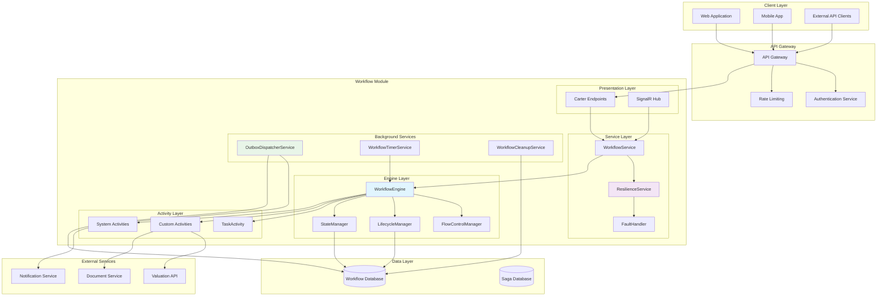

### 2. Workflow Service Architecture Detail

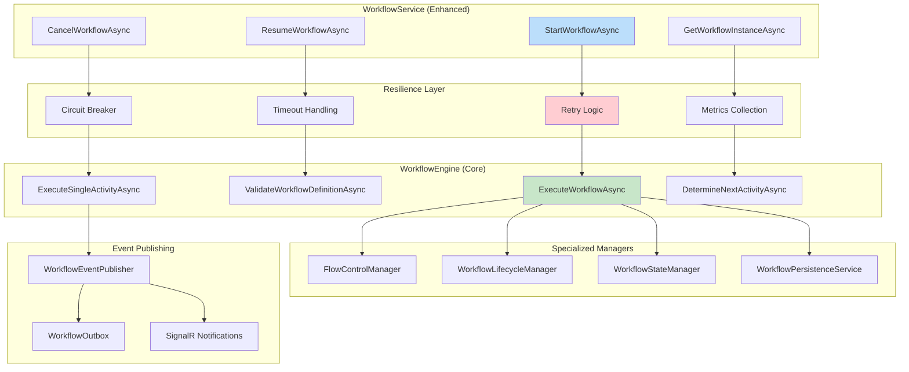

---

## Workflow Execution Flow

### 3. Complete Workflow Execution Flow

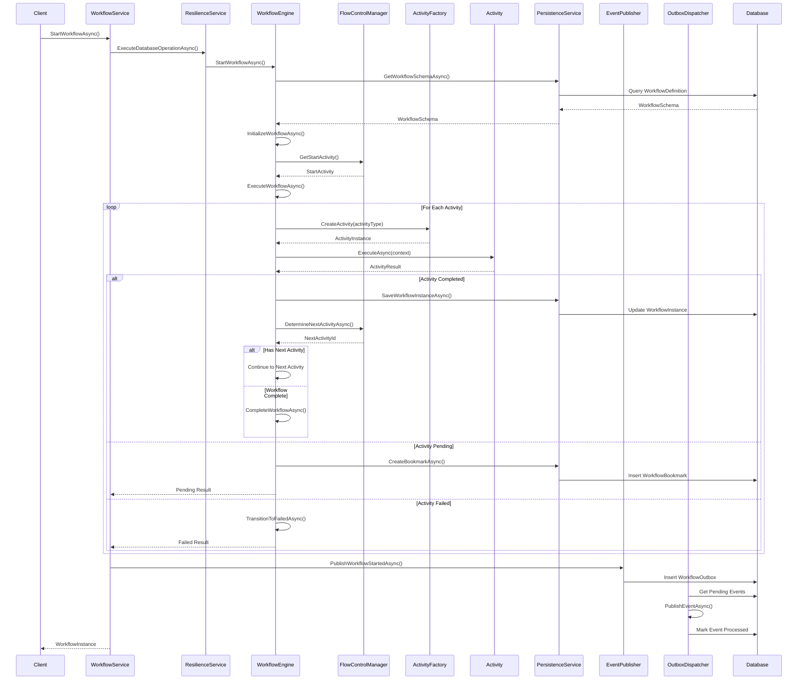

### 4. Activity Completion Flow

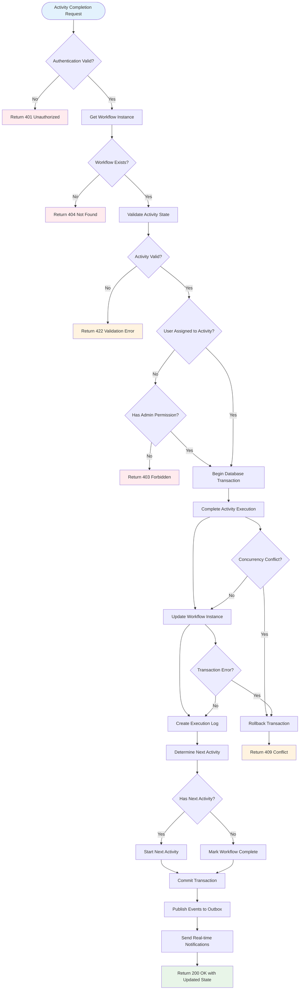

### 5. Background Services Processing Flow

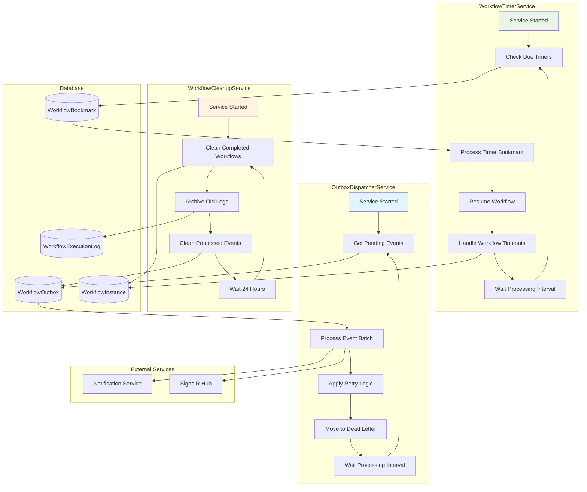

---

## Database Schema Diagrams

### 6. Entity Relationship Diagram

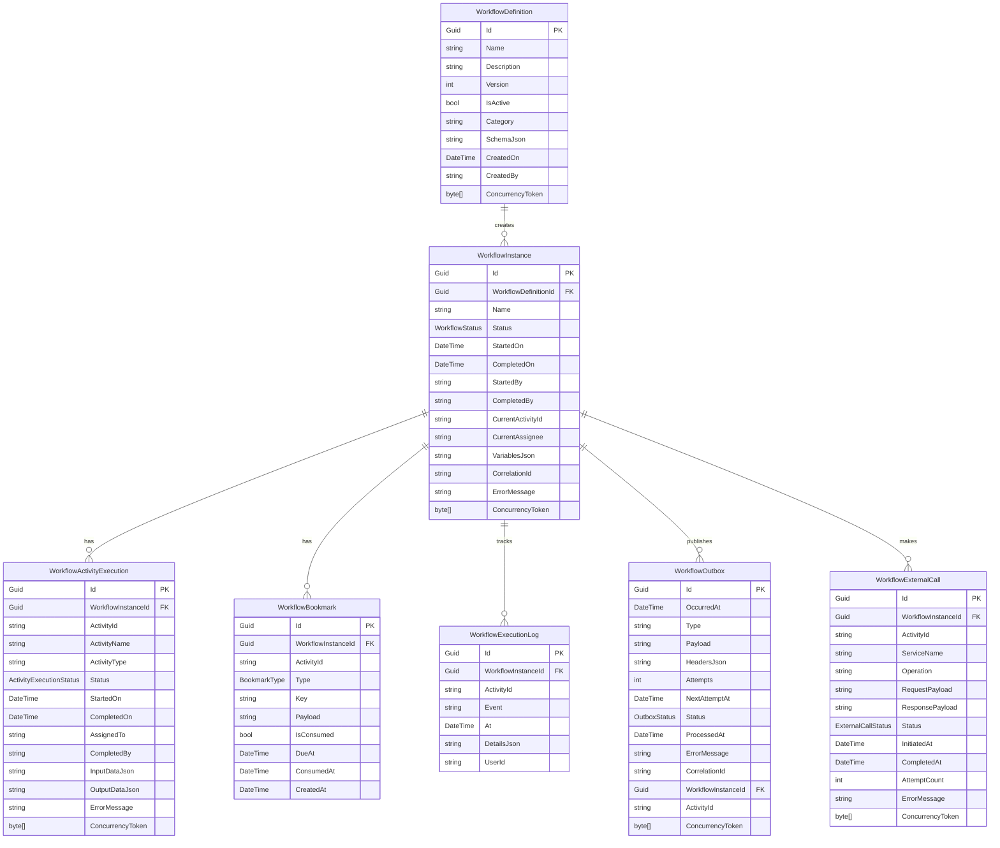

### 7. Database Indexes and Performance

```mermaid
graph TD
    subgraph "Performance Indexes"
        WI_Status[WorkflowInstance.Status]
        WI_Correlation[WorkflowInstance.CorrelationId]
        WI_StartedBy[WorkflowInstance.StartedBy]
        WI_CurrentAssignee[WorkflowInstance.CurrentAssignee]
        
        WAE_WorkflowId[WorkflowActivityExecution.WorkflowInstanceId]
        WAE_Status[WorkflowActivityExecution.Status]
        WAE_AssignedTo[WorkflowActivityExecution.AssignedTo]
        
        WB_DueAt[WorkflowBookmark.DueAt + IsConsumed]
        WB_Type[WorkflowBookmark.Type + IsConsumed]
        
        WO_Status[WorkflowOutbox.Status + NextAttemptAt]
        WO_Type[WorkflowOutbox.Type]
        
        WEL_WorkflowId[WorkflowExecutionLog.WorkflowInstanceId + At]
    end
    
    subgraph "Query Patterns"
        Q1[Find Active Workflows]
        Q2[Get User Tasks]
        Q3[Process Due Timers]
        Q4[Process Outbox Events]
        Q5[Audit Trail Query]
    end
    
    Q1 --> WI_Status
    Q2 --> WAE_AssignedTo
    Q2 --> WAE_Status
    Q3 --> WB_DueAt
    Q4 --> WO_Status
    Q5 --> WEL_WorkflowId
    
    style WI_Status fill:#e3f2fd
    style WAE_Status fill:#e8f5e8
    style WB_DueAt fill:#fff3e0
    style WO_Status fill:#fce4ec
```

---

## Background Services Architecture

### 8. Outbox Pattern Implementation

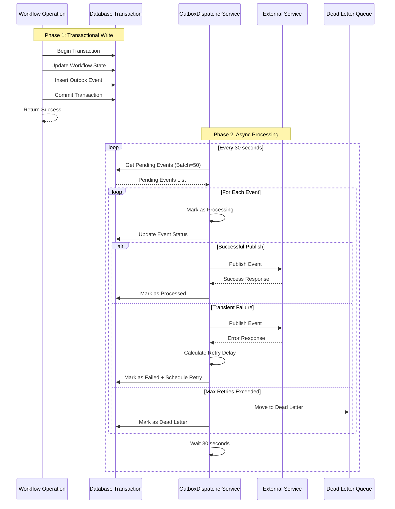

### 9. Timer Service Processing

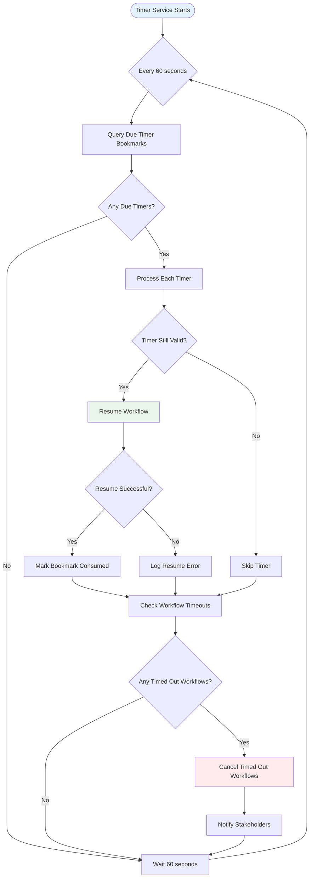

---

## API Integration Patterns

### 10. Authentication and Authorization Flow

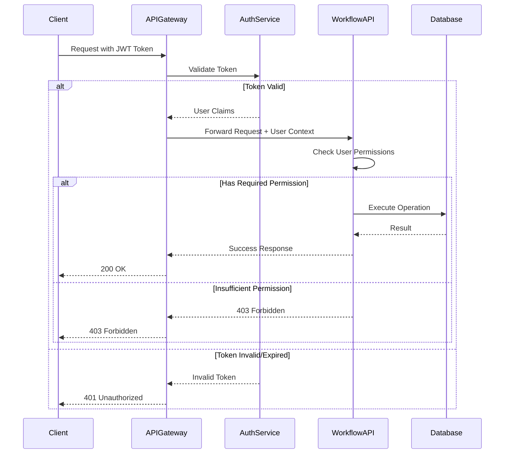

### 11. Rate Limiting and Circuit Breaker

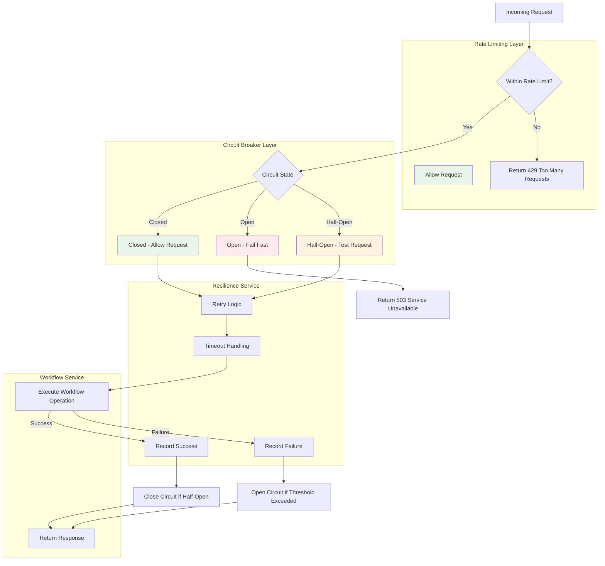

---

## Error Handling Flows

### 12. Fault Handling and Recovery

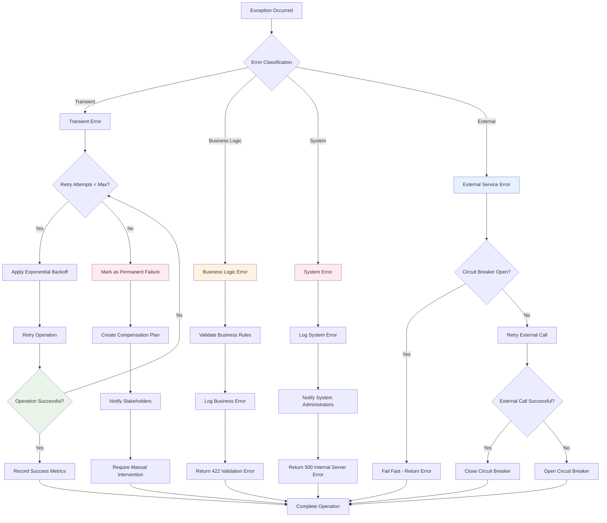

### 13. Concurrency Conflict Resolution

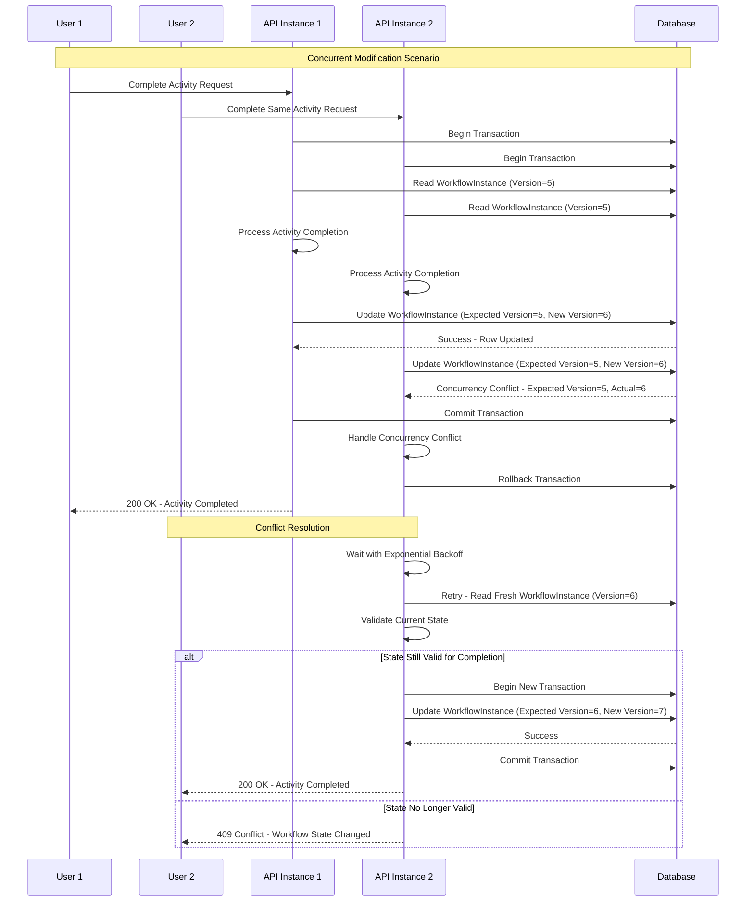

---

## Configuration Hierarchy

### 14. Configuration Sources and Precedence

```mermaid
graph TD
    subgraph "Configuration Hierarchy (Highest to Lowest Priority)"
        EnvVars[Environment Variables]
        UserSecrets[User Secrets - Development]
        EnvSpecific[appsettings.{Environment}.json]
        BaseSettings[appsettings.json]
        DefaultValues[Code Default Values]
    end
    
    subgraph "Configuration Sections"
        WorkflowResilience[WorkflowResilience]
        ConnectionStrings[ConnectionStrings]
        Logging[Logging]
        MockSupervisor[MockSupervisor]
    end
    
    subgraph "Validation Layer"
        ConfigValidation[Configuration Validation]
        StartupValidation[Startup Validation]
        RuntimeValidation[Runtime Health Checks]
    end
    
    subgraph "Application Startup"
        ConfigBuilder[ConfigurationBuilder]
        DependencyInjection[Service Registration]
        OptionsPattern[Options Pattern Binding]
        ApplicationStart[Application Start]
    end
    
    EnvVars --> ConfigBuilder
    UserSecrets --> ConfigBuilder
    EnvSpecific --> ConfigBuilder
    BaseSettings --> ConfigBuilder
    DefaultValues --> ConfigBuilder
    
    ConfigBuilder --> WorkflowResilience
    ConfigBuilder --> ConnectionStrings
    ConfigBuilder --> Logging
    ConfigBuilder --> MockSupervisor
    
    WorkflowResilience --> ConfigValidation
    ConnectionStrings --> ConfigValidation
    ConfigValidation --> StartupValidation
    StartupValidation --> RuntimeValidation
    
    ConfigBuilder --> DependencyInjection
    DependencyInjection --> OptionsPattern
    OptionsPattern --> ApplicationStart
    
    style EnvVars fill:#ffcdd2
    style BaseSettings fill:#e8f5e8
    style ConfigValidation fill:#fff3e0
```

### 15. Environment-Specific Configuration

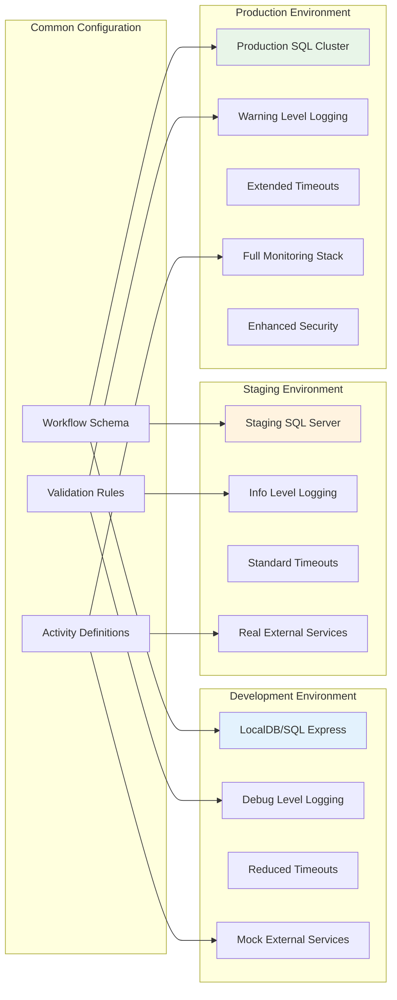

---

These visual diagrams provide comprehensive architectural and flow visualizations for the Workflow Module. They can be rendered using Mermaid-compatible tools and help teams understand the system's structure, data flow, and operational patterns at a glance.