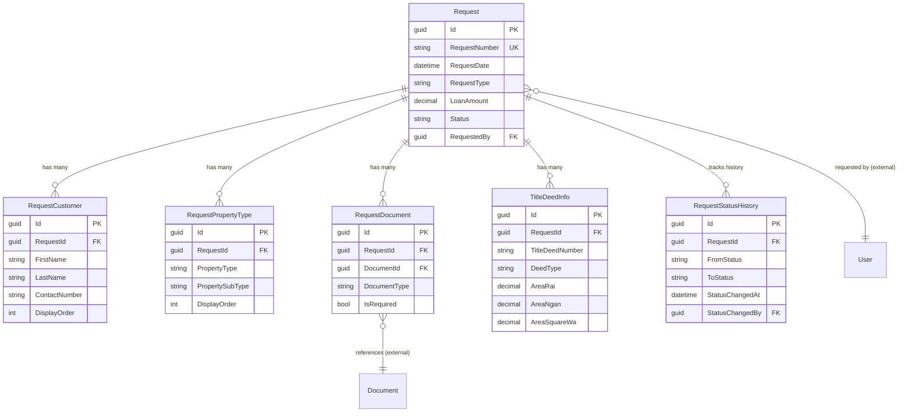

# Request Management Module - Data Model

## Overview

The Request Management module handles the complete lifecycle of appraisal requests from creation to submission. It supports both manual creation by Relationship Managers (RM) and automated integration from Loan Origination Systems (LOS).

### Key Features
- One-to-many customer tracking per request
- One-to-many property type tracking per request
- Document attachment management
- Title deed information storage
- Request status tracking and audit trail
- LOS system integration support

## Module Structure

```
Request Module
├── Request (Aggregate Root)
├── RequestCustomer (Customer Info - One-to-Many)
├── RequestPropertyType (Property Types - One-to-Many)
├── RequestDocument (Document Links)
├── TitleDeedInfo (Legal Documentation)
└── RequestStatusHistory (Audit Trail)
```

## Entity Relationship Diagram



**Legend:**
- **Solid lines** = Internal module relationships (with FK constraints)
- **"(external)"** = References to other modules (no FK constraints)
- Only key fields shown for clarity

## Core Tables

### 1. Requests (Aggregate Root)

The main request entity that tracks appraisal requests.

#### SQL Schema

```sql
CREATE TABLE request.Requests
(
    -- Primary Key
    Id                      UNIQUEIDENTIFIER PRIMARY KEY DEFAULT NEWSEQUENTIALID(),

    -- Business Key
    RequestNumber           NVARCHAR(50) UNIQUE NOT NULL,           -- Auto-generated: REQ-2025-00001

    -- Request Information
    RequestDate             DATETIME2 NOT NULL DEFAULT GETUTCDATE(),
    RequestType             NVARCHAR(50) NOT NULL,                  -- NewLoan, Refinance, Revaluation
    LoanApplicationNumber   NVARCHAR(100) NULL,                     -- From LOS system
    LoanAmount              DECIMAL(18,2) NULL,
    LoanCurrency            NVARCHAR(3) NOT NULL DEFAULT 'THB',

    -- Purpose
    AppraisalPurpose        NVARCHAR(100) NOT NULL,                 -- Collateral, Insurance, Sale
    SpecialInstructions     NVARCHAR(MAX) NULL,

    -- Priority & Due Date
    Priority                NVARCHAR(20) NOT NULL DEFAULT 'Normal', -- Low, Normal, High, Urgent
    RequestedDueDate        DATETIME2 NULL,

    -- Status
    Status                  NVARCHAR(50) NOT NULL DEFAULT 'Draft',  -- Draft, Submitted, Assigned, Completed, Cancelled
    SubmittedAt             DATETIME2 NULL,
    CompletedAt             DATETIME2 NULL,

    -- Requestor Information
    RequestedBy             UNIQUEIDENTIFIER NOT NULL,              -- FK to auth.Users (RM)
    RequestedByName         NVARCHAR(200) NOT NULL,
    RequestedByEmail        NVARCHAR(200) NOT NULL,
    RequestedByPhone        NVARCHAR(50) NULL,

    -- Branch/Department
    BranchCode              NVARCHAR(50) NOT NULL,
    BranchName              NVARCHAR(200) NOT NULL,
    DepartmentCode          NVARCHAR(50) NULL,
    DepartmentName          NVARCHAR(200) NULL,

    -- LOS Integration
    SourceSystem            NVARCHAR(50) NOT NULL DEFAULT 'Manual', -- Manual, LOS_CoreBanking, LOS_External
    ExternalReferenceId     NVARCHAR(100) NULL,
    IntegrationPayload      NVARCHAR(MAX) NULL,                     -- JSON payload from LOS

    -- Cancellation
    CancellationReason      NVARCHAR(500) NULL,
    CancelledBy             UNIQUEIDENTIFIER NULL,
    CancelledAt             DATETIME2 NULL,

    -- Audit Fields
    CreatedOn               DATETIME2 NOT NULL DEFAULT GETUTCDATE(),
    CreatedBy               UNIQUEIDENTIFIER NOT NULL,
    UpdatedOn               DATETIME2 NOT NULL DEFAULT GETUTCDATE(),
    UpdatedBy               UNIQUEIDENTIFIER NOT NULL,
    RowVersion              ROWVERSION NOT NULL,

    -- Soft Delete
    IsDeleted               BIT NOT NULL DEFAULT 0,
    DeletedOn               DATETIME2 NULL,
    DeletedBy               UNIQUEIDENTIFIER NULL,

    -- Indexes will be added separately
    CONSTRAINT CK_Request_LoanAmount CHECK (LoanAmount IS NULL OR LoanAmount > 0),
    CONSTRAINT CK_Request_Status CHECK (Status IN ('Draft', 'Submitted', 'Assigned', 'InProgress', 'Completed', 'Cancelled')),
    CONSTRAINT CK_Request_Priority CHECK (Priority IN ('Low', 'Normal', 'High', 'Urgent'))
);
```

### 2. RequestCustomers (One-to-Many)

Stores simplified customer information for each request. A request can have multiple customers (e.g., co-borrowers, guarantors).

#### SQL Schema

```sql
CREATE TABLE request.RequestCustomers
(
    -- Primary Key
    Id                      UNIQUEIDENTIFIER PRIMARY KEY DEFAULT NEWSEQUENTIALID(),

    -- Foreign Key
    RequestId               UNIQUEIDENTIFIER NOT NULL,

    -- Customer Information (Simplified)
    FirstName               NVARCHAR(200) NOT NULL,
    LastName                NVARCHAR(200) NOT NULL,
    ContactNumber           NVARCHAR(50) NULL,                      -- Phone number

    -- Order
    DisplayOrder            INT NOT NULL DEFAULT 0,

    -- Audit Fields
    CreatedOn               DATETIME2 NOT NULL DEFAULT GETUTCDATE(),
    CreatedBy               UNIQUEIDENTIFIER NOT NULL,
    UpdatedOn               DATETIME2 NOT NULL DEFAULT GETUTCDATE(),
    UpdatedBy               UNIQUEIDENTIFIER NOT NULL,

    CONSTRAINT FK_RequestCustomer_Request FOREIGN KEY (RequestId)
        REFERENCES request.Requests(Id) ON DELETE CASCADE
);
```

### 3. RequestPropertyTypes (One-to-Many)

Stores simplified property type information for each request. A request can include multiple property types (e.g., land, building, land and building).

**Property Type Examples**:
- `Land` - Land only
- `Building` - Building only
- `LandAndBuilding` - Land with building
- `Condo` - Condominium unit
- `Vehicle` - Car, motorcycle, truck
- `Vessel` - Boat, ship, yacht
- `Machinery` - Industrial equipment

**Property SubType Examples**:
- For `LandAndBuilding`: SingleHouse, Townhouse, Commercial, Shophouse
- For `Building`: Commercial, Warehouse, Factory
- For `Condo`: Apartment, Studio, Penthouse
- For `Vehicle`: Car, Truck, Motorcycle
- For `Vessel`: Boat, Ship, Yacht
- For `Machinery`: Industrial, Agricultural, Construction

#### SQL Schema

```sql
CREATE TABLE request.RequestPropertyTypes
(
    -- Primary Key
    Id                      UNIQUEIDENTIFIER PRIMARY KEY DEFAULT NEWSEQUENTIALID(),

    -- Foreign Key
    RequestId               UNIQUEIDENTIFIER NOT NULL,

    -- Property Type (Simplified)
    PropertyType            NVARCHAR(50) NOT NULL,                  -- Land, Building, LandAndBuilding, Condo, Vehicle, Vessel, Machinery
    PropertySubType         NVARCHAR(100) NULL,                     -- SingleHouse, Townhouse, Commercial, etc.

    -- Order
    DisplayOrder            INT NOT NULL DEFAULT 0,

    -- Audit Fields
    CreatedOn               DATETIME2 NOT NULL DEFAULT GETUTCDATE(),
    CreatedBy               UNIQUEIDENTIFIER NOT NULL,
    UpdatedOn               DATETIME2 NOT NULL DEFAULT GETUTCDATE(),
    UpdatedBy               UNIQUEIDENTIFIER NOT NULL,

    CONSTRAINT FK_RequestPropertyType_Request FOREIGN KEY (RequestId)
        REFERENCES request.Requests(Id) ON DELETE CASCADE,
    CONSTRAINT CK_RequestPropertyType_Type CHECK (PropertyType IN ('Land', 'Building', 'LandAndBuilding', 'Condo', 'Vehicle', 'Vessel', 'Machinery'))
);
```

### 4. RequestDocuments

Links documents to requests. Documents are stored in the Document module.

#### SQL Schema

```sql
CREATE TABLE request.RequestDocuments
(
    -- Primary Key
    Id                      UNIQUEIDENTIFIER PRIMARY KEY DEFAULT NEWSEQUENTIALID(),

    -- Foreign Keys
    RequestId               UNIQUEIDENTIFIER NOT NULL,
    DocumentId              UNIQUEIDENTIFIER NOT NULL,              -- References document.Documents

    -- Document Classification
    DocumentType            NVARCHAR(100) NOT NULL,                 -- TitleDeed, IDCard, HouseRegistration
    DocumentCategory        NVARCHAR(50) NOT NULL,                  -- Required, Optional, Supporting
    IsRequired              BIT NOT NULL DEFAULT 0,

    -- Document Information
    DocumentDescription     NVARCHAR(500) NULL,
    PageCount               INT NULL,

    -- Upload Information
    UploadedBy              UNIQUEIDENTIFIER NOT NULL,
    UploadedAt              DATETIME2 NOT NULL DEFAULT GETUTCDATE(),

    -- Verification
    IsVerified              BIT NOT NULL DEFAULT 0,
    VerifiedBy              UNIQUEIDENTIFIER NULL,
    VerifiedAt              DATETIME2 NULL,
    VerificationNotes       NVARCHAR(MAX) NULL,

    -- Order
    DisplayOrder            INT NOT NULL DEFAULT 0,

    -- Audit Fields
    CreatedOn               DATETIME2 NOT NULL DEFAULT GETUTCDATE(),
    CreatedBy               UNIQUEIDENTIFIER NOT NULL,
    UpdatedOn               DATETIME2 NOT NULL DEFAULT GETUTCDATE(),
    UpdatedBy               UNIQUEIDENTIFIER NOT NULL,

    CONSTRAINT FK_RequestDocument_Request FOREIGN KEY (RequestId)
        REFERENCES request.Requests(Id) ON DELETE CASCADE,
    -- No FK to document.Documents (cross-module reference)
    CONSTRAINT UQ_RequestDocument_RequestId_DocumentId UNIQUE (RequestId, DocumentId)
);
```

### 5. TitleDeedInfo

Stores detailed title deed information for land/building properties.

#### SQL Schema

```sql
CREATE TABLE request.TitleDeedInfo
(
    -- Primary Key
    Id                      UNIQUEIDENTIFIER PRIMARY KEY DEFAULT NEWSEQUENTIALID(),

    -- Foreign Key
    RequestId               UNIQUEIDENTIFIER NOT NULL,
    RequestPropertyTypeId   UNIQUEIDENTIFIER NULL,                  -- Optional link to specific property

    -- Title Deed Information
    TitleDeedNumber         NVARCHAR(100) NOT NULL,                 -- โฉนดเลขที่
    DeedType                NVARCHAR(50) NOT NULL,                  -- Chanote, NorSor3, NorSor3Kor, NorSor4
    IssueDate               DATE NULL,
    IssueOffice             NVARCHAR(200) NULL,

    -- Survey Information
    SurveyNumber            NVARCHAR(100) NULL,                     -- เลขที่ดิน
    SurveySheet             NVARCHAR(50) NULL,                      -- ระวาง
    ParcelNumber            NVARCHAR(50) NULL,                      -- แปลงที่

    -- Location
    SubDistrict             NVARCHAR(200) NOT NULL,                 -- ตำบล/แขวง
    District                NVARCHAR(200) NOT NULL,                 -- อำเภอ/เขต
    Province                NVARCHAR(200) NOT NULL,                 -- จังหวัด

    -- Area (Thai Land Measurement)
    AreaRai                 DECIMAL(18,2) NULL,                     -- ไร่
    AreaNgan                DECIMAL(18,2) NULL,                     -- งาน
    AreaSquareWa            DECIMAL(18,2) NULL,                     -- ตารางวา
    TotalSquareMeters       DECIMAL(18,2) NULL,                     -- Calculated total in sq.m.

    -- Ownership
    OwnerName               NVARCHAR(500) NOT NULL,
    OwnerIdCard             NVARCHAR(50) NULL,
    OwnershipType           NVARCHAR(50) NOT NULL,                  -- FullOwnership, CoOwnership, Usufruct
    OwnershipPercentage     DECIMAL(5,2) NULL,

    -- Encumbrances
    HasMortgage             BIT NOT NULL DEFAULT 0,
    MortgageeBank           NVARCHAR(200) NULL,
    MortgageAmount          DECIMAL(18,2) NULL,
    MortgageDate            DATE NULL,

    HasLease                BIT NOT NULL DEFAULT 0,
    LeaseDetails            NVARCHAR(MAX) NULL,

    HasEasement             BIT NOT NULL DEFAULT 0,
    EasementDetails         NVARCHAR(MAX) NULL,

    OtherEncumbrances       NVARCHAR(MAX) NULL,

    -- Land Use & Zoning
    LandUseType             NVARCHAR(100) NULL,                     -- Agricultural, Residential, Commercial
    ZoningDesignation       NVARCHAR(100) NULL,

    -- Notes
    Notes                   NVARCHAR(MAX) NULL,

    -- Order
    DisplayOrder            INT NOT NULL DEFAULT 0,

    -- Audit Fields
    CreatedOn               DATETIME2 NOT NULL DEFAULT GETUTCDATE(),
    CreatedBy               UNIQUEIDENTIFIER NOT NULL,
    UpdatedOn               DATETIME2 NOT NULL DEFAULT GETUTCDATE(),
    UpdatedBy               UNIQUEIDENTIFIER NOT NULL,

    CONSTRAINT FK_TitleDeedInfo_Request FOREIGN KEY (RequestId)
        REFERENCES request.Requests(Id) ON DELETE CASCADE,
    CONSTRAINT FK_TitleDeedInfo_PropertyType FOREIGN KEY (RequestPropertyTypeId)
        REFERENCES request.RequestPropertyTypes(Id),
    CONSTRAINT CK_TitleDeedInfo_DeedType CHECK (DeedType IN ('Chanote', 'NorSor3', 'NorSor3Kor', 'NorSor4', 'PorBorTor5')),
    CONSTRAINT CK_TitleDeedInfo_OwnershipType CHECK (OwnershipType IN ('FullOwnership', 'CoOwnership', 'Usufruct', 'Superficies')),
    CONSTRAINT CK_TitleDeedInfo_Area CHECK (AreaRai >= 0 AND AreaNgan >= 0 AND AreaSquareWa >= 0)
);
```

### 6. RequestStatusHistory

Tracks status changes and provides complete audit trail.

#### SQL Schema

```sql
CREATE TABLE request.RequestStatusHistory
(
    -- Primary Key
    Id                      UNIQUEIDENTIFIER PRIMARY KEY DEFAULT NEWSEQUENTIALID(),

    -- Foreign Key
    RequestId               UNIQUEIDENTIFIER NOT NULL,

    -- Status Change
    FromStatus              NVARCHAR(50) NULL,                      -- NULL for initial status
    ToStatus                NVARCHAR(50) NOT NULL,
    StatusChangedAt         DATETIME2 NOT NULL DEFAULT GETUTCDATE(),
    StatusChangedBy         UNIQUEIDENTIFIER NOT NULL,
    StatusChangedByName     NVARCHAR(200) NOT NULL,

    -- Change Details
    ChangeReason            NVARCHAR(500) NULL,
    Comments                NVARCHAR(MAX) NULL,

    -- System Information
    IpAddress               NVARCHAR(50) NULL,
    UserAgent               NVARCHAR(500) NULL,

    -- Audit Fields
    CreatedOn               DATETIME2 NOT NULL DEFAULT GETUTCDATE(),

    CONSTRAINT FK_RequestStatusHistory_Request FOREIGN KEY (RequestId)
        REFERENCES request.Requests(Id) ON DELETE CASCADE
);
```

## Indexes

```sql
-- Request indexes
CREATE INDEX IX_Request_RequestNumber ON request.Requests(RequestNumber);
CREATE INDEX IX_Request_Status ON request.Requests(Status) WHERE IsDeleted = 0;
CREATE INDEX IX_Request_RequestedBy ON request.Requests(RequestedBy) WHERE IsDeleted = 0;
CREATE INDEX IX_Request_BranchCode ON request.Requests(BranchCode) WHERE IsDeleted = 0;
CREATE INDEX IX_Request_RequestDate ON request.Requests(RequestDate DESC) WHERE IsDeleted = 0;
CREATE INDEX IX_Request_Status_Priority ON request.Requests(Status, Priority) WHERE IsDeleted = 0;
CREATE INDEX IX_Request_LoanApplicationNumber ON request.Requests(LoanApplicationNumber) WHERE LoanApplicationNumber IS NOT NULL;

-- RequestCustomer indexes
CREATE INDEX IX_RequestCustomer_RequestId ON request.RequestCustomers(RequestId);
CREATE INDEX IX_RequestCustomer_Name ON request.RequestCustomers(FirstName, LastName);

-- RequestPropertyType indexes
CREATE INDEX IX_RequestPropertyType_RequestId ON request.RequestPropertyTypes(RequestId);
CREATE INDEX IX_RequestPropertyType_PropertyType ON request.RequestPropertyTypes(PropertyType);

-- RequestDocument indexes
CREATE INDEX IX_RequestDocument_RequestId ON request.RequestDocuments(RequestId);
CREATE INDEX IX_RequestDocument_DocumentId ON request.RequestDocuments(DocumentId);
CREATE INDEX IX_RequestDocument_DocumentType ON request.RequestDocuments(DocumentType);

-- TitleDeedInfo indexes
CREATE INDEX IX_TitleDeedInfo_RequestId ON request.TitleDeedInfo(RequestId);
CREATE INDEX IX_TitleDeedInfo_TitleDeedNumber ON request.TitleDeedInfo(TitleDeedNumber);
CREATE INDEX IX_TitleDeedInfo_Province ON request.TitleDeedInfo(Province);

-- RequestStatusHistory indexes
CREATE INDEX IX_RequestStatusHistory_RequestId ON request.RequestStatusHistory(RequestId);
CREATE INDEX IX_RequestStatusHistory_StatusChangedAt ON request.RequestStatusHistory(StatusChangedAt DESC);
```

## C# Entity Models

### Request Entity

```csharp
namespace CollateralAppraisal.Modules.Request.Models;

public class Request : AggregateRoot
{
    // Primary Key
    public Guid Id { get; private set; }

    // Business Key
    public string RequestNumber { get; private set; } = string.Empty;

    // Request Information
    public DateTime RequestDate { get; private set; }
    public RequestType RequestType { get; private set; }
    public string? LoanApplicationNumber { get; private set; }
    public decimal? LoanAmount { get; private set; }
    public string LoanCurrency { get; private set; } = "THB";

    // Purpose
    public string AppraisalPurpose { get; private set; } = string.Empty;
    public string? SpecialInstructions { get; private set; }

    // Priority & Due Date
    public Priority Priority { get; private set; }
    public DateTime? RequestedDueDate { get; private set; }

    // Status
    public RequestStatus Status { get; private set; }
    public DateTime? SubmittedAt { get; private set; }
    public DateTime? CompletedAt { get; private set; }

    // Requestor Information
    public Guid RequestedBy { get; private set; }
    public string RequestedByName { get; private set; } = string.Empty;
    public string RequestedByEmail { get; private set; } = string.Empty;
    public string? RequestedByPhone { get; private set; }

    // Branch/Department
    public string BranchCode { get; private set; } = string.Empty;
    public string BranchName { get; private set; } = string.Empty;
    public string? DepartmentCode { get; private set; }
    public string? DepartmentName { get; private set; }

    // LOS Integration
    public string SourceSystem { get; private set; } = "Manual";
    public string? ExternalReferenceId { get; private set; }
    public string? IntegrationPayload { get; private set; }

    // Collections (One-to-Many)
    private readonly List<RequestCustomer> _customers = new();
    public IReadOnlyCollection<RequestCustomer> Customers => _customers.AsReadOnly();

    private readonly List<RequestPropertyType> _propertyTypes = new();
    public IReadOnlyCollection<RequestPropertyType> PropertyTypes => _propertyTypes.AsReadOnly();

    private readonly List<RequestDocument> _documents = new();
    public IReadOnlyCollection<RequestDocument> Documents => _documents.AsReadOnly();

    private readonly List<TitleDeedInfo> _titleDeeds = new();
    public IReadOnlyCollection<TitleDeedInfo> TitleDeeds => _titleDeeds.AsReadOnly();

    private readonly List<RequestStatusHistory> _statusHistory = new();
    public IReadOnlyCollection<RequestStatusHistory> StatusHistory => _statusHistory.AsReadOnly();

    // Constructor
    private Request() { }

    public static Request Create(
        string requestNumber,
        RequestType requestType,
        string appraisalPurpose,
        Guid requestedBy,
        string requestedByName,
        string requestedByEmail,
        string branchCode,
        string branchName,
        Priority priority = Priority.Normal)
    {
        var request = new Request
        {
            Id = Guid.NewGuid(),
            RequestNumber = requestNumber,
            RequestDate = DateTime.UtcNow,
            RequestType = requestType,
            AppraisalPurpose = appraisalPurpose,
            RequestedBy = requestedBy,
            RequestedByName = requestedByName,
            RequestedByEmail = requestedByEmail,
            BranchCode = branchCode,
            BranchName = branchName,
            Priority = priority,
            Status = RequestStatus.Draft
        };

        request.AddStatusHistory(null, RequestStatus.Draft, requestedBy, requestedByName, "Request created");

        return request;
    }

    // Methods
    public void AddCustomer(RequestCustomer customer)
    {
        _customers.Add(customer);
    }

    public void AddPropertyType(RequestPropertyType propertyType)
    {
        _propertyTypes.Add(propertyType);
    }

    public void AddDocument(RequestDocument document)
    {
        _documents.Add(document);
    }

    public void AddTitleDeed(TitleDeedInfo titleDeed)
    {
        _titleDeeds.Add(titleDeed);
    }

    public void Submit(Guid submittedBy, string submittedByName)
    {
        if (Status != RequestStatus.Draft)
            throw new InvalidOperationException("Only draft requests can be submitted");

        Status = RequestStatus.Submitted;
        SubmittedAt = DateTime.UtcNow;

        AddStatusHistory(RequestStatus.Draft, RequestStatus.Submitted, submittedBy, submittedByName, "Request submitted");

        // Publish domain event
        AddDomainEvent(new RequestSubmittedEvent(Id, RequestNumber));
    }

    private void AddStatusHistory(RequestStatus? fromStatus, RequestStatus toStatus, Guid changedBy, string changedByName, string? reason)
    {
        _statusHistory.Add(new RequestStatusHistory
        {
            RequestId = Id,
            FromStatus = fromStatus,
            ToStatus = toStatus,
            StatusChangedBy = changedBy,
            StatusChangedByName = changedByName,
            ChangeReason = reason
        });
    }
}
```

### RequestCustomer Entity

```csharp
public class RequestCustomer : Entity
{
    public Guid Id { get; private set; }
    public Guid RequestId { get; private set; }

    // Simplified customer information
    public string FirstName { get; private set; } = string.Empty;
    public string LastName { get; private set; } = string.Empty;
    public string? ContactNumber { get; private set; }

    public int DisplayOrder { get; private set; }

    // Constructor
    private RequestCustomer() { }

    public static RequestCustomer Create(
        Guid requestId,
        string firstName,
        string lastName,
        string? contactNumber,
        int displayOrder = 0)
    {
        return new RequestCustomer
        {
            Id = Guid.NewGuid(),
            RequestId = requestId,
            FirstName = firstName,
            LastName = lastName,
            ContactNumber = contactNumber,
            DisplayOrder = displayOrder
        };
    }

    public string GetFullName() => $"{FirstName} {LastName}";
}
```

### RequestPropertyType Entity

```csharp
public class RequestPropertyType : Entity
{
    public Guid Id { get; private set; }
    public Guid RequestId { get; private set; }

    // Simplified property type information
    public PropertyType PropertyType { get; private set; }
    public string? PropertySubType { get; private set; }

    public int DisplayOrder { get; private set; }

    // Constructor
    private RequestPropertyType() { }

    public static RequestPropertyType Create(
        Guid requestId,
        PropertyType propertyType,
        string? propertySubType = null,
        int displayOrder = 0)
    {
        return new RequestPropertyType
        {
            Id = Guid.NewGuid(),
            RequestId = requestId,
            PropertyType = propertyType,
            PropertySubType = propertySubType,
            DisplayOrder = displayOrder
        };
    }
}
```

## Enumerations

```csharp
public enum RequestType
{
    NewLoan,
    Refinance,
    Revaluation,
    Insurance,
    Sale
}

public enum RequestStatus
{
    Draft,
    Submitted,
    Assigned,
    InProgress,
    Completed,
    Cancelled
}

public enum Priority
{
    Low,
    Normal,
    High,
    Urgent
}

public enum PropertyType
{
    Land,                // Land only
    Building,            // Building only
    LandAndBuilding,     // Land with building (most common for houses)
    Condo,               // Condominium unit
    Vehicle,             // Car, truck, motorcycle
    Vessel,              // Boat, ship, yacht
    Machinery            // Industrial, agricultural, construction equipment
}
```

---

**Next**: See [15-sample-data.md](15-sample-data.md) for complete sample data examples.
