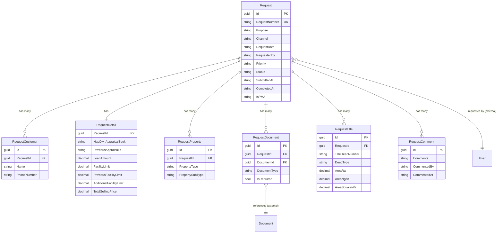

# Request Management Module - Data Model

## Overview

The Request Management module handles the complete lifecycle of appraisal requests from creation to submission. It supports both manual creation by Relationship Managers (RM) and automated integration from Loan Origination Systems (LOS).

### Key Features
- One-to-many customer tracking per request
- One-to-many property type tracking per request
- Document attachment management
- Title deed information storage
- Request status tracking and audit trail
- LOS system integration support

## Module Structure

```
Request Module
├── Request (Aggregate Root)
├── RequestDetail (Request Details - One-to-One)
├── RequestCustomer (Customer Info - One-to-Many)
├── RequestProperty (Property Types - One-to-Many)
├── RequestDocument (Document Links - One-to-Many)
├── RequestTitle (Legal Documentation - One-to-Many)
└── RequestComment (User Comments - One-to-Many)
```

## Entity Relationship Diagram



**Legend:**
- **Solid lines** = Internal module relationships (with FK constraints)
- **"(external)"** = References to other modules (no FK constraints)
- Only key fields shown for clarity

## Core Tables

### 1. Requests (Aggregate Root)

The main request entity that tracks appraisal requests.

#### SQL Schema

```sql
CREATE TABLE request.Requests
(
    -- Primary Key
    Id                      UNIQUEIDENTIFIER PRIMARY KEY DEFAULT NEWSEQUENTIALID(),

    -- Business Key
    RequestNumber           NVARCHAR(10) UNIQUE NOT NULL,           -- Auto-generated: REQ-000001-2025

    -- Purpose
    Purpose                 NVARCHAR(10) NOT NULL,

    -- Source System
    Channel                 NVARCHAR(10) NOT NULL DEFAULT 'Manual', -- Manual, LOS, CLS
    RequestDate             DATETIME2 NOT NULL DEFAULT GETDATE(),
    RequestedBy             NVARCHAR(30) NOT NULL,

    -- Priority & Due Date
    Priority                NVARCHAR(10) NOT NULL DEFAULT 'Normal', -- Normal, High

    -- Status
    Status                  NVARCHAR(20) NOT NULL DEFAULT 'Draft',  -- Draft, Submitted, Assigned, Completed, Cancelled
    SubmittedAt             DATETIME2 NULL,
    CompletedAt             DATETIME2 NULL,

    -- Soft Delete
    IsDeleted               BIT NOT NULL DEFAULT 0,
    DeletedOn               DATETIME2 NULL,
    DeletedBy               UNIQUEIDENTIFIER NULL,

    -- Special Flags
    IsPMA                   BIT NOT NULL DEFAULT 0,

    -- Audit Fields
    CreatedOn               DATETIME2 NOT NULL DEFAULT GETDATE(),
    CreatedBy               UNIQUEIDENTIFIER NOT NULL,
    UpdatedOn               DATETIME2 NOT NULL DEFAULT GETDATE(),
    UpdatedBy               UNIQUEIDENTIFIER NOT NULL,

    CONSTRAINT CK_Request_LoanAmount CHECK (LoanAmount IS NULL OR LoanAmount > 0),
    CONSTRAINT CK_Request_Status CHECK (Status IN ('Draft', 'Submitted', 'Assigned', 'InProgress', 'Completed', 'Cancelled')),
    CONSTRAINT CK_Request_Priority CHECK (Priority IN ('Normal', 'High'))
);
```
### 2. RequestDetail (One-to-One)

Stores detailed information about the request.

#### SQL Schema

```sql
CREATE TABLE request.RequestDetail
(
    -- Primary Key
    RequestId                      UNIQUEIDENTIFIER NOT NULL

    -- Request Information
    HasOwnAppraisalBook            BIT NOT NULL DEFAULT 0,

    -- Original Appraisal
    PreviousAppraisalId            UNIQUEIDENTIFIER NULL,
    
    -- Loan Information
    LoanApplicationNo              NVARCHAR(20) NULL,                     -- From LOS system
    BankingSegment                 NVARCHAR(10) NULL,                      -- LOS, CLS
    FacilityLimit                  DECIMAL(19,4) NULL,
    PreviousFacilityLimit          DECIMAL(19,4) NULL,
    AdditionalFacilityLimit        DECIMAL(19,4) NULL,
    TotalSellingPrice              DECIMAL(19,4) NULL,
    
    -- Location
    HouseNo                        NVARCHAR(30) NULL,
    RoomNo                         NVARCHAR(30) NULL,
    FloorNo                        NVARCHAR(10) NULL,
    ProjectName                    NVARCHAR(100) NULL,
    Moo                            NVARCHAR(50) NULL,
    Soi                            NVARCHAR(100) NULL,
    Road                           NVARCHAR(100) NULL,
    SubDistrict                    NVARCHAR(50) NOT NULL
    District                       NVARCHAR(50) NOT NULL,
    Province                       NVARCHAR(50) NOT NULL,
    Postcode                       NVARCHAR(10) NULL
    ContactPersonName              NVARCHAR(100) NOT NULL,
    ContactPersonPhone             NVARCHAR(40) NOT NULL
    ProjectCode                    NVARCHAR(10) NULL,
    
    -- Appointment
    AppointmentDateTime            DATETIME2 NULL,
    AppointmentLocation            NVARCHAR(200) NULL
    
    -- Fee
    FeePaymentType                 NVARCHAR(10) NOT NULL,
    AbsorbedFee                    DECIMAL(19,4) NULL,
    FeeNotes                       NVARCHAR(MAX) NULL
)
```

### 2. RequestCustomers (One-to-Many)

Stores simplified customer information for each request. A request can have multiple customers (e.g., co-borrowers, guarantors).

#### SQL Schema

```sql
CREATE TABLE request.RequestCustomers
(
    -- Primary Key
    Id                      BIGINT,

    -- Foreign Key
    RequestId               UNIQUEIDENTIFIER NOT NULL,

    -- Customer Information (Simplified)
    Name                    NVARCHAR(100) NOT NULL,
    ContactNumber             NVARCHAR(50) NULL,                      -- Phone number

    CONSTRAINT FK_RequestCustomer_Request FOREIGN KEY (RequestId)
        REFERENCES request.Requests(Id) ON DELETE CASCADE
);
```

### 3. RequestProperties (One-to-Many)

Stores simplified property type information for each request. A request can include multiple property types (e.g., land, building, land and building).

**Property Type Examples**:
- `Land` - Land only
- `Building` - Building only
- `LandAndBuilding` - Land with building
- `Condo` - Condominium unit
- `Vehicle` - Car, motorcycle, truck
- `Vessel` - Boat, ship, yacht
- `Machinery` - Industrial equipment

**Property SubType Examples**:
- For `LandAndBuilding`: SingleHouse, Townhouse, Commercial, Shophouse
- For `Building`: Commercial, Warehouse, Factory
- For `Condo`: Apartment, Studio, Penthouse
- For `Vehicle`: Car, Truck, Motorcycle
- For `Vessel`: Boat, Ship, Yacht
- For `Machinery`: Industrial, Agricultural, Construction

#### SQL Schema

```sql
CREATE TABLE request.RequestPropertyTypes
(
    -- Primary Key
    Id                      UNIQUEIDENTIFIER PRIMARY KEY DEFAULT NEWSEQUENTIALID(),

    -- Foreign Key
    RequestId               UNIQUEIDENTIFIER NOT NULL,

    -- Property Type (Simplified)
    PropertyType            NVARCHAR(50) NOT NULL,                  -- Land, Building, LandAndBuilding, Condo, Vehicle, Vessel, Machinery
    BuildingType         NVARCHAR(100) NULL,                     -- SingleHouse, Townhouse, Commercial, etc.
    SellingPrice            DECIMAL(19,4) NULL

    CONSTRAINT FK_RequestProperty_Request FOREIGN KEY (RequestId)
        REFERENCES request.Requests(Id) ON DELETE CASCADE,
    CONSTRAINT CK_RequestProperty_Type CHECK (PropertyType IN ('Land', 'Building', 'LandAndBuilding', 'Condo', 'Vehicle', 'Vessel', 'Machinery'))
);
```

### 4. RequestDocuments

Links documents to requests. Documents are stored in the Document module.

#### SQL Schema

```sql
CREATE TABLE request.RequestDocuments
(
    -- Primary Key
    Id                      UNIQUEIDENTIFIER PRIMARY KEY DEFAULT NEWSEQUENTIALID(),

    -- Foreign Keys
    RequestId               UNIQUEIDENTIFIER NOT NULL,
    DocumentId              UNIQUEIDENTIFIER NOT NULL,              -- References document.Documents

    -- Document Classification
    DocumentType            NVARCHAR(100) NOT NULL,                 -- TitleDeed, IDCard, HouseRegistration
    IsRequired              BIT NOT NULL DEFAULT 0,

    -- Document Information
    DocumentDescription     NVARCHAR(500) NULL,

    -- Upload Information
    UploadedBy              UNIQUEIDENTIFIER NOT NULL,
    UploadedAt              DATETIME2 NOT NULL DEFAULT GETUTCDATE(),

    -- Audit Fields
    CreatedOn               DATETIME2 NOT NULL DEFAULT GETUTCDATE(),
    CreatedBy               UNIQUEIDENTIFIER NOT NULL,
    UpdatedOn               DATETIME2 NOT NULL DEFAULT GETUTCDATE(),
    UpdatedBy               UNIQUEIDENTIFIER NOT NULL,

    CONSTRAINT FK_RequestDocument_Request FOREIGN KEY (RequestId)
        REFERENCES request.Requests(Id) ON DELETE CASCADE,
    CONSTRAINT UQ_RequestDocument_RequestId_DocumentId UNIQUE (RequestId, DocumentId)
);
```

### 5. RequestTitles (One-to-Many)

Stores detailed title deed information for land/building properties.

#### SQL Schema

```sql
CREATE TABLE request.RequestTitles
(
    -- Primary Key
    Id                      UNIQUEIDENTIFIER PRIMARY KEY DEFAULT NEWSEQUENTIALID(),

    -- Foreign Key
    RequestId               UNIQUEIDENTIFIER NOT NULL,

    -- Title Deed Information
    TitleDeedNumber         NVARCHAR(100) NOT NULL,                 -- โฉนดเลขที่
    DeedType                NVARCHAR(50) NOT NULL,                  -- Chanote, NorSor3, NorSor3Kor

    -- Survey Information
    Rawang                  NVARCHAR(100) NULL,                     -- ระวาง
    LandNumber              NVARCHAR(50) NULL,                      -- เลขที่ดิน
    SurveyNumber            NVARCHAR(50) NULL,                      -- หน้าสำรวจ

    -- Area (Thai Land Measurement)
    AreaRai                 INT NULL,                               -- ไร่
    AreaNgan                INT NULL,                               -- งาน
    AreaSquareWa            DECIMAL(5,2) NULL,                      -- ตารางวา

    -- Adress
    HouseNo                 NVARCHAR(30) NULL,
    RoomNo                  NVARCHAR(30) NULL,
    FloorNo                 NVARCHAR(10) NULL,
    BuildingNo              NVARCHAR(100) NULL,
    ProjectName             NVARCHAR(100) NULL,
    Moo                     NVARCHAR(50) NULL,
    Soi                     NVARCHAR(100) NULL,
    Road                    NVARCHAR(100) NULL,
    SubDistrict             NVARCHAR(50) NOT NULL,                  -- ตำบล/แขวง    
    District                NVARCHAR(50) NOT NULL,                  -- อำเภอ/เขต
    Province                NVARCHAR(50) NOT NULL,                  -- จังหวัด
    Postcode                NVARCHAR(10) NULL
        
    -- DOPA Address
    DOPAHouseNo             NVARCHAR(30) NULL,
    DOPAProjectName         NVARCHAR(100) NULL,
    DOPAMoo                 NVARCHAR(50) NULL,
    DOPASoi                 NVARCHAR(100) NULL,
    DOPARoad                NVARCHAR(100) NULL,
    DOPASubDistrict         NVARCHAR(50) NOT NULL
    DOPADistrict            NVARCHAR(50) NOT NULL,
    DOPAProvince            NVARCHAR(50) NOT NULL,
    DOPAPostcode            NVARCHAR(10) NULL
    
    -- Ownership
    OwnerName               NVARCHAR(500) NOT NULL,
    
    -- Building Information
    BuildingType            NVARCHAR(10) NULL,
    UsableArea              DECIMAL(19,4) NULL,
    NumberOfBuilding        INT NULL,
    
    -- ID (Vehicle, Machinery)
    RegistrationNumber      NVARCHAR(50) NULL,
    RegistrationStatus      NVARCHAR(10) NULL,
    ChassisNumber           NVARCHAR(50) NULL,                      -- For Vehicle
    
    -- Vehicle
    VehicleType             NVARCHAR(10) NULL,
    
    -- Vessel
    VesselType              NVARCHAR(10) NULL,
    
    -- Machinery
    MachineryType           NVARCHAR(10) NULL,
    InstallationStatus      NVARCHAR(10) NULL,
    InvoiceNumber           NVARCHAR(20) NULL,
    NumberOfMachinery       INT NULL,
    
    -- Notes
    Notes                   NVARCHAR(MAX) NULL,

    -- Audit Fields
    CreatedOn               DATETIME2 NOT NULL DEFAULT GETDATE(),
    CreatedBy               UNIQUEIDENTIFIER NOT NULL,
    UpdatedOn               DATETIME2 NOT NULL DEFAULT GETDATE(),
    UpdatedBy               UNIQUEIDENTIFIER NOT NULL,

    CONSTRAINT FK_RequestTitles_Request FOREIGN KEY (RequestId)
        REFERENCES request.Requests(Id) ON DELETE CASCADE,
    CONSTRAINT CK_RequestTitles_DeedType CHECK (DeedType IN ('Chanote', 'NorSor3', 'NorSor3Kor')),
    CONSTRAINT CK_RequestTitles_Area CHECK (AreaRai >= 0 AND AreaNgan >= 0 AND AreaSquareWa >= 0)
);
```

### 6. RequestStatusHistory

Tracks status changes and provides complete audit trail.

#### SQL Schema

```sql
CREATE TABLE request.RequestStatusHistory
(
    -- Primary Key
    Id                      UNIQUEIDENTIFIER PRIMARY KEY DEFAULT NEWSEQUENTIALID(),

    -- Foreign Key
    RequestId               UNIQUEIDENTIFIER NOT NULL,

    -- Status Change
    FromStatus              NVARCHAR(50) NULL,                      -- NULL for initial status
    ToStatus                NVARCHAR(50) NOT NULL,
    StatusChangedAt         DATETIME2 NOT NULL DEFAULT GETUTCDATE(),
    StatusChangedBy         UNIQUEIDENTIFIER NOT NULL,

    -- Change Details
    ChangeReason            NVARCHAR(500) NULL,
    Comments                NVARCHAR(MAX) NULL,

    -- Audit Fields
    CreatedOn               DATETIME2 NOT NULL DEFAULT GETDATE(),
    CreatedBy               UNIQUEIDENTIFIER NOT NULL,
    UpdatedOn               DATETIME2 NOT NULL DEFAULT GETDATE(),
    UpdatedBy               UNIQUEIDENTIFIER NOT NULL,

    CONSTRAINT FK_RequestStatusHistory_Request FOREIGN KEY (RequestId)
        REFERENCES request.Requests(Id) ON DELETE CASCADE
);
```

### 7. RequestComments

Allows users to leave comments on requests.

#### SQL Schema

```sql
CREATE TABLE request.RequestComments
(
    -- Primary Key
    Id                      UNIQUEIDENTIFIER PRIMARY KEY DEFAULT NEWSEQUENTIALID(),
    Comments                NVARCHAR(MAX) NULL
    CommentedBy             UNIQUEIDENTIFIER NOT NULL,
    CommentedAt             DATETIME2 NOT NULL DEFAULT GETDATE(),
    
    -- Audit Fields
    CreatedOn               DATETIME2 NOT NULL DEFAULT GETDATE(),
    CreatedBy               UNIQUEIDENTIFIER NOT NULL,
    UpdatedOn               DATETIME2 NOT NULL DEFAULT GETDATE(),
    UpdatedBy               UNIQUEIDENTIFIER NOT NULL,

    CONSTRAINT FK_RequestComment_Request FOREIGN KEY (RequestId)
        REFERENCES request.Requests(Id) ON DELETE CASCADE
)
```

## Indexes

```sql
-- Request indexes
CREATE INDEX IX_Request_RequestNumber ON request.Requests(RequestNumber);
CREATE INDEX IX_Request_Status ON request.Requests(Status) WHERE IsDeleted = 0;
CREATE INDEX IX_Request_RequestedBy ON request.Requests(RequestedBy) WHERE IsDeleted = 0;
CREATE INDEX IX_Request_RequestDate ON request.Requests(RequestDate DESC) WHERE IsDeleted = 0;
CREATE INDEX IX_Request_Status_Priority ON request.Requests(Status, Priority) WHERE IsDeleted = 0;
CREATE INDEX IX_Request_LoanApplicationNumber ON request.Requests(LoanApplicationNumber) WHERE LoanApplicationNumber IS NOT NULL;

-- RequestCustomer indexes
CREATE INDEX IX_RequestCustomer_RequestId ON request.RequestCustomers(RequestId);
CREATE INDEX IX_RequestCustomer_Name ON request.RequestCustomers(Name);

-- RequestProperty indexes
CREATE INDEX IX_RequestProperty_RequestId ON request.RequestPropertyTypes(RequestId);
CREATE INDEX IX_RequestProperty_PropertyType ON request.RequestProperty(PropertyType);

-- RequestDocument indexes
CREATE INDEX IX_RequestDocument_RequestId ON request.RequestDocuments(RequestId);
CREATE INDEX IX_RequestDocument_DocumentId ON request.RequestDocuments(DocumentId);
CREATE INDEX IX_RequestDocument_DocumentType ON request.RequestDocuments(DocumentType);

-- RequestTitle indexes
CREATE INDEX IX_TitleDeedInfo_RequestId ON request.TitleDeedInfo(RequestId);
CREATE INDEX IX_TitleDeedInfo_TitleDeedNumber ON request.TitleDeedInfo(TitleDeedNumber);
CREATE INDEX IX_TitleDeedInfo_Province ON request.TitleDeedInfo(Province);

-- RequestStatusHistory indexes
CREATE INDEX IX_RequestStatusHistory_RequestId ON request.RequestStatusHistory(RequestId);
CREATE INDEX IX_RequestStatusHistory_StatusChangedAt ON request.RequestStatusHistory(StatusChangedAt DESC);
```

## Enumerations

```csharp
public enum RequestStatus
{
    Draft,
    Submitted,
    Assigned,
    InProgress,
    Completed,
    Cancelled
}

public enum Priority
{
    Normal,
    High
}

public enum PropertyType
{
    Land,                // Land only
    Building,            // Building only
    LandAndBuilding,     // Land with building (most common for houses)
    Condo,               // Condominium unit
    Vehicle,             // Car, truck, motorcycle
    Vessel,              // Boat, ship, yacht
    Machinery            // Industrial, agricultural, construction equipment
}
```

---
