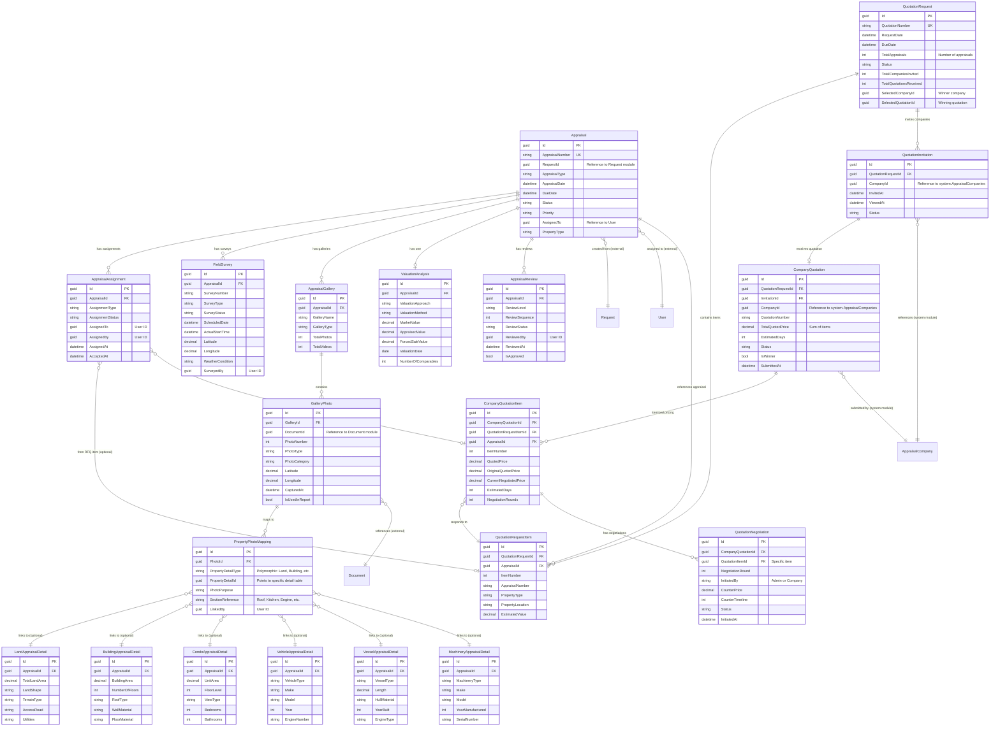

# Appraisal Module - Data Model

## Overview

The Appraisal Module handles the complete appraisal lifecycle from assignment to completion. It supports field surveys, property-specific detail capture, photo gallery management, valuation analysis, and multi-level review workflows.

### Key Features
- Appraisal assignment and tracking
- Field survey management with GPS
- Property-specific detail tables (6 types)
- Two-phase photo gallery workflow
- Valuation analysis and comparables
- Multi-level review workflow (Checker → Verifier → Committee)
- Report generation

## Module Structure

```
Appraisal Module
├── Appraisal (Aggregate Root)
├── AppraisalAssignment (Assignment Tracking)
├── QuotationRequest (RFQ Management)
├── QuotationInvitation (Company Invitations)
├── CompanyQuotation (Company Submissions)
├── QuotationNegotiation (Counter-offers & Negotiations)
├── FieldSurvey (Site Visit Records)
├── PropertyInformation (General Property Info)
├── ValuationAnalysis (Valuation Calculations)
├── AppraisalReport (Generated Reports)
├── AppraisalReview (Review Workflow)
├── AppraisalGallery (Photo Container)
├── GalleryPhoto (Individual Photos)
├── PropertyPhotoMapping (Link Photos to Sections)
├── PhotoAnnotation (Photo Markups)
├── VideoRecording (Video Files)
├── AudioNote (Voice Notes)
├── UploadSession (Batch Upload Tracking)
└── Property Detail Tables (6 types: Land, Building, Condo, Vehicle, Vessel, Machinery)
```

**Note:** `AppraisalCompanies` (external vendor registry) is maintained in the **System Module** and referenced by this module for external assignments and quotations.

## Entity Relationship Diagram



**Legend:**
- **Solid lines** = Internal module relationships (with FK constraints)
- **"(external)"** = References to other modules (no FK constraints)
- **"(system module)"** = References to System Module tables (no FK constraints)
- **"(optional)"** = PropertyPhotoMapping uses polymorphic reference - only ONE property detail type is linked
- Only key fields shown for clarity; see full schemas above for complete field lists

**Key Design Notes:**
1. **Quotation Workflow**: Optional RFQ process for external assignments - admin can send RFQ to multiple companies, receive quotes, negotiate, and select winner
2. **Two-Phase Photo Workflow**: Photos uploaded to Gallery first, then linked to PropertyDetail via PropertyPhotoMapping
3. **Polymorphic Mapping**: PropertyPhotoMapping can link to ANY property detail type (Land, Building, Condo, Vehicle, Vessel, Machinery)
4. **Cross-Module References**: RequestId, DocumentId, and CompanyId stored without FK constraints
5. **Review Workflow**: Sequential reviews (Checker → Verifier → Committee) tracked in AppraisalReview

## Core Tables

### 1. Appraisals (Aggregate Root)

Main appraisal entity that tracks the entire appraisal process.

#### SQL Schema

```sql
CREATE TABLE appraisal.Appraisals
(
    -- Primary Key
    Id                      UNIQUEIDENTIFIER PRIMARY KEY DEFAULT NEWSEQUENTIALID(),

    -- Business Key
    AppraisalNumber         NVARCHAR(50) UNIQUE NOT NULL,           -- Auto-generated: 6700001

    -- Request Reference (from Request Module)
    RequestId               UNIQUEIDENTIFIER NOT NULL,              -- No FK constraint (cross-module)

    -- Appraisal Information
    AppraisalType           NVARCHAR(50) NOT NULL,                  -- Initial, Revaluation, Special
    AppraisalPurpose        NVARCHAR(10) NOT NULL,
    AppraisalDate           DATETIME2 NOT NULL,
    DueDate                 DATETIME2 NULL,
    CompletedDate           DATETIME2 NULL,

    -- Status & Priority
    Status                  NVARCHAR(50) NOT NULL DEFAULT 'Pending', -- Pending, Assigned, FieldSurvey, InProgress, Review, Completed, Cancelled
    Priority                NVARCHAR(20) NOT NULL DEFAULT 'Normal',  -- Normal, High

    -- Audit Fields
    CreatedOn               DATETIME2 NOT NULL DEFAULT GETDATE(),
    CreatedBy               UNIQUEIDENTIFIER NOT NULL,
    UpdatedOn               DATETIME2 NOT NULL DEFAULT GETDATE(),
    UpdatedBy               UNIQUEIDENTIFIER NOT NULL,
    RowVersion              ROWVERSION NOT NULL,

    CONSTRAINT CK_Appraisal_Status CHECK (Status IN ('Pending', 'Assigned', 'FieldSurvey', 'InProgress', 'Review', 'Completed', 'Cancelled')),
    CONSTRAINT CK_Appraisal_Priority CHECK (Priority IN ('Normal', 'High')),
    CONSTRAINT CK_Appraisal_PropertyType CHECK (PropertyType IN ('Land', 'Building', 'LandAndBuilding', 'Condo', 'Vehicle', 'Vessel', 'Machinery'))
);
```

### 2. AppraisalAssignments

Tracks individual appraisal assignments. Links back to quotation items when assignment comes from RFQ process.

#### SQL Schema

```sql
CREATE TABLE appraisal.AppraisalAssignments
(
    -- Primary Key
    Id                      UNIQUEIDENTIFIER PRIMARY KEY DEFAULT NEWSEQUENTIALID(),

    -- Foreign Keys
    AppraisalId             UNIQUEIDENTIFIER NOT NULL,
    QuotationRequestId      UNIQUEIDENTIFIER NULL,                -- Optional: from which RFQ
    QuotationRequestItemId  UNIQUEIDENTIFIER NULL,                -- Optional: which item in RFQ
    SelectedQuotationId     UNIQUEIDENTIFIER NULL,                -- Optional: winning quotation
    SelectedQuotationItemId UNIQUEIDENTIFIER NULL,                -- Optional: specific item pricing

    -- Assignment Details
    AssignmentType          NVARCHAR(50) NOT NULL,                -- Initial, Reassignment, Escalation
    AssignmentMode          NVARCHAR(50) NOT NULL,                -- Internal, External
    AssignmentStatus        NVARCHAR(50) NOT NULL,                -- Pending, Accepted, Rejected, Cancelled

    -- Internal PIC (always assigned)
    InternalPIC             UNIQUEIDENTIFIER NOT NULL,            -- FK to auth.Users
    InternalPICName         NVARCHAR(200) NOT NULL,

    -- Internal Assignment (when AssignmentMode = 'Internal')
    AssignedTo              UNIQUEIDENTIFIER NULL,                -- FK to auth.Users
    AssignedToName          NVARCHAR(200) NULL,

    -- External Assignment (when AssignmentMode = 'External')
    ExternalCompanyId       UNIQUEIDENTIFIER NULL,                -- References system.AppraisalCompanies
    ExternalCompanyName     NVARCHAR(200) NULL,

    -- Agreement Terms (from selected quotation item)
    AgreedPrice             DECIMAL(18,2) NULL,
    AgreedCurrency          NVARCHAR(3) DEFAULT 'THB',
    AgreedTimeline          INT NULL,                             -- Days
    AgreedDueDate           DATE NULL,

    -- Assignment Metadata
    AssignedBy              UNIQUEIDENTIFIER NOT NULL,            -- Admin who made assignment
    AssignedByName          NVARCHAR(200) NOT NULL,
    AssignedAt              DATETIME2 NOT NULL DEFAULT GETUTCDATE(),

    -- Response
    AcceptedAt              DATETIME2 NULL,
    RejectedAt              DATETIME2 NULL,
    RejectionReason         NVARCHAR(500) NULL,

    -- Notes
    Notes                   NVARCHAR(MAX) NULL,
    SpecialInstructions     NVARCHAR(MAX) NULL,

    -- Audit Fields
    CreatedOn               DATETIME2 NOT NULL DEFAULT GETUTCDATE(),
    CreatedBy               UNIQUEIDENTIFIER NOT NULL,
    UpdatedOn               DATETIME2 NOT NULL DEFAULT GETUTCDATE(),
    UpdatedBy               UNIQUEIDENTIFIER NOT NULL,

    CONSTRAINT FK_AppraisalAssignment_Appraisal FOREIGN KEY (AppraisalId)
        REFERENCES appraisal.Appraisals(Id) ON DELETE CASCADE,
    CONSTRAINT FK_AppraisalAssignment_QuotationRequest FOREIGN KEY (QuotationRequestId)
        REFERENCES appraisal.QuotationRequests(Id),
    CONSTRAINT FK_AppraisalAssignment_RequestItem FOREIGN KEY (QuotationRequestItemId)
        REFERENCES appraisal.QuotationRequestItems(Id),
    CONSTRAINT FK_AppraisalAssignment_SelectedQuotation FOREIGN KEY (SelectedQuotationId)
        REFERENCES appraisal.CompanyQuotations(Id),
    CONSTRAINT FK_AppraisalAssignment_SelectedItem FOREIGN KEY (SelectedQuotationItemId)
        REFERENCES appraisal.CompanyQuotationItems(Id),
    CONSTRAINT CK_AppraisalAssignment_Type CHECK (AssignmentType IN ('Initial', 'Reassignment', 'Escalation')),
    CONSTRAINT CK_AppraisalAssignment_Mode CHECK (AssignmentMode IN ('Internal', 'External')),
    CONSTRAINT CK_AppraisalAssignment_Status CHECK (AssignmentStatus IN ('Pending', 'Accepted', 'Rejected', 'Cancelled')),
    CONSTRAINT CK_AppraisalAssignment_Assignment CHECK (
        (AssignmentMode = 'Internal' AND AssignedTo IS NOT NULL AND ExternalCompanyId IS NULL) OR
        (AssignmentMode = 'External' AND ExternalCompanyId IS NOT NULL AND AssignedTo IS NULL)
    )
);
```

## Quotation Workflow Tables

### 3. QuotationRequests

Manages Request for Quotation (RFQ) process for external appraisal assignments. Each RFQ can contain multiple appraisals for competitive bidding.

#### SQL Schema

```sql
CREATE TABLE appraisal.QuotationRequests
(
    -- Primary Key
    Id                      UNIQUEIDENTIFIER PRIMARY KEY DEFAULT NEWSEQUENTIALID(),

    -- RFQ Information
    QuotationNumber         NVARCHAR(50) UNIQUE NOT NULL,         -- Auto-generated: RFQ-2025-00001
    RequestDate             DATETIME2 NOT NULL DEFAULT GETUTCDATE(),
    DueDate                 DATETIME2 NOT NULL,                   -- Deadline for companies to submit quotes

    -- Request Summary
    TotalAppraisals         INT NOT NULL DEFAULT 0,               -- Number of appraisals in this RFQ
    RequestDescription      NVARCHAR(500) NULL,                   -- General description
    SpecialRequirements     NVARCHAR(MAX) NULL,

    -- Status
    Status                  NVARCHAR(50) NOT NULL DEFAULT 'Draft', -- Draft, Sent, Closed, Cancelled
    TotalCompaniesInvited   INT NOT NULL DEFAULT 0,
    TotalQuotationsReceived INT NOT NULL DEFAULT 0,

    -- Selection
    SelectedCompanyId       UNIQUEIDENTIFIER NULL,                -- References system.AppraisalCompanies
    SelectedQuotationId     UNIQUEIDENTIFIER NULL,                -- FK to CompanyQuotations
    SelectedAt              DATETIME2 NULL,
    SelectionReason         NVARCHAR(500) NULL,

    -- Created By
    RequestedBy             UNIQUEIDENTIFIER NOT NULL,            -- Admin who created RFQ
    RequestedByName         NVARCHAR(200) NOT NULL,

    -- Audit Fields
    CreatedOn               DATETIME2 NOT NULL DEFAULT GETUTCDATE(),
    CreatedBy               UNIQUEIDENTIFIER NOT NULL,
    UpdatedOn               DATETIME2 NOT NULL DEFAULT GETUTCDATE(),
    UpdatedBy               UNIQUEIDENTIFIER NOT NULL,

    CONSTRAINT CK_QuotationRequest_Status CHECK (Status IN ('Draft', 'Sent', 'Closed', 'Cancelled'))
);
```

### 4. QuotationRequestItems

Line items linking individual appraisals to an RFQ. Each RFQ can contain multiple appraisals.

#### SQL Schema

```sql
CREATE TABLE appraisal.QuotationRequestItems
(
    -- Primary Key
    Id                      UNIQUEIDENTIFIER PRIMARY KEY DEFAULT NEWSEQUENTIALID(),

    -- Foreign Keys
    QuotationRequestId      UNIQUEIDENTIFIER NOT NULL,
    AppraisalId             UNIQUEIDENTIFIER NOT NULL,             -- FK to Appraisals

    -- Item Details
    ItemNumber              INT NOT NULL,                          -- 1, 2, 3... (line item number)

    -- Appraisal Information (denormalized for quick reference)
    AppraisalNumber         NVARCHAR(50) NOT NULL,
    PropertyType            NVARCHAR(50) NOT NULL,
    PropertyLocation        NVARCHAR(500) NULL,
    EstimatedValue          DECIMAL(18,2) NULL,

    -- Item-Specific Requirements
    ItemNotes               NVARCHAR(MAX) NULL,
    SpecialRequirements     NVARCHAR(500) NULL,

    -- Audit Fields
    CreatedOn               DATETIME2 NOT NULL DEFAULT GETUTCDATE(),
    CreatedBy               UNIQUEIDENTIFIER NOT NULL,

    CONSTRAINT FK_QuotationRequestItem_Request FOREIGN KEY (QuotationRequestId)
        REFERENCES appraisal.QuotationRequests(Id) ON DELETE CASCADE,
    CONSTRAINT FK_QuotationRequestItem_Appraisal FOREIGN KEY (AppraisalId)
        REFERENCES appraisal.Appraisals(Id)
);
```

### 5. QuotationInvitations

Tracks companies invited to submit quotations for an RFQ.

#### SQL Schema

```sql
CREATE TABLE appraisal.QuotationInvitations
(
    -- Primary Key
    Id                      UNIQUEIDENTIFIER PRIMARY KEY DEFAULT NEWSEQUENTIALID(),

    -- Foreign Keys
    QuotationRequestId      UNIQUEIDENTIFIER NOT NULL,
    CompanyId               UNIQUEIDENTIFIER NOT NULL,            -- References system.AppraisalCompanies

    -- Invitation Details
    InvitedAt               DATETIME2 NOT NULL DEFAULT GETUTCDATE(),
    NotificationSent        BIT NOT NULL DEFAULT 0,
    NotificationSentAt      DATETIME2 NULL,

    -- Company Response
    ViewedAt                DATETIME2 NULL,                       -- Company opened the RFQ
    Status                  NVARCHAR(50) NOT NULL DEFAULT 'Pending', -- Pending, Submitted, Declined, Expired

    -- Audit Fields
    CreatedOn               DATETIME2 NOT NULL DEFAULT GETUTCDATE(),
    CreatedBy               UNIQUEIDENTIFIER NOT NULL,

    CONSTRAINT FK_QuotationInvitation_Request FOREIGN KEY (QuotationRequestId)
        REFERENCES appraisal.QuotationRequests(Id) ON DELETE CASCADE,
    CONSTRAINT CK_QuotationInvitation_Status CHECK (Status IN ('Pending', 'Submitted', 'Declined', 'Expired'))
);
```

### 6. CompanyQuotations

Stores quotation submissions from external appraisal companies. Header table with total pricing calculated from items.

#### SQL Schema

```sql
CREATE TABLE appraisal.CompanyQuotations
(
    -- Primary Key
    Id                      UNIQUEIDENTIFIER PRIMARY KEY DEFAULT NEWSEQUENTIALID(),

    -- Foreign Keys
    QuotationRequestId      UNIQUEIDENTIFIER NOT NULL,
    InvitationId            UNIQUEIDENTIFIER NOT NULL,
    CompanyId               UNIQUEIDENTIFIER NOT NULL,            -- References system.AppraisalCompanies

    -- Quotation Details
    QuotationNumber         NVARCHAR(50) NOT NULL,                -- Company's own reference
    SubmittedAt             DATETIME2 NOT NULL DEFAULT GETUTCDATE(),
    ValidUntil              DATE NULL,                            -- Quote validity period

    -- Total Pricing (calculated from items)
    TotalQuotedPrice        DECIMAL(18,2) NOT NULL,               -- Sum of all item prices
    Currency                NVARCHAR(3) NOT NULL DEFAULT 'THB',

    -- Overall Timeline
    EstimatedDays           INT NOT NULL,                         -- Overall completion time
    ProposedStartDate       DATE NULL,
    ProposedCompletionDate  DATE NULL,

    -- Additional Information
    Remarks                 NVARCHAR(MAX) NULL,
    TermsAndConditions      NVARCHAR(MAX) NULL,

    -- Status
    Status                  NVARCHAR(50) NOT NULL DEFAULT 'Submitted', -- Submitted, UnderReview, Accepted, Rejected, Withdrawn
    IsWinner                BIT NOT NULL DEFAULT 0,

    -- Company Contact
    SubmittedByName         NVARCHAR(200) NULL,
    SubmittedByEmail        NVARCHAR(100) NULL,
    SubmittedByPhone        NVARCHAR(20) NULL,

    -- Audit Fields
    CreatedOn               DATETIME2 NOT NULL DEFAULT GETUTCDATE(),
    CreatedBy               UNIQUEIDENTIFIER NOT NULL,
    UpdatedOn               DATETIME2 NOT NULL DEFAULT GETUTCDATE(),
    UpdatedBy               UNIQUEIDENTIFIER NOT NULL,

    CONSTRAINT FK_CompanyQuotation_Request FOREIGN KEY (QuotationRequestId)
        REFERENCES appraisal.QuotationRequests(Id) ON DELETE CASCADE,
    CONSTRAINT FK_CompanyQuotation_Invitation FOREIGN KEY (InvitationId)
        REFERENCES appraisal.QuotationInvitations(Id),
    CONSTRAINT CK_CompanyQuotation_Status CHECK (Status IN ('Submitted', 'UnderReview', 'Accepted', 'Rejected', 'Withdrawn'))
);
```

### 7. CompanyQuotationItems

Itemized pricing per appraisal with negotiation tracking. Each item corresponds to one appraisal in the RFQ.

#### SQL Schema

```sql
CREATE TABLE appraisal.CompanyQuotationItems
(
    -- Primary Key
    Id                      UNIQUEIDENTIFIER PRIMARY KEY DEFAULT NEWSEQUENTIALID(),

    -- Foreign Keys
    CompanyQuotationId      UNIQUEIDENTIFIER NOT NULL,            -- FK to CompanyQuotations
    QuotationRequestItemId  UNIQUEIDENTIFIER NOT NULL,            -- FK to QuotationRequestItems
    AppraisalId             UNIQUEIDENTIFIER NOT NULL,            -- FK to Appraisals

    -- Item Identification
    ItemNumber              INT NOT NULL,                         -- Matches QuotationRequestItems.ItemNumber

    -- Pricing for this specific appraisal
    QuotedPrice             DECIMAL(18,2) NOT NULL,
    Currency                NVARCHAR(3) NOT NULL DEFAULT 'THB',
    PriceBreakdown          NVARCHAR(500) NULL,                   -- Optional: "Survey 20k + Report 15k + Travel 5k"

    -- Timeline for this specific appraisal
    EstimatedDays           INT NOT NULL,
    ProposedCompletionDate  DATE NULL,

    -- Item Notes
    ItemNotes               NVARCHAR(MAX) NULL,

    -- Negotiation Tracking
    OriginalQuotedPrice     DECIMAL(18,2) NOT NULL,               -- Keep original for comparison
    CurrentNegotiatedPrice  DECIMAL(18,2) NOT NULL,               -- Updated during negotiations
    NegotiationRounds       INT NOT NULL DEFAULT 0,

    -- Audit Fields
    CreatedOn               DATETIME2 NOT NULL DEFAULT GETUTCDATE(),
    CreatedBy               UNIQUEIDENTIFIER NOT NULL,
    UpdatedOn               DATETIME2 NOT NULL DEFAULT GETUTCDATE(),
    UpdatedBy               UNIQUEIDENTIFIER NOT NULL,

    CONSTRAINT FK_CompanyQuotationItem_Quotation FOREIGN KEY (CompanyQuotationId)
        REFERENCES appraisal.CompanyQuotations(Id) ON DELETE CASCADE,
    CONSTRAINT FK_CompanyQuotationItem_RequestItem FOREIGN KEY (QuotationRequestItemId)
        REFERENCES appraisal.QuotationRequestItems(Id),
    CONSTRAINT FK_CompanyQuotationItem_Appraisal FOREIGN KEY (AppraisalId)
        REFERENCES appraisal.Appraisals(Id)
);
```

### 8. QuotationNegotiations

Tracks counter-offers and negotiations between admin and companies for specific appraisal items.

#### SQL Schema

```sql
CREATE TABLE appraisal.QuotationNegotiations
(
    -- Primary Key
    Id                      UNIQUEIDENTIFIER PRIMARY KEY DEFAULT NEWSEQUENTIALID(),

    -- Foreign Keys
    CompanyQuotationId      UNIQUEIDENTIFIER NOT NULL,            -- FK to CompanyQuotations (header)
    QuotationItemId         UNIQUEIDENTIFIER NOT NULL,            -- FK to CompanyQuotationItems (specific item)

    -- Negotiation Details
    NegotiationRound        INT NOT NULL,                         -- 1, 2, 3...
    InitiatedBy             NVARCHAR(50) NOT NULL,                -- Admin, Company
    InitiatedByUserId       UNIQUEIDENTIFIER NULL,
    InitiatedAt             DATETIME2 NOT NULL DEFAULT GETUTCDATE(),

    -- Counter Offer (for this specific appraisal)
    CounterPrice            DECIMAL(18,2) NULL,
    CounterTimeline         INT NULL,                             -- Days

    -- Message/Notes
    Message                 NVARCHAR(MAX) NOT NULL,

    -- Response
    ResponseMessage         NVARCHAR(MAX) NULL,
    RespondedAt             DATETIME2 NULL,
    RespondedBy             UNIQUEIDENTIFIER NULL,

    -- Status
    Status                  NVARCHAR(50) NOT NULL DEFAULT 'Pending', -- Pending, Accepted, Rejected, Countered

    -- Audit Fields
    CreatedOn               DATETIME2 NOT NULL DEFAULT GETUTCDATE(),
    CreatedBy               UNIQUEIDENTIFIER NOT NULL,
    UpdatedOn               DATETIME2 NOT NULL DEFAULT GETUTCDATE(),
    UpdatedBy               UNIQUEIDENTIFIER NOT NULL,

    CONSTRAINT FK_QuotationNegotiation_Quotation FOREIGN KEY (CompanyQuotationId)
        REFERENCES appraisal.CompanyQuotations(Id) ON DELETE CASCADE,
    CONSTRAINT FK_QuotationNegotiation_Item FOREIGN KEY (QuotationItemId)
        REFERENCES appraisal.CompanyQuotationItems(Id) ON DELETE CASCADE,
    CONSTRAINT CK_QuotationNegotiation_InitiatedBy CHECK (InitiatedBy IN ('Admin', 'Company')),
    CONSTRAINT CK_QuotationNegotiation_Status CHECK (Status IN ('Pending', 'Accepted', 'Rejected', 'Countered'))
);
```

### 7. FieldSurveys

Records of site visits and field inspections.

#### SQL Schema

```sql
CREATE TABLE appraisal.FieldSurveys
(
    -- Primary Key
    Id                      UNIQUEIDENTIFIER PRIMARY KEY DEFAULT NEWSEQUENTIALID(),

    -- Foreign Key
    AppraisalId             UNIQUEIDENTIFIER NOT NULL,

    -- Survey Details
    SurveyNumber            NVARCHAR(50) NOT NULL,                   -- Auto-generated: FS-2025-00001
    SurveyType              NVARCHAR(50) NOT NULL,                   -- PropertyInspection, Reinspection, FinalCheck
    SurveyStatus            NVARCHAR(50) NOT NULL,                   -- Scheduled, InProgress, Completed, Cancelled

    -- Schedule
    ScheduledDate           DATE NULL,
    ScheduledStartTime      DATETIME2 NULL,
    ScheduledEndTime        DATETIME2 NULL,

    -- Actual Time
    ActualStartTime         DATETIME2 NULL,
    ActualEndTime           DATETIME2 NULL,

    -- Location
    SurveyLocation          NVARCHAR(500) NULL,
    Latitude                DECIMAL(10, 8) NULL,                     -- GPS latitude
    Longitude               DECIMAL(11, 8) NULL,                     -- GPS longitude
    Altitude                DECIMAL(10, 2) NULL,                     -- Meters above sea level

    -- Conditions
    WeatherCondition        NVARCHAR(100) NULL,                      -- Sunny, Rainy, Cloudy
    Accessibility           NVARCHAR(100) NULL,                      -- Good, Difficult, Restricted

    -- Surveyor
    SurveyedBy              UNIQUEIDENTIFIER NULL,
    SurveyedByName          NVARCHAR(200) NULL,

    -- Notes & Observations
    Notes                   NVARCHAR(MAX) NULL,
    SurveyorRemarks         NVARCHAR(MAX) NULL,
    IssuesEncountered       NVARCHAR(MAX) NULL,

    -- Audit Fields
    CreatedOn               DATETIME2 NOT NULL DEFAULT GETUTCDATE(),
    CreatedBy               UNIQUEIDENTIFIER NOT NULL,
    UpdatedOn               DATETIME2 NOT NULL DEFAULT GETUTCDATE(),
    UpdatedBy               UNIQUEIDENTIFIER NOT NULL,

    CONSTRAINT FK_FieldSurvey_Appraisal FOREIGN KEY (AppraisalId)
        REFERENCES appraisal.Appraisals(Id) ON DELETE CASCADE,
    CONSTRAINT CK_FieldSurvey_Type CHECK (SurveyType IN ('PropertyInspection', 'Reinspection', 'FinalCheck')),
    CONSTRAINT CK_FieldSurvey_Status CHECK (SurveyStatus IN ('Scheduled', 'InProgress', 'Completed', 'Cancelled'))
);
```

### 4. ValuationAnalysis

Valuation calculations and comparable properties.

#### SQL Schema

```sql
CREATE TABLE appraisal.ValuationAnalysis
(
    -- Primary Key
    Id                      UNIQUEIDENTIFIER PRIMARY KEY DEFAULT NEWSEQUENTIALID(),

    -- Foreign Key
    AppraisalId             UNIQUEIDENTIFIER NOT NULL,

    -- Valuation Approach
    ValuationApproach       NVARCHAR(50) NOT NULL,                   -- Market, Cost, Income
    ValuationMethod         NVARCHAR(100) NULL,                      -- SalesComparison, DepreciatedCost, IncomeCapitalization

    -- Market Value
    MarketValue             DECIMAL(18,2) NOT NULL,
    MarketValueCurrency     NVARCHAR(3) NOT NULL DEFAULT 'THB',

    -- Appraised Value
    AppraisedValue          DECIMAL(18,2) NOT NULL,
    AppraisedValueCurrency  NVARCHAR(3) NOT NULL DEFAULT 'THB',

    -- Forced Sale Value
    ForcedSaleValue         DECIMAL(18,2) NULL,
    ForcedSaleValueCurrency NVARCHAR(3) NOT NULL DEFAULT 'THB',

    -- Value Per Unit
    ValuePerSquareMeter     DECIMAL(18,2) NULL,
    ValuePerRai             DECIMAL(18,2) NULL,

    -- Analysis Details
    ValuationDate           DATE NOT NULL,
    AnalysisNotes           NVARCHAR(MAX) NULL,
    Assumptions             NVARCHAR(MAX) NULL,
    Limitations             NVARCHAR(MAX) NULL,

    -- Comparable Properties Summary
    NumberOfComparables     INT NULL,
    AverageComparablePrice  DECIMAL(18,2) NULL,

    -- Adjustments
    LocationAdjustment      DECIMAL(5,2) NULL,                       -- Percentage
    SizeAdjustment          DECIMAL(5,2) NULL,
    ConditionAdjustment     DECIMAL(5,2) NULL,
    TotalAdjustment         DECIMAL(5,2) NULL,

    -- Audit Fields
    CreatedOn               DATETIME2 NOT NULL DEFAULT GETUTCDATE(),
    CreatedBy               UNIQUEIDENTIFIER NOT NULL,
    UpdatedOn               DATETIME2 NOT NULL DEFAULT GETUTCDATE(),
    UpdatedBy               UNIQUEIDENTIFIER NOT NULL,

    CONSTRAINT FK_ValuationAnalysis_Appraisal FOREIGN KEY (AppraisalId)
        REFERENCES appraisal.Appraisals(Id) ON DELETE CASCADE,
    CONSTRAINT CK_ValuationAnalysis_Approach CHECK (ValuationApproach IN ('Market', 'Cost', 'Income')),
    CONSTRAINT CK_ValuationAnalysis_Values CHECK (MarketValue > 0 AND AppraisedValue > 0)
);
```

### 5. AppraisalReviews

Multi-level review workflow tracking.

#### SQL Schema

```sql
CREATE TABLE appraisal.AppraisalReviews
(
    -- Primary Key
    Id                      UNIQUEIDENTIFIER PRIMARY KEY DEFAULT NEWSEQUENTIALID(),

    -- Foreign Key
    AppraisalId             UNIQUEIDENTIFIER NOT NULL,

    -- Review Level
    ReviewLevel             NVARCHAR(50) NOT NULL,                   -- InternalChecker, InternalVerifier, Committee
    ReviewSequence          INT NOT NULL,                            -- 1, 2, 3
    ReviewStatus            NVARCHAR(50) NOT NULL,                   -- Pending, Approved, Rejected, Returned

    -- Reviewer
    ReviewedBy              UNIQUEIDENTIFIER NULL,
    ReviewedByName          NVARCHAR(200) NULL,
    ReviewedAt              DATETIME2 NULL,

    -- Review Details
    ReviewComments          NVARCHAR(MAX) NULL,
    RejectionReason         NVARCHAR(MAX) NULL,
    RecommendedChanges      NVARCHAR(MAX) NULL,

    -- Decision
    IsApproved              BIT NULL,
    ApprovedWithConditions  BIT NOT NULL DEFAULT 0,
    Conditions              NVARCHAR(MAX) NULL,

    -- Audit Fields
    CreatedOn               DATETIME2 NOT NULL DEFAULT GETUTCDATE(),
    CreatedBy               UNIQUEIDENTIFIER NOT NULL,
    UpdatedOn               DATETIME2 NOT NULL DEFAULT GETUTCDATE(),
    UpdatedBy               UNIQUEIDENTIFIER NOT NULL,

    CONSTRAINT FK_AppraisalReview_Appraisal FOREIGN KEY (AppraisalId)
        REFERENCES appraisal.Appraisals(Id) ON DELETE CASCADE,
    CONSTRAINT CK_AppraisalReview_Level CHECK (ReviewLevel IN ('InternalChecker', 'InternalVerifier', 'Committee')),
    CONSTRAINT CK_AppraisalReview_Status CHECK (ReviewStatus IN ('Pending', 'Approved', 'Rejected', 'Returned'))
);
```

## Photo Gallery Tables

### 6. AppraisalGallery

Container for organizing photos and media.

#### SQL Schema

```sql
CREATE TABLE appraisal.AppraisalGallery
(
    -- Primary Key
    Id                      UNIQUEIDENTIFIER PRIMARY KEY DEFAULT NEWSEQUENTIALID(),

    -- Foreign Key
    AppraisalId             UNIQUEIDENTIFIER NOT NULL,

    -- Gallery Information
    GalleryName             NVARCHAR(200) NOT NULL,
    GalleryType             NVARCHAR(50) NOT NULL,                   -- FieldSurvey, PropertyDetail, Comparison
    Description             NVARCHAR(500) NULL,

    -- Statistics
    TotalPhotos             INT NOT NULL DEFAULT 0,
    TotalVideos             INT NOT NULL DEFAULT 0,
    TotalAudioNotes         INT NOT NULL DEFAULT 0,

    -- Audit Fields
    CreatedOn               DATETIME2 NOT NULL DEFAULT GETUTCDATE(),
    CreatedBy               UNIQUEIDENTIFIER NOT NULL,
    UpdatedOn               DATETIME2 NOT NULL DEFAULT GETUTCDATE(),
    UpdatedBy               UNIQUEIDENTIFIER NOT NULL,

    CONSTRAINT FK_AppraisalGallery_Appraisal FOREIGN KEY (AppraisalId)
        REFERENCES appraisal.Appraisals(Id) ON DELETE CASCADE,
    CONSTRAINT CK_AppraisalGallery_Type CHECK (GalleryType IN ('FieldSurvey', 'PropertyDetail', 'Comparison'))
);
```

### 7. GalleryPhotos

Individual photos captured during site visits.

#### SQL Schema

```sql
CREATE TABLE appraisal.GalleryPhotos
(
    -- Primary Key
    Id                      UNIQUEIDENTIFIER PRIMARY KEY DEFAULT NEWSEQUENTIALID(),

    -- Foreign Keys
    GalleryId               UNIQUEIDENTIFIER NOT NULL,
    DocumentId              UNIQUEIDENTIFIER NOT NULL,               -- References document.Documents

    -- Photo Metadata
    PhotoNumber             INT NOT NULL,
    DisplayOrder            INT NOT NULL,
    PhotoType               NVARCHAR(50) NOT NULL,                   -- Exterior, Interior, Land, Defect, Comparison
    PhotoCategory           NVARCHAR(50) NOT NULL,                   -- Front, Back, Side, Kitchen, Bathroom, etc.
    Caption                 NVARCHAR(200) NULL,

    -- GPS Data (captured automatically)
    Latitude                DECIMAL(10, 8) NULL,
    Longitude               DECIMAL(11, 8) NULL,
    Altitude                DECIMAL(10, 2) NULL,
    Compass                 NVARCHAR(10) NULL,                       -- N, NE, E, SE, S, SW, W, NW

    -- Capture Information
    CapturedAt              DATETIME2 NOT NULL,
    CapturedBy              UNIQUEIDENTIFIER NOT NULL,
    CapturedByName          NVARCHAR(200) NOT NULL,
    UploadSessionId         UNIQUEIDENTIFIER NULL,

    -- Storage URLs
    ThumbnailUrl            NVARCHAR(500) NOT NULL,
    FullSizeUrl             NVARCHAR(500) NOT NULL,
    OriginalFileName        NVARCHAR(255) NOT NULL,
    FileSizeBytes           BIGINT NOT NULL,

    -- Image Properties
    ImageWidth              INT NULL,
    ImageHeight             INT NULL,
    ImageFormat             NVARCHAR(10) NULL,                       -- JPEG, PNG, HEIC
    IsPortrait              BIT NOT NULL DEFAULT 0,

    -- Usage Flags
    IsSelected              BIT NOT NULL DEFAULT 0,                  -- Selected for detail linking
    IsUsedInReport          BIT NOT NULL DEFAULT 0,                  -- Include in final report
    IsFeaturedPhoto         BIT NOT NULL DEFAULT 0,                  -- Main/cover photo

    -- Audit Fields
    CreatedOn               DATETIME2 NOT NULL DEFAULT GETUTCDATE(),
    CreatedBy               UNIQUEIDENTIFIER NOT NULL,
    UpdatedOn               DATETIME2 NOT NULL DEFAULT GETUTCDATE(),
    UpdatedBy               UNIQUEIDENTIFIER NOT NULL,

    CONSTRAINT FK_GalleryPhoto_Gallery FOREIGN KEY (GalleryId)
        REFERENCES appraisal.AppraisalGallery(Id) ON DELETE CASCADE,
    CONSTRAINT CK_GalleryPhoto_Type CHECK (PhotoType IN ('Exterior', 'Interior', 'Land', 'Defect', 'Comparison'))
);
```

### 8. PropertyPhotoMappings

Links photos to specific property detail sections (critical for two-phase workflow).

#### SQL Schema

```sql
CREATE TABLE appraisal.PropertyPhotoMappings
(
    -- Primary Key
    Id                      UNIQUEIDENTIFIER PRIMARY KEY DEFAULT NEWSEQUENTIALID(),

    -- Foreign Key
    PhotoId                 UNIQUEIDENTIFIER NOT NULL,

    -- Polymorphic Reference to Property Detail
    PropertyDetailType      NVARCHAR(50) NOT NULL,                   -- Land, Building, Condo, Vehicle, Vessel, Machinery
    PropertyDetailId        UNIQUEIDENTIFIER NOT NULL,               -- Points to specific detail table

    -- Photo Purpose
    PhotoPurpose            NVARCHAR(50) NOT NULL,                   -- Overview, Detail, Defect, Comparison
    SectionReference        NVARCHAR(100) NOT NULL,                  -- "Roof", "Kitchen", "Engine", "Exterior_Front"
    SectionDescription      NVARCHAR(500) NULL,

    -- Notes
    Notes                   NVARCHAR(MAX) NULL,

    -- Linking Information
    LinkedBy                UNIQUEIDENTIFIER NOT NULL,
    LinkedAt                DATETIME2 NOT NULL DEFAULT GETUTCDATE(),

    -- Audit Fields
    CreatedOn               DATETIME2 NOT NULL DEFAULT GETUTCDATE(),
    CreatedBy               UNIQUEIDENTIFIER NOT NULL,
    UpdatedOn               DATETIME2 NOT NULL DEFAULT GETUTCDATE(),
    UpdatedBy               UNIQUEIDENTIFIER NOT NULL,

    CONSTRAINT FK_PropertyPhotoMapping_Photo FOREIGN KEY (PhotoId)
        REFERENCES appraisal.GalleryPhotos(Id) ON DELETE CASCADE,
    CONSTRAINT CK_PropertyPhotoMapping_Type CHECK (PropertyDetailType IN ('Land', 'Building', 'Condo', 'Vehicle', 'Vessel', 'Machinery')),
    CONSTRAINT CK_PropertyPhotoMapping_Purpose CHECK (PhotoPurpose IN ('Overview', 'Detail', 'Defect', 'Comparison'))
);
```

## Indexes

```sql
-- Appraisal indexes
CREATE INDEX IX_Appraisal_AppraisalNumber ON appraisal.Appraisals(AppraisalNumber);
CREATE INDEX IX_Appraisal_RequestId ON appraisal.Appraisals(RequestId) WHERE IsDeleted = 0;
CREATE INDEX IX_Appraisal_Status ON appraisal.Appraisals(Status) WHERE IsDeleted = 0;
CREATE INDEX IX_Appraisal_AssignedTo ON appraisal.Appraisals(AssignedTo) WHERE IsDeleted = 0;
CREATE INDEX IX_Appraisal_DueDate ON appraisal.Appraisals(DueDate) WHERE IsDeleted = 0 AND Status NOT IN ('Completed', 'Cancelled');
CREATE INDEX IX_Appraisal_PropertyType ON appraisal.Appraisals(PropertyType) WHERE IsDeleted = 0;
CREATE INDEX IX_Appraisal_Province ON appraisal.Appraisals(Province) WHERE IsDeleted = 0;

-- AppraisalAssignment indexes
CREATE INDEX IX_AppraisalAssignment_AppraisalId ON appraisal.AppraisalAssignments(AppraisalId);
CREATE INDEX IX_AppraisalAssignment_AssignedTo ON appraisal.AppraisalAssignments(AssignedTo);
CREATE INDEX IX_AppraisalAssignment_Status ON appraisal.AppraisalAssignments(AssignmentStatus);

-- FieldSurvey indexes
CREATE INDEX IX_FieldSurvey_AppraisalId ON appraisal.FieldSurveys(AppraisalId);
CREATE INDEX IX_FieldSurvey_ScheduledDate ON appraisal.FieldSurveys(ScheduledDate);
CREATE INDEX IX_FieldSurvey_Status ON appraisal.FieldSurveys(SurveyStatus);

-- ValuationAnalysis indexes
CREATE INDEX IX_ValuationAnalysis_AppraisalId ON appraisal.ValuationAnalysis(AppraisalId);

-- AppraisalReview indexes
CREATE INDEX IX_AppraisalReview_AppraisalId ON appraisal.AppraisalReviews(AppraisalId);
CREATE INDEX IX_AppraisalReview_ReviewedBy ON appraisal.AppraisalReviews(ReviewedBy);
CREATE INDEX IX_AppraisalReview_Status ON appraisal.AppraisalReviews(ReviewStatus);

-- AppraisalGallery indexes
CREATE INDEX IX_AppraisalGallery_AppraisalId ON appraisal.AppraisalGallery(AppraisalId);

-- GalleryPhoto indexes
CREATE INDEX IX_GalleryPhoto_GalleryId ON appraisal.GalleryPhotos(GalleryId);
CREATE INDEX IX_GalleryPhoto_DocumentId ON appraisal.GalleryPhotos(DocumentId);
CREATE INDEX IX_GalleryPhoto_CapturedAt ON appraisal.GalleryPhotos(CapturedAt DESC);
CREATE INDEX IX_GalleryPhoto_IsUsedInReport ON appraisal.GalleryPhotos(IsUsedInReport) WHERE IsUsedInReport = 1;

-- PropertyPhotoMapping indexes
CREATE INDEX IX_PropertyPhotoMapping_PhotoId ON appraisal.PropertyPhotoMappings(PhotoId);
CREATE INDEX IX_PropertyPhotoMapping_PropertyDetail ON appraisal.PropertyPhotoMappings(PropertyDetailType, PropertyDetailId);
CREATE INDEX IX_PropertyPhotoMapping_SectionReference ON appraisal.PropertyPhotoMappings(SectionReference);

-- QuotationRequest indexes
CREATE INDEX IX_QuotationRequest_QuotationNumber ON appraisal.QuotationRequests(QuotationNumber);
CREATE INDEX IX_QuotationRequest_Status ON appraisal.QuotationRequests(Status);
CREATE INDEX IX_QuotationRequest_RequestedBy ON appraisal.QuotationRequests(RequestedBy);
CREATE INDEX IX_QuotationRequest_DueDate ON appraisal.QuotationRequests(DueDate) WHERE Status = 'Sent';

-- QuotationRequestItem indexes
CREATE INDEX IX_QuotationRequestItem_RequestId ON appraisal.QuotationRequestItems(QuotationRequestId);
CREATE INDEX IX_QuotationRequestItem_AppraisalId ON appraisal.QuotationRequestItems(AppraisalId);
CREATE INDEX IX_QuotationRequestItem_ItemNumber ON appraisal.QuotationRequestItems(QuotationRequestId, ItemNumber);

-- QuotationInvitation indexes
CREATE INDEX IX_QuotationInvitation_QuotationRequestId ON appraisal.QuotationInvitations(QuotationRequestId);
CREATE INDEX IX_QuotationInvitation_CompanyId ON appraisal.QuotationInvitations(CompanyId);
CREATE INDEX IX_QuotationInvitation_Status ON appraisal.QuotationInvitations(Status);

-- CompanyQuotation indexes
CREATE INDEX IX_CompanyQuotation_QuotationRequestId ON appraisal.CompanyQuotations(QuotationRequestId);
CREATE INDEX IX_CompanyQuotation_InvitationId ON appraisal.CompanyQuotations(InvitationId);
CREATE INDEX IX_CompanyQuotation_CompanyId ON appraisal.CompanyQuotations(CompanyId);
CREATE INDEX IX_CompanyQuotation_Status ON appraisal.CompanyQuotations(Status);
CREATE INDEX IX_CompanyQuotation_IsWinner ON appraisal.CompanyQuotations(IsWinner) WHERE IsWinner = 1;
CREATE INDEX IX_CompanyQuotation_SubmittedAt ON appraisal.CompanyQuotations(SubmittedAt DESC);

-- CompanyQuotationItem indexes
CREATE INDEX IX_CompanyQuotationItem_QuotationId ON appraisal.CompanyQuotationItems(CompanyQuotationId);
CREATE INDEX IX_CompanyQuotationItem_RequestItemId ON appraisal.CompanyQuotationItems(QuotationRequestItemId);
CREATE INDEX IX_CompanyQuotationItem_AppraisalId ON appraisal.CompanyQuotationItems(AppraisalId);
CREATE INDEX IX_CompanyQuotationItem_ItemNumber ON appraisal.CompanyQuotationItems(CompanyQuotationId, ItemNumber);

-- QuotationNegotiation indexes
CREATE INDEX IX_QuotationNegotiation_QuotationId ON appraisal.QuotationNegotiations(CompanyQuotationId);
CREATE INDEX IX_QuotationNegotiation_ItemId ON appraisal.QuotationNegotiations(QuotationItemId);
CREATE INDEX IX_QuotationNegotiation_Status ON appraisal.QuotationNegotiations(Status);
CREATE INDEX IX_QuotationNegotiation_InitiatedAt ON appraisal.QuotationNegotiations(InitiatedAt DESC);

-- AppraisalAssignment indexes (updated with item FKs)
CREATE INDEX IX_AppraisalAssignment_AppraisalId ON appraisal.AppraisalAssignments(AppraisalId);
CREATE INDEX IX_AppraisalAssignment_AssignedTo ON appraisal.AppraisalAssignments(AssignedTo);
CREATE INDEX IX_AppraisalAssignment_InternalPIC ON appraisal.AppraisalAssignments(InternalPIC);
CREATE INDEX IX_AppraisalAssignment_ExternalCompanyId ON appraisal.AppraisalAssignments(ExternalCompanyId);
CREATE INDEX IX_AppraisalAssignment_AssignmentMode ON appraisal.AppraisalAssignments(AssignmentMode);
CREATE INDEX IX_AppraisalAssignment_Status ON appraisal.AppraisalAssignments(AssignmentStatus);
CREATE INDEX IX_AppraisalAssignment_RequestItemId ON appraisal.AppraisalAssignments(QuotationRequestItemId);
CREATE INDEX IX_AppraisalAssignment_SelectedItemId ON appraisal.AppraisalAssignments(SelectedQuotationItemId);
```

## Quotation Workflow Examples

### Scenario A: Direct External Assignment (No Quotation)

**Use Case**: Admin directly assigns appraisal to a trusted external company

**Steps:**
1. Admin creates `AppraisalAssignment` with:
   - `AssignmentMode = 'External'`
   - `ExternalCompanyId = ABC Company`
   - `InternalPIC = John` (internal staff to monitor)
   - No `QuotationRequestId`

**Result**: Appraisal is directly assigned to ABC Company with John as internal coordinator

---

### Scenario B: RFQ Process with Multiple Appraisals

**Use Case**: Admin needs competitive quotes for 3 appraisals in different locations

**Steps:**

1. **Create RFQ with Multiple Appraisals**:
   - Admin creates `QuotationRequest RFQ-2025-00001`
   - Sets `TotalAppraisals = 3`
   - Sets `DueDate` for quote submissions
   - Status: `Draft`
   - Creates `QuotationRequestItems`:
     - **Item #1**: Appraisal #6700001 (Condo in Bangkok)
     - **Item #2**: Appraisal #6700002 (Land in Chiang Mai)
     - **Item #3**: Appraisal #6700003 (Building in Phuket)

2. **Send Invitations**:
   - System creates `QuotationInvitations` for 3 companies: ABC, XYZ, DEF
   - Sends notifications to each company
   - Status changes to `Sent`
   - Updates `TotalCompaniesInvited = 3`

3. **Companies Submit Itemized Quotes**:

   **ABC Company** creates `CompanyQuotation` with 3 `CompanyQuotationItems`:
   - Item #1: 50,000 THB, 10 days
   - Item #2: 35,000 THB, 7 days
   - Item #3: 65,000 THB, 12 days
   - `TotalQuotedPrice = 150,000` THB

   **XYZ Company** creates `CompanyQuotation` with 3 `CompanyQuotationItems`:
   - Item #1: 45,000 THB, 12 days
   - Item #2: 38,000 THB, 8 days
   - Item #3: 62,000 THB, 10 days
   - `TotalQuotedPrice = 145,000` THB

   **DEF Company** creates `CompanyQuotation` with 3 `CompanyQuotationItems`:
   - Item #1: 48,000 THB, 8 days
   - Item #2: 36,000 THB, 6 days
   - Item #3: 70,000 THB, 14 days
   - `TotalQuotedPrice = 154,000` THB

4. **Per-Item Negotiation**:
   - Admin interested in ABC's total price but wants Item #1 reduced
   - Creates `QuotationNegotiation` for ABC's Item #1:
     - `CompanyQuotationId = ABC's quotation`
     - `QuotationItemId = ABC's Item #1`
     - `InitiatedBy = 'Admin'`
     - `CounterPrice = 45,000` THB
     - `Message = "Can you reduce Item #1 from 50k to 45k?"`

   - ABC responds with `QuotationNegotiation`:
     - `InitiatedBy = 'Company'`
     - `Status = 'Accepted'`
     - `ResponseMessage = "Accepted - 45k for Item #1"`

   - ABC's `CompanyQuotationItem #1` updated:
     - `OriginalQuotedPrice = 50,000`
     - `CurrentNegotiatedPrice = 45,000`
     - `NegotiationRounds = 1`

   - ABC's `CompanyQuotation` updated:
     - `TotalQuotedPrice = 145,000` (recalculated)

5. **Selection**:
   - Admin selects ABC as winner (tie-breaker: faster timeline)
   - Updates `QuotationRequest`:
     - `SelectedCompanyId = ABC`
     - `SelectedQuotationId = ABC's quotation ID`
     - `Status = 'Closed'`
   - Updates ABC's `CompanyQuotation`:
     - `IsWinner = 1`
     - `Status = 'Accepted'`

6. **Individual Assignment Creation**:
   - System creates 3 separate `AppraisalAssignments`:

   **Assignment #1** (Appraisal #6700001):
   - `AppraisalId = 6700001`
   - `QuotationRequestItemId = Item #1 ID`
   - `SelectedQuotationItemId = ABC's Item #1 ID`
   - `AssignmentMode = 'External'`
   - `ExternalCompanyId = ABC`
   - `InternalPIC = John`
   - `AgreedPrice = 45,000`
   - `AgreedTimeline = 10` days

   **Assignment #2** (Appraisal #6700002):
   - `AppraisalId = 6700002`
   - `QuotationRequestItemId = Item #2 ID`
   - `SelectedQuotationItemId = ABC's Item #2 ID`
   - `AssignmentMode = 'External'`
   - `ExternalCompanyId = ABC`
   - `InternalPIC = John`
   - `AgreedPrice = 35,000`
   - `AgreedTimeline = 7` days

   **Assignment #3** (Appraisal #6700003):
   - `AppraisalId = 6700003`
   - `QuotationRequestItemId = Item #3 ID`
   - `SelectedQuotationItemId = ABC's Item #3 ID`
   - `AssignmentMode = 'External'`
   - `ExternalCompanyId = ABC`
   - `InternalPIC = John`
   - `AgreedPrice = 65,000`
   - `AgreedTimeline = 12` days

**Result**: ABC Company wins with negotiated terms (Total: 145,000 THB, itemized per appraisal) with John as internal PIC monitoring all 3 appraisals

---

### Scenario C: Internal Assignment

**Use Case**: Simple appraisal handled by internal staff

**Steps:**
1. Admin creates `AppraisalAssignment` with:
   - `AssignmentMode = 'Internal'`
   - `AssignedTo = Mary` (internal appraiser)
   - `InternalPIC = John` (supervisor)

**Result**: Mary performs appraisal with John supervising. No external companies involved.

---

### Key Workflow Decisions

| Decision Point | Options | Notes |
|---------------|---------|-------|
| **Assignment Type** | Internal or External | Based on complexity, location, internal capacity |
| **Use Quotation?** | Yes or No | Optional - admin decides if competitive bidding needed |
| **Number of Companies** | 1 to N | Can invite multiple companies for RFQ |
| **Negotiation** | Optional | Admin can negotiate price/timeline before selection |
| **Internal PIC** | Always Required | Even for external assignments, internal staff monitors |

## Enumerations

```csharp
public enum AppraisalType
{
    Initial,
    Revaluation,
    Special
}

public enum AppraisalStatus
{
    Pending,
    Assigned,
    FieldSurvey,
    InProgress,
    Review,
    Completed,
    Cancelled
}

public enum AssignmentType
{
    Initial,
    Reassignment,
    Escalation
}

public enum AssignmentStatus
{
    Pending,
    Accepted,
    Rejected,
    Cancelled
}

public enum ReviewLevel
{
    InternalChecker,
    InternalVerifier,
    Committee
}

public enum ReviewStatus
{
    Pending,
    Approved,
    Rejected,
    Returned
}

public enum PhotoType
{
    Exterior,
    Interior,
    Land,
    Defect,
    Comparison
}

public enum PhotoPurpose
{
    Overview,
    Detail,
    Defect,
    Comparison
}

public enum QuotationRequestStatus
{
    Draft,
    Sent,
    Closed,
    Cancelled
}

public enum QuotationInvitationStatus
{
    Pending,
    Submitted,
    Declined,
    Expired
}

public enum CompanyQuotationStatus
{
    Submitted,
    UnderReview,
    Accepted,
    Rejected,
    Withdrawn
}

public enum NegotiationInitiator
{
    Admin,
    Company
}

public enum NegotiationStatus
{
    Pending,
    Accepted,
    Rejected,
    Countered
}
```

---

**Related Documentation**:
- **[07-property-details.md](07-property-details.md)** - Property-specific detail tables (Land, Building, Condo, Vehicle, Vessel, Machinery)
- **[08-photo-gallery.md](08-photo-gallery.md)** - Complete photo gallery workflow and additional tables
- **[15-sample-data.md](15-sample-data.md)** - Sample data for appraisal scenarios
