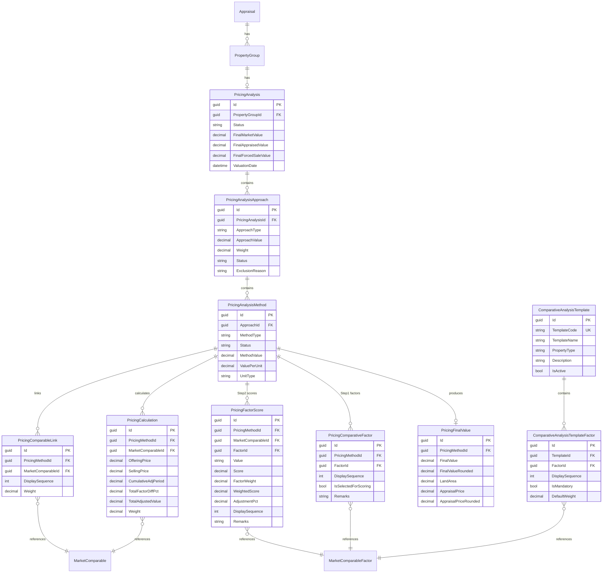

# Appraisal Module - Data Model

## Overview

The Appraisal Module handles the complete appraisal lifecycle from assignment to completion. It supports property-specific detail capture, photo gallery management, valuation analysis with market comparables, and multi-level review workflows including committee voting.

### Key Features
- Appraisal assignment and tracking (internal/external)
- Auto-assignment rules
- Property-specific detail tables (7 types including LandAndBuilding combined)
- Photo gallery with property section mapping
- Valuation analysis with market comparables database
- Multi-level review workflow (Checker → Verifier → Committee)
- Committee voting with role-based approval conditions
- Fee tracking and SLA monitoring
- Report generation

## Module Structure

```
Appraisal Module
├── Appraisal (Aggregate Root)
├── AppraisalAssignment (Assignment Tracking)
├── AppraisalSettings (Module Configuration)
├── AutoAssignmentRules (Auto-assign Rules)
├── QuotationRequest (RFQ Management)
├── QuotationInvitation (Company Invitations)
├── CompanyQuotation (Company Submissions)
├── QuotationNegotiation (Counter-offers & Negotiations)
├── PropertyInformation (General Property Info)
├── ValuationAnalysis (Valuation Calculations)
├── PropertyValuations (Per-Property Valuation Junction)
├── MarketComparables (Centralized Comparables Database)
├── AppraisalComparables (Link Appraisal to Comparables)
├── ComparableAdjustments (Adjustment Line Items)
├── AppraisalReport (Generated Reports)
├── AppraisalReview (Review Workflow)
├── Committees (Committee Definition)
├── CommitteeMembers (Committee Membership)
├── CommitteeApprovalConditions (Approval Rules)
├── CommitteeVotes (Voting Records)
├── Appointments (Appointment Scheduling)
├── AppointmentHistory (Appointment Reschedule History)
├── AppraisalFees (Fee Summary)
├── AppraisalFeeItems (Fee Line Items)
├── AppraisalFeePaymentHistory (Payment Tracking)
├── AppraisalGallery (Photos)
├── PropertyPhotoMapping (Link Photos to Sections)
├── MarketComparableTemplates (Template Definition)
├── MarketComparableFactors (Configurable Factors)
├── MarketComparableTemplateFactors (Template-Factor Junction)
├── MarketComparableData (Factor Values - EAV)
├── MarketComparableImages (Photo Evidence)
├── PricingAnalysis (Pricing Analysis Container)
├── PricingAnalysisApproaches (Market/Cost/Income)
├── PricingAnalysisMethods (WQS/SaleGrid/DirectComparison)
├── PricingCalculations (Calculation Details)
├── PricingFinalValues (Final Value Determination)
├── Property Detail Tables (7 types: Land, Building, LandAndBuilding, Condo, Vehicle, Vessel, Machinery)
├── LandTitles (Multiple Title Deeds per Land)
├── BuildingDepreciationDetails (Depreciation Calculations)
├── BuildingAppraisalSurfaces (Floor-by-Floor Surface Details)
├── CondoAppraisalAreaDetails (Area Breakdown per Room)
├── LawAndRegulations (Legal/Regulatory Info)
└── LawAndRegulationImages (Regulation Photo Evidence)
```

**Note:** `AppraisalCompanies` (external vendor registry) is maintained in the **System Module** and referenced by this module for external assignments and quotations.

## Domain-Driven Design Classification

### Aggregate Roots (AR)
Entry points for accessing and modifying domain objects. Each aggregate root maintains its own consistency boundary.

| Aggregate Root | Description |
|----------------|-------------|
| `Appraisal` | Main aggregate, entry point for all appraisal operations |
| `Committee` | Independent lifecycle, manages members and approval conditions |
| `MarketComparable` | Bank-wide shared data, independent of individual appraisals |
| `QuotationRequest` | Independent RFQ process lifecycle |

### Entities (E)
Objects with identity that belong to an aggregate root.

| Entity | Parent Aggregate | Description |
|--------|-----------------|-------------|
| `AppraisalProperty` | Appraisal | Registry of properties under appraisal |
| `PropertyGroup` | Appraisal | Groups properties for combined valuation |
| `PropertyGroupItem` | Appraisal | Junction linking properties to groups |
| `AppraisalAssignment` | Appraisal | Tracks assignment history |
| `ValuationAnalysis` | Appraisal | 1:1 valuation calculations |
| `GroupValuation` | Appraisal | Values per property group |
| `Appointment` | Appraisal | Appointment scheduling |
| `AppointmentHistory` | Appraisal | Reschedule history |
| `AppraisalReview` | Appraisal | Review history |
| `AppraisalFee` | Appraisal | Fee summary |
| `AppraisalFeeItem` | Appraisal | Fee line items |
| `AppraisalFeePaymentHistory` | Appraisal | Payment tracking |
| `AppraisalGallery` | Appraisal | Photo management |
| `PropertyPhotoMapping` | Appraisal | Links photos to properties |
| `AppraisalComparable` | Appraisal | Links to market comparables used |
| `ComparableAdjustment` | Appraisal | Adjustment line items |
| `LandTitle` | Appraisal | Multiple title deeds per land |
| `BuildingDepreciationDetail` | Appraisal | Depreciation calculations |
| `BuildingAppraisalSurface` | Appraisal | Floor-by-floor surface details |
| `CondoAppraisalAreaDetail` | Appraisal | Area breakdown per room |
| `LawAndRegulation` | Appraisal | Legal/regulatory info |
| `LawAndRegulationImage` | Appraisal | Regulation images |
| `PricingAnalysis` | Appraisal | Pricing analysis container |
| `PricingAnalysisApproach` | Appraisal | Market/Cost/Income approaches |
| `PricingAnalysisMethod` | Appraisal | WQS/SaleGrid/DirectComparison |
| `PricingCalculation` | Appraisal | Calculation details |
| `PricingFinalValue` | Appraisal | Final value determination |
| `MarketComparableData` | MarketComparable | Factor values (EAV) |
| `MarketComparableImage` | MarketComparable | Photo evidence |
| `CommitteeMember` | Committee | Committee membership |
| `CommitteeApprovalCondition` | Committee | Approval rules |
| `CommitteeVote` | Appraisal | Voting records |
| Property Detail Tables | Appraisal | Land, Building, Condo, Vehicle, Vessel, Machinery |
| `QuotationRequestItem` | QuotationRequest | Items in RFQ |
| `QuotationInvitation` | QuotationRequest | Company invitations |
| `CompanyQuotation` | QuotationRequest | Company submissions |
| `QuotationNegotiation` | QuotationRequest | Negotiation history |
| `MarketComparableTemplate` | (Configuration) | Comparable template definition |
| `MarketComparableFactor` | (Configuration) | Configurable factors |
| `MarketComparableTemplateFactor` | (Configuration) | Template-factor junction |

### Value Objects (VO)
Immutable objects without identity, defined by their attributes.

| Value Object | Used In | Fields |
|-------------|---------|--------|
| `Money` | Fees, Valuations | Amount, Currency |
| `Address` | Property Details | Province, District, SubDistrict, PostalCode |
| `GpsCoordinate` | Gallery | Latitude, Longitude |
| `LandArea` | Land Details | Rai, Ngan, SqWa, TotalSqm |

---

## Entity Relationship Diagram

```mermaid
erDiagram
    %% =====================================================
    %% CORE: Request → Appraisal → Properties & Groups (with junction)
    %% =====================================================
    Request ||--|| Appraisal : "creates one"

    %% Appraisal → Properties (direct link for easy query)
    Appraisal ||--o{ AppraisalProperties : "has properties"

    %% Appraisal → Groups (for valuation grouping)
    Appraisal ||--o{ PropertyGroups : "has groups"

    %% Junction: Properties ↔ Groups (many-to-one: property belongs to one group)
    PropertyGroups ||--o{ PropertyGroupItems : "contains items"
    PropertyGroupItems }o--|| AppraisalProperties : "references property"

    %% Properties → Property Details (1:1 based on PropertyType)
    AppraisalProperties ||--o| LandAppraisalDetail : "type=Land"
    AppraisalProperties ||--o| BuildingAppraisalDetail : "type=Building"
    AppraisalProperties ||--o| LandAndBuildingAppraisalDetail : "type=LandAndBuilding"
    AppraisalProperties ||--o| CondoAppraisalDetail : "type=Condo"
    AppraisalProperties ||--o| VehicleAppraisalDetail : "type=Vehicle"
    AppraisalProperties ||--o| VesselAppraisalDetail : "type=Vessel"
    AppraisalProperties ||--o| MachineryAppraisalDetail : "type=Machinery"

    %% Core Appraisal Relationships
    Appraisal ||--o{ AppraisalAssignment : "has assignments"
    Appraisal ||--o{ AppraisalGallery : "has photos"
    Appraisal ||--o| ValuationAnalysis : "has one"
    Appraisal ||--o{ AppraisalReview : "has reviews"
    Appraisal ||--o{ AppraisalFees : "has fees"
    Appraisal ||--o{ Appointments : "has appointments"
    Appraisal ||--o{ AppraisalComparables : "uses comparables"
    Appraisal ||--o| PricingAnalysis : "has pricing"

    %% Appointment History
    Appointments ||--o{ AppointmentHistory : "has history"

    %% Fee Structure (3-table)
    AppraisalFees ||--o{ AppraisalFeeItems : "has items"
    AppraisalFees ||--o{ AppraisalFeePaymentHistory : "has payments"

    %% Property Detail Extensions
    LandAppraisalDetail ||--o{ LandTitles : "has titles"
    BuildingAppraisalDetail ||--o{ BuildingDepreciationDetails : "has depreciation"
    BuildingAppraisalDetail ||--o{ BuildingAppraisalSurfaces : "has surfaces"
    LandAndBuildingAppraisalDetail ||--o{ LandTitles : "has titles"
    LandAndBuildingAppraisalDetail ||--o{ BuildingDepreciationDetails : "has depreciation"
    LandAndBuildingAppraisalDetail ||--o{ BuildingAppraisalSurfaces : "has surfaces"
    CondoAppraisalDetail ||--o{ CondoAppraisalAreaDetails : "has areas"

    %% Law & Regulation
    Appraisal ||--o{ LawAndRegulations : "has regulations"
    LawAndRegulations ||--o{ LawAndRegulationImages : "has images"

    %% Valuation & Comparables
    ValuationAnalysis ||--o{ GroupValuations : "has group values"
    GroupValuations }o--|| PropertyGroups : "values group"
    ValuationAnalysis ||--o{ AppraisalComparables : "uses comparables"
    AppraisalComparables }o--|| MarketComparables : "references"
    AppraisalComparables ||--o{ ComparableAdjustments : "has adjustments"

    %% Market Comparables (Template System)
    MarketComparableTemplates ||--o{ MarketComparableTemplateFactors : "has factors"
    MarketComparableTemplateFactors }o--|| MarketComparableFactors : "uses factor"
    MarketComparables }o--o| MarketComparableTemplates : "uses template (optional)"
    MarketComparables ||--o{ MarketComparableData : "has data"
    MarketComparableData }o--|| MarketComparableFactors : "for factor"
    MarketComparables ||--o{ MarketComparableImages : "has images"

    %% Pricing Analysis
    PricingAnalysis ||--o{ PricingAnalysisApproaches : "has approaches"
    PricingAnalysisApproaches ||--o{ PricingAnalysisMethods : "has methods"
    PricingAnalysisMethods ||--o{ PricingComparableLinks : "links comparables"
    PricingComparableLinks }o--|| MarketComparables : "uses comparable"
    PricingAnalysisMethods ||--o{ PricingCalculations : "has calculations"
    PricingAnalysis ||--o| PricingFinalValues : "has final value"

    %% Quotation Workflow
    QuotationRequest ||--o{ QuotationRequestItem : "contains items"
    QuotationRequestItem }o--|| Appraisal : "references appraisal"
    QuotationRequest ||--o{ QuotationInvitation : "invites companies"
    QuotationInvitation ||--o| CompanyQuotation : "receives quotation"
    CompanyQuotation ||--o{ CompanyQuotationItem : "itemized pricing"
    CompanyQuotationItem }o--|| QuotationRequestItem : "responds to"
    CompanyQuotationItem ||--o{ QuotationNegotiation : "has negotiations"

    %% Assignment Links
    AppraisalAssignment }o--o| AutoAssignmentRules : "matched rule (optional)"
    AppraisalAssignment }o--o| QuotationRequestItem : "from RFQ item (optional)"

    %% Photo Gallery → Property Mapping (polymorphic)
    AppraisalGallery ||--o{ PropertyPhotoMapping : "maps to sections"

    %% Review & Committee
    AppraisalReview }o--o| Committees : "by committee (optional)"
    Committees ||--o{ CommitteeMembers : "has members"
    Committees ||--o{ CommitteeApprovalConditions : "has conditions"
    AppraisalReview ||--o{ CommitteeVotes : "has votes"

    %% Cross-module references
    AppraisalGallery }o--|| Document : "references"
    QuotationInvitation }o--|| AppraisalCompany : "invites"

    %% =====================================================
    %% CROSS-MODULE REFERENCES (simple boxes)
    %% =====================================================
    Request["Request (Request Module)"]
    Document["Document (Document Module)"]
    AppraisalCompany["AppraisalCompany (System Module)"]

    %% =====================================================
    %% ENTITY DEFINITIONS WITH DDD CLASSIFICATION
    %% [AR] = Aggregate Root, [E] = Entity
    %% =====================================================

    Appraisal["[AR] Appraisal"] {
        guid Id PK
        string AppraisalNumber UK
        guid RequestId FK "1:1 with Request"
        string AppraisalType "Initial, Revaluation, Special"
        string Status "Pending, Assigned, InProgress, Review, Completed"
        string Priority "Normal, High"
        int SLADays
        datetime SLADueDate
        string SLAStatus "OnTrack, AtRisk, Breached"
    }

    AppraisalProperties["[E] AppraisalProperties"] {
        guid Id PK
        guid AppraisalId FK "Direct link for easy query"
        int SequenceNumber "1, 2, 3..."
        string PropertyType "Land, Building, Condo, Vehicle..."
        string Description "Quick reference"
    }

    PropertyGroups["[E] PropertyGroups"] {
        guid Id PK
        guid AppraisalId FK
        int GroupNumber "1, 2, 3..."
        string GroupName "Main Factory, Warehouse"
        string Description
    }

    PropertyGroupItems["[E] PropertyGroupItems"] {
        guid Id PK
        guid PropertyGroupId FK
        guid AppraisalPropertyId FK "UNIQUE - one group per property"
        int SequenceInGroup "Order within group"
    }

    %% =====================================================
    %% PROPERTY DETAIL TABLES [E] (1:1 with AppraisalProperties)
    %% =====================================================

    LandAppraisalDetail["[E] LandAppraisalDetail"] {
        guid Id PK
        guid AppraisalPropertyId FK "1:1"
        string PropertyName
        decimal Latitude
        decimal Longitude
        string Province
        string Owner
        string LandShape
        string Remark "...78 fields in SQL schema"
    }

    BuildingAppraisalDetail["[E] BuildingAppraisalDetail"] {
        guid Id PK
        guid AppraisalPropertyId FK "1:1"
        string PropertyName
        string BuildingNo
        string ModelName
        string Owner
        string BuildingType
        int BuildingYear
        string Remark "...52 fields in SQL schema"
    }

    LandAndBuildingAppraisalDetail["[E] LandAndBuildingAppraisalDetail"] {
        guid Id PK
        guid AppraisalPropertyId FK "1:1"
        string PropertyName
        decimal Latitude
        decimal Longitude
        string Province
        string BuildingNo
        string OwnerName
        string Remark "...65 fields in SQL schema"
    }

    CondoAppraisalDetail["[E] CondoAppraisalDetail"] {
        guid Id PK
        guid AppraisalPropertyId FK "1:1"
        string PropertyName
        string CondoName
        string RoomNo
        int FloorNo
        decimal Latitude
        decimal Longitude
        string Owner
        string Remark "...61 fields in SQL schema"
    }

    VehicleAppraisalDetail["[E] VehicleAppraisalDetail"] {
        guid Id PK
        guid AppraisalPropertyId FK "1:1"
        string PropertyName
        string RegistrationNo
        string Brand
        string Model
        int YearOfManufacture
        string Owner
        string Remark "...31 fields in SQL schema"
    }

    VesselAppraisalDetail["[E] VesselAppraisalDetail"] {
        guid Id PK
        guid AppraisalPropertyId FK "1:1"
        string PropertyName
        string RegistrationNo
        string Brand
        string Model
        string VesselType
        string Owner
        string Remark "...36 fields in SQL schema"
    }

    MachineryAppraisalDetail["[E] MachineryAppraisalDetail"] {
        guid Id PK
        guid AppraisalPropertyId FK "1:1"
        string PropertyName
        string RegistrationNo
        string Brand
        string Model
        int YearOfManufacture
        string Owner
        string Remark "...31 fields in SQL schema"
    }

    %% =====================================================
    %% ASSIGNMENT & WORKFLOW [E]
    %% =====================================================

    AppraisalAssignment["[E] AppraisalAssignment"] {
        guid Id PK
        guid AppraisalId FK
        string AssignmentType "Initial, Reassignment"
        string AssignmentMode "Internal, External"
        string AssignmentStatus "Assigned, InProgress, Completed"
        string AssignmentSource "Manual, AutoRule, Quotation"
        int ProgressPercent
        guid PreviousAssignmentId "Reassignment chain"
    }

    AutoAssignmentRules["[E] AutoAssignmentRules"] {
        guid Id PK
        string RuleName
        int Priority
        string PropertyTypes "JSON array"
        string Provinces "JSON array"
        string AssignmentMode "Internal, ExternalPanel, ExternalQuotation"
        bool IsActive
    }

    AppraisalSettings["[E] AppraisalSettings"] {
        guid Id PK
        string SettingKey UK
        string SettingValue
        string Description
    }

    %% =====================================================
    %% VALUATION & COMPARABLES
    %% =====================================================

    ValuationAnalysis["[E] ValuationAnalysis"] {
        guid Id PK
        guid AppraisalId FK
        string ValuationApproach "Market, Cost, Income"
        decimal MarketValue
        decimal AppraisedValue
        decimal ForcedSaleValue
        date ValuationDate
    }

    GroupValuations["[E] GroupValuations"] {
        guid Id PK
        guid ValuationAnalysisId FK
        guid PropertyGroupId FK
        decimal MarketValue
        decimal AppraisedValue
        decimal ForcedSaleValue
        decimal ValuationWeight
    }

    MarketComparables["[AR] MarketComparables"] {
        guid Id PK
        string ComparableNumber UK
        guid TemplateId FK "Optional template"
        string PropertyType
        string Province
        string Address
        date SurveyDate
        date TransactionDate
        decimal TransactionPrice
        decimal PricePerUnit
        decimal Latitude
        decimal Longitude
        string Source "Historical, NewSurvey"
        string Status "Active, Expired, Flagged"
        bool IsVerified
    }

    AppraisalComparables["[E] AppraisalComparables"] {
        guid Id PK
        guid ValuationAnalysisId FK
        guid MarketComparableId FK
        int SequenceNumber
        decimal Weight
        decimal AdjustedPricePerUnit
        decimal TotalAdjustmentPct
    }

    ComparableAdjustments["[E] ComparableAdjustments"] {
        guid Id PK
        guid AppraisalComparableId FK
        string AdjustmentCategory "Location, Physical, Time"
        string AdjustmentType
        decimal AdjustmentPercent
        string Justification
    }

    %% =====================================================
    %% REVIEW & COMMITTEE
    %% =====================================================

    AppraisalReview["[E] AppraisalReview"] {
        guid Id PK
        guid AppraisalId FK
        string ReviewLevel "Checker, Verifier, Committee"
        string ReviewStatus "Pending, Approved, Returned"
        guid ReviewedBy
        guid CommitteeId "Optional"
        int VotesApprove
        int VotesReject
    }

    Committees["[AR] Committees"] {
        guid Id PK
        string CommitteeName
        string CommitteeCode UK
        string QuorumType "Fixed, Percentage"
        int QuorumValue
        string MajorityType "Simple, TwoThirds, Unanimous"
    }

    CommitteeMembers["[E] CommitteeMembers"] {
        guid Id PK
        guid CommitteeId FK
        guid UserId
        string MemberName
        string Role "UW, Risk, Chairman"
        bool IsActive
    }

    CommitteeApprovalConditions["[E] CommitteeApprovalConditions"] {
        guid Id PK
        guid CommitteeId FK
        string ConditionType "RoleRequired, MinVotes"
        string RoleRequired
        int MinVotesRequired
    }

    CommitteeVotes["[E] CommitteeVotes"] {
        guid Id PK
        guid ReviewId FK
        guid CommitteeMemberId FK
        string Vote "Approve, Reject, Abstain"
        datetime VotedAt
        string Comments
    }

    %% =====================================================
    %% FEES [E]
    %% =====================================================

    AppraisalFees["[E] AppraisalFees"] {
        guid Id PK
        guid AppraisalId FK
        guid AssignmentId FK "Optional"
        string FeeType "AppraisalFee, TravelExpense"
        string FeeCategory "Internal, External"
        decimal Amount
        decimal VATAmount
        decimal NetAmount
        string PaymentStatus "Pending, Invoiced, Paid"
    }

    %% =====================================================
    %% PHOTO GALLERY [E]
    %% =====================================================

    AppraisalGallery["[E] AppraisalGallery"] {
        guid Id PK
        guid AppraisalId FK
        guid DocumentId "Reference to Document module"
        int PhotoNumber
        string PhotoType "Exterior, Interior, Land, Defect"
        string Caption
        bool IsUsedInReport
    }

    PropertyPhotoMapping["[E] PropertyPhotoMapping"] {
        guid Id PK
        guid GalleryPhotoId FK
        guid AppraisalPropertyId FK
        string PhotoPurpose "Evidence, Condition, Boundary"
        string SectionReference
        int SequenceNumber
    }

    %% =====================================================
    %% QUOTATION WORKFLOW
    %% =====================================================

    QuotationRequest["[AR] QuotationRequest"] {
        guid Id PK
        string QuotationNumber UK
        string Status "Draft, Sent, Closed"
        date DueDate
        guid RequestedBy
    }

    QuotationRequestItem["[E] QuotationRequestItem"] {
        guid Id PK
        guid QuotationRequestId FK
        guid AppraisalId FK
        int ItemNumber
    }

    QuotationInvitation["[E] QuotationInvitation"] {
        guid Id PK
        guid QuotationRequestId FK
        guid CompanyId "Ref to System module"
        string Status "Pending, Submitted, Declined"
    }

    CompanyQuotation["[E] CompanyQuotation"] {
        guid Id PK
        guid InvitationId FK
        guid CompanyId
        string Status "Submitted, Accepted, Rejected"
        decimal TotalAmount
        bool IsWinner
    }

    CompanyQuotationItem["[E] CompanyQuotationItem"] {
        guid Id PK
        guid CompanyQuotationId FK
        guid QuotationRequestItemId FK
        decimal QuotedPrice
        int ProposedDays
    }

    QuotationNegotiation["[E] QuotationNegotiation"] {
        guid Id PK
        guid QuotationItemId FK
        string InitiatedBy "Admin, Company"
        decimal ProposedPrice
        string Status "Pending, Accepted, Rejected"
    }

    %% =====================================================
    %% APPOINTMENT TABLES [E]
    %% =====================================================

    Appointments["[E] Appointments"] {
        guid Id PK
        guid AppraisalId FK
        datetime ScheduledDate
        string TimeSlot "Morning, Afternoon"
        string Status "Scheduled, Completed, Cancelled"
        string ContactPerson
        string ContactPhone
        string Location
    }

    AppointmentHistory["[E] AppointmentHistory"] {
        guid Id PK
        guid AppointmentId FK
        datetime PreviousDate
        datetime NewDate
        string ChangeReason
        datetime ChangedAt
        guid ChangedBy
    }

    %% =====================================================
    %% FEE STRUCTURE [E] (3-table design)
    %% =====================================================

    AppraisalFeeItems["[E] AppraisalFeeItems"] {
        guid Id PK
        guid AppraisalFeeId FK
        string ItemType "AppraisalFee, Travel, Urgent"
        string Description
        decimal Amount
        decimal VATAmount
        decimal NetAmount
    }

    AppraisalFeePaymentHistory["[E] AppraisalFeePaymentHistory"] {
        guid Id PK
        guid AppraisalFeeItemId FK
        decimal PaidAmount
        date PaymentDate
        string PaymentMethod "Transfer, Cash, Check"
        string PaymentReference
        string Status "Pending, Paid, Refunded"
    }

    %% =====================================================
    %% PROPERTY DETAIL EXTENSIONS [E]
    %% =====================================================

    LandTitles["[E] LandTitles"] {
        guid Id PK
        guid LandAppraisalDetailId FK
        int TitleSequence "1, 2, 3..."
        string TitleDeedType "Chanote, NorSor3Gor"
        string TitleDeedNumber
        string LandNumber
        decimal AreaRai
        decimal AreaNgan
        decimal AreaSqWa
        string Province
        string District
    }

    BuildingDepreciationDetails["[E] BuildingDepreciationDetails"] {
        guid Id PK
        guid BuildingAppraisalDetailId FK
        string DepreciationMethod "StraightLine, DecliningBalance"
        int TotalUsefulLife
        int RemainingLife
        decimal ConstructionCost
        decimal DepreciationRate
        decimal AccumulatedDepreciation
        decimal CurrentValue
    }

    BuildingAppraisalSurfaces["[E] BuildingAppraisalSurfaces"] {
        guid Id PK
        guid BuildingAppraisalDetailId FK
        int FromFloorNo
        int ToFloorNo
        string FloorType "Normal, Mezzanine, Rooftop"
        string FloorStructure "KSL, Wood, SmartBoard"
        string FloorSurface "Granite, Tiles, Wood"
    }

    CondoAppraisalAreaDetails["[E] CondoAppraisalAreaDetails"] {
        guid Id PK
        guid CondoAppraisalDetailId FK
        string AreaDescription "Balcony, Living Room"
        decimal AreaSize
    }

    LawAndRegulations["[E] LawAndRegulations"] {
        guid Id PK
        guid AppraisalId FK
        string HeaderCode
        string Remark
    }

    LawAndRegulationImages["[E] LawAndRegulationImages"] {
        guid Id PK
        guid LawAndRegulationId FK
        guid DocumentId "Ref to Document module"
        int SequenceNumber
        string Caption
    }

    %% =====================================================
    %% MARKET COMPARABLES TEMPLATE SYSTEM [E]
    %% =====================================================

    MarketComparableTemplates["[E] MarketComparableTemplates"] {
        guid Id PK
        string TemplateCode UK
        string TemplateName
        string PropertyType "Land, Building, Condo"
        string Description
        bool IsActive
    }

    MarketComparableFactors["[E] MarketComparableFactors"] {
        guid Id PK
        string FactorCode UK
        string FactorName
        string FactorCategory "Location, Physical, Legal"
        string DataType "Text, Number, Dropdown"
        string DropdownOptions "JSON array"
        bool IsActive
    }

    MarketComparableTemplateFactors["[E] MarketComparableTemplateFactors"] {
        guid Id PK
        guid TemplateId FK
        guid FactorId FK
        int DisplayOrder
        bool IsRequired
        bool IsActive
    }

    MarketComparableData["[E] MarketComparableData"] {
        guid Id PK
        guid MarketComparableId FK
        guid FactorId FK
        string FactorValue
        string Notes
    }

    MarketComparableImages["[E] MarketComparableImages"] {
        guid Id PK
        guid MarketComparableId FK
        guid DocumentId "Ref to Document module"
        string ImageType "Survey, Evidence"
        int SequenceNumber
        string Caption
    }

    %% =====================================================
    %% PRICING ANALYSIS [E]
    %% =====================================================

    PricingAnalysis["[E] PricingAnalysis"] {
        guid Id PK
        guid AppraisalId FK
        string Status "Draft, InProgress, Completed"
        decimal FinalMarketValue
        decimal FinalAppraisedValue
        decimal FinalForcedSaleValue
        date ValuationDate
    }

    PricingAnalysisApproaches["[E] PricingAnalysisApproaches"] {
        guid Id PK
        guid PricingAnalysisId FK
        string ApproachType "Market, Cost, Income"
        decimal ApproachValue
        decimal Weight
        string Status "Active, Excluded"
        string ExclusionReason
    }

    PricingAnalysisMethods["[E] PricingAnalysisMethods"] {
        guid Id PK
        guid ApproachId FK
        string MethodType "WQS, SaleGrid, DirectComparison"
        string Status "Selected, Alternative"
        decimal MethodValue
        decimal ValuePerUnit
        string UnitType "Sqm, Rai, Unit"
    }

    PricingComparableLinks["[E] PricingComparableLinks"] {
        guid Id PK
        guid MethodId FK
        guid MarketComparableId FK
        decimal Weight
        int SequenceNumber
    }

    PricingCalculations["[E] PricingCalculations"] {
        guid Id PK
        guid MethodId FK
        string CalculationType "Base, Adjustment, Final"
        string CalculationStep
        decimal InputValue
        decimal OutputValue
        string Formula
        int StepOrder
    }

    PricingFinalValues["[E] PricingFinalValues"] {
        guid Id PK
        guid PricingAnalysisId FK
        string ValueType "MarketValue, AppraisedValue, ForcedSale"
        decimal Value
        string Justification
        date EffectiveDate
    }
```

**Legend:**
- **||--||** = One-to-One relationship
- **||--o{** = One-to-Many relationship
- **}o--||** = Many-to-One relationship
- **FK** = Foreign Key, **PK** = Primary Key, **UK** = Unique Key
- **[AR]** = Aggregate Root, **[E]** = Entity
- **Simple boxes** = Cross-module references (defined in other modules)

**Key Design Notes:**
1. **1 Request = 1 Appraisal**: Application-level tracking with SLA for the whole application
2. **Properties direct link**: `AppraisalProperties.AppraisalId` for easy query without knowing groups
3. **Groups via junction**: `PropertyGroupItems` links properties to groups for valuation
4. **GroupValuations**: Valuation per group, not per individual property
5. **PropertyPhotoMapping**: Links photos to specific properties
6. **Quotation Workflow**: Optional RFQ process for external assignments
7. **Review Workflow**: Sequential reviews (Checker → Verifier → Committee)
8. **Market Comparables**: Centralized bank-wide database of verified market transactions
9. **Cross-Module References**: RequestId, DocumentId, CompanyId stored without FK constraints
10. **Appointments**: Scheduling with full reschedule history for audit trail
11. **Fee 3-Table Structure**: AppraisalFees (summary) → AppraisalFeeItems (line items) → AppraisalFeePaymentHistory (payments)
12. **LandTitles**: Multiple title deeds per land (adjacent plots), linked to LandAppraisalDetail or LandAndBuildingAppraisalDetail
13. **BuildingDepreciationDetails**: Detailed depreciation calculations with multiple methods (StraightLine, DecliningBalance, AgeLife)
14. **Market Comparables Template System**: Dynamic/configurable comparables using EAV pattern (Template → TemplateFactor → Factor → Data). Supports both historical data and new surveys.
15. **Pricing Analysis**: Hierarchical structure (PricingAnalysis → Approach → Method → Calculation → FinalValue) supporting WQS, SaleGrid, DirectComparison methods

## Core Tables

### 1. Appraisals (Aggregate Root)

Main appraisal entity at application level. One appraisal per request, tracking the entire appraisal process for all properties.

**Key Relationship:**
- 1 Request → 1 Appraisal (application level)
- 1 Appraisal → N Property Details (multiple properties under one appraisal)

#### SQL Schema

```sql
CREATE TABLE appraisal.Appraisals
(
    -- Primary Key
    Id                      UNIQUEIDENTIFIER PRIMARY KEY DEFAULT NEWSEQUENTIALID(),

    -- Business Key
    AppraisalNumber         NVARCHAR(50) UNIQUE NOT NULL,           -- Auto-generated: 6700001

    -- Request Reference (from Request Module) - 1:1 relationship
    RequestId               UNIQUEIDENTIFIER NOT NULL UNIQUE,       -- No FK constraint (cross-module), UNIQUE enforces 1:1

    -- Appraisal Information
    AppraisalType           NVARCHAR(50) NOT NULL,                  -- Initial, Revaluation, Special
    AppraisalPurpose        NVARCHAR(100) NULL,
    AppraisalDate           DATETIME2 NOT NULL,
    DueDate                 DATETIME2 NULL,
    CompletedDate           DATETIME2 NULL,

    -- Status & Priority
    Status                  NVARCHAR(50) NOT NULL DEFAULT 'Pending', -- Pending, Assigned, InProgress, Review, Completed, Cancelled
    Priority                NVARCHAR(20) NOT NULL DEFAULT 'Normal',  -- Normal, High

    -- SLA Tracking (for entire application, not per property)
    SLADays                 INT NULL,                               -- Expected days to complete
    SLADueDate              DATETIME2 NULL,                         -- Calculated deadline
    SLAStatus               NVARCHAR(50) NULL,                      -- OnTrack, AtRisk, Breached
    ActualDaysToComplete    INT NULL,
    IsWithinSLA             BIT NULL,

    -- Audit Fields
    CreatedOn               DATETIME2 NOT NULL DEFAULT GETUTCDATE(),
    CreatedBy               UNIQUEIDENTIFIER NOT NULL,
    UpdatedOn               DATETIME2 NOT NULL DEFAULT GETUTCDATE(),
    UpdatedBy               UNIQUEIDENTIFIER NOT NULL,
    RowVersion              ROWVERSION NOT NULL,

    CONSTRAINT CK_Appraisal_Status CHECK (Status IN ('Pending', 'Assigned', 'InProgress', 'Review', 'Completed', 'Cancelled')),
    CONSTRAINT CK_Appraisal_Priority CHECK (Priority IN ('Normal', 'High')),
    CONSTRAINT CK_Appraisal_SLAStatus CHECK (SLAStatus IS NULL OR SLAStatus IN ('OnTrack', 'AtRisk', 'Breached'))
);
```

### 2. AppraisalProperties

Registry of all collateral items under an appraisal. Direct link to Appraisal for easy querying.

**Key Relationship:**
- 1 Appraisal → N AppraisalProperties (direct link)
- 1 AppraisalProperty → 1 Property Detail (based on PropertyType)
- Grouping is via PropertyGroupItems junction table

#### SQL Schema

```sql
CREATE TABLE appraisal.AppraisalProperties
(
    -- Primary Key
    Id                      UNIQUEIDENTIFIER PRIMARY KEY DEFAULT NEWSEQUENTIALID(),

    -- Foreign Key (direct link to Appraisal for easy query)
    AppraisalId             UNIQUEIDENTIFIER NOT NULL,

    -- Sequence & Type
    --SequenceNumber          INT NOT NULL,                          -- 1, 2, 3...
    PropertyType          NVARCHAR(50) NOT NULL,                   -- Land, Building, LandAndBuilding, Condo, Vehicle, Vessel, Machinery

    -- Quick Reference (for display without joining detail table)
    --Description             NVARCHAR(500) NULL,                    -- "Land 10 Rai in Pathum Thani"

    -- Audit Fields
    CreatedOn               DATETIME2 NOT NULL DEFAULT GETUTCDATE(),
    CreatedBy               UNIQUEIDENTIFIER NOT NULL,
    UpdatedOn               DATETIME2 NOT NULL DEFAULT GETUTCDATE(),
    UpdatedBy               UNIQUEIDENTIFIER NOT NULL,

    CONSTRAINT FK_Property_Appraisal FOREIGN KEY (AppraisalId)
        REFERENCES appraisal.Appraisals(Id) ON DELETE CASCADE,
    CONSTRAINT UQ_Property_Sequence UNIQUE (AppraisalId, SequenceNumber),
    CONSTRAINT CK_Property_Type CHECK (PropertyType IN ('Land', 'Building', 'LandAndBuilding', 'Condo', 'Vehicle', 'Vessel', 'Machinery'))
);
```

**Usage:**
```sql
-- Easy query: Get all collaterals for an appraisal (no need to know groups)
SELECT SequenceNumber, PropertyType, Description
FROM appraisal.AppraisalProperties
WHERE AppraisalId = @AppraisalId
ORDER BY SequenceNumber;

-- Result:
-- 1 | Land     | "Land 10 Rai in Pathum Thani"
-- 2 | Land     | "Land 5 Rai in Bangkok"
-- 3 | Building | "Factory 2,000 sqm"
-- 4 | Land     | "Land 3 Rai"
-- 5 | Building | "Warehouse 500 sqm"
```

### 3. PropertyGroups

Groups of collaterals for combined valuation. Each appraisal has one or more groups.

**Key Relationship:**
- 1 Appraisal → N PropertyGroups
- 1 PropertyGroup → N PropertyGroupItems → N AppraisalProperties
- Valuation is per group (not per individual collateral)

#### SQL Schema

```sql
CREATE TABLE appraisal.PropertyGroups
(
    -- Primary Key
    Id                      UNIQUEIDENTIFIER PRIMARY KEY DEFAULT NEWSEQUENTIALID(),

    -- Foreign Key
    AppraisalId             UNIQUEIDENTIFIER NOT NULL,

    -- Group Info
    GroupNumber             INT NOT NULL,                            -- 1, 2, 3...
    --GroupName               NVARCHAR(200) NULL,                    -- "Main Factory", "Warehouse Complex"
    --Description             NVARCHAR(500) NULL,

    UseSystemCalculatedValue BIT NOT NULL DEFAULT 0,
    
    -- Audit Fields
    CreatedOn               DATETIME2 NOT NULL DEFAULT GETUTCDATE(),
    CreatedBy               UNIQUEIDENTIFIER NOT NULL,
    UpdatedOn               DATETIME2 NOT NULL DEFAULT GETUTCDATE(),
    UpdatedBy               UNIQUEIDENTIFIER NOT NULL,

    CONSTRAINT FK_PropertyGroup_Appraisal FOREIGN KEY (AppraisalId)
        REFERENCES appraisal.Appraisals(Id) ON DELETE CASCADE,
    CONSTRAINT UQ_PropertyGroup_Number UNIQUE (AppraisalId, GroupNumber)
);
```

### 4. PropertyGroupItems

Junction table linking collaterals to groups. Each collateral belongs to exactly one group.

#### SQL Schema

```sql
CREATE TABLE appraisal.PropertyGroupItems
(
    -- Primary Key
    Id                      UNIQUEIDENTIFIER PRIMARY KEY DEFAULT NEWSEQUENTIALID(),

    -- Foreign Keys
    PropertyGroupId       UNIQUEIDENTIFIER NOT NULL,
    AppraisalPropertyId   UNIQUEIDENTIFIER NOT NULL,

    -- Sequence within group
    SequenceInGroup         INT NOT NULL,                            -- 1, 2, 3 within group

    -- Audit Fields
    CreatedOn               DATETIME2 NOT NULL DEFAULT GETUTCDATE(),
    CreatedBy               UNIQUEIDENTIFIER NOT NULL,
    UpdatedOn               DATETIME2 NOT NULL DEFAULT GETUTCDATE(),
    UpdatedBy               UNIQUEIDENTIFIER NOT NULL,

    CONSTRAINT FK_GroupItem_Group FOREIGN KEY (PropertyGroupId)
        REFERENCES appraisal.PropertyGroups(Id) ON DELETE CASCADE,
    CONSTRAINT FK_GroupItem_Property FOREIGN KEY (AppraisalPropertyId)
        REFERENCES appraisal.AppraisalProperties(Id),
    CONSTRAINT UQ_GroupItem_Property UNIQUE (AppraisalPropertyId),  -- One group per collateral
    CONSTRAINT UQ_GroupItem_Sequence UNIQUE (PropertyGroupId, SequenceInGroup)
);
```

**Usage:**
```sql
-- Get collaterals grouped for valuation
SELECT
    g.GroupNumber, g.GroupName,
    gi.SequenceInGroup, c.PropertyType, c.Description
FROM appraisal.PropertyGroups g
JOIN appraisal.PropertyGroupItems gi ON gi.PropertyGroupId = g.Id
JOIN appraisal.AppraisalProperties c ON c.Id = gi.AppraisalPropertyId
WHERE g.AppraisalId = @AppraisalId
ORDER BY g.GroupNumber, gi.SequenceInGroup;

-- Result:
-- Group 1 | "Main Factory" | 1 | Land     | "Land 10 Rai"
-- Group 1 | "Main Factory" | 2 | Land     | "Land 5 Rai"
-- Group 1 | "Main Factory" | 3 | Building | "Factory 2,000 sqm"
-- Group 2 | "Warehouse"    | 1 | Land     | "Land 3 Rai"
-- Group 2 | "Warehouse"    | 2 | Building | "Warehouse 500 sqm"
```

### 5. AppraisalAssignments

Tracks individual appraisal assignments. Links back to quotation items when assignment comes from RFQ process.

**Status Flow (Simplified - No Pending/Accepted):**
```
Assigned → InProgress → Completed
              ↓
         Rejected / Cancelled
```

#### SQL Schema

```sql
CREATE TABLE appraisal.AppraisalAssignments
(
    -- Primary Key
    Id                      UNIQUEIDENTIFIER PRIMARY KEY DEFAULT NEWSEQUENTIALID(),

    -- Foreign Keys
    AppraisalId             UNIQUEIDENTIFIER NOT NULL,
    QuotationRequestId      UNIQUEIDENTIFIER NULL,                -- Optional: from which RFQ
    QuotationRequestItemId  UNIQUEIDENTIFIER NULL,                -- Optional: which item in RFQ
    SelectedQuotationId     UNIQUEIDENTIFIER NULL,                -- Optional: winning quotation
    SelectedQuotationItemId UNIQUEIDENTIFIER NULL,                -- Optional: specific item pricing

    -- Reassignment Chain
    PreviousAssignmentId    UNIQUEIDENTIFIER NULL,                -- Link to rejected assignment
    ReassignmentNumber      INT NOT NULL DEFAULT 1,               -- 1, 2, 3...

    -- Assignment Details
    AssignmentType          NVARCHAR(50) NOT NULL,                -- Initial, Reassignment, Escalation
    AssignmentMode          NVARCHAR(50) NOT NULL,                -- Internal, External
    AssignmentStatus        NVARCHAR(50) NOT NULL DEFAULT 'Assigned', -- Assigned, InProgress, Rejected, Cancelled, Completed

    -- Assignment Source (how was this assigned?)
    AssignmentSource        NVARCHAR(50) NOT NULL DEFAULT 'Manual', -- Manual, AutoRule, Quotation
    AutoRuleId              UNIQUEIDENTIFIER NULL,                -- If auto-assigned, which rule

    -- Internal PIC (always assigned)
    InternalPIC             UNIQUEIDENTIFIER NOT NULL,            -- FK to auth.Users
    InternalPICName         NVARCHAR(200) NOT NULL,

    -- Internal Assignment (when AssignmentMode = 'Internal')
    AssignedTo              UNIQUEIDENTIFIER NULL,                -- FK to auth.Users
    AssignedToName          NVARCHAR(200) NULL,

    -- External Assignment (when AssignmentMode = 'External')
    ExternalCompanyId       UNIQUEIDENTIFIER NULL,                -- References system.AppraisalCompanies
    ExternalCompanyName     NVARCHAR(200) NULL,

    -- External Appraiser Details (specific person from company)
    --ExternalAppraiserId     UNIQUEIDENTIFIER NULL,
    --ExternalAppraiserName   NVARCHAR(200) NULL,
    --ExternalAppraiserLicense NVARCHAR(50) NULL,                 -- License number for compliance

    -- Progress Tracking
    ProgressPercent         INT NOT NULL DEFAULT 0,               -- 0-100
    LastProgressUpdate      DATETIME2 NULL,

    -- Agreement Terms (from selected quotation item)
    --AgreedPrice             DECIMAL(18,2) NULL,
    --AgreedCurrency          NVARCHAR(3) DEFAULT 'THB',
    AgreedTimeline          INT NULL,                             -- Days
    AgreedDueDate           DATE NULL,

    -- Assignment Metadata
    AssignedBy              UNIQUEIDENTIFIER NOT NULL,            -- Admin who made assignment
    AssignedByName          NVARCHAR(200) NOT NULL,
    AssignedAt              DATETIME2 NOT NULL DEFAULT GETUTCDATE(),

    -- Status Changes
    StartedAt               DATETIME2 NULL,                       -- When InProgress
    CompletedAt             DATETIME2 NULL,
    RejectedAt              DATETIME2 NULL,
    RejectionReason         NVARCHAR(500) NULL,

    -- Notes
    Notes                   NVARCHAR(MAX) NULL,
    --SpecialInstructions     NVARCHAR(MAX) NULL,

    -- Audit Fields
    CreatedOn               DATETIME2 NOT NULL DEFAULT GETUTCDATE(),
    CreatedBy               UNIQUEIDENTIFIER NOT NULL,
    UpdatedOn               DATETIME2 NOT NULL DEFAULT GETUTCDATE(),
    UpdatedBy               UNIQUEIDENTIFIER NOT NULL,

    CONSTRAINT FK_AppraisalAssignment_Appraisal FOREIGN KEY (AppraisalId)
        REFERENCES appraisal.Appraisals(Id) ON DELETE CASCADE,
    CONSTRAINT FK_AppraisalAssignment_Previous FOREIGN KEY (PreviousAssignmentId)
        REFERENCES appraisal.AppraisalAssignments(Id),
    CONSTRAINT FK_AppraisalAssignment_AutoRule FOREIGN KEY (AutoRuleId)
        REFERENCES appraisal.AutoAssignmentRules(Id),
    CONSTRAINT FK_AppraisalAssignment_QuotationRequest FOREIGN KEY (QuotationRequestId)
        REFERENCES appraisal.QuotationRequests(Id),
    CONSTRAINT FK_AppraisalAssignment_RequestItem FOREIGN KEY (QuotationRequestItemId)
        REFERENCES appraisal.QuotationRequestItems(Id),
    CONSTRAINT FK_AppraisalAssignment_SelectedQuotation FOREIGN KEY (SelectedQuotationId)
        REFERENCES appraisal.CompanyQuotations(Id),
    CONSTRAINT FK_AppraisalAssignment_SelectedItem FOREIGN KEY (SelectedQuotationItemId)
        REFERENCES appraisal.CompanyQuotationItems(Id),
    CONSTRAINT CK_AppraisalAssignment_Type CHECK (AssignmentType IN ('Initial', 'Reassignment', 'Escalation')),
    CONSTRAINT CK_AppraisalAssignment_Mode CHECK (AssignmentMode IN ('Internal', 'External')),
    CONSTRAINT CK_AppraisalAssignment_Status CHECK (AssignmentStatus IN ('Assigned', 'InProgress', 'Rejected', 'Cancelled', 'Completed')),
    CONSTRAINT CK_AppraisalAssignment_Source CHECK (AssignmentSource IN ('Manual', 'AutoRule', 'Quotation')),
    CONSTRAINT CK_AppraisalAssignment_Progress CHECK (ProgressPercent >= 0 AND ProgressPercent <= 100),
    CONSTRAINT CK_AppraisalAssignment_Assignment CHECK (
        (AssignmentMode = 'Internal' AND AssignedTo IS NOT NULL AND ExternalCompanyId IS NULL) OR
        (AssignmentMode = 'External' AND ExternalCompanyId IS NOT NULL AND AssignedTo IS NULL)
    )
);
```

## Appointment Tables

Survey appointment scheduling and history tracking for property inspections.

### 5a. Appointments

Current appointment details for property survey visits.

#### SQL Schema

```sql
CREATE TABLE appraisal.Appointments
(
    Id                      UNIQUEIDENTIFIER PRIMARY KEY DEFAULT NEWSEQUENTIALID(),
    AppraisalId             UNIQUEIDENTIFIER NOT NULL,

    -- Appointment Details
    AppointmentDate         DATETIME2 NOT NULL,
    LocationDetail          NVARCHAR(MAX) NULL,                      -- Remarks/directions
    Latitude                DECIMAL(9,6) NULL,
    Longitude               DECIMAL(9,6) NULL,

    -- Status
    Status                  NVARCHAR(20) NOT NULL DEFAULT 'Pending', -- Pending, Approved, Completed, Cancelled
    ActionDate              DATETIME2 NULL,                          -- Date status changed

    -- Contact Person
    AppointedBy             UNIQUEIDENTIFIER NOT NULL,               -- User who scheduled
    ContactPerson           NVARCHAR(200) NULL,                      -- Customer contact name
    ContactPhone            NVARCHAR(50) NULL,

    -- Audit
    CreatedOn               DATETIME2 NOT NULL DEFAULT GETUTCDATE(),
    CreatedBy               UNIQUEIDENTIFIER NOT NULL,
    UpdatedOn               DATETIME2 NOT NULL DEFAULT GETUTCDATE(),
    UpdatedBy               UNIQUEIDENTIFIER NOT NULL,

    CONSTRAINT FK_Appointment_Appraisal FOREIGN KEY (AppraisalId)
        REFERENCES appraisal.Appraisals(Id) ON DELETE CASCADE,
    CONSTRAINT CK_Appointment_Status CHECK (Status IN ('Pending', 'Approved', 'Completed', 'Cancelled'))
);
```

### 5b. AppointmentHistory

Historical records of appointment changes (reschedules, cancellations).

#### SQL Schema

```sql
CREATE TABLE appraisal.AppointmentHistory
(
    Id                      UNIQUEIDENTIFIER PRIMARY KEY DEFAULT NEWSEQUENTIALID(),
    AppointmentId           UNIQUEIDENTIFIER NOT NULL,
    AppraisalId             UNIQUEIDENTIFIER NOT NULL,

    -- Original Values (snapshot at time of change)
    PreviousAppointmentDate DATETIME2 NOT NULL,
    PreviousStatus          NVARCHAR(20) NOT NULL,
    PreviousLocationDetail  NVARCHAR(MAX) NULL,

    -- Change Details
    ChangeType              NVARCHAR(50) NOT NULL,                   -- Rescheduled, Cancelled, StatusChanged
    ChangeReason            NVARCHAR(500) NULL,
    ChangedOn               DATETIME2 NOT NULL DEFAULT GETUTCDATE(),
    ChangedBy               UNIQUEIDENTIFIER NOT NULL,

    CONSTRAINT FK_AppointmentHistory_Appointment FOREIGN KEY (AppointmentId)
        REFERENCES appraisal.Appointments(Id) ON DELETE CASCADE,
    CONSTRAINT FK_AppointmentHistory_Appraisal FOREIGN KEY (AppraisalId)
        REFERENCES appraisal.Appraisals(Id),
    CONSTRAINT CK_AppointmentHistory_ChangeType CHECK (ChangeType IN ('Rescheduled', 'Cancelled', 'StatusChanged'))
);
```

## Quotation Workflow Tables

### 6. QuotationRequests

Manages Request for Quotation (RFQ) process for external appraisal assignments. Each RFQ can contain multiple appraisals for competitive bidding.

#### SQL Schema

```sql
CREATE TABLE appraisal.QuotationRequests
(
    -- Primary Key
    Id                      UNIQUEIDENTIFIER PRIMARY KEY DEFAULT NEWSEQUENTIALID(),

    -- RFQ Information
    QuotationNumber         NVARCHAR(50) UNIQUE NOT NULL,         -- Auto-generated: RFQ-2025-00001
    RequestDate             DATETIME2 NOT NULL DEFAULT GETUTCDATE(),
    DueDate                 DATETIME2 NOT NULL,                   -- Deadline for companies to submit quotes

    -- Request Summary
    TotalAppraisals         INT NOT NULL DEFAULT 0,               -- Number of appraisals in this RFQ
    RequestDescription      NVARCHAR(500) NULL,                   -- General description
    --SpecialRequirements     NVARCHAR(MAX) NULL,

    -- Status
    Status                  NVARCHAR(50) NOT NULL DEFAULT 'Draft', -- Draft, Sent, Closed, Cancelled
    TotalCompaniesInvited   INT NOT NULL DEFAULT 0,
    TotalQuotationsReceived INT NOT NULL DEFAULT 0,

    -- Selection
    SelectedCompanyId       UNIQUEIDENTIFIER NULL,                -- References system.AppraisalCompanies
    SelectedQuotationId     UNIQUEIDENTIFIER NULL,                -- FK to CompanyQuotations
    SelectedAt              DATETIME2 NULL,
    SelectionReason         NVARCHAR(500) NULL,

    -- Created By
    RequestedBy             UNIQUEIDENTIFIER NOT NULL,            -- Admin who created RFQ
    RequestedByName         NVARCHAR(200) NOT NULL,

    -- Audit Fields
    CreatedOn               DATETIME2 NOT NULL DEFAULT GETUTCDATE(),
    CreatedBy               UNIQUEIDENTIFIER NOT NULL,
    UpdatedOn               DATETIME2 NOT NULL DEFAULT GETUTCDATE(),
    UpdatedBy               UNIQUEIDENTIFIER NOT NULL,

    CONSTRAINT CK_QuotationRequest_Status CHECK (Status IN ('Draft', 'Sent', 'Closed', 'Cancelled'))
);
```

### 4. QuotationRequestItems

Line items linking individual appraisals to an RFQ. Each RFQ can contain multiple appraisals.

#### SQL Schema

```sql
CREATE TABLE appraisal.QuotationRequestItems
(
    -- Primary Key
    Id                      UNIQUEIDENTIFIER PRIMARY KEY DEFAULT NEWSEQUENTIALID(),

    -- Foreign Keys
    QuotationRequestId      UNIQUEIDENTIFIER NOT NULL,
    AppraisalId             UNIQUEIDENTIFIER NOT NULL,             -- FK to Appraisals

    -- Item Details
    ItemNumber              INT NOT NULL,                          -- 1, 2, 3... (line item number)

    -- Appraisal Information (denormalized for quick reference)
    AppraisalNumber         NVARCHAR(50) NOT NULL,
    PropertyType            NVARCHAR(50) NOT NULL,
    PropertyLocation        NVARCHAR(500) NULL,
    --EstimatedValue          DECIMAL(18,2) NULL,
    
    MaxDays                 INT NOT NULL DEFAULT 0,               -- Max days for inspection

    -- Item-Specific Requirements
    ItemNotes               NVARCHAR(MAX) NULL,
    SpecialRequirements     NVARCHAR(500) NULL,

    -- Audit Fields
    CreatedOn               DATETIME2 NOT NULL DEFAULT GETUTCDATE(),
    CreatedBy               UNIQUEIDENTIFIER NOT NULL,
    UpdatedOn               DATETIME2 NOT NULL DEFAULT GETUTCDATE(),
    UpdatedBy               UNIQUEIDENTIFIER NOT NULL,

    CONSTRAINT FK_QuotationRequestItem_Request FOREIGN KEY (QuotationRequestId)
        REFERENCES appraisal.QuotationRequests(Id) ON DELETE CASCADE,
    CONSTRAINT FK_QuotationRequestItem_Appraisal FOREIGN KEY (AppraisalId)
        REFERENCES appraisal.Appraisals(Id)
);
```

### 5. QuotationInvitations

Tracks companies invited to submit quotations for an RFQ.

#### SQL Schema

```sql
CREATE TABLE appraisal.QuotationInvitations
(
    -- Primary Key
    Id                      UNIQUEIDENTIFIER PRIMARY KEY DEFAULT NEWSEQUENTIALID(),

    -- Foreign Keys
    QuotationRequestId      UNIQUEIDENTIFIER NOT NULL,
    CompanyId               UNIQUEIDENTIFIER NOT NULL,            -- References system.AppraisalCompanies

    -- Invitation Details
    InvitedAt               DATETIME2 NOT NULL DEFAULT GETUTCDATE(),
    NotificationSent        BIT NOT NULL DEFAULT 0,
    NotificationSentAt      DATETIME2 NULL,

    -- Company Response
    ViewedAt                DATETIME2 NULL,                       -- Company opened the RFQ
    Status                  NVARCHAR(50) NOT NULL DEFAULT 'Pending', -- Pending, Submitted, Declined, Expired

    -- Audit Fields
    CreatedOn               DATETIME2 NOT NULL DEFAULT GETUTCDATE(),
    CreatedBy               UNIQUEIDENTIFIER NOT NULL,
    UpdatedOn               DATETIME2 NOT NULL DEFAULT GETUTCDATE(),
    UpdatedBy               UNIQUEIDENTIFIER NOT NULL,

    CONSTRAINT FK_QuotationInvitation_Request FOREIGN KEY (QuotationRequestId)
        REFERENCES appraisal.QuotationRequests(Id) ON DELETE CASCADE,
    CONSTRAINT CK_QuotationInvitation_Status CHECK (Status IN ('Pending', 'Submitted', 'Declined', 'Expired'))
);
```

### 6. CompanyQuotations

Stores quotation submissions from external appraisal companies. Header table with total pricing calculated from items.

#### SQL Schema

```sql
CREATE TABLE appraisal.CompanyQuotations
(
    -- Primary Key
    Id                      UNIQUEIDENTIFIER PRIMARY KEY DEFAULT NEWSEQUENTIALID(),

    -- Foreign Keys
    QuotationRequestId      UNIQUEIDENTIFIER NOT NULL,
    InvitationId            UNIQUEIDENTIFIER NOT NULL,
    CompanyId               UNIQUEIDENTIFIER NOT NULL,            -- References system.AppraisalCompanies

    -- Quotation Details
    QuotationNumber         NVARCHAR(50) NOT NULL,                -- Company's own reference
    SubmittedAt             DATETIME2 NOT NULL DEFAULT GETUTCDATE(),
    ValidUntil              DATE NULL,                            -- Quote validity period

    -- Total Pricing (calculated from items)
    TotalQuotedPrice        DECIMAL(18,2) NOT NULL,               -- Sum of all item prices
    Currency                NVARCHAR(3) NOT NULL DEFAULT 'THB',

    -- Overall Timeline
    EstimatedDays           INT NOT NULL,                         -- Overall completion time
    ProposedStartDate       DATE NULL,
    ProposedCompletionDate  DATE NULL,

    -- Additional Information
    Remarks                 NVARCHAR(MAX) NULL,
    TermsAndConditions      NVARCHAR(MAX) NULL,

    -- Status
    Status                  NVARCHAR(50) NOT NULL DEFAULT 'Submitted', -- Submitted, UnderReview, Accepted, Rejected, Withdrawn
    IsWinner                BIT NOT NULL DEFAULT 0,

    -- Company Contact
    SubmittedByName         NVARCHAR(200) NULL,
    SubmittedByEmail        NVARCHAR(100) NULL,
    SubmittedByPhone        NVARCHAR(20) NULL,

    -- Audit Fields
    CreatedOn               DATETIME2 NOT NULL DEFAULT GETUTCDATE(),
    CreatedBy               UNIQUEIDENTIFIER NOT NULL,
    UpdatedOn               DATETIME2 NOT NULL DEFAULT GETUTCDATE(),
    UpdatedBy               UNIQUEIDENTIFIER NOT NULL,

    CONSTRAINT FK_CompanyQuotation_Request FOREIGN KEY (QuotationRequestId)
        REFERENCES appraisal.QuotationRequests(Id) ON DELETE CASCADE,
    CONSTRAINT FK_CompanyQuotation_Invitation FOREIGN KEY (InvitationId)
        REFERENCES appraisal.QuotationInvitations(Id),
    CONSTRAINT CK_CompanyQuotation_Status CHECK (Status IN ('Submitted', 'UnderReview', 'Accepted', 'Rejected', 'Withdrawn'))
);
```

### 7. CompanyQuotationItems

Itemized pricing per appraisal with negotiation tracking. Each item corresponds to one appraisal in the RFQ.

#### SQL Schema

```sql
CREATE TABLE appraisal.CompanyQuotationItems
(
    -- Primary Key
    Id                      UNIQUEIDENTIFIER PRIMARY KEY DEFAULT NEWSEQUENTIALID(),

    -- Foreign Keys
    CompanyQuotationId      UNIQUEIDENTIFIER NOT NULL,            -- FK to CompanyQuotations
    QuotationRequestItemId  UNIQUEIDENTIFIER NOT NULL,            -- FK to QuotationRequestItems
    AppraisalId             UNIQUEIDENTIFIER NOT NULL,            -- FK to Appraisals

    -- Item Identification
    ItemNumber              INT NOT NULL,                         -- Matches QuotationRequestItems.ItemNumber

    -- Pricing for this specific appraisal
    QuotedPrice             DECIMAL(18,2) NOT NULL,
    Currency                NVARCHAR(3) NOT NULL DEFAULT 'THB',
    PriceBreakdown          NVARCHAR(500) NULL,                   -- Optional: "Survey 20k + Report 15k + Travel 5k"

    -- Timeline for this specific appraisal
    EstimatedDays           INT NOT NULL,
    ProposedCompletionDate  DATE NULL,

    -- Item Notes
    ItemNotes               NVARCHAR(MAX) NULL,

    -- Negotiation Tracking
    OriginalQuotedPrice     DECIMAL(18,2) NOT NULL,               -- Keep original for comparison
    CurrentNegotiatedPrice  DECIMAL(18,2) NOT NULL,               -- Updated during negotiations
    NegotiationRounds       INT NOT NULL DEFAULT 0,

    -- Audit Fields
    CreatedOn               DATETIME2 NOT NULL DEFAULT GETUTCDATE(),
    CreatedBy               UNIQUEIDENTIFIER NOT NULL,
    UpdatedOn               DATETIME2 NOT NULL DEFAULT GETUTCDATE(),
    UpdatedBy               UNIQUEIDENTIFIER NOT NULL,

    CONSTRAINT FK_CompanyQuotationItem_Quotation FOREIGN KEY (CompanyQuotationId)
        REFERENCES appraisal.CompanyQuotations(Id) ON DELETE CASCADE,
    CONSTRAINT FK_CompanyQuotationItem_RequestItem FOREIGN KEY (QuotationRequestItemId)
        REFERENCES appraisal.QuotationRequestItems(Id),
    CONSTRAINT FK_CompanyQuotationItem_Appraisal FOREIGN KEY (AppraisalId)
        REFERENCES appraisal.Appraisals(Id)
);
```

### 8. QuotationNegotiations

Tracks counter-offers and negotiations between admin and companies for specific appraisal items.

#### SQL Schema

```sql
CREATE TABLE appraisal.QuotationNegotiations
(
    -- Primary Key
    Id                      UNIQUEIDENTIFIER PRIMARY KEY DEFAULT NEWSEQUENTIALID(),

    -- Foreign Keys
    CompanyQuotationId      UNIQUEIDENTIFIER NOT NULL,            -- FK to CompanyQuotations (header)
    QuotationItemId         UNIQUEIDENTIFIER NOT NULL,            -- FK to CompanyQuotationItems (specific item)

    -- Negotiation Details
    NegotiationRound        INT NOT NULL,                         -- 1, 2, 3...
    InitiatedBy             NVARCHAR(50) NOT NULL,                -- Admin, Company
    InitiatedByUserId       UNIQUEIDENTIFIER NULL,
    InitiatedAt             DATETIME2 NOT NULL DEFAULT GETUTCDATE(),

    -- Counter Offer (for this specific appraisal)
    CounterPrice            DECIMAL(18,2) NULL,
    CounterTimeline         INT NULL,                             -- Days

    -- Message/Notes
    Message                 NVARCHAR(MAX) NOT NULL,

    -- Response
    ResponseMessage         NVARCHAR(MAX) NULL,
    RespondedAt             DATETIME2 NULL,
    RespondedBy             UNIQUEIDENTIFIER NULL,

    -- Status
    Status                  NVARCHAR(50) NOT NULL DEFAULT 'Pending', -- Pending, Accepted, Rejected, Countered

    -- Audit Fields
    CreatedOn               DATETIME2 NOT NULL DEFAULT GETUTCDATE(),
    CreatedBy               UNIQUEIDENTIFIER NOT NULL,
    UpdatedOn               DATETIME2 NOT NULL DEFAULT GETUTCDATE(),
    UpdatedBy               UNIQUEIDENTIFIER NOT NULL,

    CONSTRAINT FK_QuotationNegotiation_Quotation FOREIGN KEY (CompanyQuotationId)
        REFERENCES appraisal.CompanyQuotations(Id) ON DELETE CASCADE,
    CONSTRAINT FK_QuotationNegotiation_Item FOREIGN KEY (QuotationItemId)
        REFERENCES appraisal.CompanyQuotationItems(Id) ON DELETE CASCADE,
    CONSTRAINT CK_QuotationNegotiation_InitiatedBy CHECK (InitiatedBy IN ('Admin', 'Company')),
    CONSTRAINT CK_QuotationNegotiation_Status CHECK (Status IN ('Pending', 'Accepted', 'Rejected', 'Countered'))
);
```

## Configuration Tables

### 9. AppraisalSettings

Module-level configuration settings (e.g., panel rate).

#### SQL Schema

```sql
CREATE TABLE appraisal.AppraisalSettings
(
    Id                      UNIQUEIDENTIFIER PRIMARY KEY DEFAULT NEWSEQUENTIALID(),
    SettingKey              NVARCHAR(100) NOT NULL UNIQUE,
    SettingValue            NVARCHAR(500) NOT NULL,
    Description             NVARCHAR(500) NULL,
    UpdatedOn               DATETIME2 NOT NULL DEFAULT GETUTCDATE(),
    UpdatedBy               UNIQUEIDENTIFIER NOT NULL
);
```

**Example Settings:**
| SettingKey | SettingValue | Description |
|------------|--------------|-------------|
| `PanelRate` | `15000` | Fixed rate for all panel companies (THB) |
| `DefaultSLADays` | `7` | Default SLA for normal priority |
| `HighPrioritySLADays` | `3` | Default SLA for high priority |

### 10. AutoAssignmentRules

Rules-based automatic assignment of appraisals.

#### SQL Schema

```sql
CREATE TABLE appraisal.AutoAssignmentRules
(
    Id                      UNIQUEIDENTIFIER PRIMARY KEY DEFAULT NEWSEQUENTIALID(),
    RuleName                NVARCHAR(200) NOT NULL,
    Priority                INT NOT NULL,                            -- Lower = higher priority (first match wins)
    IsActive                BIT NOT NULL DEFAULT 1,

    -- Conditions (JSON arrays, NULL = match all)
    PropertyTypes           NVARCHAR(MAX) NULL,                      -- ["Land", "Building"]
    Provinces               NVARCHAR(MAX) NULL,                      -- ["Bangkok", "Chonburi"]
    MinEstimatedValue       DECIMAL(18,2) NULL,
    MaxEstimatedValue       DECIMAL(18,2) NULL,
    LoanTypes               NVARCHAR(MAX) NULL,                      -- ["Mortgage", "SME"]
    Priorities              NVARCHAR(MAX) NULL,                      -- ["Normal", "High"]

    -- Action
    AssignmentMode          NVARCHAR(50) NOT NULL,                   -- Internal, ExternalPanel, ExternalQuotation
    AssignToUserId          UNIQUEIDENTIFIER NULL,                   -- For Internal mode
    AssignToTeamId          UNIQUEIDENTIFIER NULL,                   -- For Internal mode (pool)
    AssignToCompanyId       UNIQUEIDENTIFIER NULL,                   -- For ExternalPanel mode

    -- Audit
    CreatedOn               DATETIME2 NOT NULL DEFAULT GETUTCDATE(),
    CreatedBy               UNIQUEIDENTIFIER NOT NULL,
    UpdatedOn               DATETIME2 NOT NULL DEFAULT GETUTCDATE(),
    UpdatedBy               UNIQUEIDENTIFIER NOT NULL,

    CONSTRAINT CK_AutoRule_Mode CHECK (AssignmentMode IN ('Internal', 'ExternalPanel', 'ExternalQuotation'))
);

CREATE INDEX IX_AutoRule_Priority ON appraisal.AutoAssignmentRules(Priority) WHERE IsActive = 1;
```

## Valuation Tables

### 11. ValuationAnalysis

Valuation calculations and comparable properties.

#### SQL Schema

```sql
CREATE TABLE appraisal.ValuationAnalysis
(
    -- Primary Key
    Id                      UNIQUEIDENTIFIER PRIMARY KEY DEFAULT NEWSEQUENTIALID(),

    -- Foreign Key
    AppraisalId             UNIQUEIDENTIFIER NOT NULL,

    -- Valuation Approach
    ValuationApproach       NVARCHAR(50) NOT NULL,                   -- Market, Cost, Income
    ValuationMethod         NVARCHAR(100) NULL,                      -- SalesComparison, DepreciatedCost, IncomeCapitalization

    -- Market Value
    MarketValue             DECIMAL(18,2) NOT NULL,
    MarketValueCurrency     NVARCHAR(3) NOT NULL DEFAULT 'THB',

    -- Appraised Value
    AppraisedValue          DECIMAL(18,2) NOT NULL,
    AppraisedValueCurrency  NVARCHAR(3) NOT NULL DEFAULT 'THB',

    -- Forced Sale Value
    ForcedSaleValue         DECIMAL(18,2) NULL,
    ForcedSaleValueCurrency NVARCHAR(3) NOT NULL DEFAULT 'THB',

    -- Value Per Unit
    ValuePerSquareMeter     DECIMAL(18,2) NULL,
    ValuePerRai             DECIMAL(18,2) NULL,

    -- Analysis Details
    ValuationDate           DATE NOT NULL,
    AnalysisNotes           NVARCHAR(MAX) NULL,
    Assumptions             NVARCHAR(MAX) NULL,
    Limitations             NVARCHAR(MAX) NULL,

    -- Comparable Properties Summary
    NumberOfComparables     INT NULL,
    AverageComparablePrice  DECIMAL(18,2) NULL,

    -- Adjustments
    LocationAdjustment      DECIMAL(5,2) NULL,                       -- Percentage
    SizeAdjustment          DECIMAL(5,2) NULL,
    ConditionAdjustment     DECIMAL(5,2) NULL,
    TotalAdjustment         DECIMAL(5,2) NULL,

    -- Audit Fields
    CreatedOn               DATETIME2 NOT NULL DEFAULT GETUTCDATE(),
    CreatedBy               UNIQUEIDENTIFIER NOT NULL,
    UpdatedOn               DATETIME2 NOT NULL DEFAULT GETUTCDATE(),
    UpdatedBy               UNIQUEIDENTIFIER NOT NULL,

    CONSTRAINT FK_ValuationAnalysis_Appraisal FOREIGN KEY (AppraisalId)
        REFERENCES appraisal.Appraisals(Id) ON DELETE CASCADE,
    CONSTRAINT CK_ValuationAnalysis_Approach CHECK (ValuationApproach IN ('Market', 'Cost', 'Income')),
    CONSTRAINT CK_ValuationAnalysis_Values CHECK (MarketValue > 0 AND AppraisedValue > 0)
);
```

### 13. GroupValuations

Links ValuationAnalysis to PropertyGroups with values per group (not per individual property).

#### SQL Schema

```sql
CREATE TABLE appraisal.GroupValuations
(
    Id                      UNIQUEIDENTIFIER PRIMARY KEY DEFAULT NEWSEQUENTIALID(),
    ValuationAnalysisId     UNIQUEIDENTIFIER NOT NULL,

    -- Link to Group (valuation is per group)
    PropertyGroupId       UNIQUEIDENTIFIER NOT NULL,

    -- Group Values
    MarketValue             DECIMAL(18,2) NOT NULL,
    AppraisedValue          DECIMAL(18,2) NOT NULL,
    ForcedSaleValue         DECIMAL(18,2) NULL,

    -- Per-Unit Values (optional, for reference)
    ValuePerUnit            DECIMAL(18,2) NULL,
    UnitType                NVARCHAR(50) NULL,                       -- Sqm, Rai, Unit

    -- Weight (% contribution to total appraisal value)
    ValuationWeight         DECIMAL(5,2) NULL,

    -- Notes
    ValuationNotes          NVARCHAR(MAX) NULL,

    -- Audit Fields
    CreatedOn               DATETIME2 NOT NULL DEFAULT GETUTCDATE(),
    CreatedBy               UNIQUEIDENTIFIER NOT NULL,

    CONSTRAINT FK_GroupValuation_Analysis FOREIGN KEY (ValuationAnalysisId)
        REFERENCES appraisal.ValuationAnalysis(Id) ON DELETE CASCADE,
    CONSTRAINT FK_GroupValuation_Group FOREIGN KEY (PropertyGroupId)
        REFERENCES appraisal.PropertyGroups(Id),
    CONSTRAINT UQ_GroupValuation_Group UNIQUE (ValuationAnalysisId, PropertyGroupId)
);
```

**Usage:**
```sql
-- Get valuation by group
SELECT
    g.GroupNumber, g.GroupName,
    v.MarketValue, v.AppraisedValue, v.ForcedSaleValue
FROM appraisal.GroupValuations v
JOIN appraisal.PropertyGroups g ON g.Id = v.PropertyGroupId
WHERE v.ValuationAnalysisId = @ValuationId
ORDER BY g.GroupNumber;

-- Result:
-- Group 1 | "Main Factory" | 50,000,000 | 45,000,000 | 35,000,000
-- Group 2 | "Warehouse"    | 20,000,000 | 18,000,000 | 14,000,000
-- Total: 70M market, 63M appraised, 49M forced sale
```

## Market Comparables Tables

Centralized bank-wide database of verified market transactions for comparable analysis.

### 13. MarketComparables

Shared database of verified market transactions.

#### SQL Schema

```sql
CREATE TABLE appraisal.MarketComparables
(
    Id                      UNIQUEIDENTIFIER PRIMARY KEY DEFAULT NEWSEQUENTIALID(),

    -- Business Key
    ComparableNumber        NVARCHAR(50) UNIQUE NOT NULL,            -- Auto-generated: MC-2025-00001

    -- Property Information
    PropertyType            NVARCHAR(50) NOT NULL,                   -- Land, Building, LandAndBuilding, Condo
    Province                NVARCHAR(100) NOT NULL,
    District                NVARCHAR(100) NULL,
    SubDistrict             NVARCHAR(100) NULL,
    Address                 NVARCHAR(500) NULL,
    Latitude                DECIMAL(10,7) NULL,
    Longitude               DECIMAL(10,7) NULL,

    -- Transaction Details
    TransactionType         NVARCHAR(50) NOT NULL,                   -- Sale, Auction, Transfer
    TransactionDate         DATE NOT NULL,
    TransactionPrice        DECIMAL(18,2) NOT NULL,
    Currency                NVARCHAR(3) NOT NULL DEFAULT 'THB',

    -- Property Size & Unit Price
    PropertySize            DECIMAL(18,4) NULL,
    SizeUnit                NVARCHAR(20) NULL,                       -- Sqm, Rai, SqWa
    PricePerUnit            DECIMAL(18,2) NOT NULL,
    UnitType                NVARCHAR(20) NOT NULL,                   -- Sqm, Rai, SqWa

    -- Data Quality
    DataSource              NVARCHAR(100) NOT NULL,                  -- LandDepartment, PrivateSale, Auction
    DataConfidence          NVARCHAR(50) NOT NULL DEFAULT 'Medium', -- High, Medium, Low
    IsVerified              BIT NOT NULL DEFAULT 0,
    VerifiedBy              UNIQUEIDENTIFIER NULL,
    VerifiedAt              DATETIME2 NULL,

    -- Status
    Status                  NVARCHAR(50) NOT NULL DEFAULT 'Active', -- Active, Expired, Flagged
    ExpiryDate              DATE NULL,
    FlagReason              NVARCHAR(500) NULL,

    -- Audit
    CreatedOn               DATETIME2 NOT NULL DEFAULT GETUTCDATE(),
    CreatedBy               UNIQUEIDENTIFIER NOT NULL,
    UpdatedOn               DATETIME2 NOT NULL DEFAULT GETUTCDATE(),
    UpdatedBy               UNIQUEIDENTIFIER NOT NULL,

    CONSTRAINT CK_MarketComparable_Type CHECK (PropertyType IN ('Land', 'Building', 'LandAndBuilding', 'Condo')),
    CONSTRAINT CK_MarketComparable_Status CHECK (Status IN ('Active', 'Expired', 'Flagged')),
    CONSTRAINT CK_MarketComparable_Confidence CHECK (DataConfidence IN ('High', 'Medium', 'Low'))
);

CREATE INDEX IX_MarketComparable_Province ON appraisal.MarketComparables(Province, PropertyType) WHERE Status = 'Active';
CREATE INDEX IX_MarketComparable_Price ON appraisal.MarketComparables(PricePerUnit) WHERE Status = 'Active';
```

### 14. AppraisalComparables

Links a specific appraisal to market comparables used in valuation.

#### SQL Schema

```sql
CREATE TABLE appraisal.AppraisalComparables
(
    Id                      UNIQUEIDENTIFIER PRIMARY KEY DEFAULT NEWSEQUENTIALID(),
    ValuationAnalysisId     UNIQUEIDENTIFIER NOT NULL,
    MarketComparableId      UNIQUEIDENTIFIER NOT NULL,

    -- Sequence & Weight
    SequenceNumber          INT NOT NULL,                            -- 1, 2, 3
    Weight                  DECIMAL(5,2) NOT NULL,                   -- e.g., 0.40 = 40%

    -- Original vs Adjusted
    OriginalPricePerUnit    DECIMAL(18,2) NOT NULL,
    AdjustedPricePerUnit    DECIMAL(18,2) NOT NULL,

    -- Summary
    TotalAdjustmentPct      DECIMAL(5,2) NOT NULL,                   -- Sum of all adjustments
    WeightedValue           DECIMAL(18,2) NOT NULL,                  -- AdjustedPrice * Weight

    -- Audit
    CreatedOn               DATETIME2 NOT NULL DEFAULT GETUTCDATE(),
    CreatedBy               UNIQUEIDENTIFIER NOT NULL,

    CONSTRAINT FK_AppraisalComparable_Valuation FOREIGN KEY (ValuationAnalysisId)
        REFERENCES appraisal.ValuationAnalysis(Id) ON DELETE CASCADE,
    CONSTRAINT FK_AppraisalComparable_Market FOREIGN KEY (MarketComparableId)
        REFERENCES appraisal.MarketComparables(Id)
);
```

### 15. ComparableAdjustments

Individual adjustment line items for each comparable.

#### SQL Schema

```sql
CREATE TABLE appraisal.ComparableAdjustments
(
    Id                      UNIQUEIDENTIFIER PRIMARY KEY DEFAULT NEWSEQUENTIALID(),
    AppraisalComparableId   UNIQUEIDENTIFIER NOT NULL,

    -- Adjustment Details
    AdjustmentCategory      NVARCHAR(50) NOT NULL,                   -- Location, Physical, Economic, Time, Other
    AdjustmentType          NVARCHAR(100) NOT NULL,                  -- From lookup table
    AdjustmentPercent       DECIMAL(5,2) NOT NULL,                   -- e.g., -5.00 or +10.00
    AdjustmentDirection     NVARCHAR(10) NOT NULL,                   -- Positive, Negative

    -- Comparison
    SubjectValue            NVARCHAR(200) NULL,                      -- Subject property value
    ComparableValue         NVARCHAR(200) NULL,                      -- Comparable property value

    -- Justification (required for audit)
    Justification           NVARCHAR(MAX) NOT NULL,

    -- Audit
    CreatedOn               DATETIME2 NOT NULL DEFAULT GETUTCDATE(),
    CreatedBy               UNIQUEIDENTIFIER NOT NULL,

    CONSTRAINT FK_ComparableAdjustment_Comparable FOREIGN KEY (AppraisalComparableId)
        REFERENCES appraisal.AppraisalComparables(Id) ON DELETE CASCADE,
    CONSTRAINT CK_ComparableAdjustment_Category CHECK (AdjustmentCategory IN ('Location', 'Physical', 'Economic', 'Time', 'Other')),
    CONSTRAINT CK_ComparableAdjustment_Direction CHECK (AdjustmentDirection IN ('Positive', 'Negative'))
);
```

### 16. AdjustmentTypeLookup

Standard adjustment types with typical ranges.

#### SQL Schema

```sql
CREATE TABLE appraisal.AdjustmentTypeLookup
(
    Id                      UNIQUEIDENTIFIER PRIMARY KEY DEFAULT NEWSEQUENTIALID(),
    Category                NVARCHAR(50) NOT NULL,                   -- Location, Physical, Economic, Time, Other
    AdjustmentType          NVARCHAR(100) NOT NULL,
    Description             NVARCHAR(500) NULL,
    TypicalMinPct           DECIMAL(5,2) NULL,                       -- Typical range min
    TypicalMaxPct           DECIMAL(5,2) NULL,                       -- Typical range max
    IsActive                BIT NOT NULL DEFAULT 1,

    CONSTRAINT UQ_AdjustmentType UNIQUE (Category, AdjustmentType)
);
```

**Example Adjustment Types:**
| Category | AdjustmentType | TypicalMinPct | TypicalMaxPct |
|----------|----------------|---------------|---------------|
| Location | RoadAccess | -10 | +10 |
| Location | ProximityToAmenities | -5 | +15 |
| Physical | LandSize | -10 | +10 |
| Physical | BuildingAge | -20 | 0 |
| Time | MarketConditions | -5 | +10 |

## Market Comparables Template Tables

Dynamic template-based system for market comparables with configurable factors per collateral type. Supports both historical data and new field surveys.

**Structure:**
- `MarketComparableTemplates` - Template definitions per collateral type
- `MarketComparableFactors` - Configurable factor definitions
- `MarketComparableTemplateFactors` - Links templates to factors (M:N)
- `MarketComparableData` - Factor values (EAV pattern)
- `MarketComparableImages` - Comparable photos

**Note:** The main `MarketComparables` table is defined in the Core Tables section above. These template tables extend it with dynamic factors.

### 17a. MarketComparableTemplates

Template definitions per collateral type.

#### SQL Schema

```sql
CREATE TABLE appraisal.MarketComparableTemplates
(
    Id                      UNIQUEIDENTIFIER PRIMARY KEY DEFAULT NEWSEQUENTIALID(),
    TemplateCode            NVARCHAR(50) NOT NULL UNIQUE,
    TemplateName            NVARCHAR(200) NOT NULL,
    PropertyType          NVARCHAR(50) NOT NULL,                   -- Land, Building, Condo, etc.
    Description             NVARCHAR(500) NULL,
    IsActive                BIT NOT NULL DEFAULT 1,

    -- Audit
    CreatedOn               DATETIME2 NOT NULL DEFAULT GETUTCDATE(),
    CreatedBy               UNIQUEIDENTIFIER NOT NULL,
    UpdatedOn               DATETIME2 NOT NULL DEFAULT GETUTCDATE(),
    UpdatedBy               UNIQUEIDENTIFIER NOT NULL
);
```

### 17b. MarketComparableFactors

Configurable factor definitions for market comparables.

#### SQL Schema

```sql
CREATE TABLE appraisal.MarketComparableFactors
(
    Id                      UNIQUEIDENTIFIER PRIMARY KEY DEFAULT NEWSEQUENTIALID(),
    FactorCode              NVARCHAR(50) NOT NULL UNIQUE,
    FactorName              NVARCHAR(200) NOT NULL,
    FieldName               NVARCHAR(100) NOT NULL,                  -- UI field name
    DataType                NVARCHAR(20) NOT NULL,                   -- Text, Numeric, Dropdown, Checkbox, Date
    FieldLength             INT NULL,
    FieldDecimal            INT NULL,
    ParameterGroup          NVARCHAR(100) NULL,                      -- For dropdown/radio options
    IsActive                BIT NOT NULL DEFAULT 1,

    -- Audit
    CreatedOn               DATETIME2 NOT NULL DEFAULT GETUTCDATE(),
    CreatedBy               UNIQUEIDENTIFIER NOT NULL,
    UpdatedOn               DATETIME2 NOT NULL DEFAULT GETUTCDATE(),
    UpdatedBy               UNIQUEIDENTIFIER NOT NULL,

    CONSTRAINT CK_Factor_DataType CHECK (DataType IN ('Text', 'Numeric', 'Dropdown', 'Checkbox', 'Date', 'Radio'))
);
```

### 17c. MarketComparableTemplateFactors

Links templates to factors (M:N relationship with ordering).

#### SQL Schema

```sql
CREATE TABLE appraisal.MarketComparableTemplateFactors
(
    Id                      UNIQUEIDENTIFIER PRIMARY KEY DEFAULT NEWSEQUENTIALID(),
    TemplateId              UNIQUEIDENTIFIER NOT NULL,
    FactorId                UNIQUEIDENTIFIER NOT NULL,
    DisplaySequence         INT NOT NULL,
    IsMandatory             BIT NOT NULL DEFAULT 0,

    CONSTRAINT FK_TemplateFactor_Template FOREIGN KEY (TemplateId)
        REFERENCES appraisal.MarketComparableTemplates(Id) ON DELETE CASCADE,
    CONSTRAINT FK_TemplateFactor_Factor FOREIGN KEY (FactorId)
        REFERENCES appraisal.MarketComparableFactors(Id) ON DELETE CASCADE,
    CONSTRAINT UQ_TemplateFactor UNIQUE (TemplateId, FactorId)
);
```

### 17d. MarketComparableData

Factor values for each comparable (EAV pattern for flexibility).

#### SQL Schema

```sql
CREATE TABLE appraisal.MarketComparableData
(
    Id                      UNIQUEIDENTIFIER PRIMARY KEY DEFAULT NEWSEQUENTIALID(),
    MarketComparableId      UNIQUEIDENTIFIER NOT NULL,
    FactorId                UNIQUEIDENTIFIER NOT NULL,
    Value                   NVARCHAR(MAX) NULL,                      -- Stored as string, parsed by DataType
    OtherRemarks            NVARCHAR(500) NULL,                      -- For "Other" option in dropdowns

    -- Audit
    CreatedOn               DATETIME2 NOT NULL DEFAULT GETUTCDATE(),
    CreatedBy               UNIQUEIDENTIFIER NOT NULL,
    UpdatedOn               DATETIME2 NOT NULL DEFAULT GETUTCDATE(),
    UpdatedBy               UNIQUEIDENTIFIER NOT NULL,

    CONSTRAINT FK_ComparableData_Comparable FOREIGN KEY (MarketComparableId)
        REFERENCES appraisal.MarketComparables(Id) ON DELETE CASCADE,
    CONSTRAINT FK_ComparableData_Factor FOREIGN KEY (FactorId)
        REFERENCES appraisal.MarketComparableFactors(Id),
    CONSTRAINT UQ_ComparableData_Factor UNIQUE (MarketComparableId, FactorId)
);
```

### 17e. MarketComparableImages

Photos attached to market comparables.

#### SQL Schema

```sql
CREATE TABLE appraisal.MarketComparableImages
(
    Id                      UNIQUEIDENTIFIER PRIMARY KEY DEFAULT NEWSEQUENTIALID(),
    MarketComparableId      UNIQUEIDENTIFIER NOT NULL,
    DisplaySequence         INT NOT NULL,
    Title                   NVARCHAR(200) NULL,
    Description             NVARCHAR(500) NULL,
    FileName                NVARCHAR(255) NOT NULL,
    FilePath                NVARCHAR(500) NOT NULL,

    -- Audit
    CreatedOn               DATETIME2 NOT NULL DEFAULT GETUTCDATE(),
    CreatedBy               UNIQUEIDENTIFIER NOT NULL,

    CONSTRAINT FK_ComparableImage_Comparable FOREIGN KEY (MarketComparableId)
        REFERENCES appraisal.MarketComparables(Id) ON DELETE CASCADE
);
```

## Pricing Analysis Tables

Pricing analysis with multiple methods (WQS, Sale Grid, Direct Comparison).

**Structure:**
- `PricingAnalysis` - Pricing analysis container per appraisal
- `PricingAnalysisApproaches` - Approach selection (Market, Cost, Income)
- `PricingAnalysisMethods` - Methods under each approach
- `PricingComparableLinks` - Links pricing to comparables used
- `PricingCalculations` - Calculation results per method
- `PricingFinalValues` - Final values per method

### 18a. PricingAnalysisApproaches

Approach selection per pricing analysis (Market, Cost, Income).

#### SQL Schema

```sql
CREATE TABLE appraisal.PricingAnalysisApproaches
(
    Id                      UNIQUEIDENTIFIER PRIMARY KEY DEFAULT NEWSEQUENTIALID(),
    PricingAnalysisId       UNIQUEIDENTIFIER NOT NULL,               -- FK to PricingAnalysis

    -- Approach
    ApproachType            NVARCHAR(20) NOT NULL,                   -- Market, Cost, Income
    ApproachValue           DECIMAL(18,2) NULL,                      -- Value from this approach
    --Weight                  DECIMAL(5,2) NULL,                       -- Weight in final calculation
    --Status                  NVARCHAR(20) NOT NULL DEFAULT 'Active',  -- Active, Excluded
    --ExclusionReason         NVARCHAR(500) NULL,
    IsSelected              BIT NOT NULL DEFAULT 0,                  -- Is this approach selected?

    CONSTRAINT FK_PricingApproach_Analysis FOREIGN KEY (PricingAnalysisId)
        REFERENCES appraisal.PricingAnalysis(Id) ON DELETE CASCADE,
    CONSTRAINT CK_Approach_Type CHECK (ApproachType IN ('Market', 'Cost', 'Income'))
);
```

### 18b. PricingAnalysisMethods

Methods under each approach (WQS, SaleGrid, DirectComparison, etc.).

#### SQL Schema

```sql
CREATE TABLE appraisal.PricingAnalysisMethods
(
    Id                      UNIQUEIDENTIFIER PRIMARY KEY DEFAULT NEWSEQUENTIALID(),
    ApproachId              UNIQUEIDENTIFIER NOT NULL,               -- FK to PricingAnalysisApproaches

    -- Method
    MethodType              NVARCHAR(50) NOT NULL,                   -- WQS, SaleGrid, DirectComparison, CostApproach, DCF
    --Status                  NVARCHAR(20) NOT NULL DEFAULT 'Selected',-- Selected, Alternative
    MethodValue             DECIMAL(18,2) NULL,                      -- Value from this method
    ValuePerUnit            DECIMAL(18,2) NULL,
    UnitType                NVARCHAR(20) NULL,                       -- Sqm, Rai, Unit
    IsSelected              BIT NOT NULL DEFAULT 0,                  -- Is this method selected?

    CONSTRAINT FK_PricingMethod_Approach FOREIGN KEY (ApproachId)
        REFERENCES appraisal.PricingAnalysisApproaches(Id) ON DELETE CASCADE,
    CONSTRAINT CK_Method_Type CHECK (MethodType IN ('WQS', 'SaleGrid', 'DirectComparison', 'CostApproach', 'DCF', 'CapitalizationRate'))
);
```

### 18c. PricingAnalysis

Pricing analysis container per appraisal (1:1 relationship).

#### SQL Schema

```sql
CREATE TABLE appraisal.PricingAnalysis
(
    Id                      UNIQUEIDENTIFIER PRIMARY KEY DEFAULT NEWSEQUENTIALID(),
    PropertyGroupId         UNIQUEIDENTIFIER NOT NULL UNIQUE,        -- 1:1 with Appraisal

    -- Status
    Status                  NVARCHAR(50) NOT NULL DEFAULT 'Draft',   -- Draft, InProgress, Completed

    -- Final Values
    --FinalMarketValue        DECIMAL(18,2) NULL,
    FinalAppraisedValue     DECIMAL(18,2) NULL,
    --FinalForcedSaleValue    DECIMAL(18,2) NULL,
    --ValuationDate           DATE NULL,

    CONSTRAINT FK_PricingAnalysis_Appraisal FOREIGN KEY (AppraisalId)
        REFERENCES appraisal.Appraisals(Id) ON DELETE CASCADE
);
```

### 18d. PricingComparableLinks

Links pricing method to market comparables used in comparison.

#### SQL Schema

```sql
CREATE TABLE appraisal.PricingComparableLinks
(
    Id                      UNIQUEIDENTIFIER PRIMARY KEY DEFAULT NEWSEQUENTIALID(),
    PricingMethodId         UNIQUEIDENTIFIER NOT NULL,
    MarketComparableId      UNIQUEIDENTIFIER NOT NULL,
    DisplaySequence         INT NOT NULL,                            -- Comparable 1, 2, 3...
    --Weight                  DECIMAL(5,2) NULL,                       -- Weight in calculation

    CONSTRAINT FK_PricingComparable_Method FOREIGN KEY (PricingMethodId)
        REFERENCES appraisal.PricingAnalysisMethods(Id) ON DELETE CASCADE,
    CONSTRAINT FK_PricingComparable_Comparable FOREIGN KEY (MarketComparableId)
        REFERENCES appraisal.MarketComparables(Id),
    CONSTRAINT UQ_PricingComparable UNIQUE (PricingMethodId, MarketComparableId)
);
```

### 18e. PricingCalculations

Calculation details per market comparable comparison.

#### SQL Schema

```sql
CREATE TABLE appraisal.PricingCalculations
(
    Id                      UNIQUEIDENTIFIER PRIMARY KEY DEFAULT NEWSEQUENTIALID(),
    PricingMethodId         UNIQUEIDENTIFIER NOT NULL,
    MarketComparableId      UNIQUEIDENTIFIER NOT NULL,

    -- Offering/Selling Price
    OfferingPrice           DECIMAL(18,2) NULL,
    OfferingPriceUnit       NVARCHAR(20) NULL,                       -- PerSqWa, PerSqm, PerUnit
    AdjustOfferPricePct     DECIMAL(5,2) NULL,
    AdjustOfferPriceAmt     DECIMAL(18,2) NULL,
    SellingPrice            DECIMAL(18,2) NULL,
    SellingPriceUnit        NVARCHAR(20) NULL,

    -- Time Adjustment
    BuySellYear             INT NULL,
    BuySellMonth            INT NULL,
    AdjustedPeriodPct       DECIMAL(5,2) NULL,
    CumulativeAdjPeriod     DECIMAL(5,2) NULL,
    --TotalInitialPrice       DECIMAL(18,2) NULL,

    -- Area Adjustment
    LandAreaDeficient       DECIMAL(18,2) NULL,
    LandAreaDeficientUnit   NVARCHAR(10) NULL,
    LandPrice               DECIMAL(18,2) NULL,
    LandValueAdjustment     DECIMAL(18,2) NULL,
    UsableAreaDeficient     DECIMAL(18,2) NULL,
    UsableAreaDeficientUnit NVARCHAR(10) NULL,
    UsableAreaPrice         DECIMAL(18,2) NULL,
    BuildingValueAdjustment DECIMAL(18,2) NULL,

    -- Factor Adjustments
    TotalFactorDiffPct      DECIMAL(5,2) NULL,
    TotalFactorDiffAmt      DECIMAL(18,2) NULL,

    -- Results
    TotalAdjustedValue      DECIMAL(18,2) NULL,
    --Weight                  DECIMAL(5,2) NULL,                       -- Weight for weighted average

    CONSTRAINT FK_PricingCalc_Method FOREIGN KEY (PricingMethodId)
        REFERENCES appraisal.PricingAnalysisMethods(Id) ON DELETE CASCADE,
    CONSTRAINT FK_PricingCalc_Comparable FOREIGN KEY (MarketComparableId)
        REFERENCES appraisal.MarketComparables(Id)
);
```

### 18f. PricingFinalValues

Final values per pricing method.

#### SQL Schema

```sql
CREATE TABLE appraisal.PricingFinalValues
(
    Id                      UNIQUEIDENTIFIER PRIMARY KEY DEFAULT NEWSEQUENTIALID(),
    PricingMethodId         UNIQUEIDENTIFIER NOT NULL UNIQUE,

    -- Final Value
    FinalValue              DECIMAL(18,2) NOT NULL,                  -- Calculated final value
    FinalValueRounded       DECIMAL(18,2) NOT NULL,                  -- Rounded value

    -- Land Area Inclusion
    IncludeLandArea         BIT NOT NULL DEFAULT 1,
    LandArea                DECIMAL(18,2) NULL,
    AppraisalPrice          DECIMAL(18,2) NULL,                      -- FinalValue * LandArea
    AppraisalPriceRounded   DECIMAL(18,2) NULL,
    PriceDifferentiate      DECIMAL(18,2) NULL,                      -- Difference from estimated

    -- Building Cost (if applicable)
    HasBuildingCost         BIT NOT NULL DEFAULT 0,
    BuildingCost            DECIMAL(18,2) NULL,
    AppraisalPriceWithBuilding DECIMAL(18,2) NULL,
    AppraisalPriceWithBuildingRounded DECIMAL(18,2) NULL,

    CONSTRAINT FK_PricingFinal_Method FOREIGN KEY (PricingMethodId)
        REFERENCES appraisal.PricingAnalysisMethods(Id) ON DELETE CASCADE
);
```

---

## Pricing Analysis System

This section provides a comprehensive overview of the Pricing Analysis data model, including entity relationships, method comparisons, sample data, and design decisions.

### 1. Entity Relationship Diagram

The following diagram shows the complete pricing analysis hierarchy from PropertyGroup through final value determination.

**NOTE (2026-01 Restructure):** `PricingFactorScore` has been moved from `PricingCalculation` to `PricingAnalysisMethod` level. A new `MarketComparableId` column distinguishes scores per comparable (null = Collateral, GUID = Survey).



### 2. Pricing Methods Comparison Table

| Method | Uses PricingFactorScore | Description |
|--------|------------------------|-------------|
| WQS (Weighted Quality Score) | Yes | Factor-by-factor scoring with weights, calculates adjustment from score differences |
| SaleGrid | Yes | Similar to WQS but may enter adjustment % directly without scoring |
| DirectComparison | No | Simple adjustments entered directly in PricingCalculation |
| CostApproach | No | Uses replacement cost minus depreciation |
| DCF | No | Discounted cash flow for income properties |
| CapitalizationRate | No | Income capitalization method |

### 3. Sample Data

#### PricingAnalysis (Per PropertyGroup)

| Id | PropertyGroupId | Status | FinalMarketValue | FinalAppraisedValue | FinalForcedSaleValue | ValuationDate |
|----|-----------------|--------|------------------|---------------------|----------------------|---------------|
| PA-001 | GRP-001 | Completed | 15,880,000 | 15,500,000 | 12,400,000 | 2024-01-15 |
| PA-002 | GRP-002 | Completed | 5,000,000 | 4,970,000 | 3,980,000 | 2024-01-15 |

#### PricingAnalysisApproach

| Id | PricingAnalysisId | ApproachType | ApproachValue | Weight | Status | ExclusionReason |
|----|-------------------|--------------|---------------|--------|--------|-----------------|
| APP-001 | PA-001 | Market | 15,500,000 | 100.00 | Active | - |
| APP-002 | PA-001 | Cost | - | - | Excluded | Not applicable for vacant land |
| APP-003 | PA-001 | Income | - | - | Excluded | No income-generating potential |

#### PricingAnalysisMethod

| Id | ApproachId | MethodType | Status | MethodValue | ValuePerUnit | UnitType |
|----|------------|------------|--------|-------------|--------------|----------|
| MTH-001 | APP-001 | WQS | Selected | 15,880,000 | 39,700 | SqWa |
| MTH-002 | APP-001 | SaleGrid | Alternative | 15,600,000 | 39,000 | SqWa |
| MTH-003 | APP-001 | DirectComparison | Alternative | 16,120,000 | 40,300 | SqWa |

#### PricingComparableLink

| Id | PricingMethodId | MarketComparableId | DisplaySequence | Weight |
|----|-----------------|-------------------|-----------------|--------|
| LNK-001 | MTH-001 | MC-001 | 1 | 35.00 |
| LNK-002 | MTH-001 | MC-002 | 2 | 35.00 |
| LNK-003 | MTH-001 | MC-003 | 3 | 30.00 |

#### PricingCalculation (WQS with 3 Comparables)

| Id | MethodId | ComparableId | OfferingPrice | SellingPrice | CumulativeAdjPeriod | TotalFactorDiffPct | TotalAdjustedValue | Weight |
|----|----------|--------------|---------------|--------------|---------------------|--------------------|--------------------|--------|
| CALC-001 | MTH-001 | MC-001 | 42,000 | 40,000 | +2.00% | +5.50% | 43,060 | 35.00 |
| CALC-002 | MTH-001 | MC-002 | 38,000 | 36,000 | +3.00% | -2.00% | 36,360 | 35.00 |
| CALC-003 | MTH-001 | MC-003 | 40,000 | 38,000 | +1.50% | +3.00% | 39,710 | 30.00 |

#### PricingComparativeFactor (Step 1 - Factor Selection for MTH-001)

| Id | MethodId | FactorId | Factor Name | DisplaySequence | IsSelectedForScoring | Remarks |
|----|----------|----------|-------------|-----------------|---------------------|---------|
| CF-001 | MTH-001 | F-001 | Road Access | 1 | Yes | Primary factor |
| CF-002 | MTH-001 | F-002 | Location | 2 | Yes | Proximity to transit |
| CF-003 | MTH-001 | F-003 | Shape | 3 | Yes | - |
| CF-004 | MTH-001 | F-004 | Topology | 4 | Yes | - |
| CF-005 | MTH-001 | F-005 | Utilities | 5 | Yes | - |
| CF-006 | MTH-001 | F-006 | Zoning | 6 | Yes | - |

#### PricingFactorScore (Step 2 - Factor Scoring at Method Level)

**NOTE:** MarketComparableId = null for Collateral, GUID for Survey comparables.

| Id | MethodId | MarketComparableId | Factor | Weight | Value | Score | WeightedScore | AdjustmentPct |
|----|----------|-------------------|--------|--------|-------|-------|---------------|---------------|
| FS-001 | MTH-001 | null (Collateral) | Road Access | 20% | 4-lane frontage | 5.0 | 1.00 | - |
| FS-002 | MTH-001 | MC-001 (Survey 1) | Road Access | 20% | 2-lane road | 3.0 | 0.60 | +4.00% |
| FS-003 | MTH-001 | MC-002 (Survey 2) | Road Access | 20% | 4-lane road | 4.5 | 0.90 | +1.00% |
| FS-004 | MTH-001 | null (Collateral) | Location | 25% | BTS 500m | 5.0 | 1.25 | - |
| FS-005 | MTH-001 | MC-001 (Survey 1) | Location | 25% | BTS 1.2km | 4.0 | 1.00 | +2.50% |
| FS-006 | MTH-001 | MC-002 (Survey 2) | Location | 25% | BTS 800m | 4.5 | 1.125 | +1.25% |
| ... | ... | ... | ... | ... | ... | ... | ... | ... |

**Score Calculation per Comparable:**
```
Survey 1 (MC-001) Total Adjustment = +4.00% + 2.50% + 1.50% + 1.50% + 1.00% - 1.50% = +9.00%
Survey 2 (MC-002) Total Adjustment = +1.00% + 1.25% + 0.75% + 0.50% + 0.50% - 0.75% = +3.25%
```

#### PricingFinalValue

| Id | MethodId | FinalValue | FinalValueRounded | IncludeLandArea | LandArea | AppraisalPrice | AppraisalPriceRounded | HasBuildingCost | BuildingCost |
|----|----------|------------|-------------------|-----------------|----------|----------------|----------------------|-----------------|--------------|
| FV-001 | MTH-001 | 39,710.10 | 39,700 | Yes | 400 SqWa | 15,884,040 | 15,880,000 | No | - |

**Final Calculation for FV-001:**
```
Weighted Average = (43,060 × 35%) + (36,360 × 35%) + (39,710 × 30%)
                 = 15,071 + 12,726 + 11,913
                 = 39,710 per SqWa

Total Appraisal = 39,700 × 400 SqWa = 15,880,000 THB
```

### 4. Data Flow

```
1. Create PricingAnalysis for PropertyGroup (Status: Draft)
2. Add Approach (Market/Cost/Income)
3. Add Method (WQS/SaleGrid/DirectComparison)
4. Link Comparables via PricingComparableLink
5. For WQS/SaleGrid Methods (Comparative Analysis Screen):
   a. Step 1 - Add PricingComparativeFactors (select which factors to compare)
   b. Step 2 - Add PricingFactorScores per factor per comparable
      - MarketComparableId = null for Collateral scores
      - MarketComparableId = GUID for Survey scores
   c. Create PricingCalculation per comparable with pricing adjustments
   d. Use SaveComparativeAnalysis endpoint to save all in single transaction
6. For DirectComparison: Enter adjustments directly in PricingCalculation
7. Calculate PricingFinalValue (weighted average)
8. Update PricingAnalysis with final values (Status: Completed)
```

**SaveComparativeAnalysis API Flow:**
```
PUT /pricing-analysis/{id}/methods/{methodId}/comparative-analysis
{
  "comparativeFactors": [...],  // Step 1: Factor selection
  "factorScores": [...],        // Step 2: Scores per comparable
  "calculations": [...]          // Pricing calculations
}
→ All saved in single transaction (all-or-nothing)
```

### 5. Key Design Decisions

1. **PricingAnalysis per PropertyGroup**: Each PropertyGroup can have different valuation approaches (e.g., Market for land, Cost for building)

2. **PricingFactorScore at Method Level (Restructured)**: Factor scores are now at `PricingAnalysisMethod` level with `MarketComparableId` to distinguish:
   - `MarketComparableId = null` → Collateral property score
   - `MarketComparableId = GUID` → Survey/Comparable score

3. **Two-Step Comparative Analysis**:
   - **Step 1 (PricingComparativeFactor)**: Select which factors to include in comparison
   - **Step 2 (PricingFactorScore)**: Enter values/scores for each factor per comparable

4. **ComparativeAnalysisTemplate**: Master data per property type defining available factors for comparative analysis

5. **SaveComparativeAnalysis Endpoint**: Single transaction save for entire comparative analysis screen (Step 1 + Step 2)

---

## Review Workflow Tables

### 17. AppraisalReviews

Multi-level review workflow tracking.

**Status Flow (Simplified - No Rejected):**
- `Pending` → `Approved` / `Returned`
- "Returned" sends back to appraiser for revision

#### SQL Schema

```sql
CREATE TABLE appraisal.AppraisalReviews
(
    -- Primary Key
    Id                      UNIQUEIDENTIFIER PRIMARY KEY DEFAULT NEWSEQUENTIALID(),

    -- Foreign Key
    AppraisalId             UNIQUEIDENTIFIER NOT NULL,

    -- Review Level
    ReviewLevel             NVARCHAR(50) NOT NULL,                   -- InternalChecker, InternalVerifier, Committee
    ReviewSequence          INT NOT NULL,                            -- 1, 2, 3
    ReviewStatus            NVARCHAR(50) NOT NULL DEFAULT 'Pending', -- Pending, Approved, Returned

    -- Team Tracking (Checker → Verifier same team)
    TeamId                  UNIQUEIDENTIFIER NULL,
    TeamName                NVARCHAR(200) NULL,

    -- Assignment
    AssignedTo              UNIQUEIDENTIFIER NULL,
    AssignedToName          NVARCHAR(200) NULL,
    AssignedAt              DATETIME2 NULL,
    AssignedBy              UNIQUEIDENTIFIER NULL,

    -- Reviewer
    ReviewedBy              UNIQUEIDENTIFIER NULL,
    ReviewedByName          NVARCHAR(200) NULL,
    ReviewedAt              DATETIME2 NULL,

    -- Review Details
    ReviewComments          NVARCHAR(MAX) NULL,
    ReturnReason            NVARCHAR(MAX) NULL,                      -- Changed from RejectionReason
    RecommendedChanges      NVARCHAR(MAX) NULL,

    -- Decision
    IsApproved              BIT NULL,
    ApprovedWithConditions  BIT NOT NULL DEFAULT 0,
    Conditions              NVARCHAR(MAX) NULL,

    -- Committee-specific
    CommitteeId             UNIQUEIDENTIFIER NULL,
    TotalVotes              INT NULL,
    VotesApprove            INT NULL,
    VotesReject             INT NULL,
    VotesAbstain            INT NULL,
    MeetingDate             DATE NULL,
    MeetingReference        NVARCHAR(100) NULL,

    -- Audit Fields
    CreatedOn               DATETIME2 NOT NULL DEFAULT GETUTCDATE(),
    CreatedBy               UNIQUEIDENTIFIER NOT NULL,
    UpdatedOn               DATETIME2 NOT NULL DEFAULT GETUTCDATE(),
    UpdatedBy               UNIQUEIDENTIFIER NOT NULL,

    CONSTRAINT FK_AppraisalReview_Appraisal FOREIGN KEY (AppraisalId)
        REFERENCES appraisal.Appraisals(Id) ON DELETE CASCADE,
    CONSTRAINT FK_AppraisalReview_Committee FOREIGN KEY (CommitteeId)
        REFERENCES appraisal.Committees(Id),
    CONSTRAINT CK_AppraisalReview_Level CHECK (ReviewLevel IN ('InternalChecker', 'InternalVerifier', 'Committee')),
    CONSTRAINT CK_AppraisalReview_Status CHECK (ReviewStatus IN ('Pending', 'Approved', 'Returned'))
);
```

### 18. Committees

Committee definition for approval workflow.

#### SQL Schema

```sql
CREATE TABLE appraisal.Committees
(
    Id                      UNIQUEIDENTIFIER PRIMARY KEY DEFAULT NEWSEQUENTIALID(),
    CommitteeName           NVARCHAR(200) NOT NULL,
    CommitteeCode           NVARCHAR(50) NOT NULL UNIQUE,
    Description             NVARCHAR(500) NULL,
    IsActive                BIT NOT NULL DEFAULT 1,

    -- Quorum Settings
    QuorumType              NVARCHAR(50) NOT NULL,                   -- Fixed, Percentage
    QuorumValue             INT NOT NULL,                            -- Fixed: min members, Percentage: e.g., 50

    -- Majority Type
    MajorityType            NVARCHAR(50) NOT NULL,                   -- Simple, TwoThirds, Unanimous

    -- Audit
    CreatedOn               DATETIME2 NOT NULL DEFAULT GETUTCDATE(),
    CreatedBy               UNIQUEIDENTIFIER NOT NULL,
    UpdatedOn               DATETIME2 NOT NULL DEFAULT GETUTCDATE(),
    UpdatedBy               UNIQUEIDENTIFIER NOT NULL,

    CONSTRAINT CK_Committee_QuorumType CHECK (QuorumType IN ('Fixed', 'Percentage')),
    CONSTRAINT CK_Committee_MajorityType CHECK (MajorityType IN ('Simple', 'TwoThirds', 'Unanimous'))
);
```

### 19. CommitteeMembers

Committee membership.

#### SQL Schema

```sql
CREATE TABLE appraisal.CommitteeMembers
(
    Id                      UNIQUEIDENTIFIER PRIMARY KEY DEFAULT NEWSEQUENTIALID(),
    CommitteeId             UNIQUEIDENTIFIER NOT NULL,
    UserId                  UNIQUEIDENTIFIER NOT NULL,
    MemberName              NVARCHAR(200) NOT NULL,
    Role                    NVARCHAR(100) NOT NULL,                  -- UW, Risk, Appraisal, Credit, Chairman
    IsActive                BIT NOT NULL DEFAULT 1,

    -- Audit
    CreatedOn               DATETIME2 NOT NULL DEFAULT GETUTCDATE(),
    CreatedBy               UNIQUEIDENTIFIER NOT NULL,

    CONSTRAINT FK_CommitteeMember_Committee FOREIGN KEY (CommitteeId)
        REFERENCES appraisal.Committees(Id) ON DELETE CASCADE,
    CONSTRAINT UQ_CommitteeMember UNIQUE (CommitteeId, UserId)
);
```

### 20. CommitteeApprovalConditions

Role-based approval conditions for committees.

#### SQL Schema

```sql
CREATE TABLE appraisal.CommitteeApprovalConditions
(
    Id                      UNIQUEIDENTIFIER PRIMARY KEY DEFAULT NEWSEQUENTIALID(),
    CommitteeId             UNIQUEIDENTIFIER NOT NULL,

    -- Condition
    ConditionType           NVARCHAR(50) NOT NULL,                   -- RoleRequired, MinVotes
    RoleRequired            NVARCHAR(100) NULL,                      -- "UW", "Risk" - required for approval
    MinVotesRequired        INT NULL,                                -- Minimum votes from this role

    -- Description
    Description             NVARCHAR(200) NOT NULL,
    Priority                INT NOT NULL DEFAULT 0,
    IsActive                BIT NOT NULL DEFAULT 1,

    -- Audit
    CreatedOn               DATETIME2 NOT NULL DEFAULT GETUTCDATE(),
    CreatedBy               UNIQUEIDENTIFIER NOT NULL,

    CONSTRAINT FK_ApprovalCondition_Committee FOREIGN KEY (CommitteeId)
        REFERENCES appraisal.Committees(Id) ON DELETE CASCADE,
    CONSTRAINT CK_ApprovalCondition_Type CHECK (ConditionType IN ('RoleRequired', 'MinVotes'))
);
```

**Example Conditions:**
| ConditionType | RoleRequired | MinVotesRequired | Description |
|---------------|--------------|------------------|-------------|
| RoleRequired | UW | NULL | UW team member must approve |
| RoleRequired | Risk | NULL | Risk team member must approve |
| MinVotes | NULL | 3 | At least 3 total approvals required |

### 21. CommitteeVotes

Individual votes per review.

#### SQL Schema

```sql
CREATE TABLE appraisal.CommitteeVotes
(
    Id                      UNIQUEIDENTIFIER PRIMARY KEY DEFAULT NEWSEQUENTIALID(),
    ReviewId                UNIQUEIDENTIFIER NOT NULL,
    CommitteeMemberId       UNIQUEIDENTIFIER NOT NULL,

    -- Member Info (denormalized for history)
    MemberName              NVARCHAR(200) NOT NULL,
    MemberRole              NVARCHAR(100) NOT NULL,

    -- Vote
    Vote                    NVARCHAR(50) NOT NULL,                   -- Approve, Reject, Abstain
    VotedAt                 DATETIME2 NOT NULL DEFAULT GETUTCDATE(),
    Comments                NVARCHAR(MAX) NULL,

    CONSTRAINT FK_CommitteeVote_Review FOREIGN KEY (ReviewId)
        REFERENCES appraisal.AppraisalReviews(Id) ON DELETE CASCADE,
    CONSTRAINT FK_CommitteeVote_Member FOREIGN KEY (CommitteeMemberId)
        REFERENCES appraisal.CommitteeMembers(Id),
    CONSTRAINT CK_CommitteeVote_Vote CHECK (Vote IN ('Approve', 'Reject', 'Abstain')),
    CONSTRAINT UQ_CommitteeVote UNIQUE (ReviewId, CommitteeMemberId)
);
```

## Fee Tables

**3-Table Structure:**
- `AppraisalFees` - Summary per appraisal (totals, payment status)
- `AppraisalFeeItems` - Individual fee line items
- `AppraisalFeePaymentHistory` - Payment tracking history

### 22. AppraisalFees

Fee summary for appraisals (aggregated totals from fee items).

#### SQL Schema

```sql
CREATE TABLE appraisal.AppraisalFees
(
    Id                      UNIQUEIDENTIFIER PRIMARY KEY DEFAULT NEWSEQUENTIALID(),
    AppraisalId             UNIQUEIDENTIFIER NOT NULL UNIQUE,        -- One fee summary per appraisal

    -- Fee Totals (calculated from FeeItems)
    TotalFeeBeforeVAT       DECIMAL(18,2) NOT NULL DEFAULT 0,
    VATRate                 DECIMAL(5,2) NOT NULL DEFAULT 7.00,      -- System parameter
    VATAmount               DECIMAL(18,2) NOT NULL DEFAULT 0,
    TotalFeeAfterVAT        DECIMAL(18,2) NOT NULL DEFAULT 0,

    -- Bank Absorb
    BankAbsorbAmount        DECIMAL(18,2) NOT NULL DEFAULT 0,        -- Amount bank absorbs
    CustomerPayableAmount   DECIMAL(18,2) NOT NULL DEFAULT 0,        -- Amount customer pays

    -- Payment Status
    TotalPaidAmount         DECIMAL(18,2) NOT NULL DEFAULT 0,        -- Accumulated paid
    OutstandingAmount       DECIMAL(18,2) NOT NULL DEFAULT 0,        -- Remaining to pay
    PaymentStatus           NVARCHAR(50) NOT NULL DEFAULT 'Pending', -- Pending, PartialPaid, FullyPaid

    -- InspectionFee
    InspectionFeeAmount     DECIMAL(18,2) NULL,
    
    -- Audit
    CreatedOn               DATETIME2 NOT NULL DEFAULT GETUTCDATE(),
    CreatedBy               UNIQUEIDENTIFIER NOT NULL,
    UpdatedOn               DATETIME2 NOT NULL DEFAULT GETUTCDATE(),
    UpdatedBy               UNIQUEIDENTIFIER NOT NULL,

    CONSTRAINT FK_AppraisalFee_Appraisal FOREIGN KEY (AppraisalId)
        REFERENCES appraisal.Appraisals(Id) ON DELETE CASCADE,
    CONSTRAINT CK_AppraisalFee_PaymentStatus CHECK (PaymentStatus IN ('Pending', 'PartialPaid', 'FullyPaid'))
);
```

### 22a. AppraisalFeeItems

Individual fee line items (appraisal fee, travel, urgent surcharge, etc.).

#### SQL Schema

```sql
CREATE TABLE appraisal.AppraisalFeeItems
(
    Id                      UNIQUEIDENTIFIER PRIMARY KEY DEFAULT NEWSEQUENTIALID(),
    AppraisalFeeId          UNIQUEIDENTIFIER NOT NULL,

    -- Fee Details
    FeeCode                 NVARCHAR(20) NOT NULL,                   -- 01=AppraisalFee, 02=Travel, 03=Urgent, etc.
    FeeDescription          NVARCHAR(200) NOT NULL,
    FeeAmount               DECIMAL(18,2) NOT NULL,

    -- Approval (for additional fees)
    RequiresApproval        BIT NOT NULL DEFAULT 0,
    ApprovalStatus          NVARCHAR(50) NULL,                       -- Pending, Approved, Rejected
    ApprovedBy              UNIQUEIDENTIFIER NULL,
    ApprovedOn              DATETIME2 NULL,

    -- Audit
    CreatedOn               DATETIME2 NOT NULL DEFAULT GETUTCDATE(),
    CreatedBy               UNIQUEIDENTIFIER NOT NULL,
    UpdatedOn               DATETIME2 NOT NULL DEFAULT GETUTCDATE(),
    UpdatedBy               UNIQUEIDENTIFIER NOT NULL,

    CONSTRAINT FK_FeeItem_AppraisalFee FOREIGN KEY (AppraisalFeeId)
        REFERENCES appraisal.AppraisalFees(Id) ON DELETE CASCADE,
    CONSTRAINT CK_FeeItem_ApprovalStatus CHECK (ApprovalStatus IS NULL OR ApprovalStatus IN ('Pending', 'Approved', 'Rejected'))
);
```

### 22b. AppraisalFeePaymentHistory

Payment history for tracking partial/full payments.

#### SQL Schema

```sql
CREATE TABLE appraisal.AppraisalFeePaymentHistory
(
    Id                      UNIQUEIDENTIFIER PRIMARY KEY DEFAULT NEWSEQUENTIALID(),
    AppraisalFeeId          UNIQUEIDENTIFIER NOT NULL,

    -- Payment Details
    PaymentAmount           DECIMAL(18,2) NOT NULL,
    PaymentDate             DATETIME2 NOT NULL,
    PaymentMethod           NVARCHAR(50) NULL,                       -- Cash, Transfer, Cheque
    PaymentReference        NVARCHAR(100) NULL,                      -- Receipt/reference number

    -- Remarks
    Remarks                 NVARCHAR(500) NULL,

    -- Audit
    CreatedOn               DATETIME2 NOT NULL DEFAULT GETUTCDATE(),
    CreatedBy               UNIQUEIDENTIFIER NOT NULL,
    UpdatedOn               DATETIME2 NOT NULL DEFAULT GETUTCDATE(),
    UpdatedBy               UNIQUEIDENTIFIER NOT NULL,

    CONSTRAINT FK_PaymentHistory_AppraisalFee FOREIGN KEY (AppraisalFeeId)
        REFERENCES appraisal.AppraisalFees(Id) ON DELETE CASCADE
);
```

## Photo Gallery Tables

**Simplified Design:**
- Photos directly linked to Appraisal (no container table)
- Table name "AppraisalGallery" kept for frontend compatibility
- PropertyPhotoMappings links photos to property sections

### 23. AppraisalGallery

Photos captured during appraisal (simplified - photos directly linked to appraisal).

#### SQL Schema

```sql
CREATE TABLE appraisal.AppraisalGallery
(
    -- Primary Key
    Id                      UNIQUEIDENTIFIER PRIMARY KEY DEFAULT NEWSEQUENTIALID(),

    -- Foreign Keys
    AppraisalId             UNIQUEIDENTIFIER NOT NULL,
    DocumentId              UNIQUEIDENTIFIER NOT NULL,               -- References document.Documents

    -- Photo Metadata
    PhotoNumber             INT NOT NULL,
    PhotoType               NVARCHAR(50) NOT NULL,                   -- Exterior, Interior, Land, Defect, Document
    PhotoCategory           NVARCHAR(100) NULL,                      -- Front, Back, Kitchen, etc.
    Caption                 NVARCHAR(500) NULL,

    -- GPS Data (from photo metadata or manual)
    Latitude                DECIMAL(10, 7) NULL,
    Longitude               DECIMAL(10, 7) NULL,

    -- Timestamps
    CapturedAt              DATETIME2 NULL,
    UploadedAt              DATETIME2 NOT NULL DEFAULT GETUTCDATE(),

    -- Report Usage
    IsUsedInReport          BIT NOT NULL DEFAULT 0,
    ReportSection           NVARCHAR(100) NULL,                      -- Cover, PropertySection, etc.

    -- Audit
    UploadedBy              UNIQUEIDENTIFIER NOT NULL,

    CONSTRAINT FK_Gallery_Appraisal FOREIGN KEY (AppraisalId)
        REFERENCES appraisal.Appraisals(Id) ON DELETE CASCADE,
    CONSTRAINT CK_Gallery_Type CHECK (PhotoType IN ('Exterior', 'Interior', 'Land', 'Defect', 'Document'))
);

CREATE INDEX IX_Gallery_Appraisal ON appraisal.AppraisalGallery(AppraisalId);
CREATE INDEX IX_Gallery_Report ON appraisal.AppraisalGallery(AppraisalId) WHERE IsUsedInReport = 1;
```

### 24. PropertyPhotoMappings

Links photos to specific collateral/property sections.

#### SQL Schema

```sql
CREATE TABLE appraisal.PropertyPhotoMappings
(
    -- Primary Key
    Id                      UNIQUEIDENTIFIER PRIMARY KEY DEFAULT NEWSEQUENTIALID(),

    -- Foreign Keys
    GalleryPhotoId          UNIQUEIDENTIFIER NOT NULL,               -- FK to AppraisalGallery
    AppraisalPropertyId   UNIQUEIDENTIFIER NOT NULL,               -- FK to AppraisalProperties (knows the type)

    -- Mapping Details
    PhotoPurpose            NVARCHAR(100) NOT NULL,                  -- Evidence, Condition, Boundary, Overview
    SectionReference        NVARCHAR(100) NULL,                      -- Roof, Kitchen, Engine, etc.
    SequenceNumber          INT NOT NULL DEFAULT 1,

    -- Linking Information
    LinkedBy                UNIQUEIDENTIFIER NOT NULL,
    LinkedAt                DATETIME2 NOT NULL DEFAULT GETUTCDATE(),

    CONSTRAINT FK_PhotoMapping_Gallery FOREIGN KEY (GalleryPhotoId)
        REFERENCES appraisal.AppraisalGallery(Id) ON DELETE CASCADE,
    CONSTRAINT FK_PhotoMapping_Property FOREIGN KEY (AppraisalPropertyId)
        REFERENCES appraisal.AppraisalProperties(Id)
);

CREATE INDEX IX_PhotoMapping_Property ON appraisal.PropertyPhotoMappings(AppraisalPropertyId);
```

**Workflow:**
1. Upload photos → stored in AppraisalGallery
2. Link photos to property sections → PropertyPhotoMappings
3. Select photos for report → set IsUsedInReport = true

## Property Detail Tables

> **Important:** All property detail tables link to `AppraisalProperties` via `AppraisalPropertyId` (not directly to Appraisals).

### 25. LandAppraisalDetails

Land property appraisal details including location, access, utilities, legal restrictions, and boundaries.

#### SQL Schema

```sql
CREATE TABLE appraisal.LandAppraisalDetails
(
    Id                      UNIQUEIDENTIFIER PRIMARY KEY DEFAULT NEWSEQUENTIALID(),
    AppraisalPropertyId   UNIQUEIDENTIFIER NOT NULL UNIQUE,        -- 1:1 with AppraisalProperties

    -- Property Identification (from CollateralLand)
    PropertyName            NVARCHAR(200) NULL,                      -- Property name for identification
    LandDescription         NVARCHAR(500) NULL,                      -- Land description

    -- GPS Coordinates (from CollateralLand)
    Latitude                DECIMAL(10,7) NULL,
    Longitude               DECIMAL(10,7) NULL,

    -- Administrative Address (from CollateralLand)
    SubDistrict             NVARCHAR(100) NULL,                      -- ตำบล
    District                NVARCHAR(100) NULL,                      -- อำเภอ
    Province                NVARCHAR(100) NULL,                      -- จังหวัด
    LandOffice              NVARCHAR(200) NULL,                      -- สำนักงานที่ดิน

    -- Owner
    OwnerName               NVARCHAR(200) NOT NULL,
    IsOwnerVerified         BIT NOT NULL DEFAULT 0,
    HasObligation           BIT NOT NULL DEFAULT 0,
    ObligationDetails       NVARCHAR(500) NULL,

    -- Document Verification
    IsLandLocationVerified  BIT NOT NULL DEFAULT 0,
    LandCheckMethodType     NVARCHAR(100) NULL,
    LandCheckMethodTypeOther NVARCHAR(200) NULL,

    -- Location Details
    Street                  NVARCHAR(200) NULL,
    Soi                     NVARCHAR(100) NULL,
    DistanceFromMainRoad    DECIMAL(10,2) NULL,
    Village                 NVARCHAR(200) NULL,
    AddressLocation         NVARCHAR(500) NULL,

    -- Land Characteristics
    LandShapeType           NVARCHAR(50) NULL,                       -- Regular, Irregular, LShape, Triangle
    UrbanPlanningType       NVARCHAR(100) NULL,
    LandZoneType            NVARCHAR(200) NULL,
    PlotLocationType        NVARCHAR(100) NULL,
    PlotLocationTypeOther   NVARCHAR(200) NULL,
    LandFillStatusType      NVARCHAR(100) NULL,
    LandFillStatusTypeOther NVARCHAR(200) NULL,
    LandFillPercent         DECIMAL(5,2) NULL,
    SoilLevel               NVARCHAR(100) NULL,

    -- Road Access
    AccessRoadWidth         DECIMAL(10,2) NULL,
    RightOfWay              DECIMAL(10,2) NULL,                      -- Width or right of way
    RoadFrontage            DECIMAL(10,2) NULL,
    NumberOfSidesFacingRoad INT NULL,
    RoadPassInFrontOfLand   NVARCHAR(200) NULL,
    LandAccessibilityType   NVARCHAR(100) NULL,
    LandAccessibilityRemark NVARCHAR(500) NULL,
    RoadSurfaceType         NVARCHAR(100) NULL,
    RoadSurfaceTypeOther    NVARCHAR(200) NULL,

    -- Utilities & Infrastructure
    PublicUtilityType       NVARCHAR(200) NULL,
    PublicUtilityTypeOther  NVARCHAR(200) NULL,
    LandUseType             NVARCHAR(100) NULL,
    LandUseTypeOther        NVARCHAR(200) NULL,
    LandEntranceExitType    NVARCHAR(100) NULL,
    LandEntranceExitTypeOther NVARCHAR(200) NULL,
    TransportationAccessType NVARCHAR(200) NULL,
    TransportationAccessTypeOther NVARCHAR(200) NULL,
    PropertyAnticipationType NVARCHAR(500) NULL,

    -- Legal Restrictions
    IsExpropriated          BIT NOT NULL DEFAULT 0,
    ExpropriationRemark     NVARCHAR(500) NULL,
    IsInExpropriationLine   BIT NOT NULL DEFAULT 0,
    ExpropriationLineRemark NVARCHAR(500) NULL,
    RoyalDecree             NVARCHAR(200) NULL,
    IsEncroached            BIT NOT NULL DEFAULT 0,
    EncroachmentRemark      NVARCHAR(500) NULL,
    EncroachmentArea        DECIMAL(18,4) NULL,
    HasElectricity          BIT NOT NULL DEFAULT 0,
    ElectricityDistance     DECIMAL(10,2) NULL,
    IsLandlocked            BIT NOT NULL DEFAULT 0,
    LandlockedRemark        NVARCHAR(500) NULL,
    IsForestBoundary        BIT NOT NULL DEFAULT 0,
    ForestBoundaryRemark    NVARCHAR(500) NULL,
    OtherLegalLimitations   NVARCHAR(500) NULL,
    EvictionStatusType      NVARCHAR(100) NULL,
    EvictionStatusTypeOther NVARCHAR(200) NULL,
    AllocationStatusType    NVARCHAR(100) NULL,

    -- Adjacent Boundaries (N/S/E/W)
    NorthAdjacentArea       NVARCHAR(200) NULL,
    NorthBoundaryLength     DECIMAL(10,2) NULL,
    SouthAdjacentArea       NVARCHAR(200) NULL,
    SouthBoundaryLength     DECIMAL(10,2) NULL,
    EastAdjacentArea        NVARCHAR(200) NULL,
    EastBoundaryLength      DECIMAL(10,2) NULL,
    WestAdjacentArea        NVARCHAR(200) NULL,
    WestBoundaryLength      DECIMAL(10,2) NULL,

    -- Other Features
    PondArea                DECIMAL(18,4) NULL,
    PondDepth               DECIMAL(10,2) NULL,
    HasBuilding             BIT NOT NULL DEFAULT 0,
    HasBuildingOther        NVARCHAR(200) NULL,
    Remark                  NVARCHAR(MAX) NULL,

    -- Audit
    CreatedOn               DATETIME2 NOT NULL DEFAULT GETUTCDATE(),
    CreatedBy               UNIQUEIDENTIFIER NOT NULL,
    UpdatedOn               DATETIME2 NOT NULL DEFAULT GETUTCDATE(),
    UpdatedBy               UNIQUEIDENTIFIER NOT NULL,

    CONSTRAINT FK_LandDetail_Property FOREIGN KEY (AppraisalPropertyId)
        REFERENCES appraisal.AppraisalProperties(Id) ON DELETE CASCADE
);
```

### 26. BuildingAppraisalDetails

Building property appraisal details including construction, condition, structure, and pricing.

#### SQL Schema

```sql
CREATE TABLE appraisal.BuildingAppraisalDetails
(
    Id                      UNIQUEIDENTIFIER PRIMARY KEY DEFAULT NEWSEQUENTIALID(),
    AppraisalPropertyId   UNIQUEIDENTIFIER NOT NULL UNIQUE,        -- 1:1 with AppraisalProperties

    -- Property Identification (from CollateralBuilding)
    PropertyName            NVARCHAR(200) NULL,                      -- Property name for identification
    BuildingNumber          NVARCHAR(50) NULL,                       -- Building number in project
    ModelName               NVARCHAR(100) NULL,                      -- Model/design name
    BuiltOnTitleNumber      NVARCHAR(100) NULL,                      -- Land title number it's built on
    HouseNumber             NVARCHAR(50) NULL,
    
    -- Owner
    OwnerName               NVARCHAR(200) NOT NULL,
    IsOwnerVerified         BIT NOT NULL DEFAULT 0,
    HasObligation           BIT NOT NULL DEFAULT 0,
    ObligationDetails       NVARCHAR(500) NULL,
    
    -- Building Status
    BuildingConditionType   NVARCHAR(50) NULL,                       -- Excellent, Good, Fair, Poor
    IsUnderConstruction     BIT NOT NULL DEFAULT 0,
    ConstructionCompletionPercent DECIMAL(5,2) NULL,
    ConstructionLicenseExpirationDate DATE NULL,
    IsAppraisable           BIT NOT NULL DEFAULT 1,
    
    -- Building Info
    BuildingType            NVARCHAR(100) NULL,                      -- House, Commercial, Factory, Others
    BuildingTypeOther       NVARCHAR(200) NULL,
    NumberOfFloors          INT NULL,                                -- Number of floors in building
    DecorationType          NVARCHAR(100) NULL,
    DecorationTypeOther     NVARCHAR(200) NULL,
    IsEncroached            BIT NOT NULL DEFAULT 0,
    EncroachmentRemark      NVARCHAR(500) NULL,
    EncroachmentArea        DECIMAL(18,4) NULL,

    -- Construction Details
    BuildingMaterialType    NVARCHAR(100) NULL,
    BuildingStyleType       NVARCHAR(100) NULL,
    IsResidential           BIT NOT NULL DEFAULT 0,
    BuildingAge             INT NULL,
    ResidentialRemark       NVARCHAR(200) NULL,                      -- Source for age estimation/residential status remark
    ConstructionStyleType   NVARCHAR(100) NULL,
    ConstructionStyleRemark NVARCHAR(500) NULL,

    -- Structure Components
    StructureType           NVARCHAR(100) NULL,
    StructureTypeOther      NVARCHAR(200) NULL,
    RoofFrameType           NVARCHAR(100) NULL,
    RoofFrameTypeOther      NVARCHAR(200) NULL,
    RoofType                NVARCHAR(100) NULL,
    RoofTypeOther           NVARCHAR(200) NULL,
    CeilingType             NVARCHAR(100) NULL,
    CeilingTypeOther        NVARCHAR(200) NULL,
    InteriorWallType        NVARCHAR(100) NULL,
    InteriorWallTypeOther   NVARCHAR(200) NULL,
    ExteriorWallType        NVARCHAR(100) NULL,
    ExteriorWallTypeOther   NVARCHAR(200) NULL,
    FenceType               NVARCHAR(100) NULL,
    FenceTypeOther          NVARCHAR(200) NULL,
    ConstructionType        NVARCHAR(100) NULL,
    ConstructionTypeOther   NVARCHAR(200) NULL,

    -- Utilization
    UtilizationType         NVARCHAR(200) NULL,
    UtilizationTypeOther    NVARCHAR(200) NULL,

    -- Area & Pricing
    TotalBuildingArea       DECIMAL(18,4) NULL,
    BuildingInsurancePrice  DECIMAL(18,2) NULL,
    SellingPrice            DECIMAL(18,2) NULL,
    ForcedSalePrice         DECIMAL(18,2) NULL,

    -- Other
    Remark                  NVARCHAR(MAX) NULL,

    -- Audit
    CreatedOn               DATETIME2 NOT NULL DEFAULT GETUTCDATE(),
    CreatedBy               UNIQUEIDENTIFIER NOT NULL,
    UpdatedOn               DATETIME2 NOT NULL DEFAULT GETUTCDATE(),
    UpdatedBy               UNIQUEIDENTIFIER NOT NULL,

    CONSTRAINT FK_BuildingDetail_Property FOREIGN KEY (AppraisalPropertyId)
        REFERENCES appraisal.AppraisalProperties(Id) ON DELETE CASCADE
);
```

### 27. CondoAppraisalDetails

Condominium property appraisal details including location, materials, and facilities.

#### SQL Schema

```sql
CREATE TABLE appraisal.CondoAppraisalDetails
(
    Id                      UNIQUEIDENTIFIER PRIMARY KEY DEFAULT NEWSEQUENTIALID(),
    AppraisalPropertyId   UNIQUEIDENTIFIER NOT NULL UNIQUE,        -- 1:1 with AppraisalProperties

    -- Property Identification (from CollateralCondo)
    PropertyName            NVARCHAR(200) NULL,                      -- Property name for identification
    CondoName               NVARCHAR(200) NULL,                      -- Condominium project name
    BuildingNumber          NVARCHAR(50) NULL,                       -- Building number in project
    ModelName               NVARCHAR(100) NULL,                      -- Unit model/type
    BuiltOnTitleNumber      NVARCHAR(100) NULL,                      -- Land title reference
    CondoRegistrationNumber NVARCHAR(100) NULL,                      -- Condo registration number
    RoomNumber              NVARCHAR(50) NULL,                       -- Room/unit number
    FloorNumber             INT NULL,                                -- Floor number
    UsableArea              DECIMAL(18,4) NULL,                      -- Usable area (sq.m)

    -- GPS Coordinates (from CollateralCondo)
    Latitude                DECIMAL(10,7) NULL,
    Longitude               DECIMAL(10,7) NULL,

    -- Administrative Address (from CollateralCondo)
    SubDistrict             NVARCHAR(100) NULL,                      -- ตำบล
    District                NVARCHAR(100) NULL,                      -- อำเภอ
    Province                NVARCHAR(100) NULL,                      -- จังหวัด
    LandOffice              NVARCHAR(200) NULL,                      -- สำนักงานที่ดิน

    -- Owner
    OwnerName               NVARCHAR(200) NOT NULL,
    IsOwnerVerified         BIT NOT NULL DEFAULT 0,
    BuildingConditionType   NVARCHAR(50) NULL,                       -- Excellent, Good, Fair, Poor
    HasObligation           BIT NOT NULL DEFAULT 0,
    ObligationDetails       NVARCHAR(500) NULL,
    IsDocumentValidated     BIT NOT NULL DEFAULT 0,

    -- Location Details
    LocationType            NVARCHAR(200) NULL,
    Street                  NVARCHAR(200) NULL,
    Soi                     NVARCHAR(100) NULL,
    DistanceFromMainRoad    DECIMAL(10,2) NULL,
    AccessRoadWidth         DECIMAL(10,2) NULL,
    RightOfWay              NVARCHAR(100) NULL,
    RoadSurfaceType         NVARCHAR(100) NULL,
    PublicUtilityType       NVARCHAR(200) NULL,
    PublicUtilityTypeOther  NVARCHAR(200) NULL,

    -- Building Info
    DecorationType          NVARCHAR(100) NULL,
    DecorationTypeOther     NVARCHAR(200) NULL,
    BuildingAge             INT NULL,
    ConstructionYear        INT NULL,
    NumberOfFloors          INT NULL,                                -- Number of floors in condo building
    BuildingFormType        NVARCHAR(100) NULL,
    ConstructionMaterialType NVARCHAR(100) NULL,

    -- Layout & Materials
    RoomLayoutType          NVARCHAR(100) NULL,
    RoomLayoutTypeOther     NVARCHAR(200) NULL,
    LocationViewType        NVARCHAR(200) NULL,
    GroundFloorMaterialType NVARCHAR(100) NULL,
    GroundFloorMaterialTypeOther NVARCHAR(200) NULL,
    UpperFloorMaterialType  NVARCHAR(100) NULL,
    UpperFloorMaterialTypeOther NVARCHAR(200) NULL,
    BathroomFloorMaterialType NVARCHAR(100) NULL,
    BathroomFloorMaterialTypeOther NVARCHAR(200) NULL,
    RoofType                NVARCHAR(100) NULL,
    RoofTypeOther           NVARCHAR(200) NULL,

    -- Area
    TotalBuildingArea       DECIMAL(18,4) NULL,

    -- Legal Restrictions
    IsExpropriated          BIT NOT NULL DEFAULT 0,
    ExpropriationRemark     NVARCHAR(500) NULL,
    IsInExpropriationLine   BIT NOT NULL DEFAULT 0,
    ExpropriationLineRemark NVARCHAR(500) NULL,
    RoyalDecree             NVARCHAR(200) NULL,
    IsForestBoundary        BIT NOT NULL DEFAULT 0,
    ForestBoundaryRemark    NVARCHAR(500) NULL,

    -- Facilities & Environment
    FacilityType            NVARCHAR(500) NULL,
    FacilityTypeOther       NVARCHAR(200) NULL,
    EnvironmentType         NVARCHAR(500) NULL,

    -- Pricing
    BuildingInsurancePrice  DECIMAL(18,2) NULL,
    SellingPrice            DECIMAL(18,2) NULL,
    ForcedSalePrice         DECIMAL(18,2) NULL,

    -- Other
    Remark                  NVARCHAR(MAX) NULL,

    -- Audit
    CreatedOn               DATETIME2 NOT NULL DEFAULT GETUTCDATE(),
    CreatedBy               UNIQUEIDENTIFIER NOT NULL,
    UpdatedOn               DATETIME2 NOT NULL DEFAULT GETUTCDATE(),
    UpdatedBy               UNIQUEIDENTIFIER NOT NULL,

    CONSTRAINT FK_CondoDetail_Property FOREIGN KEY (AppraisalPropertyId)
        REFERENCES appraisal.AppraisalProperties(Id) ON DELETE CASCADE
);
```

### 28. VehicleAppraisalDetails

Vehicle property appraisal details including condition and appraiser assessment.

#### SQL Schema

```sql
CREATE TABLE appraisal.VehicleAppraisalDetails
(
    Id                      UNIQUEIDENTIFIER PRIMARY KEY DEFAULT NEWSEQUENTIALID(),
    AppraisalPropertyId   UNIQUEIDENTIFIER NOT NULL UNIQUE,        -- 1:1 with AppraisalProperties

    -- Vehicle Identification (from CollateralVehicle)
    PropertyName            NVARCHAR(200) NULL,                      -- Property name for identification
    VehicleName             NVARCHAR(200) NULL,                      -- Vehicle name/description
    EngineNo                NVARCHAR(100) NULL,                      -- Engine number
    ChassisNo               NVARCHAR(100) NULL,                      -- Chassis number
    RegistrationNo          NVARCHAR(100) NULL,                      -- Registration/plate number

    -- Vehicle Specifications (from CollateralVehicle)
    Brand                   NVARCHAR(100) NULL,                      -- Make/brand
    Model                   NVARCHAR(100) NULL,                      -- Model
    YearOfManufacture       INT NULL,                                -- Year manufactured
    CountryOfManufacture    NVARCHAR(100) NULL,                      -- Country of origin

    -- Purchase Info (from CollateralVehicle)
    PurchaseDate            DATE NULL,                               -- Date purchased
    PurchasePrice           DECIMAL(18,2) NULL,                      -- Original purchase price

    -- Dimensions (from CollateralVehicle)
    Capacity                NVARCHAR(100) NULL,                      -- Engine capacity/payload
    Width                   DECIMAL(10,2) NULL,                      -- Width in meters
    Length                  DECIMAL(10,2) NULL,                      -- Length in meters
    Height                  DECIMAL(10,2) NULL,                      -- Height in meters

    -- Energy (from CollateralVehicle)
    EnergyUse               NVARCHAR(50) NULL,                       -- Fuel type (Diesel, Petrol, Electric, etc.)
    EnergyUseRemark         NVARCHAR(200) NULL,

    -- Owner
    Owner                   NVARCHAR(200) NOT NULL,
    VerifiableOwner         BIT NOT NULL DEFAULT 0,

    -- Usage & Condition
    CanUse                  BIT NOT NULL DEFAULT 1,
    Location                NVARCHAR(200) NULL,
    ConditionUse            NVARCHAR(100) NULL,
    VehicleCondition        NVARCHAR(50) NULL,                       -- Excellent, Good, Fair, Poor
    VehicleAge              INT NULL,
    VehicleEfficiency       NVARCHAR(100) NULL,
    VehicleTechnology       NVARCHAR(100) NULL,
    UsePurpose              NVARCHAR(200) NULL,
    VehiclePart             NVARCHAR(500) NULL,

    -- Appraiser Notes
    Remark                  NVARCHAR(MAX) NULL,
    Other                   NVARCHAR(MAX) NULL,
    AppraiserOpinion        NVARCHAR(MAX) NULL,

    -- Audit
    CreatedOn               DATETIME2 NOT NULL DEFAULT GETUTCDATE(),
    CreatedBy               UNIQUEIDENTIFIER NOT NULL,
    UpdatedOn               DATETIME2 NOT NULL DEFAULT GETUTCDATE(),
    UpdatedBy               UNIQUEIDENTIFIER NOT NULL,

    CONSTRAINT FK_VehicleDetail_Property FOREIGN KEY (AppraisalPropertyId)
        REFERENCES appraisal.AppraisalProperties(Id) ON DELETE CASCADE
);
```

### 29. VesselAppraisalDetails

Vessel property appraisal details including condition and appraiser assessment.

#### SQL Schema

```sql
CREATE TABLE appraisal.VesselAppraisalDetails
(
    Id                      UNIQUEIDENTIFIER PRIMARY KEY DEFAULT NEWSEQUENTIALID(),
    AppraisalPropertyId   UNIQUEIDENTIFIER NOT NULL UNIQUE,        -- 1:1 with AppraisalProperties

    -- Vessel Identification (from CollateralVessel)
    PropertyName            NVARCHAR(200) NULL,                      -- Property name for identification
    VesselName              NVARCHAR(200) NULL,                      -- Vessel name/description
    EngineNo                NVARCHAR(100) NULL,                      -- Engine number
    RegistrationNo          NVARCHAR(100) NULL,                      -- Registration number
    RegistrationDate        DATE NULL,                               -- Registration date

    -- Vessel Specifications (from CollateralVessel)
    Brand                   NVARCHAR(100) NULL,                      -- Make/brand
    Model                   NVARCHAR(100) NULL,                      -- Model
    YearOfManufacture       INT NULL,                                -- Year manufactured
    PlaceOfManufacture      NVARCHAR(100) NULL,                      -- Country/place of origin
    VesselType              NVARCHAR(100) NULL,                      -- Type of vessel
    ClassOfVessel           NVARCHAR(100) NULL,                      -- Classification

    -- Purchase Info (from CollateralVessel)
    PurchaseDate            DATE NULL,                               -- Date purchased
    PurchasePrice           DECIMAL(18,2) NULL,                      -- Original purchase price

    -- Dimensions (from CollateralVessel)
    EngineCapacity          NVARCHAR(100) NULL,                      -- Engine capacity
    Width                   DECIMAL(10,2) NULL,                      -- Width in meters
    Length                  DECIMAL(10,2) NULL,                      -- Length in meters
    Height                  DECIMAL(10,2) NULL,                      -- Height in meters
    GrossTonnage            DECIMAL(18,2) NULL,                      -- Gross tonnage
    NetTonnage              DECIMAL(18,2) NULL,                      -- Net tonnage

    -- Energy (from CollateralVessel)
    EnergyUse               NVARCHAR(50) NULL,                       -- Fuel type
    EnergyUseRemark         NVARCHAR(200) NULL,

    -- Owner
    Owner                   NVARCHAR(200) NOT NULL,
    VerifiableOwner         BIT NOT NULL DEFAULT 0,

    -- Vessel Info
    CanUse                  BIT NOT NULL DEFAULT 1,
    FormerName              NVARCHAR(200) NULL,
    VesselCurrentName       NVARCHAR(200) NULL,
    Location                NVARCHAR(200) NULL,

    -- Condition & Assessment
    ConditionUse            NVARCHAR(100) NULL,
    VesselCondition         NVARCHAR(50) NULL,                       -- Excellent, Good, Fair, Poor
    VesselAge               INT NULL,
    VesselEfficiency        NVARCHAR(100) NULL,
    VesselTechnology        NVARCHAR(100) NULL,
    UsePurpose              NVARCHAR(200) NULL,
    VesselPart              NVARCHAR(500) NULL,

    -- Appraiser Notes
    Remark                  NVARCHAR(MAX) NULL,
    Other                   NVARCHAR(MAX) NULL,
    AppraiserOpinion        NVARCHAR(MAX) NULL,

    -- Audit
    CreatedOn               DATETIME2 NOT NULL DEFAULT GETUTCDATE(),
    CreatedBy               UNIQUEIDENTIFIER NOT NULL,
    UpdatedOn               DATETIME2 NOT NULL DEFAULT GETUTCDATE(),
    UpdatedBy               UNIQUEIDENTIFIER NOT NULL,

    CONSTRAINT FK_VesselDetail_Property FOREIGN KEY (AppraisalPropertyId)
        REFERENCES appraisal.AppraisalProperties(Id) ON DELETE CASCADE
);
```

### 30. MachineryAppraisalDetails

Machinery property appraisal details including condition and appraiser assessment.

#### SQL Schema

```sql
CREATE TABLE appraisal.MachineryAppraisalDetails
(
    Id                      UNIQUEIDENTIFIER PRIMARY KEY DEFAULT NEWSEQUENTIALID(),
    AppraisalPropertyId   UNIQUEIDENTIFIER NOT NULL UNIQUE,        -- 1:1 with AppraisalProperties

    -- Machine Identification (from CollateralMachine)
    PropertyName            NVARCHAR(200) NULL,                      -- Property name for identification
    MachineName             NVARCHAR(200) NULL,                      -- Machine name/description
    EngineNo                NVARCHAR(100) NULL,                      -- Engine number
    ChassisNo               NVARCHAR(100) NULL,                      -- Chassis/serial number
    RegistrationNo          NVARCHAR(100) NULL,                      -- Registration number

    -- Machine Specifications (from CollateralMachine)
    Brand                   NVARCHAR(100) NULL,                      -- Make/brand
    Model                   NVARCHAR(100) NULL,                      -- Model
    YearOfManufacture       INT NULL,                                -- Year manufactured
    CountryOfManufacture    NVARCHAR(100) NULL,                      -- Country of origin

    -- Purchase Info (from CollateralMachine)
    PurchaseDate            DATE NULL,                               -- Date purchased
    PurchasePrice           DECIMAL(18,2) NULL,                      -- Original purchase price

    -- Dimensions (from CollateralMachine)
    Capacity                NVARCHAR(100) NULL,                      -- Capacity/output
    Width                   DECIMAL(10,2) NULL,                      -- Width in meters
    Length                  DECIMAL(10,2) NULL,                      -- Length in meters
    Height                  DECIMAL(10,2) NULL,                      -- Height in meters

    -- Energy (from CollateralMachine)
    EnergyUse               NVARCHAR(50) NULL,                       -- Power source (Electric, Diesel, etc.)
    EnergyUseRemark         NVARCHAR(200) NULL,

    -- Owner
    Owner                   NVARCHAR(200) NOT NULL,
    VerifiableOwner         BIT NOT NULL DEFAULT 0,

    -- Usage & Condition
    CanUse                  BIT NOT NULL DEFAULT 1,
    Location                NVARCHAR(200) NULL,
    ConditionUse            NVARCHAR(100) NULL,
    MachineCondition        NVARCHAR(50) NULL,                       -- Excellent, Good, Fair, Poor
    MachineAge              INT NULL,
    MachineEfficiency       NVARCHAR(100) NULL,
    MachineTechnology       NVARCHAR(100) NULL,
    UsePurpose              NVARCHAR(200) NULL,
    MachinePart             NVARCHAR(500) NULL,

    -- Appraiser Notes
    Remark                  NVARCHAR(MAX) NULL,
    Other                   NVARCHAR(MAX) NULL,
    AppraiserOpinion        NVARCHAR(MAX) NULL,

    -- Audit
    CreatedOn               DATETIME2 NOT NULL DEFAULT GETUTCDATE(),
    CreatedBy               UNIQUEIDENTIFIER NOT NULL,
    UpdatedOn               DATETIME2 NOT NULL DEFAULT GETUTCDATE(),
    UpdatedBy               UNIQUEIDENTIFIER NOT NULL,

    CONSTRAINT FK_MachineryDetail_Property FOREIGN KEY (AppraisalPropertyId)
        REFERENCES appraisal.AppraisalProperties(Id) ON DELETE CASCADE
);
```

### 31. LandAndBuildingAppraisalDetails

Combined table for land+building properties. Contains all fields from both Land and Building, with shared fields (like owner) appearing only once.

**Usage:**
- When PropertyType = 'LandAndBuilding' in AppraisalProperties, use this table
- Each record links to one AppraisalProperties record via AppraisalPropertyId

#### SQL Schema

```sql
CREATE TABLE appraisal.LandAndBuildingAppraisalDetails
(
    Id                      UNIQUEIDENTIFIER PRIMARY KEY DEFAULT NEWSEQUENTIALID(),
    AppraisalPropertyId   UNIQUEIDENTIFIER NOT NULL UNIQUE,        -- 1:1 with AppraisalProperties

    -- === PROPERTY IDENTIFICATION (from CollateralLand + CollateralBuilding) ===
    PropertyName            NVARCHAR(200) NULL,                      -- Property name for identification
    LandDesc                NVARCHAR(500) NULL,                      -- Land description

    -- GPS Coordinates
    Latitude                DECIMAL(10,7) NULL,
    Longitude               DECIMAL(10,7) NULL,

    -- Administrative Address
    SubDistrict             NVARCHAR(100) NULL,                      -- ตำบล
    District                NVARCHAR(100) NULL,                      -- อำเภอ
    Province                NVARCHAR(100) NULL,                      -- จังหวัด
    LandOffice              NVARCHAR(200) NULL,                      -- สำนักงานที่ดิน

    -- Building Identification (from CollateralBuilding)
    BuildingNo              NVARCHAR(50) NULL,                       -- Building number in project
    ModelName               NVARCHAR(100) NULL,                      -- Model/design name

    -- === SHARED FIELDS (appear once) ===
    OwnerName               NVARCHAR(200) NOT NULL,
    OwnershipType           NVARCHAR(50) NOT NULL,                   -- Individual, Company, JointOwner
    OwnershipDocument       NVARCHAR(100) NULL,                      -- Chanote No., etc.
    OwnershipPercentage     DECIMAL(5,2) NULL,
    PropertyUsage           NVARCHAR(100) NULL,                      -- Residential, Commercial, Mixed
    OccupancyStatus         NVARCHAR(50) NULL,                       -- OwnerOccupied, Rented, Vacant

    -- === LAND FIELDS ===
    -- Title Deed Info
    TitleDeedType           NVARCHAR(50) NULL,                       -- Chanote, NorSor3Gor, etc.
    TitleDeedNumber         NVARCHAR(100) NULL,
    LandNumber              NVARCHAR(50) NULL,
    SurveyPageNumber        NVARCHAR(50) NULL,

    -- Land Area
    TotalLandArea           DECIMAL(18,4) NULL,
    LandAreaUnit            NVARCHAR(20) NULL,                       -- Rai, Ngan, SqWa, Sqm
    LandAreaRai             DECIMAL(10,2) NULL,
    LandAreaNgan            DECIMAL(10,2) NULL,
    LandAreaSqWa            DECIMAL(10,2) NULL,

    -- Land Characteristics
    LandShape               NVARCHAR(50) NULL,                       -- Regular, Irregular, LShape
    TerrainType             NVARCHAR(50) NULL,                       -- Flat, Slope, Hill
    SoilCondition           NVARCHAR(100) NULL,
    FloodRisk               NVARCHAR(50) NULL,                       -- None, Low, Medium, High
    LandUseZoning           NVARCHAR(100) NULL,

    -- Access & Utilities
    AccessRoadType          NVARCHAR(50) NULL,                       -- PublicRoad, PrivateRoad, Soi
    AccessRoadWidth         DECIMAL(10,2) NULL,
    RoadFrontage            DECIMAL(10,2) NULL,
    ElectricityAvailable    BIT NULL,
    WaterSupplyAvailable    BIT NULL,
    SewerageAvailable       BIT NULL,

    -- === BUILDING FIELDS ===
    -- Building Info
    BuildingType            NVARCHAR(50) NULL,                       -- House, Townhouse, Commercial
    NumberOfBuildings       INT NULL DEFAULT 1,
    BuildingAge             INT NULL,                                -- Years
    ConstructionYear        INT NULL,
    IsResidentialRemark     NVARCHAR(200) NULL,                      -- Source for age estimation/residential status remark

    -- Building Area
    TotalBuildingArea       DECIMAL(18,2) NULL,
    BuildingAreaUnit        NVARCHAR(20) NULL,                       -- Sqm
    UsableArea              DECIMAL(18,2) NULL,

    -- Structure
    NumberOfFloors          INT NULL,
    NumberOfUnits           INT NULL,
    NumberOfBedrooms        INT NULL,
    NumberOfBathrooms       INT NULL,

    -- Construction
    StructureType           NVARCHAR(50) NULL,                       -- RC, Steel, Wood, Mixed
    FoundationType          NVARCHAR(50) NULL,
    RoofType                NVARCHAR(50) NULL,
    RoofMaterial            NVARCHAR(100) NULL,
    WallMaterial            NVARCHAR(100) NULL,
    FloorMaterial           NVARCHAR(100) NULL,

    -- Condition
    BuildingCondition       NVARCHAR(50) NULL,                       -- Excellent, Good, Fair, Poor
    MaintenanceStatus       NVARCHAR(50) NULL,
    RenovationHistory       NVARCHAR(MAX) NULL,

    -- Permits
    BuildingPermitNumber    NVARCHAR(100) NULL,
    BuildingPermitDate      DATE NULL,
    OccupancyPermit         BIT NULL,

    -- Audit Fields
    CreatedOn               DATETIME2 NOT NULL DEFAULT GETUTCDATE(),
    CreatedBy               UNIQUEIDENTIFIER NOT NULL,
    UpdatedOn               DATETIME2 NOT NULL DEFAULT GETUTCDATE(),
    UpdatedBy               UNIQUEIDENTIFIER NOT NULL,

    CONSTRAINT FK_LandAndBuilding_Property FOREIGN KEY (AppraisalPropertyId)
        REFERENCES appraisal.AppraisalProperties(Id) ON DELETE CASCADE,
    CONSTRAINT CK_LandAndBuilding_OwnershipType CHECK (OwnershipType IN ('Individual', 'Company', 'JointOwner')),
    CONSTRAINT CK_LandAndBuilding_Condition CHECK (BuildingCondition IS NULL OR BuildingCondition IN ('Excellent', 'Good', 'Fair', 'Poor'))
);

-- Index not needed: AppraisalPropertyId has UNIQUE constraint
```

### 32. LandTitles

Multiple title deeds per land collateral (adjacent plots grouped under one land).

**Usage:**
- One land collateral can have multiple title deeds (adjacent plots)
- Each title has its own area, deed number, and government price
- Total land area is sum of all titles

#### SQL Schema

```sql
CREATE TABLE appraisal.LandTitles
(
    Id                      UNIQUEIDENTIFIER PRIMARY KEY DEFAULT NEWSEQUENTIALID(),
    LandAppraisalDetailId   UNIQUEIDENTIFIER NOT NULL,               -- FK to LandAppraisalDetails

    -- Sequence
    SequenceNumber          INT NOT NULL,                            -- 1, 2, 3... within same collateral

    -- Title Deed Info
    TitleNumber             NVARCHAR(100) NOT NULL,                  -- โฉนดเลขที่
    BookNumber              NVARCHAR(50) NULL,                       -- เล่ม
    PageNumber              NVARCHAR(50) NULL,                       -- หน้า
    LandNumber              NVARCHAR(50) NULL,                       -- เลขที่ดิน
    SurveyNumber            NVARCHAR(50) NULL,                       -- หน้าสำรวจ
    SheetNumber             NVARCHAR(50) NULL,                       -- ระวาง

    -- Document Type
    DocumentType            NVARCHAR(50) NOT NULL,                   -- Chanote, NorSor3Gor, NorSor3, etc.
    Rawang                  NVARCHAR(100) NULL,                      -- ระวาง
    AerialPhotoNumber       NVARCHAR(100) NULL,
    AerialPhotoName         NVARCHAR(200) NULL,

    -- Area (Thai units)
    AreaRai                 INT NULL,                                -- ไร่
    AreaNgan                INT NULL,                                -- งาน
    AreaSquareWa            DECIMAL(10,2) NULL,                      -- ตารางวา
    TotalAreaInSquareWa     DECIMAL(18,2) NULL,                      -- Total in sq.wa (calculated)

    -- Boundary & Validation
    BoundaryMarker          NVARCHAR(50) NULL,                       -- หลักเขต
    BoundaryMarkerOther     NVARCHAR(200) NULL,
    DocumentValidation      NVARCHAR(50) NULL,                       -- Valid, Invalid, Pending
    IsMissedOutSurvey       BIT NOT NULL DEFAULT 0,                  -- ตกสำรวจ

    -- Pricing
    GovernmentPricePerSquareWa DECIMAL(18,2) NULL,                   -- Market price per sq.wa
    GovernmentPrice         DECIMAL(18,2) NULL,                      -- ราคาประเมินกรมที่ดิน

    -- Remarks
    --Remarks                 NVARCHAR(MAX) NULL,

    -- Audit
    CreatedOn               DATETIME2 NOT NULL DEFAULT GETUTCDATE(),
    CreatedBy               UNIQUEIDENTIFIER NOT NULL,
    UpdatedOn               DATETIME2 NOT NULL DEFAULT GETUTCDATE(),
    UpdatedBy               UNIQUEIDENTIFIER NOT NULL,

    CONSTRAINT FK_LandTitle_LandDetail FOREIGN KEY (LandAppraisalDetailId)
        REFERENCES appraisal.LandAppraisalDetails(Id) ON DELETE CASCADE,
    CONSTRAINT UQ_LandTitle_Sequence UNIQUE (LandAppraisalDetailId, SequenceNumber)
);
```

### 33. BuildingDepreciationDetails

Detailed depreciation calculation for building appraisals.

#### SQL Schema

```sql
CREATE TABLE appraisal.BuildingDepreciationDetails
(
    Id                      UNIQUEIDENTIFIER PRIMARY KEY DEFAULT NEWSEQUENTIALID(),
    BuildingAppraisalDetailId UNIQUEIDENTIFIER NOT NULL,           -- FK to BuildingAppraisalDetails

    -- Depreciation Method
    DepreciationMethod      NVARCHAR(50) NOT NULL,                   -- StraightLine, DecliningBalance, AgeLife
    UsefulLifeYears         INT NOT NULL,                            -- Total useful life in years
    EffectiveAge            INT NOT NULL,                            -- Effective age (may differ from actual)
    RemainingLifeYears      INT NOT NULL,                            -- Remaining useful life
    SalvageValuePercent     DECIMAL(5,2) NULL,                       -- Salvage value as % of cost

    -- Calculation
    ReplacementCostNew      DECIMAL(18,2) NOT NULL,                  -- Cost to build new
    PhysicalDepreciationPct DECIMAL(5,2) NOT NULL,                   -- Physical deterioration %
    PhysicalDepreciationAmt DECIMAL(18,2) NOT NULL,
    FunctionalObsolescencePct DECIMAL(5,2) NULL,                     -- Functional obsolescence %
    FunctionalObsolescenceAmt DECIMAL(18,2) NULL,
    ExternalObsolescencePct DECIMAL(5,2) NULL,                       -- External/economic obsolescence %
    ExternalObsolescenceAmt DECIMAL(18,2) NULL,
    TotalDepreciationPct    DECIMAL(5,2) NOT NULL,                   -- Total depreciation %
    TotalDepreciationAmt    DECIMAL(18,2) NOT NULL,
    DepreciatedValue        DECIMAL(18,2) NOT NULL,                  -- Final depreciated value

    -- Condition Assessment
    StructuralCondition     NVARCHAR(50) NULL,                       -- Excellent, Good, Fair, Poor
    MaintenanceLevel        NVARCHAR(50) NULL,                       -- WellMaintained, Average, Deferred
    ConditionNotes          NVARCHAR(MAX) NULL,

    -- Audit
    CreatedOn               DATETIME2 NOT NULL DEFAULT GETUTCDATE(),
    CreatedBy               UNIQUEIDENTIFIER NOT NULL,
    UpdatedOn               DATETIME2 NOT NULL DEFAULT GETUTCDATE(),
    UpdatedBy               UNIQUEIDENTIFIER NOT NULL,

    CONSTRAINT FK_BuildingDepreciation_Detail FOREIGN KEY (BuildingAppraisalDetailId)
        REFERENCES appraisal.BuildingAppraisalDetails(Id) ON DELETE CASCADE,
    CONSTRAINT CK_Depreciation_Method CHECK (DepreciationMethod IN ('StraightLine', 'DecliningBalance', 'AgeLife'))
);
```

### 34. BuildingAppraisalSurfaces

Floor-by-floor surface details for building appraisals.

#### SQL Schema

```sql
CREATE TABLE appraisal.BuildingAppraisalSurfaces
(
    Id                      UNIQUEIDENTIFIER PRIMARY KEY DEFAULT NEWSEQUENTIALID(),
    BuildingAppraisalDetailId UNIQUEIDENTIFIER NOT NULL,           -- FK to BuildingAppraisalDetails

    -- Floor Range
    FromFloorNo             INT NOT NULL,                            -- Start floor
    ToFloorNo               INT NOT NULL,                            -- End floor (same as From for single floor)

    -- Floor Details
    FloorType               NVARCHAR(50) NULL,                       -- Normal, Mezzanine, HighFoundation, Rooftop
    FloorStructure          NVARCHAR(50) NULL,                       -- KSL, Wood, SmartBoard, Others
    FloorStructureOther     NVARCHAR(200) NULL,                      -- If FloorStructure = Others
    FloorSurface            NVARCHAR(50) NULL,                       -- Granite, Wood, Tiles, Ceramic, Marble, Others
    FloorSurfaceOther       NVARCHAR(200) NULL,                      -- If FloorSurface = Others

    -- Audit
    CreatedOn               DATETIME2 NOT NULL DEFAULT GETUTCDATE(),
    CreatedBy               UNIQUEIDENTIFIER NOT NULL,
    UpdatedOn               DATETIME2 NOT NULL DEFAULT GETUTCDATE(),
    UpdatedBy               UNIQUEIDENTIFIER NOT NULL,

    CONSTRAINT FK_BuildingSurface_Detail FOREIGN KEY (BuildingAppraisalDetailId)
        REFERENCES appraisal.BuildingAppraisalDetails(Id) ON DELETE CASCADE
);
```

### 35. CondoAppraisalAreaDetails

Area breakdown per room type for condo appraisals.

#### SQL Schema

```sql
CREATE TABLE appraisal.CondoAppraisalAreaDetails
(
    Id                      UNIQUEIDENTIFIER PRIMARY KEY DEFAULT NEWSEQUENTIALID(),
    CondoAppraisalDetailId  UNIQUEIDENTIFIER NOT NULL,               -- FK to CondoAppraisalDetails

    -- Area Details
    AreaDescription         NVARCHAR(200) NOT NULL,                  -- Balcony, AirCondLedge, LivingRoom, Bedroom, etc.
    AreaSize                DECIMAL(10,2) NOT NULL,                  -- Size in Sq.m

    -- Audit
    CreatedOn               DATETIME2 NOT NULL DEFAULT GETUTCDATE(),
    CreatedBy               UNIQUEIDENTIFIER NOT NULL,
    UpdatedOn               DATETIME2 NOT NULL DEFAULT GETUTCDATE(),
    UpdatedBy               UNIQUEIDENTIFIER NOT NULL,

    CONSTRAINT FK_CondoArea_Detail FOREIGN KEY (CondoAppraisalDetailId)
        REFERENCES appraisal.CondoAppraisalDetails(Id) ON DELETE CASCADE
);
```

### 36. LawAndRegulations

Legal and regulatory information per appraisal.

#### SQL Schema

```sql
CREATE TABLE appraisal.LawAndRegulations
(
    Id                      UNIQUEIDENTIFIER PRIMARY KEY DEFAULT NEWSEQUENTIALID(),
    AppraisalId             UNIQUEIDENTIFIER NOT NULL,               -- FK to Appraisals

    -- Regulation Details
    HeaderCode              NVARCHAR(50) NOT NULL,                   -- Regulation category code
    Remark                  NVARCHAR(MAX) NULL,                      -- Notes/comments

    -- Audit
    CreatedOn               DATETIME2 NOT NULL DEFAULT GETUTCDATE(),
    CreatedBy               UNIQUEIDENTIFIER NOT NULL,
    UpdatedOn               DATETIME2 NOT NULL DEFAULT GETUTCDATE(),
    UpdatedBy               UNIQUEIDENTIFIER NOT NULL,

    CONSTRAINT FK_LawRegulation_Appraisal FOREIGN KEY (AppraisalId)
        REFERENCES appraisal.Appraisals(Id) ON DELETE CASCADE
);
```

### 37. LawAndRegulationImages

Images attached to law and regulation records.

#### SQL Schema

```sql
CREATE TABLE appraisal.LawAndRegulationImages
(
    Id                      UNIQUEIDENTIFIER PRIMARY KEY DEFAULT NEWSEQUENTIALID(),
    LawAndRegulationId      UNIQUEIDENTIFIER NOT NULL,               -- FK to LawAndRegulations

    -- Image Details
    DisplaySequence         INT NOT NULL,
    Title                   NVARCHAR(200) NULL,
    Description             NVARCHAR(500) NULL,
    FileName                NVARCHAR(255) NOT NULL,
    FilePath                NVARCHAR(500) NOT NULL,

    -- Audit
    CreatedOn               DATETIME2 NOT NULL DEFAULT GETUTCDATE(),
    CreatedBy               UNIQUEIDENTIFIER NOT NULL,

    CONSTRAINT FK_LawRegulationImage_Regulation FOREIGN KEY (LawAndRegulationId)
        REFERENCES appraisal.LawAndRegulations(Id) ON DELETE CASCADE
);
```

## Indexes

```sql
-- Appraisal indexes
CREATE INDEX IX_Appraisal_AppraisalNumber ON appraisal.Appraisals(AppraisalNumber);
-- RequestId has UNIQUE constraint, no additional index needed
CREATE INDEX IX_Appraisal_Status ON appraisal.Appraisals(Status);
CREATE INDEX IX_Appraisal_DueDate ON appraisal.Appraisals(DueDate) WHERE Status NOT IN ('Completed', 'Cancelled');
CREATE INDEX IX_Appraisal_SLAStatus ON appraisal.Appraisals(SLAStatus) WHERE Status NOT IN ('Completed', 'Cancelled');

-- AppraisalAssignment indexes
CREATE INDEX IX_AppraisalAssignment_AppraisalId ON appraisal.AppraisalAssignments(AppraisalId);
CREATE INDEX IX_AppraisalAssignment_AssignedTo ON appraisal.AppraisalAssignments(AssignedTo);
CREATE INDEX IX_AppraisalAssignment_Status ON appraisal.AppraisalAssignments(AssignmentStatus);
CREATE INDEX IX_AppraisalAssignment_CompanyId ON appraisal.AppraisalAssignments(CompanyId) WHERE CompanyId IS NOT NULL;
CREATE INDEX IX_AppraisalAssignment_Source ON appraisal.AppraisalAssignments(AssignmentSource);

-- ValuationAnalysis indexes
CREATE INDEX IX_ValuationAnalysis_AppraisalId ON appraisal.ValuationAnalysis(AppraisalId);

-- GroupValuation indexes
CREATE INDEX IX_GroupValuation_AnalysisId ON appraisal.GroupValuations(ValuationAnalysisId);
CREATE INDEX IX_GroupValuation_PropertyGroupId ON appraisal.GroupValuations(PropertyGroupId);

-- AppraisalReview indexes
CREATE INDEX IX_AppraisalReview_AppraisalId ON appraisal.AppraisalReviews(AppraisalId);
CREATE INDEX IX_AppraisalReview_ReviewedBy ON appraisal.AppraisalReviews(ReviewedBy);
CREATE INDEX IX_AppraisalReview_Status ON appraisal.AppraisalReviews(ReviewStatus);
CREATE INDEX IX_AppraisalReview_CommitteeId ON appraisal.AppraisalReviews(CommitteeId) WHERE CommitteeId IS NOT NULL;
CREATE INDEX IX_AppraisalReview_TeamId ON appraisal.AppraisalReviews(TeamId) WHERE TeamId IS NOT NULL;

-- AppraisalGallery indexes (simplified - photos directly linked to appraisal)
CREATE INDEX IX_AppraisalGallery_AppraisalId ON appraisal.AppraisalGallery(AppraisalId);
CREATE INDEX IX_AppraisalGallery_DocumentId ON appraisal.AppraisalGallery(DocumentId);
CREATE INDEX IX_AppraisalGallery_CapturedAt ON appraisal.AppraisalGallery(CapturedAt DESC);
CREATE INDEX IX_AppraisalGallery_IsUsedInReport ON appraisal.AppraisalGallery(IsUsedInReport) WHERE IsUsedInReport = 1;

-- PropertyPhotoMapping indexes
CREATE INDEX IX_PropertyPhotoMapping_GalleryPhotoId ON appraisal.PropertyPhotoMappings(GalleryPhotoId);
CREATE INDEX IX_PropertyPhotoMapping_PropertyId ON appraisal.PropertyPhotoMappings(AppraisalPropertyId);
CREATE INDEX IX_PropertyPhotoMapping_SectionReference ON appraisal.PropertyPhotoMappings(SectionReference);

-- MarketComparable indexes (defined inline with table)
-- IX_MarketComparable_Province, IX_MarketComparable_Price

-- AppraisalComparable indexes
CREATE INDEX IX_AppraisalComparable_ValuationId ON appraisal.AppraisalComparables(ValuationAnalysisId);
CREATE INDEX IX_AppraisalComparable_MarketComparableId ON appraisal.AppraisalComparables(MarketComparableId);

-- ComparableAdjustment indexes
CREATE INDEX IX_ComparableAdjustment_AppraisalComparableId ON appraisal.ComparableAdjustments(AppraisalComparableId);
CREATE INDEX IX_ComparableAdjustment_Category ON appraisal.ComparableAdjustments(AdjustmentCategory);

-- Committee indexes
CREATE INDEX IX_Committee_Code ON appraisal.Committees(CommitteeCode) WHERE IsActive = 1;
CREATE INDEX IX_CommitteeMember_CommitteeId ON appraisal.CommitteeMembers(CommitteeId) WHERE IsActive = 1;
CREATE INDEX IX_CommitteeMember_UserId ON appraisal.CommitteeMembers(UserId) WHERE IsActive = 1;
CREATE INDEX IX_CommitteeVote_ReviewId ON appraisal.CommitteeVotes(ReviewId);
CREATE INDEX IX_CommitteeVote_MemberId ON appraisal.CommitteeVotes(CommitteeMemberId);
CREATE INDEX IX_CommitteeApprovalCondition_CommitteeId ON appraisal.CommitteeApprovalConditions(CommitteeId) WHERE IsActive = 1;

-- AppraisalFee indexes
CREATE INDEX IX_AppraisalFee_AppraisalId ON appraisal.AppraisalFees(AppraisalId);
CREATE INDEX IX_AppraisalFee_AssignmentId ON appraisal.AppraisalFees(AssignmentId) WHERE AssignmentId IS NOT NULL;
CREATE INDEX IX_AppraisalFee_FeeType ON appraisal.AppraisalFees(FeeType, FeeCategory);
CREATE INDEX IX_AppraisalFee_PaymentStatus ON appraisal.AppraisalFees(PaymentStatus) WHERE PaymentStatus IS NOT NULL;

-- AppraisalProperties indexes (direct link to Appraisal)
CREATE INDEX IX_AppraisalProperty_AppraisalId ON appraisal.AppraisalProperties(AppraisalId);
CREATE INDEX IX_AppraisalProperty_Type ON appraisal.AppraisalProperties(AppraisalId, PropertyType);

-- PropertyGroups indexes
CREATE INDEX IX_PropertyGroup_AppraisalId ON appraisal.PropertyGroups(AppraisalId);

-- PropertyGroupItems indexes (junction table)
CREATE INDEX IX_PropertyGroupItem_GroupId ON appraisal.PropertyGroupItems(PropertyGroupId);
-- AppraisalPropertyId has UNIQUE constraint, so index is automatic

-- Property Detail indexes (1:1 with AppraisalProperties via UNIQUE constraint - no additional index needed)
-- AppraisalPropertyId is UNIQUE in each property detail table, so index is automatic

-- AutoAssignmentRule indexes (defined inline with table)
-- IX_AutoRule_Priority

-- QuotationRequest indexes
CREATE INDEX IX_QuotationRequest_QuotationNumber ON appraisal.QuotationRequests(QuotationNumber);
CREATE INDEX IX_QuotationRequest_Status ON appraisal.QuotationRequests(Status);
CREATE INDEX IX_QuotationRequest_RequestedBy ON appraisal.QuotationRequests(RequestedBy);
CREATE INDEX IX_QuotationRequest_DueDate ON appraisal.QuotationRequests(DueDate) WHERE Status = 'Sent';

-- QuotationRequestItem indexes
CREATE INDEX IX_QuotationRequestItem_RequestId ON appraisal.QuotationRequestItems(QuotationRequestId);
CREATE INDEX IX_QuotationRequestItem_AppraisalId ON appraisal.QuotationRequestItems(AppraisalId);
CREATE INDEX IX_QuotationRequestItem_ItemNumber ON appraisal.QuotationRequestItems(QuotationRequestId, ItemNumber);

-- QuotationInvitation indexes
CREATE INDEX IX_QuotationInvitation_QuotationRequestId ON appraisal.QuotationInvitations(QuotationRequestId);
CREATE INDEX IX_QuotationInvitation_CompanyId ON appraisal.QuotationInvitations(CompanyId);
CREATE INDEX IX_QuotationInvitation_Status ON appraisal.QuotationInvitations(Status);

-- CompanyQuotation indexes
CREATE INDEX IX_CompanyQuotation_QuotationRequestId ON appraisal.CompanyQuotations(QuotationRequestId);
CREATE INDEX IX_CompanyQuotation_InvitationId ON appraisal.CompanyQuotations(InvitationId);
CREATE INDEX IX_CompanyQuotation_CompanyId ON appraisal.CompanyQuotations(CompanyId);
CREATE INDEX IX_CompanyQuotation_Status ON appraisal.CompanyQuotations(Status);
CREATE INDEX IX_CompanyQuotation_IsWinner ON appraisal.CompanyQuotations(IsWinner) WHERE IsWinner = 1;
CREATE INDEX IX_CompanyQuotation_SubmittedAt ON appraisal.CompanyQuotations(SubmittedAt DESC);

-- CompanyQuotationItem indexes
CREATE INDEX IX_CompanyQuotationItem_QuotationId ON appraisal.CompanyQuotationItems(CompanyQuotationId);
CREATE INDEX IX_CompanyQuotationItem_RequestItemId ON appraisal.CompanyQuotationItems(QuotationRequestItemId);
CREATE INDEX IX_CompanyQuotationItem_AppraisalId ON appraisal.CompanyQuotationItems(AppraisalId);
CREATE INDEX IX_CompanyQuotationItem_ItemNumber ON appraisal.CompanyQuotationItems(CompanyQuotationId, ItemNumber);

-- QuotationNegotiation indexes
CREATE INDEX IX_QuotationNegotiation_QuotationId ON appraisal.QuotationNegotiations(CompanyQuotationId);
CREATE INDEX IX_QuotationNegotiation_ItemId ON appraisal.QuotationNegotiations(QuotationItemId);
CREATE INDEX IX_QuotationNegotiation_Status ON appraisal.QuotationNegotiations(Status);
CREATE INDEX IX_QuotationNegotiation_InitiatedAt ON appraisal.QuotationNegotiations(InitiatedAt DESC);

-- AppraisalAssignment indexes (updated with item FKs)
CREATE INDEX IX_AppraisalAssignment_AppraisalId ON appraisal.AppraisalAssignments(AppraisalId);
CREATE INDEX IX_AppraisalAssignment_AssignedTo ON appraisal.AppraisalAssignments(AssignedTo);
CREATE INDEX IX_AppraisalAssignment_InternalPIC ON appraisal.AppraisalAssignments(InternalPIC);
CREATE INDEX IX_AppraisalAssignment_ExternalCompanyId ON appraisal.AppraisalAssignments(ExternalCompanyId);
CREATE INDEX IX_AppraisalAssignment_AssignmentMode ON appraisal.AppraisalAssignments(AssignmentMode);
CREATE INDEX IX_AppraisalAssignment_Status ON appraisal.AppraisalAssignments(AssignmentStatus);
CREATE INDEX IX_AppraisalAssignment_RequestItemId ON appraisal.AppraisalAssignments(QuotationRequestItemId);
CREATE INDEX IX_AppraisalAssignment_SelectedItemId ON appraisal.AppraisalAssignments(SelectedQuotationItemId);
```

## Quotation Workflow Examples

### Scenario A: Direct External Assignment (No Quotation)

**Use Case**: Admin directly assigns appraisal to a trusted external company

**Steps:**
1. Admin creates `AppraisalAssignment` with:
   - `AssignmentMode = 'External'`
   - `ExternalCompanyId = ABC Company`
   - `InternalPIC = John` (internal staff to monitor)
   - No `QuotationRequestId`

**Result**: Appraisal is directly assigned to ABC Company with John as internal coordinator

---

### Scenario B: RFQ Process with Multiple Appraisals

**Use Case**: Admin needs competitive quotes for 3 appraisals in different locations

**Steps:**

1. **Create RFQ with Multiple Appraisals**:
   - Admin creates `QuotationRequest RFQ-2025-00001`
   - Sets `TotalAppraisals = 3`
   - Sets `DueDate` for quote submissions
   - Status: `Draft`
   - Creates `QuotationRequestItems`:
     - **Item #1**: Appraisal #6700001 (Condo in Bangkok)
     - **Item #2**: Appraisal #6700002 (Land in Chiang Mai)
     - **Item #3**: Appraisal #6700003 (Building in Phuket)

2. **Send Invitations**:
   - System creates `QuotationInvitations` for 3 companies: ABC, XYZ, DEF
   - Sends notifications to each company
   - Status changes to `Sent`
   - Updates `TotalCompaniesInvited = 3`

3. **Companies Submit Itemized Quotes**:

   **ABC Company** creates `CompanyQuotation` with 3 `CompanyQuotationItems`:
   - Item #1: 50,000 THB, 10 days
   - Item #2: 35,000 THB, 7 days
   - Item #3: 65,000 THB, 12 days
   - `TotalQuotedPrice = 150,000` THB

   **XYZ Company** creates `CompanyQuotation` with 3 `CompanyQuotationItems`:
   - Item #1: 45,000 THB, 12 days
   - Item #2: 38,000 THB, 8 days
   - Item #3: 62,000 THB, 10 days
   - `TotalQuotedPrice = 145,000` THB

   **DEF Company** creates `CompanyQuotation` with 3 `CompanyQuotationItems`:
   - Item #1: 48,000 THB, 8 days
   - Item #2: 36,000 THB, 6 days
   - Item #3: 70,000 THB, 14 days
   - `TotalQuotedPrice = 154,000` THB

4. **Per-Item Negotiation**:
   - Admin interested in ABC's total price but wants Item #1 reduced
   - Creates `QuotationNegotiation` for ABC's Item #1:
     - `CompanyQuotationId = ABC's quotation`
     - `QuotationItemId = ABC's Item #1`
     - `InitiatedBy = 'Admin'`
     - `CounterPrice = 45,000` THB
     - `Message = "Can you reduce Item #1 from 50k to 45k?"`

   - ABC responds with `QuotationNegotiation`:
     - `InitiatedBy = 'Company'`
     - `Status = 'Accepted'`
     - `ResponseMessage = "Accepted - 45k for Item #1"`

   - ABC's `CompanyQuotationItem #1` updated:
     - `OriginalQuotedPrice = 50,000`
     - `CurrentNegotiatedPrice = 45,000`
     - `NegotiationRounds = 1`

   - ABC's `CompanyQuotation` updated:
     - `TotalQuotedPrice = 145,000` (recalculated)

5. **Selection**:
   - Admin selects ABC as winner (tie-breaker: faster timeline)
   - Updates `QuotationRequest`:
     - `SelectedCompanyId = ABC`
     - `SelectedQuotationId = ABC's quotation ID`
     - `Status = 'Closed'`
   - Updates ABC's `CompanyQuotation`:
     - `IsWinner = 1`
     - `Status = 'Accepted'`

6. **Individual Assignment Creation**:
   - System creates 3 separate `AppraisalAssignments`:

   **Assignment #1** (Appraisal #6700001):
   - `AppraisalId = 6700001`
   - `QuotationRequestItemId = Item #1 ID`
   - `SelectedQuotationItemId = ABC's Item #1 ID`
   - `AssignmentMode = 'External'`
   - `ExternalCompanyId = ABC`
   - `InternalPIC = John`
   - `AgreedPrice = 45,000`
   - `AgreedTimeline = 10` days

   **Assignment #2** (Appraisal #6700002):
   - `AppraisalId = 6700002`
   - `QuotationRequestItemId = Item #2 ID`
   - `SelectedQuotationItemId = ABC's Item #2 ID`
   - `AssignmentMode = 'External'`
   - `ExternalCompanyId = ABC`
   - `InternalPIC = John`
   - `AgreedPrice = 35,000`
   - `AgreedTimeline = 7` days

   **Assignment #3** (Appraisal #6700003):
   - `AppraisalId = 6700003`
   - `QuotationRequestItemId = Item #3 ID`
   - `SelectedQuotationItemId = ABC's Item #3 ID`
   - `AssignmentMode = 'External'`
   - `ExternalCompanyId = ABC`
   - `InternalPIC = John`
   - `AgreedPrice = 65,000`
   - `AgreedTimeline = 12` days

**Result**: ABC Company wins with negotiated terms (Total: 145,000 THB, itemized per appraisal) with John as internal PIC monitoring all 3 appraisals

---

### Scenario C: Internal Assignment

**Use Case**: Simple appraisal handled by internal staff

**Steps:**
1. Admin creates `AppraisalAssignment` with:
   - `AssignmentMode = 'Internal'`
   - `AssignedTo = Mary` (internal appraiser)
   - `InternalPIC = John` (supervisor)

**Result**: Mary performs appraisal with John supervising. No external companies involved.

---

### Key Workflow Decisions

| Decision Point | Options | Notes |
|---------------|---------|-------|
| **Assignment Type** | Internal or External | Based on complexity, location, internal capacity |
| **Use Quotation?** | Yes or No | Optional - admin decides if competitive bidding needed |
| **Number of Companies** | 1 to N | Can invite multiple companies for RFQ |
| **Negotiation** | Optional | Admin can negotiate price/timeline before selection |
| **Internal PIC** | Always Required | Even for external assignments, internal staff monitors |

## Enumerations

### Appraisal Core Enums

```csharp
public enum AppraisalType
{
    Initial,
    Revaluation,
    Special
}

public enum AppraisalStatus
{
    Pending,
    Assigned,
    InProgress,
    Review,
    Completed,
    Cancelled
}

public enum PropertyType
{
    Land,
    Building,
    LandAndBuilding,
    Condo,
    Vehicle,
    Vessel,
    Machinery
}

public enum SLAStatus
{
    OnTrack,
    AtRisk,
    Breached
}
```

### Assignment Enums

```csharp
// Simplified status flow: Assigned → InProgress → Completed
public enum AssignmentStatus
{
    Assigned,       // Initial state when assigned
    InProgress,     // Work started
    Rejected,       // Company/appraiser declined
    Cancelled,      // Admin cancelled
    Completed       // Work finished
}

public enum AssignmentSource
{
    Manual,         // Admin manually assigned
    AutoRule,       // Auto-assigned by rule
    Quotation       // Selected from quotation process
}

public enum AssignmentMode
{
    Internal,           // Assign to internal staff
    ExternalPanel,      // Assign to panel company (fixed rate)
    ExternalQuotation   // Request quotation from companies
}
```

### Review & Committee Enums

```csharp
public enum ReviewLevel
{
    InternalChecker,
    InternalVerifier,
    Committee
}

// Simplified: No "Rejected" - only "Returned" to appraiser
public enum ReviewStatus
{
    Pending,
    Approved,
    Returned    // Back to appraiser for correction
}

public enum CommitteeVote
{
    Approve,
    Reject,
    Abstain
}

public enum QuorumType
{
    Fixed,      // e.g., 3 members required
    Percentage  // e.g., 60% of members required
}

public enum MajorityType
{
    Simple,     // > 50%
    TwoThirds,  // ≥ 66.67%
    Unanimous   // 100%
}
```

### Fee Enums

```csharp
public enum FeeType
{
    AppraisalFee,
    TravelExpense,
    UrgentSurcharge,
    RevisionFee,
    AdditionalSurvey
}

public enum FeeCategory
{
    Internal,
    External
}

public enum PaymentStatus
{
    Pending,
    Invoiced,
    Paid
}
```

### Market Comparable Enums

```csharp
public enum ComparableStatus
{
    Active,
    Expired,
    Flagged
}

public enum DataConfidence
{
    High,
    Medium,
    Low
}

public enum TransactionType
{
    Sale,
    Auction,
    Transfer
}

public enum AdjustmentCategory
{
    Location,
    Physical,
    Economic,
    Time,
    Other
}

public enum AdjustmentDirection
{
    Positive,
    Negative
}
```

### Photo Gallery Enums

```csharp
public enum PhotoType
{
    Exterior,
    Interior,
    Land,
    Defect,
    Document
}

public enum PhotoPurpose
{
    Evidence,
    Condition,
    Boundary
}
```

### Quotation Enums

```csharp
public enum QuotationRequestStatus
{
    Draft,
    Sent,
    Closed,
    Cancelled
}

public enum QuotationInvitationStatus
{
    Pending,
    Submitted,
    Declined,
    Expired
}

public enum CompanyQuotationStatus
{
    Submitted,
    UnderReview,
    Accepted,
    Rejected,
    Withdrawn
}
```

### Valuation Enums

```csharp
public enum ValuationApproach
{
    Market,
    Cost,
    Income
}

public enum ValuationMethod
{
    SalesComparison,
    DepreciatedCost,
    IncomeCapitalization
}
```

---

**Related Documentation**:
- **[07-property-details.md](07-property-details.md)** - Property-specific detail tables (Land, Building, Condo, Vehicle, Vessel, Machinery)
- **[08-photo-gallery.md](08-photo-gallery.md)** - Complete photo gallery workflow and additional tables
- **[15-sample-data.md](15-sample-data.md)** - Sample data for appraisal scenarios
