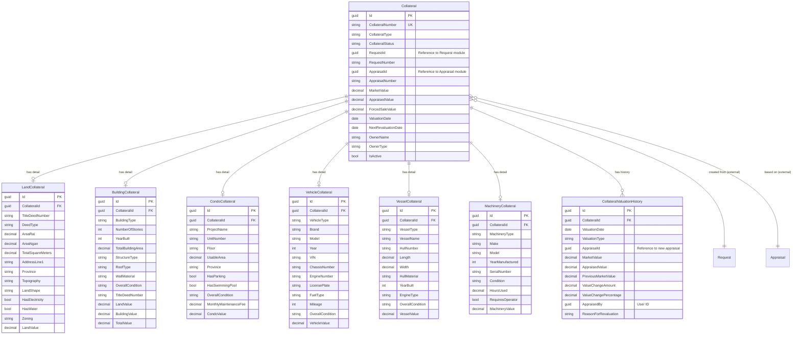

# Collateral Management Module - Data Model

## Overview

The Collateral Management Module maintains collateral records after appraisal completion. It supports multiple collateral types, valuation history tracking, lifecycle management, and revaluation scheduling.

### Key Features
- Multiple collateral types (6 types)
- Valuation history tracking
- Lifecycle management (Active → Disposed)
- Revaluation scheduling
- Document linkage
- Risk monitoring

## Module Structure

```
Collateral Module
├── Collateral (Aggregate Root)
├── LandCollateral (Land-specific Data)
├── BuildingCollateral (Building-specific Data)
├── CondoCollateral (Condo-specific Data)
├── VehicleCollateral (Vehicle-specific Data)
├── VesselCollateral (Vessel-specific Data)
├── MachineryCollateral (Machinery-specific Data)
├── CollateralValuationHistory (Revaluation Tracking)
└── CollateralDocuments (Final Documentation)
```

## Core Tables

### 1. Collaterals (Aggregate Root)

Main collateral entity created after appraisal completion.

#### SQL Schema

```sql
CREATE TABLE collateral.Collaterals
(
    -- Primary Key
    Id                      UNIQUEIDENTIFIER PRIMARY KEY DEFAULT NEWSEQUENTIALID(),

    -- Business Key
    CollateralNumber        NVARCHAR(50) UNIQUE NOT NULL,            -- Auto-generated: COL-2025-00001

    -- Collateral Type
    CollateralType          NVARCHAR(50) NOT NULL,                   -- Land, Building, LandAndBuilding, Condo, Vehicle, Vessel, Machinery
    CollateralStatus        NVARCHAR(50) NOT NULL DEFAULT 'Active',  -- Active, UnderReview, Disposed, WrittenOff

    -- Source References (from Request and Appraisal modules)
    RequestId               UNIQUEIDENTIFIER NOT NULL,               -- No FK (cross-module)
    RequestNumber           NVARCHAR(50) NOT NULL,
    AppraisalId             UNIQUEIDENTIFIER NOT NULL,               -- No FK (cross-module)
    AppraisalNumber         NVARCHAR(50) NOT NULL,

    -- Current Valuation
    MarketValue             DECIMAL(18,2) NOT NULL,
    AppraisedValue          DECIMAL(18,2) NOT NULL,
    ForcedSaleValue         DECIMAL(18,2) NULL,
    Currency                NVARCHAR(3) NOT NULL DEFAULT 'THB',

    -- Valuation Date
    ValuationDate           DATE NOT NULL,
    NextRevaluationDate     DATE NULL,
    RevaluationFrequency    INT NULL,                                -- Months

    -- Owner Information
    OwnerName               NVARCHAR(500) NOT NULL,
    OwnerType               NVARCHAR(50) NOT NULL,                   -- Individual, Corporate

    -- Location (for monitoring)
    Province                NVARCHAR(200) NULL,
    District                NVARCHAR(200) NULL,

    -- Lifecycle
    IsActive                BIT NOT NULL DEFAULT 1,
    ActivatedAt             DATETIME2 NULL,
    DisposedAt              DATETIME2 NULL,
    DisposalReason          NVARCHAR(500) NULL,

    -- Risk Monitoring
    RiskRating              NVARCHAR(20) NULL,                       -- Low, Medium, High
    LastRiskAssessment      DATETIME2 NULL,

    -- Notes
    Notes                   NVARCHAR(MAX) NULL,

    -- Audit Fields
    CreatedOn               DATETIME2 NOT NULL DEFAULT GETUTCDATE(),
    CreatedBy               UNIQUEIDENTIFIER NOT NULL,
    UpdatedOn               DATETIME2 NOT NULL DEFAULT GETUTCDATE(),
    UpdatedBy               UNIQUEIDENTIFIER NOT NULL,
    RowVersion              ROWVERSION NOT NULL,

    -- Soft Delete
    IsDeleted               BIT NOT NULL DEFAULT 0,
    DeletedOn               DATETIME2 NULL,
    DeletedBy               UNIQUEIDENTIFIER NULL,

    CONSTRAINT CK_Collateral_Type CHECK (CollateralType IN ('Land', 'Building', 'LandAndBuilding', 'Condo', 'Vehicle', 'Vessel', 'Machinery')),
    CONSTRAINT CK_Collateral_Status CHECK (CollateralStatus IN ('Active', 'UnderReview', 'Disposed', 'WrittenOff')),
    CONSTRAINT CK_Collateral_OwnerType CHECK (OwnerType IN ('Individual', 'Corporate')),
    CONSTRAINT CK_Collateral_Values CHECK (MarketValue > 0 AND AppraisedValue > 0)
);
```

### 2. LandCollaterals

Land-specific collateral information.

#### SQL Schema

```sql
CREATE TABLE collateral.LandCollaterals
(
    -- Primary Key
    Id                      UNIQUEIDENTIFIER PRIMARY KEY DEFAULT NEWSEQUENTIALID(),

    -- Foreign Key
    CollateralId            UNIQUEIDENTIFIER NOT NULL,

    -- Title Deed
    TitleDeedNumber         NVARCHAR(100) NOT NULL,
    DeedType                NVARCHAR(50) NOT NULL,                   -- Chanote, NorSor3, NorSor3Kor, NorSor4
    SurveyNumber            NVARCHAR(100) NULL,

    -- Land Area
    AreaRai                 DECIMAL(18,2) NULL,
    AreaNgan                DECIMAL(18,2) NULL,
    AreaSquareWa            DECIMAL(18,2) NULL,
    TotalSquareMeters       DECIMAL(18,2) NOT NULL,

    -- Location
    AddressLine1            NVARCHAR(500) NULL,
    AddressLine2            NVARCHAR(500) NULL,
    SubDistrict             NVARCHAR(200) NOT NULL,
    District                NVARCHAR(200) NOT NULL,
    Province                NVARCHAR(200) NOT NULL,
    PostalCode              NVARCHAR(20) NULL,

    -- Land Characteristics
    Topography              NVARCHAR(50) NULL,                       -- Flat, Sloped, Hilly
    LandShape               NVARCHAR(50) NULL,                       -- Regular, Irregular
    SoilType                NVARCHAR(50) NULL,                       -- Clay, Sandy, Loam

    -- Utilities & Access
    HasElectricity          BIT NOT NULL DEFAULT 0,
    HasWater                BIT NOT NULL DEFAULT 0,
    HasRoadAccess           BIT NOT NULL DEFAULT 0,
    RoadType                NVARCHAR(50) NULL,                       -- Paved, Gravel, Dirt

    -- Zoning & Use
    Zoning                  NVARCHAR(100) NULL,
    CurrentUse              NVARCHAR(100) NULL,

    -- Ownership & Encumbrances
    OwnershipType           NVARCHAR(50) NOT NULL,                   -- FullOwnership, CoOwnership
    OwnershipPercentage     DECIMAL(5,2) NULL,
    HasMortgage             BIT NOT NULL DEFAULT 0,
    HasLease                BIT NOT NULL DEFAULT 0,
    HasEasement             BIT NOT NULL DEFAULT 0,

    -- Valuation
    LandValue               DECIMAL(18,2) NOT NULL,

    -- Notes
    Notes                   NVARCHAR(MAX) NULL,

    -- Audit Fields
    CreatedOn               DATETIME2 NOT NULL DEFAULT GETUTCDATE(),
    CreatedBy               UNIQUEIDENTIFIER NOT NULL,
    UpdatedOn               DATETIME2 NOT NULL DEFAULT GETUTCDATE(),
    UpdatedBy               UNIQUEIDENTIFIER NOT NULL,

    CONSTRAINT FK_LandCollateral_Collateral FOREIGN KEY (CollateralId)
        REFERENCES collateral.Collaterals(Id) ON DELETE CASCADE,
    CONSTRAINT CK_LandCollateral_DeedType CHECK (DeedType IN ('Chanote', 'NorSor3', 'NorSor3Kor', 'NorSor4')),
    CONSTRAINT CK_LandCollateral_OwnershipType CHECK (OwnershipType IN ('FullOwnership', 'CoOwnership', 'Usufruct'))
);
```

### 3. BuildingCollaterals

Building-specific collateral information.

#### SQL Schema

```sql
CREATE TABLE collateral.BuildingCollaterals
(
    -- Primary Key
    Id                      UNIQUEIDENTIFIER PRIMARY KEY DEFAULT NEWSEQUENTIALID(),

    -- Foreign Key
    CollateralId            UNIQUEIDENTIFIER NOT NULL,

    -- Building Type
    BuildingType            NVARCHAR(50) NOT NULL,                   -- SingleHouse, Townhouse, Commercial
    NumberOfStories         INT NULL,
    YearBuilt               INT NULL,
    EffectiveAge            INT NULL,

    -- Areas
    TotalBuildingArea       DECIMAL(18,2) NOT NULL,                  -- Square meters
    UsableArea              DECIMAL(18,2) NULL,

    -- Structure
    StructureType           NVARCHAR(50) NULL,                       -- ReinforcedConcrete, Steel, Wood
    RoofType                NVARCHAR(50) NULL,                       -- Flat, Gable, Hip
    WallMaterial            NVARCHAR(50) NULL,                       -- Brick, Concrete, Wood
    FloorMaterial           NVARCHAR(50) NULL,                       -- Tile, Marble, Wood

    -- Condition
    OverallCondition        NVARCHAR(50) NULL,                       -- Excellent, Good, Fair, Poor
    MaintenanceLevel        NVARCHAR(50) NULL,                       -- WellMaintained, Average, NeedsWork

    -- Location (if separate from land)
    AddressLine1            NVARCHAR(500) NULL,
    AddressLine2            NVARCHAR(500) NULL,
    SubDistrict             NVARCHAR(200) NULL,
    District                NVARCHAR(200) NULL,
    Province                NVARCHAR(200) NULL,
    PostalCode              NVARCHAR(20) NULL,

    -- Title Deed (for buildings with land)
    TitleDeedNumber         NVARCHAR(100) NULL,
    DeedType                NVARCHAR(50) NULL,
    SurveyNumber            NVARCHAR(100) NULL,

    -- Land (if included)
    LandAreaRai             DECIMAL(18,2) NULL,
    LandAreaNgan            DECIMAL(18,2) NULL,
    LandAreaSquareWa        DECIMAL(18,2) NULL,
    TotalLandSquareMeters   DECIMAL(18,2) NULL,

    -- Ownership
    OwnershipType           NVARCHAR(50) NOT NULL,
    OwnershipPercentage     DECIMAL(5,2) NULL,
    HasMortgage             BIT NOT NULL DEFAULT 0,
    HasLease                BIT NOT NULL DEFAULT 0,
    HasEasement             BIT NOT NULL DEFAULT 0,

    -- Valuation Breakdown
    LandValue               DECIMAL(18,2) NULL,
    BuildingValue           DECIMAL(18,2) NOT NULL,
    TotalValue              DECIMAL(18,2) NOT NULL,

    -- Notes
    Notes                   NVARCHAR(MAX) NULL,

    -- Audit Fields
    CreatedOn               DATETIME2 NOT NULL DEFAULT GETUTCDATE(),
    CreatedBy               UNIQUEIDENTIFIER NOT NULL,
    UpdatedOn               DATETIME2 NOT NULL DEFAULT GETUTCDATE(),
    UpdatedBy               UNIQUEIDENTIFIER NOT NULL,

    CONSTRAINT FK_BuildingCollateral_Collateral FOREIGN KEY (CollateralId)
        REFERENCES collateral.Collaterals(Id) ON DELETE CASCADE,
    CONSTRAINT CK_BuildingCollateral_OwnershipType CHECK (OwnershipType IN ('FullOwnership', 'CoOwnership'))
);
```

### 4. CondoCollaterals

Condo-specific collateral information.

#### SQL Schema

```sql
CREATE TABLE collateral.CondoCollaterals
(
    -- Primary Key
    Id                      UNIQUEIDENTIFIER PRIMARY KEY DEFAULT NEWSEQUENTIALID(),

    -- Foreign Key
    CollateralId            UNIQUEIDENTIFIER NOT NULL,

    -- Project Information
    ProjectName             NVARCHAR(300) NOT NULL,
    Developer               NVARCHAR(200) NULL,
    YearCompleted           INT NULL,

    -- Unit Information
    UnitNumber              NVARCHAR(50) NOT NULL,
    Floor                   NVARCHAR(50) NOT NULL,
    BuildingName            NVARCHAR(200) NULL,
    UnitType                NVARCHAR(50) NULL,                       -- Studio, OneBedroom, TwoBedroom

    -- Area
    UsableArea              DECIMAL(18,2) NOT NULL,                  -- Square meters
    CommonArea              DECIMAL(18,2) NULL,
    TotalArea               DECIMAL(18,2) NULL,

    -- Location
    ProjectAddress          NVARCHAR(500) NULL,
    SubDistrict             NVARCHAR(200) NOT NULL,
    District                NVARCHAR(200) NOT NULL,
    Province                NVARCHAR(200) NOT NULL,
    PostalCode              NVARCHAR(20) NULL,

    -- Facilities
    HasParking              BIT NOT NULL DEFAULT 0,
    ParkingSpaces           INT NULL,
    HasSwimmingPool         BIT NOT NULL DEFAULT 0,
    HasFitness              BIT NOT NULL DEFAULT 0,
    HasSecurity             BIT NOT NULL DEFAULT 0,

    -- Condition
    OverallCondition        NVARCHAR(50) NULL,
    InteriorCondition       NVARCHAR(50) NULL,

    -- Ownership
    OwnershipType           NVARCHAR(50) NOT NULL DEFAULT 'FullOwnership',
    HasMortgage             BIT NOT NULL DEFAULT 0,

    -- Fees
    MonthlyMaintenanceFee   DECIMAL(18,2) NULL,
    SinkingFund             DECIMAL(18,2) NULL,

    -- Valuation
    CondoValue              DECIMAL(18,2) NOT NULL,

    -- Notes
    Notes                   NVARCHAR(MAX) NULL,

    -- Audit Fields
    CreatedOn               DATETIME2 NOT NULL DEFAULT GETUTCDATE(),
    CreatedBy               UNIQUEIDENTIFIER NOT NULL,
    UpdatedOn               DATETIME2 NOT NULL DEFAULT GETUTCDATE(),
    UpdatedBy               UNIQUEIDENTIFIER NOT NULL,

    CONSTRAINT FK_CondoCollateral_Collateral FOREIGN KEY (CollateralId)
        REFERENCES collateral.Collaterals(Id) ON DELETE CASCADE
);
```

### 5. VehicleCollaterals

Vehicle-specific collateral information.

#### SQL Schema

```sql
CREATE TABLE collateral.VehicleCollaterals
(
    -- Primary Key
    Id                      UNIQUEIDENTIFIER PRIMARY KEY DEFAULT NEWSEQUENTIALID(),

    -- Foreign Key
    CollateralId            UNIQUEIDENTIFIER NOT NULL,

    -- Vehicle Type
    VehicleType             NVARCHAR(50) NOT NULL,                   -- Car, Truck, Motorcycle

    -- Identification
    Brand                   NVARCHAR(100) NOT NULL,
    Model                   NVARCHAR(100) NOT NULL,
    Year                    INT NOT NULL,
    VIN                     NVARCHAR(100) NULL,                      -- Vehicle Identification Number
    ChassisNumber           NVARCHAR(100) NULL,
    EngineNumber            NVARCHAR(100) NULL,

    -- Registration
    LicensePlate            NVARCHAR(50) NULL,
    RegistrationProvince    NVARCHAR(200) NULL,

    -- Specifications
    EngineSize              NVARCHAR(50) NULL,                       -- e.g., "2.0L", "1500cc"
    FuelType                NVARCHAR(50) NULL,                       -- Gasoline, Diesel, Electric, Hybrid
    Transmission            NVARCHAR(50) NULL,                       -- Manual, Automatic
    Color                   NVARCHAR(50) NULL,

    -- Condition
    Mileage                 INT NULL,                                -- Kilometers
    OverallCondition        NVARCHAR(50) NULL,
    ExteriorCondition       NVARCHAR(50) NULL,
    InteriorCondition       NVARCHAR(50) NULL,
    MechanicalCondition     NVARCHAR(50) NULL,

    -- Ownership
    OwnershipType           NVARCHAR(50) NOT NULL DEFAULT 'FullOwnership',
    HasFinancing            BIT NOT NULL DEFAULT 0,
    FinanceCompany          NVARCHAR(200) NULL,

    -- Valuation
    VehicleValue            DECIMAL(18,2) NOT NULL,

    -- Notes
    Notes                   NVARCHAR(MAX) NULL,

    -- Audit Fields
    CreatedOn               DATETIME2 NOT NULL DEFAULT GETUTCDATE(),
    CreatedBy               UNIQUEIDENTIFIER NOT NULL,
    UpdatedOn               DATETIME2 NOT NULL DEFAULT GETUTCDATE(),
    UpdatedBy               UNIQUEIDENTIFIER NOT NULL,

    CONSTRAINT FK_VehicleCollateral_Collateral FOREIGN KEY (CollateralId)
        REFERENCES collateral.Collaterals(Id) ON DELETE CASCADE,
    CONSTRAINT CK_VehicleCollateral_Year CHECK (Year >= 1900 AND Year <= 2100)
);
```

### 6. CollateralValuationHistory

Tracks all revaluations over time.

#### SQL Schema

```sql
CREATE TABLE collateral.CollateralValuationHistory
(
    -- Primary Key
    Id                      UNIQUEIDENTIFIER PRIMARY KEY DEFAULT NEWSEQUENTIALID(),

    -- Foreign Key
    CollateralId            UNIQUEIDENTIFIER NOT NULL,

    -- Valuation Details
    ValuationDate           DATE NOT NULL,
    ValuationType           NVARCHAR(50) NOT NULL,                   -- Initial, Revaluation, Special
    AppraisalId             UNIQUEIDENTIFIER NULL,                   -- Reference to new appraisal

    -- Values
    MarketValue             DECIMAL(18,2) NOT NULL,
    AppraisedValue          DECIMAL(18,2) NOT NULL,
    ForcedSaleValue         DECIMAL(18,2) NULL,
    Currency                NVARCHAR(3) NOT NULL DEFAULT 'THB',

    -- Value Change
    PreviousMarketValue     DECIMAL(18,2) NULL,
    ValueChangeAmount       DECIMAL(18,2) NULL,
    ValueChangePercentage   DECIMAL(5,2) NULL,

    -- Appraiser
    AppraisedBy             UNIQUEIDENTIFIER NULL,
    AppraisedByName         NVARCHAR(200) NULL,

    -- Notes
    ValuationNotes          NVARCHAR(MAX) NULL,
    ReasonForRevaluation    NVARCHAR(500) NULL,

    -- Audit Fields
    CreatedOn               DATETIME2 NOT NULL DEFAULT GETUTCDATE(),
    CreatedBy               UNIQUEIDENTIFIER NOT NULL,

    CONSTRAINT FK_CollateralValuationHistory_Collateral FOREIGN KEY (CollateralId)
        REFERENCES collateral.Collaterals(Id) ON DELETE CASCADE,
    CONSTRAINT CK_CollateralValuationHistory_Type CHECK (ValuationType IN ('Initial', 'Revaluation', 'Special'))
);
```

## Indexes

```sql
-- Collateral indexes
CREATE INDEX IX_Collateral_CollateralNumber ON collateral.Collaterals(CollateralNumber);
CREATE INDEX IX_Collateral_RequestId ON collateral.Collaterals(RequestId);
CREATE INDEX IX_Collateral_AppraisalId ON collateral.Collaterals(AppraisalId);
CREATE INDEX IX_Collateral_Status ON collateral.Collaterals(CollateralStatus) WHERE IsDeleted = 0;
CREATE INDEX IX_Collateral_Type ON collateral.Collaterals(CollateralType) WHERE IsDeleted = 0;
CREATE INDEX IX_Collateral_NextRevaluationDate ON collateral.Collaterals(NextRevaluationDate) WHERE IsActive = 1;
CREATE INDEX IX_Collateral_Province ON collateral.Collaterals(Province) WHERE IsDeleted = 0;

-- LandCollateral indexes
CREATE INDEX IX_LandCollateral_CollateralId ON collateral.LandCollaterals(CollateralId);
CREATE INDEX IX_LandCollateral_TitleDeedNumber ON collateral.LandCollaterals(TitleDeedNumber);
CREATE INDEX IX_LandCollateral_Province ON collateral.LandCollaterals(Province);

-- BuildingCollateral indexes
CREATE INDEX IX_BuildingCollateral_CollateralId ON collateral.BuildingCollaterals(CollateralId);
CREATE INDEX IX_BuildingCollateral_TitleDeedNumber ON collateral.BuildingCollaterals(TitleDeedNumber) WHERE TitleDeedNumber IS NOT NULL;
CREATE INDEX IX_BuildingCollateral_Province ON collateral.BuildingCollaterals(Province);

-- CondoCollateral indexes
CREATE INDEX IX_CondoCollateral_CollateralId ON collateral.CondoCollaterals(CollateralId);
CREATE INDEX IX_CondoCollateral_ProjectName ON collateral.CondoCollaterals(ProjectName);
CREATE INDEX IX_CondoCollateral_Province ON collateral.CondoCollaterals(Province);

-- VehicleCollateral indexes
CREATE INDEX IX_VehicleCollateral_CollateralId ON collateral.VehicleCollaterals(CollateralId);
CREATE INDEX IX_VehicleCollateral_LicensePlate ON collateral.VehicleCollaterals(LicensePlate) WHERE LicensePlate IS NOT NULL;
CREATE INDEX IX_VehicleCollateral_ChassisNumber ON collateral.VehicleCollaterals(ChassisNumber) WHERE ChassisNumber IS NOT NULL;

-- CollateralValuationHistory indexes
CREATE INDEX IX_CollateralValuationHistory_CollateralId ON collateral.CollateralValuationHistory(CollateralId);
CREATE INDEX IX_CollateralValuationHistory_ValuationDate ON collateral.CollateralValuationHistory(ValuationDate DESC);
```

## Entity Relationship Diagram



**Legend:**
- **Solid lines** = Internal module relationships (with FK constraints)
- **"(external)"** = References to other modules (no FK constraints)
- Only ONE property detail table is used per collateral (based on CollateralType)
- Only key fields shown for clarity; see full schemas above for complete field lists

**Key Design Notes:**
1. **Type-Specific Tables**: Each collateral type has its own detail table (Land, Building, Condo, Vehicle, Vessel, Machinery)
2. **Valuation History**: Tracks all revaluations over time with change calculations
3. **Created from Appraisal**: Collateral records are created automatically when appraisal is completed
4. **Cross-Module References**: RequestId and AppraisalId stored without FK constraints
5. **Revaluation Scheduling**: NextRevaluationDate field for automated scheduling

## Enumerations

```csharp
public enum CollateralStatus
{
    Active,
    UnderReview,
    Disposed,
    WrittenOff
}

public enum ValuationType
{
    Initial,
    Revaluation,
    Special
}
```

---

**Related Documentation**:
- **[02-request-module.md](02-request-module.md)** - Request creation that triggers collateral process
- **[03-appraisal-module.md](03-appraisal-module.md)** - Appraisal that creates collateral
- **[15-sample-data.md](15-sample-data.md)** - Sample collateral data
