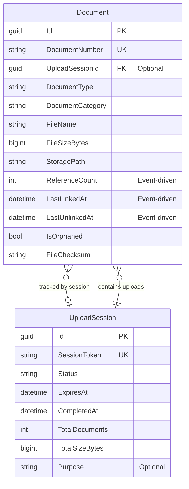
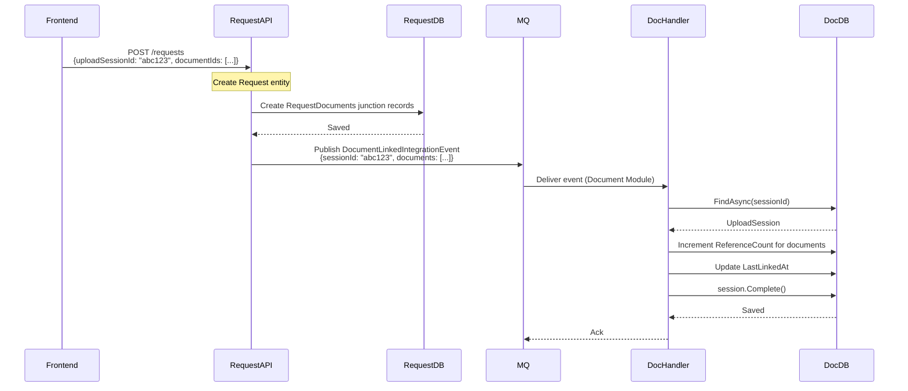
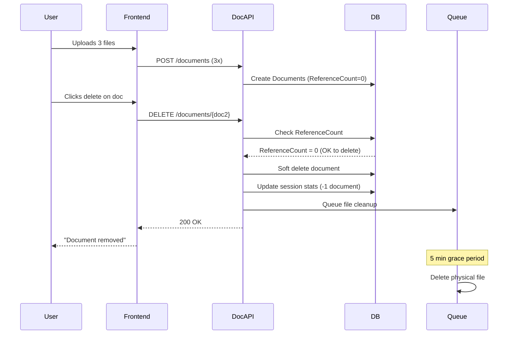
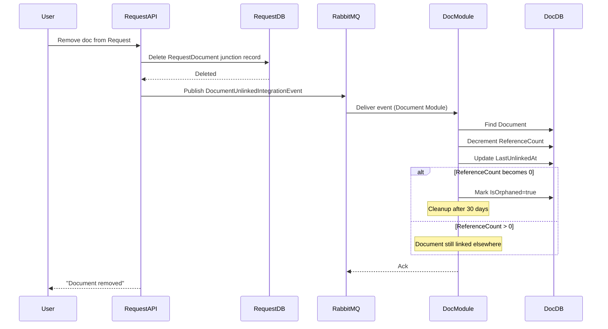
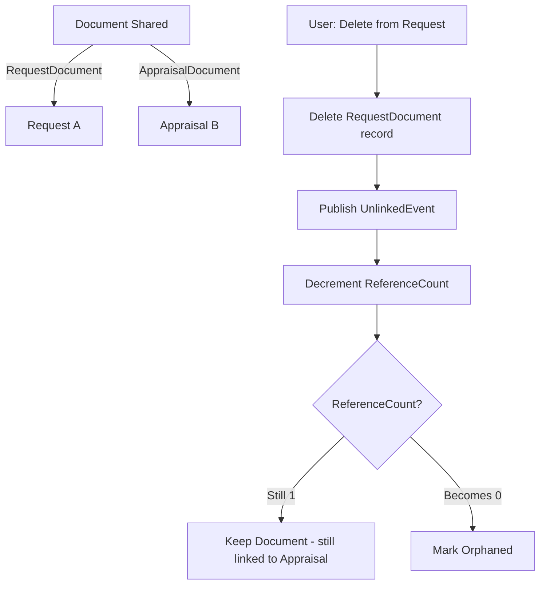

# Document Module - Data Model

## Overview

The Document Module provides centralized document management with local file system storage. All system documents (photos, PDFs, reports, supporting documents) are managed through this module.

### Phase 1 Features (Current Implementation)
- ✅ Centralized document storage
- ✅ Local file system storage
- ✅ Basic document metadata
- ✅ Upload tracking with session management
- ✅ File integrity verification (checksum)
- ✅ Event-driven reference counting for multi-entity sharing
- ✅ Orphaned document detection and cleanup
- ✅ Upload session lifecycle management
- ✅ Integration with owner modules via events

### Future Enhancements (Phase 2+)
- 🔮 Version control and history
- 🔮 Advanced access control and permissions
- 🔮 Access audit logging
- 🔮 Document templates for reports
- 🔮 Cloud storage migration (Azure Blob, AWS S3)

## Module Structure

```
Document Module (Phase 1)
├── Document (Aggregate Root)
├── UploadSession (Upload Context & Lifecycle)
└── UnusedDocuments (View for Orphan Detection)

Note: Entity-document relationships are managed by owner modules:
- Request Module: RequestDocuments table
- Appraisal Module: AppraisalDocuments table
- Collateral Module: CollateralDocuments table

Future Enhancement Tables (Phase 2+)
├── DocumentVersion (Version History)
├── DocumentAccess (Access Permissions)
├── DocumentAccessLog (Audit Trail)
└── DocumentTemplate (Report Templates)
```

## Entity Relationship Diagram (Phase 1)



**Note on Entity Relationships:**
Entity-document linkages are managed by owner modules (Request, Appraisal, Collateral, etc.) in their own junction tables:
- `request.RequestDocuments` links Request → Document
- `appraisal.AppraisalDocuments` links Appraisal → Document
- etc.

**Legend:**
- **Event-Driven Reference Counting** = Document module receives integration events from owner modules to maintain ReferenceCount
- **Upload Sessions** = Temporal grouping for batch uploads (entity-agnostic)
- **Orphan Detection** = Based on ReferenceCount = 0 with grace period

**Key Design Notes:**
1. **Decentralized Linking**: Owner modules manage their own document relationships
2. **Event-Driven Counts**: ReferenceCount and link timestamps maintained via DocumentLinked/Unlinked integration events
3. **Module Independence**: Document module doesn't know about specific entity types
4. **Orphan Detection**: Identify documents uploaded but never linked, or with all links removed (based on ReferenceCount)
5. **Simplified Sessions**: Sessions are entity-agnostic temporal containers, not tied to specific entities
6. **Multi-Entity Sharing**: Single session can upload documents for multiple entities (e.g., Request + multiple RequestTitles)
7. **Metadata Tagging**: Use CustomMetadata JSON field to tag documents during upload (e.g., titleSetNumber for grouping)

## Table Definition

### Documents (Aggregate Root)

Main document entity for all system documents.

#### SQL Schema

```sql
CREATE TABLE document.Documents
(
    -- Primary Key
    Id                      UNIQUEIDENTIFIER PRIMARY KEY DEFAULT NEWSEQUENTIALID(),

    -- Business Key
    DocumentNumber          NVARCHAR(50) UNIQUE NOT NULL,            -- Auto-generated: DOC-2025-00001

    -- Upload Session Tracking
    UploadSessionId         UNIQUEIDENTIFIER NULL,                   -- FK to UploadSessions (optional)

    -- Document Classification
    DocumentType            NVARCHAR(100) NOT NULL,                  -- TitleDeed, Photo, Report, IDCard, Contract
    DocumentCategory        NVARCHAR(50) NOT NULL,                   -- Legal, AppraisalMedia, Report, Supporting

    -- File Information
    FileName                NVARCHAR(255) NOT NULL,
    FileExtension           NVARCHAR(10) NOT NULL,                   -- pdf, jpg, png, docx
    FileSizeBytes           BIGINT NOT NULL,
    MimeType                NVARCHAR(100) NOT NULL,

    -- Storage (Local File System)
    StoragePath             NVARCHAR(500) NOT NULL,                  -- Physical path: /var/uploads/documents/2025/01/abc123.pdf
    StorageUrl              NVARCHAR(500) NOT NULL,                  -- Web access URL: /api/documents/abc123/download

    -- Upload Information
    UploadedBy              UNIQUEIDENTIFIER NOT NULL,               -- User ID (no FK - cross-module reference)
    UploadedByName          NVARCHAR(200) NOT NULL,
    UploadedAt              DATETIME2 NOT NULL DEFAULT GETUTCDATE(),

    -- Reference Counting (for orphan detection)
    ReferenceCount          INT NOT NULL DEFAULT 0,                  -- How many entities link to this document
    LastLinkedAt            DATETIME2 NULL,                          -- When last entity linked to this
    LastUnlinkedAt          DATETIME2 NULL,                          -- When last entity unlinked

    -- Orphan Detection
    IsOrphaned              BIT NOT NULL DEFAULT 0,                  -- Flagged for cleanup
    OrphanedReason          NVARCHAR(200) NULL,                      -- Why marked as orphaned

    -- Access Control
    AccessLevel             NVARCHAR(50) NOT NULL DEFAULT 'Internal', -- Public, Internal, Confidential, Restricted

    -- Status
    IsActive                BIT NOT NULL DEFAULT 1,
    IsArchived              BIT NOT NULL DEFAULT 0,
    ArchivedAt              DATETIME2 NULL,
    ArchivedBy              UNIQUEIDENTIFIER NULL,
    ArchivedByName          NVARCHAR(200) NULL,

    -- Metadata
    Description             NVARCHAR(500) NULL,
    Tags                    NVARCHAR(MAX) NULL,                      -- JSON array of tags
    CustomMetadata          NVARCHAR(MAX) NULL,                      -- JSON for additional metadata

    -- File Integrity
    FileChecksum            NVARCHAR(100) NULL,                      -- SHA256 hash
    ChecksumAlgorithm       NVARCHAR(20) NULL DEFAULT 'SHA256',

    -- Audit Fields
    CreatedOn               DATETIME2 NOT NULL DEFAULT GETUTCDATE(),
    CreatedBy               UNIQUEIDENTIFIER NOT NULL,
    UpdatedOn               DATETIME2 NOT NULL DEFAULT GETUTCDATE(),
    UpdatedBy               UNIQUEIDENTIFIER NOT NULL,
    RowVersion              ROWVERSION NOT NULL,

    -- Soft Delete
    IsDeleted               BIT NOT NULL DEFAULT 0,
    DeletedOn               DATETIME2 NULL,
    DeletedBy               UNIQUEIDENTIFIER NULL,

    CONSTRAINT FK_Document_UploadSession FOREIGN KEY (UploadSessionId)
        REFERENCES document.UploadSessions(Id),
    CONSTRAINT CK_Document_AccessLevel CHECK (AccessLevel IN ('Public', 'Internal', 'Confidential', 'Restricted')),
    CONSTRAINT CK_Document_FileSizeBytes CHECK (FileSizeBytes > 0)
);
```

#### Key Fields Explanation

**Business Key:**
- `DocumentNumber`: Auto-generated unique identifier (e.g., DOC-2025-00001)

**Document Classification:**
- `DocumentType`: Type of document (TitleDeed, Photo, Report, IDCard, etc.)
- `DocumentCategory`: Category grouping (Legal, AppraisalMedia, Report, Supporting)

**Storage (Local File System):**
- `StoragePath`: Physical path on disk (e.g., `/var/uploads/documents/2025/01/abc123.pdf`)
- `StorageUrl`: Web access URL for download (e.g., `/api/documents/abc123/download`)

**Access Control:**
- `AccessLevel`: Basic access control (Public, Internal, Confidential, Restricted)

**File Integrity:**
- `FileChecksum`: SHA256 hash for file integrity verification
- `ChecksumAlgorithm`: Algorithm used for checksum (default: SHA256)

**Reference Counting (Event-Driven):**
- `ReferenceCount`: Count of how many entities link to this document (maintained via DocumentLinked/Unlinked events)
- `LastLinkedAt`: Timestamp when last entity linked (set via DocumentLinkedIntegrationEvent)
- `LastUnlinkedAt`: Timestamp when last entity unlinked (set via DocumentUnlinkedIntegrationEvent)
- **Note**: These fields are updated by the Document module when it receives integration events from owner modules (Request, Appraisal, etc.)

**Orphan Detection:**
- `IsOrphaned`: Flag indicating document is marked for cleanup
- `OrphanedReason`: Categorization of why document is orphaned (e.g., "Never Linked", "All Links Removed")

**Custom Metadata (Flexible Tagging):**
- `CustomMetadata`: JSON field for storing arbitrary metadata
- **Primary Use Case**: Title grouping and document organization during multi-entity uploads

**CustomMetadata JSON Structure for Multi-Title Scenarios:**
```json
{
  "titleSetNumber": 1,               // Which title this document belongs to (0 = shared across all)
  "titlePrefix": "Title",            // Display prefix (e.g., "Title", "Plan", "Shared")
  "titleSequence": 1,                // Order within the title set
  "documentGroupType": "title-specific",  // or "shared"
  "comment": "Original title deed",  // User comment about this document
  "userTags": ["important", "verified"]  // Optional user-defined tags
}
```

**Example Metadata by Document Type:**
```json
// Title-specific document (Title #1)
{
  "titleSetNumber": 1,
  "titlePrefix": "Title",
  "titleSequence": 1,
  "documentGroupType": "title-specific",
  "comment": "โฉนดที่ดินเลขที่ 123456"
}

// Title-specific document (Title #2)
{
  "titleSetNumber": 2,
  "titlePrefix": "Title",
  "titleSequence": 1,
  "documentGroupType": "title-specific",
  "comment": "โฉนดที่ดินเลขที่ 789012"
}

// Shared document (across all titles)
{
  "titleSetNumber": 0,
  "titlePrefix": "Shared",
  "documentGroupType": "shared",
  "comment": "Invoice for entire request"
}
```

**Why CustomMetadata vs Dedicated Columns:**
- ✅ **Flexibility**: No schema migration needed for new grouping requirements
- ✅ **Extensibility**: Supports future metadata needs without DB changes
- ✅ **Specificity**: Different entity types can use different metadata structures
- ✅ **Backward Compatibility**: Adding new metadata fields doesn't break existing documents

### 2. UploadSessions

Tracks upload lifecycle as a temporal grouping mechanism for batch uploads. Sessions provide audit trail and enable orphan detection.

**Design Philosophy:** Upload sessions serve as temporary containers during the upload phase. Once documents are linked to entities by owner modules (via their junction tables like RequestDocuments), and the Document module receives integration events, the session's primary role is historical record-keeping for audit and compliance.

#### SQL Schema

```sql
CREATE TABLE document.UploadSessions
(
    -- Primary Key
    Id                      UNIQUEIDENTIFIER PRIMARY KEY DEFAULT NEWSEQUENTIALID(),

    -- Session Identification
    SessionToken            NVARCHAR(100) UNIQUE NOT NULL,           -- Unique token for this session

    -- Session Lifecycle
    Status                  NVARCHAR(50) NOT NULL DEFAULT 'InProgress', -- InProgress, Completed, Abandoned, Expired
    ExpiresAt               DATETIME2 NOT NULL,                      -- Auto-expire after X hours (default 24h)
    CompletedAt             DATETIME2 NULL,                         -- When session was marked complete

    -- Upload Statistics
    TotalDocuments          INT NOT NULL DEFAULT 0,                  -- Count of documents uploaded in this session
    TotalSizeBytes          BIGINT NOT NULL DEFAULT 0,               -- Total size of all uploads

    -- Session Metadata
    Purpose                 NVARCHAR(200) NULL,                      -- Optional description of upload purpose
    UserAgent               NVARCHAR(500) NULL,                      -- Browser/client user agent
    IpAddress               NVARCHAR(50) NULL,                       -- Client IP address

    -- Audit Fields
    CreatedOn               DATETIME2 NOT NULL DEFAULT GETUTCDATE(),
    CreatedBy               UNIQUEIDENTIFIER NOT NULL,
    UpdatedOn               DATETIME2 NOT NULL DEFAULT GETUTCDATE(),
    UpdatedBy               UNIQUEIDENTIFIER NOT NULL,

    CONSTRAINT CK_UploadSession_Status CHECK (Status IN ('InProgress', 'Completed', 'Abandoned', 'Expired'))
);
```

**Key Design Changes:**
- ❌ **Removed:** `IntendedEntityType`, `IntendedEntityId` - No pre-declaration of entity context
- ❌ **Removed:** `LinkedEntityType`, `LinkedEntityId`, `LinkedAt` - Entity links tracked by owner modules in their junction tables
- ✅ **Simplified:** Session is now entity-agnostic temporal grouping
- ✅ **Benefit:** Single session can serve multiple entities (e.g., Request + multiple RequestTitles)

### 3. Document-Entity Relationships

**Design Decision:** Document-to-entity relationships are NOT managed by the Document module. Instead, each owner module manages its own junction tables:

**Request Module** (`request` schema):
```sql
CREATE TABLE request.RequestDocuments
(
    Id              UNIQUEIDENTIFIER PRIMARY KEY,
    RequestId       UNIQUEIDENTIFIER NOT NULL,
    DocumentId      UNIQUEIDENTIFIER NOT NULL,  -- References document.Documents
    -- Module-specific fields...
    CONSTRAINT FK_RequestDocument_Request FOREIGN KEY (RequestId)
        REFERENCES request.Requests(Id),
    CONSTRAINT UQ_RequestDocument UNIQUE (RequestId, DocumentId)
);
```

**Appraisal Module** (`appraisal` schema):
```sql
CREATE TABLE appraisal.AppraisalDocuments
(
    Id              UNIQUEIDENTIFIER PRIMARY KEY,
    AppraisalId     UNIQUEIDENTIFIER NOT NULL,
    DocumentId      UNIQUEIDENTIFIER NOT NULL,  -- References document.Documents
    -- Module-specific fields...
);
```

**Why This Design:**
- ✅ **Better DDD**: Each aggregate manages its own associations
- ✅ **Module Independence**: No coupling between Document module and entity types
- ✅ **Flexibility**: Each module can add entity-specific link metadata
- ✅ **Simpler Queries**: No polymorphic references or cross-module joins

**How Reference Counting Works:**
1. Owner module creates junction record (e.g., RequestDocument)
2. Owner module publishes `DocumentLinkedIntegrationEvent`
3. Document module receives event and increments `ReferenceCount`
4. Document module updates `LastLinkedAt` timestamp

See "Integration Events" section below for details.

### 4. Integration Events

The Document module uses integration events to coordinate document linking across modules via message broker (RabbitMQ/MassTransit).

#### DocumentLinkedIntegrationEvent

Published by owner modules (Request, Appraisal, etc.) after they create junction table records (e.g., RequestDocument). The Document module consumes this event to:
1. Increment document ReferenceCount
2. Update LastLinkedAt timestamp
3. Complete the upload session (if all links are processed)

**Event Definition:**
```csharp
public record DocumentLinkedIntegrationEvent : IntegrationEvent
{
    // Entity that documents are being linked to
    public string EntityType { get; set; }  // "Request", "RequestTitle", "Appraisal", etc.
    public Guid EntityId { get; set; }

    // Session tracking (CRITICAL for completing session)
    public Guid SessionId { get; set; }     // UploadSession.Id to complete

    // Documents to link
    public List<Guid> Documents { get; set; }  // Document IDs to link

    // Audit information
    public DateTime LinkedAt { get; set; }
    public string LinkedBy { get; set; }    // User ID who created the entity
}
```

**Publishing Flow (Request Module Example):**
```csharp
// In CreateRequestCommandHandler (Request Module)
public async Task<CreateRequestResult> Handle(CreateRequestCommand command)
{
    // 1. Create Request entity
    var request = Request.Create(...);
    await requestRepository.AddAsync(request);

    // 2. Create junction table records (RequestDocuments)
    foreach (var documentId in command.DocumentIds)
    {
        var requestDocument = new RequestDocument
        {
            RequestId = request.Id,
            DocumentId = documentId
        };
        await dbContext.RequestDocuments.AddAsync(requestDocument);
    }

    await dbContext.SaveChangesAsync();

    // 3. Publish event to notify Document module
    await publishEndpoint.Publish(new DocumentLinkedIntegrationEvent
    {
        EntityType = "Request",
        EntityId = request.Id,
        SessionId = command.UploadSessionId.Value,  // ✅ CRITICAL for session completion
        Documents = command.DocumentIds,
        LinkedAt = DateTime.UtcNow,
        LinkedBy = currentUser.UserId
    });

    return new CreateRequestResult(request.Id);
}
```

**Consumption Flow (Document Module):**
```csharp
// DocumentLinkedIntegrationEventHandler (Document Module)
public class DocumentLinkedIntegrationEventHandler : IConsumer<DocumentLinkedIntegrationEvent>
{
    public async Task Consume(ConsumeContext<DocumentLinkedIntegrationEvent> context)
    {
        var data = context.Message;

        // 1. Update reference counts for all documents
        foreach (var documentId in data.Documents)
        {
            var document = await dbContext.Documents
                .FirstOrDefaultAsync(d => d.Id == documentId);

            if (document != null)
            {
                // Increment reference count
                document.ReferenceCount++;
                document.LastLinkedAt = data.LinkedAt;

                // Clear orphaned flag if previously marked
                if (document.IsOrphaned)
                {
                    document.IsOrphaned = false;
                    document.OrphanedReason = null;
                }
            }
            else
            {
                logger.LogWarning(
                    "Document {DocumentId} not found for linking to {EntityType} {EntityId}",
                    documentId, data.EntityType, data.EntityId);
            }
        }

        // 2. Complete the session if provided
        if (data.SessionId != Guid.Empty)
        {
            var session = await dbContext.UploadSessions
                .FirstOrDefaultAsync(s => s.Id == data.SessionId);

            if (session != null && session.Status == "InProgress")
            {
                session.Status = "Completed";
                session.CompletedAt = DateTime.UtcNow;
            }
        }

        await dbContext.SaveChangesAsync();

        logger.LogInformation(
            "Linked {Count} documents to {EntityType} {EntityId}",
            data.Documents.Count, data.EntityType, data.EntityId);
    }
}
```

**Key Implementation Notes:**
- ✅ **SessionId is CRITICAL**: Without it, Document module cannot find and complete the session
- ✅ **Multiple Events per Entity**: Publish separate events for each entity that links documents
- ✅ **Entity Information**: EntityType and EntityId are for audit/logging only in Document module
- ✅ **Idempotency**: Document module should handle duplicate events gracefully (check if already incremented)
- ✅ **Audit Trail**: LinkedAt and LinkedBy captured for historical tracking
- ✅ **Junction Tables First**: Owner modules must create their junction records BEFORE publishing events

**Current Implementation Status:**
- ✅ Event defined in `Shared.Messaging`
- ✅ Handler implemented in Document module
- ⚠️ **Request module** needs to publish events after creating RequestDocuments

#### DocumentUnlinkedIntegrationEvent

Published by owner modules when they delete junction table records (e.g., RequestDocument). The Document module consumes this event to:
1. Decrement ReferenceCount
2. Update LastUnlinkedAt timestamp
3. Mark document as orphaned if ReferenceCount reaches 0

**Event Definition:**
```csharp
public record DocumentUnlinkedIntegrationEvent : IntegrationEvent
{
    public string EntityType { get; set; }      // For audit/logging
    public Guid EntityId { get; set; }           // For audit/logging
    public List<Guid> Documents { get; set; }    // Documents to unlink
    public DateTime UnlinkedAt { get; set; }
    public string UnlinkedBy { get; set; }
}
```

**Publishing Flow (Request Module Example):**
```csharp
// In DeleteRequestDocumentCommandHandler (Request Module)
public async Task<Result> Handle(DeleteRequestDocumentCommand command)
{
    // 1. Remove junction table record
    var requestDocument = await dbContext.RequestDocuments
        .FirstOrDefaultAsync(rd => rd.RequestId == command.RequestId
                                && rd.DocumentId == command.DocumentId);

    if (requestDocument == null)
        return Result.Failure(Error.NotFound("Document link not found"));

    dbContext.RequestDocuments.Remove(requestDocument);
    await dbContext.SaveChangesAsync();

    // 2. Publish event to notify Document module
    await publishEndpoint.Publish(new DocumentUnlinkedIntegrationEvent
    {
        EntityType = "Request",
        EntityId = command.RequestId,
        Documents = new List<Guid> { command.DocumentId },
        UnlinkedAt = DateTime.UtcNow,
        UnlinkedBy = currentUser.UserId
    });

    return Result.Success();
}
```

**Consumption Flow (Document Module):**
```csharp
// DocumentUnlinkedIntegrationEventHandler (Document Module)
public class DocumentUnlinkedIntegrationEventHandler : IConsumer<DocumentUnlinkedIntegrationEvent>
{
    public async Task Consume(ConsumeContext<DocumentUnlinkedIntegrationEvent> context)
    {
        var data = context.Message;

        foreach (var documentId in data.Documents)
        {
            var document = await dbContext.Documents
                .FirstOrDefaultAsync(d => d.Id == documentId);

            if (document == null) continue;

            // Decrement reference count
            document.ReferenceCount = Math.Max(0, document.ReferenceCount - 1);
            document.LastUnlinkedAt = data.UnlinkedAt;

            // Mark as orphaned if no more references
            if (document.ReferenceCount == 0)
            {
                document.IsOrphaned = true;
                document.OrphanedReason = "All Links Removed";
            }
        }

        await dbContext.SaveChangesAsync();

        logger.LogInformation(
            "Unlinked {Count} documents from {EntityType} {EntityId}",
            data.Documents.Count, data.EntityType, data.EntityId);
    }
}
```

### 5. UnusedDocuments (View)

View for identifying orphaned documents eligible for cleanup.

#### SQL Schema

```sql
CREATE VIEW document.vw_UnusedDocuments
AS
SELECT
    d.Id,
    d.DocumentNumber,
    d.FileName,
    d.FileSizeBytes,
    d.UploadSessionId,
    d.ReferenceCount,
    d.CreatedOn,
    d.LastLinkedAt,
    d.LastUnlinkedAt,
    DATEDIFF(DAY, d.CreatedOn, GETUTCDATE()) as DaysOld,
    DATEDIFF(DAY, d.LastUnlinkedAt, GETUTCDATE()) as DaysSinceUnlinked,
    us.Status as SessionStatus,
    us.ExpiresAt as SessionExpiresAt,
    us.CompletedAt as SessionCompletedAt,
    CASE
        -- Never uploaded as part of session
        WHEN d.UploadSessionId IS NULL AND d.ReferenceCount = 0
            THEN 'Orphaned - Direct Upload Never Linked'

        -- Uploaded in session but session never completed
        WHEN us.Id IS NOT NULL
             AND us.Status IN ('Abandoned', 'Expired')
             AND d.ReferenceCount = 0
            THEN 'Orphaned - Session Abandoned'

        -- Uploaded in completed session but never linked
        WHEN us.Id IS NOT NULL
             AND us.Status = 'Completed'
             AND d.ReferenceCount = 0
            THEN 'Orphaned - Uploaded but Not Linked'

        -- Had links but all removed
        WHEN d.LastUnlinkedAt IS NOT NULL
             AND d.ReferenceCount = 0
            THEN 'Abandoned - All Links Removed'

        ELSE 'Unknown'
    END as UnusedReason,

    -- Cleanup eligibility
    CASE
        -- Session-based uploads: cleanup after 7 days if session expired/abandoned
        WHEN d.UploadSessionId IS NOT NULL
             AND us.Status IN ('Abandoned', 'Expired')
             AND d.ReferenceCount = 0
             AND d.CreatedOn < DATEADD(DAY, -7, GETUTCDATE())
            THEN 1

        -- Unlinked documents: cleanup after 30 days
        WHEN d.ReferenceCount = 0
             AND d.LastUnlinkedAt IS NOT NULL
             AND d.LastUnlinkedAt < DATEADD(DAY, -30, GETUTCDATE())
            THEN 1

        -- Direct uploads never linked: cleanup after 7 days
        WHEN d.UploadSessionId IS NULL
             AND d.ReferenceCount = 0
             AND d.CreatedOn < DATEADD(DAY, -7, GETUTCDATE())
            THEN 1

        ELSE 0
    END as IsEligibleForCleanup

FROM document.Documents d
LEFT JOIN document.UploadSessions us ON us.Id = d.UploadSessionId
WHERE d.ReferenceCount = 0
  AND d.IsDeleted = 0;
```

## Indexes

```sql
-- Document indexes
CREATE INDEX IX_Document_DocumentNumber ON document.Documents(DocumentNumber);
CREATE INDEX IX_Document_DocumentType ON document.Documents(DocumentType) WHERE IsDeleted = 0;
CREATE INDEX IX_Document_DocumentCategory ON document.Documents(DocumentCategory) WHERE IsDeleted = 0;
CREATE INDEX IX_Document_UploadedBy ON document.Documents(UploadedBy) WHERE IsDeleted = 0;
CREATE INDEX IX_Document_UploadedAt ON document.Documents(UploadedAt DESC);
CREATE INDEX IX_Document_AccessLevel ON document.Documents(AccessLevel) WHERE IsDeleted = 0;
CREATE INDEX IX_Document_IsActive ON document.Documents(IsActive) WHERE IsDeleted = 0;

-- Document indexes for orphan detection
CREATE INDEX IX_Document_ReferenceCount ON document.Documents(ReferenceCount) WHERE ReferenceCount = 0;
CREATE INDEX IX_Document_UploadSessionId ON document.Documents(UploadSessionId);
CREATE INDEX IX_Document_IsOrphaned ON document.Documents(IsOrphaned) WHERE IsOrphaned = 1;
CREATE INDEX IX_Document_LastUnlinkedAt ON document.Documents(LastUnlinkedAt) WHERE ReferenceCount = 0;

-- UploadSession indexes
CREATE INDEX IX_UploadSession_SessionToken ON document.UploadSessions(SessionToken);
CREATE INDEX IX_UploadSession_Status ON document.UploadSessions(Status);
CREATE INDEX IX_UploadSession_ExpiresAt ON document.UploadSessions(ExpiresAt) WHERE Status = 'InProgress';
```

## Enumerations

```csharp
public enum DocumentType
{
    TitleDeed,
    Photo,
    Video,
    Report,
    IDCard,
    HouseRegistration,
    Contract,
    Template,
    Other
}

public enum DocumentCategory
{
    Legal,
    AppraisalMedia,
    Report,
    Supporting,
    Template
}

public enum AccessLevel
{
    Public,
    Internal,
    Confidential,
    Restricted
}

public enum UploadSessionStatus
{
    InProgress,
    Completed,
    Abandoned,
    Expired
}

public enum DocumentLinkType
{
    Original,          // First entity this document was created for
    Shared,            // Document shared from another entity
    Referenced,        // Reference/copy link to same document
    Attachment         // Attached as supporting document
}

public enum UnusedReason
{
    DirectUploadNeverLinked,      // Uploaded directly but never linked to any entity
    SessionAbandoned,             // Upload session was abandoned/expired
    NeverLinkedToIntendedEntity,  // Uploaded for specific entity but never linked
    AllLinksRemoved               // Had links but all were removed
}
```

## Cleanup Strategies and Policies

### Orphaned Document Detection

Documents become orphaned in several scenarios:

1. **Direct Upload Never Linked** (Immediate Orphan)
   - Document uploaded but never linked to any entity
   - No upload session associated
   - ReferenceCount = 0

2. **Session Abandoned** (Delayed Orphan)
   - Document uploaded as part of a session
   - Session status = Abandoned or Expired
   - ReferenceCount = 0

3. **Never Linked to Intended Entity** (Intent Mismatch)
   - Document uploaded for specific entity (via session)
   - Session completed but document not linked to intended entity
   - ReferenceCount = 0

4. **All Links Removed** (Deprecated Document)
   - Document previously had links
   - All links have been soft-deleted or removed
   - ReferenceCount = 0
   - LastUnlinkedAt is set

### Cleanup Retention Policies

**Tiered Retention Strategy:**

```sql
-- Policy 1: Session-based uploads (abandoned/expired)
-- Cleanup after 7 days if session abandoned and document never linked
IF UploadSessionId IS NOT NULL
   AND SessionStatus IN ('Abandoned', 'Expired')
   AND ReferenceCount = 0
   AND CreatedOn < DATEADD(DAY, -7, GETUTCDATE())
THEN eligible for cleanup

-- Policy 2: Unlinked documents with previous links
-- Cleanup after 30 days if all links removed
IF ReferenceCount = 0
   AND LastUnlinkedAt IS NOT NULL
   AND LastUnlinkedAt < DATEADD(DAY, -30, GETUTCDATE())
THEN eligible for cleanup

-- Policy 3: Direct uploads never linked
-- Cleanup after 7 days if uploaded directly and never used
IF UploadSessionId IS NULL
   AND ReferenceCount = 0
   AND CreatedOn < DATEADD(DAY, -7, GETUTCDATE())
THEN eligible for cleanup
```

### Automated Cleanup Process

**Scheduled Job (Daily at 2:00 AM):**

```csharp
public class DocumentCleanupService
{
    public async Task CleanupOrphanedDocumentsAsync()
    {
        // 1. Identify eligible documents using view
        var eligibleDocuments = await _dbContext.UnusedDocuments
            .Where(d => d.IsEligibleForCleanup == 1)
            .ToListAsync();

        foreach (var doc in eligibleDocuments)
        {
            // 2. Double-check reference count (safety check)
            var document = await _dbContext.Documents.FindAsync(doc.Id);

            if (document.ReferenceCount > 0)
            {
                // Skip - document still has references
                // This could happen if events were processed after view was queried
                _logger.LogWarning(
                    "Document {DocumentId} has ReferenceCount={Count}, skipping cleanup",
                    doc.Id, document.ReferenceCount);
                continue;
            }

            // 3. Mark as orphaned (should already be set, but ensure it)
            document.IsOrphaned = true;
            document.OrphanedReason = doc.UnusedReason;

            // 4. Archive or soft-delete
            document.IsDeleted = true;
            document.DeletedOn = DateTime.UtcNow;
            document.DeletedBy = Guid.Empty; // System cleanup

            // 5. Delete physical file (optional - can be deferred)
            await _storageService.DeleteFileAsync(document.StoragePath);

            _logger.LogInformation(
                "Cleaned up orphaned document {DocumentId} - {FileName}",
                document.Id, document.FileName);
        }

        await _dbContext.SaveChangesAsync();
    }
}
```

### Manual Review Process

**Before Automated Cleanup:**

1. **Grace Period Notification** (2 days before cleanup)
   - Notify document owners of pending cleanup
   - Allow manual review and restoration

2. **Admin Dashboard**
   - View all documents pending cleanup
   - Review orphan reasons
   - Manually exclude documents from cleanup

3. **Audit Trail**
   - Log all cleanup actions
   - Track who deleted/archived documents
   - Maintain cleanup history

### Upload Session Lifecycle Management

**Session Expiration:**

```csharp
// Auto-expire sessions after 24 hours of inactivity
public class UploadSessionExpirationService
{
    public async Task ExpireInactiveSessionsAsync()
    {
        var now = DateTime.UtcNow;

        var expiredSessions = await _dbContext.UploadSessions
            .Where(s => s.Status == UploadSessionStatus.InProgress
                     && s.ExpiresAt < now)
            .ToListAsync();

        foreach (var session in expiredSessions)
        {
            session.Status = UploadSessionStatus.Expired;
            session.UpdatedOn = now;
        }

        await _dbContext.SaveChangesAsync();
    }
}
```

**Session Completion:**

```csharp
// Add Complete() method to UploadSession model
public class UploadSession
{
    // ... existing properties

    public void Complete(DateTime completedAt)
    {
        if (Status == "Completed")
            throw new InvalidOperationException("Session is already completed");

        if (Status == "Expired" || Status == "Abandoned")
            throw new InvalidOperationException($"Cannot complete {Status} session");

        Status = "Completed";
        CompletedAt = completedAt;
        UpdatedOn = completedAt;
    }
}

// Usage in Document module handler
public class DocumentLinkedIntegrationEventHandler : IConsumer<DocumentLinkedIntegrationEvent>
{
    public async Task Consume(ConsumeContext<DocumentLinkedIntegrationEvent> context)
    {
        var data = context.Message;

        // 1. Find session by SessionId from event
        var session = await _dbContext.UploadSessions
            .FirstOrDefaultAsync(s => s.Id == data.SessionId);

        if (session == null)
        {
            _logger.LogWarning("Upload session {SessionId} not found", data.SessionId);
            return;
        }

        // 2. Link documents to entity
        foreach (var documentId in data.Documents)
        {
            var document = await _dbContext.Documents
                .FirstOrDefaultAsync(d => d.Id == documentId);

            if (document != null)
            {
                document.LinkToEntity(data.EntityType, data.EntityId,
                                     data.LinkedAt, data.LinkedBy);
            }
        }

        // 3. Complete the session (simplified - no entity info stored)
        session.Complete(DateTime.UtcNow);

        await _dbContext.SaveChangesAsync();
    }
}
```

### How Document Module Finds Upload Session

The Document module needs to find and complete the upload session when documents are linked to entities. There are two approaches:

#### Approach A: SessionId in Integration Event (Recommended) ✅

**How It Works:**
1. Each Document stores `UploadSessionId` foreign key when uploaded
2. Request module receives `uploadSessionId` in CreateRequestCommand
3. When Request created, Request module publishes `DocumentLinkedIntegrationEvent` **with SessionId**
4. Document module handler receives event and directly finds session by ID
5. Session marked as Completed

**Event Structure:**
```csharp
public record DocumentLinkedIntegrationEvent : IntegrationEvent
{
    public string EntityType { get; set; }
    public Guid EntityId { get; set; }
    public Guid SessionId { get; set; }        // ✅ CRITICAL FIELD
    public List<Guid> Documents { get; set; }
    public DateTime LinkedAt { get; set; }
    public string LinkedBy { get; set; }
}
```

**Handler Implementation:**
```csharp
public async Task Consume(ConsumeContext<DocumentLinkedIntegrationEvent> context)
{
    var data = context.Message;

    // Direct lookup by SessionId
    var session = await _dbContext.UploadSessions
        .FindAsync(data.SessionId);  // ✅ Fast, indexed lookup

    if (session != null)
    {
        // Link documents...
        session.Complete(DateTime.UtcNow);
        await _dbContext.SaveChangesAsync();
    }
}
```

**Advantages:**
- ✅ **Fast**: Direct PK lookup, no joins
- ✅ **Explicit**: Clear intent, session ID passed intentionally
- ✅ **Reliable**: No ambiguity about which session to complete
- ✅ **Simple**: One database query

**Requirements:**
- Request module must accept `uploadSessionId` in command
- Event must include `SessionId` property
- Frontend must pass session ID when creating entity

---

#### Approach B: Query Session via Document FK (Fallback)

**How It Works:**
1. Documents store `UploadSessionId` FK
2. Event includes list of Document IDs (but no SessionId)
3. Handler queries any document to find its session
4. Assumes all documents from same session

**Handler Implementation:**
```csharp
public async Task Consume(ConsumeContext<DocumentLinkedIntegrationEvent> context)
{
    var data = context.Message;

    // Query session via document FK
    var firstDocument = await _dbContext.Documents
        .Include(d => d.UploadSession)
        .FirstOrDefaultAsync(d => data.Documents.Contains(d.Id));

    var session = firstDocument?.UploadSession;

    if (session != null)
    {
        // Link documents...
        session.Complete(DateTime.UtcNow);
        await _dbContext.SaveChangesAsync();
    }
}
```

**Advantages:**
- ✅ Works without changing event contract
- ✅ No frontend changes needed

**Disadvantages:**
- ❌ Requires join to UploadSession table
- ❌ Assumes all documents from same session (could be wrong)
- ❌ Additional database query
- ❌ Less explicit, harder to debug

---

#### Approach Comparison

| Aspect | Approach A (SessionId in Event) | Approach B (Query via FK) |
|--------|--------------------------------|---------------------------|
| **Performance** | Fast (PK lookup) | Slower (join + filter) |
| **Reliability** | Explicit, clear | Assumes all docs same session |
| **Implementation** | Requires event change | Works with current event |
| **Debugging** | Easy (SessionId visible) | Harder (implicit lookup) |
| **Scalability** | Excellent | Good |
| **Recommended** | ✅ **Yes** | ⚠️ Fallback only |

---

#### Session Completion Flow Diagram



---

#### Multi-Entity Session Completion

**Challenge:** When using single session for multiple entities (Request + RequestTitles), multiple events published with same SessionId.

**Solution:** Idempotent completion - only first event completes session.

```csharp
public void Complete(DateTime completedAt)
{
    // Idempotent: already completed, do nothing
    if (Status == "Completed")
    {
        _logger.LogDebug("Session {Id} already completed, skipping", Id);
        return;
    }

    if (Status != "InProgress")
        throw new InvalidOperationException($"Cannot complete {Status} session");

    Status = "Completed";
    CompletedAt = completedAt;
}
```

**Flow:**
```
Event 1 (RequestTitle #1) → Complete() → Status = "Completed" ✅
Event 2 (RequestTitle #2) → Complete() → Already completed, skip ✅
Event 3 (Request) → Complete() → Already completed, skip ✅
```

**Key Points:**
- ✅ First event to process completes the session
- ✅ Subsequent events see Status="Completed" and skip
- ✅ No race conditions (database-level consistency)
- ✅ Works regardless of event processing order

### Reference Count Maintenance

**Event-Driven Updates:**

Reference counting is maintained through integration events. Owner modules (Request, Appraisal, etc.) publish events when they create or delete junction table records.

```csharp
// Owner Module: Create junction record and publish event
public async Task LinkDocumentToRequest(Guid requestId, Guid documentId)
{
    // 1. Create junction table record (Request Module)
    var requestDocument = new RequestDocument
    {
        RequestId = requestId,
        DocumentId = documentId
    };
    await _dbContext.RequestDocuments.AddAsync(requestDocument);
    await _dbContext.SaveChangesAsync();

    // 2. Publish event (Request Module)
    await _publishEndpoint.Publish(new DocumentLinkedIntegrationEvent
    {
        EntityType = "Request",
        EntityId = requestId,
        Documents = new List<Guid> { documentId },
        LinkedAt = DateTime.UtcNow,
        LinkedBy = _currentUser.UserId
    });
}

// Document Module: Receive event and update count
public class DocumentLinkedIntegrationEventHandler : IConsumer<DocumentLinkedIntegrationEvent>
{
    public async Task Consume(ConsumeContext<DocumentLinkedIntegrationEvent> context)
    {
        foreach (var documentId in context.Message.Documents)
        {
            var document = await _dbContext.Documents.FindAsync(documentId);
            if (document != null)
            {
                document.ReferenceCount++;
                document.LastLinkedAt = context.Message.LinkedAt;

                if (document.IsOrphaned)
                {
                    document.IsOrphaned = false;
                    document.OrphanedReason = null;
                }
            }
        }
        await _dbContext.SaveChangesAsync();
    }
}

// Similar pattern for unlinking
public class DocumentUnlinkedIntegrationEventHandler : IConsumer<DocumentUnlinkedIntegrationEvent>
{
    public async Task Consume(ConsumeContext<DocumentUnlinkedIntegrationEvent> context)
    {
        foreach (var documentId in context.Message.Documents)
        {
            var document = await _dbContext.Documents.FindAsync(documentId);
            if (document != null)
            {
                document.ReferenceCount = Math.Max(0, document.ReferenceCount - 1);
                document.LastUnlinkedAt = context.Message.UnlinkedAt;

                if (document.ReferenceCount == 0)
                {
                    document.IsOrphaned = true;
                    document.OrphanedReason = "All Links Removed";
                }
            }
        }
        await _dbContext.SaveChangesAsync();
    }
}
```

## Document Deletion Strategies

The Document module implements different deletion strategies depending on the document lifecycle stage and reference count status.

### Deletion Scenarios

#### Scenario 1: Delete Document During Upload Phase (Before Entity Creation)

**Context:** User uploads documents to a session, then decides to remove one before clicking "Save".

**Current Implementation Issues:**
- ❌ Uses hard delete (`dbContext.Documents.Remove()`)
- ❌ No audit trail
- ❌ Physical file not cleaned up
- ❌ Session statistics (TotalDocuments) not updated

**Recommended Implementation:**

```csharp
public class DeleteDocumentCommand : IRequest<Result<bool>>
{
    public Guid DocumentId { get; set; }
    public string DeletedBy { get; set; }
}

public class DeleteDocumentHandler : IRequestHandler<DeleteDocumentCommand, Result<bool>>
{
    public async Task<Result<bool>> Handle(DeleteDocumentCommand request)
    {
        var document = await _dbContext.Documents
            .Include(d => d.UploadSession)
            .FirstOrDefaultAsync(d => d.Id == request.DocumentId);

        if (document == null)
            return Result.Failure<bool>(Error.NotFound("Document not found"));

        // Protection: Cannot delete if referenced by entities
        if (document.ReferenceCount > 0)
            return Result.Failure<bool>(Error.Validation(
                "Cannot delete document that is linked to entities. Unlink first."));

        // Soft delete the document
        document.MarkAsDeleted(DateTime.UtcNow, request.DeletedBy);

        // Update session statistics if applicable
        if (document.UploadSession != null)
        {
            document.UploadSession.TotalDocuments--;
            document.UploadSession.TotalSizeBytes -= document.FileSizeBytes;
        }

        await _dbContext.SaveChangesAsync();

        // Queue physical file for async deletion
        await _fileCleanupQueue.EnqueueAsync(new FileCleanupJob
        {
            DocumentId = document.Id,
            StoragePath = document.StoragePath,
            ScheduledFor = DateTime.UtcNow.AddMinutes(5) // Grace period
        });

        return Result.Success(true);
    }
}
```

**Flow Diagram:**


#### Scenario 2: Unlink Document from Entity (After Entity Saved)

**Context:** User wants to remove a document from a Request/RequestTitle, but the document should remain in system (might be linked elsewhere).

**Correct Pattern - Unlink, Not Delete:**

```csharp
// In Request Module
public class RemoveDocumentFromRequestCommand : IRequest<Result>
{
    public Guid RequestId { get; set; }
    public Guid DocumentId { get; set; }
    public string UnlinkedBy { get; set; }
}

public class RemoveDocumentFromRequestHandler : IRequestHandler<RemoveDocumentFromRequestCommand, Result>
{
    public async Task<Result> Handle(RemoveDocumentFromRequestCommand request)
    {
        // Remove reference from Request aggregate
        var requestEntity = await _repository.GetByIdAsync(request.RequestId);
        requestEntity.RemoveDocument(request.DocumentId);

        await _repository.UpdateAsync(requestEntity);

        // Publish integration event to Document module
        await _publisher.Publish(new DocumentUnlinkedIntegrationEvent
        {
            EntityType = "Request",
            EntityId = request.RequestId,
            Documents = new List<Guid> { request.DocumentId },
            UnlinkedAt = DateTime.UtcNow,
            UnlinkedBy = request.UnlinkedBy
        });

        return Result.Success();
    }
}

**Flow Diagram:**


#### Scenario 3: Hard Delete Document (Admin Operation)

**Context:** Administrator needs to permanently delete a document (e.g., uploaded by mistake, contains sensitive data).

**Implementation with Safety Checks:**

```csharp
public class HardDeleteDocumentCommand : IRequest<Result<bool>>
{
    public Guid DocumentId { get; set; }
    public string DeletedBy { get; set; }
    public bool Force { get; set; } // Bypass reference count check
    public string Reason { get; set; }
}

public class HardDeleteDocumentHandler : IRequestHandler<HardDeleteDocumentCommand, Result<bool>>
{
    public async Task<Result<bool>> Handle(HardDeleteDocumentCommand request)
    {
        var document = await _dbContext.Documents
            .FirstOrDefaultAsync(d => d.Id == request.DocumentId);

        if (document == null)
            return Result.Failure<bool>(Error.NotFound("Document not found"));

        // Safety check: Prevent deletion if linked to entities (unless forced)
        if (document.ReferenceCount > 0 && !request.Force)
        {
            return Result.Failure<bool>(Error.Validation(
                $"Document is linked to {document.ReferenceCount} entity/entities. " +
                "Use Force=true to override."));
        }

        // Log deletion for audit
        await _auditLog.LogAsync(new DocumentDeletionAudit
        {
            DocumentId = document.Id,
            DocumentNumber = document.DocumentNumber,
            FileName = document.FileName,
            ReferenceCount = document.ReferenceCount,
            DeletedBy = request.DeletedBy,
            Reason = request.Reason,
            DeletedAt = DateTime.UtcNow,
            IsForced = request.Force
        });

        // Delete physical file first
        try
        {
            await _documentService.DeleteFileAsync(document.StoragePath);
        }
        catch (Exception ex)
        {
            _logger.LogError(ex, "Failed to delete physical file {Path}", document.StoragePath);
            // Continue with database deletion
        }

        // Hard delete Document record
        // Note: Owner modules must clean up their junction records separately
        _dbContext.Documents.Remove(document);
        await _dbContext.SaveChangesAsync();

        return Result.Success(true);
    }
}
```

#### Scenario 4: Automated Cleanup Job

**Context:** Scheduled job runs daily to clean up orphaned documents after retention period.

**Implementation:**

```csharp
public class OrphanedDocumentCleanupJob : IBackgroundJob
{
    public async Task ExecuteAsync(CancellationToken cancellationToken)
    {
        _logger.LogInformation("Starting orphaned document cleanup job");

        // Query eligible documents from view
        var orphanedDocuments = await _dbContext.Database
            .SqlQuery<Guid>(@"
                SELECT Id
                FROM document.vw_UnusedDocuments
                WHERE IsEligibleForCleanup = 1
            ")
            .ToListAsync(cancellationToken);

        _logger.LogInformation("Found {Count} documents eligible for cleanup", orphanedDocuments.Count);

        int deleted = 0;
        int failed = 0;

        foreach (var documentId in orphanedDocuments)
        {
            try
            {
                var document = await _dbContext.Documents
                    .FirstOrDefaultAsync(d => d.Id == documentId, cancellationToken);

                if (document == null) continue;

                // Double-check ReferenceCount (safety)
                if (document.ReferenceCount > 0)
                {
                    _logger.LogWarning(
                        "Skipping {DocumentId} - ReferenceCount is {Count} (expected 0)",
                        documentId,
                        document.ReferenceCount
                    );
                    continue;
                }

                // Soft delete document
                document.MarkAsDeleted(DateTime.UtcNow, "System.CleanupJob");

                // Delete physical file
                if (File.Exists(document.StoragePath))
                {
                    File.Delete(document.StoragePath);
                    _logger.LogDebug("Deleted physical file {Path}", document.StoragePath);
                }

                deleted++;
            }
            catch (Exception ex)
            {
                _logger.LogError(ex, "Failed to cleanup document {DocumentId}", documentId);
                failed++;
            }
        }

        await _dbContext.SaveChangesAsync(cancellationToken);

        _logger.LogInformation(
            "Cleanup job completed. Deleted: {Deleted}, Failed: {Failed}",
            deleted,
            failed
        );
    }
}
```

### Deletion Rules Summary

| Scenario | Action | ReferenceCount | Physical File | Audit Trail |
|----------|--------|----------------|---------------|-------------|
| **Delete during upload** | Soft delete | Must be 0 | Queued for cleanup | ✅ Preserved |
| **Unlink from entity** | Soft delete link | Decremented | Kept if Ref > 0 | ✅ Preserved |
| **All links removed** | Mark orphaned | Becomes 0 | Cleaned after 30d | ✅ Preserved |
| **Admin hard delete** | Hard delete | Can force | Deleted immediately | ✅ Audit log |
| **Automated cleanup** | Soft delete | Must be 0 | Deleted | ✅ Preserved |

### Protection Mechanisms

1. **Reference Count Check:** Cannot delete document with ReferenceCount > 0 (without force flag)
2. **Soft Delete Default:** All user-initiated deletions are soft deletes
3. **Grace Period:** Physical files deleted after grace period (5 minutes for user delete, retention period for orphans)
4. **Audit Logging:** All deletions logged with reason and user
5. **Double-Check in Jobs:** Automated jobs verify ReferenceCount before cleanup

### Edge Cases

#### Edge Case 1: Concurrent Deletion and Linking

**Problem:** Thread A tries to delete document while Thread B tries to link it to entity.

**Solution:** Use database transaction isolation and ReferenceCount as gate.

```csharp
// In DeleteDocument
using var transaction = await _dbContext.Database.BeginTransactionAsync();

var document = await _dbContext.Documents
    .Where(d => d.Id == documentId)
    .FirstOrDefaultAsync();

// Lock row for update
await _dbContext.Database.ExecuteSqlRawAsync(
    "SELECT * FROM document.Documents WITH (UPDLOCK, ROWLOCK) WHERE Id = {0}",
    documentId
);

if (document.ReferenceCount > 0)
    return Error.Validation("Document is being linked");

// Proceed with deletion
await transaction.CommitAsync();
```

#### Edge Case 2: Physical File Already Deleted

**Problem:** Database record exists but physical file missing.

**Solution:** Handle gracefully, log warning, continue with database cleanup.

```csharp
try
{
    await _fileService.DeleteAsync(document.StoragePath);
}
catch (FileNotFoundException)
{
    _logger.LogWarning(
        "Physical file not found for document {Id} at {Path}. Continuing with cleanup.",
        document.Id,
        document.StoragePath
    );
}
```

#### Edge Case 3: Document Shared Across Multiple Entities

**Problem:** Document linked to Request A and Appraisal B. User deletes from Request A.

**Solution:** Unlink only removes one junction table record (RequestDocument). ReferenceCount prevents full deletion.



### Best Practices

1. **Always unlink, never delete** when removing documents from entities
2. **Use soft delete** for all user-initiated deletions
3. **Check ReferenceCount** before any deletion operation
4. **Queue physical file cleanup** with grace period
5. **Log all deletions** for audit and compliance
6. **Implement retention policies** via automated jobs, not user actions
7. **Use integration events** for cross-module coordination

## Usage Examples

### Upload Document (Local Storage)

```csharp
var document = Document.Create(
    documentType: DocumentType.Photo,
    category: DocumentCategory.AppraisalMedia,
    fileName: "property-front.jpg",
    fileSizeBytes: 2048576,
    storagePath: "/var/uploads/documents/2025/01/abc123-property-front.jpg",
    storageUrl: "/api/documents/abc123/download",
    uploadedBy: userId,
    uploadedByName: "John Appraiser"
);

await _documentRepository.AddAsync(document);
await _unitOfWork.SaveChangesAsync();
```

### Query Documents

```csharp
// Get all photos for an appraisal
var photos = await _documentRepository
    .GetByTypeAsync(DocumentType.Photo)
    .Where(d => d.Tags.Contains(appraisalId))
    .ToListAsync();

// Get recent uploads
var recentDocs = await _documentRepository
    .GetRecentUploadsAsync(days: 7, userId: currentUserId);
```

### Local Storage Configuration

```json
// appsettings.json
{
  "DocumentStorage": {
    "BasePath": "/var/uploads/documents",
    "BaseUrl": "/api/documents",
    "MaxFileSizeMB": 100,
    "AllowedExtensions": [".pdf", ".jpg", ".jpeg", ".png", ".docx", ".xlsx"],
    "OrganizeByDate": true
  }
}
```

```csharp
// Document storage service example
public class LocalDocumentStorageService
{
    private readonly string _basePath;

    public async Task<string> SaveFileAsync(Stream fileStream, string fileName)
    {
        // Generate unique file name
        var uniqueFileName = $"{Guid.NewGuid()}-{fileName}";

        // Organize by year/month
        var datePath = DateTime.UtcNow.ToString("yyyy/MM");
        var directoryPath = Path.Combine(_basePath, datePath);

        // Ensure directory exists
        Directory.CreateDirectory(directoryPath);

        // Save file
        var fullPath = Path.Combine(directoryPath, uniqueFileName);
        using var fileStream = File.Create(fullPath);
        await fileStream.CopyToAsync(fileStream);

        return fullPath;
    }

    public async Task<Stream> GetFileAsync(string storagePath)
    {
        if (!File.Exists(storagePath))
            throw new FileNotFoundException("Document not found");

        return File.OpenRead(storagePath);
    }
}
```

### Carter API Endpoints (Frontend Integration)

#### 1. Create Upload Session Endpoint

```csharp
public class CreateUploadSessionEndpoint : ICarterModule
{
    public void AddRoutes(IEndpointRouteBuilder app)
    {
        app.MapPost("/api/documents/sessions", async (
            CreateUploadSessionRequest request,
            DocumentDbContext dbContext,
            IHttpContextAccessor httpContextAccessor) =>
        {
            var userId = httpContextAccessor.HttpContext?.User.GetUserId();
            var userName = httpContextAccessor.HttpContext?.User.GetUserName();

            var session = new UploadSession
            {
                Id = Guid.NewGuid(),
                SessionToken = Guid.NewGuid().ToString(),
                Status = UploadSessionStatus.InProgress,
                IntendedEntityType = request.IntendedEntityType,
                IntendedEntityId = request.IntendedEntityId,
                ExpiresAt = DateTime.UtcNow.AddHours(24),
                TotalDocuments = 0,
                TotalSizeBytes = 0,
                Purpose = request.Purpose,
                CreatedBy = userId,
                CreatedByName = userName
            };

            await dbContext.UploadSessions.AddAsync(session);
            await dbContext.SaveChangesAsync();

            return Results.Ok(new CreateUploadSessionResponse
            {
                SessionToken = session.SessionToken,
                ExpiresAt = session.ExpiresAt
            });
        })
        .WithName("CreateUploadSession")
        .WithTags("Documents")
        .Produces<CreateUploadSessionResponse>(StatusCodes.Status200OK)
        .RequireAuthorization();
    }
}

public record CreateUploadSessionRequest
{
    public string IntendedEntityType { get; init; }  // "Request", "Appraisal", etc.
    public Guid? IntendedEntityId { get; init; }
    public string Purpose { get; init; }
}

public record CreateUploadSessionResponse
{
    public string SessionToken { get; init; }
    public DateTime ExpiresAt { get; init; }
}
```

**Frontend Usage:**

```typescript
// Create upload session when user opens "Create Request" page
const response = await fetch('/api/documents/sessions', {
  method: 'POST',
  headers: {
    'Content-Type': 'application/json',
    'Authorization': `Bearer ${token}`
  },
  body: JSON.stringify({
    intendedEntityType: 'Request',
    purpose: 'New request documents'
  })
});

const { sessionToken, expiresAt } = await response.json();
// Store sessionToken for subsequent uploads
```

---

#### 2. Upload Single Document Endpoint

```csharp
public class UploadDocumentEndpoint : ICarterModule
{
    public void AddRoutes(IEndpointRouteBuilder app)
    {
        app.MapPost("/api/documents/upload", async (
            HttpContext context,
            DocumentDbContext dbContext,
            IDocumentStorageService storageService,
            IHttpContextAccessor httpContextAccessor) =>
        {
            var form = await context.Request.ReadFormAsync();

            // Get form fields
            var sessionToken = form["sessionToken"].ToString();
            var documentTypeStr = form["documentType"].ToString();
            var categoryStr = form["category"].ToString();
            var description = form["description"].ToString();

            // Get uploaded file
            var file = form.Files.GetFile("file");
            if (file == null || file.Length == 0)
                return Results.BadRequest("No file uploaded");

            // Validate file size (100MB max)
            if (file.Length > 100 * 1024 * 1024)
                return Results.BadRequest("File size exceeds 100MB limit");

            // Parse enums
            if (!Enum.TryParse<DocumentType>(documentTypeStr, out var documentType))
                return Results.BadRequest("Invalid document type");

            if (!Enum.TryParse<DocumentCategory>(categoryStr, out var category))
                return Results.BadRequest("Invalid document category");

            // Find upload session
            var session = await dbContext.UploadSessions
                .FirstOrDefaultAsync(s => s.SessionToken == sessionToken);

            if (session == null)
                return Results.BadRequest("Upload session not found");

            if (session.Status != UploadSessionStatus.InProgress)
                return Results.BadRequest("Upload session is not active");

            if (session.ExpiresAt < DateTime.UtcNow)
                return Results.BadRequest("Upload session has expired");

            // Save file to disk
            using var fileStream = file.OpenReadStream();
            var storagePath = await storageService.SaveFileAsync(fileStream, file.FileName);

            // Calculate checksum
            fileStream.Position = 0;
            var checksum = await CalculateChecksumAsync(fileStream);

            var userId = httpContextAccessor.HttpContext?.User.GetUserId();
            var userName = httpContextAccessor.HttpContext?.User.GetUserName();

            // Create document record
            var document = new Document
            {
                Id = Guid.NewGuid(),
                DocumentNumber = await GenerateDocumentNumberAsync(dbContext),
                DocumentType = documentType,
                DocumentCategory = category,
                FileName = file.FileName,
                FileSizeBytes = file.Length,
                FileExtension = Path.GetExtension(file.FileName),
                MimeType = file.ContentType,
                StoragePath = storagePath,
                StorageUrl = $"/api/documents/{Guid.NewGuid()}/download",
                UploadSessionId = session.Id,
                ReferenceCount = 0,
                FileChecksum = checksum,
                ChecksumAlgorithm = "SHA256",
                Description = description,
                AccessLevel = AccessLevel.Internal,
                IsActive = true,
                UploadedAt = DateTime.UtcNow,
                UploadedBy = userId,
                UploadedByName = userName,
                CreatedBy = userId,
                UpdatedBy = userId
            };

            await dbContext.Documents.AddAsync(document);

            // Update session statistics
            session.TotalDocuments++;
            session.TotalSizeBytes += file.Length;
            session.UpdatedOn = DateTime.UtcNow;

            await dbContext.SaveChangesAsync();

            return Results.Ok(new UploadDocumentResponse
            {
                DocumentId = document.Id,
                DocumentNumber = document.DocumentNumber,
                FileName = document.FileName,
                FileSizeBytes = document.FileSizeBytes,
                StorageUrl = document.StorageUrl
            });
        })
        .WithName("UploadDocument")
        .WithTags("Documents")
        .Produces<UploadDocumentResponse>(StatusCodes.Status200OK)
        .DisableAntiforgery() // Required for file uploads
        .RequireAuthorization();
    }

    private static async Task<string> CalculateChecksumAsync(Stream stream)
    {
        using var sha256 = System.Security.Cryptography.SHA256.Create();
        var hash = await sha256.ComputeHashAsync(stream);
        return Convert.ToBase64String(hash);
    }

    private static async Task<string> GenerateDocumentNumberAsync(DocumentDbContext dbContext)
    {
        var count = await dbContext.Documents.CountAsync();
        return $"DOC-{DateTime.UtcNow:yyyy}-{(count + 1):D5}";
    }
}

public record UploadDocumentResponse
{
    public Guid DocumentId { get; init; }
    public string DocumentNumber { get; init; }
    public string FileName { get; init; }
    public long FileSizeBytes { get; init; }
    public string StorageUrl { get; init; }
}
```

**Frontend Usage:**

```typescript
// Upload single file
async function uploadDocument(file: File, sessionToken: string) {
  const formData = new FormData();
  formData.append('file', file);
  formData.append('sessionToken', sessionToken);
  formData.append('documentType', 'TitleDeed');
  formData.append('category', 'Legal');
  formData.append('description', 'Property title deed');

  const response = await fetch('/api/documents/upload', {
    method: 'POST',
    headers: {
      'Authorization': `Bearer ${token}`
      // Don't set Content-Type - browser sets it with boundary
    },
    body: formData
  });

  if (!response.ok) {
    const error = await response.json();
    throw new Error(error.message);
  }

  return await response.json();
}

// Usage
const result = await uploadDocument(file, sessionToken);
console.log('Uploaded:', result.documentNumber);
```

---

#### 3. Upload Multiple Documents (Batch) Endpoint

```csharp
public class UploadDocumentsBatchEndpoint : ICarterModule
{
    public void AddRoutes(IEndpointRouteBuilder app)
    {
        app.MapPost("/api/documents/upload-batch", async (
            HttpContext context,
            DocumentDbContext dbContext,
            IDocumentStorageService storageService,
            IHttpContextAccessor httpContextAccessor) =>
        {
            var form = await context.Request.ReadFormAsync();
            var sessionToken = form["sessionToken"].ToString();
            var files = form.Files;

            if (files.Count == 0)
                return Results.BadRequest("No files uploaded");

            // Find upload session
            var session = await dbContext.UploadSessions
                .FirstOrDefaultAsync(s => s.SessionToken == sessionToken);

            if (session == null)
                return Results.BadRequest("Upload session not found");

            if (session.Status != UploadSessionStatus.InProgress)
                return Results.BadRequest("Upload session is not active");

            var userId = httpContextAccessor.HttpContext?.User.GetUserId();
            var userName = httpContextAccessor.HttpContext?.User.GetUserName();
            var uploadedDocuments = new List<UploadDocumentResponse>();

            foreach (var file in files)
            {
                if (file.Length == 0) continue;

                // Get metadata for this file (if provided)
                var fileIndex = files.GetFiles().ToList().IndexOf(file);
                var documentTypeStr = form[$"documentTypes[{fileIndex}]"].ToString();
                var categoryStr = form[$"categories[{fileIndex}]"].ToString();

                if (!Enum.TryParse<DocumentType>(documentTypeStr, out var documentType))
                    documentType = DocumentType.Other;

                if (!Enum.TryParse<DocumentCategory>(categoryStr, out var category))
                    category = DocumentCategory.Supporting;

                // Save file
                using var fileStream = file.OpenReadStream();
                var storagePath = await storageService.SaveFileAsync(fileStream, file.FileName);

                // Create document record
                var document = new Document
                {
                    Id = Guid.NewGuid(),
                    DocumentNumber = await GenerateDocumentNumberAsync(dbContext),
                    DocumentType = documentType,
                    DocumentCategory = category,
                    FileName = file.FileName,
                    FileSizeBytes = file.Length,
                    FileExtension = Path.GetExtension(file.FileName),
                    MimeType = file.ContentType,
                    StoragePath = storagePath,
                    StorageUrl = $"/api/documents/{Guid.NewGuid()}/download",
                    UploadSessionId = session.Id,
                    ReferenceCount = 0,
                    AccessLevel = AccessLevel.Internal,
                    IsActive = true,
                    UploadedAt = DateTime.UtcNow,
                    UploadedBy = userId,
                    UploadedByName = userName,
                    CreatedBy = userId,
                    UpdatedBy = userId
                };

                await dbContext.Documents.AddAsync(document);

                uploadedDocuments.Add(new UploadDocumentResponse
                {
                    DocumentId = document.Id,
                    DocumentNumber = document.DocumentNumber,
                    FileName = document.FileName,
                    FileSizeBytes = document.FileSizeBytes,
                    StorageUrl = document.StorageUrl
                });

                // Update session statistics
                session.TotalDocuments++;
                session.TotalSizeBytes += file.Length;
            }

            session.UpdatedOn = DateTime.UtcNow;
            await dbContext.SaveChangesAsync();

            return Results.Ok(new UploadDocumentsBatchResponse
            {
                TotalUploaded = uploadedDocuments.Count,
                Documents = uploadedDocuments
            });
        })
        .WithName("UploadDocumentsBatch")
        .WithTags("Documents")
        .Produces<UploadDocumentsBatchResponse>(StatusCodes.Status200OK)
        .DisableAntiforgery()
        .RequireAuthorization();
    }

    private static async Task<string> GenerateDocumentNumberAsync(DocumentDbContext dbContext)
    {
        var count = await dbContext.Documents.CountAsync();
        return $"DOC-{DateTime.UtcNow:yyyy}-{(count + 1):D5}";
    }
}

public record UploadDocumentsBatchResponse
{
    public int TotalUploaded { get; init; }
    public List<UploadDocumentResponse> Documents { get; init; }
}
```

**Frontend Usage:**

```typescript
// Upload multiple files at once
async function uploadMultipleDocuments(files: File[], sessionToken: string) {
  const formData = new FormData();
  formData.append('sessionToken', sessionToken);

  files.forEach((file, index) => {
    formData.append('files', file);
    formData.append(`documentTypes[${index}]`, 'Photo');
    formData.append(`categories[${index}]`, 'AppraisalMedia');
  });

  const response = await fetch('/api/documents/upload-batch', {
    method: 'POST',
    headers: {
      'Authorization': `Bearer ${token}`
    },
    body: formData
  });

  return await response.json();
}

// Usage
const files = [file1, file2, file3];
const result = await uploadMultipleDocuments(files, sessionToken);
console.log(`Uploaded ${result.totalUploaded} documents`);
```

---

#### 4. Get Documents by Entity

**Design Note:** The Document module does NOT provide an endpoint to query documents by entity. This is because:
1. **Bounded Context**: Document module doesn't manage entity relationships
2. **Better Performance**: Owner modules can query their own junction tables more efficiently
3. **Module Independence**: No coupling between Document module and entity types

Instead, **owner modules** should provide their own endpoints:

**Example: Request Module Endpoint**
```csharp
// In Request Module
public class GetRequestDocumentsEndpoint : ICarterModule
{
    public void AddRoutes(IEndpointRouteBuilder app)
    {
        app.MapGet("/api/requests/{requestId:guid}/documents", async (
            Guid requestId,
            RequestDbContext requestDbContext,
            DocumentDbContext documentDbContext) =>
        {
            // Query junction table in Request module
            var requestDocuments = await requestDbContext.RequestDocuments
                .Where(rd => rd.RequestId == requestId)
                .Select(rd => rd.DocumentId)
                .ToListAsync();

            // Query Document module for details
            var documents = await documentDbContext.Documents
                .Where(d => requestDocuments.Contains(d.Id))
                .Select(d => new RequestDocumentDto
                {
                    DocumentId = d.Id,
                    DocumentNumber = d.DocumentNumber,
                    FileName = d.FileName,
                    DocumentType = d.DocumentType,
                    FileSizeBytes = d.FileSizeBytes,
                    StorageUrl = d.StorageUrl,
                    UploadedAt = d.UploadedAt,
                    UploadedBy = d.UploadedByName
                })
                .ToListAsync();

            return Results.Ok(documents);
        })
        .WithName("GetRequestDocuments")
        .WithTags("Requests")
        .Produces<List<RequestDocumentDto>>(StatusCodes.Status200OK);
    }
}
```

**Frontend Usage:**

```typescript
// Get all documents for a specific Request
async function getRequestDocuments(requestId: string) {
  const response = await fetch(`/api/requests/${requestId}/documents`, {
    headers: { 'Authorization': `Bearer ${token}` }
  });
  return await response.json();
}

// Usage
const documents = await getRequestDocuments('req-123');
documents.forEach(doc => console.log(doc.fileName));
```

---

#### 5. Download Document Endpoint

```csharp
public class DownloadDocumentEndpoint : ICarterModule
{
    public void AddRoutes(IEndpointRouteBuilder app)
    {
        app.MapGet("/api/documents/{documentId:guid}/download", async (
            Guid documentId,
            DocumentDbContext dbContext,
            IDocumentStorageService storageService) =>
        {
            var document = await dbContext.Documents
                .FirstOrDefaultAsync(d => d.Id == documentId && d.IsDeleted == false);

            if (document == null)
                return Results.NotFound("Document not found");

            if (!document.IsActive)
                return Results.BadRequest("Document is not active");

            // Get file stream
            var fileStream = await storageService.GetFileAsync(document.StoragePath);

            // Return file with proper headers
            return Results.File(
                fileStream,
                contentType: document.MimeType ?? "application/octet-stream",
                fileDownloadName: document.FileName,
                enableRangeProcessing: true // Support partial downloads
            );
        })
        .WithName("DownloadDocument")
        .WithTags("Documents")
        .Produces(StatusCodes.Status200OK)
        .Produces(StatusCodes.Status404NotFound)
        .RequireAuthorization();
    }
}
```

**Frontend Usage:**

```typescript
// Download document
async function downloadDocument(documentId: string, fileName: string) {
  const response = await fetch(`/api/documents/${documentId}/download`, {
    headers: {
      'Authorization': `Bearer ${token}`
    }
  });

  if (!response.ok) {
    throw new Error('Download failed');
  }

  // Create download link
  const blob = await response.blob();
  const url = window.URL.createObjectURL(blob);
  const a = document.createElement('a');
  a.href = url;
  a.download = fileName;
  document.body.appendChild(a);
  a.click();
  window.URL.revokeObjectURL(url);
  document.body.removeChild(a);
}

// Usage
await downloadDocument('doc-123', 'title-deed.pdf');
```

---

#### 6. Share Document Across Entities

**Design Note:** Document sharing is handled by **owner modules**, not the Document module.

Each owner module creates its own junction table records and publishes events:

**Example: Share Request document with Appraisal**

```csharp
// In Appraisal Module - ShareDocumentWithAppraisalCommandHandler
public class ShareDocumentWithAppraisalCommandHandler : IRequestHandler<ShareDocumentCommand, Result>
{
    public async Task<Result> Handle(ShareDocumentCommand command)
    {
        // 1. Verify document exists (optional - call Document module service)
        var documentExists = await _documentService.DocumentExistsAsync(command.DocumentId);
        if (!documentExists)
            return Result.Failure(Error.NotFound("Document not found"));

        // 2. Check if already linked
        var existingLink = await _appraisalDbContext.AppraisalDocuments
            .FirstOrDefaultAsync(ad =>
                ad.AppraisalId == command.AppraisalId &&
                ad.DocumentId == command.DocumentId);

        if (existingLink != null)
            return Result.Failure(Error.Validation("Document already linked to this appraisal"));

        // 3. Create junction record in Appraisal module
        var appraisalDocument = new AppraisalDocument
        {
            AppraisalId = command.AppraisalId,
            DocumentId = command.DocumentId,
            DocumentCategory = "Shared"
        };

        await _appraisalDbContext.AppraisalDocuments.AddAsync(appraisalDocument);
        await _appraisalDbContext.SaveChangesAsync();

        // 4. Publish event to Document module
        await _publishEndpoint.Publish(new DocumentLinkedIntegrationEvent
        {
            SessionId = Guid.Empty,  // No session for manual sharing
            Mappings = new List<EntityDocumentMapping>
            {
                new() {
                    EntityType = "Appraisal",
                    EntityId = command.AppraisalId,
                    DocumentIds = [command.DocumentId]
                }
            },
            LinkedAt = DateTime.UtcNow,
            LinkedBy = _currentUser.UserId
        });

        return Result.Success();
    }
}
```

**Key Points:**
- ✅ Owner module creates junction record
- ✅ Owner module publishes event
- ✅ Document module increments ReferenceCount
- ✅ Each module maintains its own business logic

---


## Multi-Session Management Strategy

When working with request-level and title-level documents, the Document module supports **multiple concurrent upload sessions** to provide clear separation and better organization. This section explains the strategy, best practices, and implementation details.

### Architecture Decision: Multiple Sessions vs Single Session

**Chosen Approach:** ✅ **Multiple Upload Sessions (One per Entity Type)**

Each upload area on the frontend creates and manages its own independent upload session:
- **Request Documents Upload Area** → 1 session (`IntendedEntityType = "Request"`)
- **Title 1 Documents Upload Area** → 1 session (`IntendedEntityType = "RequestTitle"`)
- **Title 2 Documents Upload Area** → 1 session (`IntendedEntityType = "RequestTitle"`)
- **Title N Documents Upload Area** → 1 session (`IntendedEntityType = "RequestTitle"`)

**Rationale:**
1. **UI Mapping**: Each upload area naturally maps to one session
2. **Clear Separation**: Documents are organized by their intended entity
3. **Independent Statistics**: Each session tracks its own `TotalDocuments` and `TotalSizeBytes`
4. **Flexible Cleanup**: If user removes a title, just expire that title's session
5. **Scalability**: Pattern extends to any number of titles without architectural changes

### Frontend Session Management

#### Session State Structure

```typescript
interface DocumentSessions {
  request: string | null;          // Session token for request-level documents
  titles: (string | null)[];       // Array of session tokens, one per title
}

// Example with 2 titles:
const sessions: DocumentSessions = {
  request: "req-session-abc123",
  titles: [
    "title-session-def456",  // Title 1 session
    "title-session-ghi789"   // Title 2 session
  ]
};
```

#### Session Lifecycle Management

**1. Session Creation (When Form Loads)**

```typescript
async function initializeDocumentSessions(titleCount: number): Promise<DocumentSessions> {
  const sessions: DocumentSessions = {
    request: null,
    titles: []
  };

  // Create request session
  const requestSession = await createUploadSession("Request");
  sessions.request = requestSession.sessionToken;

  // Create title sessions (parallel creation for performance)
  const titleSessionPromises = Array(titleCount).fill(null).map(() =>
    createUploadSession("RequestTitle")
  );

  const titleSessions = await Promise.all(titleSessionPromises);
  sessions.titles = titleSessions.map(s => s.sessionToken);

  return sessions;
}

async function createUploadSession(entityType: string) {
  const response = await fetch('/api/documents/sessions', {
    method: 'POST',
    headers: { 'Content-Type': 'application/json' },
    body: JSON.stringify({ intendedEntityType: entityType })
  });

  return await response.json(); // { sessionToken, expiresAt }
}
```

**2. Document Upload (User Selects Files)**

```typescript
async function uploadDocument(file: File, sessionToken: string, documentType: string) {
  const formData = new FormData();
  formData.append('file', file);
  formData.append('sessionToken', sessionToken);
  formData.append('documentType', documentType);
  formData.append('documentCategory', 'Legal');

  const response = await fetch('/api/documents/upload', {
    method: 'POST',
    body: formData
  });

  return await response.json(); // { documentId, fileName, ... }
}

// Upload to request area
await uploadDocument(file, sessions.request, 'IDCard');

// Upload to title 1 area
await uploadDocument(file, sessions.titles[0], 'TitleDeed');
```

**3. Form Submission (Create Request + Titles)**

```typescript
async function submitRequest(requestData: any, titles: any[], sessions: DocumentSessions) {
  const response = await fetch('/api/requests', {
    method: 'POST',
    headers: { 'Content-Type': 'application/json' },
    body: JSON.stringify({
      requestDetail: requestData,
      titles: titles,
      sessionTokens: {
        request: sessions.request,
        titles: sessions.titles
      }
    })
  });

  return await response.json();
}
```

### Backend Session Linking Logic

When a request is submitted with multiple session tokens, the backend follows this workflow:

```csharp
public async Task<CreateRequestResult> CreateRequestAsync(CreateRequestCommand command)
{
    // 1. Create Request entity
    var request = Request.Create(command.RequestDetail);
    await _requestRepository.AddAsync(request);
    await _unitOfWork.SaveChangesAsync();

    // 2. Link request-level documents
    if (!string.IsNullOrEmpty(command.SessionTokens.Request))
    {
        await _documentService.LinkDocumentsToEntityAsync(
            sessionToken: command.SessionTokens.Request,
            entityType: "Request",
            entityId: request.Id
        );
    }

    // 3. Create RequestTitle entities and link their documents
    for (int i = 0; i < command.Titles.Count; i++)
    {
        var titleData = command.Titles[i];
        var titleSessionToken = command.SessionTokens.Titles[i];

        // Create RequestTitle
        var requestTitle = RequestTitle.Create(
            requestId: request.Id,
            titleNo: titleData.TitleNo,
            // ... other fields
        );
        await _requestTitleRepository.AddAsync(requestTitle);
        await _unitOfWork.SaveChangesAsync();

        // Link title's documents
        if (!string.IsNullOrEmpty(titleSessionToken))
        {
            await _documentService.LinkDocumentsToEntityAsync(
                sessionToken: titleSessionToken,
                entityType: "RequestTitle",
                entityId: requestTitle.Id
            );
        }
    }

    return new CreateRequestResult
    {
        RequestId = request.Id,
        DocumentsLinked = /* count from all sessions */
    };
}
```

### Handling Dynamic Title Addition/Removal

#### Adding a New Title (Before Submission)

```typescript
function addTitle() {
  const newTitleSession = await createUploadSession("RequestTitle");
  sessions.titles.push(newTitleSession.sessionToken);

  // UI: Add new upload area for this title
  renderUploadArea(sessions.titles.length - 1, sessions.titles[sessions.titles.length - 1]);
}
```

#### Removing a Title (Before Submission)

```typescript
async function removeTitle(titleIndex: number) {
  const sessionToken = sessions.titles[titleIndex];

  // Expire the session (documents will be cleaned up after 7 days)
  await expireSession(sessionToken);

  // Remove from local state
  sessions.titles.splice(titleIndex, 1);

  // UI: Remove upload area
  removeUploadArea(titleIndex);
}

async function expireSession(sessionToken: string) {
  await fetch(`/api/documents/sessions/${sessionToken}/expire`, {
    method: 'POST'
  });
}
```

### Session Expiration and Cleanup

#### Automatic Expiration

- Each session expires **24 hours** after creation (or last activity)
- Cleanup job runs daily to mark expired sessions
- Documents in expired sessions are marked orphaned after **7 days**

#### Manual Session Cleanup

If user navigates away without submitting:

```typescript
// Before user leaves the page (beforeunload event)
window.addEventListener('beforeunload', async (e) => {
  if (sessions.request || sessions.titles.length > 0) {
    // Optional: Warn user about unsaved uploads
    e.preventDefault();
    e.returnValue = '';

    // Backend will auto-expire these sessions after 24h
    // No need to manually expire here
  }
});
```

### Session Statistics and Progress Tracking

```typescript
async function getSessionStatistics(sessionToken: string) {
  const response = await fetch(`/api/documents/sessions/${sessionToken}`);
  const session = await response.json();

  return {
    totalDocuments: session.totalDocuments,
    totalSizeBytes: session.totalSizeBytes,
    status: session.status,
    expiresAt: session.expiresAt
  };
}

// Display per-upload-area statistics
async function updateUploadAreaStats(sessionToken: string, areaId: string) {
  const stats = await getSessionStatistics(sessionToken);

  document.getElementById(areaId).innerHTML = `
    ${stats.totalDocuments} documents (${formatBytes(stats.totalSizeBytes)})
    Expires: ${formatTimeRemaining(stats.expiresAt)}
  `;
}
```

### Best Practices

1. **Create Sessions on Page Load**: Initialize all sessions when the form loads, not lazily
2. **Parallel Session Creation**: Create all sessions in parallel using `Promise.all()`
3. **Session Token Validation**: Validate session tokens before submission
4. **Error Handling**: Handle expired sessions gracefully, prompt user to re-upload
5. **Progress Feedback**: Show per-upload-area statistics using session data
6. **Auto-Save**: Consider auto-saving session tokens to localStorage for recovery
7. **Cleanup on Submit**: Only mark sessions as "Completed" after successful entity creation
8. **Transaction Safety**: Use database transactions when linking documents from multiple sessions

### Error Scenarios and Recovery

#### Scenario 1: Session Expired During Upload

```typescript
try {
  await uploadDocument(file, sessionToken, 'TitleDeed');
} catch (error) {
  if (error.code === 'SESSION_EXPIRED') {
    // Create new session
    const newSession = await createUploadSession("RequestTitle");
    sessions.titles[titleIndex] = newSession.sessionToken;

    // Retry upload
    await uploadDocument(file, newSession.sessionToken, 'TitleDeed');
  }
}
```

#### Scenario 2: Partial Submission Failure

```typescript
try {
  await submitRequest(requestData, titles, sessions);
} catch (error) {
  if (error.code === 'PARTIAL_LINK_FAILURE') {
    // Some sessions linked, others failed
    // Show which titles failed
    const failedTitles = error.failedTitles; // [1, 3]

    alert(`Failed to link documents for titles: ${failedTitles.join(', ')}`);

    // User can retry or fix the issue
  }
}
```

### Summary

The multi-session strategy provides:
- ✅ **Clear organization**: 1 upload area = 1 session = 1 entity
- ✅ **Independent tracking**: Per-title statistics and progress
- ✅ **Flexible cleanup**: Remove titles without affecting others
- ✅ **Scalable architecture**: Supports any number of titles
- ✅ **Better UX**: Users see exactly which documents belong to which entity
- ✅ **Atomic operations**: All sessions complete or none do (with transactions)

---

## Workflow Summary

### Key Takeaways from Diagrams

**Diagram 1: Normal Flow**
- One session → Multiple documents
- Session tracks `TotalDocuments` and `TotalSizeBytes`
- All documents linked atomically when Request created
- Session marked `Completed` with linked entity info

**Diagram 2: Abandoned Session**
- Session expires after 24 hours
- Documents remain orphaned (ReferenceCount=0)
- Cleanup job removes after 7 days
- Physical files deleted from disk

**Diagram 3: Polymorphic Linking**
- Same document can link to multiple entities
- Each link tracks `LinkType` (Original, Shared)
- `ReferenceCount` incremented for each link
- Document survives as long as one link exists

**Diagram 4: Orphan Detection**
- Unlinking decrements `ReferenceCount`
- When ReferenceCount=0, marked orphaned
- `LastUnlinkedAt` timestamp recorded
- Cleanup after 30-day retention period

**Diagram 5: Error Handling**
- Expired sessions prevent document linking
- Request creation can be rolled back
- User notified to re-upload
- Prevents orphaned requests without documents

---

## Implementation Status and Gaps

This section documents the current implementation status of the Document module and identifies gaps that need to be completed.

### ✅ What's Implemented

| Component | Status | Notes |
|-----------|--------|-------|
| **Document Model** | ✅ Complete | Full aggregate with event-driven reference counting, soft delete, orphan detection |
| **UploadSession Model** | ⚠️ Partial | Model exists but missing `Complete()` method |
| **Document Repository** | ⚠️ Partial | CRUD operations exist, but `DeleteDocument` uses hard delete |
| **UploadDocument Endpoint** | ✅ Complete | Upload with session tracking, checksum validation |
| **CreateUploadSession Endpoint** | ✅ Complete | Session creation with expiration |
| **DocumentService** | ⚠️ Partial | Upload implemented, `DeleteFileAsync()` throws NotImplementedException |
| **UnusedDocuments View** | ✅ Complete | Orphan detection query (updated for simplified sessions) |
| **Event Definitions** | ⚠️ Partial | Events defined but missing `SessionId` field |
| **Event Handlers** | ⚠️ Partial | Handlers registered but not fully implemented |

### ❌ Critical Implementation Gaps

#### Gap 1: DocumentLinkedIntegrationEvent Missing SessionId

**Current State:**
```csharp
public record DocumentLinkedIntegrationEvent : IntegrationEvent
{
    public string EntityType { get; set; }
    public Guid EntityId { get; set; }
    public List<Guid> Documents { get; set; }
    public DateTime LinkedAt { get; set; }
    public string LinkedBy { get; set; }
    // ❌ Missing: public Guid SessionId { get; set; }
}
```

**Impact:**
- Document module cannot find and complete upload sessions
- Sessions remain in "InProgress" status forever
- Orphan detection relies on incomplete data

**Fix Required:**
```csharp
public record DocumentLinkedIntegrationEvent : IntegrationEvent
{
    public string EntityType { get; set; }
    public Guid EntityId { get; set; }
    public Guid SessionId { get; set; }        // ✅ ADD THIS
    public List<Guid> Documents { get; set; }
    public DateTime LinkedAt { get; set; }
    public string LinkedBy { get; set; }
}
```

**Files to Update:**
- `Shared/Shared.Messaging/Events/DocumentLinkedIntegrationEvent.cs`

---

#### Gap 2: Request Module Doesn't Publish Integration Events

**Current State:**
- ❌ `CreateRequestCommand` doesn't accept `uploadSessionId`
- ❌ `CreateRequestCommandHandler` doesn't publish `DocumentLinkedIntegrationEvent`
- ❌ No integration between Request and Document modules

**Impact:**
- Documents uploaded but never linked to Request
- No automatic reference count updates
- Manual linking required (if at all)

**Fix Required:**

```csharp
// 1. Update CreateRequestCommand
public record CreateRequestCommand(
    // ... existing fields
    Guid? UploadSessionId,                    // ✅ ADD THIS
    List<Guid>? SharedDocumentIds,            // ✅ ADD THIS
    List<CreateRequestTitleDto> Titles        // ✅ ADD THIS (with DocumentIds)
) : ICommand<CreateRequestResult>;

// 2. Update CreateRequestCommandHandler
public async Task<CreateRequestResult> Handle(CreateRequestCommand command)
{
    // Create Request
    var request = Request.Create(...);
    await _repository.AddAsync(request);

    // Create RequestTitles
    foreach (var titleData in command.Titles)
    {
        var requestTitle = RequestTitle.Create(...);
        await _titleRepository.AddAsync(requestTitle);

        // ✅ Publish event for title documents
        if (titleData.DocumentIds?.Any() == true)
        {
            await _publishEndpoint.Publish(new DocumentLinkedIntegrationEvent
            {
                EntityType = "RequestTitle",
                EntityId = requestTitle.Id,
                SessionId = command.UploadSessionId.Value,  // ✅ ADD THIS
                Documents = titleData.DocumentIds,
                LinkedAt = DateTime.UtcNow,
                LinkedBy = _currentUser.UserId
            });
        }
    }

    // ✅ Publish event for shared documents
    if (command.SharedDocumentIds?.Any() == true)
    {
        await _publishEndpoint.Publish(new DocumentLinkedIntegrationEvent
        {
            EntityType = "Request",
            EntityId = request.Id,
            SessionId = command.UploadSessionId.Value,
            Documents = command.SharedDocumentIds,
            LinkedAt = DateTime.UtcNow,
            LinkedBy = _currentUser.UserId
        });
    }

    return new CreateRequestResult(request.Id);
}
```

**Files to Update:**
- `Modules/Request/Request/Requests/Features/CreateRequest/CreateRequestCommand.cs`
- `Modules/Request/Request/Requests/Features/CreateRequest/CreateRequestCommandHandler.cs`
- `Modules/Request/Request/Requests/Features/CreateRequest/CreateRequestRequest.cs`

---

#### Gap 3: UploadSession Model Missing Complete() Method

**Current State:**
```csharp
public class UploadSession
{
    public string Status { get; private set; }
    public DateTime? CompletedAt { get; private set; }
    // ❌ No Complete() method
}
```

**Impact:**
- Handlers cannot mark sessions as completed
- Logic scattered across codebase
- Inconsistent completion behavior

**Fix Required:**
```csharp
public class UploadSession
{
    public string Status { get; private set; }
    public DateTime? CompletedAt { get; private set; }

    // ✅ ADD THIS METHOD
    public void Complete(DateTime completedAt)
    {
        if (Status == "Completed")
        {
            // Idempotent: already completed, do nothing
            return;
        }

        if (Status != "InProgress")
            throw new InvalidOperationException($"Cannot complete {Status} session");

        Status = "Completed";
        CompletedAt = completedAt;
        UpdatedOn = completedAt;
    }

    public void Abandon(string reason)
    {
        if (Status != "InProgress")
            return;

        Status = "Abandoned";
        UpdatedOn = DateTime.UtcNow;
    }
}
```

**Files to Update:**
- `Modules/Document/Document/UploadSessions/Model/UploadSession.cs`

---

#### Gap 4: DocumentService.DeleteFileAsync() Not Implemented

**Current State:**
```csharp
public class DocumentService : IDocumentService
{
    public async Task DeleteFileAsync(string storagePath)
    {
        throw new NotImplementedException();  // ❌ NOT IMPLEMENTED
    }
}
```

**Impact:**
- Physical files never deleted from disk
- Storage fills up over time
- Cleanup jobs incomplete

**Fix Required:**
```csharp
public async Task DeleteFileAsync(string storagePath, CancellationToken cancellationToken = default)
{
    if (string.IsNullOrEmpty(storagePath))
        return;

    var fullPath = Path.Combine(_fileStorageConfig.BasePath, storagePath);

    if (!File.Exists(fullPath))
    {
        _logger.LogWarning("File not found: {Path}", fullPath);
        return;
    }

    try
    {
        await Task.Run(() => File.Delete(fullPath), cancellationToken);
        _logger.LogInformation("Deleted file: {Path}", fullPath);
    }
    catch (Exception ex)
    {
        _logger.LogError(ex, "Failed to delete file: {Path}", fullPath);
        throw;
    }
}
```

**Files to Update:**
- `Modules/Document/Document/Services/DocumentService.cs`

---

#### Gap 5: DeleteDocument Uses Hard Delete

**Current State:**
```csharp
public async Task<bool> DeleteDocument(long id, CancellationToken cancellationToken = default)
{
    var document = await GetDocumentById(id, false, cancellationToken);

    _dbContext.Documents.Remove(document);  // ❌ HARD DELETE
    await _dbContext.SaveChangesAsync(cancellationToken);

    return true;
}
```

**Impact:**
- Permanent data loss, no audit trail
- Cannot recover accidentally deleted documents
- Breaks entities if document has references

**Fix Required:**
```csharp
public async Task<bool> DeleteDocument(long id, string deletedBy, CancellationToken cancellationToken = default)
{
    var document = await GetDocumentById(id, false, cancellationToken);

    // Protection: Cannot delete if referenced
    if (document.ReferenceCount > 0)
        throw new InvalidOperationException(
            $"Cannot delete document with {document.ReferenceCount} references");

    // Soft delete
    document.MarkAsDeleted(DateTime.UtcNow, deletedBy);

    // Update session statistics if applicable
    if (document.UploadSessionId.HasValue)
    {
        var session = await _dbContext.UploadSessions
            .FindAsync(document.UploadSessionId.Value);
        if (session != null)
        {
            session.TotalDocuments--;
            session.TotalSizeBytes -= document.FileSizeBytes;
        }
    }

    await _dbContext.SaveChangesAsync(cancellationToken);

    // Queue physical file for async deletion (grace period)
    await _fileCleanupQueue.EnqueueAsync(new FileCleanupJob
    {
        DocumentId = document.Id,
        StoragePath = document.StoragePath,
        ScheduledFor = DateTime.UtcNow.AddMinutes(5)
    });

    return true;
}
```

**Files to Update:**
- `Modules/Document/Document/Data/Repository/DocumentRepository.cs`
- `Modules/Document/Document/Documents/Models/Document.cs` (add `MarkAsDeleted()` method)

---

### Implementation Checklist

To complete the Document module implementation:

- [ ] **Add SessionId to DocumentLinkedIntegrationEvent**
  - Update event definition in `Shared.Messaging`
  - Update all event publishers
  - Update all event handlers

- [ ] **Wire up Request → Document integration**
  - Add `uploadSessionId` to CreateRequestCommand
  - Add `sharedDocumentIds` and title document mappings
  - Publish DocumentLinkedIntegrationEvent after Request created
  - Handle multi-title scenarios (multiple events)

- [ ] **Complete UploadSession model**
  - Add `Complete()` method (idempotent)
  - Add `Abandon()` method
  - Update handler to call Complete()

- [ ] **Implement physical file deletion**
  - Implement `DocumentService.DeleteFileAsync()`
  - Add file cleanup queue/background job
  - Handle missing files gracefully

- [ ] **Fix document deletion**
  - Change to soft delete
  - Add ReferenceCount protection
  - Update session statistics
  - Add `Document.MarkAsDeleted()` method

- [ ] **Add Document.MarkAsDeleted() method**
  ```csharp
  public void MarkAsDeleted(DateTime deletedAt, string deletedBy)
  {
      if (ReferenceCount > 0)
          throw new DomainException("Cannot delete referenced document");

      IsDeleted = true;
      DeletedAt = deletedAt;
      DeletedBy = deletedBy;
  }
  ```

- [ ] **Create database migration**
  - Remove old fields from UploadSession table
  - Update views and constraints

- [ ] **Add integration tests**
  - Test upload → create Request → documents linked
  - Test multi-title scenarios
  - Test session completion
  - Test orphan detection

---

### Testing Strategy

Once gaps are filled, test the following scenarios:

1. **Happy Path:**
   - Upload documents to session
   - Create Request with multiple titles
   - Verify documents linked correctly
   - Verify session marked as Completed
   - Verify ReferenceCount incremented

2. **Delete During Upload:**
   - Upload 3 documents
   - Delete 1 document
   - Verify soft delete
   - Verify session stats updated
   - Create Request with remaining 2
   - Verify correct linking

3. **Unlink After Save:**
   - Create Request with documents (junction records created)
   - Remove document from Request (delete RequestDocument record)
   - Verify DocumentUnlinkedIntegrationEvent published
   - Verify ReferenceCount decremented
   - Verify orphan detection if count=0

4. **Multi-Title:**
   - Single session with 6 documents (2 shared, 2 per title)
   - Create Request with 2 titles
   - Verify junction records created in Request module
   - Verify DocumentLinkedIntegrationEvent published with multiple mappings
   - Verify session completed once

5. **Session Expiration:**
   - Upload documents
   - Wait 24 hours (or mock time)
   - Verify session marked Expired
   - Verify orphan cleanup after 7 days

---

## Troubleshooting Guide

Common issues and their solutions when working with the Document module.

### Issue 1: Upload Session Never Completes

**Symptoms:**
- Sessions remain in "InProgress" status indefinitely
- Documents uploaded but never show as linked to entities
- Orphan detection shows uploaded documents as "Session Abandoned"

**Root Causes:**
1. ❌ `DocumentLinkedIntegrationEvent` doesn't include `SessionId`
2. ❌ Request module doesn't publish integration events
3. ❌ Event handler not registered or not processing events

**Diagnosis:**
```sql
-- Check session status
SELECT Id, Status, CreatedOn, ExpiresAt, TotalDocuments
FROM document.UploadSessions
WHERE Status = 'InProgress'
ORDER BY CreatedOn DESC;

-- Check if documents were uploaded
SELECT d.Id, d.FileName, d.UploadSessionId, d.ReferenceCount
FROM document.Documents d
WHERE d.UploadSessionId IN (
    SELECT Id FROM document.UploadSessions WHERE Status = 'InProgress'
);
```

**Solutions:**
1. Add `SessionId` to `DocumentLinkedIntegrationEvent` (see Implementation Gaps section)
2. Update Request module to publish events after entity creation
3. Verify RabbitMQ is running and events are being delivered
4. Check Document module event handler logs for errors

---

### Issue 2: Documents Not Linking to Entities

**Symptoms:**
- Request/Title created successfully
- Documents uploaded but `ReferenceCount` remains 0
- No junction records created in owner module

**Root Causes:**
1. ❌ Integration event not published by owner module
2. ❌ Event handler throwing exceptions in Document module
3. ❌ Document IDs mismatch (frontend sent wrong IDs)
4. ❌ Junction records not created before event published

**Diagnosis:**
```sql
-- Check if junction records were created (Request Module)
SELECT rd.*, d.FileName
FROM request.RequestDocuments rd
JOIN document.Documents d ON d.Id = rd.DocumentId
WHERE rd.RequestId = '<request-id>';

-- Check document reference counts (Document Module)
SELECT Id, DocumentNumber, FileName, ReferenceCount, LastLinkedAt
FROM document.Documents
WHERE Id IN ('<doc-id-1>', '<doc-id-2>');

-- Check event handler logs
-- Look for DocumentLinkedIntegrationEvent consumption logs
```

**Solutions:**
1. Check RabbitMQ management UI (http://localhost:15672) for:
   - Unprocessed messages in queues
   - Dead letter queues with failures
2. Check Document module logs for `DocumentLinkedIntegrationEventHandler` errors
3. Verify document IDs in CreateRequestCommand match uploaded document IDs
4. Manually test event publishing:
   ```csharp
   await _publishEndpoint.Publish(new DocumentLinkedIntegrationEvent { ... });
   ```

---

### Issue 3: Cannot Delete Document (ReferenceCount > 0)

**Symptoms:**
- DELETE /documents/{id} returns error
- Error message: "Cannot delete document with N references"

**Root Cause:**
✅ **This is correct behavior!** Document is linked to entities and should not be deleted.

**Diagnosis:**
```sql
-- Check document reference count
SELECT Id, DocumentNumber, FileName, ReferenceCount, LastLinkedAt
FROM document.Documents
WHERE Id = '<document-id>';

-- Find which Requests reference this document
SELECT rd.RequestId, r.RequestNumber
FROM request.RequestDocuments rd
JOIN request.Requests r ON r.Id = rd.RequestId
WHERE rd.DocumentId = '<document-id>';

-- Find which Appraisals reference this document
SELECT ad.AppraisalId, a.AppraisalNumber
FROM appraisal.AppraisalDocuments ad
JOIN appraisal.Appraisals a ON a.Id = ad.AppraisalId
WHERE ad.DocumentId = '<document-id>';
```

**Solutions:**
1. **Unlink first** - Remove document from entities via their respective module endpoints:
   ```
   DELETE /api/requests/{requestId}/documents/{documentId}
   ```
2. **After ReferenceCount = 0**, document becomes eligible for cleanup
3. **Never hard delete** documents with references (data integrity)

---

### Issue 4: Physical Files Not Being Cleaned Up

**Symptoms:**
- Soft-deleted documents remain in database correctly
- Physical files still exist on disk
- Storage usage growing over time

**Root Causes:**
1. ❌ `DocumentService.DeleteFileAsync()` throws `NotImplementedException`
2. ❌ No background cleanup job configured
3. ❌ Cleanup job not scheduled or failing silently

**Diagnosis:**
```bash
# Check disk usage
du -sh /var/uploads/documents/

# Count orphaned files
find /var/uploads/documents/ -type f | wc -l

# Compare to database
SELECT COUNT(*) FROM document.Documents WHERE IsDeleted = 0;
```

**Solutions:**
1. Implement `DeleteFileAsync()` method (see Implementation Gaps section)
2. Configure background job for orphan cleanup:
   ```csharp
   services.AddHangfireServer();
   RecurringJob.AddOrUpdate<OrphanedDocumentCleanupJob>(
       "orphan-cleanup",
       job => job.ExecuteAsync(CancellationToken.None),
       Cron.Daily(2)  // Run at 2 AM daily
   );
   ```
3. Monitor cleanup job logs
4. Run manual cleanup if needed:
   ```sql
   EXEC document.sp_CleanupOrphanedDocuments;
   ```

---

### Issue 5: Session Expired During Upload

**Symptoms:**
- User uploading documents for extended period
- Click "Save" but get error "Session expired"
- Documents lost, must re-upload

**Root Cause:**
✅ **By design** - Sessions expire after 24 hours to prevent resource leaks

**Diagnosis:**
```sql
-- Check session expiration
SELECT Id, Status, CreatedOn, ExpiresAt,
       DATEDIFF(HOUR, CreatedOn, GETUTCDATE()) as HoursOld
FROM document.UploadSessions
WHERE Id = '<session-id>';
```

**Solutions:**
1. **Prevention** - Extend session expiration:
   ```csharp
   // In CreateUploadSessionCommand
   session.ExpiresAt = DateTime.UtcNow.AddHours(48);  // 48 hours instead of 24
   ```
2. **Client-side** - Implement session refresh:
   ```typescript
   // Ping session every 30 minutes to keep alive
   setInterval(() => {
       fetch(`/api/documents/sessions/${sessionId}/keepalive`, {method: 'POST'});
   }, 30 * 60 * 1000);
   ```
3. **Recovery** - Allow session extension endpoint:
   ```csharp
   PUT /documents/sessions/{sessionId}/extend
   ```
4. **User Experience** - Save draft with uploaded document IDs to allow recovery

---

### Issue 6: Multi-Title Documents Going to Wrong Entities

**Symptoms:**
- Uploaded Title #1 documents but they're linked to Title #2
- Documents mixed up between titles
- Shared documents linked to specific title

**Root Cause:**
❌ **Frontend grouping logic error** - `titleSetNumber` metadata incorrect or not sent

**Diagnosis:**
```sql
-- Check document metadata
SELECT Id, FileName,
       JSON_VALUE(CustomMetadata, '$.titleSetNumber') as SetNumber,
       JSON_VALUE(CustomMetadata, '$.documentGroupType') as GroupType
FROM document.Documents
WHERE UploadSessionId = '<session-id>';

-- Check which documents are linked to each title (Request Module)
SELECT d.FileName, rt.Id as TitleId, rt.TitleDeedNumber,
       JSON_VALUE(d.CustomMetadata, '$.titleSetNumber') as SetNumber
FROM request.RequestDocuments rd
JOIN document.Documents d ON d.Id = rd.DocumentId
JOIN request.RequestTitles rt ON rt.Id = rd.RequestId
WHERE rt.Id IN ('<title-1-id>', '<title-2-id>');
```

**Solutions:**
1. **Frontend validation** - Verify metadata before upload:
   ```typescript
   const metadata = {
       titleSetNumber: titleIndex,  // 0, 1, 2, etc.
       documentGroupType: titleIndex === 0 ? "shared" : "title-specific"
   };
   ```
2. **Backend validation** - Verify grouping matches entities:
   ```csharp
   // In CreateRequestCommandHandler
   var expectedSets = command.Titles.Select((t, i) => i + 1).ToList();
   // Validate documents have correct set numbers
   ```
3. **Test scenario** - Always test multi-title upload before production

---

### Issue 7: Duplicate Documents After Retry

**Symptoms:**
- Same file uploaded multiple times
- Duplicate entries in database
- User clicked "Upload" button twice

**Root Cause:**
❌ **No idempotency check** - Checksum validation exists but not enforced

**Diagnosis:**
```sql
-- Find duplicate documents by checksum
SELECT FileChecksum, COUNT(*) as Count
FROM document.Documents
WHERE UploadSessionId = '<session-id>'
GROUP BY FileChecksum
HAVING COUNT(*) > 1;
```

**Solutions:**
1. **Enable checksum uniqueness** (per session):
   ```sql
   CREATE UNIQUE INDEX IX_Document_Session_Checksum
   ON document.Documents(UploadSessionId, FileChecksum)
   WHERE IsDeleted = 0 AND UploadSessionId IS NOT NULL;
   ```
2. **Frontend debouncing**:
   ```typescript
   const handleUpload = debounce(async (file) => {
       // Upload logic
   }, 1000);  // Prevent double-click uploads
   ```
3. **Backend deduplication** - Check checksum before saving:
   ```csharp
   var existing = await _dbContext.Documents
       .FirstOrDefaultAsync(d =>
           d.UploadSessionId == sessionId &&
           d.FileChecksum == checksum
       );
   if (existing != null) return existing.Id;  // Return existing
   ```

---

### Issue 8: Permission Denied When Uploading Large Files

**Symptoms:**
- Small files upload successfully
- Large files (>50MB) fail with 500 error
- No clear error message to user

**Root Causes:**
1. ASP.NET Core request size limit (default 30MB)
2. IIS/Nginx upload limit
3. Disk space full

**Diagnosis:**
```bash
# Check disk space
df -h /var/uploads/

# Check ASP.NET Core limit
grep -r "RequestSizeLimitAttribute" .

# Check web server config
# nginx.conf: client_max_body_size
# web.config: maxAllowedContentLength
```

**Solutions:**
1. **Increase ASP.NET Core limit**:
   ```csharp
   // In Program.cs
   builder.Services.Configure<FormOptions>(options =>
   {
       options.MultipartBodyLengthLimit = 524288000; // 500MB
   });
   ```
2. **Update endpoint attribute**:
   ```csharp
   [RequestSizeLimit(524288000)]  // 500MB
   public async Task<IActionResult> UploadDocument(...)
   ```
3. **Configure web server** (Nginx):
   ```nginx
   client_max_body_size 500M;
   ```
4. **Monitor disk space** - Alert when <10% free

---

### Issue 9: Session Statistics Incorrect

**Symptoms:**
- Session shows `TotalDocuments: 5` but only 3 documents exist
- `TotalSizeBytes` doesn't match sum of document sizes
- Statistics drift over time

**Root Cause:**
❌ **Not updated on document deletion** - Session stats not decremented

**Diagnosis:**
```sql
-- Compare session stats to actual documents
SELECT
    us.Id,
    us.TotalDocuments as ReportedCount,
    COUNT(d.Id) as ActualCount,
    us.TotalSizeBytes as ReportedSize,
    SUM(d.FileSizeBytes) as ActualSize
FROM document.UploadSessions us
LEFT JOIN document.Documents d ON d.UploadSessionId = us.Id AND d.IsDeleted = 0
WHERE us.Id = '<session-id>'
GROUP BY us.Id, us.TotalDocuments, us.TotalSizeBytes;
```

**Solutions:**
1. **Fix deletion code** - Update stats when document deleted:
   ```csharp
   if (document.UploadSessionId.HasValue)
   {
       var session = await _dbContext.UploadSessions.FindAsync(document.UploadSessionId.Value);
       session.TotalDocuments--;
       session.TotalSizeBytes -= document.FileSizeBytes;
   }
   ```
2. **Recalculate utility**:
   ```sql
   UPDATE us
   SET us.TotalDocuments = (
       SELECT COUNT(*) FROM document.Documents d
       WHERE d.UploadSessionId = us.Id AND d.IsDeleted = 0
   ),
   us.TotalSizeBytes = (
       SELECT ISNULL(SUM(d.FileSizeBytes), 0)
       FROM document.Documents d
       WHERE d.UploadSessionId = us.Id AND d.IsDeleted = 0
   )
   FROM document.UploadSessions us;
   ```
3. **Audit trigger** - Automatically maintain stats via database trigger

---

### Debugging Checklist

When troubleshooting Document module issues:

- [ ] Check RabbitMQ is running and accessible
- [ ] Verify integration events are being published (check logs)
- [ ] Check event handler is registered and processing
- [ ] Verify database foreign key constraints
- [ ] Check file system permissions for upload directory
- [ ] Monitor disk space availability
- [ ] Review application logs for exceptions
- [ ] Test with single document first before multi-document scenarios
- [ ] Verify session hasn't expired
- [ ] Check document IDs match between frontend and backend
- [ ] Confirm CustomMetadata structure is correct for multi-title scenarios

---

## Future Enhancements (Phase 2+)

### 1. Version Control (DocumentVersions Table)

**Purpose**: Track complete version history of documents

**Key Features:**
- Store multiple versions of the same document
- Version numbering (1, 2, 3, etc.)
- Version notes and change summaries
- Rollback capability to previous versions
- Each version has its own storage path
- Track who created each version and when

**Use Cases:**
- Report revisions after reviews
- Document amendments
- Compliance requirement for audit trail

---

### 2. Document Relationships (DocumentRelationships Table)

**Purpose**: Link related documents together

**Key Features:**
- Parent-child document relationships
- Relationship types: Attachment, Reference, Supersedes, Amendment, Related
- Display ordering for grouped documents
- Prevent circular references

**Use Cases:**
- Link photos to appraisal reports
- Connect amendments to original documents
- Group related supporting documents
- Track document supersession chain

---

### 3. Access Control (DocumentAccess Table)

**Purpose**: Granular permissions for document access

**Key Features:**
- Per-document access grants
- Support both User and Role-based access
- Access levels: Read, Write, Delete, FullControl
- Time-based expiration
- Share and download permissions
- Access revocation tracking

**Use Cases:**
- Share reports with external parties (time-limited)
- Grant temporary access to documents
- Revoke access when staff leaves
- Compliance with data privacy regulations

---

### 4. Access Audit Trail (DocumentAccessLogs Table)

**Purpose**: Complete audit log of all document access

**Key Features:**
- Log every document view, download, edit, delete
- Track IP address, user agent, session
- Record both granted and denied access attempts
- Immutable log entries (insert-only)
- Track which version was accessed

**Use Cases:**
- Compliance audits
- Security investigations
- Usage analytics
- Breach detection

---

### 5. Document Templates (DocumentTemplates Table)

**Purpose**: Reusable templates for generating reports

**Key Features:**
- Pre-defined report templates (Land, Building, Condo appraisals)
- Template codes for easy reference (e.g., "LAND_APPRAISAL_REPORT")
- Support multiple formats (HTML, DOCX, PDF)
- Placeholder system for data injection
- Version tracking for template changes
- Default template selection

**Use Cases:**
- Generate standardized appraisal reports
- Create cover letters for submissions
- Produce property certificates
- Ensure consistent report formatting across all appraisals

---

## Implementation Priority

### Phase 1 (MVP) - ✅ Current
- **Documents** table only
- Basic upload, storage, and retrieval
- Local file system storage
- File integrity verification (SHA256 checksum)

### Phase 2 - 🔮 Future
- **Cloud Storage Migration**: Move to Azure Blob or AWS S3 if needed
- **DocumentVersions**: When report revision workflow is needed
- **DocumentRelationships**: When document grouping becomes complex

### Phase 3 - 🔮 Future
- **DocumentAccess**: When external sharing is required
- **DocumentAccessLogs**: When compliance audits are mandated

### Phase 4 - 🔮 Future
- **DocumentTemplates**: When report generation is automated
- **Application-Level Encryption**: If compliance requires end-to-end encryption

---

## Summary

The Document Module provides centralized, entity-agnostic document management with a simplified upload session design.

### Core Architecture

**Data Model:**
- **Document** (Aggregate Root): Core document entity with event-driven reference counting, soft delete, and orphan detection
- **UploadSession** (Temporal Grouping): Simplified entity-agnostic upload tracking
- **UnusedDocuments** (View): Orphan detection and cleanup eligibility

**Entity Relationships:**
- Managed by owner modules (Request, Appraisal, etc.) in their own junction tables
- Example: `request.RequestDocuments` links Request → Document
- Document module maintains ReferenceCount via integration events

**Key Design Decisions:**

1. **Simplified Upload Sessions**
   - ✅ Entity-agnostic (no IntendedEntityType or LinkedEntityType)
   - ✅ Single session can serve multiple entities
   - ✅ Metadata tagging for document grouping (CustomMetadata JSON)
   - ✅ Session completion via integration events

2. **Multi-Title Support**
   - ✅ Single session for entire Request (all titles + shared docs)
   - ✅ `titleSetNumber` metadata: 0=shared, 1=title1, 2=title2, etc.
   - ✅ Frontend groups documents by set number before submission
   - ✅ Owner module creates multiple junction records (Request + RequestTitles)

3. **Reference Counting & Lifecycle**
   - ✅ Event-driven reference counting via integration events
   - ✅ Soft delete for audit trail
   - ✅ Protection: Cannot delete if ReferenceCount > 0
   - ✅ Orphan detection after links removed (ReferenceCount = 0)
   - ✅ Automated cleanup after retention period

4. **Integration Pattern**
   - ✅ Event-driven linking via RabbitMQ/MassTransit
   - ✅ `DocumentLinkedIntegrationEvent` with SessionId
   - ✅ `DocumentUnlinkedIntegrationEvent` for removal
   - ✅ Idempotent session completion

### Implementation Status

**✅ Fully Implemented:**
- Document aggregate with event-driven reference counting
- Upload session creation and tracking
- Document upload with checksum validation
- Integration event handlers (DocumentLinked/Unlinked)
- Orphan detection view
- Local file system storage

**⚠️ Partially Implemented:**
- Upload session completion (missing `Complete()` method)
- Integration events (missing `SessionId` field)
- Document deletion (uses hard delete instead of soft)
- Physical file cleanup (NotImplementedException)

**❌ Not Implemented (Critical Gaps):**
- Request→Document integration (no event publishing)
- SessionId in DocumentLinkedIntegrationEvent
- Document.MarkAsDeleted() method
- DocumentService.DeleteFileAsync() implementation
- Multi-title document mapping in CreateRequestCommand

### Workflow Summary

**Two-Phase Upload Pattern:**
```
Phase 1: Upload
└─ Create session → Upload documents (with metadata) → Frontend tracks

Phase 2: Link
└─ Create entities → Publish events (with SessionId) → Link documents → Complete session
```

**Multi-Title Flow:**
```
1. Create single upload session
2. Upload documents tagged with titleSetNumber (0, 1, 2, ...)
3. Create Request + RequestTitles
4. Publish 3 events: RequestTitle #1, RequestTitle #2, Request (shared)
5. Document module links each set to correct entity
6. Session marked Completed (idempotent)
```

**Deletion Strategy:**
```
Delete During Upload    → Soft delete, update session stats
Unlink from Entity      → Delete junction record, publish event, decrement ReferenceCount
All Links Removed       → Mark orphaned, cleanup after 30 days
Admin Hard Delete       → With force flag + audit log
Automated Cleanup       → Daily job for orphaned documents (7-30 day retention)
```

### Storage Configuration

```
Base Path: /var/uploads/documents
Organization: /YYYY/MM/[guid]-filename.ext
Web Access: /api/documents/[documentId]/download
Max File Size: 100 MB (configurable)
Checksum: SHA256 for integrity verification
```

## Cross-Module Integration Examples

This section demonstrates how owner modules (Request, Appraisal, Collateral) integrate with the Document module through junction tables and integration events.

### Request Module Integration

#### 1. Junction Table Schema (Request Module)

```sql
-- In Request Module database schema
CREATE TABLE request.RequestDocuments
(
    Id              UNIQUEIDENTIFIER PRIMARY KEY DEFAULT NEWSEQUENTIALID(),
    RequestId       UNIQUEIDENTIFIER NOT NULL,
    DocumentId      UNIQUEIDENTIFIER NOT NULL,  -- References document.Documents

    -- Module-specific fields
    DocumentType    NVARCHAR(100) NULL,         -- Optional classification
    IsRequired      BIT NOT NULL DEFAULT 0,     -- Is this document required?
    Notes           NVARCHAR(500) NULL,         -- Optional notes

    -- Audit fields
    CreatedOn       DATETIME2 NOT NULL DEFAULT GETUTCDATE(),
    CreatedBy       UNIQUEIDENTIFIER NOT NULL,
    UpdatedOn       DATETIME2 NOT NULL DEFAULT GETUTCDATE(),
    UpdatedBy       UNIQUEIDENTIFIER NOT NULL,

    CONSTRAINT FK_RequestDocument_Request FOREIGN KEY (RequestId)
        REFERENCES request.Requests(Id) ON DELETE CASCADE,
    CONSTRAINT UQ_RequestDocument UNIQUE (RequestId, DocumentId)
);

CREATE INDEX IX_RequestDocument_RequestId ON request.RequestDocuments(RequestId);
CREATE INDEX IX_RequestDocument_DocumentId ON request.RequestDocuments(DocumentId);
```

#### 2. Create Request with Documents (Complete Flow)

```csharp
// In Request Module - CreateRequestCommandHandler
public class CreateRequestCommandHandler : IRequestHandler<CreateRequestCommand, Result<CreateRequestResult>>
{
    private readonly IRequestRepository _requestRepository;
    private readonly RequestDbContext _requestDbContext;
    private readonly IPublishEndpoint _publishEndpoint;
    private readonly ICurrentUserService _currentUser;

    public async Task<Result<CreateRequestResult>> Handle(CreateRequestCommand command)
    {
        // 1. Create Request aggregate
        var request = Request.Create(
            command.RequestNumber,
            command.Purpose,
            command.Priority,
            command.RequestDetail
        );

        await _requestRepository.AddAsync(request);
        await _requestDbContext.SaveChangesAsync();

        // 2. Link documents to Request
        if (command.DocumentIds?.Any() == true)
        {
            // Create junction table records
            foreach (var documentId in command.DocumentIds)
            {
                var requestDocument = new RequestDocument
                {
                    Id = Guid.NewGuid(),
                    RequestId = request.Id,
                    DocumentId = documentId,
                    CreatedBy = _currentUser.UserId,
                    UpdatedBy = _currentUser.UserId
                };

                await _requestDbContext.RequestDocuments.AddAsync(requestDocument);
            }

            await _requestDbContext.SaveChangesAsync();

            // 3. Publish integration event to Document module
            await _publishEndpoint.Publish(new DocumentLinkedIntegrationEvent
            {
                EntityType = "Request",
                EntityId = request.Id,
                SessionId = command.UploadSessionId ?? Guid.Empty,
                Documents = command.DocumentIds,
                LinkedAt = DateTime.UtcNow,
                LinkedBy = _currentUser.UserId
            });
        }

        return Result.Success(new CreateRequestResult(request.Id, request.RequestNumber));
    }
}
```

#### 3. Get Request Documents (Query Pattern)

```csharp
// In Request Module - GetRequestDocumentsEndpoint
public class GetRequestDocumentsEndpoint : ICarterModule
{
    public void AddRoutes(IEndpointRouteBuilder app)
    {
        app.MapGet("/api/requests/{requestId:guid}/documents", async (
            Guid requestId,
            RequestDbContext requestDbContext,
            IDocumentService documentService) =>
        {
            // Query junction table
            var documentIds = await requestDbContext.RequestDocuments
                .Where(rd => rd.RequestId == requestId)
                .Select(rd => rd.DocumentId)
                .ToListAsync();

            if (!documentIds.Any())
                return Results.Ok(new List<DocumentDto>());

            // Call Document module service to get details
            var documents = await documentService.GetDocumentsByIdsAsync(documentIds);

            return Results.Ok(documents);
        })
        .WithName("GetRequestDocuments")
        .WithTags("Requests")
        .Produces<List<DocumentDto>>(StatusCodes.Status200OK);
    }
}
```

#### 4. Delete Request Document (Unlink Pattern)

```csharp
// In Request Module - DeleteRequestDocumentCommandHandler
public class DeleteRequestDocumentCommandHandler : IRequestHandler<DeleteRequestDocumentCommand, Result>
{
    private readonly RequestDbContext _requestDbContext;
    private readonly IPublishEndpoint _publishEndpoint;
    private readonly ICurrentUserService _currentUser;

    public async Task<Result> Handle(DeleteRequestDocumentCommand command)
    {
        // 1. Find and remove junction record
        var requestDocument = await _requestDbContext.RequestDocuments
            .FirstOrDefaultAsync(rd =>
                rd.RequestId == command.RequestId &&
                rd.DocumentId == command.DocumentId);

        if (requestDocument == null)
            return Result.Failure(Error.NotFound("Document link not found"));

        _requestDbContext.RequestDocuments.Remove(requestDocument);
        await _requestDbContext.SaveChangesAsync();

        // 2. Publish unlink event to Document module
        await _publishEndpoint.Publish(new DocumentUnlinkedIntegrationEvent
        {
            EntityType = "Request",
            EntityId = command.RequestId,
            Documents = new List<Guid> { command.DocumentId },
            UnlinkedAt = DateTime.UtcNow,
            UnlinkedBy = _currentUser.UserId
        });

        return Result.Success();
    }
}
```

### Appraisal Module Integration Example

```csharp
// Similar pattern for Appraisal module
public class CreateAppraisalCommandHandler : IRequestHandler<CreateAppraisalCommand, Result<Guid>>
{
    public async Task<Result<Guid>> Handle(CreateAppraisalCommand command)
    {
        // 1. Create Appraisal aggregate
        var appraisal = Appraisal.Create(...);
        await _appraisalRepository.AddAsync(appraisal);

        // 2. Link documents (create AppraisalDocuments junction records)
        foreach (var documentId in command.PhotoDocumentIds)
        {
            var appraisalDocument = new AppraisalDocument
            {
                AppraisalId = appraisal.Id,
                DocumentId = documentId,
                DocumentCategory = "Photo"  // Appraisal-specific field
            };
            await _appraisalDbContext.AppraisalDocuments.AddAsync(appraisalDocument);
        }

        await _appraisalDbContext.SaveChangesAsync();

        // 3. Publish event
        await _publishEndpoint.Publish(new DocumentLinkedIntegrationEvent
        {
            EntityType = "Appraisal",
            EntityId = appraisal.Id,
            SessionId = command.UploadSessionId ?? Guid.Empty,
            Documents = command.PhotoDocumentIds,
            LinkedAt = DateTime.UtcNow,
            LinkedBy = _currentUser.UserId
        });

        return Result.Success(appraisal.Id);
    }
}
```

### Document Module Service (for Cross-Module Queries)

```csharp
// In Document Module - IDocumentService
public interface IDocumentService
{
    Task<List<DocumentDto>> GetDocumentsByIdsAsync(List<Guid> documentIds);
    Task<DocumentDto> GetDocumentByIdAsync(Guid documentId);
    Task<Stream> DownloadDocumentAsync(Guid documentId);
    Task DeleteDocumentAsync(Guid documentId, bool force = false);
}

// Implementation
public class DocumentService : IDocumentService
{
    private readonly DocumentDbContext _dbContext;

    public async Task<List<DocumentDto>> GetDocumentsByIdsAsync(List<Guid> documentIds)
    {
        return await _dbContext.Documents
            .Where(d => documentIds.Contains(d.Id) && !d.IsDeleted)
            .Select(d => new DocumentDto
            {
                Id = d.Id,
                DocumentNumber = d.DocumentNumber,
                FileName = d.FileName,
                DocumentType = d.DocumentType,
                FileSizeBytes = d.FileSizeBytes,
                StorageUrl = d.StorageUrl,
                UploadedAt = d.UploadedAt,
                UploadedBy = d.UploadedByName
            })
            .ToListAsync();
    }
}
```

### Integration Summary

**Key Principles:**

1. **Owner Module Responsibilities:**
   - Manage their own junction tables (RequestDocuments, AppraisalDocuments, etc.)
   - Create/delete junction records
   - Publish integration events after database changes
   - Query Document module service for document details

2. **Document Module Responsibilities:**
   - Store document files and metadata
   - Maintain ReferenceCount based on events
   - Provide document retrieval services
   - Handle orphan detection and cleanup

3. **Event Flow:**
   ```
   Owner Module: Create junction record → Publish event → SaveChanges
   Document Module: Receive event → Update ReferenceCount → Complete session
   ```

4. **Query Flow:**
   ```
   Owner Module: Query junction table → Get DocumentIds
   Owner Module: Call DocumentService.GetDocumentsByIds(ids)
   Document Module: Return document details
   ```

This decoupled design ensures:
- ✅ Better DDD bounded contexts
- ✅ Module independence
- ✅ Scalability (each module owns its data)
- ✅ Flexibility (owner modules can add custom fields to junction tables)

### Next Steps to Complete Implementation

1. **Add SessionId to DocumentLinkedIntegrationEvent** (Breaking change)
2. **Wire up Request→Document integration** (Event publishing)
3. **Add UploadSession.Complete() method** (Domain logic)
4. **Implement DocumentService.DeleteFileAsync()** (File operations)
5. **Fix document deletion to use soft delete** (Repository)
6. **Create database migration** (Schema changes)
7. **Add integration tests** (Multi-title scenarios)

### Best Practices

- ✅ Use single session for related uploads (Request + all Titles)
- ✅ Tag documents with metadata during upload, not after
- ✅ Always unlink documents from entities, never delete directly
- ✅ Protect referenced documents from deletion (ReferenceCount check)
- ✅ Pass SessionId in all DocumentLinkedIntegrationEvents
- ✅ Implement soft delete with audit trail, not hard delete
- ✅ Owner modules create junction records BEFORE publishing events
- ✅ Owner modules delete junction records BEFORE publishing unlink events
- ✅ Leverage CustomMetadata JSON for extensibility

### Deferred to Future Phases

- 🔮 **Phase 2**: Cloud storage migration (Azure Blob, AWS S3), version control, document relationships
- 🔮 **Phase 3**: Advanced access control with granular permissions, comprehensive audit logging
- 🔮 **Phase 4**: Report templates, application-level encryption, advanced search

The module is designed for easy extension when business requirements justify additional complexity.

---

**Last Updated**: 2025-11-16
**Documentation Version**: 3.0 (Event-Driven Reference Counting - EntityDocument Removed)