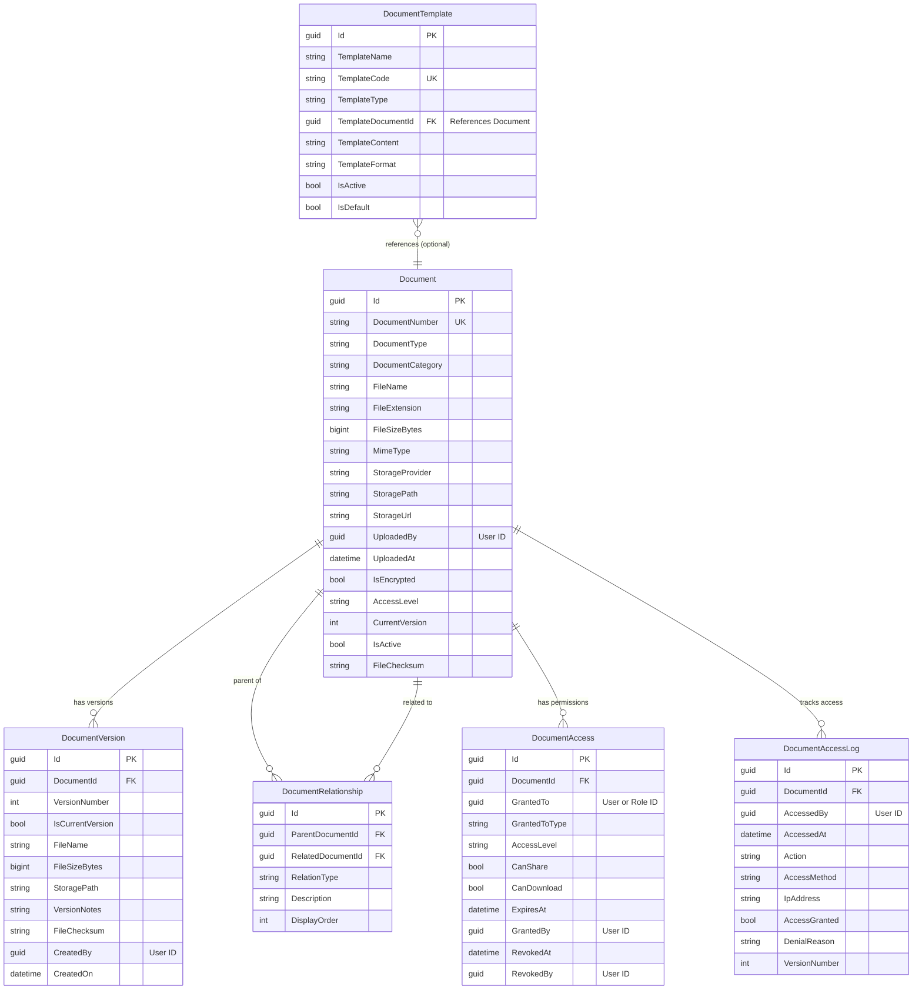

# Document Module - Data Model

## Overview

The Document Module provides centralized document management with versioning, access control, and cloud storage integration. All system documents (photos, PDFs, reports, templates) are managed through this module.

### Key Features
- Centralized document storage
- Version control and history
- Access control and permissions
- Document relationships
- Access audit logging
- Cloud storage integration (Azure Blob, AWS S3)
- Document templates for reports

## Module Structure

```
Document Module
├── Document (Aggregate Root)
├── DocumentVersion (Version History)
├── DocumentRelationship (Document Links)
├── DocumentAccess (Access Permissions)
├── DocumentAccessLog (Audit Trail)
└── DocumentTemplate (Report Templates)
```

## Core Tables

### 1. Documents (Aggregate Root)

Main document entity for all system documents.

#### SQL Schema

```sql
CREATE TABLE document.Documents
(
    -- Primary Key
    Id                      UNIQUEIDENTIFIER PRIMARY KEY DEFAULT NEWSEQUENTIALID(),

    -- Business Key
    DocumentNumber          NVARCHAR(50) UNIQUE NOT NULL,            -- Auto-generated: DOC-2025-00001

    -- Document Classification
    DocumentType            NVARCHAR(100) NOT NULL,                  -- TitleDeed, Photo, Report, IDCard, Contract
    DocumentCategory        NVARCHAR(50) NOT NULL,                   -- Legal, AppraisalMedia, Report, Supporting

    -- File Information
    FileName                NVARCHAR(255) NOT NULL,
    FileExtension           NVARCHAR(10) NOT NULL,                   -- pdf, jpg, png, docx
    FileSizeBytes           BIGINT NOT NULL,
    MimeType                NVARCHAR(100) NOT NULL,

    -- Storage
    StorageProvider         NVARCHAR(50) NOT NULL,                   -- AzureBlobStorage, AWSS3, LocalFileSystem
    StoragePath             NVARCHAR(500) NOT NULL,
    StorageUrl              NVARCHAR(500) NOT NULL,
    StorageContainer        NVARCHAR(200) NULL,                      -- Bucket/Container name

    -- Upload Information
    UploadedBy              UNIQUEIDENTIFIER NOT NULL,
    UploadedByName          NVARCHAR(200) NOT NULL,
    UploadedAt              DATETIME2 NOT NULL DEFAULT GETUTCDATE(),

    -- Security
    IsEncrypted             BIT NOT NULL DEFAULT 0,
    EncryptionAlgorithm     NVARCHAR(50) NULL,                       -- AES256, RSA
    AccessLevel             NVARCHAR(50) NOT NULL DEFAULT 'Internal', -- Public, Internal, Confidential, Restricted

    -- Versioning
    CurrentVersion          INT NOT NULL DEFAULT 1,
    TotalVersions           INT NOT NULL DEFAULT 1,

    -- Status
    IsActive                BIT NOT NULL DEFAULT 1,
    IsArchived              BIT NOT NULL DEFAULT 0,
    ArchivedAt              DATETIME2 NULL,
    ArchivedBy              UNIQUEIDENTIFIER NULL,

    -- Metadata
    Description             NVARCHAR(500) NULL,
    Tags                    NVARCHAR(MAX) NULL,                      -- JSON array of tags
    CustomMetadata          NVARCHAR(MAX) NULL,                      -- JSON for additional metadata

    -- Checksum (for integrity verification)
    FileChecksum            NVARCHAR(100) NULL,                      -- SHA256 hash
    ChecksumAlgorithm       NVARCHAR(20) NULL DEFAULT 'SHA256',

    -- Expiration
    ExpiresAt               DATETIME2 NULL,
    IsExpired               BIT NOT NULL DEFAULT 0,

    -- Audit Fields
    CreatedOn               DATETIME2 NOT NULL DEFAULT GETUTCDATE(),
    CreatedBy               UNIQUEIDENTIFIER NOT NULL,
    UpdatedOn               DATETIME2 NOT NULL DEFAULT GETUTCDATE(),
    UpdatedBy               UNIQUEIDENTIFIER NOT NULL,
    RowVersion              ROWVERSION NOT NULL,

    -- Soft Delete
    IsDeleted               BIT NOT NULL DEFAULT 0,
    DeletedOn               DATETIME2 NULL,
    DeletedBy               UNIQUEIDENTIFIER NULL,

    CONSTRAINT CK_Document_AccessLevel CHECK (AccessLevel IN ('Public', 'Internal', 'Confidential', 'Restricted')),
    CONSTRAINT CK_Document_FileSizeBytes CHECK (FileSizeBytes > 0)
);
```

### 2. DocumentVersions

Version history for documents.

#### SQL Schema

```sql
CREATE TABLE document.DocumentVersions
(
    -- Primary Key
    Id                      UNIQUEIDENTIFIER PRIMARY KEY DEFAULT NEWSEQUENTIALID(),

    -- Foreign Key
    DocumentId              UNIQUEIDENTIFIER NOT NULL,

    -- Version Information
    VersionNumber           INT NOT NULL,
    IsCurrentVersion        BIT NOT NULL DEFAULT 0,

    -- File Information
    FileName                NVARCHAR(255) NOT NULL,
    FileExtension           NVARCHAR(10) NOT NULL,
    FileSizeBytes           BIGINT NOT NULL,

    -- Storage
    StoragePath             NVARCHAR(500) NOT NULL,
    StorageUrl              NVARCHAR(500) NOT NULL,

    -- Version Details
    VersionNotes            NVARCHAR(MAX) NULL,
    ChangeSummary           NVARCHAR(500) NULL,

    -- File Checksum
    FileChecksum            NVARCHAR(100) NULL,

    -- Created By
    CreatedBy               UNIQUEIDENTIFIER NOT NULL,
    CreatedByName           NVARCHAR(200) NOT NULL,
    CreatedOn               DATETIME2 NOT NULL DEFAULT GETUTCDATE(),

    CONSTRAINT FK_DocumentVersion_Document FOREIGN KEY (DocumentId)
        REFERENCES document.Documents(Id) ON DELETE CASCADE,
    CONSTRAINT UQ_DocumentVersion_DocumentId_VersionNumber UNIQUE (DocumentId, VersionNumber)
);
```

### 3. DocumentRelationships

Links between related documents.

#### SQL Schema

```sql
CREATE TABLE document.DocumentRelationships
(
    -- Primary Key
    Id                      UNIQUEIDENTIFIER PRIMARY KEY DEFAULT NEWSEQUENTIALID(),

    -- Document References
    ParentDocumentId        UNIQUEIDENTIFIER NOT NULL,
    RelatedDocumentId       UNIQUEIDENTIFIER NOT NULL,

    -- Relationship Type
    RelationType            NVARCHAR(50) NOT NULL,                   -- Attachment, Reference, Supersedes, Amendment

    -- Relationship Details
    Description             NVARCHAR(500) NULL,
    Notes                   NVARCHAR(MAX) NULL,

    -- Order
    DisplayOrder            INT NOT NULL DEFAULT 0,

    -- Audit Fields
    CreatedOn               DATETIME2 NOT NULL DEFAULT GETUTCDATE(),
    CreatedBy               UNIQUEIDENTIFIER NOT NULL,
    UpdatedOn               DATETIME2 NOT NULL DEFAULT GETUTCDATE(),
    UpdatedBy               UNIQUEIDENTIFIER NOT NULL,

    CONSTRAINT FK_DocumentRelationship_Parent FOREIGN KEY (ParentDocumentId)
        REFERENCES document.Documents(Id),
    CONSTRAINT FK_DocumentRelationship_Related FOREIGN KEY (RelatedDocumentId)
        REFERENCES document.Documents(Id),
    CONSTRAINT CK_DocumentRelationship_Type CHECK (RelationType IN ('Attachment', 'Reference', 'Supersedes', 'Amendment', 'Related')),
    CONSTRAINT CK_DocumentRelationship_SelfReference CHECK (ParentDocumentId != RelatedDocumentId)
);
```

### 4. DocumentAccess

Access control and permissions for documents.

#### SQL Schema

```sql
CREATE TABLE document.DocumentAccess
(
    -- Primary Key
    Id                      UNIQUEIDENTIFIER PRIMARY KEY DEFAULT NEWSEQUENTIALID(),

    -- Foreign Key
    DocumentId              UNIQUEIDENTIFIER NOT NULL,

    -- Access Grant
    GrantedTo               UNIQUEIDENTIFIER NOT NULL,               -- User or Role ID
    GrantedToType           NVARCHAR(50) NOT NULL,                   -- User, Role
    GrantedToName           NVARCHAR(200) NOT NULL,

    -- Access Level
    AccessLevel             NVARCHAR(50) NOT NULL,                   -- Read, Write, Delete, FullControl
    CanShare                BIT NOT NULL DEFAULT 0,
    CanDownload             BIT NOT NULL DEFAULT 1,

    -- Expiration
    ExpiresAt               DATETIME2 NULL,
    IsExpired               BIT NOT NULL DEFAULT 0,

    -- Grant Information
    GrantedBy               UNIQUEIDENTIFIER NOT NULL,
    GrantedByName           NVARCHAR(200) NOT NULL,
    GrantedAt               DATETIME2 NOT NULL DEFAULT GETUTCDATE(),
    GrantReason             NVARCHAR(500) NULL,

    -- Revocation
    RevokedAt               DATETIME2 NULL,
    RevokedBy               UNIQUEIDENTIFIER NULL,
    RevokedByName           NVARCHAR(200) NULL,
    RevocationReason        NVARCHAR(500) NULL,

    -- Audit Fields
    CreatedOn               DATETIME2 NOT NULL DEFAULT GETUTCDATE(),
    CreatedBy               UNIQUEIDENTIFIER NOT NULL,
    UpdatedOn               DATETIME2 NOT NULL DEFAULT GETUTCDATE(),
    UpdatedBy               UNIQUEIDENTIFIER NOT NULL,

    CONSTRAINT FK_DocumentAccess_Document FOREIGN KEY (DocumentId)
        REFERENCES document.Documents(Id) ON DELETE CASCADE,
    CONSTRAINT CK_DocumentAccess_GrantedToType CHECK (GrantedToType IN ('User', 'Role')),
    CONSTRAINT CK_DocumentAccess_AccessLevel CHECK (AccessLevel IN ('Read', 'Write', 'Delete', 'FullControl'))
);
```

### 5. DocumentAccessLogs

Audit trail of document access.

#### SQL Schema

```sql
CREATE TABLE document.DocumentAccessLogs
(
    -- Primary Key
    Id                      UNIQUEIDENTIFIER PRIMARY KEY DEFAULT NEWSEQUENTIALID(),

    -- Foreign Key
    DocumentId              UNIQUEIDENTIFIER NOT NULL,

    -- Access Information
    AccessedBy              UNIQUEIDENTIFIER NOT NULL,
    AccessedByName          NVARCHAR(200) NOT NULL,
    AccessedAt              DATETIME2 NOT NULL DEFAULT GETUTCDATE(),

    -- Action
    Action                  NVARCHAR(50) NOT NULL,                   -- View, Download, Edit, Delete, Share

    -- Access Details
    AccessMethod            NVARCHAR(50) NULL,                       -- WebUI, API, Mobile
    IpAddress               NVARCHAR(50) NULL,
    UserAgent               NVARCHAR(500) NULL,
    SessionId               NVARCHAR(100) NULL,

    -- Result
    AccessGranted           BIT NOT NULL,
    DenialReason            NVARCHAR(500) NULL,

    -- Document Version Accessed
    VersionNumber           INT NULL,

    -- Additional Context
    Notes                   NVARCHAR(MAX) NULL,

    -- Created On (no update for logs)
    CreatedOn               DATETIME2 NOT NULL DEFAULT GETUTCDATE(),

    CONSTRAINT FK_DocumentAccessLog_Document FOREIGN KEY (DocumentId)
        REFERENCES document.Documents(Id),
    CONSTRAINT CK_DocumentAccessLog_Action CHECK (Action IN ('View', 'Download', 'Edit', 'Delete', 'Share', 'Print'))
);
```

### 6. DocumentTemplates

Templates for generating reports and documents.

#### SQL Schema

```sql
CREATE TABLE document.DocumentTemplates
(
    -- Primary Key
    Id                      UNIQUEIDENTIFIER PRIMARY KEY DEFAULT NEWSEQUENTIALID(),

    -- Template Information
    TemplateName            NVARCHAR(200) NOT NULL,
    TemplateCode            NVARCHAR(50) UNIQUE NOT NULL,            -- e.g., "LAND_APPRAISAL_REPORT"
    TemplateType            NVARCHAR(50) NOT NULL,                   -- AppraisalReport, CoverLetter, Certificate
    Description             NVARCHAR(500) NULL,

    -- Template File
    TemplateDocumentId      UNIQUEIDENTIFIER NULL,                   -- FK to Documents

    -- Template Content (if inline)
    TemplateContent         NVARCHAR(MAX) NULL,                      -- HTML, Markdown, or template syntax
    TemplateFormat          NVARCHAR(50) NULL,                       -- HTML, Markdown, DOCX, PDF

    -- Placeholders
    SupportedPlaceholders   NVARCHAR(MAX) NULL,                      -- JSON array of placeholders

    -- Settings
    IsActive                BIT NOT NULL DEFAULT 1,
    IsDefault               BIT NOT NULL DEFAULT 0,
    SortOrder               INT NOT NULL DEFAULT 0,

    -- Version
    TemplateVersion         NVARCHAR(20) NULL,
    VersionNotes            NVARCHAR(MAX) NULL,

    -- Audit Fields
    CreatedOn               DATETIME2 NOT NULL DEFAULT GETUTCDATE(),
    CreatedBy               UNIQUEIDENTIFIER NOT NULL,
    UpdatedOn               DATETIME2 NOT NULL DEFAULT GETUTCDATE(),
    UpdatedBy               UNIQUEIDENTIFIER NOT NULL,

    CONSTRAINT FK_DocumentTemplate_Document FOREIGN KEY (TemplateDocumentId)
        REFERENCES document.Documents(Id),
    CONSTRAINT CK_DocumentTemplate_Type CHECK (TemplateType IN ('AppraisalReport', 'CoverLetter', 'Certificate', 'Custom'))
);
```

## Indexes

```sql
-- Document indexes
CREATE INDEX IX_Document_DocumentNumber ON document.Documents(DocumentNumber);
CREATE INDEX IX_Document_DocumentType ON document.Documents(DocumentType) WHERE IsDeleted = 0;
CREATE INDEX IX_Document_DocumentCategory ON document.Documents(DocumentCategory) WHERE IsDeleted = 0;
CREATE INDEX IX_Document_UploadedBy ON document.Documents(UploadedBy) WHERE IsDeleted = 0;
CREATE INDEX IX_Document_UploadedAt ON document.Documents(UploadedAt DESC);
CREATE INDEX IX_Document_AccessLevel ON document.Documents(AccessLevel) WHERE IsDeleted = 0;
CREATE INDEX IX_Document_IsActive ON document.Documents(IsActive) WHERE IsDeleted = 0;
CREATE INDEX IX_Document_ExpiresAt ON document.Documents(ExpiresAt) WHERE IsExpired = 0 AND ExpiresAt IS NOT NULL;

-- DocumentVersion indexes
CREATE INDEX IX_DocumentVersion_DocumentId ON document.DocumentVersions(DocumentId);
CREATE INDEX IX_DocumentVersion_IsCurrentVersion ON document.DocumentVersions(IsCurrentVersion) WHERE IsCurrentVersion = 1;

-- DocumentRelationship indexes
CREATE INDEX IX_DocumentRelationship_ParentDocumentId ON document.DocumentRelationships(ParentDocumentId);
CREATE INDEX IX_DocumentRelationship_RelatedDocumentId ON document.DocumentRelationships(RelatedDocumentId);

-- DocumentAccess indexes
CREATE INDEX IX_DocumentAccess_DocumentId ON document.DocumentAccess(DocumentId);
CREATE INDEX IX_DocumentAccess_GrantedTo ON document.DocumentAccess(GrantedTo);
CREATE INDEX IX_DocumentAccess_ExpiresAt ON document.DocumentAccess(ExpiresAt) WHERE IsExpired = 0 AND ExpiresAt IS NOT NULL;

-- DocumentAccessLog indexes
CREATE INDEX IX_DocumentAccessLog_DocumentId ON document.DocumentAccessLogs(DocumentId);
CREATE INDEX IX_DocumentAccessLog_AccessedBy ON document.DocumentAccessLogs(AccessedBy);
CREATE INDEX IX_DocumentAccessLog_AccessedAt ON document.DocumentAccessLogs(AccessedAt DESC);
CREATE INDEX IX_DocumentAccessLog_Action ON document.DocumentAccessLogs(Action);

-- DocumentTemplate indexes
CREATE INDEX IX_DocumentTemplate_TemplateCode ON document.DocumentTemplates(TemplateCode);
CREATE INDEX IX_DocumentTemplate_TemplateType ON document.DocumentTemplates(TemplateType);
CREATE INDEX IX_DocumentTemplate_IsActive ON document.DocumentTemplates(IsActive) WHERE IsActive = 1;
```

## Entity Relationship Diagram



**Legend:**
- **Solid lines** = Internal module relationships (with FK constraints)
- All documents (photos, PDFs, reports) managed centrally through this module
- DocumentAccess supports both User and Role-based permissions
- Only key fields shown for clarity; see full schemas above for complete field lists

**Key Design Notes:**
1. **Centralized Management**: All system documents managed through this single module
2. **Version Control**: Complete version history with rollback capability
3. **Access Control**: Granular permissions with expiration and revocation
4. **Audit Trail**: Complete access logging for compliance
5. **Cloud Storage**: Supports Azure Blob Storage, AWS S3, and local file system
6. **Document Relationships**: Link related documents (attachments, amendments, supersedes)
7. **Templates**: Reusable report templates for appraisal reports

## Enumerations

```csharp
public enum DocumentType
{
    TitleDeed,
    Photo,
    Video,
    Report,
    IDCard,
    HouseRegistration,
    Contract,
    Template,
    Other
}

public enum DocumentCategory
{
    Legal,
    AppraisalMedia,
    Report,
    Supporting,
    Template
}

public enum AccessLevel
{
    Public,
    Internal,
    Confidential,
    Restricted
}

public enum DocumentAccessLevel
{
    Read,
    Write,
    Delete,
    FullControl
}

public enum DocumentAction
{
    View,
    Download,
    Edit,
    Delete,
    Share,
    Print
}

public enum RelationType
{
    Attachment,
    Reference,
    Supersedes,
    Amendment,
    Related
}

public enum StorageProvider
{
    AzureBlobStorage,
    AWSS3,
    LocalFileSystem
}
```

---

**Related Documentation**:
- **[02-request-module.md](02-request-module.md)** - Document attachments to requests
- **[03-appraisal-module.md](03-appraisal-module.md)** - Photos and appraisal reports
- **[04-collateral-module.md](04-collateral-module.md)** - Final collateral documents
- **[15-sample-data.md](15-sample-data.md)** - Sample document data
