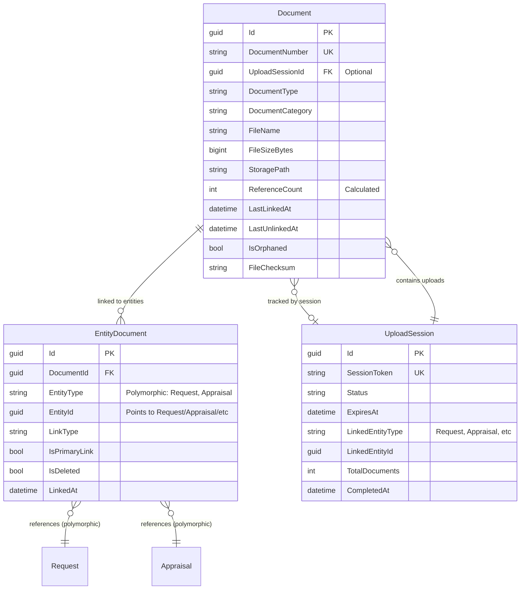

# Document Module - Data Model

## Overview

The Document Module provides centralized document management with local file system storage. All system documents (photos, PDFs, reports, supporting documents) are managed through this module.

### Phase 1 Features (Current Implementation)
- ✅ Centralized document storage
- ✅ Local file system storage
- ✅ Basic document metadata
- ✅ Upload tracking with session management
- ✅ File integrity verification (checksum)
- ✅ Polymorphic entity linking (Request, Appraisal, etc.)
- ✅ Reference counting for multi-entity sharing
- ✅ Orphaned document detection and cleanup
- ✅ Upload session lifecycle management

### Future Enhancements (Phase 2+)
- 🔮 Version control and history
- 🔮 Advanced access control and permissions
- 🔮 Access audit logging
- 🔮 Document templates for reports
- 🔮 Cloud storage migration (Azure Blob, AWS S3)

## Module Structure

```
Document Module (Phase 1)
├── Document (Aggregate Root)
├── UploadSession (Upload Context & Lifecycle)
├── EntityDocument (Polymorphic Junction Table)
└── UnusedDocuments (View for Orphan Detection)

Future Enhancement Tables (Phase 2+)
├── DocumentVersion (Version History)
├── DocumentAccess (Access Permissions)
├── DocumentAccessLog (Audit Trail)
└── DocumentTemplate (Report Templates)
```

## Entity Relationship Diagram (Phase 1)



**Legend:**
- **Polymorphic References** = EntityDocument can link to any entity type (Request, Appraisal, etc.)
- **Reference Counting** = Documents track how many entities link to them
- **Upload Sessions** = Track upload context for orphan detection
- **Soft Delete** = EntityDocument uses IsDeleted for link lifecycle management

**Key Design Notes:**
1. **Polymorphic Linking**: Documents can be shared across multiple entities (Request, Appraisal, etc.)
2. **Reference Counting**: Automatic tracking of how many entities reference each document
3. **Orphan Detection**: Identify documents uploaded but never linked, or with all links removed
4. **Upload Sessions**: Track upload context for cleanup and lifecycle management
5. **Multi-Entity Sharing**: Single document can be linked to multiple requests/appraisals
6. **Link Types**: Support Original, Shared, Referenced relationships

## Table Definition

### Documents (Aggregate Root)

Main document entity for all system documents.

#### SQL Schema

```sql
CREATE TABLE document.Documents
(
    -- Primary Key
    Id                      UNIQUEIDENTIFIER PRIMARY KEY DEFAULT NEWSEQUENTIALID(),

    -- Business Key
    DocumentNumber          NVARCHAR(50) UNIQUE NOT NULL,            -- Auto-generated: DOC-2025-00001

    -- Upload Session Tracking
    UploadSessionId         UNIQUEIDENTIFIER NULL,                   -- FK to UploadSessions (optional)

    -- Document Classification
    DocumentType            NVARCHAR(100) NOT NULL,                  -- TitleDeed, Photo, Report, IDCard, Contract
    DocumentCategory        NVARCHAR(50) NOT NULL,                   -- Legal, AppraisalMedia, Report, Supporting

    -- File Information
    FileName                NVARCHAR(255) NOT NULL,
    FileExtension           NVARCHAR(10) NOT NULL,                   -- pdf, jpg, png, docx
    FileSizeBytes           BIGINT NOT NULL,
    MimeType                NVARCHAR(100) NOT NULL,

    -- Storage (Local File System)
    StoragePath             NVARCHAR(500) NOT NULL,                  -- Physical path: /var/uploads/documents/2025/01/abc123.pdf
    StorageUrl              NVARCHAR(500) NOT NULL,                  -- Web access URL: /api/documents/abc123/download

    -- Upload Information
    UploadedBy              UNIQUEIDENTIFIER NOT NULL,               -- User ID (no FK - cross-module reference)
    UploadedByName          NVARCHAR(200) NOT NULL,
    UploadedAt              DATETIME2 NOT NULL DEFAULT GETUTCDATE(),

    -- Reference Counting (for orphan detection)
    ReferenceCount          INT NOT NULL DEFAULT 0,                  -- How many entities link to this document
    LastLinkedAt            DATETIME2 NULL,                          -- When last entity linked to this
    LastUnlinkedAt          DATETIME2 NULL,                          -- When last entity unlinked

    -- Orphan Detection
    IsOrphaned              BIT NOT NULL DEFAULT 0,                  -- Flagged for cleanup
    OrphanedReason          NVARCHAR(200) NULL,                      -- Why marked as orphaned

    -- Access Control
    AccessLevel             NVARCHAR(50) NOT NULL DEFAULT 'Internal', -- Public, Internal, Confidential, Restricted

    -- Status
    IsActive                BIT NOT NULL DEFAULT 1,
    IsArchived              BIT NOT NULL DEFAULT 0,
    ArchivedAt              DATETIME2 NULL,
    ArchivedBy              UNIQUEIDENTIFIER NULL,
    ArchivedByName          NVARCHAR(200) NULL,

    -- Metadata
    Description             NVARCHAR(500) NULL,
    Tags                    NVARCHAR(MAX) NULL,                      -- JSON array of tags
    CustomMetadata          NVARCHAR(MAX) NULL,                      -- JSON for additional metadata

    -- File Integrity
    FileChecksum            NVARCHAR(100) NULL,                      -- SHA256 hash
    ChecksumAlgorithm       NVARCHAR(20) NULL DEFAULT 'SHA256',

    -- Audit Fields
    CreatedOn               DATETIME2 NOT NULL DEFAULT GETUTCDATE(),
    CreatedBy               UNIQUEIDENTIFIER NOT NULL,
    UpdatedOn               DATETIME2 NOT NULL DEFAULT GETUTCDATE(),
    UpdatedBy               UNIQUEIDENTIFIER NOT NULL,
    RowVersion              ROWVERSION NOT NULL,

    -- Soft Delete
    IsDeleted               BIT NOT NULL DEFAULT 0,
    DeletedOn               DATETIME2 NULL,
    DeletedBy               UNIQUEIDENTIFIER NULL,

    CONSTRAINT FK_Document_UploadSession FOREIGN KEY (UploadSessionId)
        REFERENCES document.UploadSessions(Id),
    CONSTRAINT CK_Document_AccessLevel CHECK (AccessLevel IN ('Public', 'Internal', 'Confidential', 'Restricted')),
    CONSTRAINT CK_Document_FileSizeBytes CHECK (FileSizeBytes > 0)
);
```

#### Key Fields Explanation

**Business Key:**
- `DocumentNumber`: Auto-generated unique identifier (e.g., DOC-2025-00001)

**Document Classification:**
- `DocumentType`: Type of document (TitleDeed, Photo, Report, IDCard, etc.)
- `DocumentCategory`: Category grouping (Legal, AppraisalMedia, Report, Supporting)

**Storage (Local File System):**
- `StoragePath`: Physical path on disk (e.g., `/var/uploads/documents/2025/01/abc123.pdf`)
- `StorageUrl`: Web access URL for download (e.g., `/api/documents/abc123/download`)

**Access Control:**
- `AccessLevel`: Basic access control (Public, Internal, Confidential, Restricted)

**File Integrity:**
- `FileChecksum`: SHA256 hash for file integrity verification
- `ChecksumAlgorithm`: Algorithm used for checksum (default: SHA256)

**Reference Counting:**
- `ReferenceCount`: Automatically maintained count of how many entities link to this document
- `LastLinkedAt`: Timestamp when last entity linked to this document
- `LastUnlinkedAt`: Timestamp when last entity unlinked from this document

**Orphan Detection:**
- `IsOrphaned`: Flag indicating document is marked for cleanup
- `OrphanedReason`: Categorization of why document is orphaned (e.g., "Never Linked", "All Links Removed")

### 2. UploadSessions

Tracks upload context and lifecycle for batch uploads and orphan detection.

#### SQL Schema

```sql
CREATE TABLE document.UploadSessions
(
    -- Primary Key
    Id                      UNIQUEIDENTIFIER PRIMARY KEY DEFAULT NEWSEQUENTIALID(),

    -- Session Identification
    SessionToken            NVARCHAR(100) UNIQUE NOT NULL,           -- Unique token for this session

    -- Session Lifecycle
    Status                  NVARCHAR(50) NOT NULL DEFAULT 'InProgress', -- InProgress, Completed, Abandoned, Expired
    ExpiresAt               DATETIME2 NOT NULL,                      -- Auto-expire after X hours
    CompletedAt             DATETIME2 NULL,

    -- Intended Entity (what this upload is for)
    IntendedEntityType      NVARCHAR(50) NULL,                       -- 'Request', 'Appraisal', etc.
    IntendedEntityId        UNIQUEIDENTIFIER NULL,                   -- Request ID or Appraisal ID (set when entity created)

    -- Linked Entity (actual entity created)
    LinkedEntityType        NVARCHAR(50) NULL,                       -- Same as IntendedEntityType usually
    LinkedEntityId          UNIQUEIDENTIFIER NULL,                   -- Actual ID when entity is created
    LinkedAt                DATETIME2 NULL,

    -- Upload Statistics
    TotalDocuments          INT NOT NULL DEFAULT 0,
    TotalSizeBytes          BIGINT NOT NULL DEFAULT 0,

    -- Session Metadata
    Purpose                 NVARCHAR(200) NULL,                      -- Description of upload purpose
    UserAgent               NVARCHAR(500) NULL,
    IpAddress               NVARCHAR(50) NULL,

    -- Audit Fields
    CreatedOn               DATETIME2 NOT NULL DEFAULT GETUTCDATE(),
    CreatedBy               UNIQUEIDENTIFIER NOT NULL,
    UpdatedOn               DATETIME2 NOT NULL DEFAULT GETUTCDATE(),
    UpdatedBy               UNIQUEIDENTIFIER NOT NULL,

    CONSTRAINT CK_UploadSession_Status CHECK (Status IN ('InProgress', 'Completed', 'Abandoned', 'Expired'))
);
```

### 3. EntityDocuments

Polymorphic junction table linking documents to any entity type (Request, Appraisal, etc.).

#### SQL Schema

```sql
CREATE TABLE document.EntityDocuments
(
    -- Primary Key
    Id                      UNIQUEIDENTIFIER PRIMARY KEY DEFAULT NEWSEQUENTIALID(),

    -- Foreign Key
    DocumentId              UNIQUEIDENTIFIER NOT NULL,

    -- Polymorphic Reference
    EntityType              NVARCHAR(50) NOT NULL,                   -- 'Request', 'Appraisal', 'Collateral', etc.
    EntityId                UNIQUEIDENTIFIER NOT NULL,               -- Points to Request.Id, Appraisal.Id, etc.

    -- Link Metadata
    LinkType                NVARCHAR(50) NOT NULL DEFAULT 'Original', -- Original, Shared, Referenced, Attachment
    IsPrimaryLink           BIT NOT NULL DEFAULT 0,                  -- Is this the original/owning entity?
    DisplayOrder            INT NOT NULL DEFAULT 0,                  -- For ordering documents within entity

    -- Link Lifecycle
    LinkedAt                DATETIME2 NOT NULL DEFAULT GETUTCDATE(),
    LinkedBy                UNIQUEIDENTIFIER NOT NULL,               -- User who created this link
    LinkedByName            NVARCHAR(200) NOT NULL,

    -- Soft Delete
    IsDeleted               BIT NOT NULL DEFAULT 0,
    DeletedOn               DATETIME2 NULL,
    DeletedBy               UNIQUEIDENTIFIER NULL,
    DeletedByName           NVARCHAR(200) NULL,

    -- Audit Fields
    CreatedOn               DATETIME2 NOT NULL DEFAULT GETUTCDATE(),
    CreatedBy               UNIQUEIDENTIFIER NOT NULL,
    UpdatedOn               DATETIME2 NOT NULL DEFAULT GETUTCDATE(),
    UpdatedBy               UNIQUEIDENTIFIER NOT NULL,

    CONSTRAINT FK_EntityDocument_Document FOREIGN KEY (DocumentId)
        REFERENCES document.Documents(Id) ON DELETE CASCADE,
    CONSTRAINT CK_EntityDocument_EntityType CHECK (EntityType IN ('Request', 'Appraisal', 'Collateral', 'Report')),
    CONSTRAINT CK_EntityDocument_LinkType CHECK (LinkType IN ('Original', 'Shared', 'Referenced', 'Attachment')),
    CONSTRAINT UQ_EntityDocument_Entity_Document UNIQUE (EntityType, EntityId, DocumentId, IsDeleted)
);
```

### 4. UnusedDocuments (View)

View for identifying orphaned documents eligible for cleanup.

#### SQL Schema

```sql
CREATE VIEW document.vw_UnusedDocuments
AS
SELECT
    d.Id,
    d.DocumentNumber,
    d.FileName,
    d.FileSizeBytes,
    d.UploadSessionId,
    d.ReferenceCount,
    d.CreatedOn,
    d.LastLinkedAt,
    d.LastUnlinkedAt,
    DATEDIFF(DAY, d.CreatedOn, GETUTCDATE()) as DaysOld,
    DATEDIFF(DAY, d.LastUnlinkedAt, GETUTCDATE()) as DaysSinceUnlinked,
    us.IntendedEntityType,
    us.IntendedEntityId,
    us.LinkedEntityId,
    us.Status as SessionStatus,
    CASE
        -- Never uploaded as part of session
        WHEN d.UploadSessionId IS NULL AND d.ReferenceCount = 0
            THEN 'Orphaned - Direct Upload Never Linked'

        -- Uploaded in session but session never completed
        WHEN us.Id IS NOT NULL
             AND us.Status IN ('Abandoned', 'Expired')
             AND d.ReferenceCount = 0
            THEN 'Orphaned - Session Abandoned'

        -- Uploaded in session for entity but never linked to that entity
        WHEN us.IntendedEntityId IS NOT NULL
             AND d.ReferenceCount = 0
            THEN 'Orphaned - Never Linked to Intended Entity'

        -- Had links but all removed
        WHEN d.LastUnlinkedAt IS NOT NULL
             AND d.ReferenceCount = 0
            THEN 'Abandoned - All Links Removed'

        ELSE 'Unknown'
    END as UnusedReason,

    -- Cleanup eligibility
    CASE
        -- Session-based uploads: cleanup after 7 days
        WHEN d.UploadSessionId IS NOT NULL
             AND us.Status IN ('Abandoned', 'Expired')
             AND d.ReferenceCount = 0
             AND d.CreatedOn < DATEADD(DAY, -7, GETUTCDATE())
            THEN 1

        -- Unlinked documents: cleanup after 30 days
        WHEN d.ReferenceCount = 0
             AND d.LastUnlinkedAt IS NOT NULL
             AND d.LastUnlinkedAt < DATEADD(DAY, -30, GETUTCDATE())
            THEN 1

        ELSE 0
    END as IsEligibleForCleanup

FROM document.Documents d
LEFT JOIN document.UploadSessions us ON us.Id = d.UploadSessionId
WHERE d.ReferenceCount = 0
  AND d.IsDeleted = 0;
```

## Indexes

```sql
-- Document indexes
CREATE INDEX IX_Document_DocumentNumber ON document.Documents(DocumentNumber);
CREATE INDEX IX_Document_DocumentType ON document.Documents(DocumentType) WHERE IsDeleted = 0;
CREATE INDEX IX_Document_DocumentCategory ON document.Documents(DocumentCategory) WHERE IsDeleted = 0;
CREATE INDEX IX_Document_UploadedBy ON document.Documents(UploadedBy) WHERE IsDeleted = 0;
CREATE INDEX IX_Document_UploadedAt ON document.Documents(UploadedAt DESC);
CREATE INDEX IX_Document_AccessLevel ON document.Documents(AccessLevel) WHERE IsDeleted = 0;
CREATE INDEX IX_Document_IsActive ON document.Documents(IsActive) WHERE IsDeleted = 0;

-- Document indexes for orphan detection
CREATE INDEX IX_Document_ReferenceCount ON document.Documents(ReferenceCount) WHERE ReferenceCount = 0;
CREATE INDEX IX_Document_UploadSessionId ON document.Documents(UploadSessionId);
CREATE INDEX IX_Document_IsOrphaned ON document.Documents(IsOrphaned) WHERE IsOrphaned = 1;
CREATE INDEX IX_Document_LastUnlinkedAt ON document.Documents(LastUnlinkedAt) WHERE ReferenceCount = 0;

-- UploadSession indexes
CREATE INDEX IX_UploadSession_SessionToken ON document.UploadSessions(SessionToken);
CREATE INDEX IX_UploadSession_Status ON document.UploadSessions(Status);
CREATE INDEX IX_UploadSession_ExpiresAt ON document.UploadSessions(ExpiresAt) WHERE Status = 'InProgress';
CREATE INDEX IX_UploadSession_IntendedEntity ON document.UploadSessions(IntendedEntityType, IntendedEntityId);
CREATE INDEX IX_UploadSession_LinkedEntity ON document.UploadSessions(LinkedEntityType, LinkedEntityId);

-- EntityDocument indexes
CREATE INDEX IX_EntityDocument_DocumentId ON document.EntityDocuments(DocumentId) WHERE IsDeleted = 0;
CREATE INDEX IX_EntityDocument_Entity ON document.EntityDocuments(EntityType, EntityId) WHERE IsDeleted = 0;
CREATE INDEX IX_EntityDocument_IsPrimaryLink ON document.EntityDocuments(IsPrimaryLink) WHERE IsPrimaryLink = 1;
CREATE INDEX IX_EntityDocument_LinkedBy ON document.EntityDocuments(LinkedBy);
```

## Enumerations

```csharp
public enum DocumentType
{
    TitleDeed,
    Photo,
    Video,
    Report,
    IDCard,
    HouseRegistration,
    Contract,
    Template,
    Other
}

public enum DocumentCategory
{
    Legal,
    AppraisalMedia,
    Report,
    Supporting,
    Template
}

public enum AccessLevel
{
    Public,
    Internal,
    Confidential,
    Restricted
}

public enum UploadSessionStatus
{
    InProgress,
    Completed,
    Abandoned,
    Expired
}

public enum DocumentLinkType
{
    Original,          // First entity this document was created for
    Shared,            // Document shared from another entity
    Referenced,        // Reference/copy link to same document
    Attachment         // Attached as supporting document
}

public enum UnusedReason
{
    DirectUploadNeverLinked,      // Uploaded directly but never linked to any entity
    SessionAbandoned,             // Upload session was abandoned/expired
    NeverLinkedToIntendedEntity,  // Uploaded for specific entity but never linked
    AllLinksRemoved               // Had links but all were removed
}
```

## Cleanup Strategies and Policies

### Orphaned Document Detection

Documents become orphaned in several scenarios:

1. **Direct Upload Never Linked** (Immediate Orphan)
   - Document uploaded but never linked to any entity
   - No upload session associated
   - ReferenceCount = 0

2. **Session Abandoned** (Delayed Orphan)
   - Document uploaded as part of a session
   - Session status = Abandoned or Expired
   - ReferenceCount = 0

3. **Never Linked to Intended Entity** (Intent Mismatch)
   - Document uploaded for specific entity (via session)
   - Session completed but document not linked to intended entity
   - ReferenceCount = 0

4. **All Links Removed** (Deprecated Document)
   - Document previously had links
   - All links have been soft-deleted or removed
   - ReferenceCount = 0
   - LastUnlinkedAt is set

### Cleanup Retention Policies

**Tiered Retention Strategy:**

```sql
-- Policy 1: Session-based uploads (abandoned/expired)
-- Cleanup after 7 days if session abandoned and document never linked
IF UploadSessionId IS NOT NULL
   AND SessionStatus IN ('Abandoned', 'Expired')
   AND ReferenceCount = 0
   AND CreatedOn < DATEADD(DAY, -7, GETUTCDATE())
THEN eligible for cleanup

-- Policy 2: Unlinked documents with previous links
-- Cleanup after 30 days if all links removed
IF ReferenceCount = 0
   AND LastUnlinkedAt IS NOT NULL
   AND LastUnlinkedAt < DATEADD(DAY, -30, GETUTCDATE())
THEN eligible for cleanup

-- Policy 3: Direct uploads never linked
-- Cleanup after 7 days if uploaded directly and never used
IF UploadSessionId IS NULL
   AND ReferenceCount = 0
   AND CreatedOn < DATEADD(DAY, -7, GETUTCDATE())
THEN eligible for cleanup
```

### Automated Cleanup Process

**Scheduled Job (Daily at 2:00 AM):**

```csharp
public class DocumentCleanupService
{
    public async Task CleanupOrphanedDocumentsAsync()
    {
        // 1. Identify eligible documents using view
        var eligibleDocuments = await _dbContext.UnusedDocuments
            .Where(d => d.IsEligibleForCleanup == 1)
            .ToListAsync();

        foreach (var doc in eligibleDocuments)
        {
            // 2. Double-check reference count (safety check)
            var actualRefCount = await _dbContext.EntityDocuments
                .Where(ed => ed.DocumentId == doc.Id && ed.IsDeleted == false)
                .CountAsync();

            if (actualRefCount > 0)
            {
                // Skip - document has active links
                continue;
            }

            // 3. Mark as orphaned
            var document = await _dbContext.Documents.FindAsync(doc.Id);
            document.IsOrphaned = true;
            document.OrphanedReason = doc.UnusedReason;

            // 4. Archive or soft-delete
            document.IsDeleted = true;
            document.DeletedOn = DateTime.UtcNow;
            document.DeletedBy = Guid.Empty; // System cleanup

            // 5. Delete physical file (optional - can be deferred)
            await _storageService.DeleteFileAsync(document.StoragePath);
        }

        await _dbContext.SaveChangesAsync();
    }
}
```

### Manual Review Process

**Before Automated Cleanup:**

1. **Grace Period Notification** (2 days before cleanup)
   - Notify document owners of pending cleanup
   - Allow manual review and restoration

2. **Admin Dashboard**
   - View all documents pending cleanup
   - Review orphan reasons
   - Manually exclude documents from cleanup

3. **Audit Trail**
   - Log all cleanup actions
   - Track who deleted/archived documents
   - Maintain cleanup history

### Upload Session Lifecycle Management

**Session Expiration:**

```csharp
// Auto-expire sessions after 24 hours of inactivity
public class UploadSessionExpirationService
{
    public async Task ExpireInactiveSessionsAsync()
    {
        var now = DateTime.UtcNow;

        var expiredSessions = await _dbContext.UploadSessions
            .Where(s => s.Status == UploadSessionStatus.InProgress
                     && s.ExpiresAt < now)
            .ToListAsync();

        foreach (var session in expiredSessions)
        {
            session.Status = UploadSessionStatus.Expired;
            session.UpdatedOn = now;
        }

        await _dbContext.SaveChangesAsync();
    }
}
```

**Session Completion:**

```csharp
// Complete session when entity is created and documents linked
public async Task CompleteUploadSessionAsync(Guid sessionId, string entityType, Guid entityId)
{
    var session = await _dbContext.UploadSessions.FindAsync(sessionId);
    if (session == null || session.Status != UploadSessionStatus.InProgress)
        return;

    session.Status = UploadSessionStatus.Completed;
    session.LinkedEntityType = entityType;
    session.LinkedEntityId = entityId;
    session.LinkedAt = DateTime.UtcNow;
    session.CompletedAt = DateTime.UtcNow;

    await _dbContext.SaveChangesAsync();
}
```

### Reference Count Maintenance

**Automatic Updates via Triggers/Interceptors:**

```csharp
// Increment reference count when link created
public async Task CreateEntityDocumentLinkAsync(Guid documentId, string entityType, Guid entityId)
{
    var link = new EntityDocument
    {
        DocumentId = documentId,
        EntityType = entityType,
        EntityId = entityId,
        // ... other fields
    };

    await _dbContext.EntityDocuments.AddAsync(link);

    // Increment reference count
    var document = await _dbContext.Documents.FindAsync(documentId);
    document.ReferenceCount++;
    document.LastLinkedAt = DateTime.UtcNow;

    await _dbContext.SaveChangesAsync();
}

// Decrement reference count when link deleted
public async Task DeleteEntityDocumentLinkAsync(Guid linkId)
{
    var link = await _dbContext.EntityDocuments.FindAsync(linkId);
    if (link == null) return;

    link.IsDeleted = true;
    link.DeletedOn = DateTime.UtcNow;

    // Decrement reference count
    var document = await _dbContext.Documents.FindAsync(link.DocumentId);
    document.ReferenceCount--;
    document.LastUnlinkedAt = DateTime.UtcNow;

    // Check if orphaned
    if (document.ReferenceCount == 0)
    {
        document.IsOrphaned = true;
        document.OrphanedReason = "All Links Removed";
    }

    await _dbContext.SaveChangesAsync();
}
```

## Usage Examples

### Upload Document (Local Storage)

```csharp
var document = Document.Create(
    documentType: DocumentType.Photo,
    category: DocumentCategory.AppraisalMedia,
    fileName: "property-front.jpg",
    fileSizeBytes: 2048576,
    storagePath: "/var/uploads/documents/2025/01/abc123-property-front.jpg",
    storageUrl: "/api/documents/abc123/download",
    uploadedBy: userId,
    uploadedByName: "John Appraiser"
);

await _documentRepository.AddAsync(document);
await _unitOfWork.SaveChangesAsync();
```

### Query Documents

```csharp
// Get all photos for an appraisal
var photos = await _documentRepository
    .GetByTypeAsync(DocumentType.Photo)
    .Where(d => d.Tags.Contains(appraisalId))
    .ToListAsync();

// Get recent uploads
var recentDocs = await _documentRepository
    .GetRecentUploadsAsync(days: 7, userId: currentUserId);
```

### Local Storage Configuration

```json
// appsettings.json
{
  "DocumentStorage": {
    "BasePath": "/var/uploads/documents",
    "BaseUrl": "/api/documents",
    "MaxFileSizeMB": 100,
    "AllowedExtensions": [".pdf", ".jpg", ".jpeg", ".png", ".docx", ".xlsx"],
    "OrganizeByDate": true
  }
}
```

```csharp
// Document storage service example
public class LocalDocumentStorageService
{
    private readonly string _basePath;

    public async Task<string> SaveFileAsync(Stream fileStream, string fileName)
    {
        // Generate unique file name
        var uniqueFileName = $"{Guid.NewGuid()}-{fileName}";

        // Organize by year/month
        var datePath = DateTime.UtcNow.ToString("yyyy/MM");
        var directoryPath = Path.Combine(_basePath, datePath);

        // Ensure directory exists
        Directory.CreateDirectory(directoryPath);

        // Save file
        var fullPath = Path.Combine(directoryPath, uniqueFileName);
        using var fileStream = File.Create(fullPath);
        await fileStream.CopyToAsync(fileStream);

        return fullPath;
    }

    public async Task<Stream> GetFileAsync(string storagePath)
    {
        if (!File.Exists(storagePath))
            throw new FileNotFoundException("Document not found");

        return File.OpenRead(storagePath);
    }
}
```

### Carter API Endpoints (Frontend Integration)

#### 1. Create Upload Session Endpoint

```csharp
public class CreateUploadSessionEndpoint : ICarterModule
{
    public void AddRoutes(IEndpointRouteBuilder app)
    {
        app.MapPost("/api/documents/sessions", async (
            CreateUploadSessionRequest request,
            DocumentDbContext dbContext,
            IHttpContextAccessor httpContextAccessor) =>
        {
            var userId = httpContextAccessor.HttpContext?.User.GetUserId();
            var userName = httpContextAccessor.HttpContext?.User.GetUserName();

            var session = new UploadSession
            {
                Id = Guid.NewGuid(),
                SessionToken = Guid.NewGuid().ToString(),
                Status = UploadSessionStatus.InProgress,
                IntendedEntityType = request.IntendedEntityType,
                IntendedEntityId = request.IntendedEntityId,
                ExpiresAt = DateTime.UtcNow.AddHours(24),
                TotalDocuments = 0,
                TotalSizeBytes = 0,
                Purpose = request.Purpose,
                CreatedBy = userId,
                CreatedByName = userName
            };

            await dbContext.UploadSessions.AddAsync(session);
            await dbContext.SaveChangesAsync();

            return Results.Ok(new CreateUploadSessionResponse
            {
                SessionToken = session.SessionToken,
                ExpiresAt = session.ExpiresAt
            });
        })
        .WithName("CreateUploadSession")
        .WithTags("Documents")
        .Produces<CreateUploadSessionResponse>(StatusCodes.Status200OK)
        .RequireAuthorization();
    }
}

public record CreateUploadSessionRequest
{
    public string IntendedEntityType { get; init; }  // "Request", "Appraisal", etc.
    public Guid? IntendedEntityId { get; init; }
    public string Purpose { get; init; }
}

public record CreateUploadSessionResponse
{
    public string SessionToken { get; init; }
    public DateTime ExpiresAt { get; init; }
}
```

**Frontend Usage:**

```typescript
// Create upload session when user opens "Create Request" page
const response = await fetch('/api/documents/sessions', {
  method: 'POST',
  headers: {
    'Content-Type': 'application/json',
    'Authorization': `Bearer ${token}`
  },
  body: JSON.stringify({
    intendedEntityType: 'Request',
    purpose: 'New request documents'
  })
});

const { sessionToken, expiresAt } = await response.json();
// Store sessionToken for subsequent uploads
```

---

#### 2. Upload Single Document Endpoint

```csharp
public class UploadDocumentEndpoint : ICarterModule
{
    public void AddRoutes(IEndpointRouteBuilder app)
    {
        app.MapPost("/api/documents/upload", async (
            HttpContext context,
            DocumentDbContext dbContext,
            IDocumentStorageService storageService,
            IHttpContextAccessor httpContextAccessor) =>
        {
            var form = await context.Request.ReadFormAsync();

            // Get form fields
            var sessionToken = form["sessionToken"].ToString();
            var documentTypeStr = form["documentType"].ToString();
            var categoryStr = form["category"].ToString();
            var description = form["description"].ToString();

            // Get uploaded file
            var file = form.Files.GetFile("file");
            if (file == null || file.Length == 0)
                return Results.BadRequest("No file uploaded");

            // Validate file size (100MB max)
            if (file.Length > 100 * 1024 * 1024)
                return Results.BadRequest("File size exceeds 100MB limit");

            // Parse enums
            if (!Enum.TryParse<DocumentType>(documentTypeStr, out var documentType))
                return Results.BadRequest("Invalid document type");

            if (!Enum.TryParse<DocumentCategory>(categoryStr, out var category))
                return Results.BadRequest("Invalid document category");

            // Find upload session
            var session = await dbContext.UploadSessions
                .FirstOrDefaultAsync(s => s.SessionToken == sessionToken);

            if (session == null)
                return Results.BadRequest("Upload session not found");

            if (session.Status != UploadSessionStatus.InProgress)
                return Results.BadRequest("Upload session is not active");

            if (session.ExpiresAt < DateTime.UtcNow)
                return Results.BadRequest("Upload session has expired");

            // Save file to disk
            using var fileStream = file.OpenReadStream();
            var storagePath = await storageService.SaveFileAsync(fileStream, file.FileName);

            // Calculate checksum
            fileStream.Position = 0;
            var checksum = await CalculateChecksumAsync(fileStream);

            var userId = httpContextAccessor.HttpContext?.User.GetUserId();
            var userName = httpContextAccessor.HttpContext?.User.GetUserName();

            // Create document record
            var document = new Document
            {
                Id = Guid.NewGuid(),
                DocumentNumber = await GenerateDocumentNumberAsync(dbContext),
                DocumentType = documentType,
                DocumentCategory = category,
                FileName = file.FileName,
                FileSizeBytes = file.Length,
                FileExtension = Path.GetExtension(file.FileName),
                MimeType = file.ContentType,
                StoragePath = storagePath,
                StorageUrl = $"/api/documents/{Guid.NewGuid()}/download",
                UploadSessionId = session.Id,
                ReferenceCount = 0,
                FileChecksum = checksum,
                ChecksumAlgorithm = "SHA256",
                Description = description,
                AccessLevel = AccessLevel.Internal,
                IsActive = true,
                UploadedAt = DateTime.UtcNow,
                UploadedBy = userId,
                UploadedByName = userName,
                CreatedBy = userId,
                UpdatedBy = userId
            };

            await dbContext.Documents.AddAsync(document);

            // Update session statistics
            session.TotalDocuments++;
            session.TotalSizeBytes += file.Length;
            session.UpdatedOn = DateTime.UtcNow;

            await dbContext.SaveChangesAsync();

            return Results.Ok(new UploadDocumentResponse
            {
                DocumentId = document.Id,
                DocumentNumber = document.DocumentNumber,
                FileName = document.FileName,
                FileSizeBytes = document.FileSizeBytes,
                StorageUrl = document.StorageUrl
            });
        })
        .WithName("UploadDocument")
        .WithTags("Documents")
        .Produces<UploadDocumentResponse>(StatusCodes.Status200OK)
        .DisableAntiforgery() // Required for file uploads
        .RequireAuthorization();
    }

    private static async Task<string> CalculateChecksumAsync(Stream stream)
    {
        using var sha256 = System.Security.Cryptography.SHA256.Create();
        var hash = await sha256.ComputeHashAsync(stream);
        return Convert.ToBase64String(hash);
    }

    private static async Task<string> GenerateDocumentNumberAsync(DocumentDbContext dbContext)
    {
        var count = await dbContext.Documents.CountAsync();
        return $"DOC-{DateTime.UtcNow:yyyy}-{(count + 1):D5}";
    }
}

public record UploadDocumentResponse
{
    public Guid DocumentId { get; init; }
    public string DocumentNumber { get; init; }
    public string FileName { get; init; }
    public long FileSizeBytes { get; init; }
    public string StorageUrl { get; init; }
}
```

**Frontend Usage:**

```typescript
// Upload single file
async function uploadDocument(file: File, sessionToken: string) {
  const formData = new FormData();
  formData.append('file', file);
  formData.append('sessionToken', sessionToken);
  formData.append('documentType', 'TitleDeed');
  formData.append('category', 'Legal');
  formData.append('description', 'Property title deed');

  const response = await fetch('/api/documents/upload', {
    method: 'POST',
    headers: {
      'Authorization': `Bearer ${token}`
      // Don't set Content-Type - browser sets it with boundary
    },
    body: formData
  });

  if (!response.ok) {
    const error = await response.json();
    throw new Error(error.message);
  }

  return await response.json();
}

// Usage
const result = await uploadDocument(file, sessionToken);
console.log('Uploaded:', result.documentNumber);
```

---

#### 3. Upload Multiple Documents (Batch) Endpoint

```csharp
public class UploadDocumentsBatchEndpoint : ICarterModule
{
    public void AddRoutes(IEndpointRouteBuilder app)
    {
        app.MapPost("/api/documents/upload-batch", async (
            HttpContext context,
            DocumentDbContext dbContext,
            IDocumentStorageService storageService,
            IHttpContextAccessor httpContextAccessor) =>
        {
            var form = await context.Request.ReadFormAsync();
            var sessionToken = form["sessionToken"].ToString();
            var files = form.Files;

            if (files.Count == 0)
                return Results.BadRequest("No files uploaded");

            // Find upload session
            var session = await dbContext.UploadSessions
                .FirstOrDefaultAsync(s => s.SessionToken == sessionToken);

            if (session == null)
                return Results.BadRequest("Upload session not found");

            if (session.Status != UploadSessionStatus.InProgress)
                return Results.BadRequest("Upload session is not active");

            var userId = httpContextAccessor.HttpContext?.User.GetUserId();
            var userName = httpContextAccessor.HttpContext?.User.GetUserName();
            var uploadedDocuments = new List<UploadDocumentResponse>();

            foreach (var file in files)
            {
                if (file.Length == 0) continue;

                // Get metadata for this file (if provided)
                var fileIndex = files.GetFiles().ToList().IndexOf(file);
                var documentTypeStr = form[$"documentTypes[{fileIndex}]"].ToString();
                var categoryStr = form[$"categories[{fileIndex}]"].ToString();

                if (!Enum.TryParse<DocumentType>(documentTypeStr, out var documentType))
                    documentType = DocumentType.Other;

                if (!Enum.TryParse<DocumentCategory>(categoryStr, out var category))
                    category = DocumentCategory.Supporting;

                // Save file
                using var fileStream = file.OpenReadStream();
                var storagePath = await storageService.SaveFileAsync(fileStream, file.FileName);

                // Create document record
                var document = new Document
                {
                    Id = Guid.NewGuid(),
                    DocumentNumber = await GenerateDocumentNumberAsync(dbContext),
                    DocumentType = documentType,
                    DocumentCategory = category,
                    FileName = file.FileName,
                    FileSizeBytes = file.Length,
                    FileExtension = Path.GetExtension(file.FileName),
                    MimeType = file.ContentType,
                    StoragePath = storagePath,
                    StorageUrl = $"/api/documents/{Guid.NewGuid()}/download",
                    UploadSessionId = session.Id,
                    ReferenceCount = 0,
                    AccessLevel = AccessLevel.Internal,
                    IsActive = true,
                    UploadedAt = DateTime.UtcNow,
                    UploadedBy = userId,
                    UploadedByName = userName,
                    CreatedBy = userId,
                    UpdatedBy = userId
                };

                await dbContext.Documents.AddAsync(document);

                uploadedDocuments.Add(new UploadDocumentResponse
                {
                    DocumentId = document.Id,
                    DocumentNumber = document.DocumentNumber,
                    FileName = document.FileName,
                    FileSizeBytes = document.FileSizeBytes,
                    StorageUrl = document.StorageUrl
                });

                // Update session statistics
                session.TotalDocuments++;
                session.TotalSizeBytes += file.Length;
            }

            session.UpdatedOn = DateTime.UtcNow;
            await dbContext.SaveChangesAsync();

            return Results.Ok(new UploadDocumentsBatchResponse
            {
                TotalUploaded = uploadedDocuments.Count,
                Documents = uploadedDocuments
            });
        })
        .WithName("UploadDocumentsBatch")
        .WithTags("Documents")
        .Produces<UploadDocumentsBatchResponse>(StatusCodes.Status200OK)
        .DisableAntiforgery()
        .RequireAuthorization();
    }

    private static async Task<string> GenerateDocumentNumberAsync(DocumentDbContext dbContext)
    {
        var count = await dbContext.Documents.CountAsync();
        return $"DOC-{DateTime.UtcNow:yyyy}-{(count + 1):D5}";
    }
}

public record UploadDocumentsBatchResponse
{
    public int TotalUploaded { get; init; }
    public List<UploadDocumentResponse> Documents { get; init; }
}
```

**Frontend Usage:**

```typescript
// Upload multiple files at once
async function uploadMultipleDocuments(files: File[], sessionToken: string) {
  const formData = new FormData();
  formData.append('sessionToken', sessionToken);

  files.forEach((file, index) => {
    formData.append('files', file);
    formData.append(`documentTypes[${index}]`, 'Photo');
    formData.append(`categories[${index}]`, 'AppraisalMedia');
  });

  const response = await fetch('/api/documents/upload-batch', {
    method: 'POST',
    headers: {
      'Authorization': `Bearer ${token}`
    },
    body: formData
  });

  return await response.json();
}

// Usage
const files = [file1, file2, file3];
const result = await uploadMultipleDocuments(files, sessionToken);
console.log(`Uploaded ${result.totalUploaded} documents`);
```

---

#### 4. Get Documents by Entity Endpoint

```csharp
public class GetEntityDocumentsEndpoint : ICarterModule
{
    public void AddRoutes(IEndpointRouteBuilder app)
    {
        app.MapGet("/api/documents/entity/{entityType}/{entityId:guid}", async (
            string entityType,
            Guid entityId,
            DocumentDbContext dbContext) =>
        {
            var documents = await dbContext.EntityDocuments
                .Where(ed => ed.EntityType == entityType
                          && ed.EntityId == entityId
                          && ed.IsDeleted == false)
                .Include(ed => ed.Document)
                .Select(ed => new EntityDocumentDto
                {
                    DocumentId = ed.Document.Id,
                    DocumentNumber = ed.Document.DocumentNumber,
                    FileName = ed.Document.FileName,
                    DocumentType = ed.Document.DocumentType,
                    DocumentCategory = ed.Document.DocumentCategory,
                    FileSizeBytes = ed.Document.FileSizeBytes,
                    FileExtension = ed.Document.FileExtension,
                    MimeType = ed.Document.MimeType,
                    StorageUrl = ed.Document.StorageUrl,
                    Description = ed.Document.Description,
                    LinkType = ed.LinkType,
                    IsPrimaryLink = ed.IsPrimaryLink,
                    DisplayOrder = ed.DisplayOrder,
                    LinkedAt = ed.LinkedAt,
                    LinkedBy = ed.LinkedByName,
                    UploadedAt = ed.Document.UploadedAt,
                    UploadedBy = ed.Document.UploadedByName
                })
                .OrderBy(d => d.DisplayOrder)
                .ThenBy(d => d.LinkedAt)
                .ToListAsync();

            return Results.Ok(documents);
        })
        .WithName("GetEntityDocuments")
        .WithTags("Documents")
        .Produces<List<EntityDocumentDto>>(StatusCodes.Status200OK)
        .RequireAuthorization();
    }
}

public record EntityDocumentDto
{
    public Guid DocumentId { get; init; }
    public string DocumentNumber { get; init; }
    public string FileName { get; init; }
    public DocumentType DocumentType { get; init; }
    public DocumentCategory DocumentCategory { get; init; }
    public long FileSizeBytes { get; init; }
    public string FileExtension { get; init; }
    public string MimeType { get; init; }
    public string StorageUrl { get; init; }
    public string Description { get; init; }
    public DocumentLinkType LinkType { get; init; }
    public bool IsPrimaryLink { get; init; }
    public int DisplayOrder { get; init; }
    public DateTime LinkedAt { get; init; }
    public string LinkedBy { get; init; }
    public DateTime UploadedAt { get; init; }
    public string UploadedBy { get; init; }
}
```

**Frontend Usage:**

```typescript
// Get all documents for a Request
async function getRequestDocuments(requestId: string) {
  const response = await fetch(`/api/documents/entity/Request/${requestId}`, {
    headers: {
      'Authorization': `Bearer ${token}`
    }
  });

  return await response.json();
}

// Usage
const documents = await getRequestDocuments('req-123');
documents.forEach(doc => {
  console.log(`${doc.fileName} (${doc.linkType})`);
});
```

---

#### 5. Download Document Endpoint

```csharp
public class DownloadDocumentEndpoint : ICarterModule
{
    public void AddRoutes(IEndpointRouteBuilder app)
    {
        app.MapGet("/api/documents/{documentId:guid}/download", async (
            Guid documentId,
            DocumentDbContext dbContext,
            IDocumentStorageService storageService) =>
        {
            var document = await dbContext.Documents
                .FirstOrDefaultAsync(d => d.Id == documentId && d.IsDeleted == false);

            if (document == null)
                return Results.NotFound("Document not found");

            if (!document.IsActive)
                return Results.BadRequest("Document is not active");

            // Get file stream
            var fileStream = await storageService.GetFileAsync(document.StoragePath);

            // Return file with proper headers
            return Results.File(
                fileStream,
                contentType: document.MimeType ?? "application/octet-stream",
                fileDownloadName: document.FileName,
                enableRangeProcessing: true // Support partial downloads
            );
        })
        .WithName("DownloadDocument")
        .WithTags("Documents")
        .Produces(StatusCodes.Status200OK)
        .Produces(StatusCodes.Status404NotFound)
        .RequireAuthorization();
    }
}
```

**Frontend Usage:**

```typescript
// Download document
async function downloadDocument(documentId: string, fileName: string) {
  const response = await fetch(`/api/documents/${documentId}/download`, {
    headers: {
      'Authorization': `Bearer ${token}`
    }
  });

  if (!response.ok) {
    throw new Error('Download failed');
  }

  // Create download link
  const blob = await response.blob();
  const url = window.URL.createObjectURL(blob);
  const a = document.createElement('a');
  a.href = url;
  a.download = fileName;
  document.body.appendChild(a);
  a.click();
  window.URL.revokeObjectURL(url);
  document.body.removeChild(a);
}

// Usage
await downloadDocument('doc-123', 'title-deed.pdf');
```

---

#### 6. Share Document Across Entities Endpoint

```csharp
public class ShareDocumentEndpoint : ICarterModule
{
    public void AddRoutes(IEndpointRouteBuilder app)
    {
        app.MapPost("/api/documents/share", async (
            ShareDocumentRequest request,
            DocumentDbContext dbContext,
            IHttpContextAccessor httpContextAccessor) =>
        {
            // Find source document
            var document = await dbContext.Documents
                .FirstOrDefaultAsync(d => d.Id == request.DocumentId && d.IsDeleted == false);

            if (document == null)
                return Results.NotFound("Document not found");

            // Check if already linked
            var existingLink = await dbContext.EntityDocuments
                .FirstOrDefaultAsync(ed => ed.DocumentId == request.DocumentId
                                        && ed.EntityType == request.TargetEntityType
                                        && ed.EntityId == request.TargetEntityId
                                        && ed.IsDeleted == false);

            if (existingLink != null)
                return Results.BadRequest("Document already linked to this entity");

            var userId = httpContextAccessor.HttpContext?.User.GetUserId();
            var userName = httpContextAccessor.HttpContext?.User.GetUserName();

            // Create shared link
            var link = new EntityDocument
            {
                Id = Guid.NewGuid(),
                DocumentId = request.DocumentId,
                EntityType = request.TargetEntityType,
                EntityId = request.TargetEntityId,
                LinkType = DocumentLinkType.Shared,
                IsPrimaryLink = false,
                DisplayOrder = 0,
                LinkedAt = DateTime.UtcNow,
                LinkedBy = userId,
                LinkedByName = userName,
                CreatedBy = userId,
                UpdatedBy = userId
            };

            await dbContext.EntityDocuments.AddAsync(link);

            // Update document reference count
            document.ReferenceCount++;
            document.LastLinkedAt = DateTime.UtcNow;

            await dbContext.SaveChangesAsync();

            return Results.Ok(new ShareDocumentResponse
            {
                Success = true,
                Message = $"Document shared with {request.TargetEntityType}",
                NewReferenceCount = document.ReferenceCount
            });
        })
        .WithName("ShareDocument")
        .WithTags("Documents")
        .Produces<ShareDocumentResponse>(StatusCodes.Status200OK)
        .RequireAuthorization();
    }
}

public record ShareDocumentRequest
{
    public Guid DocumentId { get; init; }
    public string TargetEntityType { get; init; }  // "Appraisal", "Request", etc.
    public Guid TargetEntityId { get; init; }
}

public record ShareDocumentResponse
{
    public bool Success { get; init; }
    public string Message { get; init; }
    public int NewReferenceCount { get; init; }
}
```

**Frontend Usage:**

```typescript
// Share document from Request to Appraisal
async function shareDocument(documentId: string, targetEntityType: string, targetEntityId: string) {
  const response = await fetch('/api/documents/share', {
    method: 'POST',
    headers: {
      'Content-Type': 'application/json',
      'Authorization': `Bearer ${token}`
    },
    body: JSON.stringify({
      documentId,
      targetEntityType,
      targetEntityId
    })
  });

  return await response.json();
}

// Usage
const result = await shareDocument('doc-123', 'Appraisal', 'apr-456');
console.log(result.message); // "Document shared with Appraisal"
```

---

## Workflow Examples

### Workflow 1: Two-Phase Upload with Session Tracking

**Scenario**: User uploads documents during Request creation, then finalizes the Request.

**Phase 1: Upload Documents (Before Request Created)**

```csharp
// 1. Create upload session when user starts uploading
var session = new UploadSession
{
    Id = Guid.NewGuid(),
    SessionToken = Guid.NewGuid().ToString(),
    Status = UploadSessionStatus.InProgress,
    ExpiresAt = DateTime.UtcNow.AddHours(24),
    IntendedEntityType = "Request",  // User intends to create a Request
    IntendedEntityId = null,         // Request not created yet
    CreatedBy = userId,
    CreatedByName = "John Admin"
};
await _dbContext.UploadSessions.AddAsync(session);
await _dbContext.SaveChangesAsync();

// 2. Upload documents and associate with session
var document1 = Document.Create(
    documentType: DocumentType.TitleDeed,
    category: DocumentCategory.Legal,
    fileName: "title-deed.pdf",
    fileSizeBytes: 1024000,
    storagePath: "/var/uploads/documents/2025/01/abc123-title-deed.pdf",
    storageUrl: "/api/documents/abc123/download",
    uploadedBy: userId,
    uploadedByName: "John Admin"
);
document1.UploadSessionId = session.Id;  // Link to session

var document2 = Document.Create(
    documentType: DocumentType.IDCard,
    category: DocumentCategory.Supporting,
    fileName: "owner-id.pdf",
    fileSizeBytes: 512000,
    storagePath: "/var/uploads/documents/2025/01/def456-owner-id.pdf",
    storageUrl: "/api/documents/def456/download",
    uploadedBy: userId,
    uploadedByName: "John Admin"
);
document2.UploadSessionId = session.Id;

await _dbContext.Documents.AddRangeAsync(document1, document2);
await _dbContext.SaveChangesAsync();

// Return session token to client
return session.SessionToken;
```

**Phase 2: Create Request and Link Documents**

```csharp
// 1. User submits Request form with session token
var request = Request.Create(
    requestDetail: new RequestDetail(amount: 100000, propertyType: "Residential"),
    // ... other fields
);
await _dbContext.Requests.AddAsync(request);
await _dbContext.SaveChangesAsync();

// 2. Link all session documents to the newly created Request
var sessionDocuments = await _dbContext.Documents
    .Where(d => d.UploadSessionId == sessionId)
    .ToListAsync();

foreach (var doc in sessionDocuments)
{
    var link = new EntityDocument
    {
        DocumentId = doc.Id,
        EntityType = "Request",
        EntityId = request.Id,
        LinkType = DocumentLinkType.Original,
        IsPrimaryLink = true,
        LinkedBy = userId,
        LinkedByName = "John Admin"
    };
    await _dbContext.EntityDocuments.AddAsync(link);

    // Update document reference count
    doc.ReferenceCount++;
    doc.LastLinkedAt = DateTime.UtcNow;
}

// 3. Complete the upload session
var session = await _dbContext.UploadSessions.FindAsync(sessionId);
session.Status = UploadSessionStatus.Completed;
session.LinkedEntityType = "Request";
session.LinkedEntityId = request.Id;
session.LinkedAt = DateTime.UtcNow;
session.CompletedAt = DateTime.UtcNow;

await _dbContext.SaveChangesAsync();
```

### Workflow 2: Sharing Document Across Multiple Entities (Polymorphic)

**Scenario**: A property owner's ID card is uploaded for a Request, then shared with an Appraisal.

```csharp
// 1. Original document already linked to Request (from Workflow 1)
var ownerId = await _dbContext.EntityDocuments
    .Where(ed => ed.EntityType == "Request"
              && ed.EntityId == requestId
              && ed.Document.DocumentType == DocumentType.IDCard)
    .Select(ed => ed.DocumentId)
    .FirstOrDefaultAsync();

// 2. Create Appraisal for same property
var appraisal = Appraisal.Create(
    appraisalNumber: "APR-2025-00001",
    // ... other fields
);
await _dbContext.Appraisals.AddAsync(appraisal);
await _dbContext.SaveChangesAsync();

// 3. Share owner ID document with Appraisal (polymorphic link)
var sharedLink = new EntityDocument
{
    DocumentId = ownerId,
    EntityType = "Appraisal",      // Different entity type
    EntityId = appraisal.Id,
    LinkType = DocumentLinkType.Shared,  // Mark as shared, not original
    IsPrimaryLink = false,               // Not the primary owner
    LinkedBy = userId,
    LinkedByName = "Jane Appraiser"
};
await _dbContext.EntityDocuments.AddAsync(sharedLink);

// 4. Update document reference count
var document = await _dbContext.Documents.FindAsync(ownerId);
document.ReferenceCount++;  // Now linked to 2 entities (Request + Appraisal)
document.LastLinkedAt = DateTime.UtcNow;

await _dbContext.SaveChangesAsync();

// Result: Same ID card document now linked to both Request and Appraisal
```

### Workflow 3: Querying Documents by Entity (Polymorphic Query)

**Scenario**: Retrieve all documents for a specific Request or Appraisal.

```csharp
// Get all documents linked to a Request
public async Task<List<DocumentDto>> GetRequestDocumentsAsync(Guid requestId)
{
    var documents = await _dbContext.EntityDocuments
        .Where(ed => ed.EntityType == "Request"
                  && ed.EntityId == requestId
                  && ed.IsDeleted == false)
        .Include(ed => ed.Document)
        .Select(ed => new DocumentDto
        {
            DocumentId = ed.Document.Id,
            DocumentNumber = ed.Document.DocumentNumber,
            FileName = ed.Document.FileName,
            DocumentType = ed.Document.DocumentType,
            FileSizeBytes = ed.Document.FileSizeBytes,
            StorageUrl = ed.Document.StorageUrl,
            LinkType = ed.LinkType,
            IsPrimaryLink = ed.IsPrimaryLink,
            LinkedAt = ed.LinkedAt,
            LinkedBy = ed.LinkedByName
        })
        .OrderBy(d => d.DisplayOrder)
        .ToListAsync();

    return documents;
}

// Get all documents linked to an Appraisal
public async Task<List<DocumentDto>> GetAppraisalDocumentsAsync(Guid appraisalId)
{
    var documents = await _dbContext.EntityDocuments
        .Where(ed => ed.EntityType == "Appraisal"
                  && ed.EntityId == appraisalId
                  && ed.IsDeleted == false)
        .Include(ed => ed.Document)
        .Select(ed => new DocumentDto
        {
            // ... same mapping
        })
        .OrderBy(d => d.DisplayOrder)
        .ToListAsync();

    return documents;
}

// Get all entities that link to a specific document
public async Task<List<EntityLinkDto>> GetDocumentLinksAsync(Guid documentId)
{
    var links = await _dbContext.EntityDocuments
        .Where(ed => ed.DocumentId == documentId && ed.IsDeleted == false)
        .Select(ed => new EntityLinkDto
        {
            EntityType = ed.EntityType,
            EntityId = ed.EntityId,
            LinkType = ed.LinkType,
            IsPrimaryLink = ed.IsPrimaryLink,
            LinkedAt = ed.LinkedAt,
            LinkedBy = ed.LinkedByName
        })
        .ToListAsync();

    return links;
}
```

### Workflow 4: Unlinking Document and Orphan Detection

**Scenario**: Admin removes document link from a Request. System checks if document becomes orphaned.

```csharp
// 1. Remove document link from Request
public async Task UnlinkDocumentFromRequestAsync(Guid requestId, Guid documentId)
{
    var link = await _dbContext.EntityDocuments
        .FirstOrDefaultAsync(ed => ed.EntityType == "Request"
                                && ed.EntityId == requestId
                                && ed.DocumentId == documentId
                                && ed.IsDeleted == false);

    if (link == null)
        throw new InvalidOperationException("Link not found");

    // Soft delete the link
    link.IsDeleted = true;
    link.DeletedOn = DateTime.UtcNow;
    link.DeletedBy = userId;
    link.DeletedByName = "Admin User";

    // Update document reference count
    var document = await _dbContext.Documents.FindAsync(documentId);
    document.ReferenceCount--;
    document.LastUnlinkedAt = DateTime.UtcNow;

    // Check if document is now orphaned
    if (document.ReferenceCount == 0)
    {
        document.IsOrphaned = true;
        document.OrphanedReason = "All Links Removed";
    }

    await _dbContext.SaveChangesAsync();
}

// 2. Later, cleanup job identifies this orphaned document
public async Task<List<Guid>> GetOrphanedDocumentsAsync()
{
    var orphanedDocs = await _dbContext.UnusedDocuments
        .Where(d => d.IsEligibleForCleanup == 1)
        .Select(d => d.Id)
        .ToListAsync();

    return orphanedDocs;
}
```

### Workflow 5: Document Usage Report (Cross-Entity Analysis)

**Scenario**: Generate report showing which documents are used across multiple entities.

```csharp
public class DocumentUsageReport
{
    public Guid DocumentId { get; set; }
    public string DocumentNumber { get; set; }
    public string FileName { get; set; }
    public int ReferenceCount { get; set; }
    public List<EntityReference> LinkedEntities { get; set; }
}

public class EntityReference
{
    public string EntityType { get; set; }
    public Guid EntityId { get; set; }
    public string EntityDisplayName { get; set; }
    public DocumentLinkType LinkType { get; set; }
}

public async Task<List<DocumentUsageReport>> GetSharedDocumentsReportAsync()
{
    // Find documents linked to 2+ entities
    var sharedDocuments = await _dbContext.Documents
        .Where(d => d.ReferenceCount >= 2 && d.IsDeleted == false)
        .Select(d => new DocumentUsageReport
        {
            DocumentId = d.Id,
            DocumentNumber = d.DocumentNumber,
            FileName = d.FileName,
            ReferenceCount = d.ReferenceCount,
            LinkedEntities = _dbContext.EntityDocuments
                .Where(ed => ed.DocumentId == d.Id && ed.IsDeleted == false)
                .Select(ed => new EntityReference
                {
                    EntityType = ed.EntityType,
                    EntityId = ed.EntityId,
                    LinkType = ed.LinkType
                    // EntityDisplayName would require joining to respective entity tables
                })
                .ToList()
        })
        .ToListAsync();

    return sharedDocuments;
}
```

---

## Future Enhancements (Phase 2+)

### 1. Version Control (DocumentVersions Table)

**Purpose**: Track complete version history of documents

**Key Features:**
- Store multiple versions of the same document
- Version numbering (1, 2, 3, etc.)
- Version notes and change summaries
- Rollback capability to previous versions
- Each version has its own storage path
- Track who created each version and when

**Use Cases:**
- Report revisions after reviews
- Document amendments
- Compliance requirement for audit trail

---

### 2. Document Relationships (DocumentRelationships Table)

**Purpose**: Link related documents together

**Key Features:**
- Parent-child document relationships
- Relationship types: Attachment, Reference, Supersedes, Amendment, Related
- Display ordering for grouped documents
- Prevent circular references

**Use Cases:**
- Link photos to appraisal reports
- Connect amendments to original documents
- Group related supporting documents
- Track document supersession chain

---

### 3. Access Control (DocumentAccess Table)

**Purpose**: Granular permissions for document access

**Key Features:**
- Per-document access grants
- Support both User and Role-based access
- Access levels: Read, Write, Delete, FullControl
- Time-based expiration
- Share and download permissions
- Access revocation tracking

**Use Cases:**
- Share reports with external parties (time-limited)
- Grant temporary access to documents
- Revoke access when staff leaves
- Compliance with data privacy regulations

---

### 4. Access Audit Trail (DocumentAccessLogs Table)

**Purpose**: Complete audit log of all document access

**Key Features:**
- Log every document view, download, edit, delete
- Track IP address, user agent, session
- Record both granted and denied access attempts
- Immutable log entries (insert-only)
- Track which version was accessed

**Use Cases:**
- Compliance audits
- Security investigations
- Usage analytics
- Breach detection

---

### 5. Document Templates (DocumentTemplates Table)

**Purpose**: Reusable templates for generating reports

**Key Features:**
- Pre-defined report templates (Land, Building, Condo appraisals)
- Template codes for easy reference (e.g., "LAND_APPRAISAL_REPORT")
- Support multiple formats (HTML, DOCX, PDF)
- Placeholder system for data injection
- Version tracking for template changes
- Default template selection

**Use Cases:**
- Generate standardized appraisal reports
- Create cover letters for submissions
- Produce property certificates
- Ensure consistent report formatting across all appraisals

---

## Implementation Priority

### Phase 1 (MVP) - ✅ Current
- **Documents** table only
- Basic upload, storage, and retrieval
- Local file system storage
- File integrity verification (SHA256 checksum)

### Phase 2 - 🔮 Future
- **Cloud Storage Migration**: Move to Azure Blob or AWS S3 if needed
- **DocumentVersions**: When report revision workflow is needed
- **DocumentRelationships**: When document grouping becomes complex

### Phase 3 - 🔮 Future
- **DocumentAccess**: When external sharing is required
- **DocumentAccessLogs**: When compliance audits are mandated

### Phase 4 - 🔮 Future
- **DocumentTemplates**: When report generation is automated
- **Application-Level Encryption**: If compliance requires end-to-end encryption

---

## Summary

The Document Module has been simplified for Phase 1 implementation:

**Current Implementation (Phase 1):**
- ✅ Single `Documents` table
- ✅ Centralized storage for all document types
- ✅ Local file system storage (no cloud dependencies)
- ✅ File integrity verification (SHA256 checksum)
- ✅ Basic metadata and tagging (JSON)
- ✅ Access level control (Public, Internal, Confidential, Restricted)

**Deferred to Future Phases:**
- 🔮 **Phase 2**: Cloud storage migration, version control, document relationships
- 🔮 **Phase 3**: Advanced access control, audit logging
- 🔮 **Phase 4**: Report templates, application-level encryption

**Storage Configuration:**
```
Base Path: /var/uploads/documents
Organization: /YYYY/MM/[guid]-filename.ext
Web Access: /api/documents/[documentId]/download
Max File Size: 100 MB (configurable)
```

The module can be easily extended when business needs justify the additional complexity.

---

**Last Updated**: 2025-01-06