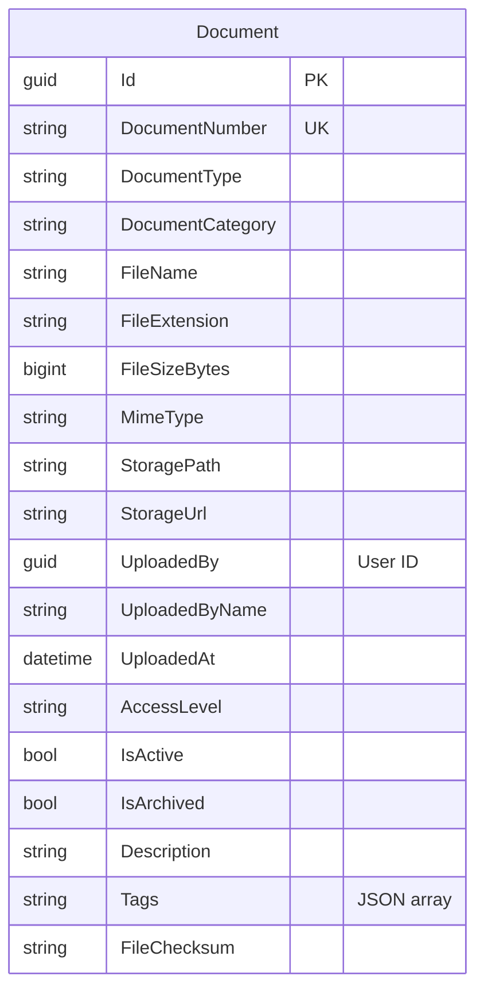

# Document Module - Data Model

## Overview

The Document Module provides centralized document management with local file system storage. All system documents (photos, PDFs, reports, supporting documents) are managed through this module.

### Phase 1 Features (Current Implementation)
- ✅ Centralized document storage
- ✅ Local file system storage
- ✅ Basic document metadata
- ✅ Upload tracking
- ✅ File integrity verification (checksum)

### Future Enhancements (Phase 2+)
- 🔮 Version control and history
- 🔮 Access control and permissions
- 🔮 Document relationships
- 🔮 Access audit logging
- 🔮 Document templates for reports

## Module Structure

```
Document Module (Phase 1)
└── Document (Aggregate Root)

Future Enhancement Tables (Phase 2+)
├── DocumentVersion (Version History)
├── DocumentRelationship (Document Links)
├── DocumentAccess (Access Permissions)
├── DocumentAccessLog (Audit Trail)
└── DocumentTemplate (Report Templates)
```

## Entity Relationship Diagram (Phase 1)



**Legend:**
- **Standalone table** = No FK relationships in Phase 1
- References to Users stored as GUIDs (no FK constraints across modules)
- All documents (photos, PDFs, reports, supporting docs) managed through this single table

**Key Design Notes:**
1. **Centralized Management**: All system documents managed through this single table
2. **Local Storage**: Files stored on local file system
3. **File Integrity**: SHA256 checksum for verification
4. **Soft Delete**: IsDeleted flag for document lifecycle management
5. **Metadata**: JSON tags and custom metadata for extensibility
6. **Simple Access Control**: Basic access level (Public, Internal, Confidential, Restricted)

## Table Definition

### Documents (Aggregate Root)

Main document entity for all system documents.

#### SQL Schema

```sql
CREATE TABLE document.Documents
(
    -- Primary Key
    Id                      UNIQUEIDENTIFIER PRIMARY KEY DEFAULT NEWSEQUENTIALID(),

    -- Business Key
    DocumentNumber          NVARCHAR(50) UNIQUE NOT NULL,            -- Auto-generated: DOC-2025-00001

    -- Document Classification
    DocumentType            NVARCHAR(100) NOT NULL,                  -- TitleDeed, Photo, Report, IDCard, Contract
    DocumentCategory        NVARCHAR(50) NOT NULL,                   -- Legal, AppraisalMedia, Report, Supporting

    -- File Information
    FileName                NVARCHAR(255) NOT NULL,
    FileExtension           NVARCHAR(10) NOT NULL,                   -- pdf, jpg, png, docx
    FileSizeBytes           BIGINT NOT NULL,
    MimeType                NVARCHAR(100) NOT NULL,

    -- Storage (Local File System)
    StoragePath             NVARCHAR(500) NOT NULL,                  -- Physical path: /var/uploads/documents/2025/01/abc123.pdf
    StorageUrl              NVARCHAR(500) NOT NULL,                  -- Web access URL: /api/documents/abc123/download

    -- Upload Information
    UploadedBy              UNIQUEIDENTIFIER NOT NULL,               -- User ID (no FK - cross-module reference)
    UploadedByName          NVARCHAR(200) NOT NULL,
    UploadedAt              DATETIME2 NOT NULL DEFAULT GETUTCDATE(),

    -- Access Control
    AccessLevel             NVARCHAR(50) NOT NULL DEFAULT 'Internal', -- Public, Internal, Confidential, Restricted

    -- Status
    IsActive                BIT NOT NULL DEFAULT 1,
    IsArchived              BIT NOT NULL DEFAULT 0,
    ArchivedAt              DATETIME2 NULL,
    ArchivedBy              UNIQUEIDENTIFIER NULL,
    ArchivedByName          NVARCHAR(200) NULL,

    -- Metadata
    Description             NVARCHAR(500) NULL,
    Tags                    NVARCHAR(MAX) NULL,                      -- JSON array of tags
    CustomMetadata          NVARCHAR(MAX) NULL,                      -- JSON for additional metadata

    -- File Integrity
    FileChecksum            NVARCHAR(100) NULL,                      -- SHA256 hash
    ChecksumAlgorithm       NVARCHAR(20) NULL DEFAULT 'SHA256',

    -- Audit Fields
    CreatedOn               DATETIME2 NOT NULL DEFAULT GETUTCDATE(),
    CreatedBy               UNIQUEIDENTIFIER NOT NULL,
    UpdatedOn               DATETIME2 NOT NULL DEFAULT GETUTCDATE(),
    UpdatedBy               UNIQUEIDENTIFIER NOT NULL,
    RowVersion              ROWVERSION NOT NULL,

    CONSTRAINT CK_Document_AccessLevel CHECK (AccessLevel IN ('Public', 'Internal', 'Confidential', 'Restricted')),
    CONSTRAINT CK_Document_FileSizeBytes CHECK (FileSizeBytes > 0)
);
```

#### Key Fields Explanation

**Business Key:**
- `DocumentNumber`: Auto-generated unique identifier (e.g., DOC-2025-00001)

**Document Classification:**
- `DocumentType`: Type of document (TitleDeed, Photo, Report, IDCard, etc.)
- `DocumentCategory`: Category grouping (Legal, AppraisalMedia, Report, Supporting)

**Storage (Local File System):**
- `StoragePath`: Physical path on disk (e.g., `/var/uploads/documents/2025/01/abc123.pdf`)
- `StorageUrl`: Web access URL for download (e.g., `/api/documents/abc123/download`)

**Access Control:**
- `AccessLevel`: Basic access control (Public, Internal, Confidential, Restricted)

**File Integrity:**
- `FileChecksum`: SHA256 hash for file integrity verification
- `ChecksumAlgorithm`: Algorithm used for checksum (default: SHA256)

## Indexes

```sql
-- Document indexes
CREATE INDEX IX_Document_DocumentNumber ON document.Documents(DocumentNumber);
CREATE INDEX IX_Document_DocumentType ON document.Documents(DocumentType) WHERE IsDeleted = 0;
CREATE INDEX IX_Document_DocumentCategory ON document.Documents(DocumentCategory) WHERE IsDeleted = 0;
CREATE INDEX IX_Document_UploadedBy ON document.Documents(UploadedBy) WHERE IsDeleted = 0;
CREATE INDEX IX_Document_UploadedAt ON document.Documents(UploadedAt DESC);
CREATE INDEX IX_Document_AccessLevel ON document.Documents(AccessLevel) WHERE IsDeleted = 0;
CREATE INDEX IX_Document_IsActive ON document.Documents(IsActive) WHERE IsDeleted = 0;
```

## Enumerations

```csharp
public enum DocumentType
{
    TitleDeed,
    Photo,
    Video,
    Report,
    IDCard,
    HouseRegistration,
    Contract,
    Template,
    Other
}

public enum DocumentCategory
{
    Legal,
    AppraisalMedia,
    Report,
    Supporting,
    Template
}

public enum AccessLevel
{
    Public,
    Internal,
    Confidential,
    Restricted
}
```

## Usage Examples

### Upload Document (Local Storage)

```csharp
var document = Document.Create(
    documentType: DocumentType.Photo,
    category: DocumentCategory.AppraisalMedia,
    fileName: "property-front.jpg",
    fileSizeBytes: 2048576,
    storagePath: "/var/uploads/documents/2025/01/abc123-property-front.jpg",
    storageUrl: "/api/documents/abc123/download",
    uploadedBy: userId,
    uploadedByName: "John Appraiser"
);

await _documentRepository.AddAsync(document);
await _unitOfWork.SaveChangesAsync();
```

### Query Documents

```csharp
// Get all photos for an appraisal
var photos = await _documentRepository
    .GetByTypeAsync(DocumentType.Photo)
    .Where(d => d.Tags.Contains(appraisalId))
    .ToListAsync();

// Get recent uploads
var recentDocs = await _documentRepository
    .GetRecentUploadsAsync(days: 7, userId: currentUserId);
```

### Local Storage Configuration

```json
// appsettings.json
{
  "DocumentStorage": {
    "BasePath": "/var/uploads/documents",
    "BaseUrl": "/api/documents",
    "MaxFileSizeMB": 100,
    "AllowedExtensions": [".pdf", ".jpg", ".jpeg", ".png", ".docx", ".xlsx"],
    "OrganizeByDate": true
  }
}
```

```csharp
// Document storage service example
public class LocalDocumentStorageService
{
    private readonly string _basePath;

    public async Task<string> SaveFileAsync(Stream fileStream, string fileName)
    {
        // Generate unique file name
        var uniqueFileName = $"{Guid.NewGuid()}-{fileName}";

        // Organize by year/month
        var datePath = DateTime.UtcNow.ToString("yyyy/MM");
        var directoryPath = Path.Combine(_basePath, datePath);

        // Ensure directory exists
        Directory.CreateDirectory(directoryPath);

        // Save file
        var fullPath = Path.Combine(directoryPath, uniqueFileName);
        using var fileStream = File.Create(fullPath);
        await fileStream.CopyToAsync(fileStream);

        return fullPath;
    }

    public async Task<Stream> GetFileAsync(string storagePath)
    {
        if (!File.Exists(storagePath))
            throw new FileNotFoundException("Document not found");

        return File.OpenRead(storagePath);
    }
}
```

---

## Future Enhancements (Phase 2+)

### 1. Version Control (DocumentVersions Table)

**Purpose**: Track complete version history of documents

**Key Features:**
- Store multiple versions of the same document
- Version numbering (1, 2, 3, etc.)
- Version notes and change summaries
- Rollback capability to previous versions
- Each version has its own storage path
- Track who created each version and when

**Use Cases:**
- Report revisions after reviews
- Document amendments
- Compliance requirement for audit trail

---

### 2. Document Relationships (DocumentRelationships Table)

**Purpose**: Link related documents together

**Key Features:**
- Parent-child document relationships
- Relationship types: Attachment, Reference, Supersedes, Amendment, Related
- Display ordering for grouped documents
- Prevent circular references

**Use Cases:**
- Link photos to appraisal reports
- Connect amendments to original documents
- Group related supporting documents
- Track document supersession chain

---

### 3. Access Control (DocumentAccess Table)

**Purpose**: Granular permissions for document access

**Key Features:**
- Per-document access grants
- Support both User and Role-based access
- Access levels: Read, Write, Delete, FullControl
- Time-based expiration
- Share and download permissions
- Access revocation tracking

**Use Cases:**
- Share reports with external parties (time-limited)
- Grant temporary access to documents
- Revoke access when staff leaves
- Compliance with data privacy regulations

---

### 4. Access Audit Trail (DocumentAccessLogs Table)

**Purpose**: Complete audit log of all document access

**Key Features:**
- Log every document view, download, edit, delete
- Track IP address, user agent, session
- Record both granted and denied access attempts
- Immutable log entries (insert-only)
- Track which version was accessed

**Use Cases:**
- Compliance audits
- Security investigations
- Usage analytics
- Breach detection

---

### 5. Document Templates (DocumentTemplates Table)

**Purpose**: Reusable templates for generating reports

**Key Features:**
- Pre-defined report templates (Land, Building, Condo appraisals)
- Template codes for easy reference (e.g., "LAND_APPRAISAL_REPORT")
- Support multiple formats (HTML, DOCX, PDF)
- Placeholder system for data injection
- Version tracking for template changes
- Default template selection

**Use Cases:**
- Generate standardized appraisal reports
- Create cover letters for submissions
- Produce property certificates
- Ensure consistent report formatting across all appraisals

---

## Implementation Priority

### Phase 1 (MVP) - ✅ Current
- **Documents** table only
- Basic upload, storage, and retrieval
- Local file system storage
- File integrity verification (SHA256 checksum)

### Phase 2 - 🔮 Future
- **Cloud Storage Migration**: Move to Azure Blob or AWS S3 if needed
- **DocumentVersions**: When report revision workflow is needed
- **DocumentRelationships**: When document grouping becomes complex

### Phase 3 - 🔮 Future
- **DocumentAccess**: When external sharing is required
- **DocumentAccessLogs**: When compliance audits are mandated

### Phase 4 - 🔮 Future
- **DocumentTemplates**: When report generation is automated
- **Application-Level Encryption**: If compliance requires end-to-end encryption

---

## Summary

The Document Module has been simplified for Phase 1 implementation:

**Current Implementation (Phase 1):**
- ✅ Single `Documents` table
- ✅ Centralized storage for all document types
- ✅ Local file system storage (no cloud dependencies)
- ✅ File integrity verification (SHA256 checksum)
- ✅ Basic metadata and tagging (JSON)
- ✅ Access level control (Public, Internal, Confidential, Restricted)

**Deferred to Future Phases:**
- 🔮 **Phase 2**: Cloud storage migration, version control, document relationships
- 🔮 **Phase 3**: Advanced access control, audit logging
- 🔮 **Phase 4**: Report templates, application-level encryption

**Storage Configuration:**
```
Base Path: /var/uploads/documents
Organization: /YYYY/MM/[guid]-filename.ext
Web Access: /api/documents/[documentId]/download
Max File Size: 100 MB (configurable)
```

The module can be easily extended when business needs justify the additional complexity.

---

**Last Updated**: 2025-01-06