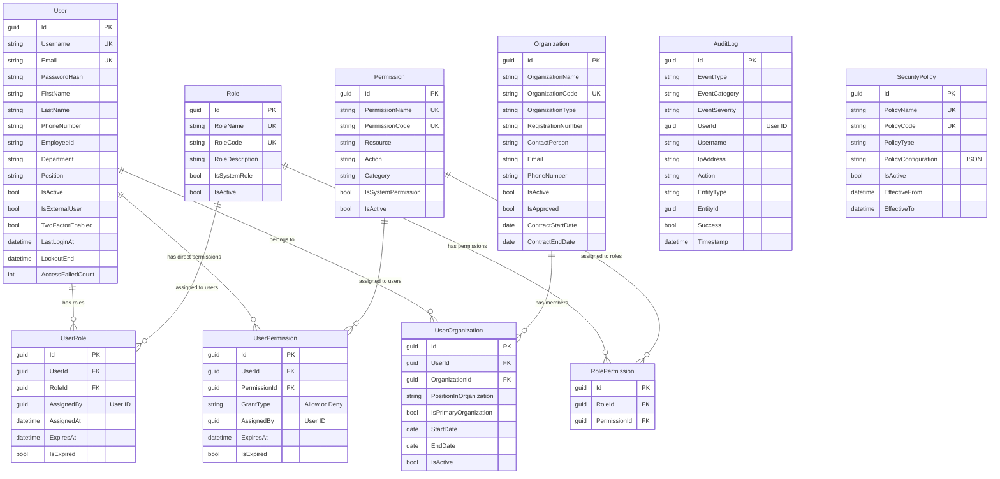

# Authentication & Authorization Module - Data Model

## Overview

The Authentication & Authorization Module handles user management, authentication, and role-based access control (RBAC). It uses OpenIddict for OAuth2/OpenID Connect authentication.

### Key Features
- User authentication (OAuth2/OpenID Connect)
- Role-based access control (RBAC)
- Permission management
- Organization management (for external appraisers)
- Audit logging
- Security policies
- Session management

## Module Structure

```
Auth Module
├── User (Aggregate Root)
├── Role (Role Definitions)
├── Permission (Permission Definitions)
├── UserRole (User-Role Assignments)
├── RolePermission (Role-Permission Mappings)
├── UserPermission (Direct User Permissions)
├── Organization (External Organizations)
├── UserOrganization (User-Org Relationships)
├── AuditLog (System Audit Trail)
└── SecurityPolicy (Security Settings)
```

## Core Tables

### 1. Users (Aggregate Root)

Main user entity for all system users.

#### SQL Schema

```sql
CREATE TABLE auth.Users
(
    -- Primary Key
    Id                      UNIQUEIDENTIFIER PRIMARY KEY DEFAULT NEWSEQUENTIALID(),

    -- Authentication
    Username                NVARCHAR(100) UNIQUE NOT NULL,
    Email                   NVARCHAR(200) UNIQUE NOT NULL,
    EmailConfirmed          BIT NOT NULL DEFAULT 0,
    PasswordHash            NVARCHAR(500) NULL,                      -- For local auth
    SecurityStamp           NVARCHAR(100) NULL,                      -- For invalidating tokens

    -- Personal Information
    FirstName               NVARCHAR(200) NOT NULL,
    LastName                NVARCHAR(200) NOT NULL,
    DisplayName             NVARCHAR(400) NULL,

    -- Contact
    PhoneNumber             NVARCHAR(50) NULL,
    PhoneNumberConfirmed    BIT NOT NULL DEFAULT 0,

    -- Employee Information (for internal users)
    EmployeeId              NVARCHAR(50) NULL,
    Department              NVARCHAR(200) NULL,
    Position                NVARCHAR(200) NULL,
    BranchCode              NVARCHAR(50) NULL,
    BranchName              NVARCHAR(200) NULL,

    -- Profile
    ProfilePhotoUrl         NVARCHAR(500) NULL,
    TimeZone                NVARCHAR(50) NULL,
    Language                NVARCHAR(10) NULL DEFAULT 'th-TH',
    Culture                 NVARCHAR(10) NULL DEFAULT 'th-TH',

    -- Status
    IsActive                BIT NOT NULL DEFAULT 1,
    IsSystemUser            BIT NOT NULL DEFAULT 0,                  -- For system/service accounts
    IsExternalUser          BIT NOT NULL DEFAULT 0,                  -- For external appraisers

    -- Lockout
    LockoutEnabled          BIT NOT NULL DEFAULT 1,
    LockoutEnd              DATETIME2 NULL,
    AccessFailedCount       INT NOT NULL DEFAULT 0,

    -- Two-Factor Authentication
    TwoFactorEnabled        BIT NOT NULL DEFAULT 0,
    TwoFactorSecret         NVARCHAR(100) NULL,

    -- Last Activity
    LastLoginAt             DATETIME2 NULL,
    LastActivityAt          DATETIME2 NULL,

    -- Password Management
    PasswordExpiresAt       DATETIME2 NULL,
    MustChangePassword      BIT NOT NULL DEFAULT 0,

    -- Audit Fields
    CreatedOn               DATETIME2 NOT NULL DEFAULT GETUTCDATE(),
    CreatedBy               UNIQUEIDENTIFIER NULL,
    UpdatedOn               DATETIME2 NOT NULL DEFAULT GETUTCDATE(),
    UpdatedBy               UNIQUEIDENTIFIER NULL,
    RowVersion              ROWVERSION NOT NULL,

    -- Soft Delete
    IsDeleted               BIT NOT NULL DEFAULT 0,
    DeletedOn               DATETIME2 NULL,
    DeletedBy               UNIQUEIDENTIFIER NULL,

    CONSTRAINT CK_User_Username CHECK (LEN(Username) >= 3),
    CONSTRAINT CK_User_Email CHECK (Email LIKE '%@%')
);
```

### 2. Roles

Role definitions for RBAC.

#### SQL Schema

```sql
CREATE TABLE auth.Roles
(
    -- Primary Key
    Id                      UNIQUEIDENTIFIER PRIMARY KEY DEFAULT NEWSEQUENTIALID(),

    -- Role Information
    RoleName                NVARCHAR(100) UNIQUE NOT NULL,
    RoleDescription         NVARCHAR(500) NULL,
    RoleCode                NVARCHAR(50) UNIQUE NULL,                -- e.g., "RM", "APPRAISER", "ADMIN"

    -- Flags
    IsSystemRole            BIT NOT NULL DEFAULT 0,                  -- Cannot be deleted
    IsActive                BIT NOT NULL DEFAULT 1,

    -- Audit Fields
    CreatedOn               DATETIME2 NOT NULL DEFAULT GETUTCDATE(),
    CreatedBy               UNIQUEIDENTIFIER NULL,
    UpdatedOn               DATETIME2 NOT NULL DEFAULT GETUTCDATE(),
    UpdatedBy               UNIQUEIDENTIFIER NULL,

    CONSTRAINT CK_Role_RoleName CHECK (LEN(RoleName) >= 2)
);
```

### 3. Permissions

Permission definitions for fine-grained access control.

#### SQL Schema

```sql
CREATE TABLE auth.Permissions
(
    -- Primary Key
    Id                      UNIQUEIDENTIFIER PRIMARY KEY DEFAULT NEWSEQUENTIALID(),

    -- Permission Information
    PermissionName          NVARCHAR(200) UNIQUE NOT NULL,          -- e.g., "request.create", "appraisal.approve"
    PermissionCode          NVARCHAR(100) UNIQUE NOT NULL,
    Description             NVARCHAR(500) NULL,

    -- Permission Scope
    Resource                NVARCHAR(100) NOT NULL,                  -- Request, Appraisal, Collateral, Document
    Action                  NVARCHAR(50) NOT NULL,                   -- Create, Read, Update, Delete, Approve

    -- Category
    Category                NVARCHAR(100) NULL,                      -- For grouping permissions

    -- Flags
    IsSystemPermission      BIT NOT NULL DEFAULT 0,
    IsActive                BIT NOT NULL DEFAULT 1,

    -- Audit Fields
    CreatedOn               DATETIME2 NOT NULL DEFAULT GETUTCDATE(),
    CreatedBy               UNIQUEIDENTIFIER NULL,
    UpdatedOn               DATETIME2 NOT NULL DEFAULT GETUTCDATE(),
    UpdatedBy               UNIQUEIDENTIFIER NULL,

    CONSTRAINT CK_Permission_PermissionName CHECK (LEN(PermissionName) >= 3)
);
```

### 4. UserRoles

Many-to-many relationship between users and roles.

#### SQL Schema

```sql
CREATE TABLE auth.UserRoles
(
    -- Primary Key
    Id                      UNIQUEIDENTIFIER PRIMARY KEY DEFAULT NEWSEQUENTIALID(),

    -- Foreign Keys
    UserId                  UNIQUEIDENTIFIER NOT NULL,
    RoleId                  UNIQUEIDENTIFIER NOT NULL,

    -- Assignment Information
    AssignedBy              UNIQUEIDENTIFIER NULL,
    AssignedAt              DATETIME2 NOT NULL DEFAULT GETUTCDATE(),

    -- Expiration
    ExpiresAt               DATETIME2 NULL,
    IsExpired               BIT NOT NULL DEFAULT 0,

    -- Audit Fields
    CreatedOn               DATETIME2 NOT NULL DEFAULT GETUTCDATE(),

    CONSTRAINT FK_UserRole_User FOREIGN KEY (UserId)
        REFERENCES auth.Users(Id) ON DELETE CASCADE,
    CONSTRAINT FK_UserRole_Role FOREIGN KEY (RoleId)
        REFERENCES auth.Roles(Id) ON DELETE CASCADE,
    CONSTRAINT UQ_UserRole_UserId_RoleId UNIQUE (UserId, RoleId)
);
```

### 5. RolePermissions

Many-to-many relationship between roles and permissions.

#### SQL Schema

```sql
CREATE TABLE auth.RolePermissions
(
    -- Primary Key
    Id                      UNIQUEIDENTIFIER PRIMARY KEY DEFAULT NEWSEQUENTIALID(),

    -- Foreign Keys
    RoleId                  UNIQUEIDENTIFIER NOT NULL,
    PermissionId            UNIQUEIDENTIFIER NOT NULL,

    -- Audit Fields
    CreatedOn               DATETIME2 NOT NULL DEFAULT GETUTCDATE(),
    CreatedBy               UNIQUEIDENTIFIER NULL,

    CONSTRAINT FK_RolePermission_Role FOREIGN KEY (RoleId)
        REFERENCES auth.Roles(Id) ON DELETE CASCADE,
    CONSTRAINT FK_RolePermission_Permission FOREIGN KEY (PermissionId)
        REFERENCES auth.Permissions(Id) ON DELETE CASCADE,
    CONSTRAINT UQ_RolePermission_RoleId_PermissionId UNIQUE (RoleId, PermissionId)
);
```

### 6. UserPermissions

Direct permissions assigned to users (overrides role permissions).

#### SQL Schema

```sql
CREATE TABLE auth.UserPermissions
(
    -- Primary Key
    Id                      UNIQUEIDENTIFIER PRIMARY KEY DEFAULT NEWSEQUENTIALID(),

    -- Foreign Keys
    UserId                  UNIQUEIDENTIFIER NOT NULL,
    PermissionId            UNIQUEIDENTIFIER NOT NULL,

    -- Grant Type
    GrantType               NVARCHAR(20) NOT NULL,                   -- Allow, Deny

    -- Assignment Information
    AssignedBy              UNIQUEIDENTIFIER NULL,
    AssignedAt              DATETIME2 NOT NULL DEFAULT GETUTCDATE(),
    AssignmentReason        NVARCHAR(500) NULL,

    -- Expiration
    ExpiresAt               DATETIME2 NULL,
    IsExpired               BIT NOT NULL DEFAULT 0,

    -- Audit Fields
    CreatedOn               DATETIME2 NOT NULL DEFAULT GETUTCDATE(),

    CONSTRAINT FK_UserPermission_User FOREIGN KEY (UserId)
        REFERENCES auth.Users(Id) ON DELETE CASCADE,
    CONSTRAINT FK_UserPermission_Permission FOREIGN KEY (PermissionId)
        REFERENCES auth.Permissions(Id) ON DELETE CASCADE,
    CONSTRAINT CK_UserPermission_GrantType CHECK (GrantType IN ('Allow', 'Deny')),
    CONSTRAINT UQ_UserPermission_UserId_PermissionId UNIQUE (UserId, PermissionId)
);
```

### 7. Organizations

External organizations (for external appraisers).

#### SQL Schema

```sql
CREATE TABLE auth.Organizations
(
    -- Primary Key
    Id                      UNIQUEIDENTIFIER PRIMARY KEY DEFAULT NEWSEQUENTIALID(),

    -- Organization Information
    OrganizationName        NVARCHAR(300) NOT NULL,
    OrganizationCode        NVARCHAR(50) UNIQUE NULL,
    OrganizationType        NVARCHAR(50) NOT NULL,                   -- ExternalAppraiser, Vendor, Partner

    -- Registration
    RegistrationNumber      NVARCHAR(100) NULL,
    TaxId                   NVARCHAR(50) NULL,
    LicenseNumber           NVARCHAR(100) NULL,

    -- Contact Information
    ContactPerson           NVARCHAR(200) NULL,
    Email                   NVARCHAR(200) NULL,
    PhoneNumber             NVARCHAR(50) NULL,
    Website                 NVARCHAR(200) NULL,

    -- Address
    AddressLine1            NVARCHAR(500) NULL,
    AddressLine2            NVARCHAR(500) NULL,
    SubDistrict             NVARCHAR(200) NULL,
    District                NVARCHAR(200) NULL,
    Province                NVARCHAR(200) NULL,
    PostalCode              NVARCHAR(20) NULL,
    Country                 NVARCHAR(100) NOT NULL DEFAULT 'Thailand',

    -- Status
    IsActive                BIT NOT NULL DEFAULT 1,
    IsApproved              BIT NOT NULL DEFAULT 0,
    ApprovedBy              UNIQUEIDENTIFIER NULL,
    ApprovedAt              DATETIME2 NULL,

    -- Contract
    ContractStartDate       DATE NULL,
    ContractEndDate         DATE NULL,

    -- Audit Fields
    CreatedOn               DATETIME2 NOT NULL DEFAULT GETUTCDATE(),
    CreatedBy               UNIQUEIDENTIFIER NULL,
    UpdatedOn               DATETIME2 NOT NULL DEFAULT GETUTCDATE(),
    UpdatedBy               UNIQUEIDENTIFIER NULL,

    -- Soft Delete
    IsDeleted               BIT NOT NULL DEFAULT 0,
    DeletedOn               DATETIME2 NULL,
    DeletedBy               UNIQUEIDENTIFIER NULL,

    CONSTRAINT CK_Organization_Type CHECK (OrganizationType IN ('ExternalAppraiser', 'Vendor', 'Partner'))
);
```

### 8. UserOrganizations

Links users to organizations.

#### SQL Schema

```sql
CREATE TABLE auth.UserOrganizations
(
    -- Primary Key
    Id                      UNIQUEIDENTIFIER PRIMARY KEY DEFAULT NEWSEQUENTIALID(),

    -- Foreign Keys
    UserId                  UNIQUEIDENTIFIER NOT NULL,
    OrganizationId          UNIQUEIDENTIFIER NOT NULL,

    -- User Position in Organization
    PositionInOrganization  NVARCHAR(200) NULL,
    IsPrimaryOrganization   BIT NOT NULL DEFAULT 0,

    -- Dates
    StartDate               DATE NULL,
    EndDate                 DATE NULL,

    -- Status
    IsActive                BIT NOT NULL DEFAULT 1,

    -- Audit Fields
    CreatedOn               DATETIME2 NOT NULL DEFAULT GETUTCDATE(),
    CreatedBy               UNIQUEIDENTIFIER NULL,
    UpdatedOn               DATETIME2 NOT NULL DEFAULT GETUTCDATE(),
    UpdatedBy               UNIQUEIDENTIFIER NULL,

    CONSTRAINT FK_UserOrganization_User FOREIGN KEY (UserId)
        REFERENCES auth.Users(Id) ON DELETE CASCADE,
    CONSTRAINT FK_UserOrganization_Organization FOREIGN KEY (OrganizationId)
        REFERENCES auth.Organizations(Id) ON DELETE CASCADE,
    CONSTRAINT UQ_UserOrganization_UserId_OrganizationId UNIQUE (UserId, OrganizationId)
);
```

### 9. AuditLogs

Comprehensive audit trail for security events.

#### SQL Schema

```sql
CREATE TABLE auth.AuditLogs
(
    -- Primary Key
    Id                      UNIQUEIDENTIFIER PRIMARY KEY DEFAULT NEWSEQUENTIALID(),

    -- Event Information
    EventType               NVARCHAR(100) NOT NULL,                  -- UserLogin, UserLogout, PermissionChanged, etc.
    EventCategory           NVARCHAR(50) NOT NULL,                   -- Authentication, Authorization, UserManagement
    EventSeverity           NVARCHAR(20) NOT NULL DEFAULT 'Information', -- Information, Warning, Error, Critical

    -- User Information
    UserId                  UNIQUEIDENTIFIER NULL,
    Username                NVARCHAR(100) NULL,
    IpAddress               NVARCHAR(50) NULL,
    UserAgent               NVARCHAR(500) NULL,

    -- Action Details
    Action                  NVARCHAR(100) NOT NULL,
    EntityType              NVARCHAR(100) NULL,                      -- User, Role, Permission
    EntityId                UNIQUEIDENTIFIER NULL,
    EntityName              NVARCHAR(200) NULL,

    -- Changes
    OldValues               NVARCHAR(MAX) NULL,                      -- JSON
    NewValues               NVARCHAR(MAX) NULL,                      -- JSON

    -- Result
    Success                 BIT NOT NULL,
    ErrorMessage            NVARCHAR(MAX) NULL,

    -- Context
    CorrelationId           NVARCHAR(100) NULL,
    SessionId               NVARCHAR(100) NULL,

    -- Additional Data
    AdditionalData          NVARCHAR(MAX) NULL,                      -- JSON

    -- Timestamp
    Timestamp               DATETIME2 NOT NULL DEFAULT GETUTCDATE(),

    CONSTRAINT CK_AuditLog_EventCategory CHECK (EventCategory IN ('Authentication', 'Authorization', 'UserManagement', 'Security', 'System')),
    CONSTRAINT CK_AuditLog_EventSeverity CHECK (EventSeverity IN ('Information', 'Warning', 'Error', 'Critical'))
);
```

### 10. SecurityPolicies

System-wide security settings and policies.

#### SQL Schema

```sql
CREATE TABLE auth.SecurityPolicies
(
    -- Primary Key
    Id                      UNIQUEIDENTIFIER PRIMARY KEY DEFAULT NEWSEQUENTIALID(),

    -- Policy Information
    PolicyName              NVARCHAR(200) UNIQUE NOT NULL,
    PolicyCode              NVARCHAR(50) UNIQUE NOT NULL,
    PolicyType              NVARCHAR(50) NOT NULL,                   -- Password, Session, Lockout, TwoFactor
    Description             NVARCHAR(500) NULL,

    -- Policy Configuration (JSON)
    PolicyConfiguration     NVARCHAR(MAX) NOT NULL,                  -- JSON configuration

    -- Status
    IsActive                BIT NOT NULL DEFAULT 1,
    EffectiveFrom           DATETIME2 NOT NULL,
    EffectiveTo             DATETIME2 NULL,

    -- Audit Fields
    CreatedOn               DATETIME2 NOT NULL DEFAULT GETUTCDATE(),
    CreatedBy               UNIQUEIDENTIFIER NULL,
    UpdatedOn               DATETIME2 NOT NULL DEFAULT GETUTCDATE(),
    UpdatedBy               UNIQUEIDENTIFIER NULL,

    CONSTRAINT CK_SecurityPolicy_Type CHECK (PolicyType IN ('Password', 'Session', 'Lockout', 'TwoFactor', 'Custom'))
);
```

## Indexes

```sql
-- User indexes
CREATE INDEX IX_User_Username ON auth.Users(Username) WHERE IsDeleted = 0;
CREATE INDEX IX_User_Email ON auth.Users(Email) WHERE IsDeleted = 0;
CREATE INDEX IX_User_EmployeeId ON auth.Users(EmployeeId) WHERE EmployeeId IS NOT NULL;
CREATE INDEX IX_User_IsActive ON auth.Users(IsActive) WHERE IsDeleted = 0;
CREATE INDEX IX_User_LastLoginAt ON auth.Users(LastLoginAt DESC);

-- Role indexes
CREATE INDEX IX_Role_RoleName ON auth.Roles(RoleName);
CREATE INDEX IX_Role_RoleCode ON auth.Roles(RoleCode) WHERE RoleCode IS NOT NULL;

-- Permission indexes
CREATE INDEX IX_Permission_PermissionName ON auth.Permissions(PermissionName);
CREATE INDEX IX_Permission_PermissionCode ON auth.Permissions(PermissionCode);
CREATE INDEX IX_Permission_Resource ON auth.Permissions(Resource);

-- UserRole indexes
CREATE INDEX IX_UserRole_UserId ON auth.UserRoles(UserId);
CREATE INDEX IX_UserRole_RoleId ON auth.UserRoles(RoleId);

-- RolePermission indexes
CREATE INDEX IX_RolePermission_RoleId ON auth.RolePermissions(RoleId);
CREATE INDEX IX_RolePermission_PermissionId ON auth.RolePermissions(PermissionId);

-- UserPermission indexes
CREATE INDEX IX_UserPermission_UserId ON auth.UserPermissions(UserId);
CREATE INDEX IX_UserPermission_PermissionId ON auth.UserPermissions(PermissionId);

-- Organization indexes
CREATE INDEX IX_Organization_OrganizationCode ON auth.Organizations(OrganizationCode) WHERE OrganizationCode IS NOT NULL;
CREATE INDEX IX_Organization_OrganizationType ON auth.Organizations(OrganizationType);
CREATE INDEX IX_Organization_IsActive ON auth.Organizations(IsActive) WHERE IsDeleted = 0;

-- UserOrganization indexes
CREATE INDEX IX_UserOrganization_UserId ON auth.UserOrganizations(UserId);
CREATE INDEX IX_UserOrganization_OrganizationId ON auth.UserOrganizations(OrganizationId);

-- AuditLog indexes
CREATE INDEX IX_AuditLog_UserId ON auth.AuditLogs(UserId);
CREATE INDEX IX_AuditLog_EventType ON auth.AuditLogs(EventType);
CREATE INDEX IX_AuditLog_EventCategory ON auth.AuditLogs(EventCategory);
CREATE INDEX IX_AuditLog_Timestamp ON auth.AuditLogs(Timestamp DESC);
CREATE INDEX IX_AuditLog_Success ON auth.AuditLogs(Success);

-- SecurityPolicy indexes
CREATE INDEX IX_SecurityPolicy_PolicyCode ON auth.SecurityPolicies(PolicyCode);
CREATE INDEX IX_SecurityPolicy_PolicyType ON auth.SecurityPolicies(PolicyType);
CREATE INDEX IX_SecurityPolicy_IsActive ON auth.SecurityPolicies(IsActive) WHERE IsActive = 1;
```

## Entity Relationship Diagram



**Legend:**
- **Solid lines** = Internal module relationships (with FK constraints)
- All relationships use foreign key constraints within the Auth module
- Only key fields shown for clarity; see full schemas above for complete field lists

**Key Design Notes:**
1. **RBAC Model**: Users → Roles → Permissions (standard role-based access control)
2. **Direct Permissions**: UserPermissions allow granting/denying specific permissions to individual users
3. **Grant Types**: UserPermissions support "Allow" and "Deny" for fine-grained control
4. **External Organizations**: Support for external appraisers and vendors with organization management
5. **Audit Trail**: Comprehensive logging of all authentication and authorization events
6. **Security Policies**: Configurable security settings (password, session, lockout, 2FA)
7. **OAuth2/OpenID Connect**: Integration with OpenIddict for modern authentication

## Enumerations

```csharp
public enum OrganizationType
{
    ExternalAppraiser,
    Vendor,
    Partner
}

public enum GrantType
{
    Allow,
    Deny
}

public enum EventCategory
{
    Authentication,
    Authorization,
    UserManagement,
    Security,
    System
}

public enum EventSeverity
{
    Information,
    Warning,
    Error,
    Critical
}

public enum PolicyType
{
    Password,
    Session,
    Lockout,
    TwoFactor,
    Custom
}
```

## Sample Roles

```sql
-- Admin Role
INSERT INTO auth.Roles (RoleName, RoleCode, RoleDescription, IsSystemRole, IsActive)
VALUES ('Administrator', 'ADMIN', 'System administrator with full access', 1, 1);

-- RM Role
INSERT INTO auth.Roles (RoleName, RoleCode, RoleDescription, IsSystemRole, IsActive)
VALUES ('Relationship Manager', 'RM', 'Can create and manage appraisal requests', 1, 1);

-- Appraiser Role
INSERT INTO auth.Roles (RoleName, RoleCode, RoleDescription, IsSystemRole, IsActive)
VALUES ('Appraiser', 'APPRAISER', 'Can conduct appraisals and create reports', 1, 1);

-- Checker Role
INSERT INTO auth.Roles (RoleName, RoleCode, RoleDescription, IsSystemRole, IsActive)
VALUES ('Internal Checker', 'CHECKER', 'Can review and check appraisals', 1, 1);

-- Verifier Role
INSERT INTO auth.Roles (RoleName, RoleCode, RoleDescription, IsSystemRole, IsActive)
VALUES ('Internal Verifier', 'VERIFIER', 'Can verify appraisals', 1, 1);

-- Committee Role
INSERT INTO auth.Roles (RoleName, RoleCode, RoleDescription, IsSystemRole, IsActive)
VALUES ('Committee Approver', 'COMMITTEE', 'Can approve final appraisals', 1, 1);
```

---

**Related Documentation**:
- **[01-module-summary.md](01-module-summary.md)** - Overview of all modules
- **[15-sample-data.md](15-sample-data.md)** - Sample user and role data
