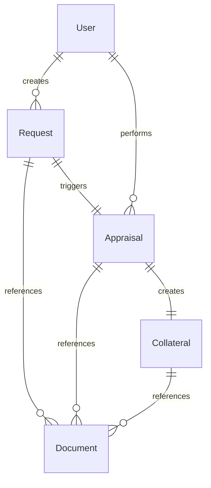
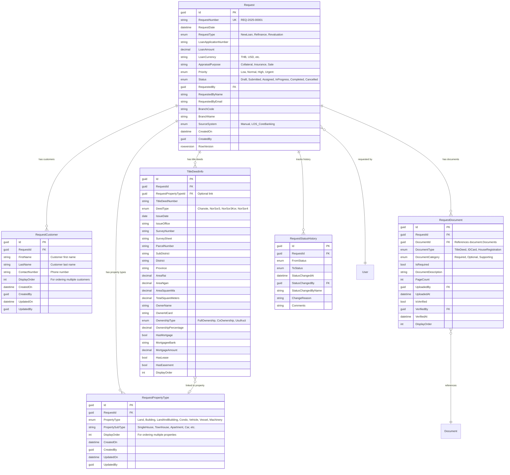
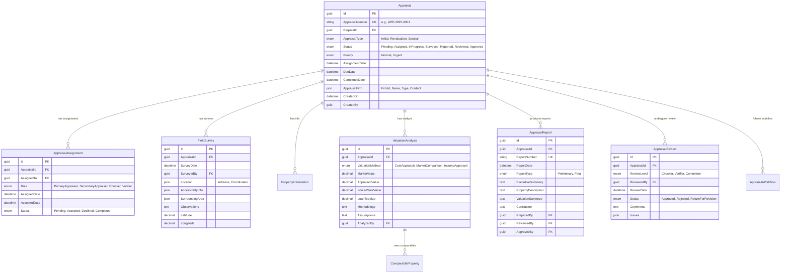
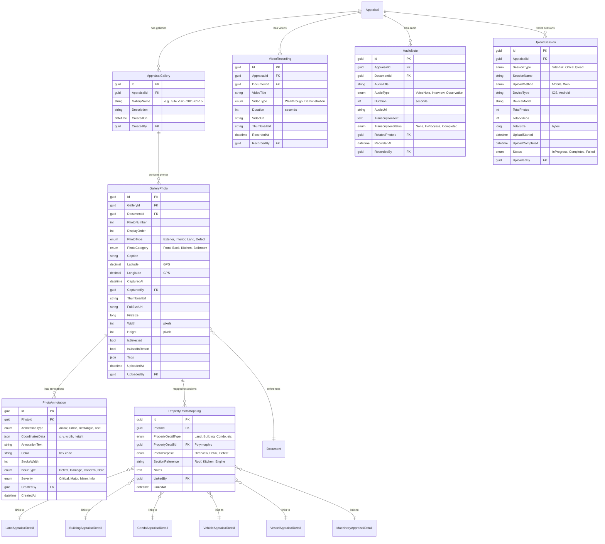
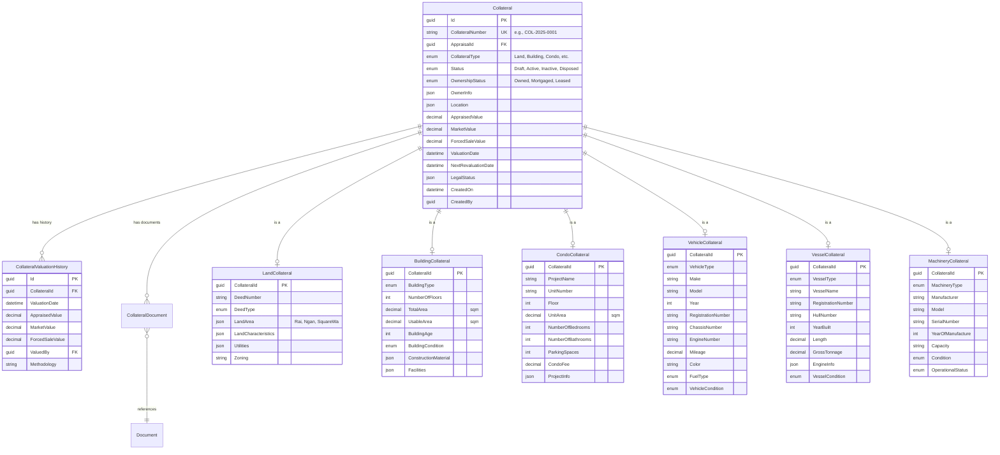
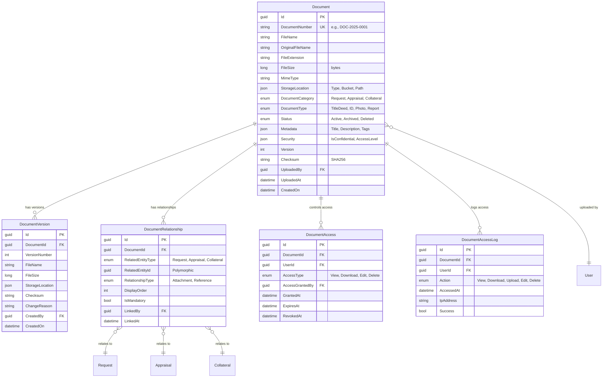
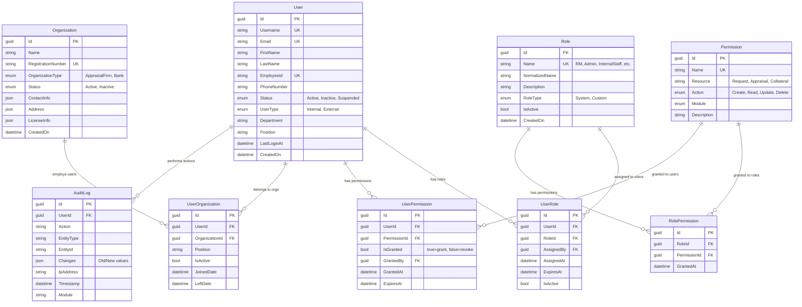
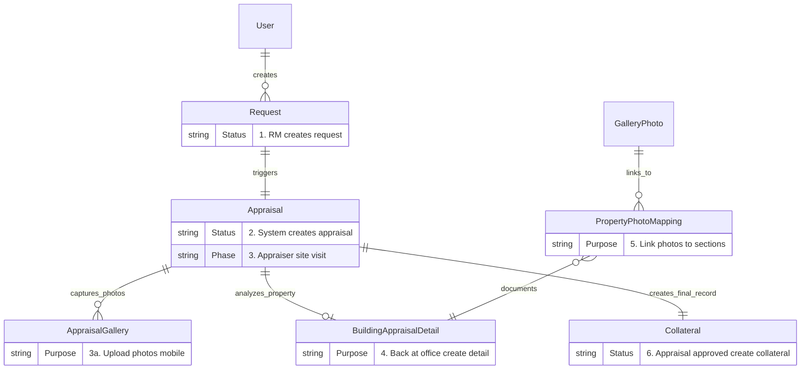

# Entity Relationship Diagrams

## Overview

This document contains Entity Relationship (ER) diagrams for the Collateral Appraisal System. The diagrams are organized by module to show clear boundaries and relationships.

## Complete System Overview



## Module 1: Request Management



## Module 2: Appraisal Core



## Module 3: Property Details

```mermaid
erDiagram
    Appraisal ||--o| LandAppraisalDetail : "has detail"
    Appraisal ||--o| BuildingAppraisalDetail : "has detail"
    Appraisal ||--o| CondoAppraisalDetail : "has detail"
    Appraisal ||--o| VehicleAppraisalDetail : "has detail"
    Appraisal ||--o| VesselAppraisalDetail : "has detail"
    Appraisal ||--o| MachineryAppraisalDetail : "has detail"

    LandAppraisalDetail {
        guid Id PK
        guid AppraisalId FK
        enum Topography "Flat, Sloped, Hilly"
        enum LandShape "Regular, Irregular, Rectangular"
        enum SoilType "Clay, Sandy, Loam, Rocky"
        decimal FrontageWidth "meters"
        decimal Depth "meters"
        bool CornerLot
        bool HasElectricity
        bool HasWater
        bool HasSewageSystem
        string Zoning
        enum LandUse "Residential, Commercial, Agricultural"
        enum DevelopmentPotential "High, Medium, Low"
        guid LastUpdatedBy FK
    }

    BuildingAppraisalDetail {
        guid Id PK
        guid AppraisalId FK
        enum BuildingType "House, Townhouse, Commercial"
        int NumberOfFloors
        decimal TotalBuildingArea "sqm"
        decimal UsableArea "sqm"
        int ConstructionYear
        int EffectiveAge
        enum RoofType
        enum RoofMaterial
        enum RoofCondition
        enum FloorMaterial
        enum FloorCondition
        bool IsDecorated
        enum DecorationLevel "Basic, Standard, Luxury"
        int NumberOfBedrooms
        int NumberOfBathrooms
        bool HasAirConditioner
        int NumberOfACUnits
        enum OverallCondition "Excellent, Good, Fair, Poor"
        text Defects
        decimal EstimatedRepairCost
        guid LastUpdatedBy FK
    }

    CondoAppraisalDetail {
        guid Id PK
        guid AppraisalId FK
        string ProjectName
        string Developer
        int TotalUnits
        int BuildYear
        string UnitNumber
        int Floor
        enum UnitType "Studio, OneBedroom, TwoBedroom"
        decimal UnitArea "sqm"
        decimal BalconyArea "sqm"
        int NumberOfBedrooms
        int NumberOfBathrooms
        int ParkingSpaces
        decimal MonthlyFee "Baht"
        enum ViewType "City, Garden, Pool, Mountain"
        bool HasSwimmingPool
        bool HasFitnessCenter
        bool HasSecurity
        guid LastUpdatedBy FK
    }

    VehicleAppraisalDetail {
        guid Id PK
        guid AppraisalId FK
        enum VehicleType "Sedan, SUV, Truck, Pickup"
        string Make
        string Model
        int Year
        string RegistrationNumber
        string ChassisNumber
        string EngineNumber
        decimal Mileage "km"
        enum BodyCondition
        enum PaintCondition
        enum EngineCondition
        enum TransmissionCondition
        bool HasRust
        enum AccidentHistory "None, Minor, Major"
        enum OverallCondition
        guid LastUpdatedBy FK
    }

    VesselAppraisalDetail {
        guid Id PK
        guid AppraisalId FK
        enum VesselType "SpeedBoat, SailingYacht, MotorYacht"
        string VesselName
        string RegistrationNumber
        string HullNumber
        int YearBuilt
        enum HullMaterial "Fiberglass, Steel, Aluminum"
        decimal Length "meters"
        decimal GrossTonnage
        int NumberOfEngines
        decimal EngineHours
        enum HullCondition
        bool HasOsmosisBlisters
        enum OverallCondition
        guid LastUpdatedBy FK
    }

    MachineryAppraisalDetail {
        guid Id PK
        guid AppraisalId FK
        enum MachineryType "CNC, Press, Lathe, Generator"
        enum Category "Production, Construction, Agricultural"
        string Manufacturer
        string Model
        string SerialNumber
        int YearOfManufacture
        string Capacity
        decimal HoursUsed
        enum OperationalStatus "Operational, Idle, UnderRepair"
        enum OverallCondition
        enum MaintenanceHistory "Excellent, Good, Poor"
        enum DemandLevel "High, Medium, Low, Obsolete"
        guid LastUpdatedBy FK
    }
```



## Module 4: Photo Gallery & Media



## Module 5: Collateral Management



## Module 6: Document Management



## Module 7: Authentication & Authorization



## Cross-Module Integration Flow



## Data Flow Diagram

```
┌──────────────┐
│   Request    │ Step 1: RM creates request
│   Created    │ ────────┐
└──────────────┘         │
                         ▼
                  ┌─────────────┐
                  │  Domain     │
                  │   Event     │
                  │  Published  │
                  └──────┬──────┘
                         │
                         ▼
                  ┌─────────────┐
                  │  Appraisal  │ Step 2: System creates appraisal
                  │  Created    │
                  └──────┬──────┘
                         │
                         ▼
                  ┌─────────────┐
                  │ Appraiser   │ Step 3: Site visit
                  │ Site Visit  │
                  └──────┬──────┘
                         │
                    ┌────┴────┐
                    │         │
                    ▼         ▼
        ┌──────────────┐ ┌──────────────┐
        │Upload Photos │ │Upload Videos │ Step 3a: Mobile capture
        │to Gallery    │ │& Audio Notes │
        └──────┬───────┘ └──────────────┘
               │
               ▼
        ┌──────────────┐
        │Back at Office│ Step 4: Create property detail
        │Create Detail │
        └──────┬───────┘
               │
               ▼
        ┌──────────────┐
        │Link Photos to│ Step 5: Map photos to sections
        │Property      │
        │Sections      │
        └──────┬───────┘
               │
               ▼
        ┌──────────────┐
        │Add           │ Step 6: Annotate issues
        │Annotations   │
        └──────┬───────┘
               │
               ▼
        ┌──────────────┐
        │Create        │ Step 7: Generate report
        │Appraisal     │
        │Report        │
        └──────┬───────┘
               │
               ▼
        ┌──────────────┐
        │Review &      │ Step 8: Approval workflow
        │Approval      │
        └──────┬───────┘
               │
               ▼
        ┌──────────────┐
        │Collateral    │ Step 9: Create final collateral record
        │Created       │
        └──────────────┘
```

## Indexing Strategy

### Critical Indexes

```sql
-- Request Module
CREATE INDEX IX_Request_Status ON request.Requests(Status);
CREATE INDEX IX_Request_RequestedBy ON request.Requests(RequestedBy);
CREATE INDEX IX_Request_CreatedOn ON request.Requests(CreatedOn DESC);
CREATE INDEX IX_Request_RequestNumber ON request.Requests(RequestNumber);

-- Appraisal Module
CREATE INDEX IX_Appraisal_Status_DueDate ON appraisal.Appraisals(Status, DueDate);
CREATE INDEX IX_Appraisal_RequestId ON appraisal.Appraisals(RequestId);
CREATE INDEX IX_Appraisal_CreatedOn ON appraisal.Appraisals(CreatedOn DESC);

-- Gallery Photos
CREATE INDEX IX_GalleryPhoto_GalleryId ON appraisal.GalleryPhotos(GalleryId);
CREATE INDEX IX_GalleryPhoto_PhotoType ON appraisal.GalleryPhotos(PhotoType);
CREATE INDEX IX_GalleryPhoto_IsUsedInReport ON appraisal.GalleryPhotos(IsUsedInReport)
    WHERE IsUsedInReport = 1;

-- Property Photo Mapping
CREATE INDEX IX_PropertyPhotoMapping_PhotoId ON appraisal.PropertyPhotoMappings(PhotoId);
CREATE INDEX IX_PropertyPhotoMapping_PropertyDetail
    ON appraisal.PropertyPhotoMappings(PropertyDetailType, PropertyDetailId);
CREATE INDEX IX_PropertyPhotoMapping_SectionReference
    ON appraisal.PropertyPhotoMappings(SectionReference);

-- Collateral Module
CREATE INDEX IX_Collateral_AppraisalId ON collateral.Collaterals(AppraisalId);
CREATE INDEX IX_Collateral_Status ON collateral.Collaterals(Status);
CREATE INDEX IX_Collateral_CollateralType ON collateral.Collaterals(CollateralType);

-- Document Module
CREATE INDEX IX_Document_DocumentCategory ON document.Documents(DocumentCategory);
CREATE INDEX IX_Document_Status ON document.Documents(Status);
CREATE INDEX IX_DocumentRelationship_RelatedEntity
    ON document.DocumentRelationships(RelatedEntityType, RelatedEntityId);

-- Auth Module
CREATE INDEX IX_User_Email ON auth.Users(Email);
CREATE INDEX IX_User_Status ON auth.Users(Status);
CREATE INDEX IX_UserRole_UserId ON auth.UserRoles(UserId);
CREATE INDEX IX_UserRole_RoleId ON auth.UserRoles(RoleId);
CREATE INDEX IX_AuditLog_Timestamp ON auth.AuditLogs(Timestamp DESC);
CREATE INDEX IX_AuditLog_UserId ON auth.AuditLogs(UserId);
```

## Foreign Key Relationships

### Within Module
```sql
-- Use database foreign keys
ALTER TABLE appraisal.GalleryPhotos
    ADD CONSTRAINT FK_GalleryPhoto_Gallery
    FOREIGN KEY (GalleryId) REFERENCES appraisal.AppraisalGalleries(Id)
    ON DELETE CASCADE;
```

### Cross Module
```sql
-- Store only ID, no FK constraint (eventual consistency)
-- Request.Id stored in Appraisal.RequestId
-- Appraisal.Id stored in Collateral.AppraisalId
-- No database FK, verified in application code
```

## Cardinality Notation

```
||--||  : One to One
||--o{  : One to Many
}o--||  : Many to One
}o--o{  : Many to Many
||--o|  : One to Zero or One
```

## Best Practices

### 1. Entity Naming
- Use singular nouns: `Request`, `Appraisal`, `Photo`
- PascalCase for multi-word: `AppraisalGallery`, `PropertyPhotoMapping`

### 2. Primary Keys
- Always GUID (UNIQUEIDENTIFIER)
- Always named `Id`
- Use NEWSEQUENTIALID() for SQL Server performance

### 3. Foreign Keys
- Always named `{Entity}Id`: `AppraisalId`, `UserId`, `DocumentId`
- Include in indexes for join performance

### 4. Business Keys
- Unique constraint on business identifiers
- Indexed for lookup performance
- Human-readable format: `REQ-2025-0001`, `APP-2025-0123`

### 5. Audit Fields
- Standard fields on all entities: `CreatedOn`, `CreatedBy`, `UpdatedOn`, `UpdatedBy`
- Implement via EF Core SaveChanges interceptor

### 6. Soft Delete
- Optional `IsDeleted`, `DeletedOn`, `DeletedBy` fields
- Use global query filter in EF Core
- Archive to separate table for historical data

### 7. Optimistic Concurrency
- Use `RowVersion` (timestamp) column
- Handle concurrency exceptions gracefully

---

**Next**: See [11-design-decisions.md](11-design-decisions.md) for detailed rationale behind design choices.
