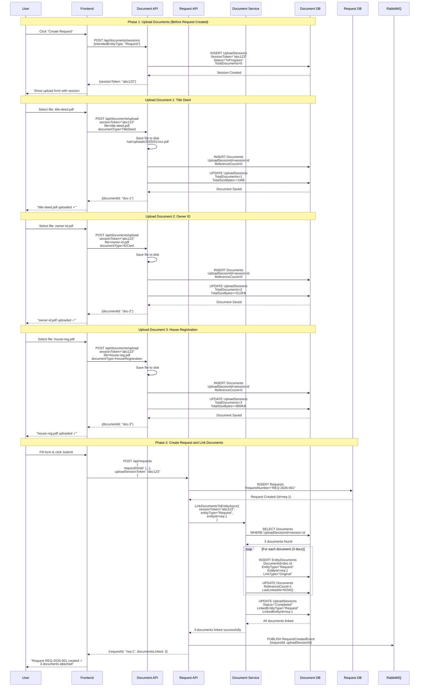
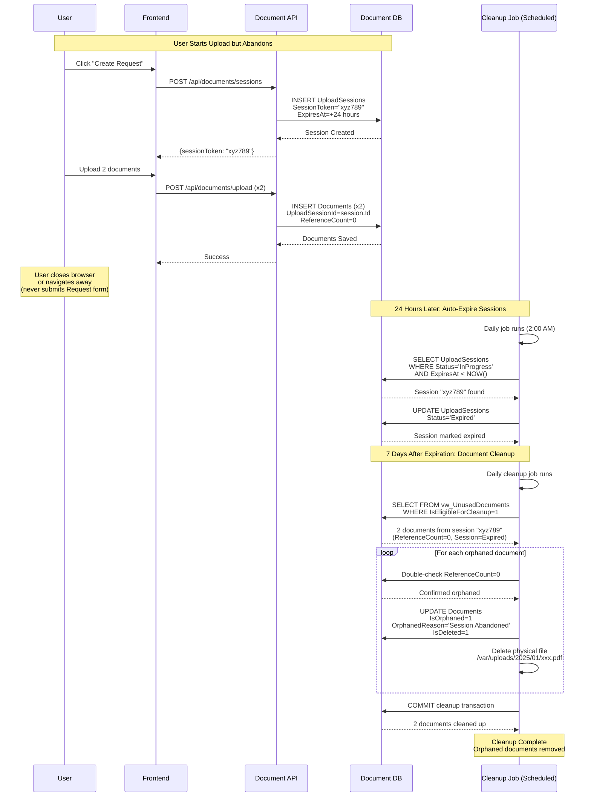
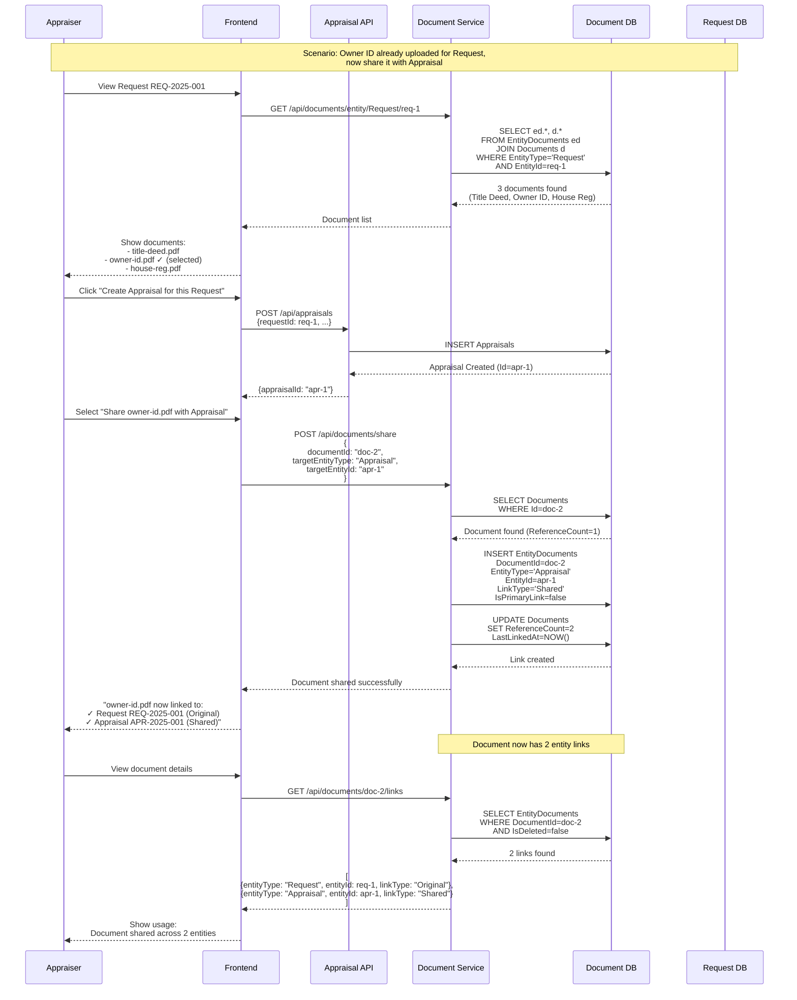
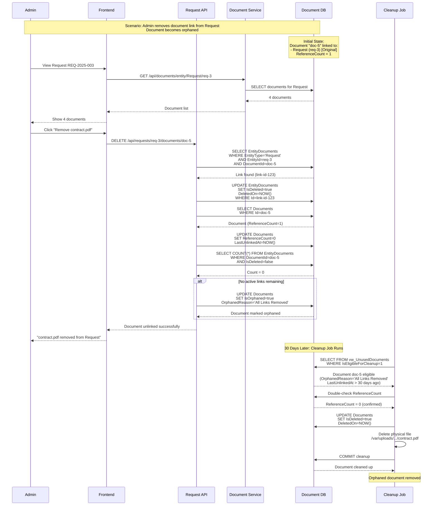
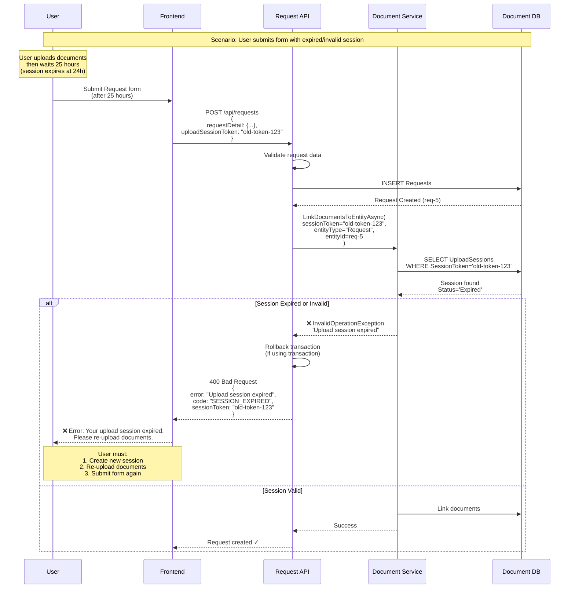

# Upload Session Sequence Diagrams

## Complete Two-Phase Upload Workflow

### Diagram 1: Complete Flow (Request Creation with Documents)

---

### Diagram 2: Session Abandoned (Cleanup Flow)

---

### Diagram 3: Share Document Across Entities (Polymorphic Linking)

---

### Diagram 4: Unlink Document and Orphan Detection

---

### Diagram 5: Error Handling - Session Token Invalid

---

## Key Takeaways from Diagrams

### Diagram 1: Normal Flow
- One session → Multiple documents
- Session tracks `TotalDocuments` and `TotalSizeBytes`
- All documents linked atomically when Request created
- Session marked `Completed` with linked entity info

### Diagram 2: Abandoned Session
- Session expires after 24 hours
- Documents remain orphaned (ReferenceCount=0)
- Cleanup job removes after 7 days
- Physical files deleted from disk

### Diagram 3: Polymorphic Linking
- Same document can link to multiple entities
- Each link tracks `LinkType` (Original, Shared)
- `ReferenceCount` incremented for each link
- Document survives as long as one link exists

### Diagram 4: Orphan Detection
- Unlinking decrements `ReferenceCount`
- When ReferenceCount=0, marked orphaned
- `LastUnlinkedAt` timestamp recorded
- Cleanup after 30-day retention period

### Diagram 5: Error Handling
- Expired sessions prevent document linking
- Request creation can be rolled back
- User notified to re-upload
- Prevents orphaned requests without documents
