# CAS 101

**Status:** Draft v1 · 2026-01-25
**Audience:** Developer
**Scope:** Whole CAS (all 11 modules) — data inventory, data flow, and process flow

> This document is the **upstream discovery** deliverable. It does *not* propose a star schema, ETL approach, or technology choice for the mart itself — those decisions follow once the source system is well understood.

---

## Table of Contents

1. [Executive Summary](#1-executive-summary)
2. [System Overview](#2-system-overview)
3. [Module Map](#3-module-map)
4. [Overview of Data in CAS](#4-overview-of-data-in-cas)
5. [Overview of Data Flow](#5-overview-of-data-flow)
6. [Overview of Process Flow](#6-overview-of-process-flow)
7. [Integration Surface (Reference)](#7-integration-surface-reference)
8. [Operational Aspects](#8-operational-aspects)
9. [Datamart Implications](#9-datamart-implications)
10. [Appendices](#10-appendices)
11. [ER Diagrams](#er-diagrams) — cross-module map + per-module diagrams (large modules split into subdomain ERs)
12. [Data Dictionary](#data-dictionary) — every persisted table and column, generated from EF model snapshots (239 tables, including owned-entity tables broken out)

---

## 1. Executive Summary

**CAS (Collateral Appraisal System)** is a bank-side application that manages the end-to-end lifecycle of property and collateral appraisal requests — from intake by a relationship manager, through quotation and assignment (to an external appraisal company or an internal team), through inspection, pricing analysis, committee approval, and finally collateral engagement registration that feeds back to the bank's loan origination system (AS400).

CAS is built as a **.NET 9 modular monolith**: eleven business modules share a single deployable host but maintain their own DbContexts, schemas, aggregate boundaries, and outbox-based eventing. Infrastructure includes SQL Server (operational store), Redis (cache), RabbitMQ (message bus via MassTransit), Hangfire (recurring jobs), OpenIddict (OAuth2/OIDC), and Serilog (structured logging into both `common.Logs` and Seq). It is deployed to two IIS application servers behind a bank-owned F5 load balancer.

> **Why a datamart is being considered.** *(TBD — to be filled in by the requester before circulating.)* Likely drivers, based on what the operational schema already supports: SLA / turnaround reporting, external company performance, regional & branch volume trends, committee throughput, invoicing reconciliation against AS400.

---

## 2. System Overview

### 2.1 Architectural style

- **Modular monolith** — one process, many modules. Each module lives under `Modules/<ModuleName>/` and has its own:
  - DbContext (`AppraisalDbContext`, `RequestDbContext`, …)
  - Database schema (`appraisal`, `request`, `workflow`, …)
  - Aggregates / value objects (under `<Module>/Domain/`)
  - Application layer (commands, queries, validators, event handlers via MediatR)
  - Infrastructure (EF Core configurations, migrations, repositories)
  - Integration event outbox table — events are persisted before publishing
- **DDD aggregates** with a shared `Aggregate<TId>` base in `Shared/`. Aggregates raise domain events that are dispatched **inside** the same EF transaction by `DispatchDomainEventInterceptor` before `SaveChanges` commits — so same-module handlers see consistent state and run under the same transaction.
- **CQRS via MediatR** — Carter endpoints translate HTTP to commands/queries; commands mutate aggregates, queries hit a read side that mixes EF Core (for nested detail) and Dapper-against-SQL-views (for paginated lists and dashboards).
- **Carter** is the routing layer (`Bootstrapper/Api/Endpoints/...`); endpoint files live close to the API host, not the module, so cross-module orchestration stays visible.
- **Cross-module communication is asynchronous** via a persistent integration-event outbox, drained by per-module HostedServices, published to RabbitMQ through MassTransit. There is no in-memory cross-module call path for state changes.

### 2.2 Read/write separation

| Concern | Mechanism |
| --- | --- |
| Mutations | EF Core via aggregates; DispatchDomainEventInterceptor + AuditableEntityInterceptor |
| Nested detail reads | EF Core with `Include`/projection (e.g. AppraisalDetail) |
| Paginated list reads | Dapper + SQL views in `Database/Scripts/Views/<Module>/` via `ISqlConnectionFactory` and `DapperPaginationExtensions.QueryPaginatedAsync<T>()` |
| Caching | Repository decorator pattern (`CachedRequestRepository` etc.) backed by Redis |
| Spatial queries | Persisted computed column `GeoPoint AS geography::Point(Lat, Lon, 4326)` + spatial index, queried via Dapper (no NetTopologySuite dependency) |

### 2.3 High-level component diagram

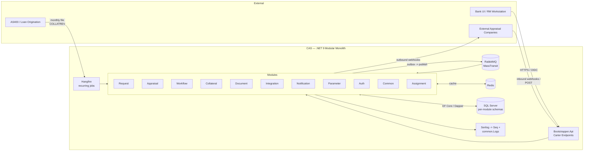
```mermaid
flowchart LR
    subgraph External
        UI[Bank UI / RM Workstation]
        EXT[External Appraisal Companies]
        AS400[AS400 / Loan Origination]
    end

    subgraph CAS[CAS — .NET 9 Modular Monolith]
        direction TB
        API[Bootstrapper.Api<br/>Carter Endpoints]
        subgraph Modules
            REQ[Request]
            APR[Appraisal]
            WF[Workflow]
            COL[Collateral]
            DOC[Document]
            INT[Integration]
            NOT[Notification]
            PRM[Parameter]
            AUTH[Auth]
            CMN[Common]
            ASN[Assignment]
        end
        BUS[(RabbitMQ<br/>MassTransit)]
        CACHE[(Redis)]
        DB[(SQL Server<br/>per-module schemas)]
        HF[Hangfire<br/>recurring jobs]
        LOG[Serilog -> Seq +<br/>common.Logs]
    end

    UI -->|HTTPS / OIDC| API
    EXT -->|inbound webhooks /<br/>POST| API
    AS400 -->|monthly file<br/>COLLATREV| HF

    API --> Modules
    Modules <-->|EF Core / Dapper| DB
    Modules <-->|cache| CACHE
    Modules -->|outbox -> publish| BUS
    BUS --> Modules
    Modules -->|outbound webhooks| EXT
    Modules --> LOG
    HF --> Modules
```

---

## 3. Module Map

Eleven modules under `Modules/`. Eight own significant data; three (Notification, Parameter, Assignment) are smaller.

| Module | DbContext | Schema | Primary Aggregates / Roots | Purpose |
| --- | --- | --- | --- | --- |
| **Request** | `RequestDbContext` | `request` | `Request`, `RequestTitle`, `RequestComment` | Intake aggregate; first state of the lifecycle; owns request-level documents and customer/property metadata before an Appraisal is born |
| **Appraisal** | `AppraisalDbContext` | `appraisal` | `Appraisal`, `AppraisalAssignment`, `Project` (Condo + LandAndBuilding), `PricingAnalysis` (Sales/Cost/Income/Hypothesis/Leasehold), `MarketComparable`, `QuotationRequest`, `AppraisalAppendix`, `Committee`, `AppraisalFee`, `AppraisalReview` | The richest module: holds the appraisal aggregate, all pricing analyses, comparables, committee review outcome, fees & invoicing inputs |
| **Workflow** | `WorkflowDbContext` | `workflow` | `WorkflowInstance`, `WorkflowDefinition`/`Version`, `WorkflowActivityExecution`, `PendingTask`, `CompletedTask`, `Committee`, `Meeting`, `DocumentFollowup`, `ApprovalVote` | The state machine driver; owns task/meeting/SLA data |
| **Collateral** | `CollateralDbContext` | `collateral` | `CollateralMaster`, `CollateralEngagement` | The "result-of-appraisal" record; engagements are the contract between an Appraisal and a Collateral Master (one engagement per AppraisalId, anchored on the primary `IsMaster` group) |
| **Document** | `DocumentDbContext` | `document` | `Document`, `UploadSession` | Storage-agnostic doc handle + session-based uploads; linked to Requests/Appraisals via integration events |
| **Integration** | `IntegrationDbContext` | `integration` | `WebhookSubscription`, `WebhookDelivery`, `IdempotencyRecord` | Outbound webhook delivery to external companies; inbound idempotency guards |
| **Notification** | `NotificationDbContext` | `notification` | `UserNotification` | In-app notifications consumed by the UI |
| **Parameter** | `ParameterDbContext` | `parameter` | Lookup entities (construction work, document requirements, pricing parameters, jurisdictions, floor materials, …) | System lookups / configuration |
| **Auth** | `AuthDbContext` | `auth` | `ApplicationUser` (ASP.NET Core Identity), `Company` (external co.), `Group`, `Role`, `Permission`, `MenuItem`, OpenIddict app/auth/token/scope | Identity, RBAC, menu, data protection keys |
| **Common** | `CommonDbContext` | `common` | `Log` (Serilog SQL sink), `DailyAppraisalCount`, `AppraisalStatusSummary`, `DashboardNote`, `SavedSearch` | Cross-module read models and operational tables |
| **Assignment** | (no separate DbContext) | — | (minimal) | Mostly absorbed into Appraisal (`AppraisalAssignment` lives in `appraisal`); folder remains for cross-cutting assignment policies |

> **Audit & soft-delete** — every domain entity carries `CreatedOn`, `CreatedBy`, `UpdatedOn`, `UpdatedBy` via `AuditableEntityInterceptor` + global EF conventions. Soft-delete is applied via an `IsDeleted` flag and a global query filter; `MarketComparables` is the canonical example.

> **ID strategy** — aggregates use `Guid.CreateVersion7()` in their `Create` factory methods (sortable v7 UUIDs), with `NEWSEQUENTIALID()` configured as a server-side fallback in EF configurations.

---

## 4. Overview of Data in CAS

### 4.1 Write-side aggregate inventory

#### Request module (`request` schema)

```
Request (aggregate root)
├── RequestStatus (value object: Draft / New / Submitted / Assigned / InProgress / Completed / Cancelled)
├── RequestDetail (value object: amount, propertyType, ...)
├── Address (value object)
├── Contact (value object)
├── LoanDetail (value object)
├── RequestTitle (entity collection — properties / land titles)
└── RequestComment (entity collection)
```

#### Appraisal module (`appraisal` schema) — the richest

```
Appraisal (aggregate root)
├── AppraisalStatus (Submitted / Pending / Assigned / InProgress / UnderReview / Completed / Cancelled — PERSISTED, not derived)
├── AppraisalNumber (sequential; key join with AS400 SurveyNo)
├── AppraisalAssignment (path-aware: ext starts Pending, int starts Assigned;
│                       Verified is invoice-eligibility gate)
├── ExternalEngagementCycle (per-rework cycle on external path)
├── AppraisalAppendix (snapshot of additional docs / addenda)
├── AppraisalFee (incl. PartialPaid, BankAbsorbAmount, PaymentHistory)
└── Owned-entity tree on the detail side:
    ├── LandAppraisalDetail (Address owned, owns GeoPoint computed column)
    └── CondoAppraisalDetail (BuiltOnTitleNumber → CollateralMaster title source)

Project (separate aggregate, 1:1 with Appraisal)
├── ProjectType discriminator (Condo / LandAndBuilding / Land)
└── ProjectTower → ProjectModel (floor materials live on Model only)

PricingAnalysis (aggregate root, group-shared)
├── Approaches (Sales / Cost / Income / Hypothesis / Leasehold)
├── Methods (per approach)
├── Properties (M:N with Method — property-centric model)
├── PricingComparableLink → AppraisalComparable → MarketComparable
├── PricingFinalValue (FinalValueAdjusted = the adjusted unit price;
│                     BuildingCost; AppraisalPrice override)
└── PricingInfo (group-shared object — DO NOT assign per-property)

MarketComparable (aggregate root)
├── Latitude / Longitude (promoted from EAV; CreatedByCompanyId)
└── SoftDelete (owned)

QuotationRequest (aggregate root)
└── Denormalized counts (TotalAppraisals, etc.)

Committee (aggregate root, in appraisal — distinct from workflow.Committee)
└── CommitteeMember (IsActive filter required for active count)

AppraisalReview (committee outcome record — one row per appraisal at approval)
└── Tier DERIVED from committee code in views, not stored
```

#### Workflow module (`workflow` schema)

```
WorkflowInstance (aggregate root)
├── status (Running / Completed / StepCompleted / Failed / Pending)
├── currentActivityId
├── Variables (JSON — but DO NOT JSON_VALUE in views; promote to typed column instead)
├── SLA tracking
└── correlation (e.g. AppraisalId / RequestId)

WorkflowActivityExecution (audit trail per transition)
├── startedAt / completedAt / completedBy (NB: distinct from AssignedTo — assignee may be a group)
└── movement (F / B / C)

PendingTask  — active task queue (assigneeId, dueDate, workingBy, CommitteeCode promoted)
CompletedTask — terminal records per task

WorkflowDefinition + WorkflowDefinitionVersion — JSON schema storage

Committee (workflow module — meeting orchestration distinct from Appraisal.Committee)
└── Meeting (status: New / InvitationSent / RoutedBack / Ended / Cancelled)
    └── Routed-back item re-enters the SAME meeting; Ended ⇔ all Decisions Released

DocumentFollowup — parallel sub-process aggregate (separate workflow definition)
ApprovalVote — per-member vote on a meeting decision
```

#### Collateral module (`collateral` schema)

```
CollateralMaster (aggregate root)
├── Title (Number / Type — for condos, TitleNumber comes from CondoAppraisalDetail.BuiltOnTitleNumber)
└── (other master data)

CollateralEngagement (aggregate root, 1:1 with Appraisal, anchored on primary IsMaster group)
├── UnitPrice ← PricingFinalValue.FinalValueAdjusted (cost approach only)
├── BuildingCost ← PricingFinalValue.BuildingCost (cost only)
└── AppraisalValue ← AppraisalPrice ?? FinalValueAdjusted ?? FinalValueRounded
```

#### Document module (`document` schema)

```
Document (aggregate root) — storage-agnostic handle
UploadSession (aggregate root) — multi-document atomic upload
```

#### Integration module (`integration` schema)

```
WebhookSubscription — external system → callback URL + secret + event filter
WebhookDelivery     — every dispatch attempt (envelope, HMAC, response, status)
IdempotencyRecord   — for inbound POSTs (resubmit / receive endpoints)
```

#### Notification module (`notification` schema)

```
UserNotification — per-user inbox; consumed by the UI
```

#### Parameter module (`parameter` schema)

Pure lookup tables — no aggregates worth a diagram. Includes construction-work definitions, document-requirement matrices, pricing-formula parameters, geographic jurisdictions, dropdown lists.

#### Auth module (`auth` schema)

```
ApplicationUser (ASP.NET Core Identity)
Company         — external appraisal companies (KEY for external visibility filters)
Group / Role / Permission / MenuItem
OpenIddict tables (apps / authorizations / tokens / scopes)
DataProtectionKey (hosted in AuthDbContext via IDataProtectionKeyContext)
```

#### Common module (`common` schema)

```
Log                           — Serilog SQL sink, 30-day rolling retention
DailyAppraisalCount           — pre-aggregated daily counts (see vw_DailyAppraisalCountsFromSource)
AppraisalStatusSummary        — per-company / per-status snapshot
DashboardNote                 — user-pinned notes
SavedSearch                   — saved filter sets
ReappraisalCandidate          — staged AS400 COLLATREV rows
ApplicationLog (history-search base)
```

### 4.2 Read-side views (41 total in `Database/Scripts/Views/`)

> The wildcard inclusion in `.csproj` picks up every `.sql` under `Database/Scripts/Views/`. View files are deployed manually (per memory: do not run migrations or apply views yourself — operator runs them).

#### `appraisal.*` views (19)

| View | Purpose / Notes |
| --- | --- |
| `vw_AppraisalList` | Master list view; `Appraisals.Status` authoritative (no `CASE` derivation); `AppointmentDateTime` is the "appraisal date" for History Search |
| `vw_AppraisalDetail` | Header detail (still mostly EF for nested children) |
| `vw_AppointmentList` | Inspection appointments |
| `vw_AppraisalComparableList` | Comparables linked to a specific Appraisal |
| `vw_AppraisalCopyTemplate` | Template-copy source |
| `vw_AppraisalEvaluationHeader` | Evaluation header for evaluations sub-page |
| `vw_AppraisalEvaluationList` | Evaluation list (dual status filter: `evaluationStatus` AND `appraisalStatus`) |
| `vw_AppraisalFeeList` | Fee list; sources for invoicing eligibility |
| `vw_AssignmentList` | Per-assignment row; `aa.SubmittedAt` is overwritten on rework |
| `vw_BlockMaintenanceList` | Project / block (post Block→Project refactor) |
| `vw_CommitteeList` | Committees and members (active filter inside) |
| `vw_EligibleAssignments` | Invoicing eligibility (Verified/Completed gate); PartialPaid/Remaining/LastPaymentDate sourced from `AppraisalFee` not invoice tables |
| `vw_HypothesisAnalysisSummary` | Hypothesis (residual) pricing summary |
| `vw_InvoiceList` | Invoices feed |
| `vw_MarketComparableList` | Markets browse; gated by `CreatedByCompanyId` for external users |
| `vw_MyCompanyInvitationList` | External-company invitations (RFQ) |
| `vw_PropertyGroupDetail` | Property group detail (pricing-group level) |
| `vw_QuotationActivityLog` | Quotation activity log |
| `vw_QuotationList` | Quotation list |

#### `request.*` views (6)

| View | Purpose / Notes |
| --- | --- |
| `vw_Requests` | Request list |
| `vw_RequestComments` | Comments thread |
| `vw_RequestCustomers` | Customers / counterparties on the request |
| `vw_RequestDocuments` | Documents linked to the request (incl. source flag, REQUEST vs APPRAISAL etc.) |
| `vw_RequestProperties` | Property / title rows on the request |
| `vw_ReappraisalCandidates` | AS400 COLLATREV staged candidates; SHA-256 dedupe applied at ingest |

#### `workflow.*` views (10)

| View | Purpose / Notes |
| --- | --- |
| `vw_TaskList` | Active task list for "My Tasks" UIs |
| `vw_TaskMonitor` | Operational task monitor |
| `vw_UserTaskSummary` | Per-user counts |
| `vw_MeetingAgenda` | Meeting agenda items |
| `vw_MeetingRoster` | Meeting attendees |
| `vw_PendingAcknowledgement` | Pending acknowledgements |
| `vw_AppraisalApprovalStatus` | Per-appraisal approval status (joined with appraisal) |
| `vw_SlaComplianceSummary` | SLA aggregate (good mart candidate) |
| `vw_SlaTaskList` | SLA-flagged tasks |
| `vw_WorkflowSlaSummary` | Workflow-level SLA rollup |

#### `collateral.*` views (2)

| View | Purpose / Notes |
| --- | --- |
| `vw_CollateralMasters` | Master record list |
| `vw_CollateralEngagements` | Engagement list (cost-approach values pulled from PricingFinalValue) |

#### `common.*` views (4)

| View | Purpose / Notes |
| --- | --- |
| `vw_MonitoringPendingApprovals` | Approvals queue for the Monitoring module |
| `vw_MonitoringPendingTasks` | Pending tasks for the Monitoring module (multi-select array filters) |
| `vw_DailyAppraisalCountsFromSource` | Daily counts pre-aggregation (mart-friendly) |
| `vw_CompanyAppraisalSummariesFromSource` | Per-company summary (mart-friendly) |

### 4.3 Cross-cutting persistence

| Table family | Schema | Notes |
| --- | --- | --- |
| `IntegrationEventOutboxMessages` | one per module schema | Persisted before publish; drained by per-module `IntegrationEventDeliveryService<TDbContext>` |
| `InboxMessages` | per module | Idempotent receipt guards; `InboxGuard` ensures at-least-once safety |
| `common.Logs` | `common` | Serilog SQL sink; **30-day retention** via `LogsCleanupJob` |
| `auth.DataProtectionKeys` | `auth` | ASP.NET Data Protection keys (`AuthDbContext` implements `IDataProtectionKeyContext`) |
| Hangfire tables | `hangfire` | Job state |

### 4.4 Status enums — the natural dimension members

> **All five are persisted as string codes**, not numeric enums. Comparable across modules.

| Enum | Module | Values |
| --- | --- | --- |
| `RequestStatus` | Request | `Draft`, `New`, `Submitted`, `Assigned`, `InProgress`, `Completed`, `Cancelled` |
| `AppraisalStatus` | Appraisal | `Submitted`, `Pending`, `Assigned`, `InProgress`, `UnderReview`, `Completed`, `Cancelled` — **persisted; do not derive from views** |
| `AssignmentStatus` | Appraisal | `Pending`, `Assigned`, `InProgress`, `UnderReview`, `Verified`, `Completed`, `Rejected`, `Cancelled` — *path-aware*: external starts at `Pending`, internal at `Assigned`; `Verified` is the **invoice-eligibility gate** |
| `MeetingStatus` | Workflow.Meetings | `New`, `InvitationSent`, `RoutedBack`, `Ended`, `Cancelled` — Ended ⇔ all decision items released |
| `WorkflowExecutionStatus` | Workflow.Engine.Core | `Running`, `Completed`, `StepCompleted`, `Failed`, `Pending` |

---

## 5. Overview of Data Flow

### 5.1 Inbound

#### 5.1.1 UI / internal API

- **Route base**: `Bootstrapper/Api/Endpoints/` — Carter modules, OpenIddict-protected (JWT bearer)
- **Endpoint groups**: Requests, RequestTitles, RequestComments, RequestDocuments, Reappraisal, Search
- **Auth**: OpenIddict authorization-code + refresh-token flow; access tokens 15 min, refresh 7 days; signing/encryption certs loaded from store by thumbprint per environment; LDAP optional fallback
- **Authorization**: claim-based + per-menu permissions; data scoping in handlers (external companies see only their own data even when they have the `view` permission — gate is not enough, scope at the SQL/handler level)

#### 5.1.2 AS400 COLLATREV reappraisal file

- **Format**: pipe-delimited (`|`) UTF-8 text; Header (H) / Detail (D) / Trailer (T) records; 35 detail fields per row
- **Parser**: `CollatrevFileParser` (unit-tested from string)
- **Source abstraction**: `IReappraisalFileSource` — local folder in dev, SFTP in UAT/prod
- **Schedule**: Hangfire recurring job `reappraisal-as400` (1st of each month, 01:00 local)
- **Pipeline**:
  1. Fetch file via configured source
  2. Parse each row → `ReappraisalCandidate`
  3. Dedup by SHA-256 `RowHash`
  4. Enrich coordinates by cross-schema join to `appraisal.LandAppraisalDetails` / `CondoAppraisalDetails`
  5. Insert into `request` schema (`ReappraisalCandidate`)
  6. Archive the source file
- **Key fields**: `SurveyNumber` = our `AppraisalNumber` (the join key); +5y / +3y review intervals are *AS400's* (don't recompute); no lat/lon, no Total Outstanding in the file

#### 5.1.3 External company inbound webhooks

Endpoints under `Modules/Integration/` accept POSTs from external appraisal vendors:
- `POST /api/v1/upload-sessions` — multi-doc submission session
- `POST /api/v1/requests` — request lifecycle events (resubmit etc.)
- Discriminator-on-payload pattern: a single endpoint widens by a field rather than splitting into siblings (e.g. resubmit-request vs resubmit-documents)
- **Idempotency**: `IdempotencyRecord` table; safe to retry
- **Inbound `Source` trust**: on resubmit, normal branch forces `Source=REQUEST`; followup branch trusts the payload's `Source` per row

### 5.2 Internal flow (the event backbone)


```mermaid
flowchart LR
    Cmd[Command]
    Agg[Aggregate]
    Disp["DispatchDomainEventInterceptor<br/>(in transaction)"]
    DH[Same-module Domain Handlers]
    OB[(IntegrationEventOutbox<br/>per module)]
    Save["SaveChanges (single txn)"]
    Pub[IntegrationEventDeliveryService<TDb>]
    Bus[(RabbitMQ / MassTransit)]
    Cons[Cross-module Consumers]
    Inbox[(InboxMessage<br/>per module)]

    Cmd --> Agg
    Agg -->|raises DomainEvent| Disp
    Disp -->|MediatR.Publish| DH
    DH -->|append IntegrationEvent| OB
    Disp --> Save
    OB --> Save
    Save --> Pub
    Pub --> Bus
    Bus --> Cons
    Cons -->|InboxGuard| Inbox
```

**Crucial properties**:

- **Domain events are transactional here.** `DispatchDomainEventInterceptor` publishes MediatR events **inside** `SavingChangesAsync`, *before* the base save. Same-module handlers therefore share the same DbContext and transaction.
- **Domain handlers cannot query the just-raised aggregate.** Events fire pre-save; `AsNoTracking().FirstOrDefaultAsync(... .Id == newId)` returns null. This bit production once (`DocumentFollowup` raise webhook). Handlers must consume the event payload, not re-query.
- **Cross-module = outbox only.** Never call another module's UoW from a handler in this module. Use `IIntegrationEventOutbox` + `InboxGuard` for atomic-ish cross-module updates.
- **Per-module HostedServices** (`IntegrationEventDeliveryService<RequestDbContext>`, `<AppraisalDbContext>`, `<DocumentDbContext>`, `<WorkflowDbContext>`) drain their own outbox table and publish via MassTransit `IPublishEndpoint`.
- **Per-appraisal ordering for outbound webhooks**: the MassTransit endpoint `webhook-dispatch` uses `UsePartitioner(appraisalId)` — chosen over subscriber-side sequence numbers.

#### The `WorkflowTransitionedIntegrationEvent` chokepoint

There is **one** chokepoint that drives appraisal status changes from workflow movement:

- **Source**: `WorkflowLifecycleManager.AdvanceWorkflowAsync` (also `PublishInitialTransitionAsync`, `CompleteWorkflowAsync`) — all via `_outbox.Publish()`
- **Consumer**: `Modules/Appraisal/Appraisal/Application/EventHandlers/WorkflowTransitionedIntegrationEventHandler.cs`
- **Responsibility**: holds the `ActivityStatusMap` mapping activityId → `AppraisalStatus`. Examples:
  - `ext-appraisal-assignment` → `Pending`
  - `ext-appraisal-execution` → `InProgress`
  - `int-appraisal-verification` → `UnderReview`
  - terminal transitions (DestinationActivityId == null) are intentional **no-ops** — completion/approval are owned by dedicated handlers

If you ever want to know "why does this appraisal have that status", trace it back to a row in `WorkflowActivityExecution` and the `ActivityStatusMap` entry for its destination activity.

#### Integration event catalog (41 records)

Full catalog in [Appendix A](#a-integration-event-catalog).

### 5.3 Outbound

#### 5.3.1 Webhooks to external appraisal companies (8 consumers)

| Consumer | Triggering event |
| --- | --- |
| `AppraisalCompletedWebhookConsumer` | `AppraisalCompletedIntegrationEvent` |
| `AppraisalCancelledWebhookConsumer` | `AppraisalCancelIntegrationEvent` |
| `QuotationFinalizedWebhookConsumer` | `QuotationFinalizedIntegrationEvent` |
| `QuotationCancelledWebhookConsumer` | `QuotationCancelledIntegrationEvent` |
| `QuotationReadyWebhookConsumer` | `QuotationReadyIntegrationEvent` |
| `DocumentFollowupRequiredWebhookConsumer` | `DocumentFollowupRequiredIntegrationEvent` |
| `RequestRouteBackWebhookConsumer` | (route-back path) |
| `WebhookDispatchConsumer` | coordinator |

**Contract**:
- `POST` to subscriber callback URL
- Body: `{ eventId, eventType, occurredAt, externalCaseKey, data }` — external DTO purposely avoids internal IDs (the bank-facing contract uses keys the external owns)
- Headers: `X-Timestamp`, `X-Signature` (HMAC-SHA256 with subscription secret), `X-Event-Type`
- Persisted per attempt in `integration.WebhookDeliveries` with status (`Pending` → `Success` / `Failed`)
- **Retries via Microsoft.Extensions.Http.Resilience** on the named HttpClient (decided over a persisted retry state machine drained by Hangfire)
- **Internal→external value mapping** (e.g. `AppraisalStatus` → `IN_PROGRESS` / `COMPLETED` / `CANCELLED`) lives in the **Integration** module, not in the source aggregate's module

#### 5.3.2 Notifications

In-app via `Notification` module; persisted in `notification.UserNotifications`. Consumed by the UI's notification panel. Triggers are wired through the Notification module's `*NotificationIntegrationEventHandler` set.

#### 5.3.3 AS400 outbound (202-char fixed-width file)

> **⚠ GAP** — the spec exists in operations memory (`reference_as400_interface_specs.md`) but **the codebase does not currently produce this file**. No fixed-width writer or scheduled outbound job was found. Treat this as future work for any mart that needs to reconcile outbound transmissions.

### 5.4 Data flow diagram

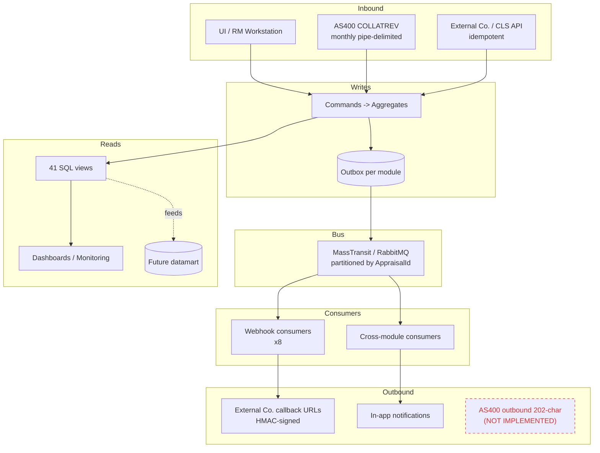
```mermaid
flowchart TB
    subgraph Inbound
        UI[UI / RM Workstation]
        AS400IN[AS400 COLLATREV<br/>monthly pipe-delimited]
        EXTIN[External Co. / CLS API<br/>idempotent]
    end

    subgraph Writes
        CMD[Commands -> Aggregates]
        OB[(Outbox per module)]
    end

    subgraph Bus
        MT[MassTransit / RabbitMQ<br/>partitioned by AppraisalId]
    end

    subgraph Consumers
        CON[Cross-module consumers]
        WHC[Webhook consumers<br/>x8]
    end

    subgraph Outbound
        EXTOUT[External Co. callback URLs<br/>HMAC-signed]
        NOT[In-app notifications]
        AS400OUT["AS400 outbound 202-char<br/>(NOT IMPLEMENTED)"]
    end

    subgraph Reads
        VIEWS[41 SQL views]
        DASH[Dashboards / Monitoring]
        MART[(Future datamart)]
    end

    UI --> CMD
    AS400IN --> CMD
    EXTIN --> CMD
    CMD --> OB
    OB --> MT
    MT --> CON
    MT --> WHC
    WHC --> EXTOUT
    CON --> NOT
    CMD --> VIEWS
    VIEWS --> DASH
    VIEWS -.feeds.-> MART

    classDef gap stroke-dasharray: 5 5,stroke:#d33,color:#d33
    class AS400OUT gap
```

---

## 6. Overview of Process Flow

### 6.1 End-to-end narrative

A typical happy-path appraisal:

1. **Intake** — RM (Request Maker) submits a Request. A Checker validates it (`appraisal-initiation-check`); on Route-Back, the Maker amends and resubmits.
2. **Birth of Appraisal** — workflow waits at `await-appraisal-created`; on creation, an `AppraisalCreatedIntegrationEvent` resumes the flow at `initial-routing`.
3. **Quotation (optional)** — Admin sends an RFQ; a quotation sub-workflow fans out tasks (`ext-collect-submissions`, `admin-review-submissions`, `rm-pick-winner`, `admin-finalize`); a winning company is selected.
4. **Assignment** — `appraisal-assignment` (admin) decides external vs internal. External path enters `ext-appraisal-assignment`; internal path goes via `company-selection` / `internal-followup-selection` then `int-appraisal-execution`.
5. **External path execution** — `ext-appraisal-execution` (48–72h) → `ext-appraisal-check` (48h) → `ext-appraisal-verification` (24h). All three are **external-company-owned**.
6. **Internal path execution** — `int-appraisal-execution` (72h) → `int-appraisal-check` (48h) → `int-appraisal-verification` (24h).
7. **Bank review (external path only)** — `appraisal-book-verification` is the **first bank-side touchpoint** for the external path. (External `ext-appraisal-check` and `ext-appraisal-verification` are NOT bank review.)
8. **Approval tier switch** — `approval-tier-switch` reads the facility limit:
   - ≤ 30M → `pending-approval` directly
   - \> 30M → `pending-meeting` (Meeting Secretary schedules) → `pending-approval` (committee votes by quorum/majority)
9. **Completion** — `workflow-completed` (or `workflow-rejected`). At completion, the `Appraisal` aggregate publishes status changes via the chokepoint event.
10. **Invoice eligibility** — driven by `AssignmentStatus.Verified | Completed` (see `vw_EligibleAssignments`); `Appraisal.Status` is decoupled from invoicing.
11. **Collateral engagement registration** — one `CollateralEngagement` per `AppraisalId`, anchored on the primary `IsMaster` group; cost-approach unit price / building cost copied from `PricingFinalValue`.

#### Side processes that may park on the main task

- **Document Followup** — parallel sub-process: while the appraiser continues, the maker uploads requested docs via `provide-additional-documents` (72h). The main human task **stays open as a pause point**; no `AwaitSignalActivity`. Workflow side-processes park on the task.
- **Route-back from any review activity** — re-enters the SAME meeting (not re-queued) when applicable.

### 6.2 The three workflow definitions

Authoritative source: `Modules/Workflow/Workflow/Workflow/Config/*.json`.

#### `appraisal-workflow` — main lifecycle

| Stage | Activity ID | Type |
| --- | --- | --- |
| Start | `start` | StartActivity |
| Intake | `appraisal-initiation-check` | TaskActivity |
| Intake (rework) | `appraisal-initiation` | TaskActivity |
| Async gate | `await-appraisal-created` | AwaitSignalActivity |
| Routing | `initial-routing` | RoutingActivity |
| Assignment | `appraisal-assignment` | TaskActivity |
| Internal routing | `company-selection` | CompanySelectionActivity |
| Internal routing | `internal-followup-selection` | InternalFollowupSelectionActivity |
| External path | `ext-appraisal-assignment` | TaskActivity |
| External path | `ext-appraisal-execution` | TaskActivity |
| External path | `ext-appraisal-check` | TaskActivity |
| External path | `ext-appraisal-verification` | TaskActivity |
| Bank review | `appraisal-book-verification` | TaskActivity |
| Internal path | `int-appraisal-execution` | TaskActivity |
| Internal path | `int-appraisal-check` | TaskActivity |
| Internal path | `int-appraisal-verification` | TaskActivity |
| Approval routing | `approval-tier-switch` | SwitchActivity |
| Approval | `pending-meeting` | MeetingActivity |
| Approval | `pending-approval` | ApprovalActivity |
| End | `workflow-completed` | EndActivity |
| End | `workflow-rejected` | EndActivity |

#### `quotation-workflow` — RFQ FanOut

| Activity ID | Type | Notes |
| --- | --- | --- |
| `start` | StartActivity | |
| `ext-collect-submissions` | **FanOutTaskActivity** | Per-company Maker→Checker→Submit/Decline |
| `admin-review-submissions` | TaskActivity | |
| `rm-pick-winner` | TaskActivity | |
| `admin-finalize` | TaskActivity | |
| `ext-respond-negotiation` | TaskActivity | |
| `finalized-end` | EndActivity | |
| `cancelled-end` | EndActivity | |

Spawned by `appraisal-assignment` when admin sends an RFQ.

#### `document-followup-workflow` — parallel sub-process

| Activity ID | Type |
| --- | --- |
| `start` | StartActivity |
| `provide-additional-documents` | TaskActivity |
| `workflow-completed` | EndActivity |

### 6.3 Status state machines

#### RequestStatus

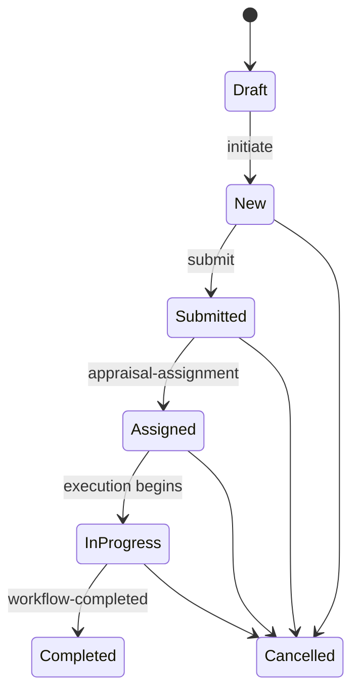
```mermaid
stateDiagram-v2
    [*] --> Draft
    Draft --> New : initiate
    New --> Submitted : submit
    Submitted --> Assigned : appraisal-assignment
    Assigned --> InProgress : execution begins
    InProgress --> Completed : workflow-completed
    Submitted --> Cancelled
    Assigned --> Cancelled
    InProgress --> Cancelled
    New --> Cancelled
```

#### AppraisalStatus (persisted, driven by `ActivityStatusMap`)

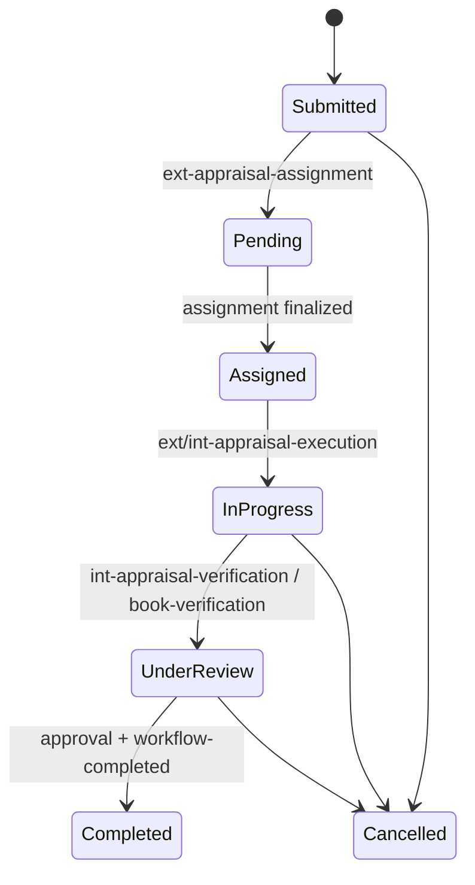
```mermaid
stateDiagram-v2
    [*] --> Submitted
    Submitted --> Pending : ext-appraisal-assignment
    Pending --> Assigned : assignment finalized
    Assigned --> InProgress : ext/int-appraisal-execution
    InProgress --> UnderReview : int-appraisal-verification / book-verification
    UnderReview --> Completed : approval + workflow-completed
    Submitted --> Cancelled
    InProgress --> Cancelled
    UnderReview --> Cancelled
```

#### AssignmentStatus (path-aware)

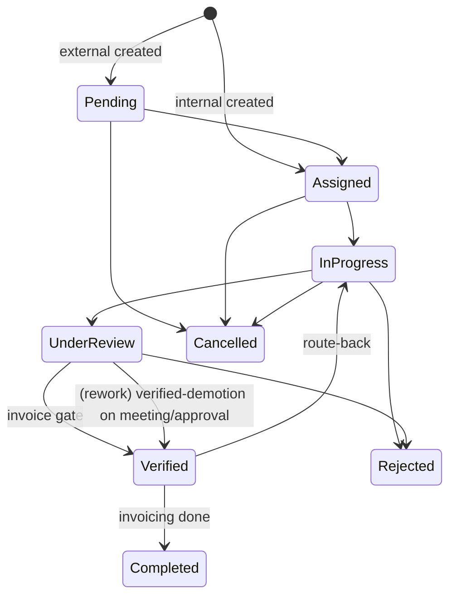
```mermaid
stateDiagram-v2
    [*] --> Pending : external created
    [*] --> Assigned : internal created
    Pending --> Assigned
    Assigned --> InProgress
    InProgress --> UnderReview
    UnderReview --> Verified : invoice gate
    Verified --> Completed : invoicing done
    InProgress --> Rejected
    UnderReview --> Rejected
    Pending --> Cancelled
    Assigned --> Cancelled
    InProgress --> Cancelled
    UnderReview --> Verified : (rework) verified-demotion on meeting/approval
    Verified --> InProgress : route-back
```

> Note: rework edges loop UnderReview/Verified back to InProgress; verified-demotion happens when an approved appraisal is sent back for book-verification.

#### MeetingStatus

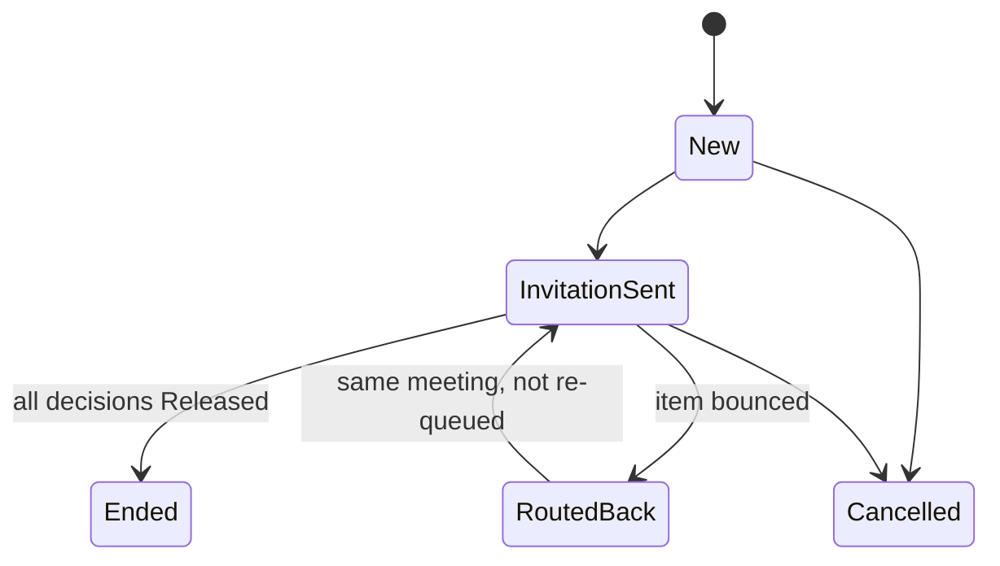
```mermaid
stateDiagram-v2
    [*] --> New
    New --> InvitationSent
    InvitationSent --> Ended : all decisions Released
    InvitationSent --> RoutedBack : item bounced
    RoutedBack --> InvitationSent : same meeting, not re-queued
    New --> Cancelled
    InvitationSent --> Cancelled
```

### 6.4 Swimlane

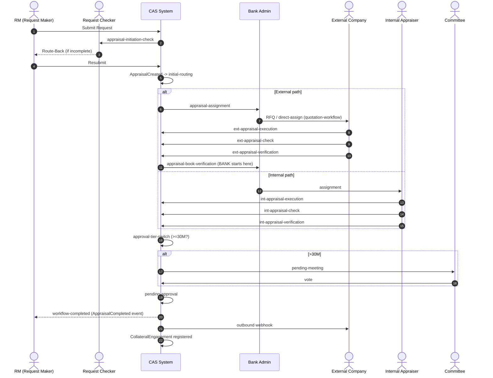
```mermaid
sequenceDiagram
    autonumber
    actor Maker as RM (Request Maker)
    actor Checker as Request Checker
    participant System as CAS System
    participant Admin as Bank Admin
    actor ExtCo as External Company
    actor IntAppr as Internal Appraiser
    actor Committee as Committee

    Maker->>System: Submit Request
    System->>Checker: appraisal-initiation-check
    Checker-->>Maker: Route-Back (if incomplete)
    Maker->>System: Resubmit
    System->>System: AppraisalCreated -> initial-routing
    alt External path
        System->>Admin: appraisal-assignment
        Admin->>ExtCo: RFQ / direct-assign (quotation-workflow)
        ExtCo->>System: ext-appraisal-execution
        ExtCo->>System: ext-appraisal-check
        ExtCo->>System: ext-appraisal-verification
        System->>Admin: appraisal-book-verification (BANK starts here)
    else Internal path
        Admin->>IntAppr: assignment
        IntAppr->>System: int-appraisal-execution
        IntAppr->>System: int-appraisal-check
        IntAppr->>System: int-appraisal-verification
    end
    System->>System: approval-tier-switch (>=30M?)
    alt >30M
        System->>Committee: pending-meeting
        Committee->>System: vote
    end
    System->>System: pending-approval
    System-->>Maker: workflow-completed (AppraisalCompleted event)
    System->>ExtCo: outbound webhook
    System->>System: CollateralEngagement registered
```

---

## 7. Integration Surface (Reference)

### 7.1 Inbound surface

- HTTP API (OpenIddict-protected) under `Bootstrapper/Api/Endpoints/`
- Inbound webhooks under `Modules/Integration` (resubmit-request, resubmit-documents, receive-result, etc.)
- AS400 file pickup via `IReappraisalFileSource` (local in dev, SFTP in UAT/prod)

### 7.2 Outbound surface

- 8 webhook consumer types (see [5.3.1](#531-webhooks-to-external-appraisal-companies-8-consumers))
- Notification module → UI inbox
- (Gap) AS400 outbound 202-char fixed-width file — not implemented

### 7.3 Internal bus

- MassTransit on RabbitMQ
- 41 integration event record types ([Appendix A](#a-integration-event-catalog))
- One partitioned endpoint (`webhook-dispatch`) keyed by `AppraisalId`

### 7.4 Webhook envelope (summary)

```json
{
  "eventId": "uuid",
  "eventType": "appraisal.completed",
  "occurredAt": "2026-05-28T03:14:15Z",
  "externalCaseKey": "EXT-CASE-123",
  "data": { /* event-specific payload — internal IDs are NOT included */ }
}
```

Signed by `HMAC-SHA256(secret, timestamp + body)` carried in `X-Signature`; subscriber identified by `WebhookSubscription.ExternalSystem` code.

### 7.5 AS400 file format (summary)

Authoritative spec lives in operations memory (`reference_as400_interface_specs.md`). High-level:
- **Inbound `Collateral Review Interface`** — pipe-delimited `|`, H/D/T records, record type first, 35 detail fields
- Detail fields include `ReviewType`, `CollateralId`, `SurveyNumber` (= our `AppraisalNumber`), `CifNumber`, valuation history
- **Outbound `AS400 Collateral Result`** — 202-char fixed-width (NOT YET IMPLEMENTED)

---

## 8. Operational Aspects

### 8.1 Hangfire recurring jobs (6 total)

All registered in `Bootstrapper/Api/Program.cs`:

| Job key | Implementation | Schedule | Purpose |
| --- | --- | --- | --- |
| `outbox-cleanup-request` | `OutboxCleanupJob<RequestDbContext>` | Daily 02:00 | Purge delivered outbox rows |
| `outbox-cleanup-appraisal` | `OutboxCleanupJob<AppraisalDbContext>` | Daily 02:00 | Purge delivered outbox rows |
| `outbox-cleanup-document` | `OutboxCleanupJob<DocumentDbContext>` | Daily 02:00 | Purge delivered outbox rows |
| `outbox-cleanup-workflow` | `OutboxCleanupJob<WorkflowDbContext>` | Daily 02:00 | Purge delivered outbox rows |
| `logs-cleanup` | `LogsCleanupJob` | Daily 03:00 | Batched DELETE of `common.Logs` rows older than 30 days |
| `reappraisal-as400` | `As400ReappraisalJob` | Monthly | Pull and parse AS400 COLLATREV file |

Dashboard at `/hangfire`; localhost-allowed in dev, otherwise blocked by `HangfireAuthorizationFilter` (proper auth is a TODO in the code).

### 8.2 Infrastructure topology

- **2× Windows IIS application servers** running CAS, behind a **bank-owned F5** virtual IP (LB changes need a network ticket — plan IIS/app-side knobs first)
- **1× SQL Server** (single instance; per-module schemas)
- **1× Redis** (cache only)
- Scale-out features should treat the application tier as N=2 replicas (e.g. distributed locks needed for any singleton job logic)
- UAT URL `w2apsuho1v1cas:7111` is the **LB VIP**, not a direct IIS hostname (same pattern for sit/sit2)

### 8.3 Auditing & soft-delete

- Every entity carries `CreatedOn / CreatedBy / UpdatedOn / UpdatedBy` via the EF interceptor pipeline
- `IsDeleted` + global query filter is the soft-delete primitive
- Spatial column `GeoPoint AS geography::Point(Lat, Lon, 4326)` is persisted-computed; spatial indexes `IX_*AppraisalDetails_GeoPoint` already exist

### 8.4 Observability

- Structured logging via **Serilog** with two sinks: **Seq** (operations dashboard) and **`common.Logs`** SQL sink (in-app log search; 30-day retention)
- Correlation IDs flow through MediatR pipeline behaviors

---

## 9. Datamart Implications

> Brief — not a design. Things a mart designer needs to know **before** drawing facts and dimensions.

### 9.1 Strongest grain candidates

| Grain | Natural row | Source backbone |
| --- | --- | --- |
| **One row per Appraisal** | the appraisal lifecycle | `appraisal.Appraisals` + `vw_AppraisalList` |
| **One row per AppraisalAssignment** | per assignment-cycle | `appraisal.AppraisalAssignments` + `vw_AssignmentList` (note: `SubmittedAt` overwritten on rework — preserve history via `WorkflowActivityExecution` if you want every cycle) |
| **One row per Workflow Activity Transition** | per state hop | `workflow.WorkflowActivityExecutions` — the most granular, mart-friendly grain for SLA / cycle-time analytics |
| **One row per Webhook Delivery** | per outbound attempt | `integration.WebhookDeliveries` — for vendor responsiveness reporting |
| **One row per Pricing Approach Method** | per pricing decision | `PricingAnalysis` tree — caution: per-property values exist only under cost approach |

### 9.2 Natural dimensions

- **Date** (intake, appointment, submitted, completed, approved, invoiced)
- **User** (`auth.AspNetUsers`) — internal staff and external company users
- **Company** (`auth.Companies`) — external appraisal vendors
- **Branch / Region** (from Request's Address / customer attributes)
- **ProjectType** (`Condo` / `LandAndBuilding` / `Land`)
- **CollateralType / PropertyType** (use `AppraisalProperties.PropertyType` codes; Leasehold splits across `[LSL, LSB, LS]`)
- **ActivityId** (workflow activity dimension)
- **Status** (Request / Appraisal / Assignment / Meeting / WorkflowExecution — all string-coded enums)
- **SLA policy** (resolved per-activity)
- **Committee / Approval tier**

### 9.3 Pre-aggregated source candidates

These can either **feed** the mart directly or be **superseded** by mart facts. Either is reasonable.

- `common.vw_DailyAppraisalCountsFromSource` — daily counts by company
- `common.vw_CompanyAppraisalSummariesFromSource` — per-company rollups
- `workflow.vw_SlaComplianceSummary` / `vw_WorkflowSlaSummary` — SLA roll-ups
- `appraisal.vw_EligibleAssignments` — invoice-eligibility (Verified/Completed gate)

### 9.4 Warnings — known gotchas to surface in the mart's data dictionary

| Gotcha | Why it matters for a mart |
| --- | --- |
| `PricingInfo` is **group-shared**, not per-property | If a fact is at building-row grain, joining `PricingInfo` columns **duplicates** the group total. Aggregate at the pricing-group level instead. |
| History Search pin is by **Appraisal**, not `CollateralMaster` | Map-based / spatial facts should denormalize from appraisal lat/lon (`vw_AppraisalDetails` lat/lon) not from collateral master tables. |
| External companies see **only** their own `MarketComparables` and other rows | If the mart serves external users, replicate the visibility filter (`CreatedByCompanyId`). Asymmetric is by design (green pins internal-only, blue pins per-company). |
| `Appraisals.Status` is **authoritative** | Do not re-derive status via CASE statements from view columns. Hydrate from the column. |
| Field naming: `SurveyNumber` not `SurveyNo` | Cross-system reconciliation with AS400 uses this exact key. |
| `aa.SubmittedAt` is **overwritten** on rework | Cycle-time analytics across multiple submissions need `WorkflowActivityExecutions`, not `AppraisalAssignments`. |
| `AssignmentStatus.Verified` is the **invoice gate**, not `Completed` | A "completed appraisals" count and an "invoice-eligible" count are different things. |
| Routeback **reuses** the same `AppraisalAssignment` row | Count rework via `WorkflowActivityExecution` movements, not via assignment-row counts. |
| Workflow `Variables` is JSON | Do not `JSON_VALUE(...)` in views. Promoted columns (e.g. `PendingTask.CommitteeCode`) exist for the values you'll need. |
| Internal→external value mapping lives in **Integration**, not in the source | If a mart needs the external-facing value (e.g. for reconciliation with vendor systems), copy the mapping from Integration module — don't reinvent. |
| `ext-appraisal-check` / `ext-appraisal-verification` are **external-company-owned**, not bank review | Bank review starts at `appraisal-book-verification`. SLA decompositions must reflect this. |
| AS400 outbound 202-char file is **not implemented** | Any "outbound to AS400" KPI is currently undefined. |

---

## 10. Appendices

### A. Integration event catalog

41 record types live across the modules (plus 1 base `IntegrationEvent` record).

| # | Event | Likely source | Notable consumers |
| --- | --- | --- | --- |
| 1 | `RequestCreatedIntegrationEvent` | Request | Notification |
| 2 | `RequestSubmittedIntegrationEvent` | Request | Workflow (`RequestSubmittedIntegrationEventConsumer`) |
| 3 | `RequestResubmittedIntegrationEvent` | Request | Workflow (`RequestResubmittedIntegrationEventConsumer`) |
| 4 | `AppraisalCreationRequestedIntegrationEvent` | Workflow / Request | Appraisal |
| 5 | `AppraisalCreatedIntegrationEvent` | Appraisal | Workflow (`AppraisalCreatedIntegrationEventConsumer`), Notification |
| 6 | `AppraisalAcknowledgedIntegrationEvent` | Appraisal | Appraisal handler (downstream lock) |
| 7 | `AppraisalActivityTransitionedIntegrationEvent` | Workflow | Appraisal |
| 8 | `AppraisalAddedToQuotationIntegrationEvent` | Appraisal | — |
| 9 | `AppraisalRemovedFromQuotationIntegrationEvent` | Appraisal | — |
| 10 | `AppraisalApprovedIntegrationEvent` | Appraisal | Workflow.Meetings (ack consumer) |
| 11 | `AppraisalCompletedIntegrationEvent` | Appraisal | Request, outbound webhook consumer |
| 12 | `AppraisalCancelIntegrationEvent` | Appraisal | Outbound webhook consumer |
| 13 | `AppraisalStatusChangedIntegrationEvent` | Appraisal | (partitioned) outbound webhooks |
| 14 | `WorkflowTransitionedIntegrationEvent` | Workflow | Appraisal (`WorkflowTransitionedIntegrationEventHandler` — the chokepoint) |
| 15 | `TransitionCompletedIntegrationEvent` | Workflow | Notification |
| 16 | `TaskAssignedIntegrationEvent` | Workflow | Notification |
| 17 | `TaskStartedIntegrationEvent` | Workflow | — |
| 18 | `TaskClaimedIntegrationEvent` | Workflow | — |
| 19 | `TaskCompletedIntegrationEvent` | Workflow | Notification |
| 20 | `SlaBreachIntegrationEvent` | Workflow | Notification (SLA breach) |
| 21 | `CompanyAssignedIntegrationEvent` | Appraisal / Workflow | Appraisal, Notification |
| 22 | `InternalAssignedIntegrationEvent` | Appraisal / Workflow | Appraisal, Notification |
| 23 | `InternalFollowupAssignedIntegrationEvent` | Appraisal | Appraisal handler |
| 24 | `QuotationStartedIntegrationEvent` | Appraisal (Quotation) | Workflow (`QuotationStartedIntegrationEventConsumer`) |
| 25 | `QuotationWorkflowResumeIntegrationEvent` | Workflow | Workflow (`QuotationWorkflowResumeIntegrationEventConsumer`) |
| 26 | `QuotationReadyIntegrationEvent` | Appraisal | Outbound webhook consumer |
| 27 | `QuotationFinalizedIntegrationEvent` | Appraisal | Outbound webhook consumer |
| 28 | `QuotationCancelledIntegrationEvent` | Appraisal | Outbound webhook consumer |
| 29 | `QuotationSubmissionsClosedIntegrationEvent` | Appraisal / Workflow | — |
| 30 | `QuotationCutOffTimePassedIntegrationEvent` | Workflow | Workflow (`QuotationCutOffTimePassedIntegrationEventConsumer`) |
| 31 | `QuotationCompaniesAutoExpiredIntegrationEvent` | Workflow / Appraisal | Appraisal handler |
| 32 | `QuotationInvitationDeclinedIntegrationEvent` | Appraisal | — |
| 33 | `ShortlistSentToRmIntegrationEvent` | Appraisal | — |
| 34 | `TentativeWinnerPickedIntegrationEvent` | Appraisal | — |
| 35 | `DocumentLinkedIntegrationEvent` | Document | Request (`DocumentLinkedEventHandler`) |
| 36 | `DocumentUnlinkedIntegrationEvent` | Document | Document handler |
| 37 | `DocumentUpdatedIntegrationEvent` | Document | Document handler |
| 38 | `DocumentFollowupRequiredIntegrationEvent` | Workflow / Appraisal | Outbound webhook consumer |
| 39 | `DocumentFollowupNotificationIntegrationEvent` | Notification | Notification handler |
| 40 | `SessionCompletedIntegrationEvent` | Document | Document handler |
| 41 | `ExternalAppraisalReturnedIntegrationEvent` | Integration | — |

(Source-and-consumer entries marked "—" exist but their primary consumer is internal-only or async fanout; trace via `Modules/<Module>/.../EventHandlers/*` for authoritative wiring.)

### B. View inventory (41 views)

See [§4.2](#42-read-side-views-41-total-in-databasescriptsviews) — listed there with one-line purposes.

### C. Module-to-schema mapping

| Module | Schema | DbContext |
| --- | --- | --- |
| Request | `request` | `RequestDbContext` |
| Appraisal | `appraisal` | `AppraisalDbContext` |
| Workflow | `workflow` | `WorkflowDbContext` |
| Collateral | `collateral` | `CollateralDbContext` |
| Document | `document` | `DocumentDbContext` |
| Integration | `integration` | `IntegrationDbContext` |
| Notification | `notification` | `NotificationDbContext` |
| Parameter | `parameter` | `ParameterDbContext` |
| Auth | `auth` | `AuthDbContext` |
| Common | `common` | `CommonDbContext` |
| Assignment | (folded into appraisal) | — |

Hangfire occupies the `hangfire` schema. ASP.NET DataProtection keys live under `auth`.

### D. Glossary

| Term | Meaning |
| --- | --- |
| **Appraisal** | The unit of work that produces a valuation for a collateral; aggregate root in the Appraisal module. |
| **Appraisal Number** | Sequential identifier; the join key with AS400 (= `SurveyNumber` in AS400 messages). |
| **Appraisal Assignment** | A specific assignee-cycle on an Appraisal (external company or internal staff). Path-aware lifecycle (Pending/Assigned…Verified/Completed). |
| **Engagement** (CollateralEngagement) | A registered "this Appraisal valued this CollateralMaster" record; one per `AppraisalId`, anchored on the primary `IsMaster` group. |
| **CollateralMaster** | The bank's master record of a piece of collateral (independent of any particular appraisal). |
| **Pricing Analysis** | The Appraisal-bound tree of approaches (Sales / Cost / Income / Hypothesis / Leasehold), methods, and per-property pricing. Group-shared. |
| **Approach / Method** | Pricing taxonomy: an approach (e.g. Sales Comparison) contains methods (e.g. WQS), each linked to comparables and to properties. |
| **MarketComparable** | A reference data point used in comparison-based pricing; visibility scoped by `CreatedByCompanyId`. |
| **Committee** (Workflow) | A standing committee that approves/declines appraisals via meetings. |
| **Meeting** | A scheduled committee session containing decision items; status drives the lifecycle. |
| **Quotation (RFQ)** | A sub-process to collect competitive fees from multiple external companies before assignment. |
| **Document Followup** | A parallel sub-process for requesting additional documents from the maker while appraisal continues. |
| **Routeback** | Sending a task back to its previous owner / previous step; reuses the same assignment row. |
| **Book Verification** | The first bank-side review activity on the external path (`appraisal-book-verification`). |
| **Approval Tier Switch** | The decision that routes appraisals ≤30M directly to approval and >30M through a committee meeting. |
| **External Case Key** | The external company's identifier for the case; the field bank-facing outbound DTOs key on (we don't expect them to echo our internal IDs). |
| **Outbox / Inbox** | Persisted message tables for guaranteed-delivery and idempotent reception across modules. |
| **Partitioned dispatch** | MassTransit pattern keeping per-`AppraisalId` ordering on the `webhook-dispatch` endpoint. |
| **SLA Policy** | Time-bound activity expectations resolved per destination activity (Stage-scope). |

### E. References

- `MEMORY.md` (auto-memory index for this codebase) — collects project context that's not derivable from code
- `docs/cas-data-model.md`, `docs/data-model.md` — existing data-model docs
- `docs/ADVANCED_WORKFLOW_ENGINE_GUIDE.md`, `docs/WORKFLOW-ARCHITECTURE.md`, `docs/WORKFLOW-DEVELOPER-GUIDE.md` — workflow engine deep dives
- `docs/DDD.md` — DDD patterns used here
- `Modules/Workflow/Workflow/Workflow/Config/appraisal-workflow.json` — authoritative workflow definition
- `Modules/Appraisal/Appraisal/Application/EventHandlers/WorkflowTransitionedIntegrationEventHandler.cs` — the status-mapping chokepoint
- `Bootstrapper/Api/Program.cs` (around `RecurringJob.AddOrUpdate`) — Hangfire job registrations
- `Database/Scripts/Views/**/*.sql` — the full read-side catalog

---

*End of discovery document. Follow-up exercise: design the datamart (grain, conformed dimensions, ETL boundary).*

---


---

## ER Diagrams

> Inferred from EF `HasOne`/`HasForeignKey` declarations in the model snapshots. **Cross-module relationships are intentionally event-driven, not FK-enforced** — the high-level diagram below shows the message-bus relationships, not foreign keys. Large modules (Appraisal, Workflow) are split into multiple sub-diagrams by subdomain so they remain legible.

### Cross-module map (event-driven)

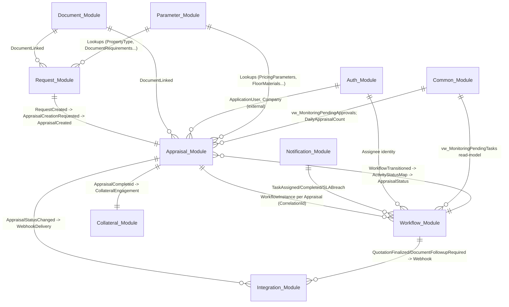
```mermaid
erDiagram
  Request_Module ||--|| Appraisal_Module : "RequestCreated -> AppraisalCreationRequested -> AppraisalCreated"
  Appraisal_Module ||--o{ Workflow_Module : "WorkflowInstance per Appraisal (CorrelationId)"
  Workflow_Module ||--o{ Appraisal_Module : "WorkflowTransitioned -> ActivityStatusMap -> AppraisalStatus"
  Appraisal_Module ||--|| Collateral_Module : "AppraisalCompleted -> CollateralEngagement"
  Document_Module ||--o{ Request_Module : "DocumentLinked"
  Document_Module ||--o{ Appraisal_Module : "DocumentLinked"
  Appraisal_Module ||--o{ Integration_Module : "AppraisalStatusChanged -> WebhookDelivery"
  Workflow_Module ||--o{ Integration_Module : "QuotationFinalized/DocumentFollowupRequired -> Webhook"
  Notification_Module ||--o{ Workflow_Module : "TaskAssigned/Completed/SLABreach"
  Auth_Module ||--o{ Appraisal_Module : "ApplicationUser, Company (external)"
  Auth_Module ||--o{ Workflow_Module : "Assignee identity"
  Parameter_Module ||--o{ Appraisal_Module : "Lookups (PricingParameters, FloorMaterials...)"
  Parameter_Module ||--o{ Request_Module : "Lookups (PropertyType, DocumentRequirements...)"
  Common_Module ||--o{ Workflow_Module : "vw_MonitoringPendingTasks read-model"
  Common_Module ||--o{ Appraisal_Module : "vw_MonitoringPendingApprovals; DailyAppraisalCount"
```

### Request


```mermaid
---
title: Request
---
erDiagram
  ReappraisalCandidates {
    uniqueidentifier Id PK
    nvarchar AoCode
    nvarchar AoName
    nvarchar ApplicationNumber
    nvarchar BusinessSize
    nvarchar BusinessSizeDesc
    nvarchar CarCode
    nvarchar more_36_columns
  }
  RequestComments {
    uniqueidentifier Id PK
    nvarchar Comment
    datetime2 CommentedAt
    nvarchar CommentedBy
    nvarchar CommentedByName
    datetime2 CreatedAt
    nvarchar CreatedBy
    nvarchar more_6_columns
  }
  RequestTitles {
    uniqueidentifier Id PK
    bit CollateralStatus
    nvarchar CollateralType
    datetime2 CreatedAt
    nvarchar CreatedBy
    nvarchar CreatedWorkstation
    nvarchar Notes
    nvarchar more_26_columns
  }
  Requests {
    uniqueidentifier Id PK
    nvarchar AppraisalGroupNumber
    nvarchar Channel
    datetime2 CompletedAt
    datetime2 CreatedAt
    nvarchar CreatedBy
    nvarchar CreatedWorkstation
    nvarchar more_22_columns
  }
  BackgroundServiceLease {
    nvarchar Id PK
    datetime2 AcquiredAt
    nvarchar InstanceId
    datetime2 LeasedUntil
  }
  InboxMessage {
    uniqueidentifier MessageId PK
    nvarchar ConsumerType PK
    datetime2 ProcessedAt
    datetime2 StartedAt
    nvarchar Status
  }
  IntegrationEventOutbox {
    uniqueidentifier Id PK
    nvarchar CorrelationId
    nvarchar Error
    nvarchar EventType
    nvarchar Headers
    datetime2 OccurredAt
    nvarchar Payload
    nvarchar more_3_columns
  }
  RequestTitleDocuments {
    uniqueidentifier Id PK
    datetime2 CreatedAt
    nvarchar CreatedBy
    nvarchar CreatedWorkstation
    uniqueidentifier DocumentId
    nvarchar DocumentType
    nvarchar FileName
    nvarchar more_13_columns
  }
  RequestCustomers {
    bigint Id PK
    nvarchar ContactNumber
    nvarchar Name
    uniqueidentifier RequestId
  }
  RequestDetails {
    uniqueidentifier RequestId PK
    bit HasAppraisalBook
    datetime2 PrevAppraisalDate
    uniqueidentifier PrevAppraisalId
    nvarchar PrevAppraisalNumber
    decimal PrevAppraisalValue
    uniqueidentifier Appointment_RequestDetailRequestId
    nvarchar more_27_columns
  }
  RequestDocuments {
    uniqueidentifier Id PK
    datetime2 CreatedAt
    nvarchar CreatedBy
    nvarchar CreatedWorkstation
    uniqueidentifier DocumentId
    nvarchar DocumentType
    nvarchar FileName
    nvarchar more_13_columns
  }
  RequestProperties {
    bigint Id PK
    nvarchar BuildingType
    nvarchar PropertyType
    uniqueidentifier RequestId
    decimal SellingPrice
  }
  RequestTitles ||--o{ RequestTitleDocuments : "owns:Documents"
  Requests ||--o{ RequestCustomers : "owns:Customers"
  Requests ||--|| RequestDetails : "owns:Detail"
  Requests ||--o{ RequestDocuments : "owns:Documents"
  Requests ||--o{ RequestProperties : "owns:Properties"
```


### Appraisal

#### Appraisal — Core  _(7 tables)_

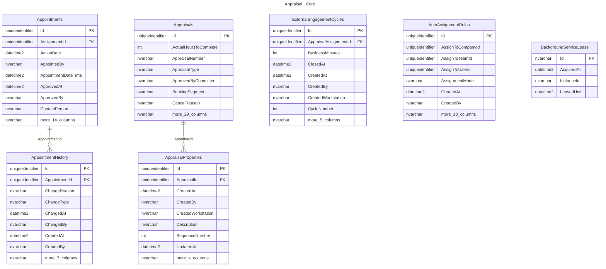
```mermaid
---
title: Appraisal · Core
---
erDiagram
  Appointments {
    uniqueidentifier Id PK
    uniqueidentifier AssignmentId FK
    datetime2 ActionDate
    nvarchar AppointedBy
    datetime2 AppointmentDateTime
    datetime2 ApprovedAt
    nvarchar ApprovedBy
    nvarchar ContactPerson
    nvarchar more_14_columns
  }
  AppointmentHistory {
    uniqueidentifier Id PK
    uniqueidentifier AppointmentId FK
    nvarchar ChangeReason
    nvarchar ChangeType
    datetime2 ChangedAt
    nvarchar ChangedBy
    datetime2 CreatedAt
    nvarchar CreatedBy
    nvarchar more_7_columns
  }
  Appraisals {
    uniqueidentifier Id PK
    int ActualHoursToComplete
    nvarchar AppraisalNumber
    nvarchar AppraisalType
    nvarchar ApprovedByCommittee
    nvarchar BankingSegment
    nvarchar CancelReason
    nvarchar more_29_columns
  }
  AppraisalProperties {
    uniqueidentifier Id PK
    uniqueidentifier AppraisalId FK
    datetime2 CreatedAt
    nvarchar CreatedBy
    nvarchar CreatedWorkstation
    nvarchar Description
    int SequenceNumber
    datetime2 UpdatedAt
    nvarchar more_4_columns
  }
  ExternalEngagementCycles {
    uniqueidentifier Id PK
    uniqueidentifier AppraisalAssignmentId FK
    int BusinessMinutes
    datetime2 ClosedAt
    datetime2 CreatedAt
    nvarchar CreatedBy
    nvarchar CreatedWorkstation
    int CycleNumber
    nvarchar more_5_columns
  }
  AutoAssignmentRules {
    uniqueidentifier Id PK
    uniqueidentifier AssignToCompanyId
    uniqueidentifier AssignToTeamId
    uniqueidentifier AssignToUserId
    nvarchar AssignmentMode
    datetime2 CreatedAt
    nvarchar CreatedBy
    nvarchar more_13_columns
  }
  BackgroundServiceLease {
    nvarchar Id PK
    datetime2 AcquiredAt
    nvarchar InstanceId
    datetime2 LeasedUntil
  }
  Appointments ||--o{ AppointmentHistory : "AppointmentId"
  Appraisals ||--o{ AppraisalProperties : "AppraisalId"
```

#### Appraisal — Assignment-Fee-Review  _(8 tables)_

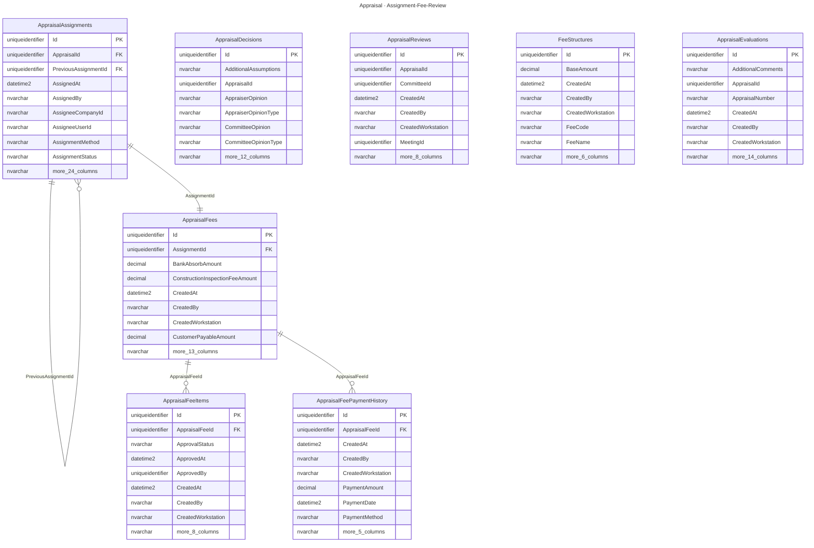
```mermaid
---
title: Appraisal · Assignment-Fee-Review
---
erDiagram
  AppraisalAssignments {
    uniqueidentifier Id PK
    uniqueidentifier AppraisalId FK
    uniqueidentifier PreviousAssignmentId FK
    datetime2 AssignedAt
    nvarchar AssignedBy
    nvarchar AssigneeCompanyId
    nvarchar AssigneeUserId
    nvarchar AssignmentMethod
    nvarchar AssignmentStatus
    nvarchar more_24_columns
  }
  AppraisalDecisions {
    uniqueidentifier Id PK
    nvarchar AdditionalAssumptions
    uniqueidentifier AppraisalId
    nvarchar AppraiserOpinion
    nvarchar AppraiserOpinionType
    nvarchar CommitteeOpinion
    nvarchar CommitteeOpinionType
    nvarchar more_12_columns
  }
  AppraisalFees {
    uniqueidentifier Id PK
    uniqueidentifier AssignmentId FK
    decimal BankAbsorbAmount
    decimal ConstructionInspectionFeeAmount
    datetime2 CreatedAt
    nvarchar CreatedBy
    nvarchar CreatedWorkstation
    decimal CustomerPayableAmount
    nvarchar more_13_columns
  }
  AppraisalFeeItems {
    uniqueidentifier Id PK
    uniqueidentifier AppraisalFeeId FK
    nvarchar ApprovalStatus
    datetime2 ApprovedAt
    uniqueidentifier ApprovedBy
    datetime2 CreatedAt
    nvarchar CreatedBy
    nvarchar CreatedWorkstation
    nvarchar more_8_columns
  }
  AppraisalFeePaymentHistory {
    uniqueidentifier Id PK
    uniqueidentifier AppraisalFeeId FK
    datetime2 CreatedAt
    nvarchar CreatedBy
    nvarchar CreatedWorkstation
    decimal PaymentAmount
    datetime2 PaymentDate
    nvarchar PaymentMethod
    nvarchar more_5_columns
  }
  AppraisalReviews {
    uniqueidentifier Id PK
    uniqueidentifier AppraisalId
    uniqueidentifier CommitteeId
    datetime2 CreatedAt
    nvarchar CreatedBy
    nvarchar CreatedWorkstation
    uniqueidentifier MeetingId
    nvarchar more_8_columns
  }
  FeeStructures {
    uniqueidentifier Id PK
    decimal BaseAmount
    datetime2 CreatedAt
    nvarchar CreatedBy
    nvarchar CreatedWorkstation
    nvarchar FeeCode
    nvarchar FeeName
    nvarchar more_6_columns
  }
  AppraisalEvaluations {
    uniqueidentifier Id PK
    nvarchar AdditionalComments
    uniqueidentifier AppraisalId
    nvarchar AppraisalNumber
    datetime2 CreatedAt
    nvarchar CreatedBy
    nvarchar CreatedWorkstation
    nvarchar more_14_columns
  }
  AppraisalAssignments ||--o{ AppraisalAssignments : "PreviousAssignmentId"
  AppraisalAssignments ||--|| AppraisalFees : "AssignmentId"
  AppraisalFees ||--o{ AppraisalFeeItems : "AppraisalFeeId"
  AppraisalFees ||--o{ AppraisalFeePaymentHistory : "AppraisalFeeId"
```

#### Appraisal — Committee  _(5 tables)_

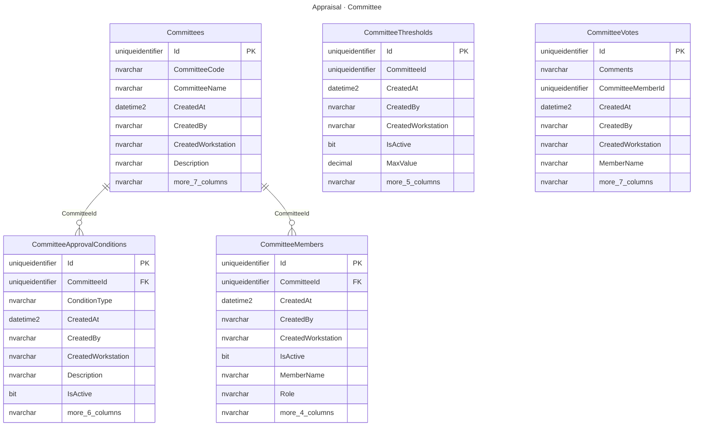
```mermaid
---
title: Appraisal · Committee
---
erDiagram
  Committees {
    uniqueidentifier Id PK
    nvarchar CommitteeCode
    nvarchar CommitteeName
    datetime2 CreatedAt
    nvarchar CreatedBy
    nvarchar CreatedWorkstation
    nvarchar Description
    nvarchar more_7_columns
  }
  CommitteeApprovalConditions {
    uniqueidentifier Id PK
    uniqueidentifier CommitteeId FK
    nvarchar ConditionType
    datetime2 CreatedAt
    nvarchar CreatedBy
    nvarchar CreatedWorkstation
    nvarchar Description
    bit IsActive
    nvarchar more_6_columns
  }
  CommitteeMembers {
    uniqueidentifier Id PK
    uniqueidentifier CommitteeId FK
    datetime2 CreatedAt
    nvarchar CreatedBy
    nvarchar CreatedWorkstation
    bit IsActive
    nvarchar MemberName
    nvarchar Role
    nvarchar more_4_columns
  }
  CommitteeThresholds {
    uniqueidentifier Id PK
    uniqueidentifier CommitteeId
    datetime2 CreatedAt
    nvarchar CreatedBy
    nvarchar CreatedWorkstation
    bit IsActive
    decimal MaxValue
    nvarchar more_5_columns
  }
  CommitteeVotes {
    uniqueidentifier Id PK
    nvarchar Comments
    uniqueidentifier CommitteeMemberId
    datetime2 CreatedAt
    nvarchar CreatedBy
    nvarchar CreatedWorkstation
    nvarchar MemberName
    nvarchar more_7_columns
  }
  Committees ||--o{ CommitteeApprovalConditions : "CommitteeId"
  Committees ||--o{ CommitteeMembers : "CommitteeId"
```

#### Appraisal — Quotation  _(7 tables)_

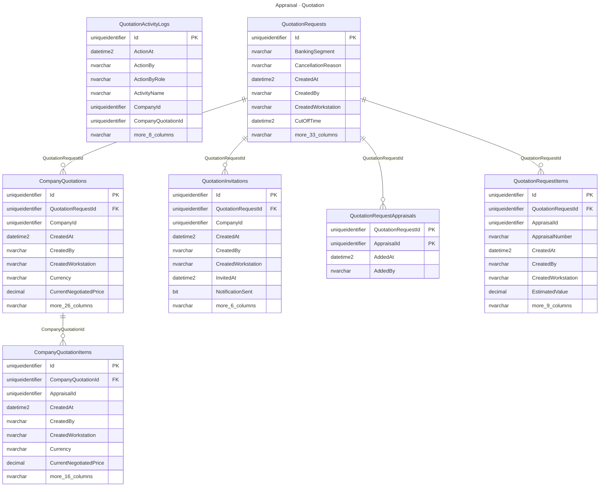
```mermaid
---
title: Appraisal · Quotation
---
erDiagram
  CompanyQuotations {
    uniqueidentifier Id PK
    uniqueidentifier QuotationRequestId FK
    uniqueidentifier CompanyId
    datetime2 CreatedAt
    nvarchar CreatedBy
    nvarchar CreatedWorkstation
    nvarchar Currency
    decimal CurrentNegotiatedPrice
    nvarchar more_26_columns
  }
  CompanyQuotationItems {
    uniqueidentifier Id PK
    uniqueidentifier CompanyQuotationId FK
    uniqueidentifier AppraisalId
    datetime2 CreatedAt
    nvarchar CreatedBy
    nvarchar CreatedWorkstation
    nvarchar Currency
    decimal CurrentNegotiatedPrice
    nvarchar more_16_columns
  }
  QuotationActivityLogs {
    uniqueidentifier Id PK
    datetime2 ActionAt
    nvarchar ActionBy
    nvarchar ActionByRole
    nvarchar ActivityName
    uniqueidentifier CompanyId
    uniqueidentifier CompanyQuotationId
    nvarchar more_8_columns
  }
  QuotationInvitations {
    uniqueidentifier Id PK
    uniqueidentifier QuotationRequestId FK
    uniqueidentifier CompanyId
    datetime2 CreatedAt
    nvarchar CreatedBy
    nvarchar CreatedWorkstation
    datetime2 InvitedAt
    bit NotificationSent
    nvarchar more_6_columns
  }
  QuotationRequests {
    uniqueidentifier Id PK
    nvarchar BankingSegment
    nvarchar CancellationReason
    datetime2 CreatedAt
    nvarchar CreatedBy
    nvarchar CreatedWorkstation
    datetime2 CutOffTime
    nvarchar more_33_columns
  }
  QuotationRequestAppraisals {
    uniqueidentifier QuotationRequestId PK
    uniqueidentifier AppraisalId PK
    datetime2 AddedAt
    nvarchar AddedBy
  }
  QuotationRequestItems {
    uniqueidentifier Id PK
    uniqueidentifier QuotationRequestId FK
    uniqueidentifier AppraisalId
    nvarchar AppraisalNumber
    datetime2 CreatedAt
    nvarchar CreatedBy
    nvarchar CreatedWorkstation
    decimal EstimatedValue
    nvarchar more_9_columns
  }
  QuotationRequests ||--o{ CompanyQuotations : "QuotationRequestId"
  CompanyQuotations ||--o{ CompanyQuotationItems : "CompanyQuotationId"
  QuotationRequests ||--o{ QuotationInvitations : "QuotationRequestId"
  QuotationRequests ||--o{ QuotationRequestAppraisals : "QuotationRequestId"
  QuotationRequests ||--o{ QuotationRequestItems : "QuotationRequestId"
```

#### Appraisal — Pricing-Analysis  _(23 tables)_


```mermaid
---
title: Appraisal · Pricing-Analysis
---
erDiagram
  AdjustmentTypeLookups {
    uniqueidentifier Id PK
    nvarchar AdjustmentCategory
    nvarchar AdjustmentType
    nvarchar ApplicablePropertyTypes
    datetime2 CreatedAt
    nvarchar CreatedBy
    nvarchar CreatedWorkstation
    nvarchar more_8_columns
  }
  AppraisalComparables {
    uniqueidentifier Id PK
    decimal AdjustedPricePerUnit
    uniqueidentifier AppraisalId
    datetime2 CreatedAt
    nvarchar CreatedBy
    nvarchar CreatedWorkstation
    uniqueidentifier MarketComparableId
    nvarchar more_10_columns
  }
  ComparableAdjustments {
    uniqueidentifier Id PK
    uniqueidentifier AppraisalComparableId FK
    nvarchar AdjustmentCategory
    nvarchar AdjustmentDirection
    decimal AdjustmentPercent
    nvarchar AdjustmentType
    nvarchar ComparableValue
    datetime2 CreatedAt
    nvarchar more_7_columns
  }
  GroupValuations {
    uniqueidentifier Id PK
    uniqueidentifier ValuationAnalysisId FK
    decimal AppraisedValue
    datetime2 CreatedAt
    nvarchar CreatedBy
    nvarchar CreatedWorkstation
    decimal ForcedSaleValue
    decimal MarketValue
    nvarchar more_8_columns
  }
  PricingAnalysisApproaches {
    uniqueidentifier Id PK
    uniqueidentifier PricingAnalysisId FK
    nvarchar ApproachType
    decimal ApproachValue
    datetime2 CreatedAt
    nvarchar CreatedBy
    nvarchar CreatedWorkstation
    bit IsSelected
    nvarchar more_3_columns
  }
  PricingAnalysisMethods {
    uniqueidentifier Id PK
    uniqueidentifier ApproachId FK
    uniqueidentifier ComparativeAnalysisTemplateId FK
    datetime2 CreatedAt
    nvarchar CreatedBy
    nvarchar CreatedWorkstation
    bit IsSelected
    nvarchar MethodType
    decimal MethodValue
    nvarchar more_6_columns
  }
  PricingCalculations {
    uniqueidentifier Id PK
    uniqueidentifier PricingMethodId FK
    decimal AdjustOfferPriceAmt
    decimal AdjustOfferPricePct
    decimal AdjustedPeriodPct
    decimal BuildingValueAdjustment
    int BuySellMonth
    int BuySellYear
    nvarchar more_24_columns
  }
  PricingComparableLinks {
    uniqueidentifier Id PK
    uniqueidentifier PricingMethodId FK
    datetime2 CreatedAt
    nvarchar CreatedBy
    nvarchar CreatedWorkstation
    int DisplaySequence
    uniqueidentifier MarketComparableId
    datetime2 UpdatedAt
    nvarchar more_2_columns
  }
  PricingComparativeFactors {
    uniqueidentifier Id PK
    uniqueidentifier PricingMethodId FK
    datetime2 CreatedAt
    nvarchar CreatedBy
    nvarchar CreatedWorkstation
    int DisplaySequence
    uniqueidentifier FactorId
    bit IsSelectedForScoring
    nvarchar more_4_columns
  }
  PricingFactorScores {
    uniqueidentifier Id PK
    uniqueidentifier PricingMethodId FK
    decimal AdjustmentAmt
    decimal AdjustmentPct
    nvarchar ComparisonResult
    datetime2 CreatedAt
    nvarchar CreatedBy
    nvarchar CreatedWorkstation
    nvarchar more_12_columns
  }
  PricingFinalValues {
    uniqueidentifier Id PK
    uniqueidentifier PricingMethodId FK
    decimal AppraisalPrice
    decimal BuildingCost
    datetime2 CreatedAt
    nvarchar CreatedBy
    nvarchar CreatedWorkstation
    decimal FinalValue
    nvarchar more_9_columns
  }
  PricingRsqResults {
    uniqueidentifier Id PK
    uniqueidentifier PricingMethodId FK
    decimal CoefficientOfDecision
    datetime2 CreatedAt
    nvarchar CreatedBy
    nvarchar CreatedWorkstation
    decimal HighestEstimate
    decimal IntersectionPoint
    nvarchar more_7_columns
  }
  ComparativeAnalysisTemplates {
    uniqueidentifier Id PK
    datetime2 CreatedAt
    nvarchar CreatedBy
    nvarchar CreatedWorkstation
    nvarchar Description
    bit IsActive
    nvarchar PropertyType
    nvarchar more_5_columns
  }
  ComparativeAnalysisTemplateFactors {
    uniqueidentifier Id PK
    uniqueidentifier TemplateId FK
    datetime2 CreatedAt
    nvarchar CreatedBy
    nvarchar CreatedWorkstation
    decimal DefaultIntensity
    decimal DefaultWeight
    int DisplaySequence
    nvarchar more_6_columns
  }
  MarketComparables {
    uniqueidentifier Id PK
    uniqueidentifier TemplateId FK
    nvarchar ComparableNumber
    datetime2 CreatedAt
    nvarchar CreatedBy
    uniqueidentifier CreatedByCompanyId
    nvarchar CreatedWorkstation
    datetime2 InfoDateTime
    nvarchar more_20_columns
  }
  MarketComparableData {
    uniqueidentifier Id PK
    uniqueidentifier FactorId FK
    uniqueidentifier MarketComparableId FK
    datetime2 CreatedAt
    nvarchar CreatedBy
    nvarchar CreatedWorkstation
    nvarchar OtherRemarks
    datetime2 UpdatedAt
    nvarchar UpdatedBy
    nvarchar more_2_columns
  }
  MarketComparableFactors {
    uniqueidentifier Id PK
    datetime2 CreatedAt
    nvarchar CreatedBy
    nvarchar CreatedWorkstation
    nvarchar DataType
    nvarchar FactorCode
    int FieldDecimal
    nvarchar more_7_columns
  }
  MarketComparableImages {
    uniqueidentifier Id PK
    uniqueidentifier MarketComparableId FK
    datetime2 CreatedAt
    nvarchar CreatedBy
    nvarchar CreatedWorkstation
    nvarchar Description
    int DisplaySequence
    uniqueidentifier GalleryPhotoId
    nvarchar more_2_columns
  }
  MarketComparableTemplates {
    uniqueidentifier Id PK
    datetime2 CreatedAt
    nvarchar CreatedBy
    nvarchar CreatedWorkstation
    nvarchar Description
    bit IsActive
    nvarchar PropertyType
    nvarchar more_5_columns
  }
  MarketComparableTemplateFactors {
    uniqueidentifier Id PK
    uniqueidentifier FactorId FK
    uniqueidentifier TemplateId FK
    datetime2 CreatedAt
    nvarchar CreatedBy
    nvarchar CreatedWorkstation
    int DisplaySequence
    bit IsMandatory
    datetime2 UpdatedAt
    nvarchar more_2_columns
  }
  PropertyGroupItems {
    uniqueidentifier Id PK
    uniqueidentifier AppraisalPropertyId
    datetime2 CreatedAt
    nvarchar CreatedBy
    nvarchar CreatedWorkstation
    uniqueidentifier PropertyGroupId
    int SequenceInGroup
    nvarchar more_3_columns
  }
  PropertyGroups {
    uniqueidentifier Id PK
    uniqueidentifier AppraisalId
    datetime2 CreatedAt
    nvarchar CreatedBy
    nvarchar CreatedWorkstation
    nvarchar Description
    nvarchar GroupName
    nvarchar more_4_columns
  }
  MarketComparableFactorTranslations {
    uniqueidentifier MarketComparableFactorId PK
    nvarchar Language PK
    nvarchar FactorName
  }
  AppraisalComparables ||--o{ ComparableAdjustments : "AppraisalComparableId"
  PricingAnalysisApproaches ||--o{ PricingAnalysisMethods : "ApproachId"
  ComparativeAnalysisTemplates ||--o{ PricingAnalysisMethods : "ComparativeAnalysisTemplateId"
  PricingAnalysisMethods ||--o{ PricingCalculations : "PricingMethodId"
  PricingAnalysisMethods ||--o{ PricingComparableLinks : "PricingMethodId"
  PricingAnalysisMethods ||--o{ PricingComparativeFactors : "PricingMethodId"
  PricingAnalysisMethods ||--o{ PricingFactorScores : "PricingMethodId"
  PricingAnalysisMethods ||--|| PricingFinalValues : "PricingMethodId"
  PricingAnalysisMethods ||--|| PricingRsqResults : "PricingMethodId"
  ComparativeAnalysisTemplates ||--o{ ComparativeAnalysisTemplateFactors : "TemplateId"
  MarketComparableTemplates ||--o{ MarketComparables : "TemplateId"
  MarketComparableFactors ||--o{ MarketComparableData : "FactorId"
  MarketComparables ||--o{ MarketComparableData : "MarketComparableId"
  MarketComparables ||--o{ MarketComparableImages : "MarketComparableId"
  MarketComparableFactors ||--o{ MarketComparableTemplateFactors : "FactorId"
  MarketComparableTemplates ||--o{ MarketComparableTemplateFactors : "TemplateId"
  PropertyGroups ||--o{ PropertyGroupItems : "owns:Items"
  MarketComparableFactors ||--o{ MarketComparableFactorTranslations : "owns:Translations"
```

#### Appraisal — Pricing-Hypothesis  _(6 tables)_

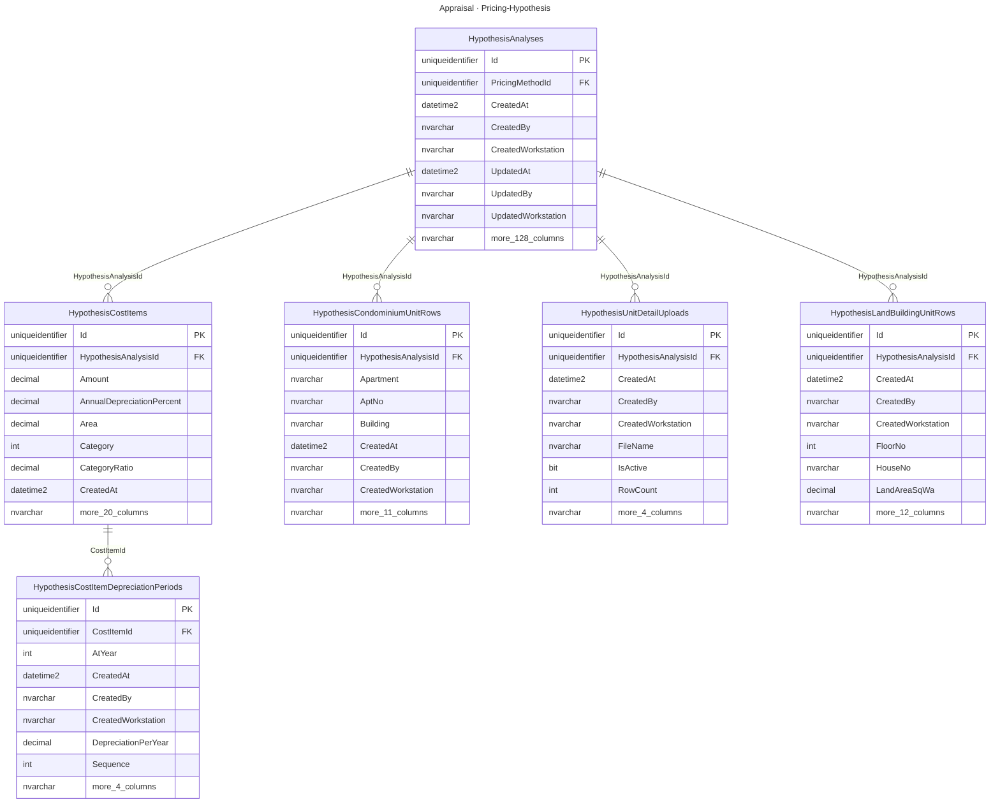
```mermaid
---
title: Appraisal · Pricing-Hypothesis
---
erDiagram
  HypothesisCostItems {
    uniqueidentifier Id PK
    uniqueidentifier HypothesisAnalysisId FK
    decimal Amount
    decimal AnnualDepreciationPercent
    decimal Area
    int Category
    decimal CategoryRatio
    datetime2 CreatedAt
    nvarchar more_20_columns
  }
  HypothesisCostItemDepreciationPeriods {
    uniqueidentifier Id PK
    uniqueidentifier CostItemId FK
    int AtYear
    datetime2 CreatedAt
    nvarchar CreatedBy
    nvarchar CreatedWorkstation
    decimal DepreciationPerYear
    int Sequence
    nvarchar more_4_columns
  }
  HypothesisAnalyses {
    uniqueidentifier Id PK
    uniqueidentifier PricingMethodId FK
    datetime2 CreatedAt
    nvarchar CreatedBy
    nvarchar CreatedWorkstation
    datetime2 UpdatedAt
    nvarchar UpdatedBy
    nvarchar UpdatedWorkstation
    nvarchar more_128_columns
  }
  HypothesisCondominiumUnitRows {
    uniqueidentifier Id PK
    uniqueidentifier HypothesisAnalysisId FK
    nvarchar Apartment
    nvarchar AptNo
    nvarchar Building
    datetime2 CreatedAt
    nvarchar CreatedBy
    nvarchar CreatedWorkstation
    nvarchar more_11_columns
  }
  HypothesisUnitDetailUploads {
    uniqueidentifier Id PK
    uniqueidentifier HypothesisAnalysisId FK
    datetime2 CreatedAt
    nvarchar CreatedBy
    nvarchar CreatedWorkstation
    nvarchar FileName
    bit IsActive
    int RowCount
    nvarchar more_4_columns
  }
  HypothesisLandBuildingUnitRows {
    uniqueidentifier Id PK
    uniqueidentifier HypothesisAnalysisId FK
    datetime2 CreatedAt
    nvarchar CreatedBy
    nvarchar CreatedWorkstation
    int FloorNo
    nvarchar HouseNo
    decimal LandAreaSqWa
    nvarchar more_12_columns
  }
  HypothesisAnalyses ||--o{ HypothesisCostItems : "HypothesisAnalysisId"
  HypothesisCostItems ||--o{ HypothesisCostItemDepreciationPeriods : "CostItemId"
  HypothesisAnalyses ||--o{ HypothesisCondominiumUnitRows : "HypothesisAnalysisId"
  HypothesisAnalyses ||--o{ HypothesisUnitDetailUploads : "HypothesisAnalysisId"
  HypothesisAnalyses ||--o{ HypothesisLandBuildingUnitRows : "HypothesisAnalysisId"
```

#### Appraisal — Pricing-Income-Leasehold  _(7 tables)_

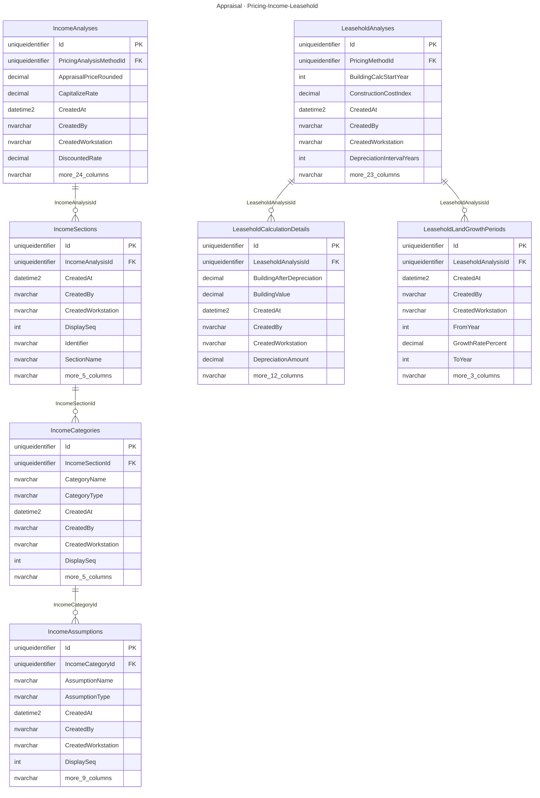
```mermaid
---
title: Appraisal · Pricing-Income-Leasehold
---
erDiagram
  IncomeAnalyses {
    uniqueidentifier Id PK
    uniqueidentifier PricingAnalysisMethodId FK
    decimal AppraisalPriceRounded
    decimal CapitalizeRate
    datetime2 CreatedAt
    nvarchar CreatedBy
    nvarchar CreatedWorkstation
    decimal DiscountedRate
    nvarchar more_24_columns
  }
  IncomeAssumptions {
    uniqueidentifier Id PK
    uniqueidentifier IncomeCategoryId FK
    nvarchar AssumptionName
    nvarchar AssumptionType
    datetime2 CreatedAt
    nvarchar CreatedBy
    nvarchar CreatedWorkstation
    int DisplaySeq
    nvarchar more_9_columns
  }
  IncomeCategories {
    uniqueidentifier Id PK
    uniqueidentifier IncomeSectionId FK
    nvarchar CategoryName
    nvarchar CategoryType
    datetime2 CreatedAt
    nvarchar CreatedBy
    nvarchar CreatedWorkstation
    int DisplaySeq
    nvarchar more_5_columns
  }
  IncomeSections {
    uniqueidentifier Id PK
    uniqueidentifier IncomeAnalysisId FK
    datetime2 CreatedAt
    nvarchar CreatedBy
    nvarchar CreatedWorkstation
    int DisplaySeq
    nvarchar Identifier
    nvarchar SectionName
    nvarchar more_5_columns
  }
  LeaseholdAnalyses {
    uniqueidentifier Id PK
    uniqueidentifier PricingMethodId FK
    int BuildingCalcStartYear
    decimal ConstructionCostIndex
    datetime2 CreatedAt
    nvarchar CreatedBy
    nvarchar CreatedWorkstation
    int DepreciationIntervalYears
    nvarchar more_23_columns
  }
  LeaseholdCalculationDetails {
    uniqueidentifier Id PK
    uniqueidentifier LeaseholdAnalysisId FK
    decimal BuildingAfterDepreciation
    decimal BuildingValue
    datetime2 CreatedAt
    nvarchar CreatedBy
    nvarchar CreatedWorkstation
    decimal DepreciationAmount
    nvarchar more_12_columns
  }
  LeaseholdLandGrowthPeriods {
    uniqueidentifier Id PK
    uniqueidentifier LeaseholdAnalysisId FK
    datetime2 CreatedAt
    nvarchar CreatedBy
    nvarchar CreatedWorkstation
    int FromYear
    decimal GrowthRatePercent
    int ToYear
    nvarchar more_3_columns
  }
  IncomeCategories ||--o{ IncomeAssumptions : "IncomeCategoryId"
  IncomeSections ||--o{ IncomeCategories : "IncomeSectionId"
  IncomeAnalyses ||--o{ IncomeSections : "IncomeAnalysisId"
  LeaseholdAnalyses ||--o{ LeaseholdCalculationDetails : "LeaseholdAnalysisId"
  LeaseholdAnalyses ||--o{ LeaseholdLandGrowthPeriods : "LeaseholdAnalysisId"
```

#### Appraisal — Project  _(16 tables)_

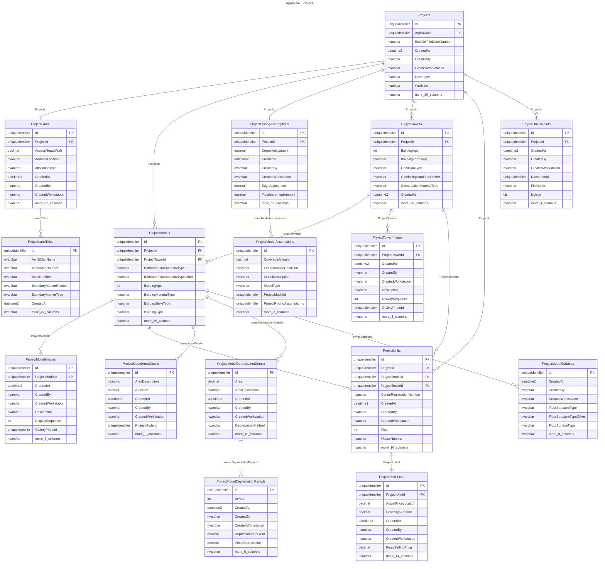
```mermaid
---
title: Appraisal · Project
---
erDiagram
  Projects {
    uniqueidentifier Id PK
    uniqueidentifier AppraisalId FK
    nvarchar BuiltOnTitleDeedNumber
    datetime2 CreatedAt
    nvarchar CreatedBy
    nvarchar CreatedWorkstation
    nvarchar Developer
    nvarchar Facilities
    nvarchar more_30_columns
  }
  ProjectLands {
    uniqueidentifier Id PK
    uniqueidentifier ProjectId FK
    decimal AccessRoadWidth
    nvarchar AddressLocation
    nvarchar AllocationType
    datetime2 CreatedAt
    nvarchar CreatedBy
    nvarchar CreatedWorkstation
    nvarchar more_82_columns
  }
  ProjectModels {
    uniqueidentifier Id PK
    uniqueidentifier ProjectId FK
    uniqueidentifier ProjectTowerId FK
    nvarchar BathroomFloorMaterialType
    nvarchar BathroomFloorMaterialTypeOther
    int BuildingAge
    nvarchar BuildingMaterialType
    nvarchar BuildingStyleType
    nvarchar BuildingType
    nvarchar more_56_columns
  }
  ProjectModelImages {
    uniqueidentifier Id PK
    uniqueidentifier ProjectModelId FK
    datetime2 CreatedAt
    nvarchar CreatedBy
    nvarchar CreatedWorkstation
    nvarchar Description
    int DisplaySequence
    uniqueidentifier GalleryPhotoId
    nvarchar more_3_columns
  }
  ProjectPricingAssumptions {
    uniqueidentifier Id PK
    uniqueidentifier ProjectId FK
    decimal CornerAdjustment
    datetime2 CreatedAt
    nvarchar CreatedBy
    nvarchar CreatedWorkstation
    decimal EdgeAdjustment
    decimal FloorIncrementAmount
    nvarchar more_11_columns
  }
  ProjectTowers {
    uniqueidentifier Id PK
    uniqueidentifier ProjectId FK
    int BuildingAge
    nvarchar BuildingFormType
    nvarchar ConditionType
    nvarchar CondoRegistrationNumber
    nvarchar ConstructionMaterialType
    datetime2 CreatedAt
    nvarchar more_28_columns
  }
  ProjectTowerImages {
    uniqueidentifier Id PK
    uniqueidentifier ProjectTowerId FK
    datetime2 CreatedAt
    nvarchar CreatedBy
    nvarchar CreatedWorkstation
    nvarchar Description
    int DisplaySequence
    uniqueidentifier GalleryPhotoId
    nvarchar more_3_columns
  }
  ProjectUnits {
    uniqueidentifier Id PK
    uniqueidentifier ProjectId FK
    uniqueidentifier ProjectModelId FK
    uniqueidentifier ProjectTowerId FK
    nvarchar CondoRegistrationNumber
    datetime2 CreatedAt
    nvarchar CreatedBy
    nvarchar CreatedWorkstation
    int Floor
    nvarchar HouseNumber
    nvarchar more_16_columns
  }
  ProjectUnitPrices {
    uniqueidentifier Id PK
    uniqueidentifier ProjectUnitId FK
    decimal AdjustPriceLocation
    decimal CoverageAmount
    datetime2 CreatedAt
    nvarchar CreatedBy
    nvarchar CreatedWorkstation
    decimal ForceSellingPrice
    nvarchar more_14_columns
  }
  ProjectUnitUploads {
    uniqueidentifier Id PK
    uniqueidentifier ProjectId FK
    datetime2 CreatedAt
    nvarchar CreatedBy
    nvarchar CreatedWorkstation
    uniqueidentifier DocumentId
    nvarchar FileName
    bit IsUsed
    nvarchar more_4_columns
  }
  ProjectLandTitles {
    uniqueidentifier Id PK
    nvarchar AerialMapName
    nvarchar AerialMapNumber
    nvarchar BookNumber
    nvarchar BoundaryMarkerRemark
    nvarchar BoundaryMarkerType
    datetime2 CreatedAt
    nvarchar more_22_columns
  }
  ProjectModelDepreciationPeriods {
    uniqueidentifier Id PK
    int AtYear
    datetime2 CreatedAt
    nvarchar CreatedBy
    nvarchar CreatedWorkstation
    decimal DepreciationPerYear
    decimal PriceDepreciation
    nvarchar more_6_columns
  }
  ProjectModelAreaDetails {
    uniqueidentifier Id PK
    nvarchar AreaDescription
    decimal AreaSize
    datetime2 CreatedAt
    nvarchar CreatedBy
    nvarchar CreatedWorkstation
    uniqueidentifier ProjectModelId
    nvarchar more_3_columns
  }
  ProjectModelDepreciationDetails {
    uniqueidentifier Id PK
    decimal Area
    nvarchar AreaDescription
    datetime2 CreatedAt
    nvarchar CreatedBy
    nvarchar CreatedWorkstation
    nvarchar DepreciationMethod
    nvarchar more_13_columns
  }
  ProjectModelSurfaces {
    uniqueidentifier Id PK
    datetime2 CreatedAt
    nvarchar CreatedBy
    nvarchar CreatedWorkstation
    nvarchar FloorStructureType
    nvarchar FloorStructureTypeOther
    nvarchar FloorSurfaceType
    nvarchar more_8_columns
  }
  ProjectModelAssumptions {
    uniqueidentifier Id PK
    decimal CoverageAmount
    nvarchar FireInsuranceCondition
    nvarchar ModelDescription
    nvarchar ModelType
    uniqueidentifier ProjectModelId
    uniqueidentifier ProjectPricingAssumptionId
    nvarchar more_3_columns
  }
  Projects ||--|| ProjectLands : "ProjectId"
  Projects ||--o{ ProjectModels : "ProjectId"
  ProjectTowers ||--o{ ProjectModels : "ProjectTowerId"
  ProjectModels ||--o{ ProjectModelImages : "ProjectModelId"
  Projects ||--|| ProjectPricingAssumptions : "ProjectId"
  Projects ||--o{ ProjectTowers : "ProjectId"
  ProjectTowers ||--o{ ProjectTowerImages : "ProjectTowerId"
  Projects ||--o{ ProjectUnits : "ProjectId"
  ProjectModels ||--o{ ProjectUnits : "ProjectModelId"
  ProjectTowers ||--o{ ProjectUnits : "ProjectTowerId"
  ProjectUnits ||--|| ProjectUnitPrices : "ProjectUnitId"
  Projects ||--o{ ProjectUnitUploads : "ProjectId"
  ProjectLands ||--o{ ProjectLandTitles : "owns:Titles"
  ProjectModelDepreciationDetails ||--o{ ProjectModelDepreciationPeriods : "owns:DepreciationPeriods"
  ProjectModels ||--o{ ProjectModelAreaDetails : "owns:AreaDetails"
  ProjectModels ||--o{ ProjectModelDepreciationDetails : "owns:DepreciationDetails"
  ProjectModels ||--o{ ProjectModelSurfaces : "owns:Surfaces"
  ProjectPricingAssumptions ||--o{ ProjectModelAssumptions : "owns:ModelAssumptions"
```

#### Appraisal — Gallery-Appendix  _(6 tables)_

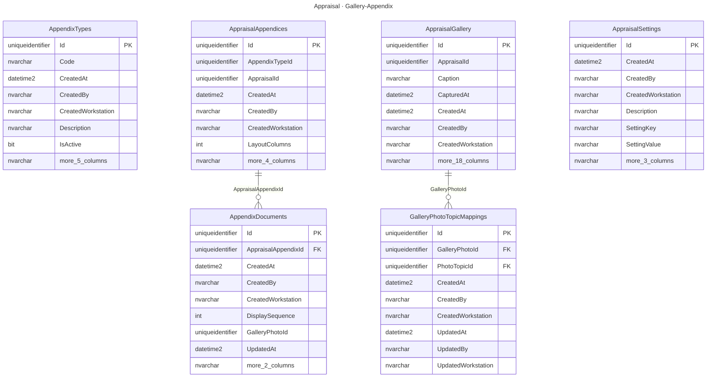
```mermaid
---
title: Appraisal · Gallery-Appendix
---
erDiagram
  AppendixDocuments {
    uniqueidentifier Id PK
    uniqueidentifier AppraisalAppendixId FK
    datetime2 CreatedAt
    nvarchar CreatedBy
    nvarchar CreatedWorkstation
    int DisplaySequence
    uniqueidentifier GalleryPhotoId
    datetime2 UpdatedAt
    nvarchar more_2_columns
  }
  AppendixTypes {
    uniqueidentifier Id PK
    nvarchar Code
    datetime2 CreatedAt
    nvarchar CreatedBy
    nvarchar CreatedWorkstation
    nvarchar Description
    bit IsActive
    nvarchar more_5_columns
  }
  AppraisalAppendices {
    uniqueidentifier Id PK
    uniqueidentifier AppendixTypeId
    uniqueidentifier AppraisalId
    datetime2 CreatedAt
    nvarchar CreatedBy
    nvarchar CreatedWorkstation
    int LayoutColumns
    nvarchar more_4_columns
  }
  AppraisalGallery {
    uniqueidentifier Id PK
    uniqueidentifier AppraisalId
    nvarchar Caption
    datetime2 CapturedAt
    datetime2 CreatedAt
    nvarchar CreatedBy
    nvarchar CreatedWorkstation
    nvarchar more_18_columns
  }
  GalleryPhotoTopicMappings {
    uniqueidentifier Id PK
    uniqueidentifier GalleryPhotoId FK
    uniqueidentifier PhotoTopicId FK
    datetime2 CreatedAt
    nvarchar CreatedBy
    nvarchar CreatedWorkstation
    datetime2 UpdatedAt
    nvarchar UpdatedBy
    nvarchar UpdatedWorkstation
  }
  AppraisalSettings {
    uniqueidentifier Id PK
    datetime2 CreatedAt
    nvarchar CreatedBy
    nvarchar CreatedWorkstation
    nvarchar Description
    nvarchar SettingKey
    nvarchar SettingValue
    nvarchar more_3_columns
  }
  AppraisalAppendices ||--o{ AppendixDocuments : "AppraisalAppendixId"
  AppraisalGallery ||--o{ GalleryPhotoTopicMappings : "GalleryPhotoId"
```

#### Appraisal — Other  _(37 tables)_


```mermaid
---
title: Appraisal · Other
---
erDiagram
  LawAndRegulations {
    uniqueidentifier Id PK
    uniqueidentifier AppraisalId
    datetime2 CreatedAt
    nvarchar CreatedBy
    nvarchar CreatedWorkstation
    nvarchar HeaderCode
    nvarchar Remark
    nvarchar more_3_columns
  }
  LawAndRegulationImages {
    uniqueidentifier Id PK
    uniqueidentifier LawAndRegulationId FK
    datetime2 CreatedAt
    nvarchar CreatedBy
    nvarchar CreatedWorkstation
    nvarchar Description
    int DisplaySequence
    uniqueidentifier GalleryPhotoId
    nvarchar more_4_columns
  }
  MachineCostItems {
    uniqueidentifier Id PK
    uniqueidentifier PricingMethodId FK
    uniqueidentifier AppraisalPropertyId
    decimal ConditionFactor
    datetime2 CreatedAt
    nvarchar CreatedBy
    nvarchar CreatedWorkstation
    int DisplaySequence
    nvarchar more_10_columns
  }
  MachineryAppraisalSummaries {
    uniqueidentifier Id PK
    uniqueidentifier AppraisalId
    int AppraisalNumber
    int AppraisalScrapCount
    int AppraisedByDocumentCount
    datetime2 CreatedAt
    nvarchar CreatedBy
    nvarchar more_20_columns
  }
  PhotoTopics {
    uniqueidentifier Id PK
    uniqueidentifier AppraisalId
    datetime2 CreatedAt
    nvarchar CreatedBy
    nvarchar CreatedWorkstation
    int DisplayColumns
    int SortOrder
    nvarchar more_4_columns
  }
  ProfitRentAnalyses {
    uniqueidentifier Id PK
    uniqueidentifier PricingMethodId FK
    datetime2 CreatedAt
    nvarchar CreatedBy
    nvarchar CreatedWorkstation
    decimal DiscountRate
    decimal EstimatePriceRounded
    decimal FinalValueRounded
    nvarchar more_12_columns
  }
  ProfitRentCalculationDetails {
    uniqueidentifier Id PK
    uniqueidentifier ProfitRentAnalysisId FK
    decimal ContractRentalFeePerYear
    datetime2 CreatedAt
    nvarchar CreatedBy
    nvarchar CreatedWorkstation
    int DisplaySequence
    decimal MarketRentalFeeGrowthPercent
    nvarchar more_11_columns
  }
  ProfitRentGrowthPeriods {
    uniqueidentifier Id PK
    uniqueidentifier ProfitRentAnalysisId FK
    datetime2 CreatedAt
    nvarchar CreatedBy
    nvarchar CreatedWorkstation
    int FromYear
    decimal GrowthRatePercent
    int ToYear
    nvarchar more_3_columns
  }
  PropertyPhotoMappings {
    uniqueidentifier Id PK
    uniqueidentifier AppraisalPropertyId FK
    datetime2 CreatedAt
    nvarchar CreatedBy
    nvarchar CreatedWorkstation
    uniqueidentifier GalleryPhotoId
    bit IsThumbnail
    datetime2 LinkedAt
    nvarchar more_7_columns
  }
  PropertyValuations {
    uniqueidentifier Id PK
    uniqueidentifier ValuationAnalysisId FK
    decimal AppraisedValue
    datetime2 CreatedAt
    nvarchar CreatedBy
    nvarchar CreatedWorkstation
    decimal ForcedSaleValue
    decimal MarketValue
    nvarchar more_9_columns
  }
  ValuationAnalyses {
    uniqueidentifier Id PK
    uniqueidentifier AppraisalId
    decimal AppraisedValue
    nvarchar AppraiserOpinion
    datetime2 CreatedAt
    nvarchar CreatedBy
    nvarchar CreatedWorkstation
    nvarchar more_10_columns
  }
  Invoices {
    uniqueidentifier Id PK
    datetime2 ApprovedAt
    nvarchar ApprovedBy
    uniqueidentifier CompanyId
    datetime2 CreatedAt
    nvarchar CreatedBy
    nvarchar CreatedWorkstation
    nvarchar more_10_columns
  }
  InvoiceItems {
    uniqueidentifier Id PK
    uniqueidentifier InvoiceId FK
    uniqueidentifier AppraisalFeeId
    nvarchar AppraisalNumber
    uniqueidentifier AssignmentId
    decimal BankAbsorbAmount
    datetime2 CreatedAt
    nvarchar CreatedBy
    nvarchar more_11_columns
  }
  QuotationEmails {
    uniqueidentifier Id PK
    nvarchar Bcc
    nvarchar Cc
    nvarchar Content
    nvarchar From
    uniqueidentifier QuotationRequestId
    nvarchar Subject
    nvarchar more_1_columns
  }
  QuotationNegotiations {
    uniqueidentifier Id PK
    uniqueidentifier CompanyQuotationId FK
    decimal CounterPrice
    int CounterTimeline
    datetime2 CreatedAt
    nvarchar CreatedBy
    nvarchar CreatedWorkstation
    datetime2 InitiatedAt
    nvarchar more_12_columns
  }
  QuotationSharedDocuments {
    uniqueidentifier QuotationRequestId PK
    uniqueidentifier DocumentId PK
    uniqueidentifier AppraisalId
    nvarchar Level
    datetime2 SharedAt
    nvarchar SharedBy
  }
  InboxMessage {
    uniqueidentifier MessageId PK
    nvarchar ConsumerType PK
    datetime2 ProcessedAt
    datetime2 StartedAt
    nvarchar Status
  }
  IntegrationEventOutbox {
    uniqueidentifier Id PK
    nvarchar CorrelationId
    nvarchar Error
    nvarchar EventType
    nvarchar Headers
    datetime2 OccurredAt
    nvarchar Payload
    nvarchar more_3_columns
  }
  BuildingDepreciationPeriods {
    uniqueidentifier Id PK
    int AtYear
    uniqueidentifier BuildingDepreciationDetailId
    datetime2 CreatedAt
    nvarchar CreatedBy
    nvarchar CreatedWorkstation
    decimal DepreciationPerYear
    nvarchar more_6_columns
  }
  BuildingAppraisalSurfaces {
    uniqueidentifier Id PK
    uniqueidentifier BuildingAppraisalDetailId
    datetime2 CreatedAt
    nvarchar CreatedBy
    nvarchar CreatedWorkstation
    nvarchar FloorStructureType
    nvarchar FloorStructureTypeOther
    nvarchar more_8_columns
  }
  BuildingDepreciationDetails {
    uniqueidentifier Id PK
    decimal Area
    nvarchar AreaDescription
    uniqueidentifier BuildingAppraisalDetailId
    datetime2 CreatedAt
    nvarchar CreatedBy
    nvarchar CreatedWorkstation
    nvarchar more_13_columns
  }
  CondoAppraisalAreaDetails {
    uniqueidentifier Id PK
    nvarchar AreaDescription
    decimal AreaSize
    uniqueidentifier CondoAppraisalDetailsId
    datetime2 CreatedAt
    nvarchar CreatedBy
    nvarchar CreatedWorkstation
    nvarchar more_3_columns
  }
  ConstructionWorkDetails {
    uniqueidentifier Id PK
    uniqueidentifier ConstructionInspectionId
    decimal ConstructionValue
    uniqueidentifier ConstructionWorkGroupId
    uniqueidentifier ConstructionWorkItemId
    datetime2 CreatedAt
    nvarchar CreatedBy
    nvarchar more_12_columns
  }
  LandTitles {
    uniqueidentifier Id PK
    nvarchar AerialMapName
    nvarchar AerialMapNumber
    nvarchar BookNumber
    nvarchar BoundaryMarkerRemark
    nvarchar BoundaryMarkerType
    datetime2 CreatedAt
    nvarchar more_22_columns
  }
  RentalGrowthPeriodEntries {
    uniqueidentifier Id PK
    datetime2 CreatedAt
    nvarchar CreatedBy
    nvarchar CreatedWorkstation
    int FromYear
    decimal GrowthAmount
    decimal GrowthRate
    nvarchar more_6_columns
  }
  RentalScheduleEntries {
    uniqueidentifier Id PK
    datetime2 ContractEnd
    decimal ContractRentalFee
    decimal ContractRentalFeeGrowthRatePercent
    datetime2 ContractStart
    datetime2 CreatedAt
    nvarchar CreatedBy
    nvarchar more_8_columns
  }
  RentalScheduleOverrides {
    uniqueidentifier Id PK
    decimal ContractRentalFee
    datetime2 CreatedAt
    nvarchar CreatedBy
    nvarchar CreatedWorkstation
    uniqueidentifier RentalInfoId
    decimal UpFront
    nvarchar more_4_columns
  }
  RentalUpFrontEntries {
    uniqueidentifier Id PK
    datetime2 AtYear
    datetime2 CreatedAt
    nvarchar CreatedBy
    nvarchar CreatedWorkstation
    uniqueidentifier RentalInfoId
    decimal UpFrontAmount
    nvarchar more_3_columns
  }
  BuildingAppraisalDetails {
    uniqueidentifier Id PK
    uniqueidentifier AppraisalPropertyId
    int BuildingAge
    nvarchar BuildingConditionType
    nvarchar BuildingConditionTypeOther
    decimal BuildingInsurancePrice
    nvarchar BuildingMaterialType
    nvarchar more_56_columns
  }
  CondoAppraisalDetails {
    uniqueidentifier Id PK
    decimal AccessRoadWidth
    uniqueidentifier AppraisalPropertyId
    nvarchar BathroomFloorMaterialType
    nvarchar BathroomFloorMaterialTypeOther
    int BuildingAge
    nvarchar BuildingConditionType
    nvarchar more_71_columns
  }
  ConstructionInspections {
    uniqueidentifier Id PK
    uniqueidentifier AppraisalPropertyId
    datetime2 CreatedAt
    nvarchar CreatedBy
    nvarchar CreatedWorkstation
    uniqueidentifier DocumentId
    nvarchar FileExtension
    nvarchar more_15_columns
  }
  LandAppraisalDetails {
    uniqueidentifier Id PK
    decimal AccessRoadWidth
    nvarchar AddressLocation
    nvarchar AllocationType
    uniqueidentifier AppraisalPropertyId
    datetime2 CreatedAt
    nvarchar CreatedBy
    nvarchar more_83_columns
  }
  LeaseAgreementDetails {
    uniqueidentifier Id PK
    decimal AdditionalExpenses
    uniqueidentifier AppraisalPropertyId
    nvarchar ContractNo
    nvarchar ContractRenewal
    datetime2 CreatedAt
    nvarchar CreatedBy
    nvarchar more_17_columns
  }
  MachineryAppraisalDetails {
    uniqueidentifier Id PK
    uniqueidentifier AppraisalPropertyId
    nvarchar AppraiserOpinion
    nvarchar Brand
    nvarchar Capacity
    nvarchar ChassisNo
    nvarchar ConditionUse
    nvarchar more_38_columns
  }
  RentalInfos {
    uniqueidentifier Id PK
    uniqueidentifier AppraisalPropertyId
    decimal ContractRentalFeePerYear
    datetime2 CreatedAt
    nvarchar CreatedBy
    nvarchar CreatedWorkstation
    datetime2 FirstYearStartDate
    nvarchar more_8_columns
  }
  VehicleAppraisalDetails {
    uniqueidentifier Id PK
    uniqueidentifier AppraisalPropertyId
    nvarchar AppraiserOpinion
    nvarchar Brand
    bit CanUse
    nvarchar Capacity
    nvarchar ChassisNo
    nvarchar more_32_columns
  }
  VesselAppraisalDetails {
    uniqueidentifier Id PK
    uniqueidentifier AppraisalPropertyId
    nvarchar AppraiserOpinion
    nvarchar Brand
    bit CanUse
    nvarchar ClassOfVessel
    nvarchar ConditionUse
    nvarchar more_38_columns
  }
  LawAndRegulations ||--o{ LawAndRegulationImages : "LawAndRegulationId"
  ProfitRentAnalyses ||--o{ ProfitRentCalculationDetails : "ProfitRentAnalysisId"
  ProfitRentAnalyses ||--o{ ProfitRentGrowthPeriods : "ProfitRentAnalysisId"
  ValuationAnalyses ||--o{ PropertyValuations : "ValuationAnalysisId"
  Invoices ||--o{ InvoiceItems : "InvoiceId"
  BuildingDepreciationDetails ||--o{ BuildingDepreciationPeriods : "owns:DepreciationPeriods"
  BuildingAppraisalDetails ||--o{ BuildingAppraisalSurfaces : "owns:Surfaces"
  BuildingAppraisalDetails ||--o{ BuildingDepreciationDetails : "owns:DepreciationDetails"
  CondoAppraisalDetails ||--o{ CondoAppraisalAreaDetails : "owns:AreaDetails"
  ConstructionInspections ||--o{ ConstructionWorkDetails : "owns:WorkDetails"
  LandAppraisalDetails ||--o{ LandTitles : "owns:Titles"
  RentalInfos ||--o{ RentalGrowthPeriodEntries : "owns:GrowthPeriodEntries"
  RentalInfos ||--o{ RentalScheduleEntries : "owns:ScheduleEntries"
  RentalInfos ||--o{ RentalScheduleOverrides : "owns:ScheduleOverrides"
  RentalInfos ||--o{ RentalUpFrontEntries : "owns:UpFrontEntries"
```


### Workflow

#### Workflow — Engine  _(13 tables)_

```mermaid
---
title: Workflow · Engine
---
erDiagram
  BackgroundServiceLease {
    nvarchar Id PK
    datetime2 AcquiredAt
    nvarchar InstanceId
    datetime2 LeasedUntil
  }
  ActivityProcessConfigurations {
    uniqueidentifier Id PK
    nvarchar ActivityName
    datetime2 CreatedAt
    nvarchar CreatedBy
    nvarchar CreatedWorkstation
    bit IsActive
    tinyint Kind
    nvarchar more_9_columns
  }
  ActivityProcessExecutions {
    uniqueidentifier Id PK
    uniqueidentifier ConfigurationId
    int ConfigurationVersion
    datetime2 CreatedOn
    int DurationMs
    nvarchar ErrorMessage
    tinyint Kind
    nvarchar more_8_columns
  }
  CompletedTasks {
    uniqueidentifier Id PK
    nvarchar ActionTaken
    nvarchar ActivityId
    datetime2 AssignedAt
    nvarchar AssignedTo
    nvarchar AssignedType
    uniqueidentifier AssigneeCompanyId
    nvarchar more_17_columns
  }
  PendingTasks {
    uniqueidentifier Id PK
    nvarchar ActivityId
    datetime2 AssignedAt
    nvarchar AssignedTo
    nvarchar AssignedType
    uniqueidentifier AssigneeCompanyId
    nvarchar CommitteeCode
    nvarchar more_18_columns
  }
  WorkflowActivityExecutions {
    uniqueidentifier Id PK
    uniqueidentifier WorkflowInstanceId FK
    nvarchar ActivityId
    nvarchar ActivityName
    nvarchar ActivityType
    nvarchar AssignedTo
    nvarchar Comments
    nvarchar CompletedBy
    nvarchar more_26_columns
  }
  WorkflowBookmarks {
    uniqueidentifier Id PK
    uniqueidentifier WorkflowInstanceId FK
    nvarchar ActivityId
    datetime2 ClaimedAt
    nvarchar ClaimedBy
    rowversion ConcurrencyToken
    datetime2 ConsumedAt
    nvarchar ConsumedBy
    nvarchar more_13_columns
  }
  WorkflowDefinitions {
    uniqueidentifier Id PK
    nvarchar Category
    datetime2 CreatedAt
    nvarchar CreatedBy
    datetime2 CreatedOn
    nvarchar CreatedWorkstation
    nvarchar Description
    nvarchar more_8_columns
  }
  WorkflowDefinitionVersions {
    uniqueidentifier Id PK
    nvarchar BreakingChanges
    nvarchar Category
    datetime2 CreatedOn
    nvarchar CreatedBy
    nvarchar CreatedWorkstation
    uniqueidentifier DefinitionId
    nvarchar more_14_columns
  }
  WorkflowExecutionLogs {
    uniqueidentifier Id PK
    uniqueidentifier WorkflowInstanceId FK
    nvarchar ActivityId
    nvarchar ActorId
    nvarchar CorrelationId
    datetime2 CreatedAt
    nvarchar CreatedBy
    nvarchar CreatedWorkstation
    nvarchar more_9_columns
  }
  WorkflowExternalCalls {
    uniqueidentifier Id PK
    uniqueidentifier WorkflowInstanceId FK
    nvarchar ActivityId
    int AttemptCount
    datetime2 CompletedAt
    rowversion ConcurrencyToken
    datetime2 CreatedAt
    nvarchar CreatedBy
    nvarchar more_15_columns
  }
  WorkflowInstances {
    uniqueidentifier Id PK
    uniqueidentifier WorkflowDefinitionId FK
    uniqueidentifier WorkflowDefinitionVersionId FK
    nvarchar ActiveBranchActivities
    datetime2 CompletedOn
    nvarchar CorrelationId
    datetime2 CreatedAt
    nvarchar CreatedBy
    nvarchar CreatedWorkstation
    nvarchar more_17_columns
  }
  WorkflowOutboxes {
    uniqueidentifier Id PK
    uniqueidentifier WorkflowInstanceId FK
    nvarchar ActivityId
    int Attempts
    rowversion ConcurrencyToken
    nvarchar CorrelationId
    datetime2 CreatedAt
    nvarchar CreatedBy
    nvarchar more_12_columns
  }
  WorkflowInstances ||--o{ WorkflowActivityExecutions : "WorkflowInstanceId"
  WorkflowInstances ||--o{ WorkflowBookmarks : "WorkflowInstanceId"
  WorkflowInstances ||--o{ WorkflowExecutionLogs : "WorkflowInstanceId"
  WorkflowInstances ||--o{ WorkflowExternalCalls : "WorkflowInstanceId"
  WorkflowDefinitions ||--o{ WorkflowInstances : "WorkflowDefinitionId"
  WorkflowDefinitionVersions ||--o{ WorkflowInstances : "WorkflowDefinitionVersionId"
  WorkflowInstances ||--o{ WorkflowOutboxes : "WorkflowInstanceId"
```

#### Workflow — Meetings  _(7 tables)_

```mermaid
---
title: Workflow · Meetings
---
erDiagram
  ApprovalVotes {
    uniqueidentifier Id PK
    uniqueidentifier ActivityExecutionId
    nvarchar ActivityId
    nvarchar Comments
    datetime2 CreatedAt
    nvarchar CreatedBy
    nvarchar CreatedWorkstation
    nvarchar more_8_columns
  }
  Meetings {
    uniqueidentifier Id PK
    nvarchar AgendaCertifyMinutes
    nvarchar AgendaChairmanInformed
    nvarchar AgendaOthers
    nvarchar CancelReason
    datetime2 CancelledAt
    datetime2 CreatedAt
    nvarchar more_20_columns
  }
  MeetingConfigurations {
    nvarchar Key PK
    nvarchar Description
    datetime2 UpdatedAt
    nvarchar Value
  }
  MeetingInvitationEmails {
    uniqueidentifier Id PK
    nvarchar Attachments
    nvarchar Content
    nvarchar From
    uniqueidentifier MeetingId
    nvarchar Subject
    nvarchar To
  }
  MeetingItems {
    uniqueidentifier Id PK
    uniqueidentifier MeetingId FK
    nvarchar AcknowledgementGroup
    nvarchar ActivityId
    datetime2 AddedAt
    uniqueidentifier AppraisalId
    nvarchar AppraisalNo
    nvarchar AppraisalType
    nvarchar more_14_columns
  }
  MeetingMembers {
    uniqueidentifier Id PK
    uniqueidentifier MeetingId FK
    datetime2 AddedAt
    datetime2 CreatedAt
    nvarchar CreatedBy
    nvarchar CreatedWorkstation
    nvarchar MemberName
    nvarchar Position
    nvarchar more_5_columns
  }
  MeetingQueueItems {
    uniqueidentifier Id PK
    nvarchar ActivityId
    uniqueidentifier AppraisalId
    nvarchar AppraisalNo
    datetime2 CreatedAt
    nvarchar CreatedBy
    nvarchar CreatedWorkstation
    nvarchar more_8_columns
  }
  Meetings ||--o{ MeetingItems : "MeetingId"
  Meetings ||--o{ MeetingMembers : "MeetingId"
```

#### Workflow — DocumentFollowup  _(1 tables)_

```mermaid
---
title: Workflow · DocumentFollowup
---
erDiagram
  DocumentFollowups {
    uniqueidentifier Id PK
    uniqueidentifier AppraisalId
    nvarchar CancellationReason
    datetime2 CreatedAt
    nvarchar CreatedBy
    nvarchar CreatedWorkstation
    uniqueidentifier FollowupWorkflowInstanceId
    nvarchar more_12_columns
  }
```

#### Workflow — SLA-Other  _(6 tables)_

```mermaid
---
title: Workflow · SLA-Other
---
erDiagram
  Committees {
    uniqueidentifier Id PK
    nvarchar Code
    datetime2 CreatedAt
    nvarchar CreatedBy
    nvarchar CreatedWorkstation
    nvarchar Description
    bit IsActive
    nvarchar more_7_columns
  }
  CommitteeApprovalConditions {
    uniqueidentifier Id PK
    uniqueidentifier CommitteeId FK
    nvarchar ConditionType
    datetime2 CreatedAt
    nvarchar CreatedBy
    nvarchar CreatedWorkstation
    nvarchar Description
    bit IsActive
    nvarchar more_6_columns
  }
  CommitteeMembers {
    uniqueidentifier Id PK
    uniqueidentifier CommitteeId FK
    nvarchar Attendance
    datetime2 CreatedAt
    nvarchar CreatedBy
    nvarchar CreatedWorkstation
    bit IsActive
    nvarchar MemberName
    nvarchar more_5_columns
  }
  CommitteeThresholds {
    uniqueidentifier Id PK
    uniqueidentifier CommitteeId FK
    datetime2 CreatedAt
    nvarchar CreatedBy
    nvarchar CreatedWorkstation
    bit IsActive
    decimal MaxValue
    decimal MinValue
    nvarchar more_4_columns
  }
  SlaBreachLogs {
    uniqueidentifier Id PK
    nvarchar AssignedTo
    datetime2 BreachedAt
    uniqueidentifier CorrelationId
    datetime2 CreatedAt
    nvarchar CreatedBy
    nvarchar CreatedWorkstation
    nvarchar more_8_columns
  }
  SlaPolicies {
    uniqueidentifier Id PK
    nvarchar ActivityId
    uniqueidentifier CompanyId
    datetime2 CreatedAt
    nvarchar CreatedBy
    nvarchar CreatedWorkstation
    int DurationHours
    nvarchar more_11_columns
  }
  Committees ||--o{ CommitteeApprovalConditions : "CommitteeId"
  Committees ||--o{ CommitteeMembers : "CommitteeId"
  Committees ||--o{ CommitteeThresholds : "CommitteeId"
```

#### Workflow — Other  _(7 tables)_

```mermaid
---
title: Workflow · Other
---
erDiagram
  InboxMessage {
    uniqueidentifier MessageId PK
    nvarchar ConsumerType PK
    datetime2 ProcessedAt
    datetime2 StartedAt
    nvarchar Status
  }
  IntegrationEventOutbox {
    uniqueidentifier Id PK
    nvarchar CorrelationId
    nvarchar Error
    nvarchar EventType
    nvarchar Headers
    datetime2 OccurredAt
    nvarchar Payload
    nvarchar more_3_columns
  }
  TaskAssignmentConfigurations {
    uniqueidentifier Id PK
    nvarchar ActivityId
    nvarchar AdditionalConfiguration
    nvarchar AdminPoolId
    nvarchar AssigneeGroup
    datetime2 CreatedAt
    nvarchar CreatedBy
    nvarchar more_10_columns
  }
  AppraisalAcknowledgementQueueItems {
    uniqueidentifier Id PK
    nvarchar AcknowledgementGroup
    uniqueidentifier AppraisalDecisionId
    uniqueidentifier AppraisalId
    nvarchar AppraisalNo
    nvarchar CommitteeCode
    uniqueidentifier CommitteeId
    nvarchar more_9_columns
  }
  BusinessHoursConfigs {
    uniqueidentifier Id PK
    datetime2 CreatedAt
    nvarchar CreatedBy
    nvarchar CreatedWorkstation
    time EndTime
    bit IsActive
    time LunchEndTime
    nvarchar more_6_columns
  }
  Holidays {
    uniqueidentifier Id PK
    datetime2 CreatedAt
    nvarchar CreatedBy
    nvarchar CreatedWorkstation
    date Date
    nvarchar Description
    datetime2 UpdatedAt
    nvarchar more_3_columns
  }
  RoundRobinQueue {
    nvarchar ActivityName PK
    nvarchar GroupsHash PK
    nvarchar UserId PK
    int AssignmentCount
    nvarchar GroupsList
    bit IsActive
    datetime2 LastAssignedAt
  }
```


### Collateral

```mermaid
---
title: Collateral
---
erDiagram
  CollateralBackfillReports {
    uniqueidentifier Id PK
    uniqueidentifier AppraisalId
    nvarchar Message
    datetime2 RunAt
    nvarchar Status
  }
  CollateralDocuments {
    uniqueidentifier Id PK
    uniqueidentifier CollateralMasterId FK
    datetime2 CreatedAt
    nvarchar CreatedBy
    nvarchar CreatedWorkstation
    nvarchar Description
    uniqueidentifier DocumentId
    nvarchar DocumentType
    nvarchar more_5_columns
  }
  CollateralEngagements {
    uniqueidentifier Id PK
    uniqueidentifier CollateralMasterId FK
    uniqueidentifier AppraisalCompanyId
    nvarchar AppraisalCompanyName
    datetime2 AppraisalDate
    uniqueidentifier AppraisalId
    nvarchar AppraisalNumber
    nvarchar AppraisalType
    nvarchar more_9_columns
  }
  CollateralEngagementBuildings {
    uniqueidentifier Id PK
    uniqueidentifier EngagementId FK
    decimal BuildingArea
    nvarchar BuildingTypeCode
    decimal BuildingValue
    int Sequence
  }
  CollateralMasters {
    uniqueidentifier Id PK
    uniqueidentifier ParentMasterId FK
    nvarchar CollateralType
    datetime2 CreatedAt
    nvarchar CreatedBy
    nvarchar CreatedWorkstation
    bit IsDeleted
    bit IsMaster
    nvarchar more_5_columns
  }
  CollateralMasterAuditLogs {
    uniqueidentifier Id PK
    uniqueidentifier CollateralMasterId FK
    nvarchar Action
    datetime2 ChangedAt
    nvarchar ChangedBy
    nvarchar ChangedFields
    nvarchar Reason
  }
  CondoDetails {
    uniqueidentifier CollateralMasterId PK
    decimal AppraisalValue
    int BuildingAge
    decimal BuildingCost
    nvarchar BuildingNumber
    nvarchar CondoName
    nvarchar CondoRegistrationNumber
    nvarchar more_18_columns
  }
  LandDetails {
    uniqueidentifier CollateralMasterId PK
    decimal AccessRoadWidth
    decimal AppraisalValue
    decimal BuildingCost
    nvarchar District
    bit IsDeleted
    bit IsUnderConstructionAtLastAppraisal
    nvarchar more_24_columns
  }
  LeaseholdDetails {
    uniqueidentifier CollateralMasterId PK
    uniqueidentifier UnderlyingMasterId FK
    bit IsDeleted
    nvarchar LeaseRegistrationNo
    date LeaseTermEnd
    int LeaseTermMonths
    date LeaseTermStart
    nvarchar Lessee
    nvarchar more_5_columns
  }
  MachineDetails {
    uniqueidentifier CollateralMasterId PK
    nvarchar Brand
    bit IsDeleted
    nvarchar MachineRegistrationNo
    nvarchar Manufacturer
    nvarchar Model
    nvarchar SerialNo
    nvarchar more_4_columns
  }
  InboxMessage {
    uniqueidentifier MessageId PK
    nvarchar ConsumerType PK
    datetime2 ProcessedAt
    datetime2 StartedAt
    nvarchar Status
  }
  CollateralMasters ||--o{ CollateralDocuments : "CollateralMasterId"
  CollateralMasters ||--o{ CollateralEngagements : "CollateralMasterId"
  CollateralEngagements ||--o{ CollateralEngagementBuildings : "EngagementId"
  CollateralMasters ||--o{ CollateralMasters : "ParentMasterId"
  CollateralMasters ||--o{ CollateralMasterAuditLogs : "CollateralMasterId"
  CollateralMasters ||--|| CondoDetails : "CollateralMasterId"
  CollateralMasters ||--|| LandDetails : "CollateralMasterId"
  CollateralMasters ||--|| LeaseholdDetails : "CollateralMasterId"
  CollateralMasters ||--o{ LeaseholdDetails : "UnderlyingMasterId"
  CollateralMasters ||--|| MachineDetails : "CollateralMasterId"
```


### Document

```mermaid
---
title: Document
---
erDiagram
  Documents {
    uniqueidentifier Id PK
    uniqueidentifier UploadSessionId FK
    nvarchar AccessLevel
    datetime2 ArchivedAt
    nvarchar ArchivedBy
    nvarchar ArchivedByName
    nvarchar Checksum
    nvarchar ChecksumAlgorithm
    nvarchar more_30_columns
  }
  UploadSessions {
    uniqueidentifier Id PK
    datetime2 CompletedAt
    datetime2 CreatedAt
    nvarchar CreatedBy
    nvarchar CreatedWorkstation
    datetime2 ExpiresAt
    nvarchar ExternalReference
    nvarchar more_8_columns
  }
  BackgroundServiceLease {
    nvarchar Id PK
    datetime2 AcquiredAt
    nvarchar InstanceId
    datetime2 LeasedUntil
  }
  InboxMessage {
    uniqueidentifier MessageId PK
    nvarchar ConsumerType PK
    datetime2 ProcessedAt
    datetime2 StartedAt
    nvarchar Status
  }
  IntegrationEventOutbox {
    uniqueidentifier Id PK
    nvarchar CorrelationId
    nvarchar Error
    nvarchar EventType
    nvarchar Headers
    datetime2 OccurredAt
    nvarchar Payload
    nvarchar more_3_columns
  }
  UploadSessions ||--o{ Documents : "UploadSessionId"
```


### Integration

```mermaid
---
title: Integration
---
erDiagram
  IdempotencyRecords {
    uniqueidentifier Id PK
    datetime2 CreatedAt
    nvarchar CreatedBy
    nvarchar CreatedWorkstation
    datetime2 ExpiresAt
    nvarchar IdempotencyKey
    nvarchar OperationType
    nvarchar more_6_columns
  }
  WebhookDeliveries {
    uniqueidentifier Id PK
    int AttemptCount
    datetime2 CreatedAt
    nvarchar CreatedBy
    nvarchar CreatedWorkstation
    datetime2 DeliveredAt
    nvarchar EventType
    nvarchar more_8_columns
  }
  WebhookSubscriptions {
    uniqueidentifier Id PK
    nvarchar CallbackUrl
    datetime2 CreatedAt
    nvarchar CreatedBy
    nvarchar CreatedWorkstation
    bit IsActive
    datetime2 LastDeliveryAt
    nvarchar more_5_columns
  }
```


### Notification

```mermaid
---
title: Notification
---
erDiagram
  UserNotifications {
    uniqueidentifier Id PK
    nvarchar ActionUrl
    datetime2 CreatedAt
    bit IsRead
    nvarchar Message
    nvarchar Metadata
    nvarchar Title
    nvarchar more_2_columns
  }
  InboxMessage {
    uniqueidentifier MessageId PK
    nvarchar ConsumerType PK
    datetime2 ProcessedAt
    datetime2 StartedAt
    nvarchar Status
  }
```


### Parameter

```mermaid
---
title: Parameter
---
erDiagram
  DopaDistricts {
    nvarchar Code PK
    nvarchar ProvinceCode FK
    nvarchar NameEn
    nvarchar NameTh
  }
  DopaProvinces {
    nvarchar Code PK
    nvarchar NameEn
    nvarchar NameTh
  }
  DopaSubDistricts {
    nvarchar Code PK
    nvarchar DistrictCode FK
    nvarchar NameEn
    nvarchar NameTh
    nvarchar Postcode
  }
  TitleDistricts {
    nvarchar Code PK
    nvarchar ProvinceCode FK
    nvarchar NameEn
    nvarchar NameTh
  }
  TitleProvinces {
    nvarchar Code PK
    nvarchar NameEn
    nvarchar NameTh
  }
  TitleSubDistricts {
    nvarchar Code PK
    nvarchar DistrictCode FK
    nvarchar NameEn
    nvarchar NameTh
    nvarchar Postcode
  }
  ConstructionWorkGroups {
    uniqueidentifier Id PK
    nvarchar Code
    datetime2 CreatedAt
    nvarchar CreatedBy
    nvarchar CreatedWorkstation
    int DisplayOrder
    bit IsActive
    nvarchar more_5_columns
  }
  ConstructionWorkItems {
    uniqueidentifier Id PK
    uniqueidentifier ConstructionWorkGroupId FK
    nvarchar Code
    datetime2 CreatedAt
    nvarchar CreatedBy
    nvarchar CreatedWorkstation
    int DisplayOrder
    bit IsActive
    nvarchar more_5_columns
  }
  DocumentRequirements {
    uniqueidentifier Id PK
    uniqueidentifier DocumentTypeId FK
    datetime2 CreatedAt
    nvarchar CreatedBy
    nvarchar CreatedWorkstation
    bit IsActive
    bit IsRequired
    nvarchar Notes
    nvarchar more_5_columns
  }
  DocumentTypes {
    uniqueidentifier Id PK
    nvarchar Category
    nvarchar Code
    datetime2 CreatedAt
    nvarchar CreatedBy
    nvarchar CreatedWorkstation
    nvarchar Description
    nvarchar more_6_columns
  }
  Parameters {
    bigint ParId
    nvarchar Code
    nvarchar Country
    datetime2 CreatedAt
    nvarchar CreatedBy
    nvarchar CreatedWorkstation
    nvarchar more_8_columns
  }
  PricingParameterAssumptionMethods {
    nvarchar AssumptionType PK
    nvarchar MethodTypeCode PK
  }
  PricingParameterAssumptionTypes {
    nvarchar Code PK
    nvarchar Category
    int DisplaySeq
    nvarchar Name
  }
  PricingParameterJobPositions {
    nvarchar Code PK
    int DisplaySeq
    nvarchar Name
  }
  PricingParameterRoomTypes {
    nvarchar Code PK
    int DisplaySeq
    nvarchar Name
  }
  PricingParameterTaxBrackets {
    int Tier PK
    decimal MaxValue
    decimal MinValue
    decimal TaxRate
  }
  PricingTemplates {
    uniqueidentifier Id PK
    decimal CapitalizeRate
    nvarchar Code
    datetime2 CreatedAt
    nvarchar CreatedBy
    nvarchar CreatedWorkstation
    nvarchar Description
    nvarchar more_10_columns
  }
  PricingTemplateAssumptions {
    uniqueidentifier Id PK
    uniqueidentifier PricingTemplateCategoryId FK
    nvarchar AssumptionName
    nvarchar AssumptionType
    datetime2 CreatedAt
    nvarchar CreatedBy
    nvarchar CreatedWorkstation
    int DisplaySeq
    nvarchar more_6_columns
  }
  PricingTemplateCategories {
    uniqueidentifier Id PK
    uniqueidentifier PricingTemplateSectionId FK
    nvarchar CategoryName
    nvarchar CategoryType
    datetime2 CreatedAt
    nvarchar CreatedBy
    nvarchar CreatedWorkstation
    int DisplaySeq
    nvarchar more_4_columns
  }
  PricingTemplateSections {
    uniqueidentifier Id PK
    uniqueidentifier PricingTemplateId FK
    datetime2 CreatedAt
    nvarchar CreatedBy
    nvarchar CreatedWorkstation
    int DisplaySeq
    nvarchar Identifier
    nvarchar SectionName
    nvarchar more_4_columns
  }
  DopaProvinces ||--o{ DopaDistricts : "ProvinceCode"
  DopaDistricts ||--o{ DopaSubDistricts : "DistrictCode"
  TitleProvinces ||--o{ TitleDistricts : "ProvinceCode"
  TitleDistricts ||--o{ TitleSubDistricts : "DistrictCode"
  ConstructionWorkGroups ||--o{ ConstructionWorkItems : "ConstructionWorkGroupId"
  DocumentTypes ||--o{ DocumentRequirements : "DocumentTypeId"
  PricingTemplateCategories ||--o{ PricingTemplateAssumptions : "PricingTemplateCategoryId"
  PricingTemplateSections ||--o{ PricingTemplateCategories : "PricingTemplateSectionId"
  PricingTemplates ||--o{ PricingTemplateSections : "PricingTemplateId"
```


### Auth

```mermaid
---
title: Auth
---
erDiagram
  Companies {
    uniqueidentifier Id PK
    nvarchar BankAccountName
    nvarchar BankAccountNo
    nvarchar City
    nvarchar ContactPerson
    datetime2 CreatedAt
    nvarchar CreatedBy
    nvarchar more_16_columns
  }
  Groups {
    uniqueidentifier Id PK
    uniqueidentifier CompanyId
    datetime2 CreatedAt
    nvarchar CreatedBy
    nvarchar CreatedWorkstation
    uniqueidentifier DeletedBy
    datetime2 DeletedOn
    nvarchar more_7_columns
  }
  GroupMonitoring {
    uniqueidentifier MonitorGroupId PK
    uniqueidentifier MonitoredGroupId PK
  }
  GroupUsers {
    uniqueidentifier GroupId PK
    uniqueidentifier UserId PK
  }
  AspNetRoles {
    uniqueidentifier Id PK
    nvarchar ConcurrencyStamp
    nvarchar Description
    nvarchar Name
    nvarchar NormalizedName
    nvarchar Scope
  }
  AspNetUsers {
    uniqueidentifier Id PK
    int AccessFailedCount
    nvarchar AuthSource
    nvarchar AvatarUrl
    uniqueidentifier CompanyId
    nvarchar ConcurrencyStamp
    nvarchar Department
    nvarchar more_15_columns
  }
  Permissions {
    uniqueidentifier PermissionId
    datetime2 CreatedAt
    nvarchar CreatedBy
    nvarchar CreatedWorkstation
    nvarchar Description
    nvarchar DisplayName
    nvarchar more_5_columns
  }
  RolePermissions {
    uniqueidentifier RoleId PK
    uniqueidentifier PermissionId PK
  }
  UserPermissions {
    uniqueidentifier UserId PK
    uniqueidentifier PermissionId PK
    bit IsGranted
  }
  ActivityMenuOverrides {
    uniqueidentifier MenuItemId FK
    uniqueidentifier ActivityMenuOverrideId
    nvarchar ActivityId
    bit CanEdit
    datetime2 CreatedAt
    nvarchar CreatedBy
    nvarchar CreatedWorkstation
    nvarchar more_4_columns
  }
  MenuItems {
    uniqueidentifier ParentId FK
    uniqueidentifier MenuItemId
    datetime2 CreatedAt
    nvarchar CreatedBy
    nvarchar CreatedWorkstation
    nvarchar EditPermissionCode
    nvarchar IconColor
    nvarchar more_13_columns
  }
  MenuItemTranslations {
    uniqueidentifier MenuItemId PK
    nvarchar LanguageCode PK
    datetime2 CreatedAt
    nvarchar CreatedBy
    nvarchar CreatedWorkstation
    nvarchar Label
    datetime2 UpdatedAt
    nvarchar UpdatedBy
    nvarchar more_1_columns
  }
  UserPreferences {
    uniqueidentifier UserId PK
    nvarchar Key PK
    datetime2 UpdatedOn
    nvarchar Value
  }
  DataProtectionKeys {
    int Id PK
    nvarchar FriendlyName
    nvarchar Xml
  }
  AspNetRoleClaims {
    int Id PK
    uniqueidentifier RoleId FK
    nvarchar ClaimType
    nvarchar ClaimValue
  }
  AspNetUserClaims {
    int Id PK
    uniqueidentifier UserId FK
    nvarchar ClaimType
    nvarchar ClaimValue
  }
  AspNetUserLogins {
    nvarchar LoginProvider PK
    nvarchar ProviderKey PK
    uniqueidentifier UserId FK
    nvarchar ProviderDisplayName
  }
  AspNetUserRoles {
    uniqueidentifier UserId PK
    uniqueidentifier RoleId PK
  }
  AspNetUserTokens {
    uniqueidentifier UserId PK
    nvarchar LoginProvider PK
    nvarchar Name PK
    nvarchar Value
  }
  OpenIddictApplications {
    nvarchar Id PK
    nvarchar ApplicationType
    nvarchar ClientId
    nvarchar ClientSecret
    nvarchar ClientType
    nvarchar ConcurrencyToken
    nvarchar ConsentType
    nvarchar more_9_columns
  }
  OpenIddictAuthorizations {
    nvarchar Id PK
    nvarchar ApplicationId FK
    nvarchar ConcurrencyToken
    datetime2 CreationDate
    nvarchar Properties
    nvarchar Scopes
    nvarchar Status
    nvarchar Subject
    nvarchar more_1_columns
  }
  OpenIddictScopes {
    nvarchar Id PK
    nvarchar ConcurrencyToken
    nvarchar Description
    nvarchar Descriptions
    nvarchar DisplayName
    nvarchar DisplayNames
    nvarchar Name
    nvarchar more_2_columns
  }
  OpenIddictTokens {
    nvarchar Id PK
    nvarchar ApplicationId FK
    nvarchar AuthorizationId FK
    nvarchar ConcurrencyToken
    datetime2 CreationDate
    datetime2 ExpirationDate
    nvarchar Payload
    nvarchar Properties
    datetime2 RedemptionDate
    nvarchar more_4_columns
  }
  Groups ||--o{ GroupMonitoring : "MonitorGroupId"
  Groups ||--o{ GroupUsers : "GroupId"
  Permissions ||--o{ RolePermissions : "PermissionId"
  AspNetRoles ||--o{ RolePermissions : "RoleId"
  Permissions ||--o{ UserPermissions : "PermissionId"
  AspNetUsers ||--o{ UserPermissions : "UserId"
  MenuItems ||--o{ ActivityMenuOverrides : "MenuItemId"
  MenuItems ||--o{ MenuItems : "ParentId"
  MenuItems ||--o{ MenuItemTranslations : "MenuItemId"
  AspNetUsers ||--o{ UserPreferences : "UserId"
  AspNetRoles ||--o{ AspNetRoleClaims : "RoleId"
  AspNetUsers ||--o{ AspNetUserClaims : "UserId"
  AspNetUsers ||--o{ AspNetUserLogins : "UserId"
  AspNetRoles ||--o{ AspNetUserRoles : "RoleId"
  AspNetUsers ||--o{ AspNetUserRoles : "UserId"
  AspNetUsers ||--o{ AspNetUserTokens : "UserId"
  OpenIddictApplications ||--o{ OpenIddictAuthorizations : "ApplicationId"
  OpenIddictApplications ||--o{ OpenIddictTokens : "ApplicationId"
  OpenIddictAuthorizations ||--o{ OpenIddictTokens : "AuthorizationId"
```


### Common

```mermaid
---
title: Common
---
erDiagram
  Logs {
    bigint Id PK
    nvarchar AppraisalId
    nvarchar CollateralId
    nvarchar CorrelationId
    nvarchar DocumentId
    nvarchar EntityId
    nvarchar Exception
    nvarchar more_7_columns
  }
  DashboardNotes {
    uniqueidentifier Id PK
    nvarchar Content
    datetimeoffset CreatedAt
    datetimeoffset UpdatedAt
    uniqueidentifier UserId
  }
  AppraisalStatusSummaries {
    nvarchar Status PK
    int Count
    datetimeoffset LastUpdatedAt
  }
  CompanyAppraisalSummaries {
    uniqueidentifier CompanyId PK
    date Date PK
    int AssignedCount
    nvarchar CompanyName
    int CompletedCount
    datetime2 LastUpdatedAt
    int SubmissionCount
    bigint TotalBusinessMinutes
  }
  DailyAppraisalCounts {
    date Date PK
    int CompletedCount
    int CreatedCount
    datetime2 LastUpdatedAt
  }
  SavedSearches {
    uniqueidentifier Id PK
    datetimeoffset CreatedAt
    nvarchar EntityType
    nvarchar FiltersJson
    nvarchar Name
    nvarchar SortBy
    nvarchar SortDir
    nvarchar more_2_columns
  }
  InboxMessage {
    uniqueidentifier MessageId PK
    nvarchar ConsumerType PK
    datetime2 ProcessedAt
    datetime2 StartedAt
    nvarchar Status
  }
```


---

## Data Dictionary

**Total persisted tables: 239** across 10 schemas.

> Auto-generated from each module's `*DbContextModelSnapshot.cs`. Lists **every persisted table and column** with SQL type, nullability, default, and key/index/FK metadata. 🔑 = part of primary key, 🔗 = foreign key column. Owned-entity columns that EF flattens into the owner's table use the `<Nav>_<Property>` naming convention (the `column_name` override is honored when set).

### Request module — `request` schema (12 tables)

#### `request.BackgroundServiceLease`

**Aggregate / Entity:** `BackgroundServiceLease` &nbsp; · &nbsp; **CLR:** `Shared.Data.Lease.BackgroundServiceLease`

| Column | Type | Null | Default | Notes |
| --- | --- | --- | --- | --- |
| **Id 🔑** | `nvarchar(100)` | NOT NULL |  |  |
| AcquiredAt | `datetime2` | NOT NULL |  |  |
| InstanceId | `nvarchar(200)` | NOT NULL |  |  |
| LeasedUntil | `datetime2` | NOT NULL |  |  |

- **PK**: `Id`

#### `request.InboxMessage`

**Aggregate / Entity:** `InboxMessage` &nbsp; · &nbsp; **CLR:** `Shared.Data.Outbox.InboxMessage`

| Column | Type | Null | Default | Notes |
| --- | --- | --- | --- | --- |
| **MessageId 🔑** | `uniqueidentifier` | NOT NULL |  |  |
| **ConsumerType 🔑** | `nvarchar(300)` | NOT NULL |  |  |
| ProcessedAt | `datetime2` | NULL |  |  |
| StartedAt | `datetime2` | NOT NULL |  |  |
| Status | `nvarchar(20)` | NOT NULL |  |  |

- **PK**: `MessageId`, `ConsumerType`
- INDEX `IX_InboxMessage_Cleanup` on `ProcessedAt`
- INDEX `IX_InboxMessage_StaleProcessing` on `Status`, `StartedAt`

#### `request.IntegrationEventOutbox`

**Aggregate / Entity:** `IntegrationEventOutboxMessage` &nbsp; · &nbsp; **CLR:** `Shared.Data.Outbox.IntegrationEventOutboxMessage`

| Column | Type | Null | Default | Notes |
| --- | --- | --- | --- | --- |
| **Id 🔑** | `uniqueidentifier` | NOT NULL |  | OnAdd |
| CorrelationId | `nvarchar(100)` | NULL |  |  |
| Error | `nvarchar(2000)` | NULL |  |  |
| EventType | `nvarchar(500)` | NOT NULL |  |  |
| Headers | `nvarchar(max)` | NOT NULL |  |  |
| OccurredAt | `datetime2` | NOT NULL |  |  |
| Payload | `nvarchar(max)` | NOT NULL |  |  |
| ProcessedAt | `datetime2` | NULL |  |  |
| RetryCount | `int` | NOT NULL |  |  |
| Status | `nvarchar(20)` | NOT NULL |  |  |

- **PK**: `Id`
- INDEX `IX_IntegrationEventOutbox_Polling` on `Status`, `OccurredAt`
- INDEX `IX_IntegrationEventOutbox_Cleanup` on `Status`, `ProcessedAt`
- INDEX `IX_IntegrationEventOutbox_DeadLetter` on `Status`, `RetryCount`
- INDEX `IX_IntegrationEventOutbox_Correlation` on `CorrelationId`, `Status`, `OccurredAt`

#### `request.ReappraisalCandidates`

**Aggregate / Entity:** `ReappraisalCandidate` &nbsp; · &nbsp; **CLR:** `Request.Domain.Reappraisal.ReappraisalCandidate`

| Column | Type | Null | Default | Notes |
| --- | --- | --- | --- | --- |
| **Id 🔑** | `uniqueidentifier` | NOT NULL |  | OnAdd |
| AoCode | `nvarchar(10)` | NULL |  |  |
| AoName | `nvarchar(40)` | NULL |  |  |
| ApplicationNumber | `nvarchar(19)` | NULL |  |  |
| BusinessSize | `nvarchar(1)` | NULL |  |  |
| BusinessSizeDesc | `nvarchar(40)` | NULL |  |  |
| CarCode | `nvarchar(3)` | NULL |  |  |
| CifName | `nvarchar(20)` | NULL |  |  |
| CifNumber | `nvarchar(19)` | NOT NULL |  |  |
| CollateralAddress | `nvarchar(100)` | NULL |  |  |
| CollateralCategory | `nvarchar(3)` | NOT NULL |  |  |
| CollateralCode | `nvarchar(3)` | NOT NULL |  |  |
| CollateralDescription | `nvarchar(50)` | NULL |  |  |
| CollateralId | `nvarchar(19)` | NOT NULL |  |  |
| CollateralName | `nvarchar(30)` | NULL |  |  |
| CountAgeingDate | `nvarchar(10)` | NULL |  |  |
| CpNumber | `nvarchar(16)` | NULL |  |  |
| CurrentValue | `decimal(15,2)` | NULL |  |  |
| EffectiveDate | `date` | NOT NULL |  |  |
| ExternalValuerName | `nvarchar(40)` | NULL |  |  |
| FacilityCode | `nvarchar(3)` | NULL |  |  |
| FacilityLimit | `decimal(15,2)` | NULL |  |  |
| FacilitySequence | `nvarchar(19)` | NULL |  |  |
| FlagGreaterAge4Y | `nvarchar(1)` | NULL |  |  |
| FlagLessAge4Y | `nvarchar(1)` | NULL |  |  |
| IngestedAt | `datetime2` | NOT NULL |  |  |
| InternalExternal | `nvarchar(1)` | NULL |  |  |
| InternalValuerName | `nvarchar(40)` | NULL |  |  |
| Latitude | `decimal(10,7)` | NULL |  |  |
| Longitude | `decimal(10,7)` | NULL |  |  |
| MortgageAmount | `decimal(15,2)` | NULL |  |  |
| PastDueDay | `int` | NULL |  |  |
| ReviewDate | `date` | NOT NULL |  |  |
| ReviewType | `nvarchar(1)` | NOT NULL |  |  |
| RowHash | `nvarchar(64)` | NOT NULL |  |  |
| SllDescription | `nvarchar(50)` | NULL |  |  |
| SllOver100M | `nvarchar(1)` | NULL |  |  |
| SourceFileDate | `date` | NOT NULL |  |  |
| SourceFileName | `nvarchar(260)` | NOT NULL |  |  |
| Status | `nvarchar(20)` | NOT NULL |  |  |
| SurveyNumber | `nvarchar(10)` | NOT NULL |  |  |
| TitleNumber | `nvarchar(20)` | NULL |  |  |
| ValuationDate | `date` | NULL |  |  |

- **PK**: `Id`
- INDEX `IX_ReappraisalCandidate_ReviewDate` on `ReviewDate`
- INDEX `IX_ReappraisalCandidate_Status_Pending` on `Status` filter `[Status] = 'Pending'`
- UNIQUE INDEX `IX_ReappraisalCandidate_FileDate_CollateralId_SurveyNumber` on `SourceFileDate`, `CollateralId`, `SurveyNumber`

#### `request.RequestComments`

**Aggregate / Entity:** `RequestComment` &nbsp; · &nbsp; **CLR:** `Request.Domain.RequestComments.RequestComment`

| Column | Type | Null | Default | Notes |
| --- | --- | --- | --- | --- |
| **Id 🔑** | `uniqueidentifier` | NOT NULL |  |  |
| Comment | `nvarchar(max)` | NOT NULL |  |  |
| CommentedAt | `datetime2` | NOT NULL |  |  |
| CommentedBy | `nvarchar(10)` | NOT NULL |  |  |
| CommentedByName | `nvarchar(100)` | NOT NULL |  |  |
| CreatedAt | `datetime2` | NULL |  |  |
| CreatedBy | `nvarchar(10)` | NULL |  |  |
| CreatedWorkstation | `nvarchar(max)` | NULL |  |  |
| LastModifiedAt | `datetime2` | NOT NULL |  |  |
| RequestId | `uniqueidentifier` | NOT NULL |  |  |
| UpdatedAt | `datetime2` | NULL |  |  |
| UpdatedBy | `nvarchar(10)` | NULL |  |  |
| UpdatedWorkstation | `nvarchar(max)` | NULL |  |  |

- **PK**: `Id`
- INDEX `(unnamed)` on `RequestId`

#### `request.RequestCustomers`

**Aggregate / Entity:** `RequestCustomer` &nbsp; · &nbsp; **CLR:** `Request.Domain.Requests.RequestCustomer`

| Column | Type | Null | Default | Notes |
| --- | --- | --- | --- | --- |
| **Id 🔑** | `bigint` | NOT NULL |  | OnAdd |
| ContactNumber | `nvarchar(100)` | NULL |  |  |
| Name | `nvarchar(80)` | NULL |  |  |
| RequestId | `uniqueidentifier` | NOT NULL |  |  |

- **PK**: `Id`
- INDEX `IX_RequestCustomer_Name` on `Name`
- INDEX `IX_RequestCustomer_RequestId` on `RequestId`

#### `request.RequestDetails`

**Aggregate / Entity:** `RequestDetail` &nbsp; · &nbsp; **CLR:** `Request.Domain.Requests.RequestDetail`

| Column | Type | Null | Default | Notes |
| --- | --- | --- | --- | --- |
| **RequestId 🔑** | `uniqueidentifier` | NOT NULL |  |  |
| HasAppraisalBook | `bit` | NOT NULL |  |  |
| PrevAppraisalDate | `datetime2` | NULL |  |  |
| PrevAppraisalId | `uniqueidentifier` | NULL |  |  |
| PrevAppraisalNumber | `nvarchar(20)` | NULL |  |  |
| PrevAppraisalValue | `decimal(19,4)` | NULL |  |  |
| Appointment_RequestDetailRequestId | `uniqueidentifier` | NOT NULL |  | owned: Appointment |
| AppointmentDateTime | `datetime2` | NULL |  | owned: Appointment |
| AppointmentLocation | `nvarchar(4000)` | NULL |  | owned: Appointment |
| Contact_RequestDetailRequestId | `uniqueidentifier` | NOT NULL |  | owned: Contact |
| ContactPersonName | `nvarchar(100)` | NULL |  | owned: Contact |
| ContactPersonPhone | `nvarchar(100)` | NULL |  | owned: Contact |
| DealerCode | `nvarchar(20)` | NULL |  | owned: Contact |
| Fee_RequestDetailRequestId | `uniqueidentifier` | NOT NULL |  | owned: Fee |
| AbsorbedAmount | `decimal(19,4)` | NULL |  | owned: Fee |
| FeeNotes | `nvarchar(4000)` | NULL |  | owned: Fee |
| FeePaymentType | `nvarchar(10)` | NULL |  | owned: Fee |
| LoanDetail_RequestDetailRequestId | `uniqueidentifier` | NOT NULL |  | owned: LoanDetail |
| AdditionalFacilityLimit | `decimal(19,4)` | NULL |  | owned: LoanDetail |
| BankingSegment | `nvarchar(10)` | NULL |  | owned: LoanDetail |
| FacilityLimit | `decimal(19,4)` | NULL |  | owned: LoanDetail |
| LoanApplicationNumber | `nvarchar(20)` | NULL |  | owned: LoanDetail |
| PreviousFacilityLimit | `decimal(19,4)` | NULL |  | owned: LoanDetail |
| TotalSellingPrice | `decimal(19,4)` | NULL |  | owned: LoanDetail |
| Address_RequestDetailRequestId | `uniqueidentifier` | NOT NULL |  | owned: Address |
| District | `nvarchar(10)` | NULL |  | owned: Address |
| HouseNumber | `nvarchar(30)` | NULL |  | owned: Address |
| Moo | `nvarchar(50)` | NULL |  | owned: Address |
| Postcode | `nvarchar(10)` | NULL |  | owned: Address |
| ProjectName | `nvarchar(100)` | NULL |  | owned: Address |
| Province | `nvarchar(10)` | NULL |  | owned: Address |
| Road | `nvarchar(50)` | NULL |  | owned: Address |
| Soi | `nvarchar(50)` | NULL |  | owned: Address |
| SubDistrict | `nvarchar(10)` | NULL |  | owned: Address |

- **PK**: `RequestId`

#### `request.RequestDocuments`

**Aggregate / Entity:** `RequestDocument` &nbsp; · &nbsp; **CLR:** `Request.Domain.Requests.RequestDocument`

| Column | Type | Null | Default | Notes |
| --- | --- | --- | --- | --- |
| **Id 🔑** | `uniqueidentifier` | NOT NULL |  | OnAdd |
| CreatedAt | `datetime2` | NULL |  |  |
| CreatedBy | `nvarchar(10)` | NULL |  |  |
| CreatedWorkstation | `nvarchar(max)` | NULL |  |  |
| DocumentId | `uniqueidentifier` | NULL |  |  |
| DocumentType | `nvarchar(10)` | NOT NULL |  |  |
| FileName | `nvarchar(255)` | NULL |  |  |
| FilePath | `nvarchar(500)` | NULL |  |  |
| IsRequired | `bit` | NOT NULL |  |  |
| Notes | `nvarchar(4000)` | NULL |  |  |
| Prefix | `nvarchar(50)` | NULL |  |  |
| RequestId | `uniqueidentifier` | NOT NULL |  |  |
| Set | `smallint` | NULL |  |  |
| Source | `nvarchar(10)` | NULL |  |  |
| UpdatedAt | `datetime2` | NULL |  |  |
| UpdatedBy | `nvarchar(10)` | NULL |  |  |
| UpdatedWorkstation | `nvarchar(max)` | NULL |  |  |
| UploadedAt | `datetime2` | NULL |  |  |
| UploadedBy | `nvarchar(10)` | NULL |  |  |
| UploadedByName | `nvarchar(100)` | NULL |  |  |

- **PK**: `Id`
- UNIQUE INDEX `IX_RequestDocument_Request_Document` on `RequestId`, `DocumentId` filter `[DocumentId] IS NOT NULL`

#### `request.RequestProperties`

**Aggregate / Entity:** `RequestProperty` &nbsp; · &nbsp; **CLR:** `Request.Domain.Requests.RequestProperty`

| Column | Type | Null | Default | Notes |
| --- | --- | --- | --- | --- |
| **Id 🔑** | `bigint` | NOT NULL |  | OnAdd |
| BuildingType | `nvarchar(10)` | NULL |  |  |
| PropertyType | `nvarchar(10)` | NULL |  |  |
| RequestId | `uniqueidentifier` | NOT NULL |  |  |
| SellingPrice | `decimal(19,4)` | NULL |  |  |

- **PK**: `Id`
- INDEX `IX_RequestProperty_PropertyType` on `PropertyType`
- INDEX `(unnamed)` on `RequestId`

#### `request.RequestTitleDocuments`

**Aggregate / Entity:** `TitleDocument` &nbsp; · &nbsp; **CLR:** `Request.Domain.RequestTitles.TitleDocument`

| Column | Type | Null | Default | Notes |
| --- | --- | --- | --- | --- |
| **Id 🔑** | `uniqueidentifier` | NOT NULL |  |  |
| CreatedAt | `datetime2` | NULL |  |  |
| CreatedBy | `nvarchar(10)` | NULL |  |  |
| CreatedWorkstation | `nvarchar(max)` | NULL |  |  |
| DocumentId | `uniqueidentifier` | NULL |  |  |
| DocumentType | `nvarchar(100)` | NULL |  |  |
| FileName | `nvarchar(255)` | NULL |  |  |
| FilePath | `nvarchar(255)` | NULL |  |  |
| IsRequired | `bit` | NOT NULL |  |  |
| Notes | `nvarchar(500)` | NULL |  |  |
| Prefix | `nvarchar(50)` | NULL |  |  |
| Set | `int` | NOT NULL |  |  |
| Source | `nvarchar(10)` | NULL |  |  |
| TitleId | `uniqueidentifier` | NOT NULL |  |  |
| UpdatedAt | `datetime2` | NULL |  |  |
| UpdatedBy | `nvarchar(10)` | NULL |  |  |
| UpdatedWorkstation | `nvarchar(max)` | NULL |  |  |
| UploadedAt | `datetime2` | NOT NULL |  |  |
| UploadedBy | `nvarchar(10)` | NULL |  |  |
| UploadedByName | `nvarchar(100)` | NULL |  |  |

- **PK**: `Id`
- UNIQUE INDEX `IX_TitleDocument_Title_Document` on `TitleId`, `DocumentId` filter `[DocumentId] IS NOT NULL`

#### `request.RequestTitles`

**Aggregate / Entity:** `RequestTitle` &nbsp; · &nbsp; **CLR:** `Request.Domain.RequestTitles.RequestTitle`

| Column | Type | Null | Default | Notes |
| --- | --- | --- | --- | --- |
| **Id 🔑** | `uniqueidentifier` | NOT NULL |  | OnAdd |
| CollateralStatus | `bit` | NULL |  |  |
| CollateralType | `nvarchar(10)` | NULL |  |  |
| CreatedAt | `datetime2` | NULL |  |  |
| CreatedBy | `nvarchar(10)` | NULL |  |  |
| CreatedWorkstation | `nvarchar(max)` | NULL |  |  |
| Notes | `nvarchar(max)` | NULL |  |  |
| OwnerName | `nvarchar(500)` | NULL |  |  |
| RequestId | `uniqueidentifier` | NOT NULL |  |  |
| TitleFamily | `nvarchar(10)` | NOT NULL |  |  |
| UpdatedAt | `datetime2` | NULL |  |  |
| UpdatedBy | `nvarchar(10)` | NULL |  |  |
| UpdatedWorkstation | `nvarchar(max)` | NULL |  |  |
| DopaAddress_RequestTitleId | `uniqueidentifier` | NOT NULL |  | owned: DopaAddress |
| DopaDistrict | `nvarchar(10)` | NULL |  | owned: DopaAddress |
| DopaHouseNumber | `nvarchar(30)` | NULL |  | owned: DopaAddress |
| DopaMoo | `nvarchar(50)` | NULL |  | owned: DopaAddress |
| DopaPostcode | `nvarchar(10)` | NULL |  | owned: DopaAddress |
| DopaProjectName | `nvarchar(100)` | NULL |  | owned: DopaAddress |
| DopaProvince | `nvarchar(10)` | NULL |  | owned: DopaAddress |
| DopaRoad | `nvarchar(50)` | NULL |  | owned: DopaAddress |
| DopaSoi | `nvarchar(50)` | NULL |  | owned: DopaAddress |
| DopaSubDistrict | `nvarchar(10)` | NULL |  | owned: DopaAddress |
| TitleAddress_RequestTitleId | `uniqueidentifier` | NOT NULL |  | owned: TitleAddress |
| District | `nvarchar(10)` | NULL |  | owned: TitleAddress |
| HouseNumber | `nvarchar(30)` | NULL |  | owned: TitleAddress |
| Moo | `nvarchar(50)` | NULL |  | owned: TitleAddress |
| Postcode | `nvarchar(10)` | NULL |  | owned: TitleAddress |
| ProjectName | `nvarchar(100)` | NULL |  | owned: TitleAddress |
| Province | `nvarchar(10)` | NULL |  | owned: TitleAddress |
| Road | `nvarchar(50)` | NULL |  | owned: TitleAddress |
| Soi | `nvarchar(50)` | NULL |  | owned: TitleAddress |
| SubDistrict | `nvarchar(10)` | NULL |  | owned: TitleAddress |

- **PK**: `Id`
- INDEX `IX_TitleDeedInfo_RequestId` on `RequestId`

#### `request.Requests`

**Aggregate / Entity:** `Request` &nbsp; · &nbsp; **CLR:** `Request.Domain.Requests.Request`

| Column | Type | Null | Default | Notes |
| --- | --- | --- | --- | --- |
| **Id 🔑** | `uniqueidentifier` | NOT NULL |  | OnAdd |
| AppraisalGroupNumber | `nvarchar(20)` | NULL |  |  |
| Channel | `nvarchar(10)` | NULL |  |  |
| CompletedAt | `datetime2` | NULL |  |  |
| CreatedAt | `datetime2` | NOT NULL |  |  |
| CreatedBy | `nvarchar(10)` | NULL |  |  |
| CreatedWorkstation | `nvarchar(max)` | NULL |  |  |
| ExternalCaseKey | `nvarchar(100)` | NULL |  |  |
| ExternalSystem | `nvarchar(50)` | NULL |  |  |
| IsPma | `bit` | NOT NULL |  |  |
| Priority | `nvarchar(255)` | NULL |  |  |
| Purpose | `nvarchar(10)` | NULL |  |  |
| RequestedAt | `datetime2` | NULL |  |  |
| Status | `nvarchar(10)` | NOT NULL |  |  |
| UpdatedAt | `datetime2` | NULL |  |  |
| UpdatedBy | `nvarchar(10)` | NULL |  |  |
| UpdatedWorkstation | `nvarchar(max)` | NULL |  |  |
| Creator_RequestId | `uniqueidentifier` | NOT NULL |  | owned: Creator |
| Creator | `nvarchar(10)` | NOT NULL |  | owned: Creator |
| CreatorName | `nvarchar(100)` | NOT NULL |  | owned: Creator |
| Requestor_RequestId | `uniqueidentifier` | NOT NULL |  | owned: Requestor |
| Requestor | `nvarchar(10)` | NOT NULL |  | owned: Requestor |
| RequestorName | `nvarchar(100)` | NOT NULL |  | owned: Requestor |
| RequestNumber_RequestId | `uniqueidentifier` | NOT NULL |  | owned: RequestNumber |
| RequestNumber | `nvarchar(255)` | NOT NULL |  | owned: RequestNumber |
| SoftDelete_RequestId | `uniqueidentifier` | NOT NULL |  | owned: SoftDelete |
| DeletedAt | `datetime2` | NULL |  | owned: SoftDelete |
| DeletedBy | `nvarchar(10)` | NULL |  | owned: SoftDelete |
| IsDeleted | `bit` | NOT NULL |  | owned: SoftDelete |

- **PK**: `Id`
- INDEX `IX_Request_AppraisalGroupNumber` on `AppraisalGroupNumber` filter `[AppraisalGroupNumber] IS NOT NULL`
- INDEX `IX_Request_ExternalCaseKey` on `ExternalCaseKey` filter `[ExternalCaseKey] IS NOT NULL`
- INDEX `IX_Request_RequestedAt` on `RequestedAt` filter `[IsDeleted] = 0`
- INDEX `IX_Request_Status` on `Status` filter `[IsDeleted] = 0`


### Appraisal module — `appraisal` schema (122 tables)

#### `appraisal.AdjustmentTypeLookups`

**Aggregate / Entity:** `AdjustmentTypeLookup` &nbsp; · &nbsp; **CLR:** `Appraisal.Domain.Appraisals.AdjustmentTypeLookup`

| Column | Type | Null | Default | Notes |
| --- | --- | --- | --- | --- |
| **Id 🔑** | `uniqueidentifier` | NOT NULL | `NEWSEQUENTIALID()` | OnAdd |
| AdjustmentCategory | `nvarchar(50)` | NOT NULL |  |  |
| AdjustmentType | `nvarchar(100)` | NOT NULL |  |  |
| ApplicablePropertyTypes | `nvarchar(500)` | NULL |  |  |
| CreatedAt | `datetime2` | NOT NULL |  |  |
| CreatedBy | `nvarchar(10)` | NOT NULL |  |  |
| CreatedWorkstation | `nvarchar(max)` | NULL |  |  |
| Description | `nvarchar(500)` | NOT NULL |  |  |
| DisplayOrder | `int` | NOT NULL |  |  |
| IsActive | `bit` | NOT NULL |  |  |
| TypicalMaxPercent | `decimal(10,4)` | NOT NULL |  |  |
| TypicalMinPercent | `decimal(10,4)` | NOT NULL |  |  |
| UpdatedAt | `datetime2` | NULL |  |  |
| UpdatedBy | `nvarchar(10)` | NULL |  |  |
| UpdatedWorkstation | `nvarchar(max)` | NULL |  |  |

- **PK**: `Id`
- INDEX `(unnamed)` on `AdjustmentCategory`
- UNIQUE INDEX `(unnamed)` on `AdjustmentCategory`, `AdjustmentType`

#### `appraisal.AppendixDocuments`

**Aggregate / Entity:** `AppendixDocument` &nbsp; · &nbsp; **CLR:** `Appraisal.Domain.Appraisals.AppendixDocument`

| Column | Type | Null | Default | Notes |
| --- | --- | --- | --- | --- |
| **Id 🔑** | `uniqueidentifier` | NOT NULL | `NEWSEQUENTIALID()` | OnAdd |
| AppraisalAppendixId 🔗 | `uniqueidentifier` | NOT NULL |  |  |
| CreatedAt | `datetime2` | NULL |  |  |
| CreatedBy | `nvarchar(10)` | NULL |  |  |
| CreatedWorkstation | `nvarchar(max)` | NULL |  |  |
| DisplaySequence | `int` | NOT NULL |  |  |
| GalleryPhotoId | `uniqueidentifier` | NOT NULL |  |  |
| UpdatedAt | `datetime2` | NULL |  |  |
| UpdatedBy | `nvarchar(10)` | NULL |  |  |
| UpdatedWorkstation | `nvarchar(max)` | NULL |  |  |

- **PK**: `Id`
- INDEX `(unnamed)` on `AppraisalAppendixId`
- **FK** → `AppraisalAppendix` (WithMany) via `AppraisalAppendixId` · ON DELETE Cascade

#### `appraisal.AppendixTypes`

**Aggregate / Entity:** `AppendixType` &nbsp; · &nbsp; **CLR:** `Appraisal.Domain.Appraisals.AppendixType`

| Column | Type | Null | Default | Notes |
| --- | --- | --- | --- | --- |
| **Id 🔑** | `uniqueidentifier` | NOT NULL | `NEWSEQUENTIALID()` | OnAdd |
| Code | `nvarchar(30)` | NOT NULL |  |  |
| CreatedAt | `datetime2` | NULL |  |  |
| CreatedBy | `nvarchar(10)` | NULL |  |  |
| CreatedWorkstation | `nvarchar(max)` | NULL |  |  |
| Description | `nvarchar(500)` | NULL |  |  |
| IsActive | `bit` | NOT NULL | `true` | OnAdd |
| Name | `nvarchar(200)` | NOT NULL |  |  |
| SortOrder | `int` | NOT NULL |  |  |
| UpdatedAt | `datetime2` | NULL |  |  |
| UpdatedBy | `nvarchar(10)` | NULL |  |  |
| UpdatedWorkstation | `nvarchar(max)` | NULL |  |  |

- **PK**: `Id`
- UNIQUE INDEX `(unnamed)` on `Code`

#### `appraisal.AppointmentHistory`

**Aggregate / Entity:** `AppointmentHistory` &nbsp; · &nbsp; **CLR:** `Appraisal.Domain.Appraisals.AppointmentHistory`

| Column | Type | Null | Default | Notes |
| --- | --- | --- | --- | --- |
| **Id 🔑** | `uniqueidentifier` | NOT NULL | `NEWSEQUENTIALID()` | OnAdd |
| AppointmentId 🔗 | `uniqueidentifier` | NOT NULL |  |  |
| ChangeReason | `nvarchar(4000)` | NULL |  |  |
| ChangeType | `nvarchar(50)` | NOT NULL |  |  |
| ChangedAt | `datetime2` | NOT NULL | `GETUTCDATE()` | OnAdd |
| ChangedBy | `nvarchar(100)` | NOT NULL |  |  |
| CreatedAt | `datetime2` | NULL |  |  |
| CreatedBy | `nvarchar(10)` | NULL |  |  |
| CreatedWorkstation | `nvarchar(max)` | NULL |  |  |
| PreviousAppointmentDateTime | `datetime2` | NOT NULL |  |  |
| PreviousLocationDetail | `nvarchar(4000)` | NULL |  |  |
| PreviousStatus | `nvarchar(20)` | NOT NULL |  |  |
| UpdatedAt | `datetime2` | NULL |  |  |
| UpdatedBy | `nvarchar(10)` | NULL |  |  |
| UpdatedWorkstation | `nvarchar(max)` | NULL |  |  |

- **PK**: `Id`
- INDEX `(unnamed)` on `AppointmentId`
- **FK** → `Appointment` (WithMany) via `AppointmentId` · ON DELETE Cascade

#### `appraisal.Appointments`

**Aggregate / Entity:** `Appointment` &nbsp; · &nbsp; **CLR:** `Appraisal.Domain.Appraisals.Appointment`

| Column | Type | Null | Default | Notes |
| --- | --- | --- | --- | --- |
| **Id 🔑** | `uniqueidentifier` | NOT NULL | `NEWSEQUENTIALID()` | OnAdd |
| ActionDate | `datetime2` | NULL |  |  |
| AppointedBy | `nvarchar(100)` | NOT NULL |  |  |
| AppointmentDateTime | `datetime2` | NOT NULL |  |  |
| ApprovedAt | `datetime2` | NULL |  |  |
| ApprovedBy | `nvarchar(100)` | NULL |  |  |
| AssignmentId 🔗 | `uniqueidentifier` | NOT NULL |  |  |
| ContactPerson | `nvarchar(200)` | NULL |  |  |
| ContactPhone | `nvarchar(50)` | NULL |  |  |
| CreatedAt | `datetime2` | NULL |  |  |
| CreatedBy | `nvarchar(10)` | NULL |  |  |
| CreatedWorkstation | `nvarchar(max)` | NULL |  |  |
| Latitude | `decimal(9,6)` | NULL |  |  |
| LocationDetail | `nvarchar(4000)` | NULL |  |  |
| Longitude | `decimal(9,6)` | NULL |  |  |
| ProposedDate | `datetime2` | NULL |  |  |
| Reason | `nvarchar(4000)` | NULL |  |  |
| RescheduleCount | `int` | NOT NULL | `0` | OnAdd |
| Status | `nvarchar(20)` | NOT NULL | `"Pending"` | OnAdd |
| UpdatedAt | `datetime2` | NULL |  |  |
| UpdatedBy | `nvarchar(10)` | NULL |  |  |
| UpdatedWorkstation | `nvarchar(max)` | NULL |  |  |

- **PK**: `Id`
- INDEX `(unnamed)` on `AppointmentDateTime`
- INDEX `(unnamed)` on `AssignmentId`
- INDEX `(unnamed)` on `Status`
- **FK** → `AppraisalAssignment` (WithMany) via `AssignmentId` · ON DELETE NoAction

#### `appraisal.AppraisalAppendices`

**Aggregate / Entity:** `AppraisalAppendix` &nbsp; · &nbsp; **CLR:** `Appraisal.Domain.Appraisals.AppraisalAppendix`

| Column | Type | Null | Default | Notes |
| --- | --- | --- | --- | --- |
| **Id 🔑** | `uniqueidentifier` | NOT NULL | `NEWSEQUENTIALID()` | OnAdd |
| AppendixTypeId | `uniqueidentifier` | NOT NULL |  |  |
| AppraisalId | `uniqueidentifier` | NOT NULL |  |  |
| CreatedAt | `datetime2` | NULL |  |  |
| CreatedBy | `nvarchar(10)` | NULL |  |  |
| CreatedWorkstation | `nvarchar(max)` | NULL |  |  |
| LayoutColumns | `int` | NOT NULL | `1` | OnAdd |
| SortOrder | `int` | NOT NULL |  |  |
| UpdatedAt | `datetime2` | NULL |  |  |
| UpdatedBy | `nvarchar(10)` | NULL |  |  |
| UpdatedWorkstation | `nvarchar(max)` | NULL |  |  |

- **PK**: `Id`
- INDEX `(unnamed)` on `AppraisalId`
- UNIQUE INDEX `(unnamed)` on `AppraisalId`, `AppendixTypeId`

#### `appraisal.AppraisalAssignments`

**Aggregate / Entity:** `AppraisalAssignment` &nbsp; · &nbsp; **CLR:** `Appraisal.Domain.Appraisals.AppraisalAssignment`

| Column | Type | Null | Default | Notes |
| --- | --- | --- | --- | --- |
| **Id 🔑** | `uniqueidentifier` | NOT NULL | `NEWSEQUENTIALID()` | OnAdd |
| AppraisalId 🔗 | `uniqueidentifier` | NOT NULL |  |  |
| AssignedAt | `datetime2` | NULL |  |  |
| AssignedBy | `nvarchar(100)` | NOT NULL |  |  |
| AssigneeCompanyId | `nvarchar(100)` | NULL |  |  |
| AssigneeUserId | `nvarchar(100)` | NULL |  |  |
| AssignmentMethod | `nvarchar(30)` | NOT NULL |  |  |
| AssignmentStatus | `nvarchar(30)` | NOT NULL |  |  |
| AssignmentType | `nvarchar(30)` | NOT NULL |  |  |
| AutoRuleId | `uniqueidentifier` | NULL |  |  |
| CancellationReason | `nvarchar(500)` | NULL |  |  |
| CompletedAt | `datetime2` | NULL |  |  |
| CreatedAt | `datetime2` | NULL |  |  |
| CreatedBy | `nvarchar(10)` | NULL |  |  |
| CreatedWorkstation | `nvarchar(max)` | NULL |  |  |
| ExternalAppraiserId | `nvarchar(100)` | NULL |  |  |
| ExternalAppraiserName | `nvarchar(200)` | NULL |  |  |
| InternalAppraiserId | `nvarchar(100)` | NULL |  |  |
| InternalAppraiserName | `nvarchar(200)` | NULL |  |  |
| InternalFollowupAssignmentMethod | `nvarchar(30)` | NULL |  |  |
| LastProgressUpdate | `datetime2` | NULL |  |  |
| Notes | `nvarchar(4000)` | NULL |  |  |
| PreviousAssignmentId 🔗 | `uniqueidentifier` | NULL |  |  |
| ProgressPercent | `int` | NOT NULL | `0` | OnAdd |
| QuotationRequestId | `uniqueidentifier` | NULL |  |  |
| ReassignmentNumber | `int` | NOT NULL | `1` | OnAdd |
| RejectionReason | `nvarchar(500)` | NULL |  |  |
| SLADueDate | `datetime2` | NULL |  |  |
| StartedAt | `datetime2` | NULL |  |  |
| SubmittedAt | `datetime2` | NULL |  |  |
| UpdatedAt | `datetime2` | NULL |  |  |
| UpdatedBy | `nvarchar(10)` | NULL |  |  |
| UpdatedWorkstation | `nvarchar(max)` | NULL |  |  |

- **PK**: `Id`
- INDEX `(unnamed)` on `AppraisalId`
- INDEX `(unnamed)` on `AssigneeCompanyId`
- INDEX `(unnamed)` on `AssigneeUserId`
- INDEX `(unnamed)` on `PreviousAssignmentId`
- INDEX `IX_AppraisalAssignments_AppraisalId_AssignedAt_Active` on `AppraisalId`, `AssignedAt` filter `[AssignmentStatus] <> 'Rejected' AND [AssignmentStatus] <> 'Cancelled'`
- **FK** → `Appraisal` (WithMany) via `AppraisalId` · ON DELETE Cascade
- **FK** → `AppraisalAssignment` (WithMany) via `PreviousAssignmentId` · ON DELETE NoAction

#### `appraisal.AppraisalComparables`

**Aggregate / Entity:** `AppraisalComparable` &nbsp; · &nbsp; **CLR:** `Appraisal.Domain.Appraisals.AppraisalComparable`

| Column | Type | Null | Default | Notes |
| --- | --- | --- | --- | --- |
| **Id 🔑** | `uniqueidentifier` | NOT NULL | `NEWSEQUENTIALID()` |  |
| AdjustedPricePerUnit | `decimal(18,2)` | NOT NULL |  |  |
| AppraisalId | `uniqueidentifier` | NOT NULL |  |  |
| CreatedAt | `datetime2` | NOT NULL |  |  |
| CreatedBy | `nvarchar(10)` | NOT NULL |  |  |
| CreatedWorkstation | `nvarchar(max)` | NULL |  |  |
| MarketComparableId | `uniqueidentifier` | NOT NULL |  |  |
| Notes | `nvarchar(4000)` | NULL |  |  |
| OriginalPricePerUnit | `decimal(18,2)` | NOT NULL |  |  |
| SelectionReason | `nvarchar(500)` | NULL |  |  |
| SequenceNumber | `int` | NOT NULL |  |  |
| TotalAdjustmentPct | `decimal(10,4)` | NOT NULL |  |  |
| UpdatedAt | `datetime2` | NULL |  |  |
| UpdatedBy | `nvarchar(10)` | NULL |  |  |
| UpdatedWorkstation | `nvarchar(max)` | NULL |  |  |
| Weight | `decimal(5,2)` | NOT NULL |  |  |
| WeightedValue | `decimal(18,2)` | NOT NULL |  |  |

- **PK**: `Id`
- INDEX `(unnamed)` on `AppraisalId`
- INDEX `(unnamed)` on `MarketComparableId`
- UNIQUE INDEX `(unnamed)` on `AppraisalId`, `MarketComparableId`

#### `appraisal.AppraisalDecisions`

**Aggregate / Entity:** `AppraisalDecision` &nbsp; · &nbsp; **CLR:** `Appraisal.Domain.Appraisals.AppraisalDecision`

| Column | Type | Null | Default | Notes |
| --- | --- | --- | --- | --- |
| **Id 🔑** | `uniqueidentifier` | NOT NULL | `NEWSEQUENTIALID()` | OnAdd |
| AdditionalAssumptions | `nvarchar(4000)` | NULL |  |  |
| AppraisalId | `uniqueidentifier` | NOT NULL |  |  |
| AppraiserOpinion | `nvarchar(2000)` | NULL |  |  |
| AppraiserOpinionType | `nvarchar(100)` | NULL |  |  |
| CommitteeOpinion | `nvarchar(2000)` | NULL |  |  |
| CommitteeOpinionType | `nvarchar(100)` | NULL |  |  |
| Condition | `nvarchar(2000)` | NULL |  |  |
| ConditionType | `nvarchar(100)` | NULL |  |  |
| CreatedAt | `datetime2` | NOT NULL |  |  |
| CreatedBy | `nvarchar(10)` | NOT NULL |  |  |
| CreatedWorkstation | `nvarchar(max)` | NULL |  |  |
| IsPriceVerified | `bit` | NULL |  |  |
| Remark | `nvarchar(2000)` | NULL |  |  |
| RemarkType | `nvarchar(100)` | NULL |  |  |
| TotalAppraisalPriceReview | `decimal(18,2)` | NULL |  |  |
| UpdatedAt | `datetime2` | NULL |  |  |
| UpdatedBy | `nvarchar(10)` | NULL |  |  |
| UpdatedWorkstation | `nvarchar(max)` | NULL |  |  |

- **PK**: `Id`
- UNIQUE INDEX `(unnamed)` on `AppraisalId`

#### `appraisal.AppraisalEvaluations`

**Aggregate / Entity:** `AppraisalEvaluation` &nbsp; · &nbsp; **CLR:** `Appraisal.Domain.Evaluations.AppraisalEvaluation`

| Column | Type | Null | Default | Notes |
| --- | --- | --- | --- | --- |
| **Id 🔑** | `uniqueidentifier` | NOT NULL | `NEWSEQUENTIALID()` | OnAdd |
| AdditionalComments | `nvarchar(max)` | NULL |  |  |
| AppraisalId | `uniqueidentifier` | NOT NULL |  |  |
| AppraisalNumber | `nvarchar(50)` | NOT NULL |  |  |
| CreatedAt | `datetime2` | NULL |  |  |
| CreatedBy | `nvarchar(10)` | NULL |  |  |
| CreatedWorkstation | `nvarchar(max)` | NULL |  |  |
| Criteria1Rating | `int` | NULL |  |  |
| Criteria2DetectedDays | `decimal(5,2)` | NULL |  |  |
| Criteria2IsAutoDetected | `bit` | NOT NULL | `false` | OnAdd |
| Criteria2Rating | `int` | NULL |  |  |
| Criteria3Rating | `int` | NULL |  |  |
| Criteria4Rating | `int` | NULL |  |  |
| Criteria5Rating | `int` | NULL |  |  |
| EvaluatedAt | `datetime2` | NULL |  |  |
| EvaluatedBy | `nvarchar(100)` | NULL |  |  |
| EvaluationStatus | `nvarchar(20)` | NOT NULL |  |  |
| Note | `nvarchar(max)` | NULL |  |  |
| UpdatedAt | `datetime2` | NULL |  |  |
| UpdatedBy | `nvarchar(10)` | NULL |  |  |
| UpdatedWorkstation | `nvarchar(max)` | NULL |  |  |

- **PK**: `Id`
- UNIQUE INDEX `UX_AppraisalEvaluations_AppraisalId` on `AppraisalId`

#### `appraisal.AppraisalFeeItems`

**Aggregate / Entity:** `AppraisalFeeItem` &nbsp; · &nbsp; **CLR:** `Appraisal.Domain.Appraisals.AppraisalFeeItem`

| Column | Type | Null | Default | Notes |
| --- | --- | --- | --- | --- |
| **Id 🔑** | `uniqueidentifier` | NOT NULL | `NEWSEQUENTIALID()` | OnAdd |
| AppraisalFeeId 🔗 | `uniqueidentifier` | NOT NULL |  |  |
| ApprovalStatus | `nvarchar(50)` | NULL |  |  |
| ApprovedAt | `datetime2` | NULL |  |  |
| ApprovedBy | `uniqueidentifier` | NULL |  |  |
| CreatedAt | `datetime2` | NULL |  |  |
| CreatedBy | `nvarchar(10)` | NULL |  |  |
| CreatedWorkstation | `nvarchar(max)` | NULL |  |  |
| FeeAmount | `decimal(18,2)` | NOT NULL |  |  |
| FeeCode | `nvarchar(20)` | NOT NULL |  |  |
| FeeDescription | `nvarchar(200)` | NOT NULL |  |  |
| RejectionReason | `nvarchar(4000)` | NULL |  |  |
| RequiresApproval | `bit` | NOT NULL | `false` | OnAdd |
| UpdatedAt | `datetime2` | NULL |  |  |
| UpdatedBy | `nvarchar(10)` | NULL |  |  |
| UpdatedWorkstation | `nvarchar(max)` | NULL |  |  |

- **PK**: `Id`
- INDEX `(unnamed)` on `AppraisalFeeId`
- **FK** → `AppraisalFee` (WithMany) via `AppraisalFeeId` · ON DELETE Cascade

#### `appraisal.AppraisalFeePaymentHistory`

**Aggregate / Entity:** `AppraisalFeePaymentHistory` &nbsp; · &nbsp; **CLR:** `Appraisal.Domain.Appraisals.AppraisalFeePaymentHistory`

| Column | Type | Null | Default | Notes |
| --- | --- | --- | --- | --- |
| **Id 🔑** | `uniqueidentifier` | NOT NULL | `NEWSEQUENTIALID()` | OnAdd |
| AppraisalFeeId 🔗 | `uniqueidentifier` | NOT NULL |  |  |
| CreatedAt | `datetime2` | NULL |  |  |
| CreatedBy | `nvarchar(10)` | NULL |  |  |
| CreatedWorkstation | `nvarchar(max)` | NULL |  |  |
| PaymentAmount | `decimal(18,2)` | NOT NULL |  |  |
| PaymentDate | `datetime2` | NOT NULL |  |  |
| PaymentMethod | `nvarchar(50)` | NULL |  |  |
| PaymentReference | `nvarchar(100)` | NULL |  |  |
| Remarks | `nvarchar(4000)` | NULL |  |  |
| UpdatedAt | `datetime2` | NULL |  |  |
| UpdatedBy | `nvarchar(10)` | NULL |  |  |
| UpdatedWorkstation | `nvarchar(max)` | NULL |  |  |

- **PK**: `Id`
- INDEX `(unnamed)` on `AppraisalFeeId`
- **FK** → `AppraisalFee` (WithMany) via `AppraisalFeeId` · ON DELETE Cascade

#### `appraisal.AppraisalFees`

**Aggregate / Entity:** `AppraisalFee` &nbsp; · &nbsp; **CLR:** `Appraisal.Domain.Appraisals.AppraisalFee`

| Column | Type | Null | Default | Notes |
| --- | --- | --- | --- | --- |
| **Id 🔑** | `uniqueidentifier` | NOT NULL | `NEWSEQUENTIALID()` | OnAdd |
| AssignmentId 🔗 | `uniqueidentifier` | NOT NULL |  |  |
| BankAbsorbAmount | `decimal(18,2)` | NOT NULL | `0m` | OnAdd |
| ConstructionInspectionFeeAmount | `decimal(18,2)` | NULL |  |  |
| CreatedAt | `datetime2` | NULL |  |  |
| CreatedBy | `nvarchar(10)` | NULL |  |  |
| CreatedWorkstation | `nvarchar(max)` | NULL |  |  |
| CustomerPayableAmount | `decimal(18,2)` | NOT NULL | `0m` | OnAdd |
| FeeNotes | `nvarchar(4000)` | NULL |  |  |
| FeePaymentType | `nvarchar(100)` | NULL |  |  |
| OutstandingAmount | `decimal(18,2)` | NOT NULL | `0m` | OnAdd |
| PaymentStatus | `nvarchar(50)` | NOT NULL | `"Pending"` | OnAdd |
| TotalFeeAfterVAT | `decimal(18,2)` | NOT NULL | `0m` | OnAdd |
| TotalFeeBeforeVAT | `decimal(18,2)` | NOT NULL | `0m` | OnAdd |
| TotalPaidAmount | `decimal(18,2)` | NOT NULL | `0m` | OnAdd |
| TotalSellingPrice | `decimal(18,2)` | NULL |  |  |
| UpdatedAt | `datetime2` | NULL |  |  |
| UpdatedBy | `nvarchar(10)` | NULL |  |  |
| UpdatedWorkstation | `nvarchar(max)` | NULL |  |  |
| VATAmount | `decimal(18,2)` | NOT NULL | `0m` | OnAdd |
| VATRate | `decimal(5,2)` | NOT NULL | `7.00m` | OnAdd |

- **PK**: `Id`
- UNIQUE INDEX `(unnamed)` on `AssignmentId`
- INDEX `(unnamed)` on `PaymentStatus`
- **FK** → `AppraisalAssignment` (WithOne) via `Appraisal.Domain.Appraisals.AppraisalFee`, `AssignmentId` · ON DELETE Cascade

#### `appraisal.AppraisalGallery`

**Aggregate / Entity:** `AppraisalGallery` &nbsp; · &nbsp; **CLR:** `Appraisal.Domain.Appraisals.AppraisalGallery`

| Column | Type | Null | Default | Notes |
| --- | --- | --- | --- | --- |
| **Id 🔑** | `uniqueidentifier` | NOT NULL | `NEWSEQUENTIALID()` | OnAdd |
| AppraisalId | `uniqueidentifier` | NOT NULL |  |  |
| Caption | `nvarchar(500)` | NULL |  |  |
| CapturedAt | `datetime2` | NULL |  |  |
| CreatedAt | `datetime2` | NULL |  |  |
| CreatedBy | `nvarchar(10)` | NULL |  |  |
| CreatedWorkstation | `nvarchar(max)` | NULL |  |  |
| DocumentId | `uniqueidentifier` | NOT NULL |  |  |
| FileExtension | `nvarchar(10)` | NULL |  |  |
| FileName | `nvarchar(255)` | NULL |  |  |
| FilePath | `nvarchar(500)` | NULL |  |  |
| FileSizeBytes | `bigint` | NULL |  |  |
| IsInUse | `bit` | NOT NULL | `false` | OnAdd |
| Latitude | `decimal(10,7)` | NULL |  |  |
| Longitude | `decimal(10,7)` | NULL |  |  |
| MimeType | `nvarchar(100)` | NULL |  |  |
| PhotoCategory | `nvarchar(100)` | NULL |  |  |
| PhotoNumber | `int` | NOT NULL |  |  |
| PhotoType | `nvarchar(50)` | NOT NULL |  |  |
| UpdatedAt | `datetime2` | NULL |  |  |
| UpdatedBy | `nvarchar(10)` | NULL |  |  |
| UpdatedWorkstation | `nvarchar(max)` | NULL |  |  |
| UploadedAt | `datetime2` | NOT NULL |  |  |
| UploadedBy | `nvarchar(200)` | NOT NULL |  |  |
| UploadedByName | `nvarchar(200)` | NULL |  |  |

- **PK**: `Id`
- INDEX `(unnamed)` on `AppraisalId`
- INDEX `(unnamed)` on `DocumentId`
- UNIQUE INDEX `(unnamed)` on `AppraisalId`, `PhotoNumber`

#### `appraisal.AppraisalProperties`

**Aggregate / Entity:** `AppraisalProperty` &nbsp; · &nbsp; **CLR:** `Appraisal.Domain.Appraisals.AppraisalProperty`

| Column | Type | Null | Default | Notes |
| --- | --- | --- | --- | --- |
| **Id 🔑** | `uniqueidentifier` | NOT NULL | `NEWSEQUENTIALID()` | OnAdd |
| AppraisalId 🔗 | `uniqueidentifier` | NOT NULL |  |  |
| CreatedAt | `datetime2` | NULL |  |  |
| CreatedBy | `nvarchar(10)` | NULL |  |  |
| CreatedWorkstation | `nvarchar(max)` | NULL |  |  |
| Description | `nvarchar(500)` | NULL |  |  |
| SequenceNumber | `int` | NOT NULL |  |  |
| UpdatedAt | `datetime2` | NULL |  |  |
| UpdatedBy | `nvarchar(10)` | NULL |  |  |
| UpdatedWorkstation | `nvarchar(max)` | NULL |  |  |
| PropertyType_AppraisalPropertyId | `uniqueidentifier` | NOT NULL |  | OnAdd; owned: PropertyType |
| PropertyType | `nvarchar(30)` | NOT NULL |  | owned: PropertyType |

- **PK**: `Id`
- INDEX `(unnamed)` on `AppraisalId`
- UNIQUE INDEX `(unnamed)` on `AppraisalId`, `SequenceNumber`
- **FK** → `Appraisal` (WithMany) via `AppraisalId` · ON DELETE Cascade

#### `appraisal.AppraisalReviews`

**Aggregate / Entity:** `AppraisalReview` &nbsp; · &nbsp; **CLR:** `Appraisal.Domain.Appraisals.AppraisalReview`

| Column | Type | Null | Default | Notes |
| --- | --- | --- | --- | --- |
| **Id 🔑** | `uniqueidentifier` | NOT NULL | `NEWSEQUENTIALID()` | OnAdd |
| AppraisalId | `uniqueidentifier` | NOT NULL |  |  |
| CommitteeId | `uniqueidentifier` | NULL |  |  |
| CreatedAt | `datetime2` | NOT NULL |  |  |
| CreatedBy | `nvarchar(10)` | NOT NULL |  |  |
| CreatedWorkstation | `nvarchar(max)` | NULL |  |  |
| MeetingId | `uniqueidentifier` | NULL |  |  |
| ReviewedAt | `datetime2` | NULL |  |  |
| TotalVotes | `int` | NULL |  |  |
| UpdatedAt | `datetime2` | NULL |  |  |
| UpdatedBy | `nvarchar(10)` | NULL |  |  |
| UpdatedWorkstation | `nvarchar(max)` | NULL |  |  |
| VotesAbstain | `int` | NULL |  |  |
| VotesApprove | `int` | NULL |  |  |
| VotesReject | `int` | NULL |  |  |

- **PK**: `Id`
- UNIQUE INDEX `(unnamed)` on `AppraisalId`
- INDEX `(unnamed)` on `CommitteeId`
- INDEX `(unnamed)` on `MeetingId`

#### `appraisal.AppraisalSettings`

**Aggregate / Entity:** `AppraisalSettings` &nbsp; · &nbsp; **CLR:** `Appraisal.Domain.Settings.AppraisalSettings`

| Column | Type | Null | Default | Notes |
| --- | --- | --- | --- | --- |
| **Id 🔑** | `uniqueidentifier` | NOT NULL | `NEWSEQUENTIALID()` | OnAdd |
| CreatedAt | `datetime2` | NULL |  |  |
| CreatedBy | `nvarchar(10)` | NULL |  |  |
| CreatedWorkstation | `nvarchar(max)` | NULL |  |  |
| Description | `nvarchar(500)` | NULL |  |  |
| SettingKey | `nvarchar(100)` | NOT NULL |  |  |
| SettingValue | `nvarchar(500)` | NOT NULL |  |  |
| UpdatedAt | `datetime2` | NOT NULL |  |  |
| UpdatedBy | `nvarchar(10)` | NOT NULL |  |  |
| UpdatedWorkstation | `nvarchar(max)` | NULL |  |  |

- **PK**: `Id`
- UNIQUE INDEX `(unnamed)` on `SettingKey`

#### `appraisal.Appraisals`

**Aggregate / Entity:** `Appraisal` &nbsp; · &nbsp; **CLR:** `Appraisal.Domain.Appraisals.Appraisal`

| Column | Type | Null | Default | Notes |
| --- | --- | --- | --- | --- |
| **Id 🔑** | `uniqueidentifier` | NOT NULL | `NEWSEQUENTIALID()` | OnAdd |
| ActualHoursToComplete | `int` | NULL |  |  |
| AppraisalNumber | `nvarchar(50)` | NULL |  |  |
| AppraisalType | `nvarchar(50)` | NOT NULL |  |  |
| ApprovedByCommittee | `nvarchar(50)` | NULL |  |  |
| BankingSegment | `nvarchar(100)` | NULL |  |  |
| CancelReason | `nvarchar(max)` | NULL |  |  |
| CancelledAt | `datetime2` | NULL |  |  |
| CancelledBy | `nvarchar(max)` | NULL |  |  |
| Channel | `nvarchar(100)` | NULL |  |  |
| CompletedAt | `datetime2` | NULL |  |  |
| CreatedAt | `datetime2` | NOT NULL |  |  |
| CreatedBy | `nvarchar(10)` | NOT NULL |  |  |
| CreatedWorkstation | `nvarchar(max)` | NULL |  |  |
| FacilityLimit | `decimal(18,2)` | NULL |  |  |
| HasAppraisalBook | `bit` | NOT NULL | `false` | OnAdd |
| IsPma | `bit` | NOT NULL | `false` | OnAdd |
| IsWithinSLA | `bit` | NULL |  |  |
| PrevAppraisalId | `uniqueidentifier` | NULL |  |  |
| Priority | `nvarchar(20)` | NOT NULL |  |  |
| Purpose | `nvarchar(200)` | NULL |  |  |
| RequestId | `uniqueidentifier` | NOT NULL |  |  |
| RequestedAt | `datetime2` | NULL |  |  |
| RequestedBy | `nvarchar(200)` | NULL |  |  |
| SLADueDate | `datetime2` | NULL |  |  |
| SLAHours | `int` | NULL |  |  |
| SLAStatus | `nvarchar(20)` | NULL |  |  |
| UpdatedAt | `datetime2` | NULL |  |  |
| UpdatedBy | `nvarchar(10)` | NULL |  |  |
| UpdatedWorkstation | `nvarchar(max)` | NULL |  |  |
| SoftDelete_AppraisalId | `uniqueidentifier` | NOT NULL |  | OnAdd; owned: SoftDelete |
| DeletedBy | `uniqueidentifier` | NULL |  | owned: SoftDelete |
| DeletedOn | `datetime2` | NULL |  | owned: SoftDelete |
| IsDeleted | `bit` | NOT NULL | `false` | OnAdd; owned: SoftDelete |
| Status_AppraisalId | `uniqueidentifier` | NOT NULL |  | OnAdd; owned: Status |
| Status | `nvarchar(30)` | NOT NULL |  | owned: Status |

- **PK**: `Id`
- UNIQUE INDEX `(unnamed)` on `AppraisalNumber` filter `[AppraisalNumber] IS NOT NULL`
- INDEX `IX_Appraisals_IsDeleted_NotDeleted` on `Id` filter `[IsDeleted] = 0`
- INDEX `(unnamed)` on `PrevAppraisalId` filter `[PrevAppraisalId] IS NOT NULL`
- INDEX `(unnamed)` on `RequestId`

#### `appraisal.AutoAssignmentRules`

**Aggregate / Entity:** `AutoAssignmentRule` &nbsp; · &nbsp; **CLR:** `Appraisal.Domain.Settings.AutoAssignmentRule`

| Column | Type | Null | Default | Notes |
| --- | --- | --- | --- | --- |
| **Id 🔑** | `uniqueidentifier` | NOT NULL | `NEWSEQUENTIALID()` | OnAdd |
| AssignToCompanyId | `uniqueidentifier` | NULL |  |  |
| AssignToTeamId | `uniqueidentifier` | NULL |  |  |
| AssignToUserId | `uniqueidentifier` | NULL |  |  |
| AssignmentMode | `nvarchar(50)` | NOT NULL |  |  |
| CreatedAt | `datetime2` | NOT NULL |  |  |
| CreatedBy | `nvarchar(10)` | NOT NULL |  |  |
| CreatedWorkstation | `nvarchar(max)` | NULL |  |  |
| IsActive | `bit` | NOT NULL |  |  |
| LoanTypes | `nvarchar(1000)` | NULL |  |  |
| MaxEstimatedValue | `decimal(18,2)` | NULL |  |  |
| MinEstimatedValue | `decimal(18,2)` | NULL |  |  |
| Priorities | `nvarchar(500)` | NULL |  |  |
| Priority | `int` | NOT NULL |  |  |
| PropertyTypes | `nvarchar(1000)` | NULL |  |  |
| Provinces | `nvarchar(1000)` | NULL |  |  |
| RuleName | `nvarchar(200)` | NOT NULL |  |  |
| UpdatedAt | `datetime2` | NULL |  |  |
| UpdatedBy | `nvarchar(10)` | NULL |  |  |
| UpdatedWorkstation | `nvarchar(max)` | NULL |  |  |

- **PK**: `Id`
- INDEX `(unnamed)` on `IsActive`
- INDEX `(unnamed)` on `Priority`

#### `appraisal.BackgroundServiceLease`

**Aggregate / Entity:** `BackgroundServiceLease` &nbsp; · &nbsp; **CLR:** `Shared.Data.Lease.BackgroundServiceLease`

| Column | Type | Null | Default | Notes |
| --- | --- | --- | --- | --- |
| **Id 🔑** | `nvarchar(100)` | NOT NULL |  |  |
| AcquiredAt | `datetime2` | NOT NULL |  |  |
| InstanceId | `nvarchar(200)` | NOT NULL |  |  |
| LeasedUntil | `datetime2` | NOT NULL |  |  |

- **PK**: `Id`

#### `appraisal.BuildingAppraisalDetails`

**Aggregate / Entity:** `BuildingAppraisalDetail` &nbsp; · &nbsp; **CLR:** `Appraisal.Domain.Appraisals.BuildingAppraisalDetail`

| Column | Type | Null | Default | Notes |
| --- | --- | --- | --- | --- |
| **Id 🔑** | `uniqueidentifier` | NOT NULL | `NEWSEQUENTIALID()` | OnAdd |
| AppraisalPropertyId | `uniqueidentifier` | NOT NULL |  |  |
| BuildingAge | `int` | NULL |  |  |
| BuildingConditionType | `nvarchar(50)` | NULL |  |  |
| BuildingConditionTypeOther | `nvarchar(200)` | NULL |  |  |
| BuildingInsurancePrice | `decimal(18,2)` | NULL |  |  |
| BuildingMaterialType | `nvarchar(100)` | NULL |  |  |
| BuildingNumber | `nvarchar(50)` | NULL |  |  |
| BuildingStyleType | `nvarchar(100)` | NULL |  |  |
| BuildingType | `nvarchar(100)` | NULL |  |  |
| BuildingTypeOther | `nvarchar(200)` | NULL |  |  |
| BuiltOnTitleNumber | `nvarchar(100)` | NULL |  |  |
| CeilingType | `nvarchar(500)` | NULL |  |  |
| CeilingTypeOther | `nvarchar(200)` | NULL |  |  |
| ConstructionCompletionPercent | `decimal(5,2)` | NULL |  |  |
| ConstructionLicenseExpirationDate | `datetime2` | NULL |  |  |
| ConstructionStyleRemark | `nvarchar(500)` | NULL |  |  |
| ConstructionStyleType | `nvarchar(100)` | NULL |  |  |
| ConstructionType | `nvarchar(100)` | NULL |  |  |
| ConstructionTypeOther | `nvarchar(200)` | NULL |  |  |
| ConstructionYear | `int` | NULL |  |  |
| CreatedAt | `datetime2` | NULL |  |  |
| CreatedBy | `nvarchar(10)` | NULL |  |  |
| CreatedWorkstation | `nvarchar(max)` | NULL |  |  |
| DecorationType | `nvarchar(100)` | NULL |  |  |
| DecorationTypeOther | `nvarchar(200)` | NULL |  |  |
| EncroachingOthersArea | `decimal(18,4)` | NULL |  |  |
| EncroachingOthersRemark | `nvarchar(500)` | NULL |  |  |
| ExteriorWallType | `nvarchar(500)` | NULL |  |  |
| ExteriorWallTypeOther | `nvarchar(200)` | NULL |  |  |
| FenceType | `nvarchar(500)` | NULL |  |  |
| FenceTypeOther | `nvarchar(200)` | NULL |  |  |
| ForcedSalePrice | `decimal(18,2)` | NULL |  |  |
| HasObligation | `nvarchar(100)` | NULL |  |  |
| HouseNumber | `nvarchar(50)` | NULL |  |  |
| InteriorWallType | `nvarchar(500)` | NULL |  |  |
| InteriorWallTypeOther | `nvarchar(200)` | NULL |  |  |
| IsAppraisable | `bit` | NULL |  |  |
| IsEncroachingOthers | `bit` | NULL |  |  |
| IsOwnerVerified | `bit` | NULL |  |  |
| IsResidential | `bit` | NULL |  |  |
| IsUnderConstruction | `bit` | NULL |  |  |
| ModelName | `nvarchar(100)` | NULL |  |  |
| NoHouseNumber | `nvarchar(100)` | NULL |  |  |
| NumberOfFloors | `decimal(5,2)` | NULL |  |  |
| ObligationDetails | `nvarchar(500)` | NULL |  |  |
| OwnerName | `nvarchar(200)` | NULL |  |  |
| PropertyName | `nvarchar(200)` | NULL |  |  |
| Remark | `nvarchar(4000)` | NULL |  |  |
| ResidentialRemark | `nvarchar(200)` | NULL |  |  |
| RoofFrameType | `nvarchar(500)` | NULL |  |  |
| RoofFrameTypeOther | `nvarchar(200)` | NULL |  |  |
| RoofType | `nvarchar(500)` | NULL |  |  |
| RoofTypeOther | `nvarchar(200)` | NULL |  |  |
| SellingPrice | `decimal(18,2)` | NULL |  |  |
| StructureType | `nvarchar(500)` | NULL |  |  |
| StructureTypeOther | `nvarchar(200)` | NULL |  |  |
| TotalBuildingArea | `decimal(18,4)` | NULL |  |  |
| UpdatedAt | `datetime2` | NULL |  |  |
| UpdatedBy | `nvarchar(10)` | NULL |  |  |
| UpdatedWorkstation | `nvarchar(max)` | NULL |  |  |
| UtilizationType | `nvarchar(100)` | NULL |  |  |
| UtilizationTypeOther | `nvarchar(200)` | NULL |  |  |

- **PK**: `Id`
- UNIQUE INDEX `(unnamed)` on `AppraisalPropertyId`

#### `appraisal.BuildingAppraisalSurfaces`

**Aggregate / Entity:** `BuildingAppraisalSurface` &nbsp; · &nbsp; **CLR:** `Appraisal.Domain.Appraisals.BuildingAppraisalSurface`

| Column | Type | Null | Default | Notes |
| --- | --- | --- | --- | --- |
| **Id 🔑** | `uniqueidentifier` | NOT NULL | `NEWSEQUENTIALID()` | OnAdd |
| BuildingAppraisalDetailId | `uniqueidentifier` | NOT NULL |  |  |
| CreatedAt | `datetime2` | NULL |  |  |
| CreatedBy | `nvarchar(10)` | NULL |  |  |
| CreatedWorkstation | `nvarchar(max)` | NULL |  |  |
| FloorStructureType | `nvarchar(50)` | NULL |  |  |
| FloorStructureTypeOther | `nvarchar(200)` | NULL |  |  |
| FloorSurfaceType | `nvarchar(50)` | NULL |  |  |
| FloorSurfaceTypeOther | `nvarchar(200)` | NULL |  |  |
| FloorType | `nvarchar(50)` | NULL |  |  |
| FromFloorNumber | `int` | NOT NULL |  |  |
| ToFloorNumber | `int` | NOT NULL |  |  |
| UpdatedAt | `datetime2` | NULL |  |  |
| UpdatedBy | `nvarchar(10)` | NULL |  |  |
| UpdatedWorkstation | `nvarchar(max)` | NULL |  |  |

- **PK**: `Id`
- INDEX `(unnamed)` on `BuildingAppraisalDetailId`

#### `appraisal.BuildingDepreciationDetails`

**Aggregate / Entity:** `BuildingDepreciationDetail` &nbsp; · &nbsp; **CLR:** `Appraisal.Domain.Appraisals.BuildingDepreciationDetail`

| Column | Type | Null | Default | Notes |
| --- | --- | --- | --- | --- |
| **Id 🔑** | `uniqueidentifier` | NOT NULL | `NEWSEQUENTIALID()` | OnAdd |
| Area | `decimal(18,4)` | NOT NULL |  |  |
| AreaDescription | `nvarchar(200)` | NULL |  |  |
| BuildingAppraisalDetailId | `uniqueidentifier` | NOT NULL |  |  |
| CreatedAt | `datetime2` | NULL |  |  |
| CreatedBy | `nvarchar(10)` | NULL |  |  |
| CreatedWorkstation | `nvarchar(max)` | NULL |  |  |
| DepreciationMethod | `nvarchar(20)` | NOT NULL |  |  |
| DepreciationYearPct | `decimal(7,4)` | NOT NULL |  |  |
| IsBuilding | `bit` | NOT NULL |  |  |
| PriceAfterDepreciation | `decimal(18,2)` | NOT NULL |  |  |
| PriceBeforeDepreciation | `decimal(18,2)` | NOT NULL |  |  |
| PriceDepreciation | `decimal(18,2)` | NOT NULL |  |  |
| PricePerSqMAfterDepreciation | `decimal(18,2)` | NOT NULL |  |  |
| PricePerSqMBeforeDepreciation | `decimal(18,2)` | NOT NULL |  |  |
| TotalDepreciationPct | `decimal(7,4)` | NOT NULL |  |  |
| UpdatedAt | `datetime2` | NULL |  |  |
| UpdatedBy | `nvarchar(10)` | NULL |  |  |
| UpdatedWorkstation | `nvarchar(max)` | NULL |  |  |
| Year | `smallint` | NOT NULL |  |  |

- **PK**: `Id`
- INDEX `(unnamed)` on `BuildingAppraisalDetailId`

#### `appraisal.BuildingDepreciationPeriods`

**Aggregate / Entity:** `BuildingDepreciationPeriod` &nbsp; · &nbsp; **CLR:** `Appraisal.Domain.Appraisals.BuildingDepreciationPeriod`

| Column | Type | Null | Default | Notes |
| --- | --- | --- | --- | --- |
| **Id 🔑** | `uniqueidentifier` | NOT NULL | `NEWSEQUENTIALID()` | OnAdd |
| AtYear | `int` | NOT NULL |  |  |
| BuildingDepreciationDetailId | `uniqueidentifier` | NOT NULL |  |  |
| CreatedAt | `datetime2` | NULL |  |  |
| CreatedBy | `nvarchar(10)` | NULL |  |  |
| CreatedWorkstation | `nvarchar(max)` | NULL |  |  |
| DepreciationPerYear | `decimal(7,4)` | NOT NULL |  |  |
| PriceDepreciation | `decimal(18,2)` | NOT NULL |  |  |
| ToYear | `int` | NOT NULL |  |  |
| TotalDepreciationPct | `decimal(7,4)` | NOT NULL |  |  |
| UpdatedAt | `datetime2` | NULL |  |  |
| UpdatedBy | `nvarchar(10)` | NULL |  |  |
| UpdatedWorkstation | `nvarchar(max)` | NULL |  |  |

- **PK**: `Id`
- INDEX `(unnamed)` on `BuildingDepreciationDetailId`

#### `appraisal.CommitteeApprovalConditions`

**Aggregate / Entity:** `CommitteeApprovalCondition` &nbsp; · &nbsp; **CLR:** `Appraisal.Domain.Committees.CommitteeApprovalCondition`

| Column | Type | Null | Default | Notes |
| --- | --- | --- | --- | --- |
| **Id 🔑** | `uniqueidentifier` | NOT NULL | `NEWSEQUENTIALID()` | OnAdd |
| CommitteeId 🔗 | `uniqueidentifier` | NOT NULL |  |  |
| ConditionType | `nvarchar(50)` | NOT NULL |  |  |
| CreatedAt | `datetime2` | NULL |  |  |
| CreatedBy | `nvarchar(10)` | NULL |  |  |
| CreatedWorkstation | `nvarchar(max)` | NULL |  |  |
| Description | `nvarchar(200)` | NOT NULL |  |  |
| IsActive | `bit` | NOT NULL |  |  |
| MinVotesRequired | `int` | NULL |  |  |
| Priority | `int` | NOT NULL |  |  |
| RoleRequired | `nvarchar(100)` | NULL |  |  |
| UpdatedAt | `datetime2` | NULL |  |  |
| UpdatedBy | `nvarchar(10)` | NULL |  |  |
| UpdatedWorkstation | `nvarchar(max)` | NULL |  |  |

- **PK**: `Id`
- INDEX `(unnamed)` on `CommitteeId`
- **FK** → `Committee` (WithMany) via `CommitteeId` · ON DELETE Cascade

#### `appraisal.CommitteeMembers`

**Aggregate / Entity:** `CommitteeMember` &nbsp; · &nbsp; **CLR:** `Appraisal.Domain.Committees.CommitteeMember`

| Column | Type | Null | Default | Notes |
| --- | --- | --- | --- | --- |
| **Id 🔑** | `uniqueidentifier` | NOT NULL | `NEWSEQUENTIALID()` | OnAdd |
| CommitteeId 🔗 | `uniqueidentifier` | NOT NULL |  |  |
| CreatedAt | `datetime2` | NOT NULL |  |  |
| CreatedBy | `nvarchar(10)` | NOT NULL |  |  |
| CreatedWorkstation | `nvarchar(max)` | NULL |  |  |
| IsActive | `bit` | NOT NULL |  |  |
| MemberName | `nvarchar(200)` | NOT NULL |  |  |
| Role | `nvarchar(100)` | NOT NULL |  |  |
| UpdatedAt | `datetime2` | NULL |  |  |
| UpdatedBy | `nvarchar(10)` | NULL |  |  |
| UpdatedWorkstation | `nvarchar(max)` | NULL |  |  |
| UserId | `uniqueidentifier` | NOT NULL |  |  |

- **PK**: `Id`
- INDEX `(unnamed)` on `CommitteeId`
- INDEX `(unnamed)` on `UserId`
- INDEX `(unnamed)` on `CommitteeId`, `UserId`
- **FK** → `Committee` (WithMany) via `CommitteeId` · ON DELETE Cascade

#### `appraisal.CommitteeThresholds`

**Aggregate / Entity:** `CommitteeThreshold` &nbsp; · &nbsp; **CLR:** `Appraisal.Domain.Committees.CommitteeThreshold`

| Column | Type | Null | Default | Notes |
| --- | --- | --- | --- | --- |
| **Id 🔑** | `uniqueidentifier` | NOT NULL | `NEWSEQUENTIALID()` | OnAdd |
| CommitteeId | `uniqueidentifier` | NOT NULL |  |  |
| CreatedAt | `datetime2` | NULL |  |  |
| CreatedBy | `nvarchar(10)` | NULL |  |  |
| CreatedWorkstation | `nvarchar(max)` | NULL |  |  |
| IsActive | `bit` | NOT NULL |  |  |
| MaxValue | `decimal(18,2)` | NULL |  |  |
| MinValue | `decimal(18,2)` | NOT NULL |  |  |
| Priority | `int` | NOT NULL |  |  |
| UpdatedAt | `datetime2` | NULL |  |  |
| UpdatedBy | `nvarchar(10)` | NULL |  |  |
| UpdatedWorkstation | `nvarchar(max)` | NULL |  |  |

- **PK**: `Id`
- INDEX `(unnamed)` on `CommitteeId`

#### `appraisal.CommitteeVotes`

**Aggregate / Entity:** `CommitteeVote` &nbsp; · &nbsp; **CLR:** `Appraisal.Domain.Committees.CommitteeVote`

| Column | Type | Null | Default | Notes |
| --- | --- | --- | --- | --- |
| **Id 🔑** | `uniqueidentifier` | NOT NULL | `NEWSEQUENTIALID()` | OnAdd |
| Comments | `nvarchar(1000)` | NULL |  |  |
| CommitteeMemberId | `uniqueidentifier` | NOT NULL |  |  |
| CreatedAt | `datetime2` | NULL |  |  |
| CreatedBy | `nvarchar(10)` | NULL |  |  |
| CreatedWorkstation | `nvarchar(max)` | NULL |  |  |
| MemberName | `nvarchar(200)` | NOT NULL |  |  |
| MemberRole | `nvarchar(100)` | NOT NULL |  |  |
| ReviewId | `uniqueidentifier` | NOT NULL |  |  |
| UpdatedAt | `datetime2` | NULL |  |  |
| UpdatedBy | `nvarchar(10)` | NULL |  |  |
| UpdatedWorkstation | `nvarchar(max)` | NULL |  |  |
| Vote | `nvarchar(50)` | NOT NULL |  |  |
| VotedAt | `datetime2` | NOT NULL |  |  |

- **PK**: `Id`
- INDEX `(unnamed)` on `CommitteeMemberId`
- INDEX `(unnamed)` on `ReviewId`

#### `appraisal.Committees`

**Aggregate / Entity:** `Committee` &nbsp; · &nbsp; **CLR:** `Appraisal.Domain.Committees.Committee`

| Column | Type | Null | Default | Notes |
| --- | --- | --- | --- | --- |
| **Id 🔑** | `uniqueidentifier` | NOT NULL | `NEWSEQUENTIALID()` | OnAdd |
| CommitteeCode | `nvarchar(50)` | NOT NULL |  |  |
| CommitteeName | `nvarchar(200)` | NOT NULL |  |  |
| CreatedAt | `datetime2` | NOT NULL |  |  |
| CreatedBy | `nvarchar(10)` | NOT NULL |  |  |
| CreatedWorkstation | `nvarchar(max)` | NULL |  |  |
| Description | `nvarchar(500)` | NULL |  |  |
| IsActive | `bit` | NOT NULL |  |  |
| MajorityType | `nvarchar(50)` | NOT NULL |  |  |
| QuorumType | `nvarchar(50)` | NOT NULL |  |  |
| QuorumValue | `int` | NOT NULL |  |  |
| UpdatedAt | `datetime2` | NULL |  |  |
| UpdatedBy | `nvarchar(10)` | NULL |  |  |
| UpdatedWorkstation | `nvarchar(max)` | NULL |  |  |

- **PK**: `Id`
- UNIQUE INDEX `(unnamed)` on `CommitteeCode`

#### `appraisal.CompanyQuotationItems`

**Aggregate / Entity:** `CompanyQuotationItem` &nbsp; · &nbsp; **CLR:** `Appraisal.Domain.Quotations.CompanyQuotationItem`

| Column | Type | Null | Default | Notes |
| --- | --- | --- | --- | --- |
| **Id 🔑** | `uniqueidentifier` | NOT NULL | `NEWSEQUENTIALID()` | OnAdd |
| AppraisalId | `uniqueidentifier` | NOT NULL |  |  |
| CompanyQuotationId 🔗 | `uniqueidentifier` | NOT NULL |  |  |
| CreatedAt | `datetime2` | NULL |  |  |
| CreatedBy | `nvarchar(10)` | NULL |  |  |
| CreatedWorkstation | `nvarchar(max)` | NULL |  |  |
| Currency | `nvarchar(3)` | NOT NULL | `"THB"` | OnAdd |
| CurrentNegotiatedPrice | `decimal(18,2)` | NOT NULL |  |  |
| Discount | `decimal(18,2)` | NOT NULL | `0m` | OnAdd |
| EstimatedDays | `int` | NOT NULL |  |  |
| FeeAmount | `decimal(18,2)` | NOT NULL | `0m` | OnAdd |
| ItemNotes | `nvarchar(max)` | NULL |  |  |
| ItemNumber | `int` | NOT NULL |  |  |
| NegotiatedDiscount | `decimal(18,2)` | NULL |  |  |
| NegotiationRounds | `int` | NOT NULL |  |  |
| OriginalQuotedPrice | `decimal(18,2)` | NOT NULL |  |  |
| PriceBreakdown | `nvarchar(500)` | NULL |  |  |
| ProposedCompletionDate | `datetime2` | NULL |  |  |
| QuotationRequestItemId | `uniqueidentifier` | NOT NULL |  |  |
| QuotedPrice | `decimal(18,2)` | NOT NULL |  |  |
| UpdatedAt | `datetime2` | NULL |  |  |
| UpdatedBy | `nvarchar(10)` | NULL |  |  |
| UpdatedWorkstation | `nvarchar(max)` | NULL |  |  |
| VatPercent | `decimal(18,2)` | NOT NULL | `0m` | OnAdd |

- **PK**: `Id`
- INDEX `(unnamed)` on `AppraisalId`
- INDEX `(unnamed)` on `CompanyQuotationId`
- **FK** → `CompanyQuotation` (WithMany) via `CompanyQuotationId` · ON DELETE Cascade

#### `appraisal.CompanyQuotations`

**Aggregate / Entity:** `CompanyQuotation` &nbsp; · &nbsp; **CLR:** `Appraisal.Domain.Quotations.CompanyQuotation`

| Column | Type | Null | Default | Notes |
| --- | --- | --- | --- | --- |
| **Id 🔑** | `uniqueidentifier` | NOT NULL | `NEWSEQUENTIALID()` | OnAdd |
| CompanyId | `uniqueidentifier` | NOT NULL |  |  |
| CreatedAt | `datetime2` | NULL |  |  |
| CreatedBy | `nvarchar(10)` | NULL |  |  |
| CreatedWorkstation | `nvarchar(max)` | NULL |  |  |
| Currency | `nvarchar(3)` | NOT NULL | `"THB"` | OnAdd |
| CurrentNegotiatedPrice | `decimal(18,2)` | NULL |  |  |
| DeclineReason | `nvarchar(500)` | NULL |  |  |
| DeclinedAt | `datetime2` | NULL |  |  |
| DeclinedBy | `nvarchar(450)` | NULL |  |  |
| EstimatedDays | `int` | NOT NULL |  |  |
| InvitationId | `uniqueidentifier` | NOT NULL |  |  |
| IsShortlisted | `bit` | NOT NULL | `false` | OnAdd |
| IsWinner | `bit` | NOT NULL |  |  |
| NegotiationRounds | `int` | NOT NULL | `0` | OnAdd |
| OriginalQuotedPrice | `decimal(18,2)` | NULL |  |  |
| ProposedCompletionDate | `datetime2` | NULL |  |  |
| ProposedStartDate | `datetime2` | NULL |  |  |
| QuotationNumber | `nvarchar(50)` | NOT NULL |  |  |
| QuotationRequestId 🔗 | `uniqueidentifier` | NOT NULL |  |  |
| Remarks | `nvarchar(max)` | NULL |  |  |
| Status | `nvarchar(50)` | NOT NULL | `"Submitted"` | OnAdd |
| SubmittedAt | `datetime2` | NOT NULL |  |  |
| SubmittedByEmail | `nvarchar(100)` | NULL |  |  |
| SubmittedByName | `nvarchar(200)` | NULL |  |  |
| SubmittedByPhone | `nvarchar(20)` | NULL |  |  |
| SubmittedToCheckerBy | `nvarchar(450)` | NULL |  |  |
| TermsAndConditions | `nvarchar(max)` | NULL |  |  |
| TotalQuotedPrice | `decimal(18,2)` | NOT NULL |  |  |
| UpdatedAt | `datetime2` | NULL |  |  |
| UpdatedBy | `nvarchar(10)` | NULL |  |  |
| UpdatedWorkstation | `nvarchar(max)` | NULL |  |  |
| ValidUntil | `datetime2` | NULL |  |  |
| WithdrawalReason | `nvarchar(500)` | NULL |  |  |

- **PK**: `Id`
- INDEX `(unnamed)` on `CompanyId`
- INDEX `(unnamed)` on `QuotationRequestId`
- INDEX `(unnamed)` on `Status`
- INDEX `IX_CompanyQuotations_QuotationRequestId_IsShortlisted` on `QuotationRequestId`, `IsShortlisted`
- **FK** → `QuotationRequest` (WithMany) via `QuotationRequestId` · ON DELETE Cascade

#### `appraisal.ComparableAdjustments`

**Aggregate / Entity:** `ComparableAdjustment` &nbsp; · &nbsp; **CLR:** `Appraisal.Domain.Appraisals.ComparableAdjustment`

| Column | Type | Null | Default | Notes |
| --- | --- | --- | --- | --- |
| **Id 🔑** | `uniqueidentifier` | NOT NULL | `NEWSEQUENTIALID()` |  |
| AdjustmentCategory | `nvarchar(50)` | NOT NULL |  |  |
| AdjustmentDirection | `nvarchar(20)` | NOT NULL |  |  |
| AdjustmentPercent | `decimal(10,4)` | NOT NULL |  |  |
| AdjustmentType | `nvarchar(100)` | NOT NULL |  |  |
| AppraisalComparableId 🔗 | `uniqueidentifier` | NOT NULL |  |  |
| ComparableValue | `nvarchar(200)` | NULL |  |  |
| CreatedAt | `datetime2` | NOT NULL |  |  |
| CreatedBy | `nvarchar(10)` | NOT NULL |  |  |
| CreatedWorkstation | `nvarchar(max)` | NULL |  |  |
| Justification | `nvarchar(500)` | NULL |  |  |
| SubjectValue | `nvarchar(200)` | NULL |  |  |
| UpdatedAt | `datetime2` | NULL |  |  |
| UpdatedBy | `nvarchar(10)` | NULL |  |  |
| UpdatedWorkstation | `nvarchar(max)` | NULL |  |  |

- **PK**: `Id`
- INDEX `(unnamed)` on `AppraisalComparableId`
- **FK** → `AppraisalComparable` (WithMany) via `AppraisalComparableId` · ON DELETE Cascade

#### `appraisal.ComparativeAnalysisTemplateFactors`

**Aggregate / Entity:** `ComparativeAnalysisTemplateFactor` &nbsp; · &nbsp; **CLR:** `Appraisal.Domain.ComparativeAnalysis.ComparativeAnalysisTemplateFactor`

| Column | Type | Null | Default | Notes |
| --- | --- | --- | --- | --- |
| **Id 🔑** | `uniqueidentifier` | NOT NULL | `NEWSEQUENTIALID()` | OnAdd |
| CreatedAt | `datetime2` | NULL |  |  |
| CreatedBy | `nvarchar(10)` | NULL |  |  |
| CreatedWorkstation | `nvarchar(max)` | NULL |  |  |
| DefaultIntensity | `decimal(5,2)` | NULL |  |  |
| DefaultWeight | `decimal(5,2)` | NULL |  |  |
| DisplaySequence | `int` | NOT NULL |  |  |
| FactorId | `uniqueidentifier` | NOT NULL |  |  |
| IsCalculationFactor | `bit` | NOT NULL | `false` | OnAdd |
| IsMandatory | `bit` | NOT NULL | `false` | OnAdd |
| TemplateId 🔗 | `uniqueidentifier` | NOT NULL |  |  |
| UpdatedAt | `datetime2` | NULL |  |  |
| UpdatedBy | `nvarchar(10)` | NULL |  |  |
| UpdatedWorkstation | `nvarchar(max)` | NULL |  |  |

- **PK**: `Id`
- INDEX `(unnamed)` on `TemplateId`
- UNIQUE INDEX `(unnamed)` on `TemplateId`, `FactorId`
- **FK** → `ComparativeAnalysisTemplate` (WithMany) via `TemplateId` · ON DELETE Cascade

#### `appraisal.ComparativeAnalysisTemplates`

**Aggregate / Entity:** `ComparativeAnalysisTemplate` &nbsp; · &nbsp; **CLR:** `Appraisal.Domain.ComparativeAnalysis.ComparativeAnalysisTemplate`

| Column | Type | Null | Default | Notes |
| --- | --- | --- | --- | --- |
| **Id 🔑** | `uniqueidentifier` | NOT NULL | `NEWSEQUENTIALID()` | OnAdd |
| CreatedAt | `datetime2` | NULL |  |  |
| CreatedBy | `nvarchar(10)` | NULL |  |  |
| CreatedWorkstation | `nvarchar(max)` | NULL |  |  |
| Description | `nvarchar(500)` | NULL |  |  |
| IsActive | `bit` | NOT NULL | `true` | OnAdd |
| PropertyType | `nvarchar(10)` | NOT NULL |  |  |
| TemplateCode | `nvarchar(50)` | NOT NULL |  |  |
| TemplateName | `nvarchar(200)` | NOT NULL |  |  |
| UpdatedAt | `datetime2` | NULL |  |  |
| UpdatedBy | `nvarchar(10)` | NULL |  |  |
| UpdatedWorkstation | `nvarchar(max)` | NULL |  |  |

- **PK**: `Id`
- INDEX `(unnamed)` on `PropertyType`
- UNIQUE INDEX `(unnamed)` on `TemplateCode`

#### `appraisal.CondoAppraisalAreaDetails`

**Aggregate / Entity:** `CondoAppraisalAreaDetail` &nbsp; · &nbsp; **CLR:** `Appraisal.Domain.Appraisals.CondoAppraisalAreaDetail`

| Column | Type | Null | Default | Notes |
| --- | --- | --- | --- | --- |
| **Id 🔑** | `uniqueidentifier` | NOT NULL |  |  |
| AreaDescription | `nvarchar(200)` | NULL |  |  |
| AreaSize | `decimal(10,2)` | NULL |  |  |
| CondoAppraisalDetailsId | `uniqueidentifier` | NOT NULL |  |  |
| CreatedAt | `datetime2` | NULL |  |  |
| CreatedBy | `nvarchar(10)` | NULL |  |  |
| CreatedWorkstation | `nvarchar(max)` | NULL |  |  |
| UpdatedAt | `datetime2` | NULL |  |  |
| UpdatedBy | `nvarchar(10)` | NULL |  |  |
| UpdatedWorkstation | `nvarchar(max)` | NULL |  |  |

- **PK**: `Id`
- INDEX `(unnamed)` on `CondoAppraisalDetailsId`

#### `appraisal.CondoAppraisalDetails`

**Aggregate / Entity:** `CondoAppraisalDetail` &nbsp; · &nbsp; **CLR:** `Appraisal.Domain.Appraisals.CondoAppraisalDetail`

| Column | Type | Null | Default | Notes |
| --- | --- | --- | --- | --- |
| **Id 🔑** | `uniqueidentifier` | NOT NULL | `NEWSEQUENTIALID()` | OnAdd |
| AccessRoadWidth | `decimal(10,2)` | NULL |  |  |
| AppraisalPropertyId | `uniqueidentifier` | NOT NULL |  |  |
| BathroomFloorMaterialType | `nvarchar(100)` | NULL |  |  |
| BathroomFloorMaterialTypeOther | `nvarchar(4000)` | NULL |  |  |
| BuildingAge | `int` | NULL |  |  |
| BuildingConditionType | `nvarchar(50)` | NULL |  |  |
| BuildingConditionTypeOther | `nvarchar(4000)` | NULL |  |  |
| BuildingFormType | `nvarchar(100)` | NULL |  |  |
| BuildingInsurancePrice | `decimal(18,2)` | NULL |  |  |
| BuildingNumber | `nvarchar(50)` | NULL |  |  |
| BuiltOnTitleNumber | `nvarchar(100)` | NULL |  |  |
| CondoName | `nvarchar(200)` | NULL |  |  |
| CondoRegistrationNumber | `nvarchar(100)` | NULL |  |  |
| ConstructionMaterialType | `nvarchar(100)` | NULL |  |  |
| ConstructionYear | `int` | NULL |  |  |
| CreatedAt | `datetime2` | NULL |  |  |
| CreatedBy | `nvarchar(10)` | NULL |  |  |
| CreatedWorkstation | `nvarchar(max)` | NULL |  |  |
| DecorationType | `nvarchar(100)` | NULL |  |  |
| DecorationTypeOther | `nvarchar(4000)` | NULL |  |  |
| DistanceFromMainRoad | `decimal(10,2)` | NULL |  |  |
| DocumentValidationResultType | `nvarchar(max)` | NULL |  |  |
| EnvironmentType | `nvarchar(500)` | NULL |  |  |
| ExpropriationLineRemark | `nvarchar(4000)` | NULL |  |  |
| ExpropriationRemark | `nvarchar(4000)` | NULL |  |  |
| FacilityType | `nvarchar(500)` | NULL |  |  |
| FacilityTypeOther | `nvarchar(4000)` | NULL |  |  |
| FloorNumber | `nvarchar(50)` | NULL |  |  |
| ForcedSalePrice | `decimal(18,2)` | NULL |  |  |
| ForestBoundaryRemark | `nvarchar(4000)` | NULL |  |  |
| GroundFloorMaterialType | `nvarchar(100)` | NULL |  |  |
| GroundFloorMaterialTypeOther | `nvarchar(4000)` | NULL |  |  |
| HasObligation | `nvarchar(100)` | NULL |  |  |
| IsExpropriated | `bit` | NULL |  |  |
| IsForestBoundary | `bit` | NULL |  |  |
| IsInExpropriationLine | `bit` | NULL |  |  |
| IsOwnerVerified | `bit` | NULL |  |  |
| LocationType | `nvarchar(500)` | NULL |  |  |
| LocationViewType | `nvarchar(500)` | NULL |  |  |
| ModelName | `nvarchar(100)` | NULL |  |  |
| NumberOfFloors | `decimal(5,2)` | NULL |  |  |
| ObligationDetails | `nvarchar(4000)` | NULL |  |  |
| OwnerName | `nvarchar(200)` | NOT NULL |  |  |
| PhysicalFloorNumber | `int` | NULL |  |  |
| PropertyName | `nvarchar(200)` | NULL |  |  |
| PublicUtilityType | `nvarchar(500)` | NULL |  |  |
| PublicUtilityTypeOther | `nvarchar(4000)` | NULL |  |  |
| Remark | `nvarchar(4000)` | NULL |  |  |
| RightOfWay | `smallint` | NULL |  |  |
| RoadSurfaceType | `nvarchar(100)` | NULL |  |  |
| RoadSurfaceTypeOther | `nvarchar(4000)` | NULL |  |  |
| RoofType | `nvarchar(500)` | NULL |  |  |
| RoofTypeOther | `nvarchar(4000)` | NULL |  |  |
| RoomLayoutType | `nvarchar(100)` | NULL |  |  |
| RoomLayoutTypeOther | `nvarchar(4000)` | NULL |  |  |
| RoomNumber | `nvarchar(50)` | NULL |  |  |
| RoyalDecree | `nvarchar(500)` | NULL |  |  |
| SellingPrice | `decimal(18,2)` | NULL |  |  |
| Soi | `nvarchar(100)` | NULL |  |  |
| Street | `nvarchar(200)` | NULL |  |  |
| TitleNumber | `nvarchar(50)` | NULL |  |  |
| TitleType | `nvarchar(20)` | NULL |  |  |
| TotalBuildingArea | `decimal(18,4)` | NULL |  |  |
| UpdatedAt | `datetime2` | NULL |  |  |
| UpdatedBy | `nvarchar(10)` | NULL |  |  |
| UpdatedWorkstation | `nvarchar(max)` | NULL |  |  |
| UpperFloorMaterialType | `nvarchar(100)` | NULL |  |  |
| UpperFloorMaterialTypeOther | `nvarchar(4000)` | NULL |  |  |
| UsableArea | `decimal(18,4)` | NULL |  |  |
| Address_CondoAppraisalDetailId | `uniqueidentifier` | NOT NULL |  | OnAdd; owned: Address |
| District | `nvarchar(100)` | NULL |  | owned: Address |
| LandOffice | `nvarchar(200)` | NULL |  | owned: Address |
| Province | `nvarchar(100)` | NULL |  | owned: Address |
| SubDistrict | `nvarchar(100)` | NULL |  | owned: Address |
| Coordinates_CondoAppraisalDetailId | `uniqueidentifier` | NOT NULL |  | OnAdd; owned: Coordinates |
| Latitude | `decimal(10,7)` | NULL |  | owned: Coordinates |
| Longitude | `decimal(10,7)` | NULL |  | owned: Coordinates |

- **PK**: `Id`
- UNIQUE INDEX `(unnamed)` on `AppraisalPropertyId`

#### `appraisal.ConstructionInspections`

**Aggregate / Entity:** `ConstructionInspection` &nbsp; · &nbsp; **CLR:** `Appraisal.Domain.Appraisals.ConstructionInspection`

| Column | Type | Null | Default | Notes |
| --- | --- | --- | --- | --- |
| **Id 🔑** | `uniqueidentifier` | NOT NULL | `NEWSEQUENTIALID()` | OnAdd |
| AppraisalPropertyId | `uniqueidentifier` | NOT NULL |  |  |
| CreatedAt | `datetime2` | NULL |  |  |
| CreatedBy | `nvarchar(10)` | NULL |  |  |
| CreatedWorkstation | `nvarchar(max)` | NULL |  |  |
| DocumentId | `uniqueidentifier` | NULL |  |  |
| FileExtension | `nvarchar(20)` | NULL |  |  |
| FileName | `nvarchar(500)` | NULL |  |  |
| FilePath | `nvarchar(1000)` | NULL |  |  |
| FileSizeBytes | `bigint` | NULL |  |  |
| IsFullDetail | `bit` | NOT NULL |  |  |
| MimeType | `nvarchar(100)` | NULL |  |  |
| Remark | `nvarchar(4000)` | NULL |  |  |
| SummaryCurrentProgressPct | `decimal(7,4)` | NULL |  |  |
| SummaryCurrentValue | `decimal(18,2)` | NULL |  |  |
| SummaryDetail | `nvarchar(1000)` | NULL |  |  |
| SummaryPreviousProgressPct | `decimal(7,4)` | NULL |  |  |
| SummaryPreviousValue | `decimal(18,2)` | NULL |  |  |
| TotalValue | `decimal(18,2)` | NOT NULL |  |  |
| UpdatedAt | `datetime2` | NULL |  |  |
| UpdatedBy | `nvarchar(10)` | NULL |  |  |
| UpdatedWorkstation | `nvarchar(max)` | NULL |  |  |

- **PK**: `Id`
- UNIQUE INDEX `(unnamed)` on `AppraisalPropertyId`

#### `appraisal.ConstructionWorkDetails`

**Aggregate / Entity:** `ConstructionWorkDetail` &nbsp; · &nbsp; **CLR:** `Appraisal.Domain.Appraisals.ConstructionWorkDetail`

| Column | Type | Null | Default | Notes |
| --- | --- | --- | --- | --- |
| **Id 🔑** | `uniqueidentifier` | NOT NULL | `NEWSEQUENTIALID()` | OnAdd |
| ConstructionInspectionId | `uniqueidentifier` | NOT NULL |  |  |
| ConstructionValue | `decimal(18,2)` | NOT NULL |  |  |
| ConstructionWorkGroupId | `uniqueidentifier` | NOT NULL |  |  |
| ConstructionWorkItemId | `uniqueidentifier` | NULL |  |  |
| CreatedAt | `datetime2` | NULL |  |  |
| CreatedBy | `nvarchar(10)` | NULL |  |  |
| CreatedWorkstation | `nvarchar(max)` | NULL |  |  |
| CurrentProgressPct | `decimal(7,4)` | NOT NULL |  |  |
| CurrentPropertyValue | `decimal(18,2)` | NOT NULL |  |  |
| CurrentProportionPct | `decimal(7,4)` | NOT NULL |  |  |
| DisplayOrder | `int` | NOT NULL |  |  |
| PreviousProgressPct | `decimal(7,4)` | NOT NULL |  |  |
| PreviousPropertyValue | `decimal(18,2)` | NOT NULL |  |  |
| ProportionPct | `decimal(7,4)` | NOT NULL |  |  |
| UpdatedAt | `datetime2` | NULL |  |  |
| UpdatedBy | `nvarchar(10)` | NULL |  |  |
| UpdatedWorkstation | `nvarchar(max)` | NULL |  |  |
| WorkItemName | `nvarchar(200)` | NOT NULL |  |  |

- **PK**: `Id`
- INDEX `(unnamed)` on `ConstructionInspectionId`
- INDEX `(unnamed)` on `ConstructionWorkGroupId`

#### `appraisal.ExternalEngagementCycles`

**Aggregate / Entity:** `ExternalEngagementCycle` &nbsp; · &nbsp; **CLR:** `Appraisal.Domain.Appraisals.ExternalEngagementCycle`

| Column | Type | Null | Default | Notes |
| --- | --- | --- | --- | --- |
| **Id 🔑** | `uniqueidentifier` | NOT NULL |  |  |
| AppraisalAssignmentId 🔗 | `uniqueidentifier` | NOT NULL |  |  |
| BusinessMinutes | `int` | NULL |  |  |
| ClosedAt | `datetime2` | NULL |  |  |
| CreatedAt | `datetime2` | NULL |  |  |
| CreatedBy | `nvarchar(10)` | NULL |  |  |
| CreatedWorkstation | `nvarchar(max)` | NULL |  |  |
| CycleNumber | `int` | NOT NULL |  |  |
| OpenedAt | `datetime2` | NOT NULL |  |  |
| Status | `nvarchar(20)` | NOT NULL |  |  |
| UpdatedAt | `datetime2` | NULL |  |  |
| UpdatedBy | `nvarchar(10)` | NULL |  |  |
| UpdatedWorkstation | `nvarchar(max)` | NULL |  |  |

- **PK**: `Id`
- UNIQUE INDEX `IX_ExternalEngagementCycles_AssignmentId_CycleNumber` on `AppraisalAssignmentId`, `CycleNumber`
- **FK** → `AppraisalAssignment` (WithMany) via `AppraisalAssignmentId` · ON DELETE Cascade

#### `appraisal.FeeStructures`

**Aggregate / Entity:** `FeeStructure` &nbsp; · &nbsp; **CLR:** `Appraisal.Domain.Appraisals.FeeStructure`

| Column | Type | Null | Default | Notes |
| --- | --- | --- | --- | --- |
| **Id 🔑** | `uniqueidentifier` | NOT NULL | `NEWSEQUENTIALID()` | OnAdd |
| BaseAmount | `decimal(18,2)` | NOT NULL |  |  |
| CreatedAt | `datetime2` | NULL |  |  |
| CreatedBy | `nvarchar(10)` | NULL |  |  |
| CreatedWorkstation | `nvarchar(max)` | NULL |  |  |
| FeeCode | `nvarchar(20)` | NOT NULL |  |  |
| FeeName | `nvarchar(200)` | NOT NULL |  |  |
| IsActive | `bit` | NOT NULL | `true` | OnAdd |
| MaxSellingPrice | `decimal(18,2)` | NULL |  |  |
| MinSellingPrice | `decimal(18,2)` | NOT NULL |  |  |
| UpdatedAt | `datetime2` | NULL |  |  |
| UpdatedBy | `nvarchar(10)` | NULL |  |  |
| UpdatedWorkstation | `nvarchar(max)` | NULL |  |  |

- **PK**: `Id`
- UNIQUE INDEX `(unnamed)` on `FeeCode`, `MinSellingPrice`

#### `appraisal.GalleryPhotoTopicMappings`

**Aggregate / Entity:** `GalleryPhotoTopicMapping` &nbsp; · &nbsp; **CLR:** `Appraisal.Domain.Appraisals.GalleryPhotoTopicMapping`

| Column | Type | Null | Default | Notes |
| --- | --- | --- | --- | --- |
| **Id 🔑** | `uniqueidentifier` | NOT NULL | `NEWSEQUENTIALID()` | OnAdd |
| CreatedAt | `datetime2` | NULL |  |  |
| CreatedBy | `nvarchar(10)` | NULL |  |  |
| CreatedWorkstation | `nvarchar(max)` | NULL |  |  |
| GalleryPhotoId 🔗 | `uniqueidentifier` | NOT NULL |  |  |
| PhotoTopicId 🔗 | `uniqueidentifier` | NOT NULL |  |  |
| UpdatedAt | `datetime2` | NULL |  |  |
| UpdatedBy | `nvarchar(10)` | NULL |  |  |
| UpdatedWorkstation | `nvarchar(max)` | NULL |  |  |

- **PK**: `Id`
- INDEX `(unnamed)` on `PhotoTopicId`
- UNIQUE INDEX `(unnamed)` on `GalleryPhotoId`, `PhotoTopicId`
- **FK** → `AppraisalGallery` (WithMany) via `GalleryPhotoId` · ON DELETE Restrict
- **FK** → `PhotoTopic` (WithMany) via `PhotoTopicId` · ON DELETE Restrict

#### `appraisal.GroupValuations`

**Aggregate / Entity:** `GroupValuation` &nbsp; · &nbsp; **CLR:** `Appraisal.Domain.Appraisals.GroupValuation`

| Column | Type | Null | Default | Notes |
| --- | --- | --- | --- | --- |
| **Id 🔑** | `uniqueidentifier` | NOT NULL | `NEWSEQUENTIALID()` | OnAdd |
| AppraisedValue | `decimal(18,2)` | NOT NULL |  |  |
| CreatedAt | `datetime2` | NOT NULL |  |  |
| CreatedBy | `nvarchar(10)` | NOT NULL |  |  |
| CreatedWorkstation | `nvarchar(max)` | NULL |  |  |
| ForcedSaleValue | `decimal(18,2)` | NULL |  |  |
| MarketValue | `decimal(18,2)` | NOT NULL |  |  |
| PropertyGroupId | `uniqueidentifier` | NOT NULL |  |  |
| UnitType | `nvarchar(20)` | NULL |  |  |
| UpdatedAt | `datetime2` | NULL |  |  |
| UpdatedBy | `nvarchar(10)` | NULL |  |  |
| UpdatedWorkstation | `nvarchar(max)` | NULL |  |  |
| ValuationAnalysisId 🔗 | `uniqueidentifier` | NOT NULL |  |  |
| ValuationNotes | `nvarchar(4000)` | NULL |  |  |
| ValuationWeight | `decimal(5,2)` | NULL |  |  |
| ValuePerUnit | `decimal(18,2)` | NULL |  |  |

- **PK**: `Id`
- INDEX `(unnamed)` on `PropertyGroupId`
- INDEX `(unnamed)` on `ValuationAnalysisId`
- **FK** → `ValuationAnalysis` (WithMany) via `ValuationAnalysisId` · ON DELETE Cascade

#### `appraisal.HypothesisAnalyses`

**Aggregate / Entity:** `HypothesisAnalysis` &nbsp; · &nbsp; **CLR:** `Appraisal.Domain.Appraisals.Hypothesis.HypothesisAnalysis`

| Column | Type | Null | Default | Notes |
| --- | --- | --- | --- | --- |
| **Id 🔑** | `uniqueidentifier` | NOT NULL | `NEWSEQUENTIALID()` |  |
| CreatedAt | `datetime2` | NULL |  |  |
| CreatedBy | `nvarchar(10)` | NULL |  |  |
| CreatedWorkstation | `nvarchar(max)` | NULL |  |  |
| PricingMethodId 🔗 | `uniqueidentifier` | NOT NULL |  |  |
| UpdatedAt | `datetime2` | NULL |  |  |
| UpdatedBy | `nvarchar(10)` | NULL |  |  |
| UpdatedWorkstation | `nvarchar(max)` | NULL |  |  |
| Variant | `int` | NOT NULL |  |  |
| CondominiumSummary_HypothesisAnalysisId | `uniqueidentifier` | NOT NULL |  | OnAdd; owned: CondominiumSummary |
| CondominiumSummary_AdminCostMonths | `int` | NULL |  | owned: CondominiumSummary |
| CondominiumSummary_AdminCostPerMonth | `decimal(17,2)` | NULL |  | owned: CondominiumSummary |
| CondominiumSummary_AdminCostTotal | `decimal(17,2)` | NULL |  | owned: CondominiumSummary |
| CondominiumSummary_AreaSqM | `decimal(13,2)` | NULL |  | owned: CondominiumSummary |
| CondominiumSummary_AreaTitleDeed | `decimal(13,2)` | NULL |  | owned: CondominiumSummary |
| CondominiumSummary_AveragePricePerSqM | `decimal(17,2)` | NULL |  | owned: CondominiumSummary |
| CondominiumSummary_AvgIndoorSalesAreaPerUnit | `decimal(7,2)` | NULL |  | owned: CondominiumSummary |
| CondominiumSummary_BuildingArea | `decimal(13,2)` | NULL |  | owned: CondominiumSummary |
| CondominiumSummary_CommonArea | `decimal(13,2)` | NULL |  | owned: CondominiumSummary |
| CondominiumSummary_CommonAreaPercent | `decimal(5,2)` | NULL |  | owned: CondominiumSummary |
| CondominiumSummary_CondoBuildingCostPerSqM | `decimal(17,2)` | NULL |  | owned: CondominiumSummary |
| CondominiumSummary_CondoBuildingCostTotal | `decimal(17,2)` | NULL |  | owned: CondominiumSummary |
| CondominiumSummary_CondoRegistrationFee | `decimal(17,2)` | NULL |  | owned: CondominiumSummary |
| CondominiumSummary_CondoRegistrationFeeTotal | `decimal(17,2)` | NULL |  | owned: CondominiumSummary |
| CondominiumSummary_ConstructionAreaCityPlan | `decimal(13,2)` | NULL |  | owned: CondominiumSummary |
| CondominiumSummary_DiscountRate | `decimal(5,2)` | NULL |  | owned: CondominiumSummary |
| CondominiumSummary_DiscountRateFactor | `decimal(18,10)` | NULL |  | owned: CondominiumSummary |
| CondominiumSummary_EIACost | `decimal(17,2)` | NULL |  | owned: CondominiumSummary |
| CondominiumSummary_EIACostTotal | `decimal(17,2)` | NULL |  | owned: CondominiumSummary |
| CondominiumSummary_EstConstructionPeriodMonths | `int` | NULL |  | owned: CondominiumSummary |
| CondominiumSummary_EstSalesDurationMonths | `int` | NULL |  | owned: CondominiumSummary |
| CondominiumSummary_ExternalUtilities | `decimal(17,2)` | NULL |  | owned: CondominiumSummary |
| CondominiumSummary_ExternalUtilitiesTotal | `decimal(17,2)` | NULL |  | owned: CondominiumSummary |
| CondominiumSummary_FAR | `decimal(7,2)` | NULL |  | owned: CondominiumSummary |
| CondominiumSummary_FinalRemainingValue | `decimal(17,2)` | NULL |  | owned: CondominiumSummary |
| CondominiumSummary_FurniturePerUnit | `decimal(17,2)` | NULL |  | owned: CondominiumSummary |
| CondominiumSummary_FurnitureQuantity | `int` | NULL |  | owned: CondominiumSummary |
| CondominiumSummary_FurnitureTotal | `decimal(17,2)` | NULL |  | owned: CondominiumSummary |
| CondominiumSummary_HardCostContingencyAmount | `decimal(17,2)` | NULL |  | owned: CondominiumSummary |
| CondominiumSummary_HardCostContingencyPercent | `decimal(5,2)` | NULL |  | owned: CondominiumSummary |
| CondominiumSummary_IndoorSalesArea | `decimal(13,2)` | NULL |  | owned: CondominiumSummary |
| CondominiumSummary_IndoorSalesAreaPercent | `decimal(5,2)` | NULL |  | owned: CondominiumSummary |
| CondominiumSummary_OtherExpensesPercent | `decimal(5,2)` | NULL |  | owned: CondominiumSummary |
| CondominiumSummary_OtherExpensesTotal | `decimal(17,2)` | NULL |  | owned: CondominiumSummary |
| CondominiumSummary_ProfessionalFeeMonths | `int` | NULL |  | owned: CondominiumSummary |
| CondominiumSummary_ProfessionalFeePerMonth | `decimal(17,2)` | NULL |  | owned: CondominiumSummary |
| CondominiumSummary_ProfessionalFeeTotal | `decimal(17,2)` | NULL |  | owned: CondominiumSummary |
| CondominiumSummary_ProjectSalesArea | `decimal(13,2)` | NULL |  | owned: CondominiumSummary |
| CondominiumSummary_Remark | `nvarchar(4000)` | NULL |  | owned: CondominiumSummary |
| CondominiumSummary_RiskProfitPercent | `decimal(5,2)` | NULL |  | owned: CondominiumSummary |
| CondominiumSummary_RiskProfitTotal | `decimal(17,2)` | NULL |  | owned: CondominiumSummary |
| CondominiumSummary_SellingAdvPercent | `decimal(5,2)` | NULL |  | owned: CondominiumSummary |
| CondominiumSummary_SellingAdvTotal | `decimal(17,2)` | NULL |  | owned: CondominiumSummary |
| CondominiumSummary_SetAvgRoomSizeUnits | `int` | NULL |  | owned: CondominiumSummary |
| CondominiumSummary_SpecificBizTaxPercent | `decimal(5,2)` | NULL |  | owned: CondominiumSummary |
| CondominiumSummary_SpecificBizTaxTotal | `decimal(17,2)` | NULL |  | owned: CondominiumSummary |
| CondominiumSummary_TitleDeedFee | `decimal(17,2)` | NULL |  | owned: CondominiumSummary |
| CondominiumSummary_TitleDeedFeeTotal | `decimal(17,2)` | NULL |  | owned: CondominiumSummary |
| CondominiumSummary_TotalAssetValuePerSqM | `decimal(17,2)` | NULL |  | owned: CondominiumSummary |
| CondominiumSummary_TotalAssetValueRounded | `decimal(17,2)` | NULL |  | owned: CondominiumSummary |
| CondominiumSummary_TotalBuildingArea | `decimal(13,2)` | NULL |  | owned: CondominiumSummary |
| CondominiumSummary_TotalDevCosts | `decimal(17,2)` | NULL |  | owned: CondominiumSummary |
| CondominiumSummary_TotalGovTax | `decimal(17,2)` | NULL |  | owned: CondominiumSummary |
| CondominiumSummary_TotalHardCost | `decimal(17,2)` | NULL |  | owned: CondominiumSummary |
| CondominiumSummary_TotalProjectSellingPrice | `decimal(17,2)` | NULL |  | owned: CondominiumSummary |
| CondominiumSummary_TotalRemainingValue | `decimal(17,2)` | NULL |  | owned: CondominiumSummary |
| CondominiumSummary_TotalRevenue | `decimal(17,2)` | NULL |  | owned: CondominiumSummary |
| CondominiumSummary_TotalSoftCost | `decimal(17,2)` | NULL |  | owned: CondominiumSummary |
| CondominiumSummary_TransferFeePercent | `decimal(5,2)` | NULL |  | owned: CondominiumSummary |
| CondominiumSummary_TransferFeeTotal | `decimal(17,2)` | NULL |  | owned: CondominiumSummary |
| LandBuildingSummary_HypothesisAnalysisId | `uniqueidentifier` | NOT NULL |  | OnAdd; owned: LandBuildingSummary |
| LandBuildingSummary_AdminCostMonths | `int` | NULL |  | owned: LandBuildingSummary |
| LandBuildingSummary_AdminCostPerMonth | `decimal(17,2)` | NULL |  | owned: LandBuildingSummary |
| LandBuildingSummary_AdminCostRatio | `decimal(5,2)` | NULL |  | owned: LandBuildingSummary |
| LandBuildingSummary_AdminCostTotal | `decimal(17,2)` | NULL |  | owned: LandBuildingSummary |
| LandBuildingSummary_AllocationPermitFee | `decimal(17,2)` | NULL |  | owned: LandBuildingSummary |
| LandBuildingSummary_AllocationPermitFeeRatio | `decimal(5,2)` | NULL |  | owned: LandBuildingSummary |
| LandBuildingSummary_ContingencyAmount | `decimal(17,2)` | NULL |  | owned: LandBuildingSummary |
| LandBuildingSummary_ContingencyPercent | `decimal(5,2)` | NULL |  | owned: LandBuildingSummary |
| LandBuildingSummary_ContingencyRatio | `decimal(5,2)` | NULL |  | owned: LandBuildingSummary |
| LandBuildingSummary_CurrentPropertyValue | `decimal(17,2)` | NULL |  | owned: LandBuildingSummary |
| LandBuildingSummary_DiscountRate | `decimal(5,2)` | NULL |  | owned: LandBuildingSummary |
| LandBuildingSummary_DiscountRateFactor | `decimal(18,10)` | NULL |  | owned: LandBuildingSummary |
| LandBuildingSummary_EstConstructionPeriod | `int` | NULL |  | owned: LandBuildingSummary |
| LandBuildingSummary_EstSalesPeriod | `int` | NULL |  | owned: LandBuildingSummary |
| LandBuildingSummary_EstimatedConstructionDurationMonths | `int` | NULL |  | owned: LandBuildingSummary |
| LandBuildingSummary_EstimatedDurationMonths | `int` | NULL |  | owned: LandBuildingSummary |
| LandBuildingSummary_FinalPropertyValue | `decimal(17,2)` | NULL |  | owned: LandBuildingSummary |
| LandBuildingSummary_LandFillingArea | `decimal(13,2)` | NULL |  | owned: LandBuildingSummary |
| LandBuildingSummary_LandFillingCost | `decimal(17,2)` | NULL |  | owned: LandBuildingSummary |
| LandBuildingSummary_LandFillingCostRatio | `decimal(5,2)` | NULL |  | owned: LandBuildingSummary |
| LandBuildingSummary_LandFillingRatePerSqWa | `decimal(17,2)` | NULL |  | owned: LandBuildingSummary |
| LandBuildingSummary_LandTitleFeePerPlot | `decimal(17,2)` | NULL |  | owned: LandBuildingSummary |
| LandBuildingSummary_LandTitleFeeRatio | `decimal(5,2)` | NULL |  | owned: LandBuildingSummary |
| LandBuildingSummary_LandTitleFeeTotal | `decimal(17,2)` | NULL |  | owned: LandBuildingSummary |
| LandBuildingSummary_ProfessionalFeeMonths | `int` | NULL |  | owned: LandBuildingSummary |
| LandBuildingSummary_ProfessionalFeePerMonth | `decimal(17,2)` | NULL |  | owned: LandBuildingSummary |
| LandBuildingSummary_ProfessionalFeeRatio | `decimal(5,2)` | NULL |  | owned: LandBuildingSummary |
| LandBuildingSummary_ProfessionalFeeTotal | `decimal(17,2)` | NULL |  | owned: LandBuildingSummary |
| LandBuildingSummary_ProjectContingencyAmount | `decimal(17,2)` | NULL |  | owned: LandBuildingSummary |
| LandBuildingSummary_ProjectContingencyPercent | `decimal(5,2)` | NULL |  | owned: LandBuildingSummary |
| LandBuildingSummary_ProjectContingencyRatio | `decimal(5,2)` | NULL |  | owned: LandBuildingSummary |
| LandBuildingSummary_PublicUtilityArea | `decimal(13,2)` | NULL |  | owned: LandBuildingSummary |
| LandBuildingSummary_PublicUtilityAreaForCost | `decimal(13,2)` | NULL |  | owned: LandBuildingSummary |
| LandBuildingSummary_PublicUtilityAreaPercent | `decimal(5,2)` | NULL |  | owned: LandBuildingSummary |
| LandBuildingSummary_PublicUtilityCost | `decimal(17,2)` | NULL |  | owned: LandBuildingSummary |
| LandBuildingSummary_PublicUtilityCostRatio | `decimal(5,2)` | NULL |  | owned: LandBuildingSummary |
| LandBuildingSummary_PublicUtilityRatePerSqWa | `decimal(17,2)` | NULL |  | owned: LandBuildingSummary |
| LandBuildingSummary_Remark | `nvarchar(4000)` | NULL |  | owned: LandBuildingSummary |
| LandBuildingSummary_RiskPremiumAmount | `decimal(17,2)` | NULL |  | owned: LandBuildingSummary |
| LandBuildingSummary_RiskPremiumPercent | `decimal(5,2)` | NULL |  | owned: LandBuildingSummary |
| LandBuildingSummary_SellingAdvPercent | `decimal(5,2)` | NULL |  | owned: LandBuildingSummary |
| LandBuildingSummary_SellingAdvRatio | `decimal(5,2)` | NULL |  | owned: LandBuildingSummary |
| LandBuildingSummary_SellingAdvTotal | `decimal(17,2)` | NULL |  | owned: LandBuildingSummary |
| LandBuildingSummary_SellingArea | `decimal(13,2)` | NULL |  | owned: LandBuildingSummary |
| LandBuildingSummary_SellingAreaPercent | `decimal(5,2)` | NULL |  | owned: LandBuildingSummary |
| LandBuildingSummary_SpecificBizTaxAmount | `decimal(17,2)` | NULL |  | owned: LandBuildingSummary |
| LandBuildingSummary_SpecificBizTaxPercent | `decimal(5,2)` | NULL |  | owned: LandBuildingSummary |
| LandBuildingSummary_SpecificBizTaxRatio | `decimal(5,2)` | NULL |  | owned: LandBuildingSummary |
| LandBuildingSummary_TotalArea | `decimal(13,2)` | NULL |  | owned: LandBuildingSummary |
| LandBuildingSummary_TotalAssetValuePerSqWa | `decimal(17,2)` | NULL |  | owned: LandBuildingSummary |
| LandBuildingSummary_TotalAssetValueRounded | `decimal(17,2)` | NULL |  | owned: LandBuildingSummary |
| LandBuildingSummary_TotalDevCostRatio | `decimal(5,2)` | NULL |  | owned: LandBuildingSummary |
| LandBuildingSummary_TotalDevCostsAndExpenses | `decimal(17,2)` | NULL |  | owned: LandBuildingSummary |
| LandBuildingSummary_TotalGovTax | `decimal(17,2)` | NULL |  | owned: LandBuildingSummary |
| LandBuildingSummary_TotalGovTaxRatio | `decimal(5,2)` | NULL |  | owned: LandBuildingSummary |
| LandBuildingSummary_TotalPlots | `int` | NULL |  | owned: LandBuildingSummary |
| LandBuildingSummary_TotalProjectCost | `decimal(17,2)` | NULL |  | owned: LandBuildingSummary |
| LandBuildingSummary_TotalProjectCostRatio | `decimal(5,2)` | NULL |  | owned: LandBuildingSummary |
| LandBuildingSummary_TotalProjectDevCost | `decimal(17,2)` | NULL |  | owned: LandBuildingSummary |
| LandBuildingSummary_TotalRevenue | `decimal(17,2)` | NULL |  | owned: LandBuildingSummary |
| LandBuildingSummary_TotalUnits | `int` | NULL |  | owned: LandBuildingSummary |
| LandBuildingSummary_TotalUnitsForConstruction | `int` | NULL |  | owned: LandBuildingSummary |
| LandBuildingSummary_TransferFeeAmount | `decimal(17,2)` | NULL |  | owned: LandBuildingSummary |
| LandBuildingSummary_TransferFeePercent | `decimal(5,2)` | NULL |  | owned: LandBuildingSummary |
| LandBuildingSummary_TransferFeeRatio | `decimal(5,2)` | NULL |  | owned: LandBuildingSummary |

- **PK**: `Id`
- UNIQUE INDEX `(unnamed)` on `PricingMethodId`
- **FK** → `PricingAnalysisMethod` (WithOne) via `Appraisal.Domain.Appraisals.Hypothesis.HypothesisAnalysis`, `PricingMethodId` · ON DELETE Cascade

#### `appraisal.HypothesisCondominiumUnitRows`

**Aggregate / Entity:** `CondominiumUnitRow` &nbsp; · &nbsp; **CLR:** `Appraisal.Domain.Appraisals.Hypothesis.Uploads.CondominiumUnitRow`

| Column | Type | Null | Default | Notes |
| --- | --- | --- | --- | --- |
| **Id 🔑** | `uniqueidentifier` | NOT NULL | `NEWSEQUENTIALID()` |  |
| Apartment | `nvarchar(100)` | NULL |  |  |
| AptNo | `nvarchar(100)` | NULL |  |  |
| Building | `nvarchar(100)` | NULL |  |  |
| CreatedAt | `datetime2` | NULL |  |  |
| CreatedBy | `nvarchar(10)` | NULL |  |  |
| CreatedWorkstation | `nvarchar(max)` | NULL |  |  |
| FloorNo | `int` | NULL |  |  |
| HypothesisAnalysisId 🔗 | `uniqueidentifier` | NOT NULL |  |  |
| ModelType | `nvarchar(200)` | NULL |  |  |
| Remark1 | `nvarchar(500)` | NULL |  |  |
| Remark2 | `nvarchar(500)` | NULL |  |  |
| SellingPrice | `decimal(17,2)` | NULL |  |  |
| SequenceNumber | `int` | NOT NULL |  |  |
| UpdatedAt | `datetime2` | NULL |  |  |
| UpdatedBy | `nvarchar(10)` | NULL |  |  |
| UpdatedWorkstation | `nvarchar(max)` | NULL |  |  |
| UploadId | `uniqueidentifier` | NOT NULL |  |  |
| UsableAreaSqM | `decimal(13,2)` | NULL |  |  |

- **PK**: `Id`
- INDEX `(unnamed)` on `HypothesisAnalysisId`
- INDEX `(unnamed)` on `UploadId`
- **FK** → `HypothesisAnalysis` (WithMany) via `HypothesisAnalysisId` · ON DELETE Cascade

#### `appraisal.HypothesisCostItemDepreciationPeriods`

**Aggregate / Entity:** `HypothesisCostItemDepreciationPeriod` &nbsp; · &nbsp; **CLR:** `Appraisal.Domain.Appraisals.Hypothesis.CostItems.HypothesisCostItemDepreciationPeriod`

| Column | Type | Null | Default | Notes |
| --- | --- | --- | --- | --- |
| **Id 🔑** | `uniqueidentifier` | NOT NULL | `NEWSEQUENTIALID()` |  |
| AtYear | `int` | NOT NULL |  |  |
| CostItemId 🔗 | `uniqueidentifier` | NOT NULL |  |  |
| CreatedAt | `datetime2` | NULL |  |  |
| CreatedBy | `nvarchar(10)` | NULL |  |  |
| CreatedWorkstation | `nvarchar(max)` | NULL |  |  |
| DepreciationPerYear | `decimal(5,2)` | NOT NULL |  |  |
| Sequence | `int` | NOT NULL |  |  |
| ToYear | `int` | NOT NULL |  |  |
| UpdatedAt | `datetime2` | NULL |  |  |
| UpdatedBy | `nvarchar(10)` | NULL |  |  |
| UpdatedWorkstation | `nvarchar(max)` | NULL |  |  |

- **PK**: `Id`
- INDEX `(unnamed)` on `CostItemId`
- **FK** → `HypothesisCostItem` (WithMany) via `CostItemId` · ON DELETE Cascade

#### `appraisal.HypothesisCostItems`

**Aggregate / Entity:** `HypothesisCostItem` &nbsp; · &nbsp; **CLR:** `Appraisal.Domain.Appraisals.Hypothesis.CostItems.HypothesisCostItem`

| Column | Type | Null | Default | Notes |
| --- | --- | --- | --- | --- |
| **Id 🔑** | `uniqueidentifier` | NOT NULL | `NEWSEQUENTIALID()` |  |
| Amount | `decimal(17,2)` | NOT NULL |  |  |
| AnnualDepreciationPercent | `decimal(5,2)` | NULL |  |  |
| Area | `decimal(13,2)` | NULL |  |  |
| Category | `int` | NOT NULL |  |  |
| CategoryRatio | `decimal(5,2)` | NULL |  |  |
| CreatedAt | `datetime2` | NULL |  |  |
| CreatedBy | `nvarchar(10)` | NULL |  |  |
| CreatedWorkstation | `nvarchar(max)` | NULL |  |  |
| DepreciationAmount | `decimal(17,2)` | NULL |  |  |
| DepreciationMethod | `nvarchar(16)` | NOT NULL | `"Gross"` | OnAdd |
| Description | `nvarchar(500)` | NOT NULL |  |  |
| DisplaySequence | `int` | NOT NULL |  |  |
| HypothesisAnalysisId 🔗 | `uniqueidentifier` | NOT NULL |  |  |
| IsBuilding | `bit` | NOT NULL | `true` | OnAdd |
| Kind | `int` | NOT NULL |  |  |
| ModelName | `nvarchar(200)` | NULL |  |  |
| PriceBeforeDepreciation | `decimal(17,2)` | NULL |  |  |
| PricePerSqM | `decimal(17,2)` | NULL |  |  |
| Quantity | `decimal(13,2)` | NULL |  |  |
| RateAmount | `decimal(17,2)` | NULL |  |  |
| RatePercent | `decimal(5,2)` | NULL |  |  |
| TotalDepreciationPercent | `decimal(5,2)` | NULL |  |  |
| UpdatedAt | `datetime2` | NULL |  |  |
| UpdatedBy | `nvarchar(10)` | NULL |  |  |
| UpdatedWorkstation | `nvarchar(max)` | NULL |  |  |
| ValueAfterDepreciation | `decimal(17,2)` | NULL |  |  |
| Year | `int` | NULL |  |  |

- **PK**: `Id`
- INDEX `(unnamed)` on `HypothesisAnalysisId`
- INDEX `(unnamed)` on `HypothesisAnalysisId`, `Category`
- **FK** → `HypothesisAnalysis` (WithMany) via `HypothesisAnalysisId` · ON DELETE Cascade

#### `appraisal.HypothesisLandBuildingUnitRows`

**Aggregate / Entity:** `LandBuildingUnitRow` &nbsp; · &nbsp; **CLR:** `Appraisal.Domain.Appraisals.Hypothesis.Uploads.LandBuildingUnitRow`

| Column | Type | Null | Default | Notes |
| --- | --- | --- | --- | --- |
| **Id 🔑** | `uniqueidentifier` | NOT NULL | `NEWSEQUENTIALID()` |  |
| CreatedAt | `datetime2` | NULL |  |  |
| CreatedBy | `nvarchar(10)` | NULL |  |  |
| CreatedWorkstation | `nvarchar(max)` | NULL |  |  |
| FloorNo | `int` | NULL |  |  |
| HouseNo | `nvarchar(100)` | NULL |  |  |
| HypothesisAnalysisId 🔗 | `uniqueidentifier` | NOT NULL |  |  |
| LandAreaSqWa | `decimal(13,2)` | NULL |  |  |
| Location | `nvarchar(200)` | NULL |  |  |
| ModelName | `nvarchar(200)` | NULL |  |  |
| PlanNo | `nvarchar(100)` | NULL |  |  |
| Remark1 | `nvarchar(500)` | NULL |  |  |
| Remark2 | `nvarchar(500)` | NULL |  |  |
| SellingPrice | `decimal(17,2)` | NULL |  |  |
| SequenceNumber | `int` | NOT NULL |  |  |
| UpdatedAt | `datetime2` | NULL |  |  |
| UpdatedBy | `nvarchar(10)` | NULL |  |  |
| UpdatedWorkstation | `nvarchar(max)` | NULL |  |  |
| UploadId | `uniqueidentifier` | NOT NULL |  |  |
| UsableAreaSqM | `decimal(13,2)` | NULL |  |  |

- **PK**: `Id`
- INDEX `(unnamed)` on `HypothesisAnalysisId`
- INDEX `(unnamed)` on `UploadId`
- **FK** → `HypothesisAnalysis` (WithMany) via `HypothesisAnalysisId` · ON DELETE Cascade

#### `appraisal.HypothesisUnitDetailUploads`

**Aggregate / Entity:** `HypothesisUnitDetailUpload` &nbsp; · &nbsp; **CLR:** `Appraisal.Domain.Appraisals.Hypothesis.Uploads.HypothesisUnitDetailUpload`

| Column | Type | Null | Default | Notes |
| --- | --- | --- | --- | --- |
| **Id 🔑** | `uniqueidentifier` | NOT NULL | `NEWSEQUENTIALID()` |  |
| CreatedAt | `datetime2` | NULL |  |  |
| CreatedBy | `nvarchar(10)` | NULL |  |  |
| CreatedWorkstation | `nvarchar(max)` | NULL |  |  |
| FileName | `nvarchar(500)` | NOT NULL |  |  |
| HypothesisAnalysisId 🔗 | `uniqueidentifier` | NOT NULL |  |  |
| IsActive | `bit` | NOT NULL |  |  |
| RowCount | `int` | NOT NULL |  |  |
| UpdatedAt | `datetime2` | NULL |  |  |
| UpdatedBy | `nvarchar(10)` | NULL |  |  |
| UpdatedWorkstation | `nvarchar(max)` | NULL |  |  |
| UploadedAt | `datetime2` | NOT NULL |  |  |

- **PK**: `Id`
- INDEX `(unnamed)` on `HypothesisAnalysisId`
- **FK** → `HypothesisAnalysis` (WithMany) via `HypothesisAnalysisId` · ON DELETE Cascade

#### `appraisal.InboxMessage`

**Aggregate / Entity:** `InboxMessage` &nbsp; · &nbsp; **CLR:** `Shared.Data.Outbox.InboxMessage`

| Column | Type | Null | Default | Notes |
| --- | --- | --- | --- | --- |
| **MessageId 🔑** | `uniqueidentifier` | NOT NULL |  |  |
| **ConsumerType 🔑** | `nvarchar(300)` | NOT NULL |  |  |
| ProcessedAt | `datetime2` | NULL |  |  |
| StartedAt | `datetime2` | NOT NULL |  |  |
| Status | `nvarchar(20)` | NOT NULL |  |  |

- **PK**: `MessageId`, `ConsumerType`
- INDEX `IX_InboxMessage_Cleanup` on `ProcessedAt`
- INDEX `IX_InboxMessage_StaleProcessing` on `Status`, `StartedAt`

#### `appraisal.IncomeAnalyses`

**Aggregate / Entity:** `IncomeAnalysis` &nbsp; · &nbsp; **CLR:** `Appraisal.Domain.Appraisals.Income.IncomeAnalysis`

| Column | Type | Null | Default | Notes |
| --- | --- | --- | --- | --- |
| **Id 🔑** | `uniqueidentifier` | NOT NULL | `NEWSEQUENTIALID()` |  |
| AppraisalPriceRounded | `decimal(18,2)` | NULL |  |  |
| CapitalizeRate | `decimal(5,2)` | NOT NULL |  |  |
| CreatedAt | `datetime2` | NULL |  |  |
| CreatedBy | `nvarchar(10)` | NULL |  |  |
| CreatedWorkstation | `nvarchar(max)` | NULL |  |  |
| DiscountedRate | `decimal(5,2)` | NOT NULL |  |  |
| FinalValue | `decimal(18,2)` | NULL |  |  |
| FinalValueAdjust | `decimal(18,2)` | NULL |  |  |
| FinalValueRounded | `decimal(18,2)` | NULL |  |  |
| IsHighestBestUsed | `bit` | NOT NULL | `true` | OnAdd |
| PricingAnalysisMethodId 🔗 | `uniqueidentifier` | NOT NULL |  |  |
| TemplateCode | `nvarchar(100)` | NOT NULL |  |  |
| TemplateName | `nvarchar(200)` | NOT NULL |  |  |
| TotalNumberOfDayInYear | `int` | NOT NULL | `365` | OnAdd |
| TotalNumberOfYears | `int` | NOT NULL |  |  |
| UpdatedAt | `datetime2` | NULL |  |  |
| UpdatedBy | `nvarchar(10)` | NULL |  |  |
| UpdatedWorkstation | `nvarchar(max)` | NULL |  |  |
| HighestBestUsed_IncomeAnalysisId | `uniqueidentifier` | NOT NULL |  | OnAdd; owned: HighestBestUsed |
| HighestBestUsed_AreaNgan | `int` | NULL |  | owned: HighestBestUsed |
| HighestBestUsed_AreaRai | `int` | NULL |  | owned: HighestBestUsed |
| HighestBestUsed_AreaWa | `decimal(18,2)` | NULL |  | owned: HighestBestUsed |
| HighestBestUsed_PricePerSqWa | `decimal(18,2)` | NULL |  | owned: HighestBestUsed |
| Summary_IncomeAnalysisId | `uniqueidentifier` | NOT NULL |  | OnAdd; owned: Summary |
| Summary_ContractRentalFeeJson | `nvarchar(max)` | NOT NULL | `"[]"` | OnAdd; owned: Summary |
| Summary_DiscountJson | `nvarchar(max)` | NOT NULL | `"[]"` | OnAdd; owned: Summary |
| Summary_GrossRevenueJson | `nvarchar(max)` | NOT NULL | `"[]"` | OnAdd; owned: Summary |
| Summary_GrossRevenueProportionalJson | `nvarchar(max)` | NOT NULL | `"[]"` | OnAdd; owned: Summary |
| Summary_PresentValueJson | `nvarchar(max)` | NOT NULL | `"[]"` | OnAdd; owned: Summary |
| Summary_TerminalRevenueJson | `nvarchar(max)` | NOT NULL | `"[]"` | OnAdd; owned: Summary |
| Summary_TotalNetJson | `nvarchar(max)` | NOT NULL | `"[]"` | OnAdd; owned: Summary |

- **PK**: `Id`
- UNIQUE INDEX `(unnamed)` on `PricingAnalysisMethodId`
- **FK** → `PricingAnalysisMethod` (WithOne) via `Appraisal.Domain.Appraisals.Income.IncomeAnalysis`, `PricingAnalysisMethodId` · ON DELETE Cascade

#### `appraisal.IncomeAssumptions`

**Aggregate / Entity:** `IncomeAssumption` &nbsp; · &nbsp; **CLR:** `Appraisal.Domain.Appraisals.Income.IncomeAssumption`

| Column | Type | Null | Default | Notes |
| --- | --- | --- | --- | --- |
| **Id 🔑** | `uniqueidentifier` | NOT NULL | `NEWSEQUENTIALID()` |  |
| AssumptionName | `nvarchar(200)` | NOT NULL |  |  |
| AssumptionType | `nvarchar(20)` | NOT NULL |  |  |
| CreatedAt | `datetime2` | NULL |  |  |
| CreatedBy | `nvarchar(10)` | NULL |  |  |
| CreatedWorkstation | `nvarchar(max)` | NULL |  |  |
| DisplaySeq | `int` | NOT NULL |  |  |
| Identifier | `nvarchar(20)` | NOT NULL |  |  |
| IncomeCategoryId 🔗 | `uniqueidentifier` | NOT NULL |  |  |
| TotalAssumptionValuesJson | `nvarchar(max)` | NOT NULL | `"[]"` | OnAdd |
| UpdatedAt | `datetime2` | NULL |  |  |
| UpdatedBy | `nvarchar(10)` | NULL |  |  |
| UpdatedWorkstation | `nvarchar(max)` | NULL |  |  |
| Method_IncomeAssumptionId | `uniqueidentifier` | NOT NULL |  | OnAdd; owned: Method |
| Method_DetailJson | `nvarchar(max)` | NOT NULL | `"{}"` | OnAdd; owned: Method |
| Method_MethodTypeCode | `nvarchar(10)` | NOT NULL |  | owned: Method |
| Method_TotalMethodValuesJson | `nvarchar(max)` | NOT NULL | `"[]"` | OnAdd; owned: Method |

- **PK**: `Id`
- INDEX `(unnamed)` on `IncomeCategoryId`
- **FK** → `IncomeCategory` (WithMany) via `IncomeCategoryId` · ON DELETE Cascade

#### `appraisal.IncomeCategories`

**Aggregate / Entity:** `IncomeCategory` &nbsp; · &nbsp; **CLR:** `Appraisal.Domain.Appraisals.Income.IncomeCategory`

| Column | Type | Null | Default | Notes |
| --- | --- | --- | --- | --- |
| **Id 🔑** | `uniqueidentifier` | NOT NULL | `NEWSEQUENTIALID()` |  |
| CategoryName | `nvarchar(200)` | NOT NULL |  |  |
| CategoryType | `nvarchar(50)` | NOT NULL |  |  |
| CreatedAt | `datetime2` | NULL |  |  |
| CreatedBy | `nvarchar(10)` | NULL |  |  |
| CreatedWorkstation | `nvarchar(max)` | NULL |  |  |
| DisplaySeq | `int` | NOT NULL |  |  |
| Identifier | `nvarchar(20)` | NOT NULL |  |  |
| IncomeSectionId 🔗 | `uniqueidentifier` | NOT NULL |  |  |
| TotalCategoryValuesJson | `nvarchar(max)` | NOT NULL | `"[]"` | OnAdd |
| UpdatedAt | `datetime2` | NULL |  |  |
| UpdatedBy | `nvarchar(10)` | NULL |  |  |
| UpdatedWorkstation | `nvarchar(max)` | NULL |  |  |

- **PK**: `Id`
- INDEX `(unnamed)` on `IncomeSectionId`
- **FK** → `IncomeSection` (WithMany) via `IncomeSectionId` · ON DELETE Cascade

#### `appraisal.IncomeSections`

**Aggregate / Entity:** `IncomeSection` &nbsp; · &nbsp; **CLR:** `Appraisal.Domain.Appraisals.Income.IncomeSection`

| Column | Type | Null | Default | Notes |
| --- | --- | --- | --- | --- |
| **Id 🔑** | `uniqueidentifier` | NOT NULL | `NEWSEQUENTIALID()` |  |
| CreatedAt | `datetime2` | NULL |  |  |
| CreatedBy | `nvarchar(10)` | NULL |  |  |
| CreatedWorkstation | `nvarchar(max)` | NULL |  |  |
| DisplaySeq | `int` | NOT NULL |  |  |
| Identifier | `nvarchar(20)` | NOT NULL |  |  |
| IncomeAnalysisId 🔗 | `uniqueidentifier` | NOT NULL |  |  |
| SectionName | `nvarchar(200)` | NOT NULL |  |  |
| SectionType | `nvarchar(50)` | NOT NULL |  |  |
| TotalSectionValuesJson | `nvarchar(max)` | NOT NULL | `"[]"` | OnAdd |
| UpdatedAt | `datetime2` | NULL |  |  |
| UpdatedBy | `nvarchar(10)` | NULL |  |  |
| UpdatedWorkstation | `nvarchar(max)` | NULL |  |  |

- **PK**: `Id`
- INDEX `(unnamed)` on `IncomeAnalysisId`
- **FK** → `IncomeAnalysis` (WithMany) via `IncomeAnalysisId` · ON DELETE Cascade

#### `appraisal.IntegrationEventOutbox`

**Aggregate / Entity:** `IntegrationEventOutboxMessage` &nbsp; · &nbsp; **CLR:** `Shared.Data.Outbox.IntegrationEventOutboxMessage`

| Column | Type | Null | Default | Notes |
| --- | --- | --- | --- | --- |
| **Id 🔑** | `uniqueidentifier` | NOT NULL |  | OnAdd |
| CorrelationId | `nvarchar(100)` | NULL |  |  |
| Error | `nvarchar(2000)` | NULL |  |  |
| EventType | `nvarchar(500)` | NOT NULL |  |  |
| Headers | `nvarchar(max)` | NOT NULL |  |  |
| OccurredAt | `datetime2` | NOT NULL |  |  |
| Payload | `nvarchar(max)` | NOT NULL |  |  |
| ProcessedAt | `datetime2` | NULL |  |  |
| RetryCount | `int` | NOT NULL |  |  |
| Status | `nvarchar(20)` | NOT NULL |  |  |

- **PK**: `Id`
- INDEX `IX_IntegrationEventOutbox_Polling` on `Status`, `OccurredAt`
- INDEX `IX_IntegrationEventOutbox_Cleanup` on `Status`, `ProcessedAt`
- INDEX `IX_IntegrationEventOutbox_DeadLetter` on `Status`, `RetryCount`
- INDEX `IX_IntegrationEventOutbox_Correlation` on `CorrelationId`, `Status`, `OccurredAt`

#### `appraisal.InvoiceItems`

**Aggregate / Entity:** `InvoiceItem` &nbsp; · &nbsp; **CLR:** `Appraisal.Domain.Invoices.InvoiceItem`

| Column | Type | Null | Default | Notes |
| --- | --- | --- | --- | --- |
| **Id 🔑** | `uniqueidentifier` | NOT NULL | `NEWSEQUENTIALID()` |  |
| AppraisalFeeId | `uniqueidentifier` | NOT NULL |  |  |
| AppraisalNumber | `nvarchar(50)` | NULL |  |  |
| AssignmentId | `uniqueidentifier` | NOT NULL |  |  |
| BankAbsorbAmount | `decimal(18,2)` | NOT NULL |  |  |
| CreatedAt | `datetime2` | NULL |  |  |
| CreatedBy | `nvarchar(10)` | NULL |  |  |
| CreatedWorkstation | `nvarchar(max)` | NULL |  |  |
| CustomerName | `nvarchar(200)` | NULL |  |  |
| FeeBeforeVAT | `decimal(18,2)` | NOT NULL |  |  |
| InvoiceId 🔗 | `uniqueidentifier` | NOT NULL |  |  |
| ProductType | `nvarchar(100)` | NULL |  |  |
| SubmittedDate | `datetime2` | NULL |  |  |
| TotalFeeAfterVAT | `decimal(18,2)` | NOT NULL |  |  |
| UpdatedAt | `datetime2` | NULL |  |  |
| UpdatedBy | `nvarchar(10)` | NULL |  |  |
| UpdatedWorkstation | `nvarchar(max)` | NULL |  |  |
| VATAmount | `decimal(18,2)` | NOT NULL |  |  |
| VATRate | `decimal(5,2)` | NOT NULL |  |  |

- **PK**: `Id`
- UNIQUE INDEX `(unnamed)` on `AssignmentId`
- INDEX `(unnamed)` on `InvoiceId`
- **FK** → `Invoice` (WithMany) via `InvoiceId` · ON DELETE Cascade

#### `appraisal.Invoices`

**Aggregate / Entity:** `Invoice` &nbsp; · &nbsp; **CLR:** `Appraisal.Domain.Invoices.Invoice`

| Column | Type | Null | Default | Notes |
| --- | --- | --- | --- | --- |
| **Id 🔑** | `uniqueidentifier` | NOT NULL | `NEWSEQUENTIALID()` | OnAdd |
| ApprovedAt | `datetime2` | NULL |  |  |
| ApprovedBy | `nvarchar(100)` | NULL |  |  |
| CompanyId | `uniqueidentifier` | NOT NULL |  |  |
| CreatedAt | `datetime2` | NULL |  |  |
| CreatedBy | `nvarchar(10)` | NULL |  |  |
| CreatedWorkstation | `nvarchar(max)` | NULL |  |  |
| InvoiceNumber | `nvarchar(20)` | NULL |  |  |
| Notes | `nvarchar(4000)` | NULL |  |  |
| PaidDate | `date` | NULL |  |  |
| PaymentOrderNo | `nvarchar(10)` | NULL |  |  |
| Status | `nvarchar(20)` | NOT NULL | `"Pending"` | OnAdd |
| SubmittedAt | `datetime2` | NULL |  |  |
| TotalAmount | `decimal(18,2)` | NOT NULL | `0m` | OnAdd |
| UpdatedAt | `datetime2` | NULL |  |  |
| UpdatedBy | `nvarchar(10)` | NULL |  |  |
| UpdatedWorkstation | `nvarchar(max)` | NULL |  |  |

- **PK**: `Id`
- INDEX `(unnamed)` on `CompanyId`
- UNIQUE INDEX `(unnamed)` on `InvoiceNumber` filter `[InvoiceNumber] IS NOT NULL`

#### `appraisal.LandAppraisalDetails`

**Aggregate / Entity:** `LandAppraisalDetail` &nbsp; · &nbsp; **CLR:** `Appraisal.Domain.Appraisals.LandAppraisalDetail`

| Column | Type | Null | Default | Notes |
| --- | --- | --- | --- | --- |
| **Id 🔑** | `uniqueidentifier` | NOT NULL | `NEWSEQUENTIALID()` | OnAdd |
| AccessRoadWidth | `decimal(10,2)` | NULL |  |  |
| AddressLocation | `nvarchar(500)` | NULL |  |  |
| AllocationType | `nvarchar(100)` | NULL |  |  |
| AppraisalPropertyId | `uniqueidentifier` | NOT NULL |  |  |
| CreatedAt | `datetime2` | NULL |  |  |
| CreatedBy | `nvarchar(10)` | NULL |  |  |
| CreatedWorkstation | `nvarchar(max)` | NULL |  |  |
| DistanceFromMainRoad | `decimal(10,2)` | NULL |  |  |
| EastAdjacentArea | `nvarchar(200)` | NULL |  |  |
| EastBoundaryLength | `decimal(10,2)` | NULL |  |  |
| ElectricityDistance | `decimal(10,2)` | NULL |  |  |
| EncroachmentArea | `decimal(18,4)` | NULL |  |  |
| EncroachmentRemark | `nvarchar(4000)` | NULL |  |  |
| EvictionType | `nvarchar(500)` | NULL |  |  |
| EvictionTypeOther | `nvarchar(4000)` | NULL |  |  |
| ExpropriationLineRemark | `nvarchar(4000)` | NULL |  |  |
| ExpropriationRemark | `nvarchar(4000)` | NULL |  |  |
| ForestBoundaryRemark | `nvarchar(4000)` | NULL |  |  |
| HasBuilding | `bit` | NULL |  |  |
| HasBuildingOther | `nvarchar(4000)` | NULL |  |  |
| HasElectricity | `bit` | NULL |  |  |
| HasObligation | `nvarchar(100)` | NULL |  |  |
| IsEncroached | `bit` | NULL |  |  |
| IsExpropriated | `bit` | NULL |  |  |
| IsForestBoundary | `bit` | NULL |  |  |
| IsInExpropriationLine | `bit` | NULL |  |  |
| IsLandLocationVerified | `bit` | NULL |  |  |
| IsLandlocked | `bit` | NULL |  |  |
| IsOwnerVerified | `bit` | NULL |  |  |
| LandAccessibilityRemark | `nvarchar(4000)` | NULL |  |  |
| LandAccessibilityType | `nvarchar(100)` | NULL |  |  |
| LandCheckMethodType | `nvarchar(100)` | NULL |  |  |
| LandCheckMethodTypeOther | `nvarchar(4000)` | NULL |  |  |
| LandDescription | `nvarchar(500)` | NULL |  |  |
| LandEntranceExitType | `nvarchar(500)` | NULL |  |  |
| LandEntranceExitTypeOther | `nvarchar(4000)` | NULL |  |  |
| LandFillPercent | `decimal(5,2)` | NULL |  |  |
| LandFillType | `nvarchar(100)` | NULL |  |  |
| LandFillTypeOther | `nvarchar(4000)` | NULL |  |  |
| LandShapeType | `nvarchar(100)` | NULL |  |  |
| LandUseType | `nvarchar(500)` | NULL |  |  |
| LandUseTypeOther | `nvarchar(4000)` | NULL |  |  |
| LandZoneType | `nvarchar(500)` | NULL |  |  |
| LandZoneTypeOther | `nvarchar(4000)` | NULL |  |  |
| LandlockedRemark | `nvarchar(4000)` | NULL |  |  |
| NorthAdjacentArea | `nvarchar(200)` | NULL |  |  |
| NorthBoundaryLength | `decimal(10,2)` | NULL |  |  |
| NumberOfSidesFacingRoad | `int` | NULL |  |  |
| ObligationDetails | `nvarchar(500)` | NULL |  |  |
| OtherLegalLimitations | `nvarchar(4000)` | NULL |  |  |
| OwnerName | `nvarchar(200)` | NULL |  |  |
| PlotLocationType | `nvarchar(500)` | NULL |  |  |
| PlotLocationTypeOther | `nvarchar(4000)` | NULL |  |  |
| PondArea | `decimal(18,4)` | NULL |  |  |
| PondDepth | `decimal(10,2)` | NULL |  |  |
| PropertyAnticipationType | `nvarchar(100)` | NULL |  |  |
| PropertyAnticipationTypeOther | `nvarchar(4000)` | NULL |  |  |
| PropertyName | `nvarchar(200)` | NULL |  |  |
| PublicUtilityType | `nvarchar(500)` | NULL |  |  |
| PublicUtilityTypeOther | `nvarchar(4000)` | NULL |  |  |
| Remark | `nvarchar(4000)` | NULL |  |  |
| RightOfWay | `smallint` | NULL |  |  |
| RoadFrontage | `decimal(10,2)` | NULL |  |  |
| RoadPassInFrontOfLand | `nvarchar(200)` | NULL |  |  |
| RoadSurfaceType | `nvarchar(100)` | NULL |  |  |
| RoadSurfaceTypeOther | `nvarchar(4000)` | NULL |  |  |
| RoyalDecree | `nvarchar(500)` | NULL |  |  |
| Soi | `nvarchar(100)` | NULL |  |  |
| SoilLevel | `decimal(10,2)` | NULL |  |  |
| SouthAdjacentArea | `nvarchar(200)` | NULL |  |  |
| SouthBoundaryLength | `decimal(10,2)` | NULL |  |  |
| Street | `nvarchar(200)` | NULL |  |  |
| TransportationAccessType | `nvarchar(500)` | NULL |  |  |
| TransportationAccessTypeOther | `nvarchar(4000)` | NULL |  |  |
| UpdatedAt | `datetime2` | NULL |  |  |
| UpdatedBy | `nvarchar(10)` | NULL |  |  |
| UpdatedWorkstation | `nvarchar(max)` | NULL |  |  |
| UrbanPlanningType | `nvarchar(100)` | NULL |  |  |
| Village | `nvarchar(200)` | NULL |  |  |
| WestAdjacentArea | `nvarchar(200)` | NULL |  |  |
| WestBoundaryLength | `decimal(10,2)` | NULL |  |  |
| Address_LandAppraisalDetailId | `uniqueidentifier` | NOT NULL |  | OnAdd; owned: Address |
| District | `nvarchar(100)` | NULL |  | owned: Address |
| LandOffice | `nvarchar(200)` | NULL |  | owned: Address |
| Province | `nvarchar(100)` | NULL |  | owned: Address |
| SubDistrict | `nvarchar(100)` | NULL |  | owned: Address |
| Coordinates_LandAppraisalDetailId | `uniqueidentifier` | NOT NULL |  | OnAdd; owned: Coordinates |
| Latitude | `decimal(10,7)` | NULL |  | owned: Coordinates |
| Longitude | `decimal(10,7)` | NULL |  | owned: Coordinates |

- **PK**: `Id`
- UNIQUE INDEX `(unnamed)` on `AppraisalPropertyId`

#### `appraisal.LandTitles`

**Aggregate / Entity:** `LandTitle` &nbsp; · &nbsp; **CLR:** `Appraisal.Domain.Appraisals.LandTitle`

| Column | Type | Null | Default | Notes |
| --- | --- | --- | --- | --- |
| **Id 🔑** | `uniqueidentifier` | NOT NULL | `NEWSEQUENTIALID()` | OnAdd |
| AerialMapName | `nvarchar(200)` | NULL |  |  |
| AerialMapNumber | `nvarchar(100)` | NULL |  |  |
| BookNumber | `nvarchar(50)` | NULL |  |  |
| BoundaryMarkerRemark | `nvarchar(4000)` | NULL |  |  |
| BoundaryMarkerType | `nvarchar(max)` | NULL |  |  |
| CreatedAt | `datetime2` | NULL |  |  |
| CreatedBy | `nvarchar(10)` | NULL |  |  |
| CreatedWorkstation | `nvarchar(max)` | NULL |  |  |
| DocumentValidationResultType | `nvarchar(max)` | NULL |  |  |
| GovernmentPrice | `decimal(18,2)` | NULL |  |  |
| GovernmentPricePerSqWa | `decimal(18,2)` | NULL |  |  |
| IsMissingFromSurvey | `bit` | NULL |  |  |
| LandAppraisalDetailId | `uniqueidentifier` | NOT NULL |  |  |
| LandParcelNumber | `nvarchar(50)` | NULL |  |  |
| MapSheetNumber | `nvarchar(50)` | NULL |  |  |
| PageNumber | `nvarchar(50)` | NULL |  |  |
| Rawang | `nvarchar(100)` | NULL |  |  |
| Remark | `nvarchar(4000)` | NULL |  |  |
| SurveyNumber | `nvarchar(50)` | NULL |  |  |
| TitleNumber | `nvarchar(200)` | NOT NULL |  |  |
| TitleType | `nvarchar(50)` | NOT NULL |  |  |
| UpdatedAt | `datetime2` | NULL |  |  |
| UpdatedBy | `nvarchar(10)` | NULL |  |  |
| UpdatedWorkstation | `nvarchar(max)` | NULL |  |  |
| Area_LandTitleId | `uniqueidentifier` | NOT NULL |  | OnAdd; owned: Area |
| AreaNgan | `decimal(10,2)` | NULL |  | owned: Area |
| AreaRai | `decimal(10,2)` | NULL |  | owned: Area |
| AreaSquareWa | `decimal(10,2)` | NULL |  | owned: Area |

- **PK**: `Id`
- INDEX `(unnamed)` on `LandAppraisalDetailId`

#### `appraisal.LawAndRegulationImages`

**Aggregate / Entity:** `LawAndRegulationImage` &nbsp; · &nbsp; **CLR:** `Appraisal.Domain.Appraisals.LawAndRegulationImage`

| Column | Type | Null | Default | Notes |
| --- | --- | --- | --- | --- |
| **Id 🔑** | `uniqueidentifier` | NOT NULL | `NEWSEQUENTIALID()` | OnAdd |
| CreatedAt | `datetime2` | NULL |  |  |
| CreatedBy | `nvarchar(10)` | NULL |  |  |
| CreatedWorkstation | `nvarchar(max)` | NULL |  |  |
| Description | `nvarchar(500)` | NULL |  |  |
| DisplaySequence | `int` | NOT NULL |  |  |
| GalleryPhotoId | `uniqueidentifier` | NOT NULL |  |  |
| LawAndRegulationId 🔗 | `uniqueidentifier` | NOT NULL |  |  |
| Title | `nvarchar(200)` | NULL |  |  |
| UpdatedAt | `datetime2` | NULL |  |  |
| UpdatedBy | `nvarchar(10)` | NULL |  |  |
| UpdatedWorkstation | `nvarchar(max)` | NULL |  |  |

- **PK**: `Id`
- INDEX `(unnamed)` on `GalleryPhotoId`
- INDEX `(unnamed)` on `LawAndRegulationId`
- **FK** → `LawAndRegulation` (WithMany) via `LawAndRegulationId` · ON DELETE Cascade

#### `appraisal.LawAndRegulations`

**Aggregate / Entity:** `LawAndRegulation` &nbsp; · &nbsp; **CLR:** `Appraisal.Domain.Appraisals.LawAndRegulation`

| Column | Type | Null | Default | Notes |
| --- | --- | --- | --- | --- |
| **Id 🔑** | `uniqueidentifier` | NOT NULL | `NEWSEQUENTIALID()` | OnAdd |
| AppraisalId | `uniqueidentifier` | NOT NULL |  |  |
| CreatedAt | `datetime2` | NULL |  |  |
| CreatedBy | `nvarchar(10)` | NULL |  |  |
| CreatedWorkstation | `nvarchar(max)` | NULL |  |  |
| HeaderCode | `nvarchar(50)` | NOT NULL |  |  |
| Remark | `nvarchar(max)` | NULL |  |  |
| UpdatedAt | `datetime2` | NULL |  |  |
| UpdatedBy | `nvarchar(10)` | NULL |  |  |
| UpdatedWorkstation | `nvarchar(max)` | NULL |  |  |

- **PK**: `Id`
- INDEX `(unnamed)` on `AppraisalId`

#### `appraisal.LeaseAgreementDetails`

**Aggregate / Entity:** `LeaseAgreementDetail` &nbsp; · &nbsp; **CLR:** `Appraisal.Domain.Appraisals.LeaseAgreementDetail`

| Column | Type | Null | Default | Notes |
| --- | --- | --- | --- | --- |
| **Id 🔑** | `uniqueidentifier` | NOT NULL | `NEWSEQUENTIALID()` | OnAdd |
| AdditionalExpenses | `decimal(18,2)` | NULL |  |  |
| AppraisalPropertyId | `uniqueidentifier` | NOT NULL |  |  |
| ContractNo | `nvarchar(100)` | NULL |  |  |
| ContractRenewal | `nvarchar(500)` | NULL |  |  |
| CreatedAt | `datetime2` | NULL |  |  |
| CreatedBy | `nvarchar(10)` | NULL |  |  |
| CreatedWorkstation | `nvarchar(max)` | NULL |  |  |
| LeaseEndDate | `datetime2` | NULL |  |  |
| LeasePeriodAsContract | `decimal(5,0)` | NULL |  |  |
| LeaseRentFee | `decimal(18,2)` | NULL |  |  |
| LeaseStartDate | `datetime2` | NULL |  |  |
| LeaseTerminate | `nvarchar(200)` | NULL |  |  |
| LesseeName | `nvarchar(200)` | NULL |  |  |
| LessorName | `nvarchar(200)` | NULL |  |  |
| RemainingLeaseAsAppraisalDate | `decimal(5,0)` | NULL |  |  |
| Remark | `nvarchar(4000)` | NULL |  |  |
| RentAdjust | `decimal(18,2)` | NULL |  |  |
| RentalTermsImpactingPropertyUse | `nvarchar(2000)` | NULL |  |  |
| Sublease | `nvarchar(500)` | NULL |  |  |
| TerminationOfLease | `nvarchar(2000)` | NULL |  |  |
| UpdatedAt | `datetime2` | NULL |  |  |
| UpdatedBy | `nvarchar(10)` | NULL |  |  |
| UpdatedWorkstation | `nvarchar(max)` | NULL |  |  |

- **PK**: `Id`
- UNIQUE INDEX `(unnamed)` on `AppraisalPropertyId`

#### `appraisal.LeaseholdAnalyses`

**Aggregate / Entity:** `LeaseholdAnalysis` &nbsp; · &nbsp; **CLR:** `Appraisal.Domain.Appraisals.LeaseholdAnalysis`

| Column | Type | Null | Default | Notes |
| --- | --- | --- | --- | --- |
| **Id 🔑** | `uniqueidentifier` | NOT NULL | `NEWSEQUENTIALID()` |  |
| BuildingCalcStartYear | `int` | NOT NULL |  |  |
| ConstructionCostIndex | `decimal(10,4)` | NOT NULL |  |  |
| CreatedAt | `datetime2` | NULL |  |  |
| CreatedBy | `nvarchar(10)` | NULL |  |  |
| CreatedWorkstation | `nvarchar(max)` | NULL |  |  |
| DepreciationIntervalYears | `int` | NOT NULL |  |  |
| DepreciationRate | `decimal(10,4)` | NOT NULL |  |  |
| DiscountRate | `decimal(10,4)` | NOT NULL |  |  |
| EstimateNetPrice | `decimal(18,2)` | NULL |  |  |
| EstimatePriceRounded | `decimal(18,2)` | NULL |  |  |
| FinalValue | `decimal(18,2)` | NOT NULL |  |  |
| FinalValueRounded | `decimal(18,2)` | NOT NULL |  |  |
| InitialBuildingValue | `decimal(18,2)` | NOT NULL |  |  |
| IsPartialUsage | `bit` | NOT NULL |  |  |
| LandGrowthIntervalYears | `int` | NOT NULL |  |  |
| LandGrowthRatePercent | `decimal(10,4)` | NOT NULL |  |  |
| LandGrowthRateType | `nvarchar(20)` | NOT NULL |  |  |
| LandValuePerSqWa | `decimal(18,2)` | NOT NULL |  |  |
| PartialLandArea | `decimal(18,2)` | NULL |  |  |
| PartialLandPrice | `decimal(18,2)` | NULL |  |  |
| PartialNgan | `decimal(18,2)` | NULL |  |  |
| PartialRai | `decimal(18,2)` | NULL |  |  |
| PartialWa | `decimal(18,2)` | NULL |  |  |
| PricePerSqWa | `decimal(18,2)` | NULL |  |  |
| PricingMethodId 🔗 | `uniqueidentifier` | NOT NULL |  |  |
| TotalIncomeOverLeaseTerm | `decimal(18,2)` | NOT NULL |  |  |
| UpdatedAt | `datetime2` | NULL |  |  |
| UpdatedBy | `nvarchar(10)` | NULL |  |  |
| UpdatedWorkstation | `nvarchar(max)` | NULL |  |  |
| ValueAtLeaseExpiry | `decimal(18,2)` | NOT NULL |  |  |

- **PK**: `Id`
- UNIQUE INDEX `(unnamed)` on `PricingMethodId`
- **FK** → `PricingAnalysisMethod` (WithOne) via `Appraisal.Domain.Appraisals.LeaseholdAnalysis`, `PricingMethodId` · ON DELETE Cascade

#### `appraisal.LeaseholdCalculationDetails`

**Aggregate / Entity:** `LeaseholdCalculationDetail` &nbsp; · &nbsp; **CLR:** `Appraisal.Domain.Appraisals.LeaseholdCalculationDetail`

| Column | Type | Null | Default | Notes |
| --- | --- | --- | --- | --- |
| **Id 🔑** | `uniqueidentifier` | NOT NULL | `NEWSEQUENTIALID()` |  |
| BuildingAfterDepreciation | `decimal(18,2)` | NOT NULL |  |  |
| BuildingValue | `decimal(18,2)` | NOT NULL |  |  |
| CreatedAt | `datetime2` | NULL |  |  |
| CreatedBy | `nvarchar(10)` | NULL |  |  |
| CreatedWorkstation | `nvarchar(max)` | NULL |  |  |
| DepreciationAmount | `decimal(18,2)` | NOT NULL |  |  |
| DepreciationPercent | `decimal(10,4)` | NOT NULL |  |  |
| DisplaySequence | `int` | NOT NULL |  |  |
| LandGrowthPercent | `decimal(10,4)` | NOT NULL |  |  |
| LandValue | `decimal(18,2)` | NOT NULL |  |  |
| LeaseholdAnalysisId 🔗 | `uniqueidentifier` | NOT NULL |  |  |
| NetCurrentRentalIncome | `decimal(18,2)` | NOT NULL |  |  |
| PvFactor | `decimal(18,10)` | NOT NULL |  |  |
| RentalIncome | `decimal(18,2)` | NOT NULL |  |  |
| TotalLandAndBuilding | `decimal(18,2)` | NOT NULL |  |  |
| UpdatedAt | `datetime2` | NULL |  |  |
| UpdatedBy | `nvarchar(10)` | NULL |  |  |
| UpdatedWorkstation | `nvarchar(max)` | NULL |  |  |
| Year | `decimal(10,2)` | NOT NULL |  |  |

- **PK**: `Id`
- INDEX `(unnamed)` on `LeaseholdAnalysisId`
- **FK** → `LeaseholdAnalysis` (WithMany) via `LeaseholdAnalysisId` · ON DELETE Cascade

#### `appraisal.LeaseholdLandGrowthPeriods`

**Aggregate / Entity:** `LeaseholdLandGrowthPeriod` &nbsp; · &nbsp; **CLR:** `Appraisal.Domain.Appraisals.LeaseholdLandGrowthPeriod`

| Column | Type | Null | Default | Notes |
| --- | --- | --- | --- | --- |
| **Id 🔑** | `uniqueidentifier` | NOT NULL | `NEWSEQUENTIALID()` |  |
| CreatedAt | `datetime2` | NULL |  |  |
| CreatedBy | `nvarchar(10)` | NULL |  |  |
| CreatedWorkstation | `nvarchar(max)` | NULL |  |  |
| FromYear | `int` | NOT NULL |  |  |
| GrowthRatePercent | `decimal(10,4)` | NOT NULL |  |  |
| LeaseholdAnalysisId 🔗 | `uniqueidentifier` | NOT NULL |  |  |
| ToYear | `int` | NOT NULL |  |  |
| UpdatedAt | `datetime2` | NULL |  |  |
| UpdatedBy | `nvarchar(10)` | NULL |  |  |
| UpdatedWorkstation | `nvarchar(max)` | NULL |  |  |

- **PK**: `Id`
- INDEX `(unnamed)` on `LeaseholdAnalysisId`
- **FK** → `LeaseholdAnalysis` (WithMany) via `LeaseholdAnalysisId` · ON DELETE Cascade

#### `appraisal.MachineCostItems`

**Aggregate / Entity:** `MachineCostItem` &nbsp; · &nbsp; **CLR:** `Appraisal.Domain.Appraisals.MachineCostItem`

| Column | Type | Null | Default | Notes |
| --- | --- | --- | --- | --- |
| **Id 🔑** | `uniqueidentifier` | NOT NULL | `NEWSEQUENTIALID()` |  |
| AppraisalPropertyId | `uniqueidentifier` | NOT NULL |  |  |
| ConditionFactor | `decimal(5,2)` | NOT NULL |  |  |
| CreatedAt | `datetime2` | NULL |  |  |
| CreatedBy | `nvarchar(10)` | NULL |  |  |
| CreatedWorkstation | `nvarchar(max)` | NULL |  |  |
| DisplaySequence | `int` | NOT NULL |  |  |
| EconomicObsolescence | `decimal(5,2)` | NOT NULL |  |  |
| FairMarketValue | `decimal(18,2)` | NULL |  |  |
| FunctionalObsolescence | `decimal(5,2)` | NOT NULL |  |  |
| LifeSpanYears | `decimal(5,1)` | NULL |  |  |
| MarketDemandAvailable | `bit` | NOT NULL |  |  |
| Notes | `nvarchar(1000)` | NULL |  |  |
| PricingMethodId 🔗 | `uniqueidentifier` | NOT NULL |  |  |
| RcnReplacementCost | `decimal(18,2)` | NULL |  |  |
| UpdatedAt | `datetime2` | NULL |  |  |
| UpdatedBy | `nvarchar(10)` | NULL |  |  |
| UpdatedWorkstation | `nvarchar(max)` | NULL |  |  |

- **PK**: `Id`
- INDEX `(unnamed)` on `PricingMethodId`
- UNIQUE INDEX `(unnamed)` on `PricingMethodId`, `AppraisalPropertyId`
- **FK** → `PricingAnalysisMethod` (WithMany) via `PricingMethodId` · ON DELETE Cascade

#### `appraisal.MachineryAppraisalDetails`

**Aggregate / Entity:** `MachineryAppraisalDetail` &nbsp; · &nbsp; **CLR:** `Appraisal.Domain.Appraisals.MachineryAppraisalDetail`

| Column | Type | Null | Default | Notes |
| --- | --- | --- | --- | --- |
| **Id 🔑** | `uniqueidentifier` | NOT NULL | `NEWSEQUENTIALID()` | OnAdd |
| AppraisalPropertyId | `uniqueidentifier` | NOT NULL |  |  |
| AppraiserOpinion | `nvarchar(4000)` | NULL |  |  |
| Brand | `nvarchar(100)` | NULL |  |  |
| Capacity | `nvarchar(100)` | NULL |  |  |
| ChassisNo | `nvarchar(100)` | NULL |  |  |
| ConditionUse | `nvarchar(100)` | NULL |  |  |
| ConditionValue | `decimal(18,2)` | NULL |  |  |
| CreatedAt | `datetime2` | NULL |  |  |
| CreatedBy | `nvarchar(10)` | NULL |  |  |
| CreatedWorkstation | `nvarchar(max)` | NULL |  |  |
| EnergyUse | `nvarchar(100)` | NULL |  |  |
| EnergyUseRemark | `nvarchar(4000)` | NULL |  |  |
| EngineNo | `nvarchar(100)` | NULL |  |  |
| Height | `decimal(10,2)` | NULL |  |  |
| IsOperational | `bit` | NOT NULL |  |  |
| IsOwnerVerified | `bit` | NOT NULL |  |  |
| Length | `decimal(10,2)` | NULL |  |  |
| Location | `nvarchar(200)` | NULL |  |  |
| MachineAge | `decimal(18,2)` | NULL |  |  |
| MachineCondition | `nvarchar(100)` | NULL |  |  |
| MachineDimensions | `nvarchar(200)` | NULL |  |  |
| MachineEfficiency | `nvarchar(100)` | NULL |  |  |
| MachineName | `nvarchar(200)` | NULL |  |  |
| MachineParts | `nvarchar(4000)` | NULL |  |  |
| MachineTechnology | `nvarchar(100)` | NULL |  |  |
| Manufacturer | `nvarchar(100)` | NULL |  |  |
| Model | `nvarchar(100)` | NULL |  |  |
| Other | `nvarchar(4000)` | NULL |  |  |
| OwnerName | `nvarchar(200)` | NULL |  |  |
| PropertyName | `nvarchar(200)` | NULL |  |  |
| PurchaseDate | `datetime2` | NULL |  |  |
| PurchasePrice | `decimal(18,2)` | NULL |  |  |
| Quantity | `int` | NULL |  |  |
| RegistrationNumber | `nvarchar(50)` | NULL |  |  |
| Remark | `nvarchar(4000)` | NULL |  |  |
| ReplacementValue | `decimal(18,2)` | NULL |  |  |
| SerialNo | `nvarchar(100)` | NULL |  |  |
| Series | `nvarchar(200)` | NULL |  |  |
| UpdatedAt | `datetime2` | NULL |  |  |
| UpdatedBy | `nvarchar(10)` | NULL |  |  |
| UpdatedWorkstation | `nvarchar(max)` | NULL |  |  |
| UsagePurpose | `nvarchar(200)` | NULL |  |  |
| Width | `decimal(10,2)` | NULL |  |  |
| YearOfManufacture | `int` | NULL |  |  |

- **PK**: `Id`
- UNIQUE INDEX `(unnamed)` on `AppraisalPropertyId`

#### `appraisal.MachineryAppraisalSummaries`

**Aggregate / Entity:** `MachineryAppraisalSummary` &nbsp; · &nbsp; **CLR:** `Appraisal.Domain.Appraisals.MachineryAppraisalSummary`

| Column | Type | Null | Default | Notes |
| --- | --- | --- | --- | --- |
| **Id 🔑** | `uniqueidentifier` | NOT NULL | `NEWSEQUENTIALID()` | OnAdd |
| AppraisalId | `uniqueidentifier` | NOT NULL |  |  |
| AppraisalNumber | `int` | NULL |  |  |
| AppraisalScrapCount | `int` | NULL |  |  |
| AppraisedByDocumentCount | `int` | NULL |  |  |
| CreatedAt | `datetime2` | NULL |  |  |
| CreatedBy | `nvarchar(10)` | NULL |  |  |
| CreatedWorkstation | `nvarchar(max)` | NULL |  |  |
| Exterior | `nvarchar(500)` | NULL |  |  |
| InIndustrial | `nvarchar(500)` | NULL |  |  |
| InstalledAndUseCount | `int` | NULL |  |  |
| Latitude | `decimal(11,8)` | NULL |  |  |
| Longitude | `decimal(11,8)` | NULL |  |  |
| MachineAddress | `nvarchar(1000)` | NULL |  |  |
| Maintenance | `nvarchar(500)` | NULL |  |  |
| MarketDemand | `nvarchar(4000)` | NULL |  |  |
| MarketDemandAvailable | `bit` | NULL |  |  |
| NotInstalledCount | `int` | NULL |  |  |
| Obligation | `nvarchar(2000)` | NULL |  |  |
| Other | `nvarchar(4000)` | NULL |  |  |
| Owner | `nvarchar(500)` | NULL |  |  |
| Performance | `nvarchar(500)` | NULL |  |  |
| Proprietor | `nvarchar(500)` | NULL |  |  |
| SurveyedNumber | `int` | NULL |  |  |
| UpdatedAt | `datetime2` | NULL |  |  |
| UpdatedBy | `nvarchar(10)` | NULL |  |  |
| UpdatedWorkstation | `nvarchar(max)` | NULL |  |  |

- **PK**: `Id`
- UNIQUE INDEX `(unnamed)` on `AppraisalId`

#### `appraisal.MarketComparableData`

**Aggregate / Entity:** `MarketComparableData` &nbsp; · &nbsp; **CLR:** `Appraisal.Domain.MarketComparables.MarketComparableData`

| Column | Type | Null | Default | Notes |
| --- | --- | --- | --- | --- |
| **Id 🔑** | `uniqueidentifier` | NOT NULL | `NEWSEQUENTIALID()` | OnAdd |
| CreatedAt | `datetime2` | NOT NULL |  |  |
| CreatedBy | `nvarchar(10)` | NOT NULL |  |  |
| CreatedWorkstation | `nvarchar(max)` | NULL |  |  |
| FactorId 🔗 | `uniqueidentifier` | NOT NULL |  |  |
| MarketComparableId 🔗 | `uniqueidentifier` | NOT NULL |  |  |
| OtherRemarks | `nvarchar(4000)` | NULL |  |  |
| UpdatedAt | `datetime2` | NULL |  |  |
| UpdatedBy | `nvarchar(10)` | NULL |  |  |
| UpdatedWorkstation | `nvarchar(max)` | NULL |  |  |
| Value | `nvarchar(max)` | NULL |  |  |

- **PK**: `Id`
- INDEX `(unnamed)` on `FactorId`
- INDEX `(unnamed)` on `MarketComparableId`
- UNIQUE INDEX `(unnamed)` on `MarketComparableId`, `FactorId`
- **FK** → `MarketComparableFactor` (WithMany) via `FactorId` · ON DELETE Restrict
- **FK** → `MarketComparable` (WithMany) via `MarketComparableId` · ON DELETE Cascade

#### `appraisal.MarketComparableFactorTranslations`

**Aggregate / Entity:** `MarketComparableFactorTranslation` &nbsp; · &nbsp; **CLR:** `Appraisal.Domain.MarketComparables.MarketComparableFactorTranslation`

| Column | Type | Null | Default | Notes |
| --- | --- | --- | --- | --- |
| **MarketComparableFactorId 🔑** | `uniqueidentifier` | NOT NULL |  |  |
| **Language 🔑** | `nvarchar(10)` | NOT NULL |  |  |
| FactorName | `nvarchar(200)` | NOT NULL |  |  |

- **PK**: `MarketComparableFactorId`, `Language`

#### `appraisal.MarketComparableFactors`

**Aggregate / Entity:** `MarketComparableFactor` &nbsp; · &nbsp; **CLR:** `Appraisal.Domain.MarketComparables.MarketComparableFactor`

| Column | Type | Null | Default | Notes |
| --- | --- | --- | --- | --- |
| **Id 🔑** | `uniqueidentifier` | NOT NULL | `NEWSEQUENTIALID()` | OnAdd |
| CreatedAt | `datetime2` | NOT NULL |  |  |
| CreatedBy | `nvarchar(10)` | NOT NULL |  |  |
| CreatedWorkstation | `nvarchar(max)` | NULL |  |  |
| DataType | `nvarchar(20)` | NOT NULL |  |  |
| FactorCode | `nvarchar(50)` | NOT NULL |  |  |
| FieldDecimal | `int` | NULL |  |  |
| FieldLength | `int` | NULL |  |  |
| FieldName | `nvarchar(100)` | NOT NULL |  |  |
| IsActive | `bit` | NOT NULL | `true` | OnAdd |
| ParameterGroup | `nvarchar(100)` | NULL |  |  |
| UpdatedAt | `datetime2` | NULL |  |  |
| UpdatedBy | `nvarchar(10)` | NULL |  |  |
| UpdatedWorkstation | `nvarchar(max)` | NULL |  |  |

- **PK**: `Id`
- UNIQUE INDEX `(unnamed)` on `FactorCode`
- INDEX `(unnamed)` on `IsActive`

#### `appraisal.MarketComparableImages`

**Aggregate / Entity:** `MarketComparableImage` &nbsp; · &nbsp; **CLR:** `Appraisal.Domain.MarketComparables.MarketComparableImage`

| Column | Type | Null | Default | Notes |
| --- | --- | --- | --- | --- |
| **Id 🔑** | `uniqueidentifier` | NOT NULL | `NEWSEQUENTIALID()` | OnAdd |
| CreatedAt | `datetime2` | NOT NULL |  |  |
| CreatedBy | `nvarchar(10)` | NOT NULL |  |  |
| CreatedWorkstation | `nvarchar(max)` | NULL |  |  |
| Description | `nvarchar(500)` | NULL |  |  |
| DisplaySequence | `int` | NOT NULL |  |  |
| GalleryPhotoId | `uniqueidentifier` | NOT NULL |  |  |
| MarketComparableId 🔗 | `uniqueidentifier` | NOT NULL |  |  |
| Title | `nvarchar(200)` | NULL |  |  |
| UpdatedWorkstation | `nvarchar(max)` | NULL |  |  |

- **PK**: `Id`
- INDEX `(unnamed)` on `GalleryPhotoId`
- INDEX `(unnamed)` on `MarketComparableId`
- INDEX `(unnamed)` on `MarketComparableId`, `DisplaySequence`
- **FK** → `MarketComparable` (WithMany) via `MarketComparableId` · ON DELETE Cascade

#### `appraisal.MarketComparableTemplateFactors`

**Aggregate / Entity:** `MarketComparableTemplateFactor` &nbsp; · &nbsp; **CLR:** `Appraisal.Domain.MarketComparables.MarketComparableTemplateFactor`

| Column | Type | Null | Default | Notes |
| --- | --- | --- | --- | --- |
| **Id 🔑** | `uniqueidentifier` | NOT NULL | `NEWSEQUENTIALID()` | OnAdd |
| CreatedAt | `datetime2` | NOT NULL |  |  |
| CreatedBy | `nvarchar(10)` | NOT NULL |  |  |
| CreatedWorkstation | `nvarchar(max)` | NULL |  |  |
| DisplaySequence | `int` | NOT NULL |  |  |
| FactorId 🔗 | `uniqueidentifier` | NOT NULL |  |  |
| IsMandatory | `bit` | NOT NULL | `false` | OnAdd |
| TemplateId 🔗 | `uniqueidentifier` | NOT NULL |  |  |
| UpdatedAt | `datetime2` | NULL |  |  |
| UpdatedBy | `nvarchar(10)` | NULL |  |  |
| UpdatedWorkstation | `nvarchar(max)` | NULL |  |  |

- **PK**: `Id`
- INDEX `(unnamed)` on `FactorId`
- INDEX `(unnamed)` on `TemplateId`
- UNIQUE INDEX `(unnamed)` on `TemplateId`, `FactorId`
- **FK** → `MarketComparableFactor` (WithMany) via `FactorId` · ON DELETE Restrict
- **FK** → `MarketComparableTemplate` (WithMany) via `TemplateId` · ON DELETE Cascade

#### `appraisal.MarketComparableTemplates`

**Aggregate / Entity:** `MarketComparableTemplate` &nbsp; · &nbsp; **CLR:** `Appraisal.Domain.MarketComparables.MarketComparableTemplate`

| Column | Type | Null | Default | Notes |
| --- | --- | --- | --- | --- |
| **Id 🔑** | `uniqueidentifier` | NOT NULL | `NEWSEQUENTIALID()` | OnAdd |
| CreatedAt | `datetime2` | NOT NULL |  |  |
| CreatedBy | `nvarchar(10)` | NOT NULL |  |  |
| CreatedWorkstation | `nvarchar(max)` | NULL |  |  |
| Description | `nvarchar(500)` | NULL |  |  |
| IsActive | `bit` | NOT NULL | `true` | OnAdd |
| PropertyType | `nvarchar(50)` | NOT NULL |  |  |
| TemplateCode | `nvarchar(50)` | NOT NULL |  |  |
| TemplateName | `nvarchar(200)` | NOT NULL |  |  |
| UpdatedAt | `datetime2` | NULL |  |  |
| UpdatedBy | `nvarchar(10)` | NULL |  |  |
| UpdatedWorkstation | `nvarchar(max)` | NULL |  |  |

- **PK**: `Id`
- INDEX `(unnamed)` on `IsActive`
- INDEX `(unnamed)` on `PropertyType`
- UNIQUE INDEX `(unnamed)` on `TemplateCode`

#### `appraisal.MarketComparables`

**Aggregate / Entity:** `MarketComparable` &nbsp; · &nbsp; **CLR:** `Appraisal.Domain.MarketComparables.MarketComparable`

| Column | Type | Null | Default | Notes |
| --- | --- | --- | --- | --- |
| **Id 🔑** | `uniqueidentifier` | NOT NULL | `NEWSEQUENTIALID()` | OnAdd |
| ComparableNumber | `nvarchar(50)` | NULL |  |  |
| CreatedAt | `datetime2` | NOT NULL |  |  |
| CreatedBy | `nvarchar(10)` | NOT NULL |  |  |
| CreatedByCompanyId | `uniqueidentifier` | NULL |  |  |
| CreatedWorkstation | `nvarchar(max)` | NULL |  |  |
| InfoDateTime | `datetime2` | NULL |  |  |
| Latitude | `decimal(9,6)` | NULL |  |  |
| Longitude | `decimal(9,6)` | NULL |  |  |
| Notes | `nvarchar(4000)` | NULL |  |  |
| OfferPrice | `decimal(18,2)` | NULL |  |  |
| OfferPriceAdjustmentAmount | `decimal(18,2)` | NULL |  |  |
| OfferPriceAdjustmentPercent | `decimal(5,2)` | NULL |  |  |
| OfferPriceUnit | `nvarchar(50)` | NULL |  |  |
| PropertyType | `nvarchar(50)` | NOT NULL |  |  |
| SaleDate | `datetime2` | NULL |  |  |
| SalePrice | `decimal(18,2)` | NULL |  |  |
| SalePriceUnit | `nvarchar(50)` | NULL |  |  |
| SourceInfo | `nvarchar(200)` | NULL |  |  |
| SurveyName | `nvarchar(100)` | NOT NULL |  |  |
| TemplateId 🔗 | `uniqueidentifier` | NULL |  |  |
| UpdatedAt | `datetime2` | NULL |  |  |
| UpdatedBy | `nvarchar(10)` | NULL |  |  |
| UpdatedWorkstation | `nvarchar(max)` | NULL |  |  |
| SoftDelete_MarketComparableId | `uniqueidentifier` | NOT NULL |  | OnAdd; owned: SoftDelete |
| DeletedBy | `uniqueidentifier` | NULL |  | owned: SoftDelete |
| DeletedOn | `datetime2` | NULL |  | owned: SoftDelete |
| IsDeleted | `bit` | NOT NULL | `false` | OnAdd; owned: SoftDelete |

- **PK**: `Id`
- UNIQUE INDEX `(unnamed)` on `ComparableNumber` filter `[ComparableNumber] IS NOT NULL AND [IsDeleted] = 0`
- INDEX `(unnamed)` on `PropertyType`
- INDEX `(unnamed)` on `TemplateId`
- **FK** → `MarketComparableTemplate` (WithMany) via `TemplateId` · ON DELETE SetNull

#### `appraisal.PhotoTopics`

**Aggregate / Entity:** `PhotoTopic` &nbsp; · &nbsp; **CLR:** `Appraisal.Domain.Appraisals.PhotoTopic`

| Column | Type | Null | Default | Notes |
| --- | --- | --- | --- | --- |
| **Id 🔑** | `uniqueidentifier` | NOT NULL | `NEWSEQUENTIALID()` | OnAdd |
| AppraisalId | `uniqueidentifier` | NOT NULL |  |  |
| CreatedAt | `datetime2` | NULL |  |  |
| CreatedBy | `nvarchar(10)` | NULL |  |  |
| CreatedWorkstation | `nvarchar(max)` | NULL |  |  |
| DisplayColumns | `int` | NOT NULL | `1` | OnAdd |
| SortOrder | `int` | NOT NULL |  |  |
| TopicName | `nvarchar(200)` | NOT NULL |  |  |
| UpdatedAt | `datetime2` | NULL |  |  |
| UpdatedBy | `nvarchar(10)` | NULL |  |  |
| UpdatedWorkstation | `nvarchar(max)` | NULL |  |  |

- **PK**: `Id`
- INDEX `(unnamed)` on `AppraisalId`

#### `appraisal.PricingAnalysisApproaches`

**Aggregate / Entity:** `PricingAnalysisApproach` &nbsp; · &nbsp; **CLR:** `Appraisal.Domain.Appraisals.PricingAnalysisApproach`

| Column | Type | Null | Default | Notes |
| --- | --- | --- | --- | --- |
| **Id 🔑** | `uniqueidentifier` | NOT NULL | `NEWSEQUENTIALID()` |  |
| ApproachType | `nvarchar(20)` | NOT NULL |  |  |
| ApproachValue | `decimal(18,2)` | NULL |  |  |
| CreatedAt | `datetime2` | NULL |  |  |
| CreatedBy | `nvarchar(10)` | NULL |  |  |
| CreatedWorkstation | `nvarchar(max)` | NULL |  |  |
| IsSelected | `bit` | NOT NULL |  |  |
| PricingAnalysisId 🔗 | `uniqueidentifier` | NOT NULL |  |  |
| UpdatedAt | `datetime2` | NULL |  |  |
| UpdatedBy | `nvarchar(10)` | NULL |  |  |
| UpdatedWorkstation | `nvarchar(max)` | NULL |  |  |

- **PK**: `Id`
- INDEX `(unnamed)` on `PricingAnalysisId`
- **FK** → `PricingAnalysis` (WithMany) via `PricingAnalysisId` · ON DELETE Cascade

#### `appraisal.PricingAnalysisMethods`

**Aggregate / Entity:** `PricingAnalysisMethod` &nbsp; · &nbsp; **CLR:** `Appraisal.Domain.Appraisals.PricingAnalysisMethod`

| Column | Type | Null | Default | Notes |
| --- | --- | --- | --- | --- |
| **Id 🔑** | `uniqueidentifier` | NOT NULL | `NEWSEQUENTIALID()` |  |
| ApproachId 🔗 | `uniqueidentifier` | NOT NULL |  |  |
| ComparativeAnalysisTemplateId 🔗 | `uniqueidentifier` | NULL |  |  |
| CreatedAt | `datetime2` | NULL |  |  |
| CreatedBy | `nvarchar(10)` | NULL |  |  |
| CreatedWorkstation | `nvarchar(max)` | NULL |  |  |
| IsSelected | `bit` | NOT NULL |  |  |
| MethodType | `nvarchar(50)` | NOT NULL |  |  |
| MethodValue | `decimal(18,2)` | NULL |  |  |
| Remark | `nvarchar(4000)` | NULL |  |  |
| UnitType | `nvarchar(20)` | NULL |  |  |
| UpdatedAt | `datetime2` | NULL |  |  |
| UpdatedBy | `nvarchar(10)` | NULL |  |  |
| UpdatedWorkstation | `nvarchar(max)` | NULL |  |  |
| ValuePerUnit | `decimal(18,2)` | NULL |  |  |

- **PK**: `Id`
- INDEX `(unnamed)` on `ApproachId`
- INDEX `(unnamed)` on `ComparativeAnalysisTemplateId`
- **FK** → `PricingAnalysisApproach` (WithMany) via `ApproachId` · ON DELETE Cascade
- **FK** → `ComparativeAnalysisTemplate` (WithMany) via `ComparativeAnalysisTemplateId` · ON DELETE SetNull

#### `appraisal.PricingCalculations`

**Aggregate / Entity:** `PricingCalculation` &nbsp; · &nbsp; **CLR:** `Appraisal.Domain.Appraisals.PricingCalculation`

| Column | Type | Null | Default | Notes |
| --- | --- | --- | --- | --- |
| **Id 🔑** | `uniqueidentifier` | NOT NULL | `NEWSEQUENTIALID()` |  |
| AdjustOfferPriceAmt | `decimal(18,2)` | NULL |  |  |
| AdjustOfferPricePct | `decimal(5,2)` | NULL |  |  |
| AdjustedPeriodPct | `decimal(5,2)` | NULL |  |  |
| BuildingValueAdjustment | `decimal(18,2)` | NULL |  |  |
| BuySellMonth | `int` | NULL |  |  |
| BuySellYear | `int` | NULL |  |  |
| CreatedAt | `datetime2` | NULL |  |  |
| CreatedBy | `nvarchar(10)` | NULL |  |  |
| CreatedWorkstation | `nvarchar(max)` | NULL |  |  |
| CumulativeAdjPeriod | `decimal(5,2)` | NULL |  |  |
| LandAreaDeficient | `decimal(18,2)` | NULL |  |  |
| LandAreaDeficientUnit | `nvarchar(10)` | NULL |  |  |
| LandPrice | `decimal(18,2)` | NULL |  |  |
| LandValueAdjustment | `decimal(18,2)` | NULL |  |  |
| MarketComparableId | `uniqueidentifier` | NOT NULL |  |  |
| OfferingPrice | `decimal(18,2)` | NULL |  |  |
| OfferingPriceUnit | `nvarchar(20)` | NULL |  |  |
| PricingMethodId 🔗 | `uniqueidentifier` | NOT NULL |  |  |
| SellingPrice | `decimal(18,2)` | NULL |  |  |
| SellingPriceUnit | `nvarchar(20)` | NULL |  |  |
| TotalAdjustedValue | `decimal(18,2)` | NULL |  |  |
| TotalFactorDiffAmt | `decimal(18,2)` | NULL |  |  |
| TotalFactorDiffPct | `decimal(5,2)` | NULL |  |  |
| UpdatedAt | `datetime2` | NULL |  |  |
| UpdatedBy | `nvarchar(10)` | NULL |  |  |
| UpdatedWorkstation | `nvarchar(max)` | NULL |  |  |
| UsableAreaDeficient | `decimal(18,2)` | NULL |  |  |
| UsableAreaDeficientUnit | `nvarchar(10)` | NULL |  |  |
| UsableAreaPrice | `decimal(18,2)` | NULL |  |  |
| Weight | `decimal(10,5)` | NULL |  |  |
| WeightedAdjustedValue | `decimal(18,2)` | NULL |  |  |

- **PK**: `Id`
- INDEX `(unnamed)` on `PricingMethodId`
- **FK** → `PricingAnalysisMethod` (WithMany) via `PricingMethodId` · ON DELETE Cascade

#### `appraisal.PricingComparableLinks`

**Aggregate / Entity:** `PricingComparableLink` &nbsp; · &nbsp; **CLR:** `Appraisal.Domain.Appraisals.PricingComparableLink`

| Column | Type | Null | Default | Notes |
| --- | --- | --- | --- | --- |
| **Id 🔑** | `uniqueidentifier` | NOT NULL | `NEWSEQUENTIALID()` |  |
| CreatedAt | `datetime2` | NULL |  |  |
| CreatedBy | `nvarchar(10)` | NULL |  |  |
| CreatedWorkstation | `nvarchar(max)` | NULL |  |  |
| DisplaySequence | `int` | NOT NULL |  |  |
| MarketComparableId | `uniqueidentifier` | NOT NULL |  |  |
| PricingMethodId 🔗 | `uniqueidentifier` | NOT NULL |  |  |
| UpdatedAt | `datetime2` | NULL |  |  |
| UpdatedBy | `nvarchar(10)` | NULL |  |  |
| UpdatedWorkstation | `nvarchar(max)` | NULL |  |  |

- **PK**: `Id`
- UNIQUE INDEX `(unnamed)` on `PricingMethodId`, `MarketComparableId`
- **FK** → `PricingAnalysisMethod` (WithMany) via `PricingMethodId` · ON DELETE Cascade

#### `appraisal.PricingComparativeFactors`

**Aggregate / Entity:** `PricingComparativeFactor` &nbsp; · &nbsp; **CLR:** `Appraisal.Domain.Appraisals.PricingComparativeFactor`

| Column | Type | Null | Default | Notes |
| --- | --- | --- | --- | --- |
| **Id 🔑** | `uniqueidentifier` | NOT NULL | `NEWSEQUENTIALID()` |  |
| CreatedAt | `datetime2` | NULL |  |  |
| CreatedBy | `nvarchar(10)` | NULL |  |  |
| CreatedWorkstation | `nvarchar(max)` | NULL |  |  |
| DisplaySequence | `int` | NOT NULL |  |  |
| FactorId | `uniqueidentifier` | NOT NULL |  |  |
| IsSelectedForScoring | `bit` | NOT NULL | `false` | OnAdd |
| PricingMethodId 🔗 | `uniqueidentifier` | NOT NULL |  |  |
| Remarks | `nvarchar(500)` | NULL |  |  |
| UpdatedAt | `datetime2` | NULL |  |  |
| UpdatedBy | `nvarchar(10)` | NULL |  |  |
| UpdatedWorkstation | `nvarchar(max)` | NULL |  |  |

- **PK**: `Id`
- INDEX `(unnamed)` on `PricingMethodId`
- UNIQUE INDEX `(unnamed)` on `PricingMethodId`, `FactorId`
- **FK** → `PricingAnalysisMethod` (WithMany) via `PricingMethodId` · ON DELETE Cascade

#### `appraisal.PricingFactorScores`

**Aggregate / Entity:** `PricingFactorScore` &nbsp; · &nbsp; **CLR:** `Appraisal.Domain.Appraisals.PricingFactorScore`

| Column | Type | Null | Default | Notes |
| --- | --- | --- | --- | --- |
| **Id 🔑** | `uniqueidentifier` | NOT NULL | `NEWSEQUENTIALID()` |  |
| AdjustmentAmt | `decimal(18,2)` | NULL |  |  |
| AdjustmentPct | `decimal(5,2)` | NULL |  |  |
| ComparisonResult | `nvarchar(20)` | NULL |  |  |
| CreatedAt | `datetime2` | NULL |  |  |
| CreatedBy | `nvarchar(10)` | NULL |  |  |
| CreatedWorkstation | `nvarchar(max)` | NULL |  |  |
| DisplaySequence | `int` | NOT NULL |  |  |
| FactorId | `uniqueidentifier` | NOT NULL |  |  |
| FactorWeight | `decimal(5,2)` | NOT NULL |  |  |
| Intensity | `decimal(5,2)` | NULL |  |  |
| MarketComparableId | `uniqueidentifier` | NULL |  |  |
| PricingMethodId 🔗 | `uniqueidentifier` | NOT NULL |  |  |
| Remarks | `nvarchar(500)` | NULL |  |  |
| Score | `decimal(5,2)` | NULL |  |  |
| UpdatedAt | `datetime2` | NULL |  |  |
| UpdatedBy | `nvarchar(10)` | NULL |  |  |
| UpdatedWorkstation | `nvarchar(max)` | NULL |  |  |
| Value | `nvarchar(500)` | NULL |  |  |
| WeightedScore | `decimal(5,2)` | NULL |  |  |

- **PK**: `Id`
- INDEX `(unnamed)` on `PricingMethodId`
- UNIQUE INDEX `(unnamed)` on `PricingMethodId`, `MarketComparableId`, `FactorId` filter `[MarketComparableId] IS NOT NULL`
- **FK** → `PricingAnalysisMethod` (WithMany) via `PricingMethodId` · ON DELETE Cascade

#### `appraisal.PricingFinalValues`

**Aggregate / Entity:** `PricingFinalValue` &nbsp; · &nbsp; **CLR:** `Appraisal.Domain.Appraisals.PricingFinalValue`

| Column | Type | Null | Default | Notes |
| --- | --- | --- | --- | --- |
| **Id 🔑** | `uniqueidentifier` | NOT NULL | `NEWSEQUENTIALID()` |  |
| AppraisalPrice | `decimal(18,2)` | NULL |  |  |
| BuildingCost | `decimal(18,2)` | NULL |  |  |
| CreatedAt | `datetime2` | NULL |  |  |
| CreatedBy | `nvarchar(10)` | NULL |  |  |
| CreatedWorkstation | `nvarchar(max)` | NULL |  |  |
| FinalValue | `decimal(18,2)` | NOT NULL |  |  |
| FinalValueAdjusted | `decimal(18,2)` | NULL |  |  |
| FinalValueRounded | `decimal(18,2)` | NOT NULL |  |  |
| HasBuildingCost | `bit` | NOT NULL |  |  |
| IncludeLandArea | `bit` | NOT NULL |  |  |
| LandArea | `decimal(18,2)` | NULL |  |  |
| LandValue | `decimal(18,2)` | NULL |  |  |
| PricingMethodId 🔗 | `uniqueidentifier` | NOT NULL |  |  |
| UpdatedAt | `datetime2` | NULL |  |  |
| UpdatedBy | `nvarchar(10)` | NULL |  |  |
| UpdatedWorkstation | `nvarchar(max)` | NULL |  |  |

- **PK**: `Id`
- UNIQUE INDEX `(unnamed)` on `PricingMethodId`
- **FK** → `PricingAnalysisMethod` (WithOne) via `Appraisal.Domain.Appraisals.PricingFinalValue`, `PricingMethodId` · ON DELETE Cascade

#### `appraisal.PricingRsqResults`

**Aggregate / Entity:** `PricingRsqResult` &nbsp; · &nbsp; **CLR:** `Appraisal.Domain.Appraisals.PricingRsqResult`

| Column | Type | Null | Default | Notes |
| --- | --- | --- | --- | --- |
| **Id 🔑** | `uniqueidentifier` | NOT NULL | `NEWSEQUENTIALID()` |  |
| CoefficientOfDecision | `decimal(18,10)` | NULL |  |  |
| CreatedAt | `datetime2` | NULL |  |  |
| CreatedBy | `nvarchar(10)` | NULL |  |  |
| CreatedWorkstation | `nvarchar(max)` | NULL |  |  |
| HighestEstimate | `decimal(18,2)` | NULL |  |  |
| IntersectionPoint | `decimal(18,2)` | NULL |  |  |
| LowestEstimate | `decimal(18,2)` | NULL |  |  |
| PricingMethodId 🔗 | `uniqueidentifier` | NOT NULL |  |  |
| RsqFinalValue | `decimal(18,2)` | NULL |  |  |
| Slope | `decimal(18,2)` | NULL |  |  |
| StandardError | `decimal(18,2)` | NULL |  |  |
| UpdatedAt | `datetime2` | NULL |  |  |
| UpdatedBy | `nvarchar(10)` | NULL |  |  |
| UpdatedWorkstation | `nvarchar(max)` | NULL |  |  |

- **PK**: `Id`
- UNIQUE INDEX `(unnamed)` on `PricingMethodId`
- **FK** → `PricingAnalysisMethod` (WithOne) via `Appraisal.Domain.Appraisals.PricingRsqResult`, `PricingMethodId` · ON DELETE Cascade

#### `appraisal.ProfitRentAnalyses`

**Aggregate / Entity:** `ProfitRentAnalysis` &nbsp; · &nbsp; **CLR:** `Appraisal.Domain.Appraisals.ProfitRentAnalysis`

| Column | Type | Null | Default | Notes |
| --- | --- | --- | --- | --- |
| **Id 🔑** | `uniqueidentifier` | NOT NULL | `NEWSEQUENTIALID()` |  |
| CreatedAt | `datetime2` | NULL |  |  |
| CreatedBy | `nvarchar(10)` | NULL |  |  |
| CreatedWorkstation | `nvarchar(max)` | NULL |  |  |
| DiscountRate | `decimal(10,4)` | NOT NULL |  |  |
| EstimatePriceRounded | `decimal(18,2)` | NULL |  |  |
| FinalValueRounded | `decimal(18,2)` | NOT NULL |  |  |
| GrowthIntervalYears | `int` | NOT NULL |  |  |
| GrowthRatePercent | `decimal(10,4)` | NOT NULL |  |  |
| GrowthRateType | `nvarchar(20)` | NOT NULL |  |  |
| IncludeBuildingCost | `bit` | NOT NULL |  |  |
| MarketRentalFeePerSqWa | `decimal(18,2)` | NOT NULL |  |  |
| PricingMethodId 🔗 | `uniqueidentifier` | NOT NULL |  |  |
| TotalContractRentalFee | `decimal(18,2)` | NOT NULL |  |  |
| TotalMarketRentalFee | `decimal(18,2)` | NOT NULL |  |  |
| TotalPresentValue | `decimal(18,2)` | NOT NULL |  |  |
| TotalReturnsFromLease | `decimal(18,2)` | NOT NULL |  |  |
| UpdatedAt | `datetime2` | NULL |  |  |
| UpdatedBy | `nvarchar(10)` | NULL |  |  |
| UpdatedWorkstation | `nvarchar(max)` | NULL |  |  |

- **PK**: `Id`
- UNIQUE INDEX `(unnamed)` on `PricingMethodId`
- **FK** → `PricingAnalysisMethod` (WithOne) via `Appraisal.Domain.Appraisals.ProfitRentAnalysis`, `PricingMethodId` · ON DELETE Cascade

#### `appraisal.ProfitRentCalculationDetails`

**Aggregate / Entity:** `ProfitRentCalculationDetail` &nbsp; · &nbsp; **CLR:** `Appraisal.Domain.Appraisals.ProfitRentCalculationDetail`

| Column | Type | Null | Default | Notes |
| --- | --- | --- | --- | --- |
| **Id 🔑** | `uniqueidentifier` | NOT NULL | `NEWSEQUENTIALID()` |  |
| ContractRentalFeePerYear | `decimal(18,2)` | NOT NULL |  |  |
| CreatedAt | `datetime2` | NULL |  |  |
| CreatedBy | `nvarchar(10)` | NULL |  |  |
| CreatedWorkstation | `nvarchar(max)` | NULL |  |  |
| DisplaySequence | `int` | NOT NULL |  |  |
| MarketRentalFeeGrowthPercent | `decimal(10,4)` | NOT NULL |  |  |
| MarketRentalFeePerMonth | `decimal(18,2)` | NOT NULL |  |  |
| MarketRentalFeePerSqWa | `decimal(18,2)` | NOT NULL |  |  |
| MarketRentalFeePerYear | `decimal(18,2)` | NOT NULL |  |  |
| NumberOfMonths | `decimal(10,2)` | NOT NULL |  |  |
| PresentValue | `decimal(18,2)` | NOT NULL |  |  |
| ProfitRentAnalysisId 🔗 | `uniqueidentifier` | NOT NULL |  |  |
| PvFactor | `decimal(18,10)` | NOT NULL |  |  |
| ReturnsFromLease | `decimal(18,2)` | NOT NULL |  |  |
| UpdatedAt | `datetime2` | NULL |  |  |
| UpdatedBy | `nvarchar(10)` | NULL |  |  |
| UpdatedWorkstation | `nvarchar(max)` | NULL |  |  |
| Year | `decimal(10,2)` | NOT NULL |  |  |

- **PK**: `Id`
- INDEX `(unnamed)` on `ProfitRentAnalysisId`
- **FK** → `ProfitRentAnalysis` (WithMany) via `ProfitRentAnalysisId` · ON DELETE Cascade

#### `appraisal.ProfitRentGrowthPeriods`

**Aggregate / Entity:** `ProfitRentGrowthPeriod` &nbsp; · &nbsp; **CLR:** `Appraisal.Domain.Appraisals.ProfitRentGrowthPeriod`

| Column | Type | Null | Default | Notes |
| --- | --- | --- | --- | --- |
| **Id 🔑** | `uniqueidentifier` | NOT NULL | `NEWSEQUENTIALID()` |  |
| CreatedAt | `datetime2` | NULL |  |  |
| CreatedBy | `nvarchar(10)` | NULL |  |  |
| CreatedWorkstation | `nvarchar(max)` | NULL |  |  |
| FromYear | `int` | NOT NULL |  |  |
| GrowthRatePercent | `decimal(10,4)` | NOT NULL |  |  |
| ProfitRentAnalysisId 🔗 | `uniqueidentifier` | NOT NULL |  |  |
| ToYear | `int` | NOT NULL |  |  |
| UpdatedAt | `datetime2` | NULL |  |  |
| UpdatedBy | `nvarchar(10)` | NULL |  |  |
| UpdatedWorkstation | `nvarchar(max)` | NULL |  |  |

- **PK**: `Id`
- INDEX `(unnamed)` on `ProfitRentAnalysisId`
- **FK** → `ProfitRentAnalysis` (WithMany) via `ProfitRentAnalysisId` · ON DELETE Cascade

#### `appraisal.ProjectLandTitles`

**Aggregate / Entity:** `ProjectLandTitle` &nbsp; · &nbsp; **CLR:** `Appraisal.Domain.Projects.ProjectLandTitle`

| Column | Type | Null | Default | Notes |
| --- | --- | --- | --- | --- |
| **Id 🔑** | `uniqueidentifier` | NOT NULL |  |  |
| AerialMapName | `nvarchar(200)` | NULL |  |  |
| AerialMapNumber | `nvarchar(100)` | NULL |  |  |
| BookNumber | `nvarchar(50)` | NULL |  |  |
| BoundaryMarkerRemark | `nvarchar(500)` | NULL |  |  |
| BoundaryMarkerType | `nvarchar(100)` | NULL |  |  |
| CreatedAt | `datetime2` | NULL |  |  |
| CreatedBy | `nvarchar(10)` | NULL |  |  |
| CreatedWorkstation | `nvarchar(max)` | NULL |  |  |
| DocumentValidationResultType | `nvarchar(100)` | NULL |  |  |
| GovernmentPrice | `decimal(18,2)` | NULL |  |  |
| GovernmentPricePerSqWa | `decimal(18,2)` | NULL |  |  |
| IsMissingFromSurvey | `bit` | NULL |  |  |
| LandParcelNumber | `nvarchar(50)` | NULL |  |  |
| MapSheetNumber | `nvarchar(50)` | NULL |  |  |
| PageNumber | `nvarchar(50)` | NULL |  |  |
| ProjectLandId | `uniqueidentifier` | NOT NULL |  |  |
| Rawang | `nvarchar(100)` | NULL |  |  |
| Remark | `nvarchar(4000)` | NULL |  |  |
| SurveyNumber | `nvarchar(50)` | NULL |  |  |
| TitleNumber | `nvarchar(100)` | NOT NULL |  |  |
| TitleType | `nvarchar(50)` | NOT NULL |  |  |
| UpdatedAt | `datetime2` | NULL |  |  |
| UpdatedBy | `nvarchar(10)` | NULL |  |  |
| UpdatedWorkstation | `nvarchar(max)` | NULL |  |  |
| Area_ProjectLandTitleId | `uniqueidentifier` | NOT NULL |  | owned: Area |
| AreaNgan | `decimal(10,2)` | NULL |  | owned: Area |
| AreaRai | `decimal(10,2)` | NULL |  | owned: Area |
| AreaSquareWa | `decimal(10,2)` | NULL |  | owned: Area |

- **PK**: `Id`
- INDEX `(unnamed)` on `ProjectLandId`

#### `appraisal.ProjectLands`

**Aggregate / Entity:** `ProjectLand` &nbsp; · &nbsp; **CLR:** `Appraisal.Domain.Projects.ProjectLand`

| Column | Type | Null | Default | Notes |
| --- | --- | --- | --- | --- |
| **Id 🔑** | `uniqueidentifier` | NOT NULL |  |  |
| AccessRoadWidth | `decimal(10,2)` | NULL |  |  |
| AddressLocation | `nvarchar(500)` | NULL |  |  |
| AllocationType | `nvarchar(100)` | NULL |  |  |
| CreatedAt | `datetime2` | NULL |  |  |
| CreatedBy | `nvarchar(10)` | NULL |  |  |
| CreatedWorkstation | `nvarchar(max)` | NULL |  |  |
| DistanceFromMainRoad | `decimal(10,2)` | NULL |  |  |
| EastAdjacentArea | `nvarchar(200)` | NULL |  |  |
| EastBoundaryLength | `decimal(10,2)` | NULL |  |  |
| ElectricityDistance | `decimal(10,2)` | NULL |  |  |
| EncroachmentArea | `decimal(18,4)` | NULL |  |  |
| EncroachmentRemark | `nvarchar(4000)` | NULL |  |  |
| EvictionType | `nvarchar(500)` | NULL |  |  |
| EvictionTypeOther | `nvarchar(4000)` | NULL |  |  |
| ExpropriationLineRemark | `nvarchar(4000)` | NULL |  |  |
| ExpropriationRemark | `nvarchar(4000)` | NULL |  |  |
| ForestBoundaryRemark | `nvarchar(4000)` | NULL |  |  |
| HasBuilding | `bit` | NULL |  |  |
| HasBuildingOther | `nvarchar(4000)` | NULL |  |  |
| HasElectricity | `bit` | NULL |  |  |
| HasObligation | `nvarchar(100)` | NULL |  |  |
| IsEncroached | `bit` | NULL |  |  |
| IsExpropriated | `bit` | NULL |  |  |
| IsForestBoundary | `bit` | NULL |  |  |
| IsInExpropriationLine | `bit` | NULL |  |  |
| IsLandLocationVerified | `bit` | NULL |  |  |
| IsLandlocked | `bit` | NULL |  |  |
| IsOwnerVerified | `bit` | NULL |  |  |
| LandAccessibilityRemark | `nvarchar(4000)` | NULL |  |  |
| LandAccessibilityType | `nvarchar(100)` | NULL |  |  |
| LandCheckMethodType | `nvarchar(100)` | NULL |  |  |
| LandCheckMethodTypeOther | `nvarchar(4000)` | NULL |  |  |
| LandDescription | `nvarchar(500)` | NULL |  |  |
| LandEntranceExitType | `nvarchar(500)` | NULL |  |  |
| LandEntranceExitTypeOther | `nvarchar(4000)` | NULL |  |  |
| LandFillPercent | `decimal(5,2)` | NULL |  |  |
| LandFillType | `nvarchar(100)` | NULL |  |  |
| LandFillTypeOther | `nvarchar(4000)` | NULL |  |  |
| LandShapeType | `nvarchar(100)` | NULL |  |  |
| LandUseType | `nvarchar(500)` | NULL |  |  |
| LandUseTypeOther | `nvarchar(4000)` | NULL |  |  |
| LandZoneType | `nvarchar(500)` | NULL |  |  |
| LandZoneTypeOther | `nvarchar(4000)` | NULL |  |  |
| LandlockedRemark | `nvarchar(4000)` | NULL |  |  |
| NorthAdjacentArea | `nvarchar(200)` | NULL |  |  |
| NorthBoundaryLength | `decimal(10,2)` | NULL |  |  |
| NumberOfSidesFacingRoad | `int` | NULL |  |  |
| ObligationDetails | `nvarchar(500)` | NULL |  |  |
| OtherLegalLimitations | `nvarchar(4000)` | NULL |  |  |
| OwnerName | `nvarchar(200)` | NULL |  |  |
| PlotLocationType | `nvarchar(500)` | NULL |  |  |
| PlotLocationTypeOther | `nvarchar(4000)` | NULL |  |  |
| PondArea | `decimal(18,4)` | NULL |  |  |
| PondDepth | `decimal(10,2)` | NULL |  |  |
| ProjectId 🔗 | `uniqueidentifier` | NOT NULL |  |  |
| PropertyAnticipationType | `nvarchar(100)` | NULL |  |  |
| PropertyAnticipationTypeOther | `nvarchar(4000)` | NULL |  |  |
| PropertyName | `nvarchar(200)` | NULL |  |  |
| PublicUtilityType | `nvarchar(500)` | NULL |  |  |
| PublicUtilityTypeOther | `nvarchar(4000)` | NULL |  |  |
| Remark | `nvarchar(4000)` | NULL |  |  |
| RightOfWay | `smallint` | NULL |  |  |
| RoadFrontage | `decimal(10,2)` | NULL |  |  |
| RoadPassInFrontOfLand | `nvarchar(200)` | NULL |  |  |
| RoadSurfaceType | `nvarchar(100)` | NULL |  |  |
| RoadSurfaceTypeOther | `nvarchar(4000)` | NULL |  |  |
| RoyalDecree | `nvarchar(500)` | NULL |  |  |
| Soi | `nvarchar(100)` | NULL |  |  |
| SoilLevel | `decimal(10,2)` | NULL |  |  |
| SouthAdjacentArea | `nvarchar(200)` | NULL |  |  |
| SouthBoundaryLength | `decimal(10,2)` | NULL |  |  |
| Street | `nvarchar(200)` | NULL |  |  |
| TransportationAccessType | `nvarchar(500)` | NULL |  |  |
| TransportationAccessTypeOther | `nvarchar(4000)` | NULL |  |  |
| UpdatedAt | `datetime2` | NULL |  |  |
| UpdatedBy | `nvarchar(10)` | NULL |  |  |
| UpdatedWorkstation | `nvarchar(max)` | NULL |  |  |
| UrbanPlanningType | `nvarchar(100)` | NULL |  |  |
| Village | `nvarchar(200)` | NULL |  |  |
| WestAdjacentArea | `nvarchar(200)` | NULL |  |  |
| WestBoundaryLength | `decimal(10,2)` | NULL |  |  |
| Address_ProjectLandId | `uniqueidentifier` | NOT NULL |  | owned: Address |
| District | `nvarchar(100)` | NULL |  | owned: Address |
| LandOffice | `nvarchar(200)` | NULL |  | owned: Address |
| Province | `nvarchar(100)` | NULL |  | owned: Address |
| SubDistrict | `nvarchar(100)` | NULL |  | owned: Address |
| Coordinates_ProjectLandId | `uniqueidentifier` | NOT NULL |  | owned: Coordinates |
| Latitude | `decimal(10,7)` | NULL |  | owned: Coordinates |
| Longitude | `decimal(10,7)` | NULL |  | owned: Coordinates |

- **PK**: `Id`
- UNIQUE INDEX `(unnamed)` on `ProjectId`
- **FK** → `Project` (WithOne) via `Appraisal.Domain.Projects.ProjectLand`, `ProjectId` · ON DELETE Cascade

#### `appraisal.ProjectModelAreaDetails`

**Aggregate / Entity:** `ProjectModelAreaDetail` &nbsp; · &nbsp; **CLR:** `Appraisal.Domain.Projects.ProjectModelAreaDetail`

| Column | Type | Null | Default | Notes |
| --- | --- | --- | --- | --- |
| **Id 🔑** | `uniqueidentifier` | NOT NULL |  |  |
| AreaDescription | `nvarchar(200)` | NULL |  |  |
| AreaSize | `decimal(10,2)` | NULL |  |  |
| CreatedAt | `datetime2` | NULL |  |  |
| CreatedBy | `nvarchar(10)` | NULL |  |  |
| CreatedWorkstation | `nvarchar(max)` | NULL |  |  |
| ProjectModelId | `uniqueidentifier` | NOT NULL |  |  |
| UpdatedAt | `datetime2` | NULL |  |  |
| UpdatedBy | `nvarchar(10)` | NULL |  |  |
| UpdatedWorkstation | `nvarchar(max)` | NULL |  |  |

- **PK**: `Id`
- INDEX `(unnamed)` on `ProjectModelId`

#### `appraisal.ProjectModelAssumptions`

**Aggregate / Entity:** `ProjectModelAssumption` &nbsp; · &nbsp; **CLR:** `Appraisal.Domain.Projects.ProjectModelAssumption`

| Column | Type | Null | Default | Notes |
| --- | --- | --- | --- | --- |
| **Id 🔑** | `uniqueidentifier` | NOT NULL |  |  |
| CoverageAmount | `decimal(18,2)` | NULL |  |  |
| FireInsuranceCondition | `nvarchar(200)` | NULL |  |  |
| ModelDescription | `nvarchar(500)` | NULL |  |  |
| ModelType | `nvarchar(200)` | NULL |  |  |
| ProjectModelId | `uniqueidentifier` | NOT NULL |  |  |
| ProjectPricingAssumptionId | `uniqueidentifier` | NOT NULL |  |  |
| StandardLandPrice | `decimal(18,2)` | NULL |  |  |
| UsableAreaFrom | `decimal(18,2)` | NULL |  |  |
| UsableAreaTo | `decimal(18,2)` | NULL |  |  |

- **PK**: `Id`
- INDEX `(unnamed)` on `ProjectPricingAssumptionId`

#### `appraisal.ProjectModelDepreciationDetails`

**Aggregate / Entity:** `ProjectModelDepreciationDetail` &nbsp; · &nbsp; **CLR:** `Appraisal.Domain.Projects.ProjectModelDepreciationDetail`

| Column | Type | Null | Default | Notes |
| --- | --- | --- | --- | --- |
| **Id 🔑** | `uniqueidentifier` | NOT NULL |  |  |
| Area | `decimal(18,4)` | NOT NULL |  |  |
| AreaDescription | `nvarchar(200)` | NULL |  |  |
| CreatedAt | `datetime2` | NULL |  |  |
| CreatedBy | `nvarchar(10)` | NULL |  |  |
| CreatedWorkstation | `nvarchar(max)` | NULL |  |  |
| DepreciationMethod | `nvarchar(100)` | NOT NULL |  |  |
| DepreciationYearPct | `decimal(10,4)` | NOT NULL |  |  |
| IsBuilding | `bit` | NOT NULL |  |  |
| PriceAfterDepreciation | `decimal(18,2)` | NOT NULL |  |  |
| PriceBeforeDepreciation | `decimal(18,2)` | NOT NULL |  |  |
| PriceDepreciation | `decimal(18,2)` | NOT NULL |  |  |
| PricePerSqMAfterDepreciation | `decimal(18,2)` | NOT NULL |  |  |
| PricePerSqMBeforeDepreciation | `decimal(18,2)` | NOT NULL |  |  |
| ProjectModelId | `uniqueidentifier` | NOT NULL |  |  |
| TotalDepreciationPct | `decimal(10,4)` | NOT NULL |  |  |
| UpdatedAt | `datetime2` | NULL |  |  |
| UpdatedBy | `nvarchar(10)` | NULL |  |  |
| UpdatedWorkstation | `nvarchar(max)` | NULL |  |  |
| Year | `smallint` | NOT NULL |  |  |

- **PK**: `Id`
- INDEX `(unnamed)` on `ProjectModelId`

#### `appraisal.ProjectModelDepreciationPeriods`

**Aggregate / Entity:** `ProjectModelDepreciationPeriod` &nbsp; · &nbsp; **CLR:** `Appraisal.Domain.Projects.ProjectModelDepreciationPeriod`

| Column | Type | Null | Default | Notes |
| --- | --- | --- | --- | --- |
| **Id 🔑** | `uniqueidentifier` | NOT NULL |  |  |
| AtYear | `int` | NOT NULL |  |  |
| CreatedAt | `datetime2` | NULL |  |  |
| CreatedBy | `nvarchar(10)` | NULL |  |  |
| CreatedWorkstation | `nvarchar(max)` | NULL |  |  |
| DepreciationPerYear | `decimal(10,4)` | NOT NULL |  |  |
| PriceDepreciation | `decimal(18,2)` | NOT NULL |  |  |
| ProjectModelDepreciationDetailId | `uniqueidentifier` | NOT NULL |  |  |
| ToYear | `int` | NOT NULL |  |  |
| TotalDepreciationPct | `decimal(10,4)` | NOT NULL |  |  |
| UpdatedAt | `datetime2` | NULL |  |  |
| UpdatedBy | `nvarchar(10)` | NULL |  |  |
| UpdatedWorkstation | `nvarchar(max)` | NULL |  |  |

- **PK**: `Id`
- INDEX `(unnamed)` on `ProjectModelDepreciationDetailId`

#### `appraisal.ProjectModelImages`

**Aggregate / Entity:** `ProjectModelImage` &nbsp; · &nbsp; **CLR:** `Appraisal.Domain.Projects.ProjectModelImage`

| Column | Type | Null | Default | Notes |
| --- | --- | --- | --- | --- |
| **Id 🔑** | `uniqueidentifier` | NOT NULL | `NEWSEQUENTIALID()` | OnAdd |
| CreatedAt | `datetime2` | NOT NULL |  |  |
| CreatedBy | `nvarchar(10)` | NOT NULL |  |  |
| CreatedWorkstation | `nvarchar(max)` | NULL |  |  |
| Description | `nvarchar(500)` | NULL |  |  |
| DisplaySequence | `int` | NOT NULL |  |  |
| GalleryPhotoId | `uniqueidentifier` | NOT NULL |  |  |
| IsThumbnail | `bit` | NOT NULL | `false` | OnAdd |
| ProjectModelId 🔗 | `uniqueidentifier` | NOT NULL |  |  |
| Title | `nvarchar(200)` | NULL |  |  |
| UpdatedWorkstation | `nvarchar(max)` | NULL |  |  |

- **PK**: `Id`
- INDEX `(unnamed)` on `GalleryPhotoId`
- INDEX `(unnamed)` on `ProjectModelId`, `DisplaySequence`
- **FK** → `ProjectModel` (WithMany) via `ProjectModelId` · ON DELETE Cascade

#### `appraisal.ProjectModelSurfaces`

**Aggregate / Entity:** `ProjectModelSurface` &nbsp; · &nbsp; **CLR:** `Appraisal.Domain.Projects.ProjectModelSurface`

| Column | Type | Null | Default | Notes |
| --- | --- | --- | --- | --- |
| **Id 🔑** | `uniqueidentifier` | NOT NULL |  |  |
| CreatedAt | `datetime2` | NULL |  |  |
| CreatedBy | `nvarchar(10)` | NULL |  |  |
| CreatedWorkstation | `nvarchar(max)` | NULL |  |  |
| FloorStructureType | `nvarchar(100)` | NULL |  |  |
| FloorStructureTypeOther | `nvarchar(200)` | NULL |  |  |
| FloorSurfaceType | `nvarchar(100)` | NULL |  |  |
| FloorSurfaceTypeOther | `nvarchar(200)` | NULL |  |  |
| FloorType | `nvarchar(100)` | NULL |  |  |
| FromFloorNumber | `int` | NOT NULL |  |  |
| ProjectModelId | `uniqueidentifier` | NOT NULL |  |  |
| ToFloorNumber | `int` | NOT NULL |  |  |
| UpdatedAt | `datetime2` | NULL |  |  |
| UpdatedBy | `nvarchar(10)` | NULL |  |  |
| UpdatedWorkstation | `nvarchar(max)` | NULL |  |  |

- **PK**: `Id`
- INDEX `(unnamed)` on `ProjectModelId`

#### `appraisal.ProjectModels`

**Aggregate / Entity:** `ProjectModel` &nbsp; · &nbsp; **CLR:** `Appraisal.Domain.Projects.ProjectModel`

| Column | Type | Null | Default | Notes |
| --- | --- | --- | --- | --- |
| **Id 🔑** | `uniqueidentifier` | NOT NULL |  |  |
| BathroomFloorMaterialType | `nvarchar(100)` | NULL |  |  |
| BathroomFloorMaterialTypeOther | `nvarchar(4000)` | NULL |  |  |
| BuildingAge | `int` | NULL |  |  |
| BuildingMaterialType | `nvarchar(100)` | NULL |  |  |
| BuildingStyleType | `nvarchar(100)` | NULL |  |  |
| BuildingType | `nvarchar(100)` | NULL |  |  |
| BuildingTypeOther | `nvarchar(4000)` | NULL |  |  |
| CeilingType | `nvarchar(500)` | NULL |  |  |
| CeilingTypeOther | `nvarchar(4000)` | NULL |  |  |
| ConstructionStyleRemark | `nvarchar(4000)` | NULL |  |  |
| ConstructionStyleType | `nvarchar(100)` | NULL |  |  |
| ConstructionType | `nvarchar(100)` | NULL |  |  |
| ConstructionTypeOther | `nvarchar(4000)` | NULL |  |  |
| ConstructionYear | `int` | NULL |  |  |
| CreatedAt | `datetime2` | NULL |  |  |
| CreatedBy | `nvarchar(10)` | NULL |  |  |
| CreatedWorkstation | `nvarchar(max)` | NULL |  |  |
| DecorationType | `nvarchar(100)` | NULL |  |  |
| DecorationTypeOther | `nvarchar(4000)` | NULL |  |  |
| EncroachingOthersArea | `decimal(18,4)` | NULL |  |  |
| EncroachingOthersRemark | `nvarchar(4000)` | NULL |  |  |
| ExteriorWallType | `nvarchar(500)` | NULL |  |  |
| ExteriorWallTypeOther | `nvarchar(4000)` | NULL |  |  |
| FenceType | `nvarchar(500)` | NULL |  |  |
| FenceTypeOther | `nvarchar(4000)` | NULL |  |  |
| FireInsuranceCondition | `nvarchar(200)` | NULL |  |  |
| GroundFloorMaterialType | `nvarchar(100)` | NULL |  |  |
| GroundFloorMaterialTypeOther | `nvarchar(4000)` | NULL |  |  |
| HasMezzanine | `bit` | NULL |  |  |
| InteriorWallType | `nvarchar(500)` | NULL |  |  |
| InteriorWallTypeOther | `nvarchar(4000)` | NULL |  |  |
| IsEncroachingOthers | `bit` | NULL |  |  |
| IsResidential | `bit` | NULL |  |  |
| LandAreaMax | `decimal(10,4)` | NULL |  |  |
| LandAreaMin | `decimal(10,4)` | NULL |  |  |
| ModelDescription | `nvarchar(500)` | NULL |  |  |
| ModelName | `nvarchar(200)` | NULL |  |  |
| NumberOfFloors | `decimal(5,1)` | NULL |  |  |
| NumberOfHouse | `int` | NULL |  |  |
| ProjectId 🔗 | `uniqueidentifier` | NOT NULL |  |  |
| ProjectTowerId 🔗 | `uniqueidentifier` | NULL |  |  |
| Remark | `nvarchar(4000)` | NULL |  |  |
| ResidentialRemark | `nvarchar(4000)` | NULL |  |  |
| RoofFrameType | `nvarchar(500)` | NULL |  |  |
| RoofFrameTypeOther | `nvarchar(4000)` | NULL |  |  |
| RoofType | `nvarchar(500)` | NULL |  |  |
| RoofTypeOther | `nvarchar(4000)` | NULL |  |  |
| RoomLayoutType | `nvarchar(100)` | NULL |  |  |
| RoomLayoutTypeOther | `nvarchar(200)` | NULL |  |  |
| StandardLandArea | `decimal(10,4)` | NULL |  |  |
| StandardUsableArea | `decimal(10,2)` | NULL |  |  |
| StartingPriceMax | `decimal(18,2)` | NULL |  |  |
| StartingPriceMin | `decimal(18,2)` | NULL |  |  |
| StructureType | `nvarchar(500)` | NULL |  |  |
| StructureTypeOther | `nvarchar(4000)` | NULL |  |  |
| UpdatedAt | `datetime2` | NULL |  |  |
| UpdatedBy | `nvarchar(10)` | NULL |  |  |
| UpdatedWorkstation | `nvarchar(max)` | NULL |  |  |
| UpperFloorMaterialType | `nvarchar(100)` | NULL |  |  |
| UpperFloorMaterialTypeOther | `nvarchar(4000)` | NULL |  |  |
| UsableAreaMax | `decimal(10,2)` | NULL |  |  |
| UsableAreaMin | `decimal(10,2)` | NULL |  |  |
| UtilizationType | `nvarchar(100)` | NULL |  |  |
| UtilizationTypeOther | `nvarchar(4000)` | NULL |  |  |

- **PK**: `Id`
- INDEX `(unnamed)` on `ProjectId`
- INDEX `(unnamed)` on `ProjectTowerId`
- **FK** → `Project` (WithMany) via `ProjectId` · ON DELETE Cascade
- **FK** → `ProjectTower` (WithMany) via `ProjectTowerId` · ON DELETE Restrict

#### `appraisal.ProjectPricingAssumptions`

**Aggregate / Entity:** `ProjectPricingAssumption` &nbsp; · &nbsp; **CLR:** `Appraisal.Domain.Projects.ProjectPricingAssumption`

| Column | Type | Null | Default | Notes |
| --- | --- | --- | --- | --- |
| **Id 🔑** | `uniqueidentifier` | NOT NULL |  |  |
| CornerAdjustment | `decimal(18,2)` | NULL |  |  |
| CreatedAt | `datetime2` | NULL |  |  |
| CreatedBy | `nvarchar(10)` | NULL |  |  |
| CreatedWorkstation | `nvarchar(max)` | NULL |  |  |
| EdgeAdjustment | `decimal(18,2)` | NULL |  |  |
| FloorIncrementAmount | `decimal(18,2)` | NULL |  |  |
| FloorIncrementEveryXFloor | `int` | NULL |  |  |
| ForceSalePercentage | `decimal(5,2)` | NULL |  |  |
| LandIncreaseDecreaseRate | `decimal(18,2)` | NULL |  |  |
| LocationMethod | `nvarchar(200)` | NULL |  |  |
| NearGardenAdjustment | `decimal(18,2)` | NULL |  |  |
| OtherAdjustment | `decimal(18,2)` | NULL |  |  |
| PoolViewAdjustment | `decimal(18,2)` | NULL |  |  |
| ProjectId 🔗 | `uniqueidentifier` | NOT NULL |  |  |
| SouthAdjustment | `decimal(18,2)` | NULL |  |  |
| UpdatedAt | `datetime2` | NULL |  |  |
| UpdatedBy | `nvarchar(10)` | NULL |  |  |
| UpdatedWorkstation | `nvarchar(max)` | NULL |  |  |

- **PK**: `Id`
- UNIQUE INDEX `(unnamed)` on `ProjectId`
- **FK** → `Project` (WithOne) via `Appraisal.Domain.Projects.ProjectPricingAssumption`, `ProjectId` · ON DELETE Cascade

#### `appraisal.ProjectTowerImages`

**Aggregate / Entity:** `ProjectTowerImage` &nbsp; · &nbsp; **CLR:** `Appraisal.Domain.Projects.ProjectTowerImage`

| Column | Type | Null | Default | Notes |
| --- | --- | --- | --- | --- |
| **Id 🔑** | `uniqueidentifier` | NOT NULL | `NEWSEQUENTIALID()` | OnAdd |
| CreatedAt | `datetime2` | NOT NULL |  |  |
| CreatedBy | `nvarchar(10)` | NOT NULL |  |  |
| CreatedWorkstation | `nvarchar(max)` | NULL |  |  |
| Description | `nvarchar(500)` | NULL |  |  |
| DisplaySequence | `int` | NOT NULL |  |  |
| GalleryPhotoId | `uniqueidentifier` | NOT NULL |  |  |
| IsThumbnail | `bit` | NOT NULL | `false` | OnAdd |
| ProjectTowerId 🔗 | `uniqueidentifier` | NOT NULL |  |  |
| Title | `nvarchar(200)` | NULL |  |  |
| UpdatedWorkstation | `nvarchar(max)` | NULL |  |  |

- **PK**: `Id`
- INDEX `(unnamed)` on `GalleryPhotoId`
- INDEX `(unnamed)` on `ProjectTowerId`, `DisplaySequence`
- **FK** → `ProjectTower` (WithMany) via `ProjectTowerId` · ON DELETE Cascade

#### `appraisal.ProjectTowers`

**Aggregate / Entity:** `ProjectTower` &nbsp; · &nbsp; **CLR:** `Appraisal.Domain.Projects.ProjectTower`

| Column | Type | Null | Default | Notes |
| --- | --- | --- | --- | --- |
| **Id 🔑** | `uniqueidentifier` | NOT NULL |  |  |
| BuildingAge | `int` | NULL |  |  |
| BuildingFormType | `nvarchar(100)` | NULL |  |  |
| ConditionType | `nvarchar(100)` | NULL |  |  |
| CondoRegistrationNumber | `nvarchar(100)` | NULL |  |  |
| ConstructionMaterialType | `nvarchar(100)` | NULL |  |  |
| CreatedAt | `datetime2` | NULL |  |  |
| CreatedBy | `nvarchar(10)` | NULL |  |  |
| CreatedWorkstation | `nvarchar(max)` | NULL |  |  |
| DecorationType | `nvarchar(100)` | NULL |  |  |
| DecorationTypeOther | `nvarchar(4000)` | NULL |  |  |
| Distance | `decimal(10,2)` | NULL |  |  |
| DocumentValidationType | `nvarchar(100)` | NULL |  |  |
| ExpropriationRemark | `nvarchar(4000)` | NULL |  |  |
| ForestBoundaryRemark | `nvarchar(4000)` | NULL |  |  |
| HasObligation | `nvarchar(100)` | NULL |  |  |
| IsExpropriated | `bit` | NULL |  |  |
| IsForestBoundary | `bit` | NULL |  |  |
| IsInExpropriationLine | `bit` | NULL |  |  |
| IsLocationCorrect | `bit` | NULL |  |  |
| NumberOfFloors | `int` | NULL |  |  |
| NumberOfUnits | `int` | NULL |  |  |
| ObligationDetails | `nvarchar(500)` | NULL |  |  |
| ProjectId 🔗 | `uniqueidentifier` | NOT NULL |  |  |
| Remark | `nvarchar(4000)` | NULL |  |  |
| RightOfWay | `decimal(10,2)` | NULL |  |  |
| RoadSurfaceType | `nvarchar(100)` | NULL |  |  |
| RoadSurfaceTypeOther | `nvarchar(4000)` | NULL |  |  |
| RoadWidth | `decimal(10,2)` | NULL |  |  |
| RoofType | `nvarchar(500)` | NULL |  |  |
| RoofTypeOther | `nvarchar(4000)` | NULL |  |  |
| RoyalDecree | `nvarchar(500)` | NULL |  |  |
| TowerName | `nvarchar(200)` | NULL |  |  |
| UpdatedAt | `datetime2` | NULL |  |  |
| UpdatedBy | `nvarchar(10)` | NULL |  |  |
| UpdatedWorkstation | `nvarchar(max)` | NULL |  |  |

- **PK**: `Id`
- INDEX `(unnamed)` on `ProjectId`
- **FK** → `Project` (WithMany) via `ProjectId` · ON DELETE Cascade

#### `appraisal.ProjectUnitPrices`

**Aggregate / Entity:** `ProjectUnitPrice` &nbsp; · &nbsp; **CLR:** `Appraisal.Domain.Projects.ProjectUnitPrice`

| Column | Type | Null | Default | Notes |
| --- | --- | --- | --- | --- |
| **Id 🔑** | `uniqueidentifier` | NOT NULL |  |  |
| AdjustPriceLocation | `decimal(18,2)` | NULL |  |  |
| CoverageAmount | `decimal(18,2)` | NULL |  |  |
| CreatedAt | `datetime2` | NULL |  |  |
| CreatedBy | `nvarchar(10)` | NULL |  |  |
| CreatedWorkstation | `nvarchar(max)` | NULL |  |  |
| ForceSellingPrice | `decimal(18,2)` | NULL |  |  |
| IsCorner | `bit` | NOT NULL | `false` | OnAdd |
| IsEdge | `bit` | NOT NULL | `false` | OnAdd |
| IsNearGarden | `bit` | NOT NULL | `false` | OnAdd |
| IsOther | `bit` | NOT NULL | `false` | OnAdd |
| IsPoolView | `bit` | NOT NULL | `false` | OnAdd |
| IsSouth | `bit` | NOT NULL | `false` | OnAdd |
| LandIncreaseDecreaseAmount | `decimal(18,2)` | NULL |  |  |
| PriceIncrementPerFloor | `decimal(18,2)` | NULL |  |  |
| ProjectUnitId 🔗 | `uniqueidentifier` | NOT NULL |  |  |
| StandardPrice | `decimal(18,2)` | NULL |  |  |
| TotalAppraisalValue | `decimal(18,2)` | NULL |  |  |
| TotalAppraisalValueRounded | `decimal(18,2)` | NULL |  |  |
| UpdatedAt | `datetime2` | NULL |  |  |
| UpdatedBy | `nvarchar(10)` | NULL |  |  |
| UpdatedWorkstation | `nvarchar(max)` | NULL |  |  |

- **PK**: `Id`
- UNIQUE INDEX `(unnamed)` on `ProjectUnitId`
- **FK** → `ProjectUnit` (WithOne) via `Appraisal.Domain.Projects.ProjectUnitPrice`, `ProjectUnitId` · ON DELETE Cascade

#### `appraisal.ProjectUnitUploads`

**Aggregate / Entity:** `ProjectUnitUpload` &nbsp; · &nbsp; **CLR:** `Appraisal.Domain.Projects.ProjectUnitUpload`

| Column | Type | Null | Default | Notes |
| --- | --- | --- | --- | --- |
| **Id 🔑** | `uniqueidentifier` | NOT NULL |  |  |
| CreatedAt | `datetime2` | NULL |  |  |
| CreatedBy | `nvarchar(10)` | NULL |  |  |
| CreatedWorkstation | `nvarchar(max)` | NULL |  |  |
| DocumentId | `uniqueidentifier` | NULL |  |  |
| FileName | `nvarchar(500)` | NOT NULL |  |  |
| IsUsed | `bit` | NOT NULL | `false` | OnAdd |
| ProjectId 🔗 | `uniqueidentifier` | NOT NULL |  |  |
| UpdatedAt | `datetime2` | NULL |  |  |
| UpdatedBy | `nvarchar(10)` | NULL |  |  |
| UpdatedWorkstation | `nvarchar(max)` | NULL |  |  |
| UploadedAt | `datetime2` | NOT NULL |  |  |

- **PK**: `Id`
- INDEX `(unnamed)` on `ProjectId`
- **FK** → `Project` (WithMany) via `ProjectId` · ON DELETE Cascade

#### `appraisal.ProjectUnits`

**Aggregate / Entity:** `ProjectUnit` &nbsp; · &nbsp; **CLR:** `Appraisal.Domain.Projects.ProjectUnit`

| Column | Type | Null | Default | Notes |
| --- | --- | --- | --- | --- |
| **Id 🔑** | `uniqueidentifier` | NOT NULL |  |  |
| CondoRegistrationNumber | `nvarchar(100)` | NULL |  |  |
| CreatedAt | `datetime2` | NULL |  |  |
| CreatedBy | `nvarchar(10)` | NULL |  |  |
| CreatedWorkstation | `nvarchar(max)` | NULL |  |  |
| Floor | `int` | NULL |  |  |
| HouseNumber | `nvarchar(100)` | NULL |  |  |
| IsSold | `bit` | NOT NULL | `false` | OnAdd |
| LandArea | `decimal(10,2)` | NULL |  |  |
| LoanBankName | `nvarchar(200)` | NULL |  |  |
| ModelType | `nvarchar(200)` | NULL |  |  |
| NumberOfFloors | `int` | NULL |  |  |
| PlotNumber | `nvarchar(100)` | NULL |  |  |
| ProjectId 🔗 | `uniqueidentifier` | NOT NULL |  |  |
| ProjectModelId 🔗 | `uniqueidentifier` | NULL |  |  |
| ProjectTowerId 🔗 | `uniqueidentifier` | NULL |  |  |
| PurchaseBy | `nvarchar(10)` | NULL |  |  |
| RoomNumber | `nvarchar(50)` | NULL |  |  |
| SellingPrice | `decimal(18,2)` | NULL |  |  |
| SequenceNumber | `int` | NOT NULL |  |  |
| TowerName | `nvarchar(200)` | NULL |  |  |
| UpdatedAt | `datetime2` | NULL |  |  |
| UpdatedBy | `nvarchar(10)` | NULL |  |  |
| UpdatedWorkstation | `nvarchar(max)` | NULL |  |  |
| UploadBatchId | `uniqueidentifier` | NOT NULL |  |  |
| UsableArea | `decimal(10,2)` | NULL |  |  |

- **PK**: `Id`
- INDEX `(unnamed)` on `ProjectId`
- INDEX `(unnamed)` on `ProjectModelId`
- INDEX `(unnamed)` on `ProjectTowerId`
- INDEX `(unnamed)` on `UploadBatchId`
- INDEX `(unnamed)` on `ProjectId`, `SequenceNumber`
- **FK** → `Project` (WithMany) via `ProjectId` · ON DELETE Cascade
- **FK** → `ProjectModel` (WithMany) via `ProjectModelId` · ON DELETE NoAction
- **FK** → `ProjectTower` (WithMany) via `ProjectTowerId` · ON DELETE NoAction

#### `appraisal.Projects`

**Aggregate / Entity:** `Project` &nbsp; · &nbsp; **CLR:** `Appraisal.Domain.Projects.Project`

| Column | Type | Null | Default | Notes |
| --- | --- | --- | --- | --- |
| **Id 🔑** | `uniqueidentifier` | NOT NULL |  |  |
| AppraisalId 🔗 | `uniqueidentifier` | NOT NULL |  |  |
| BuiltOnTitleDeedNumber | `nvarchar(100)` | NULL |  |  |
| CreatedAt | `datetime2` | NULL |  |  |
| CreatedBy | `nvarchar(10)` | NULL |  |  |
| CreatedWorkstation | `nvarchar(max)` | NULL |  |  |
| Developer | `nvarchar(200)` | NULL |  |  |
| Facilities | `nvarchar(1000)` | NULL |  |  |
| FacilitiesOther | `nvarchar(500)` | NULL |  |  |
| HouseNumber | `nvarchar(200)` | NULL |  |  |
| LandAreaNgan | `decimal(10,4)` | NULL |  |  |
| LandAreaRai | `decimal(10,4)` | NULL |  |  |
| LandAreaSquareWa | `decimal(10,4)` | NULL |  |  |
| LandOffice | `nvarchar(200)` | NULL |  |  |
| LicenseExpirationDate | `datetime2` | NULL |  |  |
| NumberOfPhase | `int` | NULL |  |  |
| Postcode | `nvarchar(20)` | NULL |  |  |
| ProjectDescription | `nvarchar(500)` | NULL |  |  |
| ProjectName | `nvarchar(500)` | NULL |  |  |
| ProjectSaleLaunchDate | `nvarchar(10)` | NULL |  |  |
| ProjectType | `nvarchar(2)` | NOT NULL |  |  |
| Remark | `nvarchar(4000)` | NULL |  |  |
| Road | `nvarchar(200)` | NULL |  |  |
| Soi | `nvarchar(200)` | NULL |  |  |
| UnitForSaleCount | `int` | NULL |  |  |
| UpdatedAt | `datetime2` | NULL |  |  |
| UpdatedBy | `nvarchar(10)` | NULL |  |  |
| UpdatedWorkstation | `nvarchar(max)` | NULL |  |  |
| Utilities | `nvarchar(1000)` | NULL |  |  |
| UtilitiesOther | `nvarchar(500)` | NULL |  |  |
| Address_ProjectId | `uniqueidentifier` | NOT NULL |  | owned: Address |
| District | `nvarchar(100)` | NULL |  | owned: Address |
| AddressLandOffice | `nvarchar(200)` | NULL |  | owned: Address |
| Province | `nvarchar(100)` | NULL |  | owned: Address |
| SubDistrict | `nvarchar(100)` | NULL |  | owned: Address |
| Coordinates_ProjectId | `uniqueidentifier` | NOT NULL |  | owned: Coordinates |
| Latitude | `decimal(10,7)` | NULL |  | owned: Coordinates |
| Longitude | `decimal(10,7)` | NULL |  | owned: Coordinates |

- **PK**: `Id`
- UNIQUE INDEX `(unnamed)` on `AppraisalId`
- **FK** → `Appraisal` (WithOne) via `Appraisal.Domain.Projects.Project`, `AppraisalId` · ON DELETE Cascade

#### `appraisal.PropertyGroupItems`

**Aggregate / Entity:** `PropertyGroupItem` &nbsp; · &nbsp; **CLR:** `Appraisal.Domain.Appraisals.PropertyGroupItem`

| Column | Type | Null | Default | Notes |
| --- | --- | --- | --- | --- |
| **Id 🔑** | `uniqueidentifier` | NOT NULL | `NEWSEQUENTIALID()` |  |
| AppraisalPropertyId | `uniqueidentifier` | NOT NULL |  |  |
| CreatedAt | `datetime2` | NULL |  |  |
| CreatedBy | `nvarchar(10)` | NULL |  |  |
| CreatedWorkstation | `nvarchar(max)` | NULL |  |  |
| PropertyGroupId | `uniqueidentifier` | NOT NULL |  |  |
| SequenceInGroup | `int` | NOT NULL |  |  |
| UpdatedAt | `datetime2` | NULL |  |  |
| UpdatedBy | `nvarchar(10)` | NULL |  |  |
| UpdatedWorkstation | `nvarchar(max)` | NULL |  |  |

- **PK**: `Id`
- INDEX `(unnamed)` on `AppraisalPropertyId`
- INDEX `(unnamed)` on `PropertyGroupId`
- UNIQUE INDEX `(unnamed)` on `PropertyGroupId`, `AppraisalPropertyId`

#### `appraisal.PropertyGroups`

**Aggregate / Entity:** `PropertyGroup` &nbsp; · &nbsp; **CLR:** `Appraisal.Domain.Appraisals.PropertyGroup`

| Column | Type | Null | Default | Notes |
| --- | --- | --- | --- | --- |
| **Id 🔑** | `uniqueidentifier` | NOT NULL | `NEWSEQUENTIALID()` |  |
| AppraisalId | `uniqueidentifier` | NOT NULL |  |  |
| CreatedAt | `datetime2` | NULL |  |  |
| CreatedBy | `nvarchar(10)` | NULL |  |  |
| CreatedWorkstation | `nvarchar(max)` | NULL |  |  |
| Description | `nvarchar(500)` | NULL |  |  |
| GroupName | `nvarchar(200)` | NOT NULL |  |  |
| GroupNumber | `int` | NOT NULL |  |  |
| UpdatedAt | `datetime2` | NULL |  |  |
| UpdatedBy | `nvarchar(10)` | NULL |  |  |
| UpdatedWorkstation | `nvarchar(max)` | NULL |  |  |

- **PK**: `Id`
- INDEX `(unnamed)` on `AppraisalId`
- UNIQUE INDEX `(unnamed)` on `AppraisalId`, `GroupNumber`

#### `appraisal.PropertyPhotoMappings`

**Aggregate / Entity:** `PropertyPhotoMapping` &nbsp; · &nbsp; **CLR:** `Appraisal.Domain.Appraisals.PropertyPhotoMapping`

| Column | Type | Null | Default | Notes |
| --- | --- | --- | --- | --- |
| **Id 🔑** | `uniqueidentifier` | NOT NULL | `NEWSEQUENTIALID()` | OnAdd |
| AppraisalPropertyId 🔗 | `uniqueidentifier` | NOT NULL |  |  |
| CreatedAt | `datetime2` | NULL |  |  |
| CreatedBy | `nvarchar(10)` | NULL |  |  |
| CreatedWorkstation | `nvarchar(max)` | NULL |  |  |
| GalleryPhotoId | `uniqueidentifier` | NOT NULL |  |  |
| IsThumbnail | `bit` | NOT NULL | `false` | OnAdd |
| LinkedAt | `datetime2` | NOT NULL |  |  |
| LinkedBy | `nvarchar(200)` | NOT NULL |  |  |
| PhotoPurpose | `nvarchar(100)` | NOT NULL |  |  |
| SectionReference | `nvarchar(100)` | NULL |  |  |
| SequenceNumber | `int` | NOT NULL |  |  |
| UpdatedAt | `datetime2` | NULL |  |  |
| UpdatedBy | `nvarchar(10)` | NULL |  |  |
| UpdatedWorkstation | `nvarchar(max)` | NULL |  |  |

- **PK**: `Id`
- INDEX `(unnamed)` on `AppraisalPropertyId`
- UNIQUE INDEX `(unnamed)` on `GalleryPhotoId`, `AppraisalPropertyId`
- **FK** → `AppraisalProperty` (WithMany) via `AppraisalPropertyId` · ON DELETE Restrict

#### `appraisal.PropertyValuations`

**Aggregate / Entity:** `PropertyValuation` &nbsp; · &nbsp; **CLR:** `Appraisal.Domain.Appraisals.PropertyValuation`

| Column | Type | Null | Default | Notes |
| --- | --- | --- | --- | --- |
| **Id 🔑** | `uniqueidentifier` | NOT NULL | `NEWSEQUENTIALID()` | OnAdd |
| AppraisedValue | `decimal(18,2)` | NOT NULL |  |  |
| CreatedAt | `datetime2` | NOT NULL |  |  |
| CreatedBy | `nvarchar(10)` | NOT NULL |  |  |
| CreatedWorkstation | `nvarchar(max)` | NULL |  |  |
| ForcedSaleValue | `decimal(18,2)` | NULL |  |  |
| MarketValue | `decimal(18,2)` | NOT NULL |  |  |
| PropertyDetailId | `uniqueidentifier` | NOT NULL |  |  |
| PropertyDetailType | `nvarchar(50)` | NOT NULL |  |  |
| UnitType | `nvarchar(20)` | NULL |  |  |
| UpdatedAt | `datetime2` | NULL |  |  |
| UpdatedBy | `nvarchar(10)` | NULL |  |  |
| UpdatedWorkstation | `nvarchar(max)` | NULL |  |  |
| ValuationAnalysisId 🔗 | `uniqueidentifier` | NOT NULL |  |  |
| ValuationNotes | `nvarchar(1000)` | NULL |  |  |
| ValuationWeight | `decimal(5,2)` | NULL |  |  |
| ValuePerUnit | `decimal(18,2)` | NULL |  |  |

- **PK**: `Id`
- INDEX `(unnamed)` on `ValuationAnalysisId`
- INDEX `(unnamed)` on `PropertyDetailType`, `PropertyDetailId`
- **FK** → `ValuationAnalysis` (WithMany) via `ValuationAnalysisId` · ON DELETE Cascade

#### `appraisal.QuotationActivityLogs`

**Aggregate / Entity:** `QuotationActivityLog` &nbsp; · &nbsp; **CLR:** `Appraisal.Domain.Quotations.QuotationActivityLog`

| Column | Type | Null | Default | Notes |
| --- | --- | --- | --- | --- |
| **Id 🔑** | `uniqueidentifier` | NOT NULL |  | OnAdd |
| ActionAt | `datetime2` | NOT NULL |  |  |
| ActionBy | `nvarchar(200)` | NOT NULL |  |  |
| ActionByRole | `nvarchar(50)` | NULL |  |  |
| ActivityName | `nvarchar(100)` | NOT NULL |  |  |
| CompanyId | `uniqueidentifier` | NULL |  |  |
| CompanyQuotationId | `uniqueidentifier` | NULL |  |  |
| CreatedAt | `datetime2` | NULL |  |  |
| CreatedBy | `nvarchar(10)` | NULL |  |  |
| CreatedWorkstation | `nvarchar(max)` | NULL |  |  |
| QuotationRequestId | `uniqueidentifier` | NOT NULL |  |  |
| Remark | `nvarchar(1000)` | NULL |  |  |
| UpdatedAt | `datetime2` | NULL |  |  |
| UpdatedBy | `nvarchar(10)` | NULL |  |  |
| UpdatedWorkstation | `nvarchar(max)` | NULL |  |  |

- **PK**: `Id`
- INDEX `IX_QuotationActivityLogs_QuotationRequestId` on `QuotationRequestId`
- INDEX `IX_QuotationActivityLogs_QuotationRequestId_ActionAt` on `QuotationRequestId`, `ActionAt`

#### `appraisal.QuotationEmails`

**Aggregate / Entity:** `QuotationEmail` &nbsp; · &nbsp; **CLR:** `Appraisal.Domain.Quotations.QuotationEmail`

| Column | Type | Null | Default | Notes |
| --- | --- | --- | --- | --- |
| **Id 🔑** | `uniqueidentifier` | NOT NULL |  | OnAdd |
| Bcc | `nvarchar(500)` | NULL |  |  |
| Cc | `nvarchar(500)` | NULL |  |  |
| Content | `nvarchar(4000)` | NULL |  |  |
| From | `nvarchar(500)` | NOT NULL |  |  |
| QuotationRequestId | `uniqueidentifier` | NOT NULL |  |  |
| Subject | `nvarchar(500)` | NOT NULL |  |  |
| To | `nvarchar(500)` | NOT NULL |  |  |

- **PK**: `Id`
- INDEX `(unnamed)` on `QuotationRequestId`

#### `appraisal.QuotationInvitations`

**Aggregate / Entity:** `QuotationInvitation` &nbsp; · &nbsp; **CLR:** `Appraisal.Domain.Quotations.QuotationInvitation`

| Column | Type | Null | Default | Notes |
| --- | --- | --- | --- | --- |
| **Id 🔑** | `uniqueidentifier` | NOT NULL | `NEWSEQUENTIALID()` | OnAdd |
| CompanyId | `uniqueidentifier` | NOT NULL |  |  |
| CreatedAt | `datetime2` | NULL |  |  |
| CreatedBy | `nvarchar(10)` | NULL |  |  |
| CreatedWorkstation | `nvarchar(max)` | NULL |  |  |
| InvitedAt | `datetime2` | NOT NULL |  |  |
| NotificationSent | `bit` | NOT NULL |  |  |
| NotificationSentAt | `datetime2` | NULL |  |  |
| QuotationRequestId 🔗 | `uniqueidentifier` | NOT NULL |  |  |
| Status | `nvarchar(50)` | NOT NULL | `"Pending"` | OnAdd |
| UpdatedAt | `datetime2` | NULL |  |  |
| UpdatedBy | `nvarchar(10)` | NULL |  |  |
| UpdatedWorkstation | `nvarchar(max)` | NULL |  |  |
| ViewedAt | `datetime2` | NULL |  |  |

- **PK**: `Id`
- INDEX `(unnamed)` on `CompanyId`
- INDEX `(unnamed)` on `QuotationRequestId`
- INDEX `(unnamed)` on `Status`
- **FK** → `QuotationRequest` (WithMany) via `QuotationRequestId` · ON DELETE Cascade

#### `appraisal.QuotationNegotiations`

**Aggregate / Entity:** `QuotationNegotiation` &nbsp; · &nbsp; **CLR:** `Appraisal.Domain.Quotations.QuotationNegotiation`

| Column | Type | Null | Default | Notes |
| --- | --- | --- | --- | --- |
| **Id 🔑** | `uniqueidentifier` | NOT NULL | `NEWSEQUENTIALID()` | OnAdd |
| CompanyQuotationId 🔗 | `uniqueidentifier` | NOT NULL |  |  |
| CounterPrice | `decimal(18,2)` | NULL |  |  |
| CounterTimeline | `int` | NULL |  |  |
| CreatedAt | `datetime2` | NULL |  |  |
| CreatedBy | `nvarchar(10)` | NULL |  |  |
| CreatedWorkstation | `nvarchar(max)` | NULL |  |  |
| InitiatedAt | `datetime2` | NOT NULL |  |  |
| InitiatedBy | `nvarchar(50)` | NOT NULL |  |  |
| InitiatedByUserId | `uniqueidentifier` | NULL |  |  |
| Message | `nvarchar(max)` | NOT NULL |  |  |
| NegotiationRound | `int` | NOT NULL |  |  |
| QuotationItemId | `uniqueidentifier` | NULL |  |  |
| RespondedAt | `datetime2` | NULL |  |  |
| RespondedBy | `uniqueidentifier` | NULL |  |  |
| ResponseMessage | `nvarchar(max)` | NULL |  |  |
| Status | `nvarchar(50)` | NOT NULL | `"Pending"` | OnAdd |
| UpdatedAt | `datetime2` | NULL |  |  |
| UpdatedBy | `nvarchar(10)` | NULL |  |  |
| UpdatedWorkstation | `nvarchar(max)` | NULL |  |  |

- **PK**: `Id`
- INDEX `(unnamed)` on `CompanyQuotationId`
- INDEX `(unnamed)` on `QuotationItemId`
- INDEX `(unnamed)` on `Status`
- **FK** → `CompanyQuotation` (WithMany) via `CompanyQuotationId` · ON DELETE Cascade

#### `appraisal.QuotationRequestAppraisals`

**Aggregate / Entity:** `QuotationRequestAppraisal` &nbsp; · &nbsp; **CLR:** `Appraisal.Domain.Quotations.QuotationRequestAppraisal`

| Column | Type | Null | Default | Notes |
| --- | --- | --- | --- | --- |
| **QuotationRequestId 🔑** | `uniqueidentifier` | NOT NULL |  |  |
| **AppraisalId 🔑** | `uniqueidentifier` | NOT NULL |  |  |
| AddedAt | `datetime2` | NOT NULL |  |  |
| AddedBy | `nvarchar(450)` | NOT NULL |  |  |

- **PK**: `QuotationRequestId`, `AppraisalId`
- INDEX `IX_QuotationRequestAppraisals_AppraisalId` on `AppraisalId`
- INDEX `IX_QuotationRequestAppraisals_QuotationRequestId` on `QuotationRequestId`
- **FK** → `Appraisal` (WithMany) via `AppraisalId` · ON DELETE Restrict
- **FK** → `QuotationRequest` (WithMany) via `QuotationRequestId` · ON DELETE Cascade

#### `appraisal.QuotationRequestItems`

**Aggregate / Entity:** `QuotationRequestItem` &nbsp; · &nbsp; **CLR:** `Appraisal.Domain.Quotations.QuotationRequestItem`

| Column | Type | Null | Default | Notes |
| --- | --- | --- | --- | --- |
| **Id 🔑** | `uniqueidentifier` | NOT NULL | `NEWSEQUENTIALID()` | OnAdd |
| AppraisalId | `uniqueidentifier` | NOT NULL |  |  |
| AppraisalNumber | `nvarchar(50)` | NOT NULL |  |  |
| CreatedAt | `datetime2` | NULL |  |  |
| CreatedBy | `nvarchar(10)` | NULL |  |  |
| CreatedWorkstation | `nvarchar(max)` | NULL |  |  |
| EstimatedValue | `decimal(18,2)` | NULL |  |  |
| ItemNotes | `nvarchar(max)` | NULL |  |  |
| ItemNumber | `int` | NOT NULL |  |  |
| MaxAppraisalDays | `int` | NULL |  |  |
| PropertyLocation | `nvarchar(500)` | NULL |  |  |
| PropertyType | `nvarchar(50)` | NOT NULL |  |  |
| QuotationRequestId 🔗 | `uniqueidentifier` | NOT NULL |  |  |
| SpecialRequirements | `nvarchar(500)` | NULL |  |  |
| UpdatedAt | `datetime2` | NULL |  |  |
| UpdatedBy | `nvarchar(10)` | NULL |  |  |
| UpdatedWorkstation | `nvarchar(max)` | NULL |  |  |

- **PK**: `Id`
- INDEX `(unnamed)` on `AppraisalId`
- INDEX `(unnamed)` on `QuotationRequestId`
- **FK** → `QuotationRequest` (WithMany) via `QuotationRequestId` · ON DELETE Cascade

#### `appraisal.QuotationRequests`

**Aggregate / Entity:** `QuotationRequest` &nbsp; · &nbsp; **CLR:** `Appraisal.Domain.Quotations.QuotationRequest`

| Column | Type | Null | Default | Notes |
| --- | --- | --- | --- | --- |
| **Id 🔑** | `uniqueidentifier` | NOT NULL | `NEWSEQUENTIALID()` | OnAdd |
| BankingSegment | `nvarchar(50)` | NULL |  |  |
| CancellationReason | `nvarchar(500)` | NULL |  |  |
| CreatedAt | `datetime2` | NULL |  |  |
| CreatedBy | `nvarchar(10)` | NULL |  |  |
| CreatedWorkstation | `nvarchar(max)` | NULL |  |  |
| CutOffTime | `datetime2` | NOT NULL |  |  |
| QuotationNumber | `nvarchar(50)` | NULL |  |  |
| QuotationWorkflowInstanceId | `uniqueidentifier` | NULL |  |  |
| RequestDate | `datetime2` | NOT NULL |  |  |
| RequestDescription | `nvarchar(500)` | NULL |  |  |
| RequestId | `uniqueidentifier` | NULL |  |  |
| RequestedBy | `nvarchar(50)` | NOT NULL |  |  |
| RmNegotiationNote | `nvarchar(1000)` | NULL |  |  |
| RmRequestsNegotiation | `bit` | NOT NULL | `false` | OnAdd |
| RmUserId | `uniqueidentifier` | NULL |  |  |
| RmUsername | `nvarchar(50)` | NULL |  |  |
| RowVersion | `rowversion` | NOT NULL |  | OnAddOrUpdate; rowversion |
| SelectedAt | `datetime2` | NULL |  |  |
| SelectedCompanyId | `uniqueidentifier` | NULL |  |  |
| SelectedQuotationId | `uniqueidentifier` | NULL |  |  |
| SelectionReason | `nvarchar(500)` | NULL |  |  |
| ShortlistSentByAdminId | `uniqueidentifier` | NULL |  |  |
| ShortlistSentToRmAt | `datetime2` | NULL |  |  |
| SpecialRequirements | `nvarchar(max)` | NULL |  |  |
| Status | `nvarchar(50)` | NOT NULL | `"Draft"` | OnAdd |
| SubmissionsClosedAt | `datetime2` | NULL |  |  |
| TaskExecutionId | `uniqueidentifier` | NULL |  |  |
| TentativeWinnerQuotationId | `uniqueidentifier` | NULL |  |  |
| TentativelySelectedAt | `datetime2` | NULL |  |  |
| TentativelySelectedBy | `uniqueidentifier` | NULL |  |  |
| TentativelySelectedByRole | `nvarchar(20)` | NULL |  |  |
| TotalAppraisals | `int` | NOT NULL |  |  |
| TotalCompaniesInvited | `int` | NOT NULL |  |  |
| TotalQuotationsReceived | `int` | NOT NULL |  |  |
| TotalShortlisted | `int` | NOT NULL | `0` | OnAdd |
| UpdatedAt | `datetime2` | NULL |  |  |
| UpdatedBy | `nvarchar(10)` | NULL |  |  |
| UpdatedWorkstation | `nvarchar(max)` | NULL |  |  |
| WorkflowInstanceId | `uniqueidentifier` | NULL |  |  |

- **PK**: `Id`
- INDEX `(unnamed)` on `CutOffTime`
- UNIQUE INDEX `(unnamed)` on `QuotationNumber` filter `[QuotationNumber] IS NOT NULL`
- INDEX `IX_QuotationRequests_QuotationWorkflowInstanceId` on `QuotationWorkflowInstanceId`
- INDEX `(unnamed)` on `Status`
- INDEX `IX_QuotationRequests_WorkflowInstanceId` on `WorkflowInstanceId`
- INDEX `IX_QuotationRequests_Status_CutOffTime` on `Status`, `CutOffTime`

#### `appraisal.QuotationSharedDocuments`

**Aggregate / Entity:** `QuotationSharedDocument` &nbsp; · &nbsp; **CLR:** `Appraisal.Domain.Quotations.QuotationSharedDocument`

| Column | Type | Null | Default | Notes |
| --- | --- | --- | --- | --- |
| **QuotationRequestId 🔑** | `uniqueidentifier` | NOT NULL |  |  |
| **DocumentId 🔑** | `uniqueidentifier` | NOT NULL |  |  |
| AppraisalId | `uniqueidentifier` | NOT NULL |  |  |
| Level | `nvarchar(30)` | NOT NULL |  |  |
| SharedAt | `datetime2` | NOT NULL |  |  |
| SharedBy | `nvarchar(450)` | NOT NULL |  |  |

- **PK**: `QuotationRequestId`, `DocumentId`
- INDEX `IX_QuotationSharedDocuments_QuotationRequestId` on `QuotationRequestId`
- INDEX `IX_QuotationSharedDocuments_QuotationRequestId_AppraisalId` on `QuotationRequestId`, `AppraisalId`
- **FK** → `QuotationRequest` (WithMany) via `QuotationRequestId` · ON DELETE Cascade

#### `appraisal.RentalGrowthPeriodEntries`

**Aggregate / Entity:** `RentalGrowthPeriodEntry` &nbsp; · &nbsp; **CLR:** `Appraisal.Domain.Appraisals.RentalGrowthPeriodEntry`

| Column | Type | Null | Default | Notes |
| --- | --- | --- | --- | --- |
| **Id 🔑** | `uniqueidentifier` | NOT NULL | `NEWSEQUENTIALID()` | OnAdd |
| CreatedAt | `datetime2` | NULL |  |  |
| CreatedBy | `nvarchar(10)` | NULL |  |  |
| CreatedWorkstation | `nvarchar(max)` | NULL |  |  |
| FromYear | `int` | NOT NULL |  |  |
| GrowthAmount | `decimal(18,2)` | NOT NULL |  |  |
| GrowthRate | `decimal(10,4)` | NOT NULL |  |  |
| RentalInfoId | `uniqueidentifier` | NOT NULL |  |  |
| ToYear | `int` | NOT NULL |  |  |
| TotalAmount | `decimal(18,2)` | NOT NULL |  |  |
| UpdatedAt | `datetime2` | NULL |  |  |
| UpdatedBy | `nvarchar(10)` | NULL |  |  |
| UpdatedWorkstation | `nvarchar(max)` | NULL |  |  |

- **PK**: `Id`
- INDEX `(unnamed)` on `RentalInfoId`

#### `appraisal.RentalInfos`

**Aggregate / Entity:** `RentalInfo` &nbsp; · &nbsp; **CLR:** `Appraisal.Domain.Appraisals.RentalInfo`

| Column | Type | Null | Default | Notes |
| --- | --- | --- | --- | --- |
| **Id 🔑** | `uniqueidentifier` | NOT NULL | `NEWSEQUENTIALID()` | OnAdd |
| AppraisalPropertyId | `uniqueidentifier` | NOT NULL |  |  |
| ContractRentalFeePerYear | `decimal(18,2)` | NOT NULL |  |  |
| CreatedAt | `datetime2` | NULL |  |  |
| CreatedBy | `nvarchar(10)` | NULL |  |  |
| CreatedWorkstation | `nvarchar(max)` | NULL |  |  |
| FirstYearStartDate | `datetime2` | NULL |  |  |
| GrowthIntervalYears | `int` | NOT NULL |  |  |
| GrowthRatePercent | `decimal(10,4)` | NOT NULL |  |  |
| GrowthRateType | `nvarchar(20)` | NULL |  |  |
| NumberOfYears | `int` | NOT NULL |  |  |
| UpFrontTotalAmount | `decimal(18,2)` | NOT NULL |  |  |
| UpdatedAt | `datetime2` | NULL |  |  |
| UpdatedBy | `nvarchar(10)` | NULL |  |  |
| UpdatedWorkstation | `nvarchar(max)` | NULL |  |  |

- **PK**: `Id`
- UNIQUE INDEX `(unnamed)` on `AppraisalPropertyId`

#### `appraisal.RentalScheduleEntries`

**Aggregate / Entity:** `RentalScheduleEntry` &nbsp; · &nbsp; **CLR:** `Appraisal.Domain.Appraisals.RentalScheduleEntry`

| Column | Type | Null | Default | Notes |
| --- | --- | --- | --- | --- |
| **Id 🔑** | `uniqueidentifier` | NOT NULL | `NEWSEQUENTIALID()` | OnAdd |
| ContractEnd | `datetime2` | NOT NULL |  |  |
| ContractRentalFee | `decimal(18,2)` | NOT NULL |  |  |
| ContractRentalFeeGrowthRatePercent | `decimal(10,4)` | NOT NULL |  |  |
| ContractStart | `datetime2` | NOT NULL |  |  |
| CreatedAt | `datetime2` | NULL |  |  |
| CreatedBy | `nvarchar(10)` | NULL |  |  |
| CreatedWorkstation | `nvarchar(max)` | NULL |  |  |
| RentalInfoId | `uniqueidentifier` | NOT NULL |  |  |
| TotalAmount | `decimal(18,2)` | NOT NULL |  |  |
| UpFront | `decimal(18,2)` | NOT NULL |  |  |
| UpdatedAt | `datetime2` | NULL |  |  |
| UpdatedBy | `nvarchar(10)` | NULL |  |  |
| UpdatedWorkstation | `nvarchar(max)` | NULL |  |  |
| Year | `int` | NOT NULL |  |  |

- **PK**: `Id`
- INDEX `(unnamed)` on `RentalInfoId`

#### `appraisal.RentalScheduleOverrides`

**Aggregate / Entity:** `RentalScheduleOverride` &nbsp; · &nbsp; **CLR:** `Appraisal.Domain.Appraisals.RentalScheduleOverride`

| Column | Type | Null | Default | Notes |
| --- | --- | --- | --- | --- |
| **Id 🔑** | `uniqueidentifier` | NOT NULL | `NEWSEQUENTIALID()` | OnAdd |
| ContractRentalFee | `decimal(18,2)` | NULL |  |  |
| CreatedAt | `datetime2` | NULL |  |  |
| CreatedBy | `nvarchar(10)` | NULL |  |  |
| CreatedWorkstation | `nvarchar(max)` | NULL |  |  |
| RentalInfoId | `uniqueidentifier` | NOT NULL |  |  |
| UpFront | `decimal(18,2)` | NULL |  |  |
| UpdatedAt | `datetime2` | NULL |  |  |
| UpdatedBy | `nvarchar(10)` | NULL |  |  |
| UpdatedWorkstation | `nvarchar(max)` | NULL |  |  |
| Year | `int` | NOT NULL |  |  |

- **PK**: `Id`
- INDEX `(unnamed)` on `RentalInfoId`

#### `appraisal.RentalUpFrontEntries`

**Aggregate / Entity:** `RentalUpFrontEntry` &nbsp; · &nbsp; **CLR:** `Appraisal.Domain.Appraisals.RentalUpFrontEntry`

| Column | Type | Null | Default | Notes |
| --- | --- | --- | --- | --- |
| **Id 🔑** | `uniqueidentifier` | NOT NULL | `NEWSEQUENTIALID()` | OnAdd |
| AtYear | `datetime2` | NOT NULL |  |  |
| CreatedAt | `datetime2` | NULL |  |  |
| CreatedBy | `nvarchar(10)` | NULL |  |  |
| CreatedWorkstation | `nvarchar(max)` | NULL |  |  |
| RentalInfoId | `uniqueidentifier` | NOT NULL |  |  |
| UpFrontAmount | `decimal(18,2)` | NOT NULL |  |  |
| UpdatedAt | `datetime2` | NULL |  |  |
| UpdatedBy | `nvarchar(10)` | NULL |  |  |
| UpdatedWorkstation | `nvarchar(max)` | NULL |  |  |

- **PK**: `Id`
- INDEX `(unnamed)` on `RentalInfoId`

#### `appraisal.ValuationAnalyses`

**Aggregate / Entity:** `ValuationAnalysis` &nbsp; · &nbsp; **CLR:** `Appraisal.Domain.Appraisals.ValuationAnalysis`

| Column | Type | Null | Default | Notes |
| --- | --- | --- | --- | --- |
| **Id 🔑** | `uniqueidentifier` | NOT NULL | `NEWSEQUENTIALID()` | OnAdd |
| AppraisalId | `uniqueidentifier` | NOT NULL |  |  |
| AppraisedValue | `decimal(18,2)` | NOT NULL |  |  |
| AppraiserOpinion | `nvarchar(4000)` | NULL |  |  |
| CreatedAt | `datetime2` | NOT NULL |  |  |
| CreatedBy | `nvarchar(10)` | NOT NULL |  |  |
| CreatedWorkstation | `nvarchar(max)` | NULL |  |  |
| Currency | `nvarchar(3)` | NOT NULL |  |  |
| ForcedSaleValue | `decimal(18,2)` | NULL |  |  |
| InsuranceValue | `decimal(18,2)` | NULL |  |  |
| MarketValue | `decimal(18,2)` | NOT NULL |  |  |
| UpdatedAt | `datetime2` | NULL |  |  |
| UpdatedBy | `nvarchar(10)` | NULL |  |  |
| UpdatedWorkstation | `nvarchar(max)` | NULL |  |  |
| ValuationApproach | `nvarchar(50)` | NOT NULL |  |  |
| ValuationDate | `datetime2` | NOT NULL |  |  |
| ValuationNotes | `nvarchar(4000)` | NULL |  |  |

- **PK**: `Id`
- UNIQUE INDEX `(unnamed)` on `AppraisalId`

#### `appraisal.VehicleAppraisalDetails`

**Aggregate / Entity:** `VehicleAppraisalDetail` &nbsp; · &nbsp; **CLR:** `Appraisal.Domain.Appraisals.VehicleAppraisalDetail`

| Column | Type | Null | Default | Notes |
| --- | --- | --- | --- | --- |
| **Id 🔑** | `uniqueidentifier` | NOT NULL | `NEWSEQUENTIALID()` | OnAdd |
| AppraisalPropertyId | `uniqueidentifier` | NOT NULL |  |  |
| AppraiserOpinion | `nvarchar(4000)` | NULL |  |  |
| Brand | `nvarchar(100)` | NULL |  |  |
| CanUse | `bit` | NOT NULL |  |  |
| Capacity | `nvarchar(100)` | NULL |  |  |
| ChassisNo | `nvarchar(100)` | NULL |  |  |
| ConditionUse | `nvarchar(100)` | NULL |  |  |
| CountryOfManufacture | `nvarchar(100)` | NULL |  |  |
| CreatedAt | `datetime2` | NULL |  |  |
| CreatedBy | `nvarchar(10)` | NULL |  |  |
| CreatedWorkstation | `nvarchar(max)` | NULL |  |  |
| EnergyUse | `nvarchar(100)` | NULL |  |  |
| EnergyUseRemark | `nvarchar(4000)` | NULL |  |  |
| EngineNo | `nvarchar(100)` | NULL |  |  |
| Height | `decimal(10,2)` | NULL |  |  |
| IsOwnerVerified | `bit` | NOT NULL |  |  |
| Length | `decimal(10,2)` | NULL |  |  |
| Location | `nvarchar(200)` | NULL |  |  |
| Model | `nvarchar(100)` | NULL |  |  |
| Other | `nvarchar(4000)` | NULL |  |  |
| OwnerName | `nvarchar(200)` | NULL |  |  |
| PropertyName | `nvarchar(200)` | NULL |  |  |
| PurchaseDate | `datetime2` | NULL |  |  |
| PurchasePrice | `decimal(18,2)` | NULL |  |  |
| RegistrationNumber | `nvarchar(50)` | NULL |  |  |
| Remark | `nvarchar(4000)` | NULL |  |  |
| UpdatedAt | `datetime2` | NULL |  |  |
| UpdatedBy | `nvarchar(10)` | NULL |  |  |
| UpdatedWorkstation | `nvarchar(max)` | NULL |  |  |
| UsePurpose | `nvarchar(200)` | NULL |  |  |
| VehicleAge | `int` | NULL |  |  |
| VehicleCondition | `nvarchar(100)` | NULL |  |  |
| VehicleEfficiency | `nvarchar(100)` | NULL |  |  |
| VehicleName | `nvarchar(200)` | NULL |  |  |
| VehiclePart | `nvarchar(4000)` | NULL |  |  |
| VehicleTechnology | `nvarchar(100)` | NULL |  |  |
| Width | `decimal(10,2)` | NULL |  |  |
| YearOfManufacture | `int` | NULL |  |  |

- **PK**: `Id`
- UNIQUE INDEX `(unnamed)` on `AppraisalPropertyId`

#### `appraisal.VesselAppraisalDetails`

**Aggregate / Entity:** `VesselAppraisalDetail` &nbsp; · &nbsp; **CLR:** `Appraisal.Domain.Appraisals.VesselAppraisalDetail`

| Column | Type | Null | Default | Notes |
| --- | --- | --- | --- | --- |
| **Id 🔑** | `uniqueidentifier` | NOT NULL | `NEWSEQUENTIALID()` | OnAdd |
| AppraisalPropertyId | `uniqueidentifier` | NOT NULL |  |  |
| AppraiserOpinion | `nvarchar(4000)` | NULL |  |  |
| Brand | `nvarchar(100)` | NULL |  |  |
| CanUse | `bit` | NOT NULL |  |  |
| ClassOfVessel | `nvarchar(100)` | NULL |  |  |
| ConditionUse | `nvarchar(100)` | NULL |  |  |
| CreatedAt | `datetime2` | NULL |  |  |
| CreatedBy | `nvarchar(10)` | NULL |  |  |
| CreatedWorkstation | `nvarchar(max)` | NULL |  |  |
| EnergyUse | `nvarchar(100)` | NULL |  |  |
| EnergyUseRemark | `nvarchar(4000)` | NULL |  |  |
| EngineCapacity | `nvarchar(100)` | NULL |  |  |
| EngineNo | `nvarchar(100)` | NULL |  |  |
| FormerName | `nvarchar(200)` | NULL |  |  |
| GrossTonnage | `decimal(18,4)` | NULL |  |  |
| Height | `decimal(10,2)` | NULL |  |  |
| IsOwnerVerified | `bit` | NOT NULL |  |  |
| Length | `decimal(10,2)` | NULL |  |  |
| Location | `nvarchar(200)` | NULL |  |  |
| Model | `nvarchar(100)` | NULL |  |  |
| NetTonnage | `decimal(18,4)` | NULL |  |  |
| Other | `nvarchar(4000)` | NULL |  |  |
| OwnerName | `nvarchar(200)` | NULL |  |  |
| PlaceOfManufacture | `nvarchar(200)` | NULL |  |  |
| PropertyName | `nvarchar(200)` | NULL |  |  |
| PurchaseDate | `datetime2` | NULL |  |  |
| PurchasePrice | `decimal(18,2)` | NULL |  |  |
| RegistrationDate | `datetime2` | NULL |  |  |
| RegistrationNumber | `nvarchar(50)` | NULL |  |  |
| Remark | `nvarchar(4000)` | NULL |  |  |
| UpdatedAt | `datetime2` | NULL |  |  |
| UpdatedBy | `nvarchar(10)` | NULL |  |  |
| UpdatedWorkstation | `nvarchar(max)` | NULL |  |  |
| UsePurpose | `nvarchar(200)` | NULL |  |  |
| VesselAge | `int` | NULL |  |  |
| VesselCondition | `nvarchar(100)` | NULL |  |  |
| VesselCurrentName | `nvarchar(200)` | NULL |  |  |
| VesselEfficiency | `nvarchar(100)` | NULL |  |  |
| VesselName | `nvarchar(200)` | NULL |  |  |
| VesselPart | `nvarchar(4000)` | NULL |  |  |
| VesselTechnology | `nvarchar(100)` | NULL |  |  |
| VesselType | `nvarchar(100)` | NULL |  |  |
| Width | `decimal(10,2)` | NULL |  |  |
| YearOfManufacture | `int` | NULL |  |  |

- **PK**: `Id`
- UNIQUE INDEX `(unnamed)` on `AppraisalPropertyId`


### Workflow module — `workflow` schema (34 tables)

#### `workflow.ActivityProcessConfigurations`

**Aggregate / Entity:** `ActivityProcessConfiguration` &nbsp; · &nbsp; **CLR:** `Workflow.Data.Entities.ActivityProcessConfiguration`

| Column | Type | Null | Default | Notes |
| --- | --- | --- | --- | --- |
| **Id 🔑** | `uniqueidentifier` | NOT NULL |  | OnAdd |
| ActivityName | `nvarchar(100)` | NOT NULL |  |  |
| CreatedAt | `datetime2` | NOT NULL |  |  |
| CreatedBy | `nvarchar(100)` | NOT NULL |  |  |
| CreatedWorkstation | `nvarchar(max)` | NULL |  |  |
| IsActive | `bit` | NOT NULL | `true` | OnAdd |
| Kind | `tinyint` | NOT NULL | `(byte` | OnAdd |
| ParametersJson | `nvarchar(max)` | NULL |  |  |
| ProcessorName | `nvarchar(200)` | NOT NULL |  |  |
| RunIfExpression | `nvarchar(max)` | NULL |  |  |
| SortOrder | `int` | NOT NULL |  |  |
| StepName | `nvarchar(200)` | NOT NULL |  |  |
| UpdatedAt | `datetime2` | NOT NULL |  |  |
| UpdatedBy | `nvarchar(100)` | NOT NULL |  |  |
| UpdatedWorkstation | `nvarchar(max)` | NULL |  |  |
| Version | `int` | NOT NULL | `1` | OnAdd |

- **PK**: `Id`
- INDEX `IX_ActivityProcessConfigurations_ActivityName` on `ActivityName`
- INDEX `IX_ActivityProcessConfigurations_Activity_Active_Sort` on `ActivityName`, `IsActive`, `SortOrder`

#### `workflow.ActivityProcessExecutions`

**Aggregate / Entity:** `ActivityProcessExecution` &nbsp; · &nbsp; **CLR:** `Workflow.Data.Entities.ActivityProcessExecution`

| Column | Type | Null | Default | Notes |
| --- | --- | --- | --- | --- |
| **Id 🔑** | `uniqueidentifier` | NOT NULL | `NEWSEQUENTIALID()` | OnAdd |
| ConfigurationId | `uniqueidentifier` | NULL |  |  |
| ConfigurationVersion | `int` | NOT NULL |  |  |
| CreatedOn | `datetime2` | NOT NULL |  |  |
| DurationMs | `int` | NOT NULL |  |  |
| ErrorMessage | `nvarchar(1000)` | NULL |  |  |
| Kind | `tinyint` | NOT NULL |  |  |
| Outcome | `tinyint` | NOT NULL |  |  |
| ParametersJsonSnapshot | `nvarchar(max)` | NULL |  |  |
| RunIfExpressionSnapshot | `nvarchar(max)` | NULL |  |  |
| SkipReason | `tinyint` | NULL |  |  |
| SortOrder | `int` | NOT NULL |  |  |
| StepName | `nvarchar(200)` | NOT NULL |  |  |
| WorkflowActivityExecutionId | `uniqueidentifier` | NOT NULL |  |  |
| WorkflowInstanceId | `uniqueidentifier` | NOT NULL |  |  |

- **PK**: `Id`
- INDEX `IX_ActivityProcessExecutions_WorkflowActivityExecutionId` on `WorkflowActivityExecutionId`

#### `workflow.AppraisalAcknowledgementQueueItems`

**Aggregate / Entity:** `AppraisalAcknowledgementQueueItem` &nbsp; · &nbsp; **CLR:** `Workflow.Meetings.ReadModels.AppraisalAcknowledgementQueueItem`

| Column | Type | Null | Default | Notes |
| --- | --- | --- | --- | --- |
| **Id 🔑** | `uniqueidentifier` | NOT NULL |  | OnAdd |
| AcknowledgementGroup | `nvarchar(100)` | NOT NULL |  |  |
| AppraisalDecisionId | `uniqueidentifier` | NULL |  |  |
| AppraisalId | `uniqueidentifier` | NOT NULL |  |  |
| AppraisalNo | `nvarchar(100)` | NULL |  |  |
| CommitteeCode | `nvarchar(100)` | NOT NULL |  |  |
| CommitteeId | `uniqueidentifier` | NOT NULL |  |  |
| CreatedAt | `datetime2` | NULL |  |  |
| CreatedBy | `nvarchar(10)` | NULL |  |  |
| CreatedWorkstation | `nvarchar(max)` | NULL |  |  |
| EnqueuedAt | `datetime2` | NOT NULL |  |  |
| MeetingId | `uniqueidentifier` | NULL |  |  |
| Status | `nvarchar(30)` | NOT NULL |  |  |
| UpdatedAt | `datetime2` | NULL |  |  |
| UpdatedBy | `nvarchar(10)` | NULL |  |  |
| UpdatedWorkstation | `nvarchar(max)` | NULL |  |  |

- **PK**: `Id`
- INDEX `(unnamed)` on `MeetingId`
- INDEX `(unnamed)` on `Status`
- UNIQUE INDEX `UX_AckQueueItems_AppraisalId_CommitteeId_Active` on `AppraisalId`, `CommitteeId` filter `[Status] IN ('PendingAcknowledgement', 'Included')`

#### `workflow.ApprovalVotes`

**Aggregate / Entity:** `ApprovalVote` &nbsp; · &nbsp; **CLR:** `Workflow.Domain.ApprovalVote`

| Column | Type | Null | Default | Notes |
| --- | --- | --- | --- | --- |
| **Id 🔑** | `uniqueidentifier` | NOT NULL |  | OnAdd |
| ActivityExecutionId | `uniqueidentifier` | NOT NULL |  |  |
| ActivityId | `nvarchar(100)` | NOT NULL |  |  |
| Comments | `nvarchar(1000)` | NULL |  |  |
| CreatedAt | `datetime2` | NULL |  |  |
| CreatedBy | `nvarchar(10)` | NULL |  |  |
| CreatedWorkstation | `nvarchar(max)` | NULL |  |  |
| Member | `nvarchar(255)` | NOT NULL |  |  |
| MemberRole | `nvarchar(50)` | NULL |  |  |
| UpdatedAt | `datetime2` | NULL |  |  |
| UpdatedBy | `nvarchar(10)` | NULL |  |  |
| UpdatedWorkstation | `nvarchar(max)` | NULL |  |  |
| Vote | `nvarchar(50)` | NOT NULL |  |  |
| VotedAt | `datetime2` | NOT NULL |  |  |
| WorkflowInstanceId | `uniqueidentifier` | NOT NULL |  |  |

- **PK**: `Id`
- INDEX `(unnamed)` on `ActivityExecutionId`
- UNIQUE INDEX `(unnamed)` on `ActivityExecutionId`, `Member`

#### `workflow.BackgroundServiceLease`

**Aggregate / Entity:** `BackgroundServiceLease` &nbsp; · &nbsp; **CLR:** `Shared.Data.Lease.BackgroundServiceLease`

| Column | Type | Null | Default | Notes |
| --- | --- | --- | --- | --- |
| **Id 🔑** | `nvarchar(100)` | NOT NULL |  |  |
| AcquiredAt | `datetime2` | NOT NULL |  |  |
| InstanceId | `nvarchar(200)` | NOT NULL |  |  |
| LeasedUntil | `datetime2` | NOT NULL |  |  |

- **PK**: `Id`

#### `workflow.BusinessHoursConfigs`

**Aggregate / Entity:** `BusinessHoursConfig` &nbsp; · &nbsp; **CLR:** `Workflow.Sla.Models.BusinessHoursConfig`

| Column | Type | Null | Default | Notes |
| --- | --- | --- | --- | --- |
| **Id 🔑** | `uniqueidentifier` | NOT NULL |  | OnAdd |
| CreatedAt | `datetime2` | NULL |  |  |
| CreatedBy | `nvarchar(10)` | NULL |  |  |
| CreatedWorkstation | `nvarchar(max)` | NULL |  |  |
| EndTime | `time` | NOT NULL |  |  |
| IsActive | `bit` | NOT NULL |  |  |
| LunchEndTime | `time` | NULL |  |  |
| LunchStartTime | `time` | NULL |  |  |
| StartTime | `time` | NOT NULL |  |  |
| TimeZone | `nvarchar(100)` | NOT NULL |  |  |
| UpdatedAt | `datetime2` | NULL |  |  |
| UpdatedBy | `nvarchar(10)` | NULL |  |  |
| UpdatedWorkstation | `nvarchar(max)` | NULL |  |  |

- **PK**: `Id`

#### `workflow.CommitteeApprovalConditions`

**Aggregate / Entity:** `CommitteeApprovalCondition` &nbsp; · &nbsp; **CLR:** `Workflow.Domain.Committees.CommitteeApprovalCondition`

| Column | Type | Null | Default | Notes |
| --- | --- | --- | --- | --- |
| **Id 🔑** | `uniqueidentifier` | NOT NULL |  | OnAdd |
| CommitteeId 🔗 | `uniqueidentifier` | NOT NULL |  |  |
| ConditionType | `nvarchar(50)` | NOT NULL |  |  |
| CreatedAt | `datetime2` | NULL |  |  |
| CreatedBy | `nvarchar(10)` | NULL |  |  |
| CreatedWorkstation | `nvarchar(max)` | NULL |  |  |
| Description | `nvarchar(500)` | NULL |  |  |
| IsActive | `bit` | NOT NULL |  |  |
| MinVotesRequired | `int` | NULL |  |  |
| Priority | `int` | NOT NULL |  |  |
| RoleRequired | `nvarchar(50)` | NULL |  |  |
| UpdatedAt | `datetime2` | NULL |  |  |
| UpdatedBy | `nvarchar(10)` | NULL |  |  |
| UpdatedWorkstation | `nvarchar(max)` | NULL |  |  |

- **PK**: `Id`
- INDEX `(unnamed)` on `CommitteeId`
- **FK** → `Committee` (WithMany) via `CommitteeId` · ON DELETE Cascade

#### `workflow.CommitteeMembers`

**Aggregate / Entity:** `CommitteeMember` &nbsp; · &nbsp; **CLR:** `Workflow.Domain.Committees.CommitteeMember`

| Column | Type | Null | Default | Notes |
| --- | --- | --- | --- | --- |
| **Id 🔑** | `uniqueidentifier` | NOT NULL |  | OnAdd |
| Attendance | `nvarchar(16)` | NOT NULL | `"Always"` | OnAdd |
| CommitteeId 🔗 | `uniqueidentifier` | NOT NULL |  |  |
| CreatedAt | `datetime2` | NULL |  |  |
| CreatedBy | `nvarchar(10)` | NULL |  |  |
| CreatedWorkstation | `nvarchar(max)` | NULL |  |  |
| IsActive | `bit` | NOT NULL |  |  |
| MemberName | `nvarchar(255)` | NOT NULL |  |  |
| Position | `nvarchar(50)` | NOT NULL |  |  |
| UpdatedAt | `datetime2` | NULL |  |  |
| UpdatedBy | `nvarchar(10)` | NULL |  |  |
| UpdatedWorkstation | `nvarchar(max)` | NULL |  |  |
| UserId | `nvarchar(255)` | NOT NULL |  |  |

- **PK**: `Id`
- UNIQUE INDEX `(unnamed)` on `CommitteeId`, `UserId` filter `[IsActive] = 1`
- **FK** → `Committee` (WithMany) via `CommitteeId` · ON DELETE Cascade

#### `workflow.CommitteeThresholds`

**Aggregate / Entity:** `CommitteeThreshold` &nbsp; · &nbsp; **CLR:** `Workflow.Domain.Committees.CommitteeThreshold`

| Column | Type | Null | Default | Notes |
| --- | --- | --- | --- | --- |
| **Id 🔑** | `uniqueidentifier` | NOT NULL |  | OnAdd |
| CommitteeId 🔗 | `uniqueidentifier` | NOT NULL |  |  |
| CreatedAt | `datetime2` | NULL |  |  |
| CreatedBy | `nvarchar(10)` | NULL |  |  |
| CreatedWorkstation | `nvarchar(max)` | NULL |  |  |
| IsActive | `bit` | NOT NULL |  |  |
| MaxValue | `decimal(18,2)` | NULL |  |  |
| MinValue | `decimal(18,2)` | NULL |  |  |
| Priority | `int` | NOT NULL |  |  |
| UpdatedAt | `datetime2` | NULL |  |  |
| UpdatedBy | `nvarchar(10)` | NULL |  |  |
| UpdatedWorkstation | `nvarchar(max)` | NULL |  |  |

- **PK**: `Id`
- INDEX `(unnamed)` on `CommitteeId`
- **FK** → `Committee` (WithMany) via `CommitteeId` · ON DELETE Cascade

#### `workflow.Committees`

**Aggregate / Entity:** `Committee` &nbsp; · &nbsp; **CLR:** `Workflow.Domain.Committees.Committee`

| Column | Type | Null | Default | Notes |
| --- | --- | --- | --- | --- |
| **Id 🔑** | `uniqueidentifier` | NOT NULL |  | OnAdd |
| Code | `nvarchar(50)` | NOT NULL |  |  |
| CreatedAt | `datetime2` | NULL |  |  |
| CreatedBy | `nvarchar(10)` | NULL |  |  |
| CreatedWorkstation | `nvarchar(max)` | NULL |  |  |
| Description | `nvarchar(500)` | NULL |  |  |
| IsActive | `bit` | NOT NULL |  |  |
| MajorityType | `nvarchar(20)` | NOT NULL |  |  |
| Name | `nvarchar(200)` | NOT NULL |  |  |
| QuorumType | `nvarchar(20)` | NOT NULL |  |  |
| QuorumValue | `int` | NOT NULL |  |  |
| UpdatedAt | `datetime2` | NULL |  |  |
| UpdatedBy | `nvarchar(10)` | NULL |  |  |
| UpdatedWorkstation | `nvarchar(max)` | NULL |  |  |

- **PK**: `Id`
- UNIQUE INDEX `(unnamed)` on `Code`

#### `workflow.CompletedTasks`

**Aggregate / Entity:** `CompletedTask` &nbsp; · &nbsp; **CLR:** `Workflow.Tasks.Models.CompletedTask`

| Column | Type | Null | Default | Notes |
| --- | --- | --- | --- | --- |
| **Id 🔑** | `uniqueidentifier` | NOT NULL |  | OnAdd |
| ActionTaken | `nvarchar(255)` | NOT NULL |  |  |
| ActivityId | `nvarchar(100)` | NULL |  |  |
| AssignedAt | `datetime2` | NOT NULL |  |  |
| AssignedTo | `nvarchar(255)` | NOT NULL |  |  |
| AssignedType | `nvarchar(10)` | NOT NULL |  |  |
| AssigneeCompanyId | `uniqueidentifier` | NULL |  |  |
| CompletedAt | `datetime2` | NOT NULL |  |  |
| CorrelationId | `uniqueidentifier` | NOT NULL |  |  |
| CreatedAt | `datetime2` | NULL |  |  |
| CreatedBy | `nvarchar(10)` | NULL |  |  |
| CreatedWorkstation | `nvarchar(max)` | NULL |  |  |
| DueAt | `datetime2` | NULL |  |  |
| Movement | `nvarchar(16)` | NOT NULL | `"F"` | OnAdd |
| Remark | `nvarchar(1000)` | NULL |  |  |
| SlaBreachedAt | `datetime2` | NULL |  |  |
| SlaStatus | `nvarchar(20)` | NULL |  |  |
| TaskDescription | `nvarchar(200)` | NULL |  |  |
| TaskName | `nvarchar(100)` | NOT NULL |  |  |
| UpdatedAt | `datetime2` | NULL |  |  |
| UpdatedBy | `nvarchar(10)` | NULL |  |  |
| UpdatedWorkstation | `nvarchar(max)` | NULL |  |  |
| TaskStatus_CompletedTaskId | `uniqueidentifier` | NOT NULL |  | owned: TaskStatus |
| TaskStatus | `nvarchar(100)` | NOT NULL |  | owned: TaskStatus |

- **PK**: `Id`

#### `workflow.DocumentFollowups`

**Aggregate / Entity:** `DocumentFollowup` &nbsp; · &nbsp; **CLR:** `Workflow.DocumentFollowups.Domain.DocumentFollowup`

| Column | Type | Null | Default | Notes |
| --- | --- | --- | --- | --- |
| **Id 🔑** | `uniqueidentifier` | NOT NULL |  | OnAdd |
| AppraisalId | `uniqueidentifier` | NOT NULL |  |  |
| CancellationReason | `nvarchar(1000)` | NULL |  |  |
| CreatedAt | `datetime2` | NULL |  |  |
| CreatedBy | `nvarchar(10)` | NULL |  |  |
| CreatedWorkstation | `nvarchar(max)` | NULL |  |  |
| FollowupWorkflowInstanceId | `uniqueidentifier` | NULL |  |  |
| LineItems | `nvarchar(max)` | NOT NULL |  |  |
| RaisedAt | `datetime2` | NOT NULL |  |  |
| RaisingActivityId | `nvarchar(100)` | NOT NULL |  |  |
| RaisingPendingTaskId | `uniqueidentifier` | NOT NULL |  |  |
| RaisingUserId | `nvarchar(100)` | NOT NULL |  |  |
| RaisingWorkflowInstanceId | `uniqueidentifier` | NOT NULL |  |  |
| RequestId | `uniqueidentifier` | NULL |  |  |
| ResolvedAt | `datetime2` | NULL |  |  |
| Status | `nvarchar(20)` | NOT NULL |  |  |
| UpdatedAt | `datetime2` | NULL |  |  |
| UpdatedBy | `nvarchar(10)` | NULL |  |  |
| UpdatedWorkstation | `nvarchar(max)` | NULL |  |  |

- **PK**: `Id`
- INDEX `IX_DocumentFollowups_FollowupWorkflowInstanceId` on `FollowupWorkflowInstanceId`
- UNIQUE INDEX `UX_DocumentFollowups_RaisingPendingTaskId_Open` on `RaisingPendingTaskId` filter `[Status] = 'Open'`
- INDEX `IX_DocumentFollowups_RaisingWorkflowInstanceId` on `RaisingWorkflowInstanceId`
- INDEX `IX_DocumentFollowups_RaisingPendingTaskId_Status` on `RaisingPendingTaskId`, `Status`
- INDEX `IX_DocumentFollowups_RequestId_Status` on `RequestId`, `Status`

#### `workflow.Holidays`

**Aggregate / Entity:** `Holiday` &nbsp; · &nbsp; **CLR:** `Workflow.Sla.Models.Holiday`

| Column | Type | Null | Default | Notes |
| --- | --- | --- | --- | --- |
| **Id 🔑** | `uniqueidentifier` | NOT NULL |  | OnAdd |
| CreatedAt | `datetime2` | NULL |  |  |
| CreatedBy | `nvarchar(10)` | NULL |  |  |
| CreatedWorkstation | `nvarchar(max)` | NULL |  |  |
| Date | `date` | NOT NULL |  |  |
| Description | `nvarchar(200)` | NOT NULL |  |  |
| UpdatedAt | `datetime2` | NULL |  |  |
| UpdatedBy | `nvarchar(10)` | NULL |  |  |
| UpdatedWorkstation | `nvarchar(max)` | NULL |  |  |
| Year | `int` | NOT NULL |  |  |

- **PK**: `Id`
- UNIQUE INDEX `(unnamed)` on `Date`
- INDEX `(unnamed)` on `Year`

#### `workflow.InboxMessage`

**Aggregate / Entity:** `InboxMessage` &nbsp; · &nbsp; **CLR:** `Shared.Data.Outbox.InboxMessage`

| Column | Type | Null | Default | Notes |
| --- | --- | --- | --- | --- |
| **MessageId 🔑** | `uniqueidentifier` | NOT NULL |  |  |
| **ConsumerType 🔑** | `nvarchar(300)` | NOT NULL |  |  |
| ProcessedAt | `datetime2` | NULL |  |  |
| StartedAt | `datetime2` | NOT NULL |  |  |
| Status | `nvarchar(20)` | NOT NULL |  |  |

- **PK**: `MessageId`, `ConsumerType`
- INDEX `IX_InboxMessage_Cleanup` on `ProcessedAt`
- INDEX `IX_InboxMessage_StaleProcessing` on `Status`, `StartedAt`

#### `workflow.IntegrationEventOutbox`

**Aggregate / Entity:** `IntegrationEventOutboxMessage` &nbsp; · &nbsp; **CLR:** `Shared.Data.Outbox.IntegrationEventOutboxMessage`

| Column | Type | Null | Default | Notes |
| --- | --- | --- | --- | --- |
| **Id 🔑** | `uniqueidentifier` | NOT NULL |  | OnAdd |
| CorrelationId | `nvarchar(100)` | NULL |  |  |
| Error | `nvarchar(2000)` | NULL |  |  |
| EventType | `nvarchar(500)` | NOT NULL |  |  |
| Headers | `nvarchar(max)` | NOT NULL |  |  |
| OccurredAt | `datetime2` | NOT NULL |  |  |
| Payload | `nvarchar(max)` | NOT NULL |  |  |
| ProcessedAt | `datetime2` | NULL |  |  |
| RetryCount | `int` | NOT NULL |  |  |
| Status | `nvarchar(20)` | NOT NULL |  |  |

- **PK**: `Id`
- INDEX `IX_IntegrationEventOutbox_Polling` on `Status`, `OccurredAt`
- INDEX `IX_IntegrationEventOutbox_Cleanup` on `Status`, `ProcessedAt`
- INDEX `IX_IntegrationEventOutbox_DeadLetter` on `Status`, `RetryCount`
- INDEX `IX_IntegrationEventOutbox_Correlation` on `CorrelationId`, `Status`, `OccurredAt`

#### `workflow.MeetingConfigurations`

**Aggregate / Entity:** `MeetingConfiguration` &nbsp; · &nbsp; **CLR:** `Workflow.Meetings.Domain.MeetingConfiguration`

| Column | Type | Null | Default | Notes |
| --- | --- | --- | --- | --- |
| **Key 🔑** | `nvarchar(64)` | NOT NULL |  |  |
| Description | `nvarchar(500)` | NULL |  |  |
| UpdatedAt | `datetime2` | NOT NULL |  |  |
| Value | `nvarchar(max)` | NOT NULL |  |  |

- **PK**: `Key`

#### `workflow.MeetingInvitationEmails`

**Aggregate / Entity:** `MeetingInvitationEmail` &nbsp; · &nbsp; **CLR:** `Workflow.Meetings.Domain.MeetingInvitationEmail`

| Column | Type | Null | Default | Notes |
| --- | --- | --- | --- | --- |
| **Id 🔑** | `uniqueidentifier` | NOT NULL |  | OnAdd |
| Attachments | `nvarchar(2000)` | NULL |  |  |
| Content | `nvarchar(4000)` | NULL |  |  |
| From | `nvarchar(500)` | NOT NULL |  |  |
| MeetingId | `uniqueidentifier` | NOT NULL |  |  |
| Subject | `nvarchar(500)` | NOT NULL |  |  |
| To | `nvarchar(500)` | NOT NULL |  |  |

- **PK**: `Id`
- INDEX `(unnamed)` on `MeetingId`

#### `workflow.MeetingItems`

**Aggregate / Entity:** `MeetingItem` &nbsp; · &nbsp; **CLR:** `Workflow.Meetings.Domain.MeetingItem`

| Column | Type | Null | Default | Notes |
| --- | --- | --- | --- | --- |
| **Id 🔑** | `uniqueidentifier` | NOT NULL |  |  |
| AcknowledgementGroup | `nvarchar(100)` | NULL |  |  |
| ActivityId | `nvarchar(200)` | NULL |  |  |
| AddedAt | `datetime2` | NOT NULL |  |  |
| AppraisalId | `uniqueidentifier` | NOT NULL |  |  |
| AppraisalNo | `nvarchar(100)` | NULL |  |  |
| AppraisalType | `nvarchar(50)` | NULL |  |  |
| CreatedAt | `datetime2` | NULL |  |  |
| CreatedBy | `nvarchar(10)` | NULL |  |  |
| CreatedWorkstation | `nvarchar(max)` | NULL |  |  |
| DecisionAt | `datetime2` | NULL |  |  |
| DecisionBy | `nvarchar(255)` | NULL |  |  |
| DecisionReason | `nvarchar(1000)` | NULL |  |  |
| FacilityLimit | `decimal(18,2)` | NOT NULL |  |  |
| ItemDecision | `nvarchar(20)` | NOT NULL | `"Pending"` | OnAdd |
| Kind | `nvarchar(30)` | NOT NULL | `"Decision"` | OnAdd |
| MeetingId 🔗 | `uniqueidentifier` | NOT NULL |  |  |
| SourceAppraisalDecisionId | `uniqueidentifier` | NULL |  |  |
| UpdatedAt | `datetime2` | NULL |  |  |
| UpdatedBy | `nvarchar(10)` | NULL |  |  |
| UpdatedWorkstation | `nvarchar(max)` | NULL |  |  |
| WorkflowInstanceId | `uniqueidentifier` | NULL |  |  |

- **PK**: `Id`
- UNIQUE INDEX `(unnamed)` on `MeetingId`, `AppraisalId`
- **FK** → `Meeting` (WithMany) via `MeetingId` · ON DELETE Cascade

#### `workflow.MeetingMembers`

**Aggregate / Entity:** `MeetingMember` &nbsp; · &nbsp; **CLR:** `Workflow.Meetings.Domain.MeetingMember`

| Column | Type | Null | Default | Notes |
| --- | --- | --- | --- | --- |
| **Id 🔑** | `uniqueidentifier` | NOT NULL |  |  |
| AddedAt | `datetime2` | NOT NULL |  |  |
| CreatedAt | `datetime2` | NULL |  |  |
| CreatedBy | `nvarchar(10)` | NULL |  |  |
| CreatedWorkstation | `nvarchar(max)` | NULL |  |  |
| MeetingId 🔗 | `uniqueidentifier` | NOT NULL |  |  |
| MemberName | `nvarchar(255)` | NOT NULL |  |  |
| Position | `nvarchar(50)` | NOT NULL |  |  |
| SourceCommitteeMemberId | `uniqueidentifier` | NULL |  |  |
| UpdatedAt | `datetime2` | NULL |  |  |
| UpdatedBy | `nvarchar(10)` | NULL |  |  |
| UpdatedWorkstation | `nvarchar(max)` | NULL |  |  |
| UserId | `nvarchar(255)` | NOT NULL |  |  |

- **PK**: `Id`
- INDEX `(unnamed)` on `MeetingId`
- **FK** → `Meeting` (WithMany) via `MeetingId` · ON DELETE Cascade

#### `workflow.MeetingQueueItems`

**Aggregate / Entity:** `MeetingQueueItem` &nbsp; · &nbsp; **CLR:** `Workflow.Meetings.ReadModels.MeetingQueueItem`

| Column | Type | Null | Default | Notes |
| --- | --- | --- | --- | --- |
| **Id 🔑** | `uniqueidentifier` | NOT NULL |  | OnAdd |
| ActivityId | `nvarchar(200)` | NOT NULL |  |  |
| AppraisalId | `uniqueidentifier` | NOT NULL |  |  |
| AppraisalNo | `nvarchar(100)` | NULL |  |  |
| CreatedAt | `datetime2` | NULL |  |  |
| CreatedBy | `nvarchar(10)` | NULL |  |  |
| CreatedWorkstation | `nvarchar(max)` | NULL |  |  |
| EnqueuedAt | `datetime2` | NOT NULL |  |  |
| FacilityLimit | `decimal(18,2)` | NOT NULL |  |  |
| MeetingId | `uniqueidentifier` | NULL |  |  |
| Status | `nvarchar(20)` | NOT NULL |  |  |
| UpdatedAt | `datetime2` | NULL |  |  |
| UpdatedBy | `nvarchar(10)` | NULL |  |  |
| UpdatedWorkstation | `nvarchar(max)` | NULL |  |  |
| WorkflowInstanceId | `uniqueidentifier` | NOT NULL |  |  |

- **PK**: `Id`
- UNIQUE INDEX `(unnamed)` on `AppraisalId` filter `[Status] = 'Assigned'`
- INDEX `(unnamed)` on `MeetingId`
- INDEX `(unnamed)` on `Status`

#### `workflow.Meetings`

**Aggregate / Entity:** `Meeting` &nbsp; · &nbsp; **CLR:** `Workflow.Meetings.Domain.Meeting`

| Column | Type | Null | Default | Notes |
| --- | --- | --- | --- | --- |
| **Id 🔑** | `uniqueidentifier` | NOT NULL |  | OnAdd |
| AgendaCertifyMinutes | `nvarchar(2000)` | NULL |  |  |
| AgendaChairmanInformed | `nvarchar(2000)` | NULL |  |  |
| AgendaOthers | `nvarchar(2000)` | NULL |  |  |
| CancelReason | `nvarchar(1000)` | NULL |  |  |
| CancelledAt | `datetime2` | NULL |  |  |
| CreatedAt | `datetime2` | NULL |  |  |
| CreatedBy | `nvarchar(10)` | NULL |  |  |
| CreatedWorkstation | `nvarchar(max)` | NULL |  |  |
| CutOffAt | `datetime2` | NULL |  |  |
| EndAt | `datetime2` | NULL |  |  |
| EndedAt | `datetime2` | NULL |  |  |
| FromText | `nvarchar(200)` | NULL |  |  |
| InvitationSentAt | `datetime2` | NULL |  |  |
| Location | `nvarchar(500)` | NULL |  |  |
| MeetingNo | `nvarchar(50)` | NULL |  |  |
| MeetingNoSeq | `int` | NULL |  |  |
| MeetingNoYear | `int` | NULL |  |  |
| Notes | `nvarchar(2000)` | NULL |  |  |
| RowVersion | `rowversion` | NOT NULL |  | OnAddOrUpdate; rowversion |
| StartAt | `datetime2` | NULL |  |  |
| Status | `nvarchar(20)` | NOT NULL |  |  |
| Title | `nvarchar(200)` | NOT NULL |  |  |
| ToText | `nvarchar(200)` | NULL |  |  |
| UpdatedAt | `datetime2` | NULL |  |  |
| UpdatedBy | `nvarchar(10)` | NULL |  |  |
| UpdatedWorkstation | `nvarchar(max)` | NULL |  |  |

- **PK**: `Id`
- UNIQUE INDEX `(unnamed)` on `MeetingNo` filter `[MeetingNo] IS NOT NULL`
- INDEX `(unnamed)` on `Status`
- INDEX `(unnamed)` on `MeetingNoYear`, `MeetingNoSeq`

#### `workflow.PendingTasks`

**Aggregate / Entity:** `PendingTask` &nbsp; · &nbsp; **CLR:** `Workflow.Tasks.Models.PendingTask`

| Column | Type | Null | Default | Notes |
| --- | --- | --- | --- | --- |
| **Id 🔑** | `uniqueidentifier` | NOT NULL |  | OnAdd |
| ActivityId | `nvarchar(100)` | NOT NULL |  |  |
| AssignedAt | `datetime2` | NOT NULL |  |  |
| AssignedTo | `nvarchar(255)` | NOT NULL |  |  |
| AssignedType | `nvarchar(10)` | NOT NULL |  |  |
| AssigneeCompanyId | `uniqueidentifier` | NULL |  |  |
| CommitteeCode | `nvarchar(50)` | NULL |  |  |
| CorrelationId | `uniqueidentifier` | NOT NULL |  |  |
| CreatedAt | `datetime2` | NULL |  |  |
| CreatedBy | `nvarchar(10)` | NULL |  |  |
| CreatedWorkstation | `nvarchar(max)` | NULL |  |  |
| DueAt | `datetime2` | NULL |  |  |
| LockedAt | `datetime2` | NULL |  |  |
| Movement | `nvarchar(16)` | NOT NULL | `"F"` | OnAdd |
| SlaBreachedAt | `datetime2` | NULL |  |  |
| SlaStatus | `nvarchar(20)` | NULL |  |  |
| TaskDescription | `nvarchar(200)` | NULL |  |  |
| TaskName | `nvarchar(100)` | NOT NULL |  |  |
| UpdatedAt | `datetime2` | NULL |  |  |
| UpdatedBy | `nvarchar(10)` | NULL |  |  |
| UpdatedWorkstation | `nvarchar(max)` | NULL |  |  |
| WorkflowInstanceId | `uniqueidentifier` | NOT NULL |  |  |
| WorkingBy | `nvarchar(255)` | NULL |  | rowversion |
| TaskStatus_PendingTaskId | `uniqueidentifier` | NOT NULL |  | owned: TaskStatus |
| TaskStatus | `nvarchar(100)` | NOT NULL |  | owned: TaskStatus |

- **PK**: `Id`
- INDEX `IX_PendingTasks_CorrelationId_AssignedAt` on `CorrelationId`, `AssignedAt`
- INDEX `IX_PendingTasks_WorkflowInstance_Activity_Company` on `WorkflowInstanceId`, `ActivityId`, `AssigneeCompanyId`

#### `workflow.RoundRobinQueue`

**Aggregate / Entity:** `RoundRobinQueue` &nbsp; · &nbsp; **CLR:** `Workflow.Tasks.Models.RoundRobinQueue`

| Column | Type | Null | Default | Notes |
| --- | --- | --- | --- | --- |
| **ActivityName 🔑** | `nvarchar(100)` | NOT NULL |  |  |
| **GroupsHash 🔑** | `nvarchar(64)` | NOT NULL |  |  |
| **UserId 🔑** | `nvarchar(450)` | NOT NULL |  |  |
| AssignmentCount | `int` | NOT NULL | `0` | OnAdd |
| GroupsList | `nvarchar(500)` | NOT NULL |  |  |
| IsActive | `bit` | NOT NULL | `true` | OnAdd |
| LastAssignedAt | `datetime2` | NOT NULL |  |  |

- **PK**: `ActivityName`, `GroupsHash`, `UserId`
- INDEX `IX_UserAssignmentCounters_Selection` on `ActivityName`, `GroupsHash`, `IsActive`, `AssignmentCount`

#### `workflow.SlaBreachLogs`

**Aggregate / Entity:** `SlaBreachLog` &nbsp; · &nbsp; **CLR:** `Workflow.Sla.Models.SlaBreachLog`

| Column | Type | Null | Default | Notes |
| --- | --- | --- | --- | --- |
| **Id 🔑** | `uniqueidentifier` | NOT NULL |  | OnAdd |
| AssignedTo | `nvarchar(255)` | NOT NULL |  |  |
| BreachedAt | `datetime2` | NOT NULL |  |  |
| CorrelationId | `uniqueidentifier` | NOT NULL |  |  |
| CreatedAt | `datetime2` | NULL |  |  |
| CreatedBy | `nvarchar(10)` | NULL |  |  |
| CreatedWorkstation | `nvarchar(max)` | NULL |  |  |
| DueAt | `datetime2` | NOT NULL |  |  |
| NotifiedAt | `datetime2` | NULL |  |  |
| PendingTaskId | `uniqueidentifier` | NOT NULL |  |  |
| SlaStatus | `nvarchar(20)` | NOT NULL |  |  |
| TaskName | `nvarchar(100)` | NOT NULL |  |  |
| UpdatedAt | `datetime2` | NULL |  |  |
| UpdatedBy | `nvarchar(10)` | NULL |  |  |
| UpdatedWorkstation | `nvarchar(max)` | NULL |  |  |

- **PK**: `Id`
- INDEX `(unnamed)` on `PendingTaskId`, `SlaStatus`

#### `workflow.SlaPolicies`

**Aggregate / Entity:** `SlaPolicy` &nbsp; · &nbsp; **CLR:** `Workflow.Sla.Models.SlaPolicy`

| Column | Type | Null | Default | Notes |
| --- | --- | --- | --- | --- |
| **Id 🔑** | `uniqueidentifier` | NOT NULL |  | OnAdd |
| ActivityId | `nvarchar(100)` | NOT NULL |  |  |
| CompanyId | `uniqueidentifier` | NULL |  |  |
| CreatedAt | `datetime2` | NULL |  |  |
| CreatedBy | `nvarchar(10)` | NULL |  |  |
| CreatedWorkstation | `nvarchar(max)` | NULL |  |  |
| DurationHours | `int` | NOT NULL |  |  |
| EndActivityKey | `nvarchar(100)` | NULL |  |  |
| LoanType | `nvarchar(50)` | NULL |  |  |
| MiddleActivityKeys | `nvarchar(max)` | NULL |  |  |
| Priority | `int` | NOT NULL |  |  |
| Scope | `int` | NOT NULL | `1` | OnAdd |
| StartActivityKey | `nvarchar(100)` | NULL |  |  |
| UpdatedAt | `datetime2` | NULL |  |  |
| UpdatedBy | `nvarchar(10)` | NULL |  |  |
| UpdatedWorkstation | `nvarchar(max)` | NULL |  |  |
| UseBusinessDays | `bit` | NOT NULL |  |  |
| WorkflowDefinitionId | `uniqueidentifier` | NULL |  |  |

- **PK**: `Id`
- UNIQUE INDEX `IX_SlaPolicies_Workflow` on `WorkflowDefinitionId`, `LoanType` filter `[Scope] = 3`
- UNIQUE INDEX `IX_SlaPolicies_Activity` on `ActivityId`, `WorkflowDefinitionId`, `CompanyId`, `LoanType`, `Priority` filter `[Scope] = 1`
- UNIQUE INDEX `IX_SlaPolicies_Stage_Start` on `StartActivityKey`, `WorkflowDefinitionId`, `CompanyId`, `LoanType`, `Priority` filter `[Scope] = 2`

#### `workflow.TaskAssignmentConfigurations`

**Aggregate / Entity:** `TaskAssignmentConfiguration` &nbsp; · &nbsp; **CLR:** `Workflow.Data.Entities.TaskAssignmentConfiguration`

| Column | Type | Null | Default | Notes |
| --- | --- | --- | --- | --- |
| **Id 🔑** | `uniqueidentifier` | NOT NULL |  | OnAdd |
| ActivityId | `nvarchar(100)` | NOT NULL |  |  |
| AdditionalConfiguration | `nvarchar(max)` | NULL |  |  |
| AdminPoolId | `nvarchar(100)` | NULL |  |  |
| AssigneeGroup | `nvarchar(100)` | NULL |  |  |
| CreatedAt | `datetime2` | NOT NULL |  |  |
| CreatedBy | `nvarchar(100)` | NOT NULL |  |  |
| CreatedWorkstation | `nvarchar(max)` | NULL |  |  |
| EscalateToAdminPool | `bit` | NOT NULL | `true` | OnAdd |
| IsActive | `bit` | NOT NULL | `true` | OnAdd |
| PrimaryStrategies | `nvarchar(max)` | NOT NULL |  |  |
| RouteBackStrategies | `nvarchar(max)` | NOT NULL |  |  |
| SpecificAssignee | `nvarchar(100)` | NULL |  |  |
| UpdatedAt | `datetime2` | NOT NULL |  |  |
| UpdatedBy | `nvarchar(100)` | NOT NULL |  |  |
| UpdatedWorkstation | `nvarchar(max)` | NULL |  |  |
| WorkflowDefinitionId | `nvarchar(100)` | NULL |  |  |

- **PK**: `Id`
- INDEX `IX_TaskAssignmentConfigurations_ActivityId` on `ActivityId`
- INDEX `IX_TaskAssignmentConfigurations_IsActive` on `IsActive`
- INDEX `IX_TaskAssignmentConfigurations_ActivityId_WorkflowDefinitionId` on `ActivityId`, `WorkflowDefinitionId`

#### `workflow.WorkflowActivityExecutions`

**Aggregate / Entity:** `WorkflowActivityExecution` &nbsp; · &nbsp; **CLR:** `Workflow.Workflow.Models.WorkflowActivityExecution`

| Column | Type | Null | Default | Notes |
| --- | --- | --- | --- | --- |
| **Id 🔑** | `uniqueidentifier` | NOT NULL |  | OnAdd |
| ActivityId | `nvarchar(100)` | NOT NULL |  |  |
| ActivityName | `nvarchar(200)` | NOT NULL |  |  |
| ActivityType | `nvarchar(100)` | NOT NULL |  |  |
| AssignedTo | `nvarchar(100)` | NULL |  |  |
| Comments | `nvarchar(1000)` | NULL |  |  |
| CompletedBy | `nvarchar(100)` | NULL |  |  |
| CompletedOn | `datetime2` | NULL |  |  |
| CreatedAt | `datetime2` | NULL |  |  |
| CreatedBy | `nvarchar(10)` | NULL |  |  |
| CreatedWorkstation | `nvarchar(max)` | NULL |  |  |
| ErrorMessage | `nvarchar(2000)` | NULL |  |  |
| InputData | `nvarchar(max)` | NOT NULL |  |  |
| Movement | `nvarchar(1)` | NOT NULL | `"F"` | OnAdd |
| OutputData | `nvarchar(max)` | NOT NULL |  |  |
| StartedOn | `datetime2` | NOT NULL |  |  |
| Status | `nvarchar(450)` | NOT NULL |  |  |
| UpdatedAt | `datetime2` | NULL |  |  |
| UpdatedBy | `nvarchar(10)` | NULL |  |  |
| UpdatedWorkstation | `nvarchar(max)` | NULL |  |  |
| WorkflowInstanceId 🔗 | `uniqueidentifier` | NOT NULL |  |  |
| FanOutItems_WorkflowActivityExecutionId | `uniqueidentifier` | NOT NULL |  | owned: FanOutItems |
| FanOutItems___synthesizedOrdinal | `int` | NOT NULL |  | OnAdd; owned: FanOutItems |
| FanOutItems_CurrentStage | `nvarchar(max)` | NOT NULL |  | owned: FanOutItems |
| FanOutItems_FanOutKey | `uniqueidentifier` | NOT NULL |  | owned: FanOutItems |
| FanOutItems_History_FanOutItemStateWorkflowActivityExecutionId | `uniqueidentifier` | NOT NULL |  | owned: FanOutItems.History |
| FanOutItems_History_FanOutItemState__synthesizedOrdinal | `int` | NOT NULL |  | owned: FanOutItems.History |
| FanOutItems_History___synthesizedOrdinal | `int` | NOT NULL |  | OnAdd; owned: FanOutItems.History |
| FanOutItems_History_AssignedTo | `nvarchar(max)` | NOT NULL |  | owned: FanOutItems.History |
| FanOutItems_History_AssigneeUserId | `nvarchar(max)` | NULL |  | owned: FanOutItems.History |
| FanOutItems_History_CompletedBy | `nvarchar(max)` | NULL |  | owned: FanOutItems.History |
| FanOutItems_History_EnteredOn | `datetime2` | NOT NULL |  | owned: FanOutItems.History |
| FanOutItems_History_ExitedOn | `datetime2` | NULL |  | owned: FanOutItems.History |
| FanOutItems_History_StageName | `nvarchar(max)` | NOT NULL |  | owned: FanOutItems.History |

- **PK**: `Id`
- INDEX `(unnamed)` on `ActivityId`
- INDEX `(unnamed)` on `AssignedTo`
- INDEX `(unnamed)` on `StartedOn`
- INDEX `(unnamed)` on `Status`
- INDEX `IX_WorkflowActivityExecutions_AssignedTo_Status` on `AssignedTo`, `Status`
- INDEX `IX_WorkflowActivityExecutions_WorkflowInstanceId_Status` on `WorkflowInstanceId`, `Status`
- **FK** → `WorkflowInstance` (WithMany) via `WorkflowInstanceId` · ON DELETE Cascade

#### `workflow.WorkflowBookmarks`

**Aggregate / Entity:** `WorkflowBookmark` &nbsp; · &nbsp; **CLR:** `Workflow.Workflow.Models.WorkflowBookmark`

| Column | Type | Null | Default | Notes |
| --- | --- | --- | --- | --- |
| **Id 🔑** | `uniqueidentifier` | NOT NULL |  | OnAdd |
| ActivityId | `nvarchar(100)` | NOT NULL |  |  |
| ClaimedAt | `datetime2` | NULL |  |  |
| ClaimedBy | `nvarchar(100)` | NULL |  |  |
| ConcurrencyToken | `rowversion` | NOT NULL |  | OnAddOrUpdate; rowversion |
| ConsumedAt | `datetime2` | NULL |  |  |
| ConsumedBy | `nvarchar(100)` | NULL |  |  |
| CorrelationId | `nvarchar(100)` | NULL |  |  |
| CreatedAt | `datetime2` | NOT NULL |  |  |
| CreatedBy | `nvarchar(10)` | NULL |  |  |
| CreatedWorkstation | `nvarchar(max)` | NULL |  |  |
| DueAt | `datetime2` | NULL |  |  |
| IsConsumed | `bit` | NOT NULL |  |  |
| Key | `nvarchar(200)` | NOT NULL |  |  |
| LeaseExpiresAt | `datetime2` | NULL |  |  |
| Payload | `nvarchar(max)` | NULL |  |  |
| Type | `nvarchar(450)` | NOT NULL |  |  |
| UpdatedAt | `datetime2` | NULL |  |  |
| UpdatedBy | `nvarchar(10)` | NULL |  |  |
| UpdatedWorkstation | `nvarchar(max)` | NULL |  |  |
| WorkflowInstanceId 🔗 | `uniqueidentifier` | NOT NULL |  |  |

- **PK**: `Id`
- INDEX `(unnamed)` on `ActivityId`
- INDEX `(unnamed)` on `ClaimedBy`
- INDEX `(unnamed)` on `CorrelationId`
- INDEX `(unnamed)` on `CreatedAt`
- INDEX `(unnamed)` on `DueAt`
- INDEX `(unnamed)` on `IsConsumed`
- INDEX `(unnamed)` on `LeaseExpiresAt`
- INDEX `(unnamed)` on `Type`
- INDEX `(unnamed)` on `WorkflowInstanceId`
- INDEX `IX_WorkflowBookmarks_Correlation_Type_Consumed` on `CorrelationId`, `Type`, `IsConsumed`
- INDEX `IX_WorkflowBookmarks_Key_Type_Consumed` on `Key`, `Type`, `IsConsumed`
- INDEX `IX_WorkflowBookmarks_Type_Consumed_Due` on `Type`, `IsConsumed`, `DueAt`
- INDEX `IX_WorkflowBookmarks_Instance_Activity_Consumed` on `WorkflowInstanceId`, `ActivityId`, `IsConsumed`
- INDEX `IX_WorkflowBookmarks_Type_Consumed_Claim` on `Type`, `IsConsumed`, `ClaimedBy`, `LeaseExpiresAt`
- **FK** → `WorkflowInstance` (WithMany) via `WorkflowInstanceId` · ON DELETE Cascade

#### `workflow.WorkflowDefinitionVersions`

**Aggregate / Entity:** `WorkflowDefinitionVersion` &nbsp; · &nbsp; **CLR:** `Workflow.Workflow.Models.WorkflowDefinitionVersion`

| Column | Type | Null | Default | Notes |
| --- | --- | --- | --- | --- |
| **Id 🔑** | `uniqueidentifier` | NOT NULL |  |  |
| BreakingChanges | `nvarchar(max)` | NOT NULL |  |  |
| Category | `nvarchar(256)` | NOT NULL |  |  |
| CreatedOn | `datetime2` | NOT NULL | `GETUTCDATE()` | OnAdd |
| CreatedBy | `nvarchar(256)` | NOT NULL |  |  |
| CreatedWorkstation | `nvarchar(max)` | NULL |  |  |
| DefinitionId | `uniqueidentifier` | NOT NULL |  |  |
| DeprecatedAt | `datetime2` | NULL |  |  |
| DeprecatedBy | `nvarchar(256)` | NULL |  |  |
| Description | `nvarchar(2000)` | NOT NULL |  |  |
| JsonSchema | `nvarchar(max)` | NOT NULL |  |  |
| Metadata | `nvarchar(max)` | NOT NULL |  |  |
| MigrationInstructions | `nvarchar(4000)` | NULL |  |  |
| Name | `nvarchar(256)` | NOT NULL |  |  |
| PublishedAt | `datetime2` | NULL |  |  |
| PublishedBy | `nvarchar(256)` | NULL |  |  |
| Status | `int` | NOT NULL |  |  |
| UpdatedOn | `datetime2` | NULL |  |  |
| UpdatedBy | `nvarchar(256)` | NULL |  |  |
| UpdatedWorkstation | `nvarchar(max)` | NULL |  |  |
| Version | `int` | NOT NULL |  |  |

- **PK**: `Id`
- INDEX `IX_WorkflowDefinitionVersions_Category` on `Category`
- INDEX `IX_WorkflowDefinitionVersions_DefinitionId` on `DefinitionId`
- INDEX `IX_WorkflowDefinitionVersions_PublishedAt` on `PublishedAt` filter `PublishedAt IS NOT NULL`
- INDEX `IX_WorkflowDefinitionVersions_Status` on `Status`
- UNIQUE INDEX `IX_WorkflowDefinitionVersions_DefinitionId_Version` on `DefinitionId`, `Version`
- INDEX `IX_WorkflowDefinitionVersions_Status_DefinitionId_Version` on `Status`, `DefinitionId`, `Version` filter `Status = 1`

#### `workflow.WorkflowDefinitions`

**Aggregate / Entity:** `WorkflowDefinition` &nbsp; · &nbsp; **CLR:** `Workflow.Workflow.Models.WorkflowDefinition`

| Column | Type | Null | Default | Notes |
| --- | --- | --- | --- | --- |
| **Id 🔑** | `uniqueidentifier` | NOT NULL |  | OnAdd |
| Category | `nvarchar(100)` | NOT NULL |  |  |
| CreatedAt | `datetime2` | NULL |  |  |
| CreatedBy | `nvarchar(100)` | NOT NULL |  |  |
| CreatedOn | `datetime2` | NOT NULL |  |  |
| CreatedWorkstation | `nvarchar(max)` | NULL |  |  |
| Description | `nvarchar(1000)` | NOT NULL |  |  |
| IsActive | `bit` | NOT NULL |  |  |
| JsonDefinition | `nvarchar(max)` | NOT NULL |  |  |
| Name | `nvarchar(200)` | NOT NULL |  |  |
| UpdatedAt | `datetime2` | NULL |  |  |
| UpdatedBy | `nvarchar(100)` | NULL |  |  |
| UpdatedOn | `datetime2` | NULL |  |  |
| UpdatedWorkstation | `nvarchar(max)` | NULL |  |  |
| Version | `int` | NOT NULL |  |  |

- **PK**: `Id`
- INDEX `(unnamed)` on `Category`
- INDEX `(unnamed)` on `IsActive`
- UNIQUE INDEX `(unnamed)` on `Name`, `Version`

#### `workflow.WorkflowExecutionLogs`

**Aggregate / Entity:** `WorkflowExecutionLog` &nbsp; · &nbsp; **CLR:** `Workflow.Workflow.Models.WorkflowExecutionLog`

| Column | Type | Null | Default | Notes |
| --- | --- | --- | --- | --- |
| **Id 🔑** | `uniqueidentifier` | NOT NULL |  | OnAdd |
| ActivityId | `nvarchar(100)` | NULL |  |  |
| ActorId | `nvarchar(100)` | NULL |  |  |
| CorrelationId | `nvarchar(100)` | NULL |  |  |
| CreatedAt | `datetime2` | NULL |  |  |
| CreatedBy | `nvarchar(10)` | NULL |  |  |
| CreatedWorkstation | `nvarchar(max)` | NULL |  |  |
| Details | `nvarchar(2000)` | NULL |  |  |
| Duration | `time` | NULL |  |  |
| ErrorMessage | `nvarchar(2000)` | NULL |  |  |
| Event | `nvarchar(450)` | NOT NULL |  |  |
| Metadata | `nvarchar(max)` | NOT NULL |  |  |
| OccurredAt | `datetime2` | NOT NULL |  |  |
| UpdatedAt | `datetime2` | NULL |  |  |
| UpdatedBy | `nvarchar(10)` | NULL |  |  |
| UpdatedWorkstation | `nvarchar(max)` | NULL |  |  |
| WorkflowInstanceId 🔗 | `uniqueidentifier` | NOT NULL |  |  |

- **PK**: `Id`
- INDEX `(unnamed)` on `ActivityId`
- INDEX `(unnamed)` on `ActorId`
- INDEX `(unnamed)` on `CorrelationId`
- INDEX `(unnamed)` on `Event`
- INDEX `(unnamed)` on `OccurredAt`
- INDEX `(unnamed)` on `WorkflowInstanceId`
- INDEX `IX_WorkflowExecutionLogs_Event_Occurred` on `Event`, `OccurredAt`
- INDEX `IX_WorkflowExecutionLogs_Instance_Occurred` on `WorkflowInstanceId`, `OccurredAt`
- INDEX `IX_WorkflowExecutionLogs_Activity_Event_Occurred` on `ActivityId`, `Event`, `OccurredAt`
- INDEX `IX_WorkflowExecutionLogs_Analytics` on `OccurredAt`, `Event`, `WorkflowInstanceId`
- **FK** → `WorkflowInstance` (WithMany) via `WorkflowInstanceId` · ON DELETE Cascade

#### `workflow.WorkflowExternalCalls`

**Aggregate / Entity:** `WorkflowExternalCall` &nbsp; · &nbsp; **CLR:** `Workflow.Workflow.Models.WorkflowExternalCall`

| Column | Type | Null | Default | Notes |
| --- | --- | --- | --- | --- |
| **Id 🔑** | `uniqueidentifier` | NOT NULL |  | OnAdd |
| ActivityId | `nvarchar(100)` | NOT NULL |  |  |
| AttemptCount | `int` | NOT NULL |  |  |
| CompletedAt | `datetime2` | NULL |  |  |
| ConcurrencyToken | `rowversion` | NOT NULL |  | OnAddOrUpdate; rowversion |
| CreatedAt | `datetime2` | NOT NULL |  |  |
| CreatedBy | `nvarchar(10)` | NULL |  |  |
| CreatedWorkstation | `nvarchar(max)` | NULL |  |  |
| Duration | `time` | NULL |  |  |
| Endpoint | `nvarchar(2000)` | NOT NULL |  |  |
| ErrorMessage | `nvarchar(2000)` | NULL |  |  |
| Headers | `nvarchar(max)` | NOT NULL |  |  |
| IdempotencyKey | `nvarchar(200)` | NOT NULL |  |  |
| Method | `nvarchar(20)` | NOT NULL |  |  |
| RequestPayload | `nvarchar(max)` | NULL |  |  |
| ResponsePayload | `nvarchar(max)` | NULL |  |  |
| StartedAt | `datetime2` | NULL |  |  |
| Status | `nvarchar(450)` | NOT NULL |  |  |
| Type | `nvarchar(max)` | NOT NULL |  |  |
| UpdatedAt | `datetime2` | NULL |  |  |
| UpdatedBy | `nvarchar(10)` | NULL |  |  |
| UpdatedWorkstation | `nvarchar(max)` | NULL |  |  |
| WorkflowInstanceId 🔗 | `uniqueidentifier` | NOT NULL |  |  |

- **PK**: `Id`
- INDEX `(unnamed)` on `ActivityId`
- INDEX `(unnamed)` on `CreatedAt`
- UNIQUE INDEX `(unnamed)` on `IdempotencyKey`
- INDEX `(unnamed)` on `Status`
- INDEX `(unnamed)` on `WorkflowInstanceId`
- INDEX `IX_WorkflowExternalCalls_Status_Created` on `Status`, `CreatedAt`
- INDEX `IX_WorkflowExternalCalls_Instance_Activity_Status` on `WorkflowInstanceId`, `ActivityId`, `Status`
- **FK** → `WorkflowInstance` (WithMany) via `WorkflowInstanceId` · ON DELETE Cascade

#### `workflow.WorkflowInstances`

**Aggregate / Entity:** `WorkflowInstance` &nbsp; · &nbsp; **CLR:** `Workflow.Workflow.Models.WorkflowInstance`

| Column | Type | Null | Default | Notes |
| --- | --- | --- | --- | --- |
| **Id 🔑** | `uniqueidentifier` | NOT NULL |  | OnAdd |
| ActiveBranchActivities | `nvarchar(max)` | NOT NULL |  |  |
| CompletedOn | `datetime2` | NULL |  |  |
| CorrelationId | `nvarchar(100)` | NULL |  |  |
| CreatedAt | `datetime2` | NULL |  |  |
| CreatedBy | `nvarchar(10)` | NULL |  |  |
| CreatedWorkstation | `nvarchar(max)` | NULL |  |  |
| CurrentActivityId | `nvarchar(100)` | NOT NULL |  |  |
| CurrentAssignee | `nvarchar(100)` | NULL |  |  |
| ErrorMessage | `nvarchar(2000)` | NULL |  |  |
| LastCompletedBy | `nvarchar(100)` | NULL |  |  |
| Name | `nvarchar(200)` | NOT NULL |  |  |
| RetryCount | `int` | NOT NULL |  |  |
| RowVersion | `rowversion` | NOT NULL |  | OnAddOrUpdate; rowversion |
| RuntimeOverrides | `nvarchar(max)` | NOT NULL |  |  |
| StartedBy | `nvarchar(100)` | NOT NULL |  |  |
| StartedOn | `datetime2` | NOT NULL |  |  |
| Status | `nvarchar(450)` | NOT NULL |  |  |
| UpdatedAt | `datetime2` | NULL |  |  |
| UpdatedBy | `nvarchar(10)` | NULL |  |  |
| UpdatedWorkstation | `nvarchar(max)` | NULL |  |  |
| Variables | `nvarchar(max)` | NOT NULL |  |  |
| WorkflowDefinitionId 🔗 | `uniqueidentifier` | NOT NULL |  |  |
| WorkflowDefinitionVersionId 🔗 | `uniqueidentifier` | NOT NULL |  |  |
| WorkflowDueAt | `datetime2` | NULL |  |  |
| WorkflowSlaStatus | `nvarchar(max)` | NULL |  |  |

- **PK**: `Id`
- INDEX `(unnamed)` on `CorrelationId`
- INDEX `(unnamed)` on `CurrentAssignee`
- INDEX `(unnamed)` on `StartedOn`
- INDEX `(unnamed)` on `Status`
- INDEX `(unnamed)` on `WorkflowDefinitionId`
- INDEX `(unnamed)` on `WorkflowDefinitionVersionId`
- UNIQUE INDEX `IX_WorkflowInstances_CorrelationId_WorkflowDefinitionId` on `CorrelationId`, `WorkflowDefinitionId` filter `[CorrelationId] IS NOT NULL`
- **FK** → `WorkflowDefinition` (WithMany) via `WorkflowDefinitionId` · ON DELETE Restrict
- **FK** → `WorkflowDefinitionVersion` (WithMany) via `WorkflowDefinitionVersionId` · ON DELETE Restrict

#### `workflow.WorkflowOutboxes`

**Aggregate / Entity:** `WorkflowOutbox` &nbsp; · &nbsp; **CLR:** `Workflow.Workflow.Models.WorkflowOutbox`

| Column | Type | Null | Default | Notes |
| --- | --- | --- | --- | --- |
| **Id 🔑** | `uniqueidentifier` | NOT NULL |  | OnAdd |
| ActivityId | `nvarchar(100)` | NULL |  |  |
| Attempts | `int` | NOT NULL |  |  |
| ConcurrencyToken | `rowversion` | NOT NULL |  | OnAddOrUpdate; rowversion |
| CorrelationId | `nvarchar(100)` | NULL |  |  |
| CreatedAt | `datetime2` | NULL |  |  |
| CreatedBy | `nvarchar(10)` | NULL |  |  |
| CreatedWorkstation | `nvarchar(max)` | NULL |  |  |
| ErrorMessage | `nvarchar(2000)` | NULL |  |  |
| Headers | `nvarchar(max)` | NOT NULL |  |  |
| NextAttemptAt | `datetime2` | NULL |  |  |
| OccurredAt | `datetime2` | NOT NULL |  |  |
| Payload | `nvarchar(max)` | NOT NULL |  |  |
| ProcessedAt | `datetime2` | NULL |  |  |
| Status | `nvarchar(450)` | NOT NULL |  |  |
| Type | `nvarchar(200)` | NOT NULL |  |  |
| UpdatedAt | `datetime2` | NULL |  |  |
| UpdatedBy | `nvarchar(10)` | NULL |  |  |
| UpdatedWorkstation | `nvarchar(max)` | NULL |  |  |
| WorkflowInstanceId 🔗 | `uniqueidentifier` | NULL |  |  |

- **PK**: `Id`
- INDEX `(unnamed)` on `CorrelationId`
- INDEX `(unnamed)` on `NextAttemptAt`
- INDEX `(unnamed)` on `OccurredAt`
- INDEX `(unnamed)` on `Status`
- INDEX `(unnamed)` on `Type`
- INDEX `(unnamed)` on `WorkflowInstanceId`
- INDEX `IX_WorkflowOutboxes_Processing` on `Status`, `NextAttemptAt`
- INDEX `IX_WorkflowOutboxes_Retry` on `Status`, `Attempts`, `NextAttemptAt`
- INDEX `IX_WorkflowOutboxes_Analytics` on `Type`, `Status`, `OccurredAt`
- **FK** → `WorkflowInstance` (WithMany) via `WorkflowInstanceId` · ON DELETE SetNull


### Collateral module — `collateral` schema (11 tables)

#### `collateral.CollateralBackfillReports`

**Aggregate / Entity:** `CollateralBackfillReport` &nbsp; · &nbsp; **CLR:** `Collateral.CollateralMasters.Models.CollateralBackfillReport`

| Column | Type | Null | Default | Notes |
| --- | --- | --- | --- | --- |
| **Id 🔑** | `uniqueidentifier` | NOT NULL |  |  |
| AppraisalId | `uniqueidentifier` | NOT NULL |  |  |
| Message | `nvarchar(1000)` | NULL |  |  |
| RunAt | `datetime2` | NOT NULL |  |  |
| Status | `nvarchar(30)` | NOT NULL |  |  |

- **PK**: `Id`
- INDEX `IX_CollateralBackfillReports_Status_RunAt` on `Status`, `RunAt`

#### `collateral.CollateralDocuments`

**Aggregate / Entity:** `CollateralDocument` &nbsp; · &nbsp; **CLR:** `Collateral.CollateralMasters.Models.CollateralDocument`

| Column | Type | Null | Default | Notes |
| --- | --- | --- | --- | --- |
| **Id 🔑** | `uniqueidentifier` | NOT NULL |  |  |
| CollateralMasterId 🔗 | `uniqueidentifier` | NOT NULL |  |  |
| CreatedAt | `datetime2` | NULL |  |  |
| CreatedBy | `nvarchar(100)` | NULL |  |  |
| CreatedWorkstation | `nvarchar(100)` | NULL |  |  |
| Description | `nvarchar(1000)` | NULL |  |  |
| DocumentId | `uniqueidentifier` | NOT NULL |  |  |
| DocumentType | `nvarchar(50)` | NOT NULL |  |  |
| FileName | `nvarchar(260)` | NOT NULL |  |  |
| IsActive | `bit` | NOT NULL | `true` | OnAdd |
| UpdatedAt | `datetime2` | NULL |  |  |
| UpdatedBy | `nvarchar(100)` | NULL |  |  |
| UpdatedWorkstation | `nvarchar(100)` | NULL |  |  |

- **PK**: `Id`
- INDEX `IX_CollateralDocuments_CollateralMasterId` on `CollateralMasterId` filter `[IsActive] = 1`
- INDEX `IX_CollateralDocuments_DocumentType` on `CollateralMasterId`, `DocumentType` filter `[IsActive] = 1`
- **FK** → `CollateralMaster` (WithMany) via `CollateralMasterId` · ON DELETE Restrict

#### `collateral.CollateralEngagementBuildings`

**Aggregate / Entity:** `CollateralEngagementBuilding` &nbsp; · &nbsp; **CLR:** `Collateral.CollateralMasters.Models.CollateralEngagementBuilding`

| Column | Type | Null | Default | Notes |
| --- | --- | --- | --- | --- |
| **Id 🔑** | `uniqueidentifier` | NOT NULL |  |  |
| BuildingArea | `decimal(18,4)` | NULL |  |  |
| BuildingTypeCode | `nvarchar(10)` | NOT NULL |  |  |
| BuildingValue | `decimal(18,2)` | NULL |  |  |
| EngagementId 🔗 | `uniqueidentifier` | NOT NULL |  |  |
| Sequence | `int` | NOT NULL |  |  |

- **PK**: `Id`
- INDEX `IX_CollateralEngagementBuildings_EngagementId` on `EngagementId`
- INDEX `IX_CollateralEngagementBuildings_Engagement_TypeCode` on `EngagementId`, `BuildingTypeCode`
- **FK** → `CollateralEngagement` (WithMany) via `EngagementId` · ON DELETE Restrict

#### `collateral.CollateralEngagements`

**Aggregate / Entity:** `CollateralEngagement` &nbsp; · &nbsp; **CLR:** `Collateral.CollateralMasters.Models.CollateralEngagement`

| Column | Type | Null | Default | Notes |
| --- | --- | --- | --- | --- |
| **Id 🔑** | `uniqueidentifier` | NOT NULL |  |  |
| AppraisalCompanyId | `uniqueidentifier` | NULL |  |  |
| AppraisalCompanyName | `nvarchar(200)` | NULL |  |  |
| AppraisalDate | `datetime2` | NOT NULL |  |  |
| AppraisalId | `uniqueidentifier` | NOT NULL |  |  |
| AppraisalNumber | `nvarchar(50)` | NOT NULL |  |  |
| AppraisalType | `nvarchar(20)` | NOT NULL |  |  |
| AppraisalValue | `decimal(18,2)` | NULL |  |  |
| AppraisedCollateralType | `nvarchar(30)` | NULL |  |  |
| AppraiserUserId | `nvarchar(100)` | NULL |  |  |
| CollateralMasterId 🔗 | `uniqueidentifier` | NOT NULL |  |  |
| ConstructionInspectionFeeAmount | `decimal(18,2)` | NULL |  |  |
| CreatedAt | `datetime2` | NOT NULL |  |  |
| LandAreaInSqWa | `decimal(18,4)` | NULL |  |  |
| RequestId | `uniqueidentifier` | NOT NULL |  |  |
| RequestNumber | `nvarchar(50)` | NOT NULL |  |  |
| Snapshot | `nvarchar(max)` | NOT NULL |  |  |

- **PK**: `Id`
- INDEX `IX_CollateralEngagements_AppraisalCompanyId` on `AppraisalCompanyId`
- UNIQUE INDEX `UX_CollateralEngagements_Appraisal` on `AppraisalId`
- INDEX `IX_CollateralEngagements_Master_Date` on `CollateralMasterId`, `AppraisalDate`
- **FK** → `CollateralMaster` (WithMany) via `CollateralMasterId` · ON DELETE Cascade

#### `collateral.CollateralMasterAuditLogs`

**Aggregate / Entity:** `CollateralMasterAuditLog` &nbsp; · &nbsp; **CLR:** `Collateral.CollateralMasters.Models.CollateralMasterAuditLog`

| Column | Type | Null | Default | Notes |
| --- | --- | --- | --- | --- |
| **Id 🔑** | `uniqueidentifier` | NOT NULL |  |  |
| Action | `nvarchar(50)` | NOT NULL |  |  |
| ChangedAt | `datetime2` | NOT NULL |  |  |
| ChangedBy | `nvarchar(100)` | NOT NULL |  |  |
| ChangedFields | `nvarchar(max)` | NULL |  |  |
| CollateralMasterId 🔗 | `uniqueidentifier` | NOT NULL |  |  |
| Reason | `nvarchar(500)` | NOT NULL |  |  |

- **PK**: `Id`
- INDEX `IX_CollateralMasterAuditLogs_Master_ChangedAt` on `CollateralMasterId`, `ChangedAt`
- **FK** → `CollateralMaster` (WithMany) via `CollateralMasterId` · ON DELETE Cascade

#### `collateral.CollateralMasters`

**Aggregate / Entity:** `CollateralMaster` &nbsp; · &nbsp; **CLR:** `Collateral.CollateralMasters.Models.CollateralMaster`

| Column | Type | Null | Default | Notes |
| --- | --- | --- | --- | --- |
| **Id 🔑** | `uniqueidentifier` | NOT NULL |  |  |
| CollateralType | `nvarchar(20)` | NOT NULL |  |  |
| CreatedAt | `datetime2` | NULL |  |  |
| CreatedBy | `nvarchar(100)` | NULL |  |  |
| CreatedWorkstation | `nvarchar(max)` | NULL |  |  |
| IsDeleted | `bit` | NOT NULL | `false` | OnAdd |
| IsMaster | `bit` | NOT NULL | `true` | OnAdd |
| OwnerName | `nvarchar(200)` | NULL |  |  |
| ParentMasterId 🔗 | `uniqueidentifier` | NULL |  |  |
| RowVersion | `rowversion` | NOT NULL |  | OnAddOrUpdate; rowversion |
| UpdatedAt | `datetime2` | NULL |  |  |
| UpdatedBy | `nvarchar(100)` | NULL |  |  |
| UpdatedWorkstation | `nvarchar(max)` | NULL |  |  |

- **PK**: `Id`
- INDEX `(unnamed)` on `CollateralType`
- INDEX `(unnamed)` on `IsDeleted`
- INDEX `(unnamed)` on `IsMaster`
- INDEX `IX_CollateralMasters_ParentMasterId` on `ParentMasterId`
- **FK** → `CollateralMaster` (WithMany) via `ParentMasterId` · ON DELETE Restrict

#### `collateral.CondoDetails`

**Aggregate / Entity:** `CondoDetail` &nbsp; · &nbsp; **CLR:** `Collateral.CollateralMasters.Models.CondoDetail`

| Column | Type | Null | Default | Notes |
| --- | --- | --- | --- | --- |
| **CollateralMasterId 🔑** | `uniqueidentifier` | NOT NULL |  |  |
| AppraisalValue | `decimal(18,2)` | NULL |  |  |
| BuildingAge | `int` | NULL |  |  |
| BuildingCost | `decimal(18,2)` | NULL |  |  |
| BuildingNumber | `nvarchar(50)` | NOT NULL |  |  |
| CondoName | `nvarchar(200)` | NULL |  |  |
| CondoRegistrationNumber | `nvarchar(200)` | NOT NULL |  |  |
| ConstructionYear | `int` | NULL |  |  |
| FloorNumber | `nvarchar(50)` | NOT NULL |  |  |
| IsDeleted | `bit` | NOT NULL | `false` | OnAdd |
| LandOfficeCode | `nvarchar(200)` | NOT NULL |  |  |
| Latitude | `decimal(9,6)` | NULL |  |  |
| LocationType | `nvarchar(50)` | NULL |  |  |
| Longitude | `decimal(9,6)` | NULL |  |  |
| ModelName | `nvarchar(200)` | NULL |  |  |
| Province | `nvarchar(100)` | NULL |  |  |
| RoomNumber | `nvarchar(50)` | NOT NULL |  |  |
| TitleNumber | `nvarchar(50)` | NOT NULL |  |  |
| TitleType | `nvarchar(20)` | NOT NULL |  |  |
| UnitPrice | `decimal(18,2)` | NULL |  |  |
| UsableArea | `decimal(18,4)` | NULL |  |  |
| AppraisalSummary_CondoDetailCollateralMasterId | `uniqueidentifier` | NOT NULL |  | owned: AppraisalSummary |
| LastAppraisalId | `uniqueidentifier` | NULL |  | owned: AppraisalSummary |
| LastAppraisalNumber | `nvarchar(50)` | NULL |  | owned: AppraisalSummary |
| LastAppraisedDate | `datetime2` | NULL |  | owned: AppraisalSummary |

- **PK**: `CollateralMasterId`
- INDEX `IX_CondoDetails_LandOffice_TitleNumber_TitleType` on `LandOfficeCode`, `TitleNumber`, `TitleType`
- UNIQUE INDEX `UX_CondoDetails_DedupKey_Active` on `LandOfficeCode`, `CondoRegistrationNumber`, `BuildingNumber`, `FloorNumber`, `RoomNumber`, `TitleNumber`, `TitleType` filter `[IsDeleted] = 0`
- **FK** → `CollateralMaster` (WithOne) via `Collateral.CollateralMasters.Models.CondoDetail`, `CollateralMasterId` · ON DELETE Cascade

#### `collateral.InboxMessage`

**Aggregate / Entity:** `InboxMessage` &nbsp; · &nbsp; **CLR:** `Shared.Data.Outbox.InboxMessage`

| Column | Type | Null | Default | Notes |
| --- | --- | --- | --- | --- |
| **MessageId 🔑** | `uniqueidentifier` | NOT NULL |  |  |
| **ConsumerType 🔑** | `nvarchar(300)` | NOT NULL |  |  |
| ProcessedAt | `datetime2` | NULL |  |  |
| StartedAt | `datetime2` | NOT NULL |  |  |
| Status | `nvarchar(20)` | NOT NULL |  |  |

- **PK**: `MessageId`, `ConsumerType`
- INDEX `IX_InboxMessage_Cleanup` on `ProcessedAt`
- INDEX `IX_InboxMessage_StaleProcessing` on `Status`, `StartedAt`

#### `collateral.LandDetails`

**Aggregate / Entity:** `LandDetail` &nbsp; · &nbsp; **CLR:** `Collateral.CollateralMasters.Models.LandDetail`

| Column | Type | Null | Default | Notes |
| --- | --- | --- | --- | --- |
| **CollateralMasterId 🔑** | `uniqueidentifier` | NOT NULL |  |  |
| AccessRoadWidth | `decimal(10,2)` | NULL |  |  |
| AppraisalValue | `decimal(18,2)` | NULL |  |  |
| BuildingCost | `decimal(18,2)` | NULL |  |  |
| District | `nvarchar(100)` | NOT NULL |  |  |
| IsDeleted | `bit` | NOT NULL | `false` | OnAdd |
| IsUnderConstructionAtLastAppraisal | `bit` | NOT NULL | `false` | OnAdd |
| LandArea | `decimal(18,4)` | NULL |  |  |
| LandOfficeCode | `nvarchar(20)` | NOT NULL |  |  |
| LandParcelNumber | `nvarchar(50)` | NULL |  |  |
| LandShapeType | `nvarchar(50)` | NULL |  |  |
| LandZoneType | `nvarchar(50)` | NULL |  |  |
| OverallConstructionProgressPercent | `decimal(7,4)` | NULL |  |  |
| Province | `nvarchar(100)` | NOT NULL |  |  |
| RoadFrontage | `decimal(10,2)` | NULL |  |  |
| SubDistrict | `nvarchar(100)` | NOT NULL |  |  |
| SurveyNumber | `nvarchar(50)` | NULL |  |  |
| TitleNumber | `nvarchar(50)` | NOT NULL |  |  |
| TitleType | `nvarchar(20)` | NOT NULL |  |  |
| UnitPrice | `decimal(18,2)` | NULL |  |  |
| UrbanPlanningType | `nvarchar(50)` | NULL |  |  |
| Address_LandDetailCollateralMasterId | `uniqueidentifier` | NOT NULL |  | owned: Address |
| Street | `nvarchar(200)` | NULL |  | owned: Address |
| Village | `nvarchar(200)` | NULL |  | owned: Address |
| Coordinates_LandDetailCollateralMasterId | `uniqueidentifier` | NOT NULL |  | owned: Coordinates |
| Latitude | `decimal(9,6)` | NULL |  | owned: Coordinates |
| Longitude | `decimal(9,6)` | NULL |  | owned: Coordinates |
| AppraisalSummary_LandDetailCollateralMasterId | `uniqueidentifier` | NOT NULL |  | owned: AppraisalSummary |
| LastAppraisalId | `uniqueidentifier` | NULL |  | owned: AppraisalSummary |
| LastAppraisalNumber | `nvarchar(50)` | NULL |  | owned: AppraisalSummary |
| LastAppraisedDate | `datetime2` | NULL |  | owned: AppraisalSummary |

- **PK**: `CollateralMasterId`
- INDEX `IX_LandDetails_UnderConstruction` on `IsUnderConstructionAtLastAppraisal` filter `[IsUnderConstructionAtLastAppraisal] = 1`
- INDEX `IX_LandDetails_LandOffice_TitleNumber` on `LandOfficeCode`, `TitleNumber`
- UNIQUE INDEX `UX_LandDetails_DedupKey_Active` on `LandOfficeCode`, `Province`, `District`, `SubDistrict`, `TitleType`, `TitleNumber`, `SurveyNumber`, `LandParcelNumber` filter `[IsDeleted] = 0`
- **FK** → `CollateralMaster` (WithOne) via `Collateral.CollateralMasters.Models.LandDetail`, `CollateralMasterId` · ON DELETE Cascade

#### `collateral.LeaseholdDetails`

**Aggregate / Entity:** `LeaseholdDetail` &nbsp; · &nbsp; **CLR:** `Collateral.CollateralMasters.Models.LeaseholdDetail`

| Column | Type | Null | Default | Notes |
| --- | --- | --- | --- | --- |
| **CollateralMasterId 🔑** | `uniqueidentifier` | NOT NULL |  |  |
| IsDeleted | `bit` | NOT NULL | `false` | OnAdd |
| LeaseRegistrationNo | `nvarchar(50)` | NOT NULL |  |  |
| LeaseTermEnd | `date` | NULL |  |  |
| LeaseTermMonths | `int` | NULL |  |  |
| LeaseTermStart | `date` | NOT NULL |  |  |
| Lessee | `nvarchar(200)` | NOT NULL |  |  |
| Lessor | `nvarchar(200)` | NOT NULL |  |  |
| UnderlyingMasterId 🔗 | `uniqueidentifier` | NOT NULL |  |  |
| AppraisalSummary_LeaseholdDetailCollateralMasterId | `uniqueidentifier` | NOT NULL |  | owned: AppraisalSummary |
| LastAppraisalId | `uniqueidentifier` | NULL |  | owned: AppraisalSummary |
| LastAppraisalNumber | `nvarchar(50)` | NULL |  | owned: AppraisalSummary |
| LastAppraisedDate | `datetime2` | NULL |  | owned: AppraisalSummary |

- **PK**: `CollateralMasterId`
- INDEX `IX_LeaseholdDetails_LeaseRegistrationNo` on `LeaseRegistrationNo`
- INDEX `IX_LeaseholdDetails_UnderlyingMasterId` on `UnderlyingMasterId`
- UNIQUE INDEX `UX_LeaseholdDetails_DedupKey_Active` on `LeaseRegistrationNo`, `UnderlyingMasterId`, `Lessor`, `Lessee`, `LeaseTermStart` filter `[IsDeleted] = 0`
- **FK** → `CollateralMaster` (WithOne) via `Collateral.CollateralMasters.Models.LeaseholdDetail`, `CollateralMasterId` · ON DELETE Cascade
- **FK** → `CollateralMaster` (WithMany) via `UnderlyingMasterId` · ON DELETE Restrict

#### `collateral.MachineDetails`

**Aggregate / Entity:** `MachineDetail` &nbsp; · &nbsp; **CLR:** `Collateral.CollateralMasters.Models.MachineDetail`

| Column | Type | Null | Default | Notes |
| --- | --- | --- | --- | --- |
| **CollateralMasterId 🔑** | `uniqueidentifier` | NOT NULL |  |  |
| Brand | `nvarchar(100)` | NULL |  |  |
| IsDeleted | `bit` | NOT NULL | `false` | OnAdd |
| MachineRegistrationNo | `nvarchar(50)` | NULL |  |  |
| Manufacturer | `nvarchar(200)` | NULL |  |  |
| Model | `nvarchar(100)` | NULL |  |  |
| SerialNo | `nvarchar(100)` | NULL |  |  |
| AppraisalSummary_MachineDetailCollateralMasterId | `uniqueidentifier` | NOT NULL |  | owned: AppraisalSummary |
| LastAppraisalId | `uniqueidentifier` | NULL |  | owned: AppraisalSummary |
| LastAppraisalNumber | `nvarchar(50)` | NULL |  | owned: AppraisalSummary |
| LastAppraisedDate | `datetime2` | NULL |  | owned: AppraisalSummary |

- **PK**: `CollateralMasterId`
- UNIQUE INDEX `UX_MachineDetails_RegistrationNo_Active` on `MachineRegistrationNo` filter `[MachineRegistrationNo] IS NOT NULL AND [IsDeleted] = 0`
- INDEX `IX_MachineDetails_SerialNo` on `SerialNo`
- UNIQUE INDEX `UX_MachineDetails_Composite_Active` on `SerialNo`, `Brand`, `Model`, `Manufacturer` filter `[MachineRegistrationNo] IS NULL AND [IsDeleted] = 0`
- **FK** → `CollateralMaster` (WithOne) via `Collateral.CollateralMasters.Models.MachineDetail`, `CollateralMasterId` · ON DELETE Cascade


### Document module — `document` schema (5 tables)

#### `document.BackgroundServiceLease`

**Aggregate / Entity:** `BackgroundServiceLease` &nbsp; · &nbsp; **CLR:** `Shared.Data.Lease.BackgroundServiceLease`

| Column | Type | Null | Default | Notes |
| --- | --- | --- | --- | --- |
| **Id 🔑** | `nvarchar(100)` | NOT NULL |  |  |
| AcquiredAt | `datetime2` | NOT NULL |  |  |
| InstanceId | `nvarchar(200)` | NOT NULL |  |  |
| LeasedUntil | `datetime2` | NOT NULL |  |  |

- **PK**: `Id`

#### `document.Documents`

**Aggregate / Entity:** `Document` &nbsp; · &nbsp; **CLR:** `Document.Domain.Documents.Models.Document`

| Column | Type | Null | Default | Notes |
| --- | --- | --- | --- | --- |
| **Id 🔑** | `uniqueidentifier` | NOT NULL |  | OnAdd |
| AccessLevel | `nvarchar(50)` | NOT NULL |  |  |
| ArchivedAt | `datetime2` | NULL |  |  |
| ArchivedBy | `nvarchar(10)` | NULL |  |  |
| ArchivedByName | `nvarchar(200)` | NULL |  |  |
| Checksum | `nvarchar(100)` | NULL |  |  |
| ChecksumAlgorithm | `nvarchar(20)` | NULL |  |  |
| CreatedAt | `datetime2` | NULL |  |  |
| CreatedBy | `nvarchar(10)` | NULL |  |  |
| CreatedWorkstation | `nvarchar(max)` | NULL |  |  |
| CustomMetadata | `nvarchar(max)` | NULL |  |  |
| DeletedAt | `datetime2` | NULL |  |  |
| DeletedBy | `nvarchar(10)` | NULL |  |  |
| Description | `nvarchar(500)` | NULL |  |  |
| DocumentCategory | `nvarchar(10)` | NOT NULL |  |  |
| DocumentType | `nvarchar(10)` | NOT NULL |  |  |
| FileExtension | `nvarchar(10)` | NOT NULL |  |  |
| FileName | `nvarchar(255)` | NOT NULL |  |  |
| FileSizeBytes | `bigint` | NOT NULL |  |  |
| IsActive | `bit` | NOT NULL |  |  |
| IsArchived | `bit` | NOT NULL |  |  |
| IsDeleted | `bit` | NOT NULL |  |  |
| IsOrphaned | `bit` | NOT NULL |  |  |
| LastLinkedAt | `datetime2` | NULL |  |  |
| LastUnlinkedAt | `datetime2` | NULL |  |  |
| MimeType | `nvarchar(100)` | NOT NULL |  |  |
| OrphanedReason | `nvarchar(200)` | NULL |  |  |
| ReferenceCount | `int` | NOT NULL |  |  |
| StoragePath | `nvarchar(500)` | NOT NULL |  |  |
| StorageUrl | `nvarchar(500)` | NOT NULL |  |  |
| Tags | `nvarchar(max)` | NULL |  |  |
| UpdatedAt | `datetime2` | NULL |  |  |
| UpdatedBy | `nvarchar(10)` | NULL |  |  |
| UpdatedWorkstation | `nvarchar(max)` | NULL |  |  |
| UploadSessionId 🔗 | `uniqueidentifier` | NOT NULL |  |  |
| UploadedAt | `datetime2` | NOT NULL |  |  |
| UploadedBy | `nvarchar(10)` | NOT NULL |  |  |
| UploadedByName | `nvarchar(200)` | NOT NULL |  |  |

- **PK**: `Id`
- INDEX `(unnamed)` on `Checksum` filter `IsDeleted = 0`
- INDEX `(unnamed)` on `DocumentCategory` filter `IsDeleted = 0`
- INDEX `(unnamed)` on `DocumentType` filter `IsDeleted = 0`
- INDEX `(unnamed)` on `UploadSessionId`
- **FK** → `UploadSession` (WithMany) via `UploadSessionId` · ON DELETE Restrict

#### `document.InboxMessage`

**Aggregate / Entity:** `InboxMessage` &nbsp; · &nbsp; **CLR:** `Shared.Data.Outbox.InboxMessage`

| Column | Type | Null | Default | Notes |
| --- | --- | --- | --- | --- |
| **MessageId 🔑** | `uniqueidentifier` | NOT NULL |  |  |
| **ConsumerType 🔑** | `nvarchar(300)` | NOT NULL |  |  |
| ProcessedAt | `datetime2` | NULL |  |  |
| StartedAt | `datetime2` | NOT NULL |  |  |
| Status | `nvarchar(20)` | NOT NULL |  |  |

- **PK**: `MessageId`, `ConsumerType`
- INDEX `IX_InboxMessage_Cleanup` on `ProcessedAt`
- INDEX `IX_InboxMessage_StaleProcessing` on `Status`, `StartedAt`

#### `document.IntegrationEventOutbox`

**Aggregate / Entity:** `IntegrationEventOutboxMessage` &nbsp; · &nbsp; **CLR:** `Shared.Data.Outbox.IntegrationEventOutboxMessage`

| Column | Type | Null | Default | Notes |
| --- | --- | --- | --- | --- |
| **Id 🔑** | `uniqueidentifier` | NOT NULL |  | OnAdd |
| CorrelationId | `nvarchar(100)` | NULL |  |  |
| Error | `nvarchar(2000)` | NULL |  |  |
| EventType | `nvarchar(500)` | NOT NULL |  |  |
| Headers | `nvarchar(max)` | NOT NULL |  |  |
| OccurredAt | `datetime2` | NOT NULL |  |  |
| Payload | `nvarchar(max)` | NOT NULL |  |  |
| ProcessedAt | `datetime2` | NULL |  |  |
| RetryCount | `int` | NOT NULL |  |  |
| Status | `nvarchar(20)` | NOT NULL |  |  |

- **PK**: `Id`
- INDEX `IX_IntegrationEventOutbox_Polling` on `Status`, `OccurredAt`
- INDEX `IX_IntegrationEventOutbox_Cleanup` on `Status`, `ProcessedAt`
- INDEX `IX_IntegrationEventOutbox_DeadLetter` on `Status`, `RetryCount`
- INDEX `IX_IntegrationEventOutbox_Correlation` on `CorrelationId`, `Status`, `OccurredAt`

#### `document.UploadSessions`

**Aggregate / Entity:** `UploadSession` &nbsp; · &nbsp; **CLR:** `Document.Domain.UploadSessions.Model.UploadSession`

| Column | Type | Null | Default | Notes |
| --- | --- | --- | --- | --- |
| **Id 🔑** | `uniqueidentifier` | NOT NULL |  | OnAdd |
| CompletedAt | `datetime2` | NULL |  |  |
| CreatedAt | `datetime2` | NULL |  |  |
| CreatedBy | `nvarchar(10)` | NULL |  |  |
| CreatedWorkstation | `nvarchar(max)` | NULL |  |  |
| ExpiresAt | `datetime2` | NOT NULL |  |  |
| ExternalReference | `nvarchar(256)` | NULL |  |  |
| IpAddress | `nvarchar(50)` | NULL |  |  |
| Status | `nvarchar(50)` | NOT NULL |  |  |
| TotalDocuments | `int` | NOT NULL |  |  |
| TotalSizeBytes | `bigint` | NOT NULL |  |  |
| UpdatedAt | `datetime2` | NULL |  |  |
| UpdatedBy | `nvarchar(10)` | NULL |  |  |
| UpdatedWorkstation | `nvarchar(max)` | NULL |  |  |
| UserAgent | `nvarchar(500)` | NULL |  |  |

- **PK**: `Id`
- INDEX `(unnamed)` on `Status`


### Integration module — `integration` schema (3 tables)

#### `integration.IdempotencyRecords`

**Aggregate / Entity:** `IdempotencyRecord` &nbsp; · &nbsp; **CLR:** `Integration.Domain.IdempotencyRecords.IdempotencyRecord`

| Column | Type | Null | Default | Notes |
| --- | --- | --- | --- | --- |
| **Id 🔑** | `uniqueidentifier` | NOT NULL |  | OnAdd |
| CreatedAt | `datetime2` | NULL |  |  |
| CreatedBy | `nvarchar(10)` | NULL |  |  |
| CreatedWorkstation | `nvarchar(max)` | NULL |  |  |
| ExpiresAt | `datetime2` | NOT NULL |  |  |
| IdempotencyKey | `nvarchar(256)` | NOT NULL |  |  |
| OperationType | `nvarchar(100)` | NOT NULL |  |  |
| RequestHash | `nvarchar(64)` | NULL |  |  |
| ResponseData | `nvarchar(4000)` | NULL |  |  |
| StatusCode | `int` | NOT NULL |  |  |
| UpdatedAt | `datetime2` | NULL |  |  |
| UpdatedBy | `nvarchar(10)` | NULL |  |  |
| UpdatedWorkstation | `nvarchar(max)` | NULL |  |  |

- **PK**: `Id`
- INDEX `IX_IdempotencyRecord_ExpiresAt` on `ExpiresAt`
- UNIQUE INDEX `IX_IdempotencyRecord_IdempotencyKey` on `IdempotencyKey`

#### `integration.WebhookDeliveries`

**Aggregate / Entity:** `WebhookDelivery` &nbsp; · &nbsp; **CLR:** `Integration.Domain.WebhookDeliveries.WebhookDelivery`

| Column | Type | Null | Default | Notes |
| --- | --- | --- | --- | --- |
| **Id 🔑** | `uniqueidentifier` | NOT NULL |  | OnAdd |
| AttemptCount | `int` | NOT NULL |  |  |
| CreatedAt | `datetime2` | NULL |  |  |
| CreatedBy | `nvarchar(10)` | NULL |  |  |
| CreatedWorkstation | `nvarchar(max)` | NULL |  |  |
| DeliveredAt | `datetime2` | NULL |  |  |
| EventType | `nvarchar(100)` | NOT NULL |  |  |
| LastError | `nvarchar(1000)` | NULL |  |  |
| LastStatusCode | `int` | NULL |  |  |
| Payload | `nvarchar(max)` | NOT NULL |  |  |
| Status | `nvarchar(20)` | NOT NULL |  |  |
| SubscriptionId | `uniqueidentifier` | NOT NULL |  |  |
| UpdatedAt | `datetime2` | NULL |  |  |
| UpdatedBy | `nvarchar(10)` | NULL |  |  |
| UpdatedWorkstation | `nvarchar(max)` | NULL |  |  |

- **PK**: `Id`
- INDEX `IX_WebhookDelivery_Status` on `Status`
- INDEX `IX_WebhookDelivery_SubscriptionId` on `SubscriptionId`

#### `integration.WebhookSubscriptions`

**Aggregate / Entity:** `WebhookSubscription` &nbsp; · &nbsp; **CLR:** `Integration.Domain.WebhookSubscriptions.WebhookSubscription`

| Column | Type | Null | Default | Notes |
| --- | --- | --- | --- | --- |
| **Id 🔑** | `uniqueidentifier` | NOT NULL |  | OnAdd |
| CallbackUrl | `nvarchar(500)` | NOT NULL |  |  |
| CreatedAt | `datetime2` | NULL |  |  |
| CreatedBy | `nvarchar(10)` | NULL |  |  |
| CreatedWorkstation | `nvarchar(max)` | NULL |  |  |
| IsActive | `bit` | NOT NULL |  |  |
| LastDeliveryAt | `datetime2` | NULL |  |  |
| SecretKey | `nvarchar(256)` | NOT NULL |  |  |
| SystemCode | `nvarchar(50)` | NOT NULL |  |  |
| UpdatedAt | `datetime2` | NULL |  |  |
| UpdatedBy | `nvarchar(10)` | NULL |  |  |
| UpdatedWorkstation | `nvarchar(max)` | NULL |  |  |

- **PK**: `Id`
- INDEX `IX_WebhookSubscription_SystemCode` on `SystemCode`
- INDEX `IX_WebhookSubscription_SystemCode_IsActive` on `SystemCode`, `IsActive`


### Notification module — `notification` schema (2 tables)

#### `notification.InboxMessage`

**Aggregate / Entity:** `InboxMessage` &nbsp; · &nbsp; **CLR:** `Shared.Data.Outbox.InboxMessage`

| Column | Type | Null | Default | Notes |
| --- | --- | --- | --- | --- |
| **MessageId 🔑** | `uniqueidentifier` | NOT NULL |  |  |
| **ConsumerType 🔑** | `nvarchar(300)` | NOT NULL |  |  |
| ProcessedAt | `datetime2` | NULL |  |  |
| StartedAt | `datetime2` | NOT NULL |  |  |
| Status | `nvarchar(20)` | NOT NULL |  |  |

- **PK**: `MessageId`, `ConsumerType`
- INDEX `IX_InboxMessage_Cleanup` on `ProcessedAt`
- INDEX `IX_InboxMessage_StaleProcessing` on `Status`, `StartedAt`

#### `notification.UserNotifications`

**Aggregate / Entity:** `UserNotification` &nbsp; · &nbsp; **CLR:** `Notification.Domain.Notifications.Models.UserNotification`

| Column | Type | Null | Default | Notes |
| --- | --- | --- | --- | --- |
| **Id 🔑** | `uniqueidentifier` | NOT NULL |  | OnAdd |
| ActionUrl | `nvarchar(500)` | NULL |  |  |
| CreatedAt | `datetime2` | NOT NULL |  |  |
| IsRead | `bit` | NOT NULL | `false` | OnAdd |
| Message | `nvarchar(1000)` | NOT NULL |  |  |
| Metadata | `nvarchar(max)` | NULL |  |  |
| Title | `nvarchar(200)` | NOT NULL |  |  |
| Type | `nvarchar(50)` | NOT NULL |  |  |
| UserId | `nvarchar(256)` | NOT NULL |  |  |

- **PK**: `Id`
- INDEX `IX_UserNotifications_CreatedAt` on `CreatedAt`
- INDEX `IX_UserNotifications_UserId` on `Username`
- INDEX `IX_UserNotifications_UserId_CreatedAt` on `Username`, `CreatedAt`
- INDEX `IX_UserNotifications_UserId_IsRead` on `Username`, `IsRead`


### Parameter module — `parameter` schema (20 tables)

#### `parameter.ConstructionWorkGroups`

**Aggregate / Entity:** `ConstructionWorkGroup` &nbsp; · &nbsp; **CLR:** `Parameter.ConstructionWork.Models.ConstructionWorkGroup`

| Column | Type | Null | Default | Notes |
| --- | --- | --- | --- | --- |
| **Id 🔑** | `uniqueidentifier` | NOT NULL | `NEWSEQUENTIALID()` | OnAdd |
| Code | `nvarchar(50)` | NOT NULL |  |  |
| CreatedAt | `datetime2` | NULL |  |  |
| CreatedBy | `nvarchar(10)` | NULL |  |  |
| CreatedWorkstation | `nvarchar(max)` | NULL |  |  |
| DisplayOrder | `int` | NOT NULL |  |  |
| IsActive | `bit` | NOT NULL | `true` | OnAdd |
| NameEn | `nvarchar(200)` | NOT NULL |  |  |
| NameTh | `nvarchar(200)` | NOT NULL |  |  |
| UpdatedAt | `datetime2` | NULL |  |  |
| UpdatedBy | `nvarchar(10)` | NULL |  |  |
| UpdatedWorkstation | `nvarchar(max)` | NULL |  |  |

- **PK**: `Id`
- UNIQUE INDEX `(unnamed)` on `Code`

#### `parameter.ConstructionWorkItems`

**Aggregate / Entity:** `ConstructionWorkItem` &nbsp; · &nbsp; **CLR:** `Parameter.ConstructionWork.Models.ConstructionWorkItem`

| Column | Type | Null | Default | Notes |
| --- | --- | --- | --- | --- |
| **Id 🔑** | `uniqueidentifier` | NOT NULL | `NEWSEQUENTIALID()` | OnAdd |
| Code | `nvarchar(50)` | NOT NULL |  |  |
| ConstructionWorkGroupId 🔗 | `uniqueidentifier` | NOT NULL |  |  |
| CreatedAt | `datetime2` | NULL |  |  |
| CreatedBy | `nvarchar(10)` | NULL |  |  |
| CreatedWorkstation | `nvarchar(max)` | NULL |  |  |
| DisplayOrder | `int` | NOT NULL |  |  |
| IsActive | `bit` | NOT NULL | `true` | OnAdd |
| NameEn | `nvarchar(200)` | NOT NULL |  |  |
| NameTh | `nvarchar(200)` | NOT NULL |  |  |
| UpdatedAt | `datetime2` | NULL |  |  |
| UpdatedBy | `nvarchar(10)` | NULL |  |  |
| UpdatedWorkstation | `nvarchar(max)` | NULL |  |  |

- **PK**: `Id`
- UNIQUE INDEX `(unnamed)` on `ConstructionWorkGroupId`, `Code`
- **FK** → `ConstructionWorkGroup` (WithMany) via `ConstructionWorkGroupId` · ON DELETE Cascade

#### `parameter.DocumentRequirements`

**Aggregate / Entity:** `DocumentRequirement` &nbsp; · &nbsp; **CLR:** `Parameter.DocumentRequirements.Models.DocumentRequirement`

| Column | Type | Null | Default | Notes |
| --- | --- | --- | --- | --- |
| **Id 🔑** | `uniqueidentifier` | NOT NULL | `NEWSEQUENTIALID()` | OnAdd |
| CreatedAt | `datetime2` | NOT NULL |  |  |
| CreatedBy | `nvarchar(10)` | NOT NULL |  |  |
| CreatedWorkstation | `nvarchar(max)` | NULL |  |  |
| DocumentTypeId 🔗 | `uniqueidentifier` | NOT NULL |  |  |
| IsActive | `bit` | NOT NULL | `true` | OnAdd |
| IsRequired | `bit` | NOT NULL | `true` | OnAdd |
| Notes | `nvarchar(500)` | NULL |  |  |
| PropertyTypeCode | `nvarchar(10)` | NULL |  |  |
| PurposeCode | `nvarchar(10)` | NULL |  |  |
| UpdatedAt | `datetime2` | NULL |  |  |
| UpdatedBy | `nvarchar(10)` | NULL |  |  |
| UpdatedWorkstation | `nvarchar(max)` | NULL |  |  |

- **PK**: `Id`
- INDEX `(unnamed)` on `IsActive`
- INDEX `(unnamed)` on `PropertyTypeCode`
- INDEX `(unnamed)` on `PurposeCode`
- UNIQUE INDEX `(unnamed)` on `DocumentTypeId`, `PropertyTypeCode`, `PurposeCode`
- **FK** → `DocumentType` (WithMany) via `DocumentTypeId` · ON DELETE Cascade

#### `parameter.DocumentTypes`

**Aggregate / Entity:** `DocumentType` &nbsp; · &nbsp; **CLR:** `Parameter.DocumentRequirements.Models.DocumentType`

| Column | Type | Null | Default | Notes |
| --- | --- | --- | --- | --- |
| **Id 🔑** | `uniqueidentifier` | NOT NULL | `NEWSEQUENTIALID()` | OnAdd |
| Category | `nvarchar(100)` | NULL |  |  |
| Code | `nvarchar(20)` | NOT NULL |  |  |
| CreatedAt | `datetime2` | NOT NULL |  |  |
| CreatedBy | `nvarchar(10)` | NOT NULL |  |  |
| CreatedWorkstation | `nvarchar(max)` | NULL |  |  |
| Description | `nvarchar(500)` | NULL |  |  |
| IsActive | `bit` | NOT NULL | `true` | OnAdd |
| Name | `nvarchar(200)` | NOT NULL |  |  |
| SortOrder | `int` | NOT NULL | `0` | OnAdd |
| UpdatedAt | `datetime2` | NULL |  |  |
| UpdatedBy | `nvarchar(10)` | NULL |  |  |
| UpdatedWorkstation | `nvarchar(max)` | NULL |  |  |

- **PK**: `Id`
- UNIQUE INDEX `(unnamed)` on `Code`

#### `parameter.DopaDistricts`

**Aggregate / Entity:** `DopaDistrict` &nbsp; · &nbsp; **CLR:** `Parameter.Addresses.Models.DopaDistrict`

| Column | Type | Null | Default | Notes |
| --- | --- | --- | --- | --- |
| **Code 🔑** | `nvarchar(4)` | NOT NULL |  |  |
| NameEn | `nvarchar(150)` | NOT NULL |  |  |
| NameTh | `nvarchar(150)` | NOT NULL |  |  |
| ProvinceCode 🔗 | `nvarchar(2)` | NOT NULL |  |  |

- **PK**: `Code`
- INDEX `IX_DopaDistricts_ProvinceCode` on `ProvinceCode`
- **FK** → `DopaProvince` (WithMany) via `ProvinceCode` · ON DELETE Restrict

#### `parameter.DopaProvinces`

**Aggregate / Entity:** `DopaProvince` &nbsp; · &nbsp; **CLR:** `Parameter.Addresses.Models.DopaProvince`

| Column | Type | Null | Default | Notes |
| --- | --- | --- | --- | --- |
| **Code 🔑** | `nvarchar(2)` | NOT NULL |  |  |
| NameEn | `nvarchar(150)` | NOT NULL |  |  |
| NameTh | `nvarchar(150)` | NOT NULL |  |  |

- **PK**: `Code`

#### `parameter.DopaSubDistricts`

**Aggregate / Entity:** `DopaSubDistrict` &nbsp; · &nbsp; **CLR:** `Parameter.Addresses.Models.DopaSubDistrict`

| Column | Type | Null | Default | Notes |
| --- | --- | --- | --- | --- |
| **Code 🔑** | `nvarchar(6)` | NOT NULL |  |  |
| DistrictCode 🔗 | `nvarchar(4)` | NOT NULL |  |  |
| NameEn | `nvarchar(150)` | NOT NULL |  |  |
| NameTh | `nvarchar(150)` | NOT NULL |  |  |
| Postcode | `nvarchar(5)` | NOT NULL |  |  |

- **PK**: `Code`
- INDEX `IX_DopaSubDistricts_DistrictCode` on `DistrictCode`
- **FK** → `DopaDistrict` (WithMany) via `DistrictCode` · ON DELETE Restrict

#### `parameter.Parameters`

**Aggregate / Entity:** `Parameter` &nbsp; · &nbsp; **CLR:** `Parameter.Parameters.Models.Parameter`

| Column | Type | Null | Default | Notes |
| --- | --- | --- | --- | --- |
| ParId | `bigint` | NOT NULL |  | OnAdd |
| Code | `nvarchar(100)` | NOT NULL |  |  |
| Country | `nvarchar(10)` | NOT NULL |  |  |
| CreatedAt | `datetime2` | NULL |  |  |
| CreatedBy | `nvarchar(10)` | NULL |  |  |
| CreatedWorkstation | `nvarchar(max)` | NULL |  |  |
| Description | `nvarchar(500)` | NOT NULL |  |  |
| Group | `nvarchar(50)` | NOT NULL |  |  |
| IsActive | `bit` | NOT NULL |  |  |
| Language | `nvarchar(10)` | NOT NULL |  |  |
| SeqNo | `int` | NOT NULL |  |  |
| UpdatedAt | `datetime2` | NULL |  |  |
| UpdatedBy | `nvarchar(10)` | NULL |  |  |
| UpdatedWorkstation | `nvarchar(max)` | NULL |  |  |

- **PK**: `Id`
- UNIQUE INDEX `UQ_Parameters_Group_Country_Language_Code` on `Group`, `Country`, `Language`, `Code`
- INDEX `IX_Parameters_Group_Country_Language_IsActive` on `Group`, `Country`, `Language`, `IsActive`

#### `parameter.PricingParameterAssumptionMethods`

**Aggregate / Entity:** `PricingParameterAssumptionMethod` &nbsp; · &nbsp; **CLR:** `Parameter.PricingParameters.Models.PricingParameterAssumptionMethod`

| Column | Type | Null | Default | Notes |
| --- | --- | --- | --- | --- |
| **AssumptionType 🔑** | `nvarchar(10)` | NOT NULL |  |  |
| **MethodTypeCode 🔑** | `nvarchar(5)` | NOT NULL |  |  |

- **PK**: `AssumptionType`, `MethodTypeCode`

#### `parameter.PricingParameterAssumptionTypes`

**Aggregate / Entity:** `PricingParameterAssumptionType` &nbsp; · &nbsp; **CLR:** `Parameter.PricingParameters.Models.PricingParameterAssumptionType`

| Column | Type | Null | Default | Notes |
| --- | --- | --- | --- | --- |
| **Code 🔑** | `nvarchar(10)` | NOT NULL |  |  |
| Category | `nvarchar(50)` | NOT NULL |  |  |
| DisplaySeq | `int` | NOT NULL |  |  |
| Name | `nvarchar(200)` | NOT NULL |  |  |

- **PK**: `Code`

#### `parameter.PricingParameterJobPositions`

**Aggregate / Entity:** `PricingParameterJobPosition` &nbsp; · &nbsp; **CLR:** `Parameter.PricingParameters.Models.PricingParameterJobPosition`

| Column | Type | Null | Default | Notes |
| --- | --- | --- | --- | --- |
| **Code 🔑** | `nvarchar(10)` | NOT NULL |  |  |
| DisplaySeq | `int` | NOT NULL |  |  |
| Name | `nvarchar(200)` | NOT NULL |  |  |

- **PK**: `Code`

#### `parameter.PricingParameterRoomTypes`

**Aggregate / Entity:** `PricingParameterRoomType` &nbsp; · &nbsp; **CLR:** `Parameter.PricingParameters.Models.PricingParameterRoomType`

| Column | Type | Null | Default | Notes |
| --- | --- | --- | --- | --- |
| **Code 🔑** | `nvarchar(10)` | NOT NULL |  |  |
| DisplaySeq | `int` | NOT NULL |  |  |
| Name | `nvarchar(200)` | NOT NULL |  |  |

- **PK**: `Code`

#### `parameter.PricingParameterTaxBrackets`

**Aggregate / Entity:** `PricingParameterTaxBracket` &nbsp; · &nbsp; **CLR:** `Parameter.PricingParameters.Models.PricingParameterTaxBracket`

| Column | Type | Null | Default | Notes |
| --- | --- | --- | --- | --- |
| **Tier 🔑** | `int` | NOT NULL |  |  |
| MaxValue | `decimal(18,2)` | NULL |  |  |
| MinValue | `decimal(18,2)` | NOT NULL |  |  |
| TaxRate | `decimal(5,4)` | NOT NULL |  |  |

- **PK**: `Tier`

#### `parameter.PricingTemplateAssumptions`

**Aggregate / Entity:** `PricingTemplateAssumption` &nbsp; · &nbsp; **CLR:** `Parameter.PricingTemplates.Models.PricingTemplateAssumption`

| Column | Type | Null | Default | Notes |
| --- | --- | --- | --- | --- |
| **Id 🔑** | `uniqueidentifier` | NOT NULL | `NEWSEQUENTIALID()` | OnAdd |
| AssumptionName | `nvarchar(200)` | NOT NULL |  |  |
| AssumptionType | `nvarchar(10)` | NOT NULL |  |  |
| CreatedAt | `datetime2` | NULL |  |  |
| CreatedBy | `nvarchar(10)` | NULL |  |  |
| CreatedWorkstation | `nvarchar(max)` | NULL |  |  |
| DisplaySeq | `int` | NOT NULL |  |  |
| Identifier | `nvarchar(50)` | NOT NULL |  |  |
| MethodDetailJson | `nvarchar(max)` | NOT NULL | `"{}"` | OnAdd |
| MethodTypeCode | `nvarchar(5)` | NOT NULL |  |  |
| PricingTemplateCategoryId 🔗 | `uniqueidentifier` | NOT NULL |  |  |
| UpdatedAt | `datetime2` | NULL |  |  |
| UpdatedBy | `nvarchar(10)` | NULL |  |  |
| UpdatedWorkstation | `nvarchar(max)` | NULL |  |  |

- **PK**: `Id`
- INDEX `(unnamed)` on `PricingTemplateCategoryId`
- **FK** → `PricingTemplateCategory` (WithMany) via `PricingTemplateCategoryId` · ON DELETE Cascade

#### `parameter.PricingTemplateCategories`

**Aggregate / Entity:** `PricingTemplateCategory` &nbsp; · &nbsp; **CLR:** `Parameter.PricingTemplates.Models.PricingTemplateCategory`

| Column | Type | Null | Default | Notes |
| --- | --- | --- | --- | --- |
| **Id 🔑** | `uniqueidentifier` | NOT NULL | `NEWSEQUENTIALID()` | OnAdd |
| CategoryName | `nvarchar(200)` | NOT NULL |  |  |
| CategoryType | `nvarchar(50)` | NOT NULL |  |  |
| CreatedAt | `datetime2` | NULL |  |  |
| CreatedBy | `nvarchar(10)` | NULL |  |  |
| CreatedWorkstation | `nvarchar(max)` | NULL |  |  |
| DisplaySeq | `int` | NOT NULL |  |  |
| Identifier | `nvarchar(50)` | NOT NULL |  |  |
| PricingTemplateSectionId 🔗 | `uniqueidentifier` | NOT NULL |  |  |
| UpdatedAt | `datetime2` | NULL |  |  |
| UpdatedBy | `nvarchar(10)` | NULL |  |  |
| UpdatedWorkstation | `nvarchar(max)` | NULL |  |  |

- **PK**: `Id`
- INDEX `(unnamed)` on `PricingTemplateSectionId`
- **FK** → `PricingTemplateSection` (WithMany) via `PricingTemplateSectionId` · ON DELETE Cascade

#### `parameter.PricingTemplateSections`

**Aggregate / Entity:** `PricingTemplateSection` &nbsp; · &nbsp; **CLR:** `Parameter.PricingTemplates.Models.PricingTemplateSection`

| Column | Type | Null | Default | Notes |
| --- | --- | --- | --- | --- |
| **Id 🔑** | `uniqueidentifier` | NOT NULL | `NEWSEQUENTIALID()` | OnAdd |
| CreatedAt | `datetime2` | NULL |  |  |
| CreatedBy | `nvarchar(10)` | NULL |  |  |
| CreatedWorkstation | `nvarchar(max)` | NULL |  |  |
| DisplaySeq | `int` | NOT NULL |  |  |
| Identifier | `nvarchar(50)` | NOT NULL |  |  |
| PricingTemplateId 🔗 | `uniqueidentifier` | NOT NULL |  |  |
| SectionName | `nvarchar(200)` | NOT NULL |  |  |
| SectionType | `nvarchar(50)` | NOT NULL |  |  |
| UpdatedAt | `datetime2` | NULL |  |  |
| UpdatedBy | `nvarchar(10)` | NULL |  |  |
| UpdatedWorkstation | `nvarchar(max)` | NULL |  |  |

- **PK**: `Id`
- INDEX `(unnamed)` on `PricingTemplateId`
- **FK** → `PricingTemplate` (WithMany) via `PricingTemplateId` · ON DELETE Cascade

#### `parameter.PricingTemplates`

**Aggregate / Entity:** `PricingTemplate` &nbsp; · &nbsp; **CLR:** `Parameter.PricingTemplates.Models.PricingTemplate`

| Column | Type | Null | Default | Notes |
| --- | --- | --- | --- | --- |
| **Id 🔑** | `uniqueidentifier` | NOT NULL | `NEWSEQUENTIALID()` | OnAdd |
| CapitalizeRate | `decimal(5,2)` | NOT NULL |  |  |
| Code | `nvarchar(100)` | NOT NULL |  |  |
| CreatedAt | `datetime2` | NULL |  |  |
| CreatedBy | `nvarchar(10)` | NULL |  |  |
| CreatedWorkstation | `nvarchar(max)` | NULL |  |  |
| Description | `nvarchar(500)` | NULL |  |  |
| DiscountedRate | `decimal(5,2)` | NOT NULL |  |  |
| DisplaySeq | `int` | NOT NULL |  |  |
| IsActive | `bit` | NOT NULL | `true` | OnAdd |
| Name | `nvarchar(200)` | NOT NULL |  |  |
| TemplateType | `nvarchar(20)` | NOT NULL |  |  |
| TotalNumberOfDayInYear | `int` | NOT NULL | `365` | OnAdd |
| TotalNumberOfYears | `int` | NOT NULL |  |  |
| UpdatedAt | `datetime2` | NULL |  |  |
| UpdatedBy | `nvarchar(10)` | NULL |  |  |
| UpdatedWorkstation | `nvarchar(max)` | NULL |  |  |

- **PK**: `Id`
- UNIQUE INDEX `(unnamed)` on `Code`

#### `parameter.TitleDistricts`

**Aggregate / Entity:** `TitleDistrict` &nbsp; · &nbsp; **CLR:** `Parameter.Addresses.Models.TitleDistrict`

| Column | Type | Null | Default | Notes |
| --- | --- | --- | --- | --- |
| **Code 🔑** | `nvarchar(4)` | NOT NULL |  |  |
| NameEn | `nvarchar(150)` | NOT NULL |  |  |
| NameTh | `nvarchar(150)` | NOT NULL |  |  |
| ProvinceCode 🔗 | `nvarchar(2)` | NOT NULL |  |  |

- **PK**: `Code`
- INDEX `IX_TitleDistricts_ProvinceCode` on `ProvinceCode`
- **FK** → `TitleProvince` (WithMany) via `ProvinceCode` · ON DELETE Restrict

#### `parameter.TitleProvinces`

**Aggregate / Entity:** `TitleProvince` &nbsp; · &nbsp; **CLR:** `Parameter.Addresses.Models.TitleProvince`

| Column | Type | Null | Default | Notes |
| --- | --- | --- | --- | --- |
| **Code 🔑** | `nvarchar(2)` | NOT NULL |  |  |
| NameEn | `nvarchar(150)` | NOT NULL |  |  |
| NameTh | `nvarchar(150)` | NOT NULL |  |  |

- **PK**: `Code`

#### `parameter.TitleSubDistricts`

**Aggregate / Entity:** `TitleSubDistrict` &nbsp; · &nbsp; **CLR:** `Parameter.Addresses.Models.TitleSubDistrict`

| Column | Type | Null | Default | Notes |
| --- | --- | --- | --- | --- |
| **Code 🔑** | `nvarchar(6)` | NOT NULL |  |  |
| DistrictCode 🔗 | `nvarchar(4)` | NOT NULL |  |  |
| NameEn | `nvarchar(150)` | NOT NULL |  |  |
| NameTh | `nvarchar(150)` | NOT NULL |  |  |
| Postcode | `nvarchar(5)` | NOT NULL |  |  |

- **PK**: `Code`
- INDEX `IX_TitleSubDistricts_DistrictCode` on `DistrictCode`
- **FK** → `TitleDistrict` (WithMany) via `DistrictCode` · ON DELETE Restrict


### Auth module — `auth` schema (23 tables)

#### `auth.ActivityMenuOverrides`

**Aggregate / Entity:** `ActivityMenuOverride` &nbsp; · &nbsp; **CLR:** `Auth.Domain.Menu.ActivityMenuOverride`

| Column | Type | Null | Default | Notes |
| --- | --- | --- | --- | --- |
| ActivityMenuOverrideId | `uniqueidentifier` | NOT NULL |  | OnAdd |
| ActivityId | `nvarchar(100)` | NOT NULL |  |  |
| CanEdit | `bit` | NOT NULL |  |  |
| CreatedAt | `datetime2` | NULL |  |  |
| CreatedBy | `nvarchar(10)` | NULL |  |  |
| CreatedWorkstation | `nvarchar(max)` | NULL |  |  |
| IsVisible | `bit` | NOT NULL |  |  |
| MenuItemId 🔗 | `uniqueidentifier` | NOT NULL |  |  |
| UpdatedAt | `datetime2` | NULL |  |  |
| UpdatedBy | `nvarchar(10)` | NULL |  |  |
| UpdatedWorkstation | `nvarchar(max)` | NULL |  |  |

- **PK**: `Id`
- INDEX `(unnamed)` on `ActivityId`
- INDEX `(unnamed)` on `MenuItemId`
- UNIQUE INDEX `(unnamed)` on `ActivityId`, `MenuItemId`
- **FK** → `MenuItem` (WithMany) via `MenuItemId` · ON DELETE Cascade

#### `auth.AspNetRoleClaims`

**Aggregate / Entity:** `Guid>` &nbsp; · &nbsp; **CLR:** `Microsoft.AspNetCore.Identity.IdentityRoleClaim<System.Guid>`

| Column | Type | Null | Default | Notes |
| --- | --- | --- | --- | --- |
| **Id 🔑** | `int` | NOT NULL |  | OnAdd |
| ClaimType | `nvarchar(max)` | NULL |  |  |
| ClaimValue | `nvarchar(max)` | NULL |  |  |
| RoleId 🔗 | `uniqueidentifier` | NOT NULL |  |  |

- **PK**: `Id`
- INDEX `(unnamed)` on `RoleId`
- **FK** → `ApplicationRole` (WithMany) via `RoleId` · ON DELETE Cascade

#### `auth.AspNetRoles`

**Aggregate / Entity:** `ApplicationRole` &nbsp; · &nbsp; **CLR:** `Auth.Domain.Identity.ApplicationRole`

| Column | Type | Null | Default | Notes |
| --- | --- | --- | --- | --- |
| **Id 🔑** | `uniqueidentifier` | NOT NULL |  | OnAdd |
| ConcurrencyStamp | `nvarchar(max)` | NULL |  | rowversion |
| Description | `nvarchar(500)` | NOT NULL |  |  |
| Name | `nvarchar(256)` | NULL |  |  |
| NormalizedName | `nvarchar(256)` | NULL |  |  |
| Scope | `nvarchar(50)` | NULL |  |  |

- **PK**: `Id`
- UNIQUE INDEX `RoleNameIndex` on `NormalizedName` filter `[NormalizedName] IS NOT NULL`

#### `auth.AspNetUserClaims`

**Aggregate / Entity:** `Guid>` &nbsp; · &nbsp; **CLR:** `Microsoft.AspNetCore.Identity.IdentityUserClaim<System.Guid>`

| Column | Type | Null | Default | Notes |
| --- | --- | --- | --- | --- |
| **Id 🔑** | `int` | NOT NULL |  | OnAdd |
| ClaimType | `nvarchar(max)` | NULL |  |  |
| ClaimValue | `nvarchar(max)` | NULL |  |  |
| UserId 🔗 | `uniqueidentifier` | NOT NULL |  |  |

- **PK**: `Id`
- INDEX `(unnamed)` on `UserId`
- **FK** → `ApplicationUser` (WithMany) via `UserId` · ON DELETE Cascade

#### `auth.AspNetUserLogins`

**Aggregate / Entity:** `Guid>` &nbsp; · &nbsp; **CLR:** `Microsoft.AspNetCore.Identity.IdentityUserLogin<System.Guid>`

| Column | Type | Null | Default | Notes |
| --- | --- | --- | --- | --- |
| **LoginProvider 🔑** | `nvarchar(450)` | NOT NULL |  |  |
| **ProviderKey 🔑** | `nvarchar(450)` | NOT NULL |  |  |
| ProviderDisplayName | `nvarchar(max)` | NULL |  |  |
| UserId 🔗 | `uniqueidentifier` | NOT NULL |  |  |

- **PK**: `LoginProvider`, `ProviderKey`
- INDEX `(unnamed)` on `UserId`
- **FK** → `ApplicationUser` (WithMany) via `UserId` · ON DELETE Cascade

#### `auth.AspNetUserRoles`

**Aggregate / Entity:** `Guid>` &nbsp; · &nbsp; **CLR:** `Microsoft.AspNetCore.Identity.IdentityUserRole<System.Guid>`

| Column | Type | Null | Default | Notes |
| --- | --- | --- | --- | --- |
| **UserId 🔑** | `uniqueidentifier` | NOT NULL |  |  |
| **RoleId 🔑** | `uniqueidentifier` | NOT NULL |  |  |

- **PK**: `UserId`, `RoleId`
- INDEX `(unnamed)` on `RoleId`
- **FK** → `ApplicationRole` (WithMany) via `RoleId` · ON DELETE Cascade
- **FK** → `ApplicationUser` (WithMany) via `UserId` · ON DELETE Cascade

#### `auth.AspNetUserTokens`

**Aggregate / Entity:** `Guid>` &nbsp; · &nbsp; **CLR:** `Microsoft.AspNetCore.Identity.IdentityUserToken<System.Guid>`

| Column | Type | Null | Default | Notes |
| --- | --- | --- | --- | --- |
| **UserId 🔑** | `uniqueidentifier` | NOT NULL |  |  |
| **LoginProvider 🔑** | `nvarchar(450)` | NOT NULL |  |  |
| **Name 🔑** | `nvarchar(450)` | NOT NULL |  |  |
| Value | `nvarchar(max)` | NULL |  |  |

- **PK**: `UserId`, `LoginProvider`, `Name`
- **FK** → `ApplicationUser` (WithMany) via `UserId` · ON DELETE Cascade

#### `auth.AspNetUsers`

**Aggregate / Entity:** `ApplicationUser` &nbsp; · &nbsp; **CLR:** `Auth.Domain.Identity.ApplicationUser`

| Column | Type | Null | Default | Notes |
| --- | --- | --- | --- | --- |
| **Id 🔑** | `uniqueidentifier` | NOT NULL |  | OnAdd |
| AccessFailedCount | `int` | NOT NULL |  |  |
| AuthSource | `nvarchar(max)` | NOT NULL |  |  |
| AvatarUrl | `nvarchar(500)` | NULL |  |  |
| CompanyId | `uniqueidentifier` | NULL |  |  |
| ConcurrencyStamp | `nvarchar(max)` | NULL |  | rowversion |
| Department | `nvarchar(100)` | NULL |  |  |
| Email | `nvarchar(256)` | NULL |  |  |
| EmailConfirmed | `bit` | NOT NULL |  |  |
| FirstName | `nvarchar(100)` | NOT NULL |  |  |
| LastName | `nvarchar(100)` | NOT NULL |  |  |
| LockoutEnabled | `bit` | NOT NULL |  |  |
| LockoutEnd | `datetimeoffset` | NULL |  |  |
| NormalizedEmail | `nvarchar(256)` | NULL |  |  |
| NormalizedUserName | `nvarchar(256)` | NULL |  |  |
| PasswordHash | `nvarchar(max)` | NULL |  |  |
| PhoneNumber | `nvarchar(max)` | NULL |  |  |
| PhoneNumberConfirmed | `bit` | NOT NULL |  |  |
| Position | `nvarchar(100)` | NULL |  |  |
| SecurityStamp | `nvarchar(max)` | NULL |  |  |
| TwoFactorEnabled | `bit` | NOT NULL |  |  |
| UserName | `nvarchar(256)` | NULL |  |  |

- **PK**: `Id`
- INDEX `EmailIndex` on `NormalizedEmail`
- UNIQUE INDEX `UserNameIndex` on `NormalizedUserName` filter `[NormalizedUserName] IS NOT NULL`

#### `auth.Companies`

**Aggregate / Entity:** `Company` &nbsp; · &nbsp; **CLR:** `Auth.Domain.Companies.Company`

| Column | Type | Null | Default | Notes |
| --- | --- | --- | --- | --- |
| **Id 🔑** | `uniqueidentifier` | NOT NULL |  | OnAdd |
| BankAccountName | `nvarchar(200)` | NULL |  |  |
| BankAccountNo | `nvarchar(20)` | NULL |  |  |
| City | `nvarchar(100)` | NULL |  |  |
| ContactPerson | `nvarchar(200)` | NULL |  |  |
| CreatedAt | `datetime2` | NULL |  |  |
| CreatedBy | `nvarchar(10)` | NULL |  |  |
| CreatedWorkstation | `nvarchar(max)` | NULL |  |  |
| DeletedBy | `uniqueidentifier` | NULL |  |  |
| DeletedOn | `datetime2` | NULL |  |  |
| Email | `nvarchar(200)` | NULL |  |  |
| IsActive | `bit` | NOT NULL |  |  |
| IsDeleted | `bit` | NOT NULL |  |  |
| LoanTypes | `nvarchar(max)` | NOT NULL | `'[]'` | OnAdd |
| Name | `nvarchar(200)` | NOT NULL |  |  |
| Phone | `nvarchar(50)` | NULL |  |  |
| PostalCode | `nvarchar(20)` | NULL |  |  |
| Province | `nvarchar(100)` | NULL |  |  |
| Street | `nvarchar(500)` | NULL |  |  |
| TaxId | `nvarchar(50)` | NULL |  |  |
| UpdatedAt | `datetime2` | NULL |  |  |
| UpdatedBy | `nvarchar(10)` | NULL |  |  |
| UpdatedWorkstation | `nvarchar(max)` | NULL |  |  |

- **PK**: `Id`
- UNIQUE INDEX `(unnamed)` on `Name` filter `IsDeleted = 0`

#### `auth.DataProtectionKeys`

**Aggregate / Entity:** `DataProtectionKey` &nbsp; · &nbsp; **CLR:** `Microsoft.AspNetCore.DataProtection.EntityFrameworkCore.DataProtectionKey`

| Column | Type | Null | Default | Notes |
| --- | --- | --- | --- | --- |
| **Id 🔑** | `int` | NOT NULL |  | OnAdd |
| FriendlyName | `nvarchar(max)` | NULL |  |  |
| Xml | `nvarchar(max)` | NULL |  |  |

- **PK**: `Id`

#### `auth.GroupMonitoring`

**Aggregate / Entity:** `GroupMonitoring` &nbsp; · &nbsp; **CLR:** `Auth.Domain.Groups.GroupMonitoring`

| Column | Type | Null | Default | Notes |
| --- | --- | --- | --- | --- |
| **MonitorGroupId 🔑** | `uniqueidentifier` | NOT NULL |  |  |
| **MonitoredGroupId 🔑** | `uniqueidentifier` | NOT NULL |  |  |

- **PK**: `MonitorGroupId`, `MonitoredGroupId`
- INDEX `(unnamed)` on `MonitoredGroupId`
- **FK** → `Group` (WithMany) via `MonitorGroupId` · ON DELETE Cascade
- **FK** → `Group` (WithMany) via `MonitoredGroupId` · ON DELETE NoAction

#### `auth.GroupUsers`

**Aggregate / Entity:** `GroupUser` &nbsp; · &nbsp; **CLR:** `Auth.Domain.Groups.GroupUser`

| Column | Type | Null | Default | Notes |
| --- | --- | --- | --- | --- |
| **GroupId 🔑** | `uniqueidentifier` | NOT NULL |  |  |
| **UserId 🔑** | `uniqueidentifier` | NOT NULL |  |  |

- **PK**: `GroupId`, `UserId`
- **FK** → `Group` (WithMany) via `GroupId` · ON DELETE Cascade

#### `auth.Groups`

**Aggregate / Entity:** `Group` &nbsp; · &nbsp; **CLR:** `Auth.Domain.Groups.Group`

| Column | Type | Null | Default | Notes |
| --- | --- | --- | --- | --- |
| **Id 🔑** | `uniqueidentifier` | NOT NULL |  | OnAdd |
| CompanyId | `uniqueidentifier` | NULL |  |  |
| CreatedAt | `datetime2` | NULL |  |  |
| CreatedBy | `nvarchar(10)` | NULL |  |  |
| CreatedWorkstation | `nvarchar(max)` | NULL |  |  |
| DeletedBy | `uniqueidentifier` | NULL |  |  |
| DeletedOn | `datetime2` | NULL |  |  |
| Description | `nvarchar(500)` | NOT NULL |  |  |
| IsDeleted | `bit` | NOT NULL |  |  |
| Name | `nvarchar(200)` | NOT NULL |  |  |
| Scope | `nvarchar(50)` | NOT NULL |  |  |
| UpdatedAt | `datetime2` | NULL |  |  |
| UpdatedBy | `nvarchar(10)` | NULL |  |  |
| UpdatedWorkstation | `nvarchar(max)` | NULL |  |  |

- **PK**: `Id`
- UNIQUE INDEX `(unnamed)` on `Name`, `Scope` filter `IsDeleted = 0`

#### `auth.MenuItemTranslations`

**Aggregate / Entity:** `MenuItemTranslation` &nbsp; · &nbsp; **CLR:** `Auth.Domain.Menu.MenuItemTranslation`

| Column | Type | Null | Default | Notes |
| --- | --- | --- | --- | --- |
| **MenuItemId 🔑** | `uniqueidentifier` | NOT NULL |  |  |
| **LanguageCode 🔑** | `nvarchar(10)` | NOT NULL |  |  |
| CreatedAt | `datetime2` | NULL |  |  |
| CreatedBy | `nvarchar(10)` | NULL |  |  |
| CreatedWorkstation | `nvarchar(max)` | NULL |  |  |
| Label | `nvarchar(500)` | NOT NULL |  |  |
| UpdatedAt | `datetime2` | NULL |  |  |
| UpdatedBy | `nvarchar(10)` | NULL |  |  |
| UpdatedWorkstation | `nvarchar(max)` | NULL |  |  |

- **PK**: `MenuItemId`, `LanguageCode`
- **FK** → `MenuItem` (WithMany) via `MenuItemId` · ON DELETE Cascade

#### `auth.MenuItems`

**Aggregate / Entity:** `MenuItem` &nbsp; · &nbsp; **CLR:** `Auth.Domain.Menu.MenuItem`

| Column | Type | Null | Default | Notes |
| --- | --- | --- | --- | --- |
| MenuItemId | `uniqueidentifier` | NOT NULL |  | OnAdd |
| CreatedAt | `datetime2` | NULL |  |  |
| CreatedBy | `nvarchar(10)` | NULL |  |  |
| CreatedWorkstation | `nvarchar(max)` | NULL |  |  |
| EditPermissionCode | `nvarchar(100)` | NULL |  |  |
| IconColor | `nvarchar(100)` | NULL |  |  |
| IsSystem | `bit` | NOT NULL |  |  |
| ItemKey | `nvarchar(200)` | NOT NULL |  |  |
| ParentId 🔗 | `uniqueidentifier` | NULL |  |  |
| Path | `nvarchar(500)` | NULL |  |  |
| Scope | `int` | NOT NULL |  |  |
| SortOrder | `int` | NOT NULL |  |  |
| UpdatedAt | `datetime2` | NULL |  |  |
| UpdatedBy | `nvarchar(10)` | NULL |  |  |
| UpdatedWorkstation | `nvarchar(max)` | NULL |  |  |
| ViewPermissionCode | `nvarchar(100)` | NULL |  |  |
| ViewPermissionPrefix | `nvarchar(200)` | NULL |  |  |
| Icon_MenuItemId | `uniqueidentifier` | NOT NULL |  | owned: Icon |
| IconName | `nvarchar(100)` | NOT NULL |  | owned: Icon |
| IconStyle | `int` | NOT NULL |  | owned: Icon |

- **PK**: `Id`
- UNIQUE INDEX `(unnamed)` on `ItemKey`
- INDEX `(unnamed)` on `ParentId`
- INDEX `(unnamed)` on `Scope`, `Path` filter `[Path] IS NOT NULL`
- INDEX `(unnamed)` on `Scope`, `ParentId`, `SortOrder`
- **FK** → `MenuItem` (WithMany) via `ParentId` · ON DELETE Restrict

#### `auth.OpenIddictApplications`

**Aggregate / Entity:** `OpenIddictEntityFrameworkCoreApplication` &nbsp; · &nbsp; **CLR:** `OpenIddict.EntityFrameworkCore.Models.OpenIddictEntityFrameworkCoreApplication`

| Column | Type | Null | Default | Notes |
| --- | --- | --- | --- | --- |
| **Id 🔑** | `nvarchar(450)` | NOT NULL |  | OnAdd |
| ApplicationType | `nvarchar(50)` | NULL |  |  |
| ClientId | `nvarchar(100)` | NULL |  |  |
| ClientSecret | `nvarchar(max)` | NULL |  |  |
| ClientType | `nvarchar(50)` | NULL |  |  |
| ConcurrencyToken | `nvarchar(50)` | NULL |  | rowversion |
| ConsentType | `nvarchar(50)` | NULL |  |  |
| DisplayName | `nvarchar(max)` | NULL |  |  |
| DisplayNames | `nvarchar(max)` | NULL |  |  |
| JsonWebKeySet | `nvarchar(max)` | NULL |  |  |
| Permissions | `nvarchar(max)` | NULL |  |  |
| PostLogoutRedirectUris | `nvarchar(max)` | NULL |  |  |
| Properties | `nvarchar(max)` | NULL |  |  |
| RedirectUris | `nvarchar(max)` | NULL |  |  |
| Requirements | `nvarchar(max)` | NULL |  |  |
| Settings | `nvarchar(max)` | NULL |  |  |

- **PK**: `Id`
- UNIQUE INDEX `(unnamed)` on `ClientId` filter `[ClientId] IS NOT NULL`

#### `auth.OpenIddictAuthorizations`

**Aggregate / Entity:** `OpenIddictEntityFrameworkCoreAuthorization` &nbsp; · &nbsp; **CLR:** `OpenIddict.EntityFrameworkCore.Models.OpenIddictEntityFrameworkCoreAuthorization`

| Column | Type | Null | Default | Notes |
| --- | --- | --- | --- | --- |
| **Id 🔑** | `nvarchar(450)` | NOT NULL |  | OnAdd |
| ApplicationId 🔗 | `nvarchar(450)` | NULL |  |  |
| ConcurrencyToken | `nvarchar(50)` | NULL |  | rowversion |
| CreationDate | `datetime2` | NULL |  |  |
| Properties | `nvarchar(max)` | NULL |  |  |
| Scopes | `nvarchar(max)` | NULL |  |  |
| Status | `nvarchar(50)` | NULL |  |  |
| Subject | `nvarchar(400)` | NULL |  |  |
| Type | `nvarchar(50)` | NULL |  |  |

- **PK**: `Id`
- INDEX `(unnamed)` on `ApplicationId`, `Status`, `Subject`, `Type`
- **FK** → `OpenIddictEntityFrameworkCoreApplication` (WithMany) via `ApplicationId`

#### `auth.OpenIddictScopes`

**Aggregate / Entity:** `OpenIddictEntityFrameworkCoreScope` &nbsp; · &nbsp; **CLR:** `OpenIddict.EntityFrameworkCore.Models.OpenIddictEntityFrameworkCoreScope`

| Column | Type | Null | Default | Notes |
| --- | --- | --- | --- | --- |
| **Id 🔑** | `nvarchar(450)` | NOT NULL |  | OnAdd |
| ConcurrencyToken | `nvarchar(50)` | NULL |  | rowversion |
| Description | `nvarchar(max)` | NULL |  |  |
| Descriptions | `nvarchar(max)` | NULL |  |  |
| DisplayName | `nvarchar(max)` | NULL |  |  |
| DisplayNames | `nvarchar(max)` | NULL |  |  |
| Name | `nvarchar(200)` | NULL |  |  |
| Properties | `nvarchar(max)` | NULL |  |  |
| Resources | `nvarchar(max)` | NULL |  |  |

- **PK**: `Id`
- UNIQUE INDEX `(unnamed)` on `Name` filter `[Name] IS NOT NULL`

#### `auth.OpenIddictTokens`

**Aggregate / Entity:** `OpenIddictEntityFrameworkCoreToken` &nbsp; · &nbsp; **CLR:** `OpenIddict.EntityFrameworkCore.Models.OpenIddictEntityFrameworkCoreToken`

| Column | Type | Null | Default | Notes |
| --- | --- | --- | --- | --- |
| **Id 🔑** | `nvarchar(450)` | NOT NULL |  | OnAdd |
| ApplicationId 🔗 | `nvarchar(450)` | NULL |  |  |
| AuthorizationId 🔗 | `nvarchar(450)` | NULL |  |  |
| ConcurrencyToken | `nvarchar(50)` | NULL |  | rowversion |
| CreationDate | `datetime2` | NULL |  |  |
| ExpirationDate | `datetime2` | NULL |  |  |
| Payload | `nvarchar(max)` | NULL |  |  |
| Properties | `nvarchar(max)` | NULL |  |  |
| RedemptionDate | `datetime2` | NULL |  |  |
| ReferenceId | `nvarchar(100)` | NULL |  |  |
| Status | `nvarchar(50)` | NULL |  |  |
| Subject | `nvarchar(400)` | NULL |  |  |
| Type | `nvarchar(50)` | NULL |  |  |

- **PK**: `Id`
- INDEX `(unnamed)` on `AuthorizationId`
- UNIQUE INDEX `(unnamed)` on `ReferenceId` filter `[ReferenceId] IS NOT NULL`
- INDEX `(unnamed)` on `ApplicationId`, `Status`, `Subject`, `Type`
- **FK** → `OpenIddictEntityFrameworkCoreApplication` (WithMany) via `ApplicationId`
- **FK** → `OpenIddictEntityFrameworkCoreAuthorization` (WithMany) via `AuthorizationId`

#### `auth.Permissions`

**Aggregate / Entity:** `Permission` &nbsp; · &nbsp; **CLR:** `Auth.Domain.Identity.Permission`

| Column | Type | Null | Default | Notes |
| --- | --- | --- | --- | --- |
| PermissionId | `uniqueidentifier` | NOT NULL |  | OnAdd |
| CreatedAt | `datetime2` | NULL |  |  |
| CreatedBy | `nvarchar(10)` | NULL |  |  |
| CreatedWorkstation | `nvarchar(max)` | NULL |  |  |
| Description | `nvarchar(500)` | NOT NULL |  |  |
| DisplayName | `nvarchar(200)` | NOT NULL |  |  |
| Module | `nvarchar(50)` | NOT NULL |  |  |
| PermissionCode | `nvarchar(100)` | NOT NULL |  |  |
| UpdatedAt | `datetime2` | NULL |  |  |
| UpdatedBy | `nvarchar(10)` | NULL |  |  |
| UpdatedWorkstation | `nvarchar(max)` | NULL |  |  |

- **PK**: `Id`
- UNIQUE INDEX `(unnamed)` on `PermissionCode`

#### `auth.RolePermissions`

**Aggregate / Entity:** `RolePermission` &nbsp; · &nbsp; **CLR:** `Auth.Domain.Identity.RolePermission`

| Column | Type | Null | Default | Notes |
| --- | --- | --- | --- | --- |
| **RoleId 🔑** | `uniqueidentifier` | NOT NULL |  |  |
| **PermissionId 🔑** | `uniqueidentifier` | NOT NULL |  |  |

- **PK**: `RoleId`, `PermissionId`
- INDEX `(unnamed)` on `PermissionId`
- **FK** → `Permission` (WithMany) via `PermissionId` · ON DELETE Cascade
- **FK** → `ApplicationRole` (WithMany) via `RoleId` · ON DELETE Cascade

#### `auth.UserPermissions`

**Aggregate / Entity:** `UserPermission` &nbsp; · &nbsp; **CLR:** `Auth.Domain.Identity.UserPermission`

| Column | Type | Null | Default | Notes |
| --- | --- | --- | --- | --- |
| **UserId 🔑** | `uniqueidentifier` | NOT NULL |  |  |
| **PermissionId 🔑** | `uniqueidentifier` | NOT NULL |  |  |
| IsGranted | `bit` | NOT NULL |  |  |

- **PK**: `UserId`, `PermissionId`
- INDEX `(unnamed)` on `PermissionId`
- **FK** → `Permission` (WithMany) via `PermissionId` · ON DELETE Cascade
- **FK** → `ApplicationUser` (WithMany) via `UserId` · ON DELETE Cascade

#### `auth.UserPreferences`

**Aggregate / Entity:** `UserPreference` &nbsp; · &nbsp; **CLR:** `Auth.Domain.Preferences.UserPreference`

| Column | Type | Null | Default | Notes |
| --- | --- | --- | --- | --- |
| **UserId 🔑** | `uniqueidentifier` | NOT NULL |  |  |
| **Key 🔑** | `nvarchar(100)` | NOT NULL |  |  |
| UpdatedOn | `datetime2` | NOT NULL |  |  |
| Value | `nvarchar(max)` | NOT NULL |  |  |

- **PK**: `UserId`, `Key`
- **FK** → `ApplicationUser` (WithMany) via `UserId` · ON DELETE Cascade


### Common module — `common` schema (7 tables)

#### `common.AppraisalStatusSummaries`

**Aggregate / Entity:** `AppraisalStatusSummary` &nbsp; · &nbsp; **CLR:** `Common.Domain.ReadModels.AppraisalStatusSummary`

| Column | Type | Null | Default | Notes |
| --- | --- | --- | --- | --- |
| **Status 🔑** | `nvarchar(50)` | NOT NULL |  |  |
| Count | `int` | NOT NULL |  |  |
| LastUpdatedAt | `datetimeoffset` | NOT NULL |  |  |

- **PK**: `Status`

#### `common.CompanyAppraisalSummaries`

**Aggregate / Entity:** `CompanyAppraisalSummary` &nbsp; · &nbsp; **CLR:** `Common.Domain.ReadModels.CompanyAppraisalSummary`

| Column | Type | Null | Default | Notes |
| --- | --- | --- | --- | --- |
| **CompanyId 🔑** | `uniqueidentifier` | NOT NULL |  |  |
| **Date 🔑** | `date` | NOT NULL |  |  |
| AssignedCount | `int` | NOT NULL |  |  |
| CompanyName | `nvarchar(255)` | NOT NULL |  |  |
| CompletedCount | `int` | NOT NULL |  |  |
| LastUpdatedAt | `datetime2` | NOT NULL |  |  |
| SubmissionCount | `int` | NOT NULL | `0` | OnAdd |
| TotalBusinessMinutes | `bigint` | NOT NULL | `0L` | OnAdd |

- **PK**: `CompanyId`, `Date`

#### `common.DailyAppraisalCounts`

**Aggregate / Entity:** `DailyAppraisalCount` &nbsp; · &nbsp; **CLR:** `Common.Domain.ReadModels.DailyAppraisalCount`

| Column | Type | Null | Default | Notes |
| --- | --- | --- | --- | --- |
| **Date 🔑** | `date` | NOT NULL |  |  |
| CompletedCount | `int` | NOT NULL |  |  |
| CreatedCount | `int` | NOT NULL |  |  |
| LastUpdatedAt | `datetime2` | NOT NULL |  |  |

- **PK**: `Date`

#### `common.DashboardNotes`

**Aggregate / Entity:** `DashboardNote` &nbsp; · &nbsp; **CLR:** `Common.Domain.Notes.DashboardNote`

| Column | Type | Null | Default | Notes |
| --- | --- | --- | --- | --- |
| **Id 🔑** | `uniqueidentifier` | NOT NULL | `NEWSEQUENTIALID()` | OnAdd |
| Content | `nvarchar(max)` | NOT NULL |  |  |
| CreatedAt | `datetimeoffset` | NOT NULL |  |  |
| UpdatedAt | `datetimeoffset` | NOT NULL |  |  |
| UserId | `uniqueidentifier` | NOT NULL |  |  |

- **PK**: `Id`
- INDEX `IX_DashboardNotes_UserId` on `UserId`

#### `common.InboxMessage`

**Aggregate / Entity:** `InboxMessage` &nbsp; · &nbsp; **CLR:** `Shared.Data.Outbox.InboxMessage`

| Column | Type | Null | Default | Notes |
| --- | --- | --- | --- | --- |
| **MessageId 🔑** | `uniqueidentifier` | NOT NULL |  |  |
| **ConsumerType 🔑** | `nvarchar(300)` | NOT NULL |  |  |
| ProcessedAt | `datetime2` | NULL |  |  |
| StartedAt | `datetime2` | NOT NULL |  |  |
| Status | `nvarchar(20)` | NOT NULL |  |  |

- **PK**: `MessageId`, `ConsumerType`
- INDEX `IX_InboxMessage_Cleanup` on `ProcessedAt`
- INDEX `IX_InboxMessage_StaleProcessing` on `Status`, `StartedAt`

#### `dbo.Logs`

**Aggregate / Entity:** `Log` &nbsp; · &nbsp; **CLR:** `Common.Domain.Logs.Log`

| Column | Type | Null | Default | Notes |
| --- | --- | --- | --- | --- |
| **Id 🔑** | `bigint` | NOT NULL |  | OnAdd |
| AppraisalId | `nvarchar(64)` | NULL |  |  |
| CollateralId | `nvarchar(64)` | NULL |  |  |
| CorrelationId | `nvarchar(64)` | NULL |  |  |
| DocumentId | `nvarchar(64)` | NULL |  |  |
| EntityId | `nvarchar(64)` | NULL |  |  |
| Exception | `nvarchar(max)` | NULL |  |  |
| Level | `nvarchar(16)` | NULL |  |  |
| MachineName | `nvarchar(128)` | NULL |  |  |
| Message | `nvarchar(max)` | NULL |  |  |
| Properties | `nvarchar(max)` | NULL |  |  |
| RequestId | `nvarchar(64)` | NULL |  |  |
| TimeStamp | `datetime2(3)` | NOT NULL |  |  |
| WorkflowInstanceId | `nvarchar(64)` | NULL |  |  |

- **PK**: `Id`
- INDEX `IX_Logs_AppraisalId` on `AppraisalId` filter `[AppraisalId] IS NOT NULL`
- INDEX `IX_Logs_CollateralId` on `CollateralId` filter `[CollateralId] IS NOT NULL`
- INDEX `IX_Logs_CorrelationId` on `CorrelationId` filter `[CorrelationId] IS NOT NULL`
- INDEX `IX_Logs_DocumentId` on `DocumentId` filter `[DocumentId] IS NOT NULL`
- INDEX `IX_Logs_EntityId` on `EntityId` filter `[EntityId] IS NOT NULL`
- INDEX `IX_Logs_RequestId` on `RequestId` filter `[RequestId] IS NOT NULL`
- INDEX `IX_Logs_TimeStamp` on `TimeStamp`
- INDEX `IX_Logs_WorkflowInstanceId` on `WorkflowInstanceId` filter `[WorkflowInstanceId] IS NOT NULL`

#### `common.SavedSearches`

**Aggregate / Entity:** `SavedSearch` &nbsp; · &nbsp; **CLR:** `Common.Domain.SavedSearches.SavedSearch`

| Column | Type | Null | Default | Notes |
| --- | --- | --- | --- | --- |
| **Id 🔑** | `uniqueidentifier` | NOT NULL | `NEWSEQUENTIALID()` | OnAdd |
| CreatedAt | `datetimeoffset` | NOT NULL |  |  |
| EntityType | `nvarchar(50)` | NOT NULL |  |  |
| FiltersJson | `nvarchar(max)` | NOT NULL |  |  |
| Name | `nvarchar(100)` | NOT NULL |  |  |
| SortBy | `nvarchar(50)` | NULL |  |  |
| SortDir | `nvarchar(10)` | NULL |  |  |
| UpdatedAt | `datetimeoffset` | NOT NULL |  |  |
| UserId | `uniqueidentifier` | NOT NULL |  |  |

- **PK**: `Id`
- INDEX `IX_SavedSearches_UserId` on `UserId`

