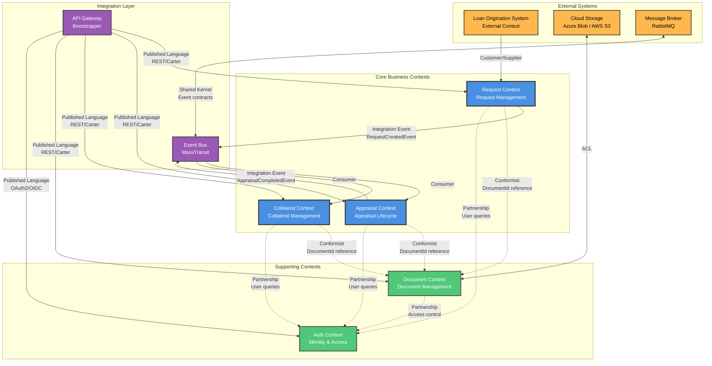

# Context Map - Collateral Appraisal System

## Overview

This Context Map shows the bounded contexts (modules) in the Collateral Appraisal System and their integration patterns. The system follows Domain-Driven Design principles with a modular monolith architecture.

## Context Map Diagram



## Bounded Contexts

### Core Business Contexts

#### 1. Request Context (Request Module)
- **Purpose**: Manage appraisal requests from creation to submission
- **Language**: Request, RequestNumber, RequestStatus, TitleDeed, RequestDocument
- **Team**: Request Management Team
- **Database Schema**: `request.*`

#### 2. Appraisal Context (Appraisal Module)
- **Purpose**: Handle complete appraisal lifecycle from assignment to completion
- **Language**: Appraisal, AppraisalNumber, FieldSurvey, ValuationAnalysis, GalleryPhoto, PropertyDetail
- **Team**: Appraisal Team
- **Database Schema**: `appraisal.*`

#### 3. Collateral Context (Collateral Module)
- **Purpose**: Maintain collateral records post-appraisal completion
- **Language**: Collateral, CollateralNumber, CollateralStatus, ValuationHistory, Revaluation
- **Team**: Collateral Management Team
- **Database Schema**: `collateral.*`

### Supporting Contexts

#### 4. Document Context (Document Module)
- **Purpose**: Centralized document management with versioning and access control
- **Language**: Document, DocumentNumber, DocumentVersion, DocumentAccess, StorageProvider
- **Team**: Infrastructure Team
- **Database Schema**: `document.*`

#### 5. Auth Context (Auth Module)
- **Purpose**: User management, authentication, and authorization
- **Language**: User, Role, Permission, Organization, AuditLog, SecurityPolicy
- **Team**: Security Team
- **Database Schema**: `auth.*`

## Integration Patterns

### 1. Customer/Supplier (Request ← LOS)
- **Pattern**: Customer/Supplier
- **Direction**: LOS (Upstream) → Request (Downstream)
- **Description**: Loan Origination System provides request data to Request module
- **Integration**: REST API or Event-based
- **Conformist**: Request module accepts LOS data model

### 2. Integration Events (Request → Appraisal)
- **Pattern**: Integration Events via Event Bus
- **Direction**: Request → Appraisal
- **Event**: `RequestCreatedEvent`
- **Trigger**: When RM submits a request
- **Consumer**: Appraisal module creates appraisal record
- **Infrastructure**: MassTransit + RabbitMQ

### 3. Integration Events (Appraisal → Collateral)
- **Pattern**: Integration Events via Event Bus
- **Direction**: Appraisal → Collateral
- **Event**: `AppraisalCompletedEvent`
- **Trigger**: When appraisal is approved by committee
- **Consumer**: Collateral module creates collateral record
- **Infrastructure**: MassTransit + RabbitMQ

### 4. Conformist (All → Document)
- **Pattern**: Conformist
- **Direction**: Request, Appraisal, Collateral → Document
- **Description**: All modules store DocumentId references without owning documents
- **Integration**: Direct reference to `document.Documents.Id`
- **No FK constraints**: Cross-module references stored as GUIDs only
- **Access**: Via Document module API for CRUD operations

### 5. Partnership (All → Auth)
- **Pattern**: Partnership
- **Direction**: All modules ↔ Auth
- **Description**: Mutual dependency for authentication and authorization
- **Integration**:
  - Direct queries for user information
  - UserId stored in audit fields
  - Permission checks via Auth module API
- **Shared**: User identity concept across all modules

### 6. Anticorruption Layer (Document ↔ Cloud Storage)
- **Pattern**: Anticorruption Layer (ACL)
- **Direction**: Document ↔ Azure Blob / AWS S3
- **Description**: Document module translates between internal model and cloud provider APIs
- **Purpose**: Protect domain model from external storage provider changes
- **Abstraction**: `IStorageProvider` interface with Azure/AWS implementations

### 7. Published Language (API Gateway)
- **Pattern**: Published Language
- **Description**: RESTful API with Carter endpoints exposed via API Gateway
- **Format**: JSON over HTTP/HTTPS
- **Documentation**: OpenAPI/Swagger
- **Contracts**: Well-defined request/response DTOs

### 8. Shared Kernel (Event Bus)
- **Pattern**: Shared Kernel
- **Shared Components**:
  - Integration event contracts
  - Common value objects (Money, Address, ContactInfo)
  - Domain event interfaces
  - Result types
- **Agreement**: All teams agree on event schemas and value object structures

## Context Responsibilities

| Context | Aggregate Roots | Key Responsibilities | External Dependencies |
|---------|----------------|---------------------|---------------------|
| **Request** | Request | • Create/manage requests<br/>• Track customers & properties<br/>• Store title deed info<br/>• Publish RequestCreatedEvent | • LOS integration<br/>• Document storage<br/>• User authentication |
| **Appraisal** | Appraisal | • Assignment tracking<br/>• Field surveys<br/>• Photo gallery (2-phase)<br/>• Property details (6 types)<br/>• Valuation analysis<br/>• Review workflow<br/>• Publish AppraisalCompletedEvent | • Document storage<br/>• User authentication |
| **Collateral** | Collateral | • Collateral lifecycle<br/>• Valuation history<br/>• Revaluation scheduling<br/>• Risk monitoring | • Document storage<br/>• User authentication |
| **Document** | Document | • Document storage<br/>• Version control<br/>• Access control<br/>• Audit logging | • Cloud storage (Azure/AWS)<br/>• User authentication |
| **Auth** | User | • User management<br/>• Authentication (OAuth2/OIDC)<br/>• Authorization (RBAC)<br/>• Organization management<br/>• Audit logging | • OpenIddict<br/>• External identity providers |

## Cross-Module Communication Rules

### 1. No Direct Database Joins
- ❌ **Forbidden**: SELECT from `request.Requests` JOIN `appraisal.Appraisals`
- ✅ **Allowed**: Store RequestId in Appraisal, query via API or events

### 2. Event-Driven Integration
- ✅ **Primary Pattern**: Integration events via MassTransit/RabbitMQ
- ✅ **Asynchronous**: Non-blocking communication
- ✅ **Resilient**: Automatic retries and dead-letter queues

### 3. Reference Data Storage
- ✅ **Store IDs**: Store GUIDs for cross-module references (RequestId, AppraisalId, DocumentId, UserId)
- ✅ **Store Names**: Store denormalized display names for UI purposes
- ✅ **No FK Constraints**: No database foreign keys across modules

### 4. Eventual Consistency
- ✅ **Accept**: Data across modules is eventually consistent
- ✅ **Handle**: Design for temporary inconsistencies
- ✅ **Compensate**: Use sagas for distributed transactions

## Team Organization

```
┌─────────────────────────────────────────────────────┐
│              Product Owner / Architect               │
└─────────────────────────────────────────────────────┘
                          │
    ┌─────────────────────┼─────────────────────┐
    │                     │                     │
┌───▼────────┐    ┌──────▼──────┐    ┌────────▼────────┐
│  Request   │    │  Appraisal  │    │   Collateral    │
│   Team     │    │    Team     │    │     Team        │
│            │    │             │    │                 │
│ • RM       │    │ • Appraiser │    │ • Analyst       │
│ • Dev (2)  │    │ • Dev (3)   │    │ • Dev (2)       │
│ • QA (1)   │    │ • QA (1)    │    │ • QA (1)        │
└────────────┘    └─────────────┘    └─────────────────┘

┌──────────────────────────────────────────────────────┐
│            Infrastructure / Platform Team             │
│                                                       │
│  • Document Module (Dev 1, QA 1)                     │
│  • Auth Module (Dev 2, QA 1)                         │
│  • DevOps (2)                                        │
│  • Security (1)                                      │
└──────────────────────────────────────────────────────┘
```

## Module Evolution Path

### Phase 1: Current State (Modular Monolith)
- All modules in single deployment
- Shared database instance (separate schemas)
- In-process event bus option
- Simplified operations

### Phase 2: Logical Separation
- Clear module boundaries enforced
- Integration events mandatory
- Independent testing
- Team autonomy

### Phase 3: Microservices (if needed)
- Extract modules to separate services
- Deploy independently
- Scale independently
- Distributed tracing required

**Decision Criteria for Phase 3**:
- Different scaling needs
- Team velocity bottlenecks
- Technology diversity needs
- Independent deployment requirements

## Context Map Legend

| Symbol | Pattern | Description |
|--------|---------|-------------|
| **→** | Customer/Supplier | Upstream team defines API, downstream consumes |
| **↔** | Partnership | Teams coordinate and share responsibility |
| **-.->** | Conformist | Downstream adopts upstream model |
| **ACL** | Anticorruption Layer | Translation layer protects domain model |
| **U/D** | Upstream/Downstream | Direction of influence |
| **PL** | Published Language | Well-defined public contract |
| **SK** | Shared Kernel | Shared code agreed by teams |

## Communication Protocols

### Synchronous
- **REST API**: Carter endpoints via API Gateway
- **Use Cases**: Read operations, commands requiring immediate response
- **Authentication**: OAuth2 Bearer tokens

### Asynchronous
- **Event Bus**: MassTransit + RabbitMQ
- **Use Cases**: Cross-module workflows, long-running processes
- **Guarantee**: At-least-once delivery

### Data Access
- **Within Module**: Direct database queries via EF Core
- **Cross-Module**: API calls or event queries
- **Caching**: Redis for frequently accessed reference data

## Anti-Patterns to Avoid

❌ **Shared Database**: Direct queries across schemas
❌ **Distributed Monolith**: Microservices with tight coupling
❌ **Chatty Communication**: Excessive synchronous API calls
❌ **God Module**: One module knowing too much about others
❌ **Bypass Events**: Direct module-to-module API calls for business flows

## Success Metrics

✅ **Module Independence**: Can develop/test/deploy modules independently
✅ **Clear Boundaries**: No accidental coupling between modules
✅ **Event-Driven**: 80%+ of cross-module communication via events
✅ **Team Autonomy**: Teams can make decisions within their context
✅ **Performance**: Sub-second response times for critical paths

---

**Next**: [02-event-flow-diagram.md](02-event-flow-diagram.md) - See how domain events flow between contexts
