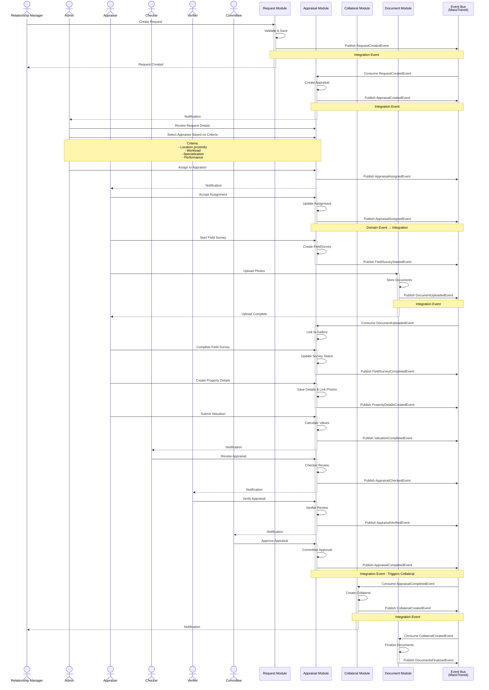

# Event Flow Diagram - Collateral Appraisal System

## Overview

This diagram shows how domain events and integration events flow through the Collateral Appraisal System, enabling loose coupling and asynchronous communication between bounded contexts.

## Complete Event Flow



## Event Categories

### 1. Request Module Events

#### Integration Events (Published)

| Event | Trigger | Consumers | Purpose |
|-------|---------|-----------|---------|
| **RequestCreatedEvent** | Request submitted | Appraisal Module | Trigger appraisal creation |
| **RequestSubmittedEvent** | RM submits request | Notification Service | Notify stakeholders |
| **RequestCancelledEvent** | Request cancelled | Appraisal, Notification | Cleanup and notifications |
| **RequestUpdatedEvent** | Request details changed | Appraisal Module | Sync updated information |

#### Domain Events (Internal)

| Event | Trigger | Handlers | Purpose |
|-------|---------|----------|---------|
| **TitleDeedInfoAddedEvent** | Title deed saved | Validation Handler | Validate deed information |
| **CustomerAddedEvent** | Customer added | Audit Handler | Log customer addition |
| **DocumentAttachedEvent** | Document linked | Document Sync Handler | Update document relationships |

### 2. Appraisal Module Events

#### Integration Events (Published)

| Event | Trigger | Consumers | Purpose |
|-------|---------|-----------|---------|
| **AppraisalCreatedEvent** | Appraisal created | Notification Service | Notify admin for assignment |
| **AppraisalAssignedEvent** | Admin assigns appraiser | Notification, Calendar | Schedule and notify appraiser |
| **FieldSurveyStartedEvent** | Survey started | Mobile App, GPS Tracking | Enable location tracking |
| **FieldSurveyCompletedEvent** | Survey finished | Notification Service | Alert for office work |
| **ValuationCompletedEvent** | Valuation done | Workflow Engine | Trigger review process |
| **AppraisalCheckedEvent** | Checker approved | Notification Service | Notify verifier |
| **AppraisalVerifiedEvent** | Verifier approved | Notification Service | Notify committee |
| **AppraisalCompletedEvent** | Committee approved | Collateral Module | **Create collateral record** |
| **AppraisalRejectedEvent** | Review rejected | Notification, Appraisal | Reassign or fix |

#### Domain Events (Internal)

| Event | Trigger | Handlers | Purpose |
|-------|---------|----------|---------|
| **PhotoUploadedToGalleryEvent** | Photo added | Thumbnail Generator | Create thumbnails |
| **PhotoLinkedToPropertyEvent** | Photo mapped | Report Generator | Update report |
| **PropertyDetailsCompletedEvent** | Details saved | Validation Handler | Validate completeness |
| **ComparablePropertyAddedEvent** | Comparable added | Valuation Calculator | Recalculate values |

### 3. Collateral Module Events

#### Integration Events (Published)

| Event | Trigger | Consumers | Purpose |
|-------|---------|-----------|---------|
| **CollateralCreatedEvent** | Collateral created | LOS, Document, Notification | Update loan system |
| **CollateralRevaluationScheduledEvent** | Revaluation due | Scheduler, Notification | Create new appraisal request |
| **CollateralValueChangedEvent** | Value updated | Risk Management, LOS | Update risk assessments |
| **CollateralDisposedEvent** | Collateral disposed | LOS, Document | Update loan records |

#### Domain Events (Internal)

| Event | Trigger | Handlers | Purpose |
|-------|---------|----------|---------|
| **ValuationHistoryAddedEvent** | History record added | Analytics Handler | Update statistics |
| **RiskRatingChangedEvent** | Risk level changed | Alert Handler | Trigger risk alerts |

### 4. Document Module Events

#### Integration Events (Published)

| Event | Trigger | Consumers | Purpose |
|-------|---------|-----------|---------|
| **DocumentUploadedEvent** | File uploaded | Virus Scanner, Appraisal | Scan and link |
| **DocumentVersionCreatedEvent** | New version | Notification Service | Alert document owner |
| **DocumentAccessGrantedEvent** | Access given | Audit Service | Log access grant |
| **DocumentAccessRevokedEvent** | Access removed | Notification Service | Alert affected users |
| **DocumentsFinalizedEvent** | Collateral docs ready | Archive Service | Archive documents |

#### Domain Events (Internal)

| Event | Trigger | Handlers | Purpose |
|-------|---------|----------|---------|
| **DocumentMetadataUpdatedEvent** | Metadata changed | Search Indexer | Update search index |
| **DocumentAccessedEvent** | File viewed | Audit Logger | Log access |

### 5. Auth Module Events

#### Integration Events (Published)

| Event | Trigger | Consumers | Purpose |
|-------|---------|-----------|---------|
| **UserCreatedEvent** | New user | Email Service, Notification | Send welcome email |
| **UserRoleAssignedEvent** | Role assigned | Cache Service, All Modules | Invalidate permission cache |
| **UserPermissionChangedEvent** | Permission updated | Cache Service | Update authorization cache |
| **UserLoginEvent** | User logged in | Analytics, Audit | Track usage |
| **UserLogoutEvent** | User logged out | Session Service | Clean up sessions |
| **UnauthorizedAccessEvent** | Access denied | Security Service, Audit | Security monitoring |
| **PasswordChangedEvent** | Password updated | Email Service | Send confirmation |

#### Domain Events (Internal)

| Event | Trigger | Handlers | Purpose |
|-------|---------|----------|---------|
| **UserLockedOutEvent** | Too many failures | Alert Handler | Security alert |
| **TwoFactorEnabledEvent** | 2FA activated | Audit Logger | Log security change |

## Event Processing Patterns

### 1. Fire and Forget
```
Publisher → Event Bus → Consumer(s)
             ↓
           (Async)
```
- **Use Case**: Notifications, audit logging
- **Guarantee**: At-least-once delivery
- **Retry**: Automatic with exponential backoff

### 2. Request-Response via Events
```
Publisher → Request Event → Event Bus → Consumer
                                ↓
Publisher ← Response Event ← Event Bus ← Consumer
```
- **Use Case**: Validation requests, data queries
- **Timeout**: 30 seconds default
- **Fallback**: Return error or cached data

### 3. Choreography (Saga Pattern)
```
Request → Event1 → Appraisal → Event2 → Collateral → Event3 → Complete
   ↓                 ↓                      ↓
Compensate1      Compensate2            Compensate3
```
- **Use Case**: Multi-step workflows
- **Coordination**: Via events (no central orchestrator)
- **Compensation**: Reverse events on failure

### 4. Publish-Subscribe
```
Publisher → Event Bus → Consumer1
                     ├→ Consumer2
                     └→ Consumer3
```
- **Use Case**: Same event to multiple consumers
- **Examples**: AppraisalCompletedEvent consumed by Collateral, Document, and Notification

## Event Schema Examples

### RequestCreatedEvent

```json
{
  "eventId": "3fa85f64-5717-4562-b3fc-2c963f66afa6",
  "eventType": "RequestCreatedEvent",
  "version": "1.0",
  "timestamp": "2025-01-05T10:30:00Z",
  "correlationId": "req-12345-correlation",
  "data": {
    "requestId": "3fa85f64-5717-4562-b3fc-2c963f66afa6",
    "requestNumber": "REQ-2025-00123",
    "requestDate": "2025-01-05T10:30:00Z",
    "requestedBy": "3fa85f64-5717-4562-b3fc-2c963f66afa6",
    "requestedByName": "John Smith",
    "priority": "Normal",
    "propertyTypes": ["Land", "Building"],
    "loanAmount": 5000000.00,
    "currency": "THB",
    "dueDate": "2025-01-15T00:00:00Z",
    "province": "Bangkok",
    "district": "Chatuchak"
  },
  "metadata": {
    "userId": "3fa85f64-5717-4562-b3fc-2c963f66afa6",
    "ipAddress": "10.0.0.1",
    "userAgent": "Mozilla/5.0..."
  }
}
```

### AppraisalCompletedEvent

```json
{
  "eventId": "7fa85f64-5717-4562-b3fc-2c963f66afa7",
  "eventType": "AppraisalCompletedEvent",
  "version": "1.0",
  "timestamp": "2025-01-10T15:45:00Z",
  "correlationId": "req-12345-correlation",
  "data": {
    "appraisalId": "7fa85f64-5717-4562-b3fc-2c963f66afa7",
    "appraisalNumber": "APR-2025-00089",
    "requestId": "3fa85f64-5717-4562-b3fc-2c963f66afa6",
    "requestNumber": "REQ-2025-00123",
    "completedDate": "2025-01-10T15:45:00Z",
    "completedBy": "8fa85f64-5717-4562-b3fc-2c963f66afa8",
    "completedByName": "Jane Appraiser",
    "propertyType": "LandAndBuilding",
    "valuation": {
      "marketValue": 6500000.00,
      "appraisedValue": 6000000.00,
      "forcedSaleValue": 5400000.00,
      "currency": "THB",
      "valuationDate": "2025-01-10"
    },
    "location": {
      "province": "Bangkok",
      "district": "Chatuchak",
      "subDistrict": "Lat Yao"
    }
  },
  "metadata": {
    "userId": "8fa85f64-5717-4562-b3fc-2c963f66afa8",
    "ipAddress": "10.0.0.5",
    "approvalChain": ["Checker", "Verifier", "Committee"]
  }
}
```

## Event Bus Configuration

### MassTransit Settings

```csharp
services.AddMassTransit(x =>
{
    // Configure consumers
    x.AddConsumer<RequestCreatedEventConsumer>();
    x.AddConsumer<AppraisalCompletedEventConsumer>();
    x.AddConsumer<DocumentUploadedEventConsumer>();

    // Configure RabbitMQ
    x.UsingRabbitMq((context, cfg) =>
    {
        cfg.Host("rabbitmq://localhost", h =>
        {
            h.Username("admin");
            h.Password("P@ssw0rd");
        });

        // Retry policy
        cfg.UseMessageRetry(r => r.Exponential(
            retryLimit: 5,
            minInterval: TimeSpan.FromSeconds(2),
            maxInterval: TimeSpan.FromMinutes(5),
            intervalDelta: TimeSpan.FromSeconds(5)
        ));

        // Circuit breaker
        cfg.UseCircuitBreaker(cb =>
        {
            cb.TrackingPeriod = TimeSpan.FromMinutes(1);
            cb.TripThreshold = 15;
            cb.ActiveThreshold = 10;
            cb.ResetInterval = TimeSpan.FromMinutes(5);
        });

        // Configure endpoints
        cfg.ConfigureEndpoints(context);
    });
});
```

### Exchange and Queue Naming

```
Exchange: CollateralAppraisalSystem.Events
├── Queue: request.events.request-created
├── Queue: appraisal.events.request-created
├── Queue: appraisal.events.appraisal-completed
├── Queue: collateral.events.appraisal-completed
├── Queue: document.events.document-uploaded
└── Queue: notification.events.*
```

## Event Ordering Guarantees

### Sequential Processing Required
- ✅ **Same Aggregate**: Events for same aggregate processed in order
- ✅ **Correlation ID**: Use correlation ID to group related events
- ✅ **Partition Key**: Route events for same entity to same queue partition

### Parallel Processing Allowed
- ✅ **Different Aggregates**: Events for different requests can be processed in parallel
- ✅ **Independent Events**: Notification events independent of business events

## Error Handling

### Retry Strategy
```
Attempt 1: Immediate
Attempt 2: 2 seconds
Attempt 3: 7 seconds
Attempt 4: 17 seconds
Attempt 5: 42 seconds
└── Dead Letter Queue (if all retries fail)
```

### Poison Message Handling
1. **Move to Dead Letter**: After 5 failed attempts
2. **Alert**: Notify operations team
3. **Manual Review**: Investigate and fix
4. **Replay**: Republish to main queue if appropriate

### Idempotency
- **Event ID**: Each event has unique ID
- **Deduplication**: Check if event already processed
- **Idempotent Operations**: Design handlers to be safely retried

## Monitoring and Observability

### Metrics to Track
- Event processing time
- Event success/failure rate
- Dead letter queue depth
- Consumer lag
- Retry count distribution

### Distributed Tracing
```
Request Created (Trace ID: abc123)
  ├── Publish RequestCreatedEvent (Span 1)
  ├── Consume RequestCreatedEvent (Span 2)
  ├── Create Appraisal (Span 3)
  ├── Publish AppraisalCreatedEvent (Span 4)
  └── Notification Sent (Span 5)
```

## Event Versioning Strategy

### Version 1.0 → Version 2.0

```json
// V1.0
{
  "requestId": "guid",
  "amount": 5000000
}

// V2.0 (Backward Compatible)
{
  "requestId": "guid",
  "amount": 5000000,
  "currency": "THB",        // New field (optional)
  "loanAmount": 5000000     // Renamed (keep both)
}
```

### Migration Strategy
1. **Add new fields**: Make optional
2. **Deprecate old fields**: Keep for 3 months
3. **Remove old fields**: After all consumers upgraded
4. **Version header**: Include in event metadata

---

**Next**: [03-event-storming.md](03-event-storming.md) - See the event storming workshop results
