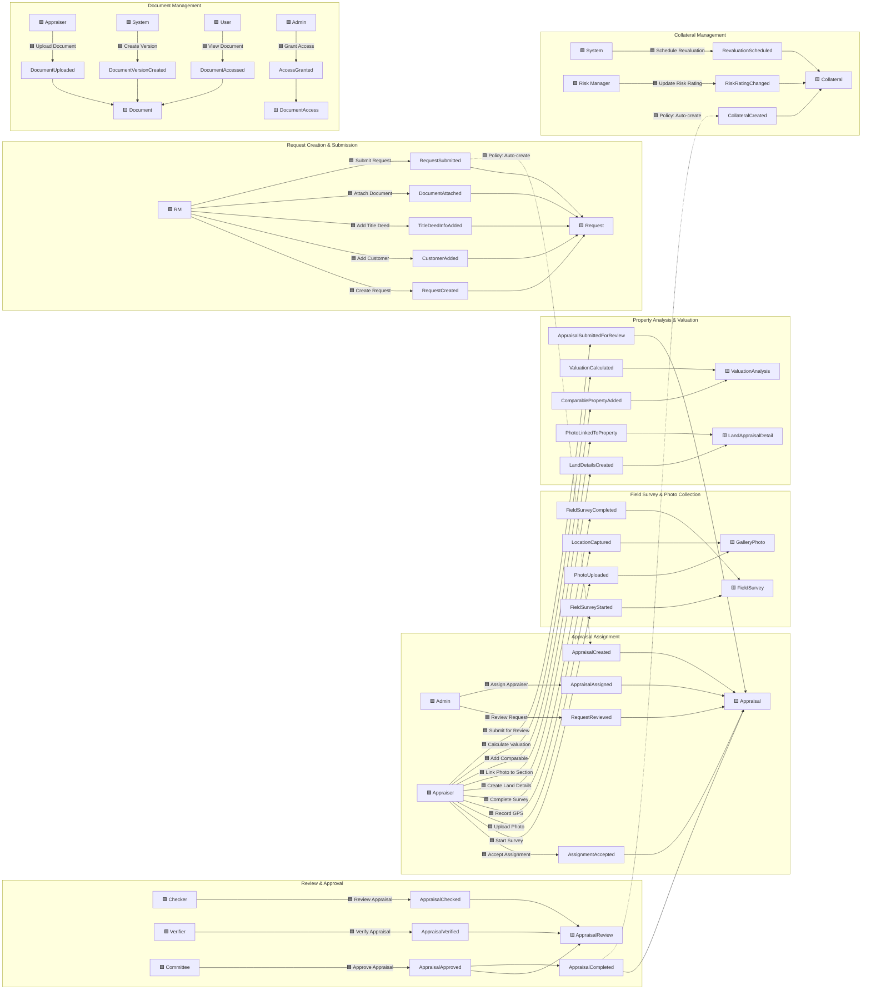

# Event Storming - Collateral Appraisal System

## Overview

This document represents the outcomes of an Event Storming workshop for the Collateral Appraisal System. Event Storming is a collaborative technique to explore complex business domains through domain events, commands, aggregates, and actors.

## Event Storming Legend

| Color | Element | Description |
|-------|---------|-------------|
| 🟧 **Orange** | **Domain Event** | Something that happened in the past (verb in past tense) |
| 🟦 **Blue** | **Command** | Action that causes an event (verb in imperative) |
| 🟨 **Yellow** | **Aggregate** | Cluster of domain objects that enforce business rules |
| 🟩 **Green** | **Actor** | Person or system that triggers commands |
| 🟥 **Red** | **Hotspot** | Issue, question, or point of conflict |
| 🟪 **Purple** | **Policy** | Automated reaction to events ("Whenever X happens, then Y") |
| 📖 **White** | **Read Model** | Information needed to make decisions |
| ⚡ **Lightning** | **External System** | Integration with external services |

## Complete Event Flow Timeline

## Detailed Event Storming Board

### Phase 1: Request Creation (Request Context)

| Actor | Command | Event | Aggregate | Policy | Hotspot |
|-------|---------|-------|-----------|--------|---------|
| 🟩 RM | 🟦 Create Request | 🟧 RequestCreated | 🟨 Request | | |
| 🟩 RM | 🟦 Add Customer | 🟧 CustomerAdded | 🟨 Request | | 🟥 How to handle multiple borrowers? |
| 🟩 RM | 🟦 Add Property Type | 🟧 PropertyTypeAdded | 🟨 Request | | 🟥 Single or multiple properties? |
| 🟩 RM | 🟦 Enter Title Deed | 🟧 TitleDeedInfoAdded | 🟨 Request | | 🟥 Validation rules for deed types? |
| 🟩 RM | 🟦 Attach Document | 🟧 DocumentAttached | 🟨 Request | | |
| 🟩 RM | 🟦 Set Priority | 🟧 PrioritySet | 🟨 Request | | 🟥 SLA based on priority? |
| 🟩 RM | 🟦 Submit Request | 🟧 RequestSubmitted | 🟨 Request | 🟪 Trigger AppraisalCreated | |
| ⚡ LOS | 🟦 Import Request | 🟧 RequestImported | 🟨 Request | | 🟥 Data mapping from LOS? |

**Read Models Needed:**
- 📖 Available Appraisers List
- 📖 Title Deed Validation Rules
- 📖 Document Templates

**Business Rules:**
- Request must have at least one customer
- Request must have at least one property type
- Title deed info required before submission
- Loan amount must be positive

---

### Phase 2: Appraisal Assignment (Appraisal Context)

| Actor | Command | Event | Aggregate | Policy | Hotspot |
|-------|---------|-------|-----------|--------|---------|
| 🟪 System | 🟦 Create Appraisal | 🟧 AppraisalCreated | 🟨 Appraisal | 🟪 When RequestSubmitted | |
| 🟩 Admin | 🟦 Review Request Details | 🟧 RequestReviewed | 🟨 Appraisal | 🟪 Notify Admin for assignment | |
| 🟩 Admin | 🟦 View Assignment Recommendations | 🟧 RecommendationsViewed | 🟨 Appraisal | 🟪 System provides top 5 appraisers | 🟥 Recommendation algorithm accuracy? |
| 🟩 Admin | 🟦 Assign Appraiser | 🟧 AppraisalAssigned | 🟨 Appraisal | 🟪 Manual assignment based on criteria | 🟥 Can admin override recommendations? |
| 🟩 Appraiser | 🟦 Accept Assignment | 🟧 AssignmentAccepted | 🟨 Appraisal | 🟪 Notify RM and Admin | |
| 🟩 Appraiser | 🟦 Reject Assignment | 🟧 AssignmentRejected | 🟨 Appraisal | 🟪 Notify Admin for reassignment | 🟥 Max rejections allowed? |
| 🟩 Admin | 🟦 Reassign | 🟧 AppraisalReassigned | 🟨 Appraisal | 🟪 After rejection | |

**Read Models Needed:**
- 📖 Pending Assignments Dashboard (Admin view)
- 📖 Appraiser Recommendations with Scores
- 📖 Appraiser Workload Dashboard
- 📖 Appraiser Locations & Specializations
- 📖 Request Details with Property Information

**Assignment Criteria:**
- 📊 Location Proximity (40%): Distance from property location
- 📊 Current Workload (30%): Active assignments count
- 📊 Performance Score (20%): Historical quality and timeliness
- 📊 Specialization (10%): Property type expertise

**Business Rules:**
- Admin must review and manually assign all appraisals
- System provides top 5 recommended appraisers with scores
- Admin can override recommendations with justification
- Appraiser must have correct certifications for property type
- Cannot assign to same appraiser twice in a row for same customer
- Due date must be within SLA (5-10 business days)
- Assignment status: PendingAssignment → Assigned → Accepted/Rejected

---

### Phase 3: Field Survey (Appraisal Context)

| Actor | Command | Event | Aggregate | Policy | Hotspot |
|-------|---------|-------|-----------|--------|---------|
| 🟩 Appraiser | 🟦 Schedule Survey | 🟧 SurveyScheduled | 🟨 FieldSurvey | | |
| 🟩 Appraiser | 🟦 Start Survey | 🟧 SurveyStarted | 🟨 FieldSurvey | 🟪 Enable GPS tracking | |
| 🟩 Appraiser | 🟦 Upload Photo | 🟧 PhotoUploaded | 🟨 GalleryPhoto | 🟪 Store in Document module | |
| 🟩 Appraiser | 🟦 Record GPS | 🟧 LocationCaptured | 🟨 GalleryPhoto | 🟪 Auto-capture | |
| 🟩 Appraiser | 🟦 Categorize Photo | 🟧 PhotoCategorized | 🟨 GalleryPhoto | | 🟥 Categories consistent? |
| 🟩 Appraiser | 🟦 Record Video | 🟧 VideoRecorded | 🟨 VideoRecording | | 🟥 Video size limits? |
| 🟩 Appraiser | 🟦 Add Voice Note | 🟧 VoiceNoteAdded | 🟨 AudioNote | | |
| 🟩 Appraiser | 🟦 Complete Survey | 🟧 SurveyCompleted | 🟨 FieldSurvey | 🟪 Notify for office work | |

**Read Models Needed:**
- 📖 Photo Gallery with Thumbnails
- 📖 Survey Checklist
- 📖 GPS Location Map

**Business Rules:**
- Survey must be completed within 3 days of acceptance
- Minimum 10 photos required
- GPS coordinates required for all photos
- Photos must be taken within 100m of property location

---

### Phase 4: Property Analysis (Appraisal Context)

| Actor | Command | Event | Aggregate | Policy | Hotspot |
|-------|---------|-------|-----------|--------|---------|
| 🟩 Appraiser | 🟦 Create Land Details | 🟧 LandDetailsCreated | 🟨 LandAppraisalDetail | | 🟥 Which property type? |
| 🟩 Appraiser | 🟦 Create Building Details | 🟧 BuildingDetailsCreated | 🟨 BuildingAppraisalDetail | | |
| 🟩 Appraiser | 🟦 Create Condo Details | 🟧 CondoDetailsCreated | 🟨 CondoAppraisalDetail | | |
| 🟩 Appraiser | 🟦 Link Photo to Section | 🟧 PhotoLinkedToSection | 🟨 PropertyPhotoMapping | | 🟥 Photo can be reused? |
| 🟩 Appraiser | 🟦 Annotate Photo | 🟧 PhotoAnnotated | 🟨 PhotoAnnotation | | |
| 🟩 Appraiser | 🟦 Mark for Report | 🟧 PhotoMarkedForReport | 🟨 GalleryPhoto | | |

**Read Models Needed:**
- 📖 Photo Gallery (filtered by category)
- 📖 Property Detail Form (type-specific)
- 📖 Photo Mapping View

**Business Rules:**
- One property detail per property type
- Photos can be linked to multiple sections
- All critical sections must have at least one photo

---

### Phase 5: Valuation Analysis (Appraisal Context)

| Actor | Command | Event | Aggregate | Policy | Hotspot |
|-------|---------|-------|-----------|--------|---------|
| 🟩 Appraiser | 🟦 Add Comparable | 🟧 ComparableAdded | 🟨 ValuationAnalysis | | 🟥 Min comparables? |
| 🟩 Appraiser | 🟦 Apply Adjustments | 🟧 AdjustmentsApplied | 🟨 ValuationAnalysis | | |
| 🟩 Appraiser | 🟦 Calculate Market Value | 🟧 MarketValueCalculated | 🟨 ValuationAnalysis | 🟪 Auto-calculate | |
| 🟩 Appraiser | 🟦 Set Appraised Value | 🟧 AppraisedValueSet | 🟨 ValuationAnalysis | | 🟥 Must be <= Market? |
| 🟩 Appraiser | 🟦 Calculate Forced Sale | 🟧 ForcedSaleValueCalculated | 🟨 ValuationAnalysis | 🟪 80% of appraised | |
| 🟩 Appraiser | 🟦 Generate Report | 🟧 ReportGenerated | 🟨 AppraisalReport | | |
| 🟩 Appraiser | 🟦 Submit for Review | 🟧 SubmittedForReview | 🟨 Appraisal | 🟪 Notify Checker | |

**Read Models Needed:**
- 📖 Comparable Properties Database
- 📖 Market Price Trends
- 📖 Valuation Calculator

**Business Rules:**
- Minimum 3 comparable properties required
- Market value must be within 20% of comparables average
- Appraised value ≤ Market value
- Forced sale value = 80% of appraised value (default)

---

### Phase 6: Review & Approval (Appraisal Context)

| Actor | Command | Event | Aggregate | Policy | Hotspot |
|-------|---------|-------|-----------|--------|---------|
| 🟩 Checker | 🟦 Review Appraisal | 🟧 AppraisalReviewed | 🟨 AppraisalReview | | |
| 🟩 Checker | 🟦 Approve (Checker) | 🟧 CheckerApproved | 🟨 AppraisalReview | 🟪 Notify Verifier | |
| 🟩 Checker | 🟦 Reject (Checker) | 🟧 CheckerRejected | 🟨 AppraisalReview | 🟪 Return to Appraiser | 🟥 Max rejections? |
| 🟩 Verifier | 🟦 Verify Appraisal | 🟧 AppraisalVerified | 🟨 AppraisalReview | 🟪 Notify Committee | |
| 🟩 Verifier | 🟦 Reject (Verifier) | 🟧 VerifierRejected | 🟨 AppraisalReview | 🟪 Return to Appraiser | |
| 🟩 Committee | 🟦 Approve (Committee) | 🟧 CommitteeApproved | 🟨 AppraisalReview | | |
| 🟩 Committee | 🟦 Final Approval | 🟧 AppraisalCompleted | 🟨 Appraisal | 🟪 Trigger CollateralCreated | |
| 🟩 Committee | 🟦 Reject (Committee) | 🟧 CommitteeRejected | 🟨 AppraisalReview | 🟪 Return to Appraiser | |

**Read Models Needed:**
- 📖 Appraisal Review Checklist
- 📖 Approval History
- 📖 Committee Member Assignments

**Business Rules:**
- Sequential review: Checker → Verifier → Committee
- Each level can approve or reject (not both)
- Rejection requires detailed reason
- Maximum 2 rejections, then escalate to supervisor

---

### Phase 7: Collateral Creation (Collateral Context)

| Actor | Command | Event | Aggregate | Policy | Hotspot |
|-------|---------|-------|-----------|--------|---------|
| 🟪 System | 🟦 Create Collateral | 🟧 CollateralCreated | 🟨 Collateral | 🟪 When AppraisalCompleted | |
| 🟪 System | 🟦 Copy Valuation | 🟧 ValuationCopied | 🟨 Collateral | 🟪 From appraisal | |
| 🟪 System | 🟦 Schedule Revaluation | 🟧 RevaluationScheduled | 🟨 Collateral | 🟪 Based on policy (12 months) | |
| 🟩 Risk Manager | 🟦 Assess Risk | 🟧 RiskAssessed | 🟨 Collateral | | |
| 🟩 Risk Manager | 🟦 Update Risk Rating | 🟧 RiskRatingChanged | 🟨 Collateral | 🟪 Alert if High risk | 🟥 Risk calculation? |
| 🟩 Admin | 🟦 Dispose Collateral | 🟧 CollateralDisposed | 🟨 Collateral | 🟪 Notify LOS | |

**Read Models Needed:**
- 📖 Collateral Portfolio
- 📖 Valuation History
- 📖 Risk Assessment Dashboard

**Business Rules:**
- Collateral activated immediately after creation
- Revaluation required every 12 months (configurable)
- Risk rating based on value change and market conditions

---

### Phase 8: Document Management (Document Context)

| Actor | Command | Event | Aggregate | Policy | Hotspot |
|-------|---------|-------|-----------|--------|---------|
| 🟩 User | 🟦 Upload Document | 🟧 DocumentUploaded | 🟨 Document | 🟪 Virus scan | |
| 🟪 System | 🟦 Scan for Virus | 🟧 DocumentScanned | 🟨 Document | 🟪 If clean, proceed | 🟥 Quarantine process? |
| 🟪 System | 🟦 Generate Thumbnail | 🟧 ThumbnailGenerated | 🟨 Document | 🟪 For images | |
| 🟩 User | 🟦 Create New Version | 🟧 VersionCreated | 🟨 DocumentVersion | | |
| 🟩 Admin | 🟦 Grant Access | 🟧 AccessGranted | 🟨 DocumentAccess | | |
| 🟩 Admin | 🟦 Revoke Access | 🟧 AccessRevoked | 🟨 DocumentAccess | 🟪 Notify user | |
| 🟩 User | 🟦 View Document | 🟧 DocumentAccessed | 🟨 Document | 🟪 Log access | |
| 🟩 User | 🟦 Download Document | 🟧 DocumentDownloaded | 🟨 Document | 🟪 Log access | |

**Read Models Needed:**
- 📖 Document Library
- 📖 Access Permissions Matrix
- 📖 Document Access Logs

**Business Rules:**
- All uploads must pass virus scan
- Maximum file size: 100MB
- Version history maintained for 7 years
- Access logs retained for compliance

---

### Phase 9: Authentication (Auth Context)

| Actor | Command | Event | Aggregate | Policy | Hotspot |
|-------|---------|-------|-----------|--------|---------|
| 🟩 User | 🟦 Login | 🟧 UserLoggedIn | 🟨 User | 🟪 Create session | |
| 🟩 User | 🟦 Logout | 🟧 UserLoggedOut | 🟨 User | 🟪 Clear session | |
| 🟩 Admin | 🟦 Create User | 🟧 UserCreated | 🟨 User | 🟪 Send welcome email | |
| 🟩 Admin | 🟦 Assign Role | 🟧 RoleAssigned | 🟨 UserRole | 🟪 Invalidate cache | |
| 🟩 Admin | 🟦 Grant Permission | 🟧 PermissionGranted | 🟨 UserPermission | 🟪 Invalidate cache | |
| 🟪 System | 🟦 Lock Account | 🟧 AccountLocked | 🟨 User | 🟪 After 5 failed logins | 🟥 Unlock process? |
| 🟩 User | 🟦 Change Password | 🟧 PasswordChanged | 🟨 User | 🟪 Force re-login | |

**Read Models Needed:**
- 📖 User Directory
- 📖 Permission Matrix
- 📖 Login History

**Business Rules:**
- Password must meet complexity requirements
- Account locked after 5 failed login attempts
- Session expires after 30 minutes of inactivity
- Password expires after 90 days

---

## Hotspots & Questions

### Critical Hotspots (🟥)

1. **Multiple Properties per Request**
   - Q: Can one request include multiple property types?
   - A: Yes, using RequestPropertyTypes table (1:many)

2. **Photo Linking Strategy**
   - Q: Can same photo be linked to multiple property sections?
   - A: Yes, via PropertyPhotoMappings (many-to-many)

3. **Assignment Process**
   - Q: Should assignment be automatic or manual?
   - A: Manual by Admin with system-provided recommendations based on location proximity (40%), workload (30%), performance (20%), and specialization (10%)
   - Admin can override recommendations with justification notes

4. **Valuation Bounds**
   - Q: Must appraised value be ≤ market value?
   - A: Yes, business rule enforced in aggregate

5. **Review Rejection Limits**
   - Q: How many times can appraisal be rejected?
   - A: Maximum 2 rejections per level, then escalate

6. **Document Virus Quarantine**
   - Q: What happens to infected files?
   - A: Move to quarantine, alert security team, notify uploader

---

## Policies (Automated Reactions)

| Trigger Event | Policy | Action |
|---------------|--------|--------|
| RequestSubmitted | Auto-create appraisal | Create Appraisal record with status PendingAssignment |
| AppraisalCreated | Notify admin for assignment | Send notification to Admin dashboard |
| AdminViewsRecommendations | Calculate recommendations | Score appraisers by location, workload, performance, specialization |
| AssignmentRejected | Notify admin for reassignment | Send alert to Admin to manually reassign |
| SurveyCompleted | Notify for office work | Send push notification |
| CheckerApproved | Notify verifier | Email + in-app notification |
| VerifierApproved | Notify committee | Email + in-app notification |
| AppraisalCompleted | Create collateral | Create Collateral record |
| CollateralCreated | Schedule revaluation | Create calendar event (12 months) |
| DocumentUploaded | Virus scan | Submit to antivirus service |
| DocumentScanned (clean) | Generate thumbnail | For image files |
| DocumentAccessed | Log access | Create audit log entry |
| LoginFailed (5x) | Lock account | Set LockoutEnd date |
| PasswordChanged | Force re-login | Invalidate all sessions |

---

## Aggregates & Their Boundaries

| Aggregate | Entities Within | Value Objects | Invariants |
|-----------|----------------|---------------|------------|
| **Request** | Request RequestCustomer RequestPropertyType RequestDocument TitleDeedInfo RequestStatusHistory | RequestDetail Contact | • At least 1 customer • At least 1 property type • Valid status transitions |
| **Appraisal** | Appraisal AppraisalAssignment FieldSurvey PropertyInformation ValuationAnalysis AppraisalReport AppraisalReview | TimeSlot Location | • One assignment at a time • Sequential review process • Cannot complete without valuation |
| **GalleryPhoto** | GalleryPhoto PhotoAnnotation | Location PhotoMetadata | • GPS required • Valid category |
| **PropertyDetail** | LandAppraisalDetail BuildingAppraisalDetail (etc.) | LandArea Dimensions | • Type-specific validations • Required fields per type |
| **Collateral** | Collateral LandCollateral BuildingCollateral (etc.) ValuationHistory | Money | • Active or disposed • Valuation > 0 |
| **Document** | Document DocumentVersion DocumentRelationship DocumentAccess | FileMetadata | • At least 1 version • Valid storage URL |
| **User** | User UserRole UserPermission UserOrganization | ContactInfo | • Unique username/email • Valid password |

---

## External Systems Integration

| System | Integration Type | Events Sent | Events Received |
|--------|-----------------|-------------|-----------------|
| **LOS** | REST API | RequestCreated CollateralCreated | RequestImported |
| **Email Service** | SMTP/SendGrid | UserCreated AssignmentNotification | N/A |
| **Cloud Storage** | Azure Blob/AWS S3 | DocumentUploaded | N/A |
| **Antivirus** | REST API | DocumentUploaded | DocumentScanned |
| **Mobile App** | Push Notifications | SurveyScheduled AssignmentCreated | PhotoUploaded LocationCaptured |

---

## Next Steps from Event Storming

1. **Validate with Domain Experts**: Review hotspots and business rules
2. **Prioritize Features**: Use event timeline to identify MVP scope
3. **Define Bounded Contexts**: Confirm context boundaries identified
4. **Design Aggregates**: Implement aggregates with invariants
5. **Implement Events**: Code domain and integration events
6. **Build Read Models**: Create query projections for UI

---

**Next**: [04-sequence-diagrams.md](04-sequence-diagrams.md) - Detailed interaction flows for key scenarios
