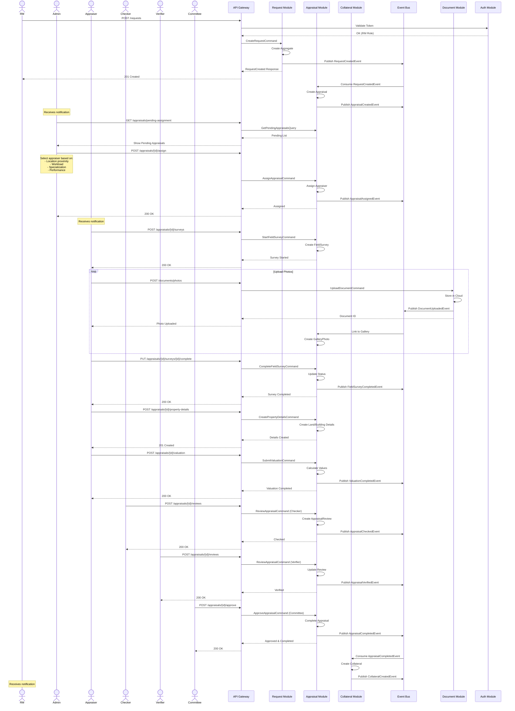
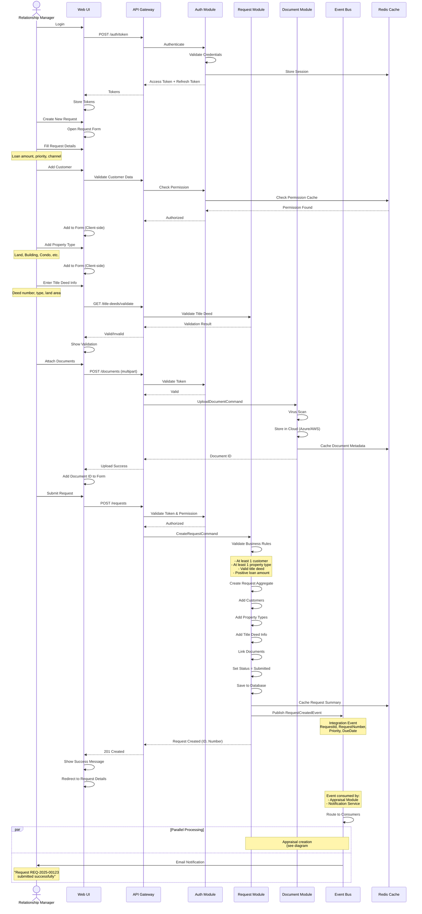

# Sequence Diagrams - Collateral Appraisal System

## Overview

This document contains detailed sequence diagrams for critical workflows in the Collateral Appraisal System. Each diagram shows the temporal ordering of interactions between actors, modules, and external systems.

## Table of Contents

1. [Complete Request-to-Collateral Flow](#1-complete-request-to-collateral-flow)
2. [Request Creation Flow](#2-request-creation-flow)
3. [Appraisal Assignment Flow](#3-appraisal-assignment-flow)
4. [Field Survey & Photo Upload](#4-field-survey--photo-upload)
5. [Property Analysis with Photo Linking](#5-property-analysis-with-photo-linking)
6. [Review & Approval Workflow](#6-review--approval-workflow)
7. [Collateral Creation & Revaluation](#7-collateral-creation--revaluation)
8. [Document Upload with Access Control](#8-document-upload-with-access-control)
9. [User Authentication & Authorization](#9-user-authentication--authorization)

---

## 1. Complete Request-to-Collateral Flow

### Overview
End-to-end flow from request creation to collateral generation.

**Duration**: 7-10 business days (typical)
**Critical Path**: RM Submit → Appraiser Complete → Committee Approve
**Async Events**: 5 integration events

---

## 2. Request Creation Flow

### Overview
RM creates a new appraisal request with customers, property types, and documents.

**Response Time**: < 500ms (synchronous part)
**Validations**: 4 business rules enforced
**Events Published**: 1 integration event (RequestCreatedEvent)

---

## 3. Appraisal Assignment Flow

### Overview
Admin reviews request and manually assigns appraiser based on criteria.

```mermaid
sequenceDiagram
    actor ADMIN as Admin
    actor APP as Appraiser

    participant BUS as Event Bus
    participant UI as Admin UI
    participant API as API Gateway
    participant APR as Appraisal Module
    participant AUTH as Auth Module
    participant NOTIFY as Notification Service
    participant CACHE as Redis Cache

    %% Consume Event
    BUS->>APR: Consume RequestCreatedEvent
    Note over APR: Async consumer triggered

    %% Create Appraisal
    APR->>APR: Map Request to Appraisal
    APR->>APR: Create Appraisal Aggregate
    Note over APR: AppraisalNumber: APR-2025-XXXXX<br/>Status: PendingAssignment<br/>DueDate: RequestDate + 7 days

    APR->>APR: Save to Database
    APR->>BUS: Publish AppraisalCreatedEvent

    %% Notify Admin
    BUS->>NOTIFY: Send Notification
    NOTIFY->>ADMIN: Email + Dashboard Alert
    Note over ADMIN: "New appraisal request<br/>APR-2025-00089<br/>requires assignment"

    %% Admin Reviews Pending Assignments
    ADMIN->>UI: Open Assignment Dashboard
    UI->>API: GET /appraisals/pending-assignment
    API->>AUTH: Validate Token & Permission
    AUTH-->>API: Authorized (Admin Role)

    API->>APR: GetPendingAppraisalsQuery
    APR->>APR: Query WHERE Status = PendingAssignment
    APR-->>API: Pending Appraisals List
    API-->>UI: Show Pending List

    %% Admin Selects Appraisal
    ADMIN->>UI: Select Appraisal for Assignment
    UI->>API: GET /appraisals/{id}/assignment-recommendations
    Note over UI: Request includes:<br/>- Appraisal details<br/>- Recommended appraisers

    API->>APR: GetAppraisalDetailsQuery
    APR-->>API: Property Type, Location, Priority

    %% Get Appraiser Recommendations
    API->>AUTH: Query Available Appraisers
    Note over AUTH: Filter by:<br/>- PropertyType certification<br/>- Location proximity<br/>- Active status<br/>- Admin preferences

    AUTH->>CACHE: Check Cached Appraisers
    alt Cache Hit
        CACHE-->>AUTH: Appraiser List
    else Cache Miss
        AUTH->>AUTH: Query Database
        AUTH->>CACHE: Update Cache (TTL: 5 min)
    end
    AUTH-->>API: Available Appraisers

    %% Get Workload & Calculate Scores
    API->>APR: Get Workload for Appraisers
    loop For Each Appraiser
        APR-->>API: Current Assignments & Stats
    end

    API->>API: Calculate Recommendation Scores
    Note over API: Score = <br/>Location Weight (40%)<br/>+ Workload Weight (30%)<br/>+ Performance Weight (20%)<br/>+ Specialization Weight (10%)

    API->>API: Rank Appraisers by Score
    API-->>UI: Recommended Appraisers List
    Note over UI: Shows:<br/>- Top 5 recommendations<br/>- Current workload<br/>- Distance from property<br/>- Performance rating

    %% Admin Makes Decision
    ADMIN->>UI: Review Recommendations
    ADMIN->>UI: Select Appraiser
    Note over ADMIN: Admin can:<br/>- Choose recommended appraiser<br/>- Override and pick any appraiser<br/>- Add assignment notes

    ADMIN->>UI: Add Assignment Notes (optional)
    Note over ADMIN: E.g., "Rush job", "VIP client"

    ADMIN->>UI: Confirm Assignment

    UI->>API: POST /appraisals/{id}/assign
    Note over API: Body:<br/>{<br/>  appraiserId: "guid",<br/>  assignedBy: "admin-id",<br/>  notes: "...",<br/>  priority: "High"<br/>}

    API->>AUTH: Validate Permission (appraisal.assign)
    AUTH-->>API: Authorized

    API->>APR: AssignAppraisalCommand

    %% Validate Assignment
    APR->>APR: Validate Appraiser Exists
    APR->>APR: Check Appraiser Certifications
    APR->>APR: Verify Appraiser Is Active

    alt Validation Passed
        %% Create Assignment
        APR->>APR: Create AppraisalAssignment
        Note over APR: AssignmentType: Initial<br/>AssignedTo: AppraiserId<br/>AssignedBy: AdminId

        APR->>APR: Update Appraisal
        Note over APR: Status: Assigned<br/>AssignedTo: AppraiserId<br/>AssignedAt: NOW()

        APR->>APR: Save to Database

        %% Invalidate Cache
        APR->>CACHE: Invalidate Pending Appraisals Cache
        APR->>CACHE: Update Appraiser Workload Cache

        %% Publish Event
        APR->>BUS: Publish AppraisalAssignedEvent
        Note over BUS: Integration Event<br/>AppraisalId, AppraiserId,<br/>AssignedBy (Admin)

        APR-->>API: Assignment Successful
        API-->>UI: 200 OK
        UI->>UI: Show Success Message
        UI->>UI: Remove from Pending List

        %% Notification to Appraiser
        BUS->>NOTIFY: Send Notification
        NOTIFY->>NOTIFY: Format Message

        par Parallel Notifications
            NOTIFY->>APP: Send Email
            Note over APP: "New appraisal assigned:<br/>APR-2025-00089<br/>Due: Jan 15, 2025"
        and
            NOTIFY->>APP: Send Push Notification
            Note over APP: Mobile app notification
        and
            NOTIFY->>APP: Create In-App Notification
            Note over APP: Dashboard bell icon
        end

    else Validation Failed
        APR-->>API: 400 Bad Request
        Note over APR: E.g., "Appraiser not certified<br/>for this property type"
        API-->>UI: Show Error
        UI->>UI: Display Validation Error
    end

    %% Appraiser Response Flow
    Note over APP: Appraiser must respond<br/>within 24 hours

    APP->>UI: Open Mobile App / Web Portal
    UI->>API: GET /appraisals/my-assignments
    API->>APR: GetAppraiserAssignmentsQuery
    APR-->>API: Assignment List
    API-->>UI: Show New Assignment

    opt Appraiser Accepts
        APP->>UI: Accept Assignment
        UI->>API: POST /appraisals/{id}/assignments/{id}/accept

        API->>APR: AcceptAssignmentCommand
        APR->>APR: Update AssignmentStatus = Accepted
        APR->>APR: Update Appraisal.Status = InProgress
        APR->>APR: Save to Database

        APR->>BUS: Publish AssignmentAcceptedEvent
        APR-->>API: Accepted
        API-->>UI: 200 OK

        %% Notify Admin
        BUS->>NOTIFY: Send Notification
        NOTIFY->>ADMIN: Email Notification
        Note over ADMIN: "Appraiser John accepted<br/>APR-2025-00089"
    end

    opt Appraiser Rejects
        APP->>UI: Reject Assignment
        APP->>UI: Enter Rejection Reason
        UI->>API: POST /appraisals/{id}/assignments/{id}/reject
        Note over API: Body:<br/>{<br/>  reason: "Overloaded",<br/>  suggestedAppraiser: "guid"<br/>}

        API->>APR: RejectAssignmentCommand
        APR->>APR: Update AssignmentStatus = Rejected
        APR->>APR: Update Appraisal.Status = PendingAssignment
        APR->>APR: Save to Database

        APR->>BUS: Publish AssignmentRejectedEvent
        APR-->>API: Rejected
        API-->>UI: 200 OK

        %% Notify Admin for Reassignment
        BUS->>NOTIFY: Send Notification
        NOTIFY->>ADMIN: Email + Dashboard Alert
        Note over ADMIN: "Assignment rejected by John<br/>Reason: Overloaded<br/>Please reassign APR-2025-00089"

        Note over ADMIN: Admin must reassign<br/>manually to another appraiser
    end
```

**Execution Time**: Manual (depends on admin availability)
**Assignment Method**: Manual selection by admin with system recommendations
**Retry Strategy**: Admin manually reassigns if rejected
**Accountability**: Full audit trail of who assigned to whom and why

---

## 4. Field Survey & Photo Upload

### Overview
Appraiser conducts field survey and uploads photos with GPS metadata.

```mermaid
sequenceDiagram
    actor APP as Appraiser
    participant MOBILE as Mobile App
    participant API as API Gateway
    participant APR as Appraisal Module
    participant DOC as Document Module
    participant CLOUD as Cloud Storage<br/>(Azure/AWS)
    participant BUS as Event Bus

    %% Start Survey
    APP->>MOBILE: Open Assigned Appraisal
    MOBILE->>API: GET /appraisals/{id}
    API->>APR: GetAppraisalQuery
    APR-->>API: Appraisal Details
    API-->>MOBILE: Show Appraisal

    APP->>MOBILE: Start Field Survey
    MOBILE->>API: POST /appraisals/{id}/surveys
    API->>APR: StartFieldSurveyCommand
    APR->>APR: Create FieldSurvey
    APR->>APR: Set Status = InProgress
    APR->>APR: Record StartTime
    APR->>BUS: Publish FieldSurveyStartedEvent
    APR-->>API: Survey Started
    API-->>MOBILE: 200 OK

    MOBILE->>MOBILE: Enable GPS Tracking
    MOBILE->>MOBILE: Start Camera Mode

    %% Photo Upload Loop
    loop Upload Multiple Photos
        APP->>MOBILE: Take Photo
        MOBILE->>MOBILE: Capture Photo
        MOBILE->>MOBILE: Read GPS Coordinates
        MOBILE->>MOBILE: Read Compass Direction
        MOBILE->>MOBILE: Add Timestamp

        APP->>MOBILE: Quick Categorize
        Note over MOBILE: Exterior, Interior,<br/>Land, Defect

        MOBILE->>MOBILE: Create Upload Package
        Note over MOBILE: Photo + Metadata JSON

        MOBILE->>API: POST /documents/photos (multipart)
        Note over MOBILE: Content-Type: multipart/form-data<br/>- photo: binary<br/>- metadata: JSON

        API->>DOC: UploadDocumentCommand

        %% Document Processing
        DOC->>DOC: Generate Document Number
        DOC->>DOC: Validate File Type
        DOC->>DOC: Check File Size (< 10MB)

        DOC->>CLOUD: Upload to Blob Storage
        CLOUD-->>DOC: Storage URL

        DOC->>DOC: Generate Thumbnail
        DOC->>CLOUD: Upload Thumbnail
        CLOUD-->>DOC: Thumbnail URL

        DOC->>DOC: Extract EXIF Data
        Note over DOC: GPS, DateTime, Camera info

        DOC->>DOC: Create Document Record
        DOC->>DOC: Save to Database

        DOC->>BUS: Publish DocumentUploadedEvent
        Note over BUS: DocumentId, AppraisalId,<br/>PhotoType, GPS

        DOC-->>API: Document Created
        API-->>MOBILE: Photo Uploaded (Document ID)

        MOBILE->>MOBILE: Show Upload Progress
        MOBILE->>MOBILE: Cache Photo Locally

        %% Link to Gallery
        BUS->>APR: Consume DocumentUploadedEvent
        APR->>APR: Create/Get AppraisalGallery
        APR->>APR: Create GalleryPhoto
        Note over APR: Link DocumentId<br/>Store GPS, Category<br/>Set DisplayOrder
        APR->>APR: Increment TotalPhotos
        APR->>APR: Save to Database
    end

    %% Voice Note (Optional)
    opt Record Voice Note
        APP->>MOBILE: Record Voice Note
        MOBILE->>MOBILE: Capture Audio
        MOBILE->>API: POST /documents/audio
        API->>DOC: Upload Audio
        DOC->>CLOUD: Store Audio File
        DOC-->>API: Audio Document ID
        API-->>MOBILE: Upload Success

        MOBILE->>API: POST /appraisals/{id}/surveys/{id}/audio-notes
        API->>APR: Add Audio Note
        APR->>APR: Create AudioNote Record
        APR-->>API: Note Added
        API-->>MOBILE: 200 OK
    end

    %% Complete Survey
    APP->>MOBILE: Complete Survey
    MOBILE->>API: PUT /appraisals/{id}/surveys/{id}/complete
    API->>APR: CompleteFieldSurveyCommand

    %% Validation
    APR->>APR: Validate Survey Completion
    Note over APR: Check:<br/>- Min 10 photos<br/>- GPS for all photos<br/>- Photos within 100m radius

    alt Validation Passed
        APR->>APR: Set Status = Completed
        APR->>APR: Record EndTime
        APR->>APR: Calculate Duration
        APR->>BUS: Publish FieldSurveyCompletedEvent
        APR-->>API: Survey Completed
        API-->>MOBILE: 200 OK
        MOBILE->>MOBILE: Show Completion Screen
        MOBILE->>MOBILE: Sync Offline Data
    else Validation Failed
        APR-->>API: 400 Bad Request
        API-->>MOBILE: Validation Errors
        MOBILE->>MOBILE: Show Error Details
        Note over MOBILE: "Please upload at least<br/>10 photos with GPS"
    end

    %% Notification
    BUS->>APP: Push Notification
    Note over APP: "Survey completed.<br/>Proceed to office analysis."
```

**Upload Speed**: 2-5 seconds per photo
**Validation Rules**: Min 10 photos, GPS required, location proximity
**Offline Support**: Photos cached locally, synced when online

---

## 5. Property Analysis with Photo Linking

### Overview
Appraiser creates property details in office and links photos to specific sections (two-phase workflow).

```mermaid
sequenceDiagram
    actor APP as Appraiser
    participant UI as Web UI
    participant API as API Gateway
    participant APR as Appraisal Module
    participant DOC as Document Module
    participant CACHE as Redis Cache

    %% Load Gallery
    APP->>UI: Open Appraisal Details
    UI->>API: GET /appraisals/{id}
    API->>APR: GetAppraisalQuery
    APR-->>API: Appraisal Data
    API-->>UI: Show Appraisal

    APP->>UI: View Photo Gallery
    UI->>API: GET /appraisals/{id}/gallery/photos
    API->>APR: GetGalleryPhotosQuery
    APR->>APR: Query GalleryPhotos
    APR->>CACHE: Check Thumbnail Cache
    alt Cache Hit
        CACHE-->>APR: Thumbnail URLs
    else Cache Miss
        APR->>DOC: Get Thumbnail URLs
        DOC-->>APR: URLs
        APR->>CACHE: Cache (TTL: 1 hour)
    end
    APR-->>API: Photo List with Thumbnails
    API-->>UI: Gallery Data
    UI->>UI: Render Photo Grid

    %% Create Property Details
    APP->>UI: Create Property Details
    Note over APP: Select type:<br/>Land, Building, Condo, etc.

    UI->>UI: Show Property Form
    Note over UI: Type-specific fields<br/>based on selection

    APP->>UI: Fill Property Details
    Note over APP: Land Area: 2-3-50 Rai<br/>Topography: Flat<br/>Utilities: Yes

    %% Save Property Details
    APP->>UI: Save Details
    UI->>API: POST /appraisals/{id}/property-details
    API->>APR: CreatePropertyDetailsCommand

    APR->>APR: Validate Property Type Match
    APR->>APR: Create LandAppraisalDetail
    Note over APR: Save all land-specific<br/>fields to database
    APR->>APR: Save to Database
    APR-->>API: Details Created (DetailId)
    API-->>UI: 201 Created

    %% Photo Linking Interface
    UI->>UI: Show Photo Linking Panel
    Note over UI: Split view:<br/>Left: Property sections<br/>Right: Photo gallery

    %% Link Photos
    loop Link Photos to Sections
        APP->>UI: Drag Photo to Section
        Note over APP: Photo #5 → "Front View"

        UI->>UI: Highlight Section
        UI->>UI: Show Photo Preview

        APP->>UI: Confirm Link

        UI->>API: POST /appraisals/{id}/photo-mappings
        Note over API: Body:<br/>{<br/>  photoId: "guid",<br/>  propertyDetailType: "Land",<br/>  propertyDetailId: "guid",<br/>  sectionReference: "FrontView",<br/>  photoPurpose: "Overview"<br/>}

        API->>APR: LinkPhotoToPropertyCommand

        APR->>APR: Validate Photo Exists
        APR->>APR: Validate Property Detail Exists
        APR->>APR: Create PropertyPhotoMapping
        Note over APR: Polymorphic link:<br/>PhotoId → PropertyDetail

        APR->>APR: Update Photo.IsSelected = true
        APR->>APR: Save to Database
        APR-->>API: Mapping Created
        API-->>UI: 200 OK

        UI->>UI: Update Visual Link
        UI->>UI: Mark Photo as Selected
    end

    %% Annotate Photo
    opt Add Photo Annotation
        APP->>UI: Select Photo
        UI->>UI: Open Annotation Tool

        APP->>UI: Draw Annotation
        Note over APP: Circle defect,<br/>add arrow, text

        APP->>UI: Save Annotation
        UI->>API: POST /appraisals/{id}/photos/{id}/annotations
        Note over API: SVG paths, text, metadata

        API->>APR: CreatePhotoAnnotationCommand
        APR->>APR: Save Annotation Data
        APR-->>API: Annotation Saved
        API-->>UI: 200 OK
        UI->>UI: Render Annotation
    end

    %% Mark for Report
    APP->>UI: Mark Photos for Report
    UI->>UI: Select Multiple Photos

    APP->>UI: Toggle "Include in Report"
    UI->>API: PATCH /appraisals/{id}/photos/bulk-update
    Note over API: Body:<br/>{<br/>  photoIds: [...],<br/>  isUsedInReport: true,<br/>  isFeaturedPhoto: false<br/>}

    API->>APR: UpdatePhotoUsageCommand
    APR->>APR: Update GalleryPhotos
    APR->>APR: Bulk Update Database
    APR-->>API: Updated
    API-->>UI: 200 OK
    UI->>UI: Update Photo Badges

    %% Preview Report
    APP->>UI: Preview Report
    UI->>API: GET /appraisals/{id}/report/preview
    API->>APR: GenerateReportPreviewQuery

    APR->>APR: Get Property Details
    APR->>APR: Get Photos (IsUsedInReport = true)
    APR->>APR: Get Photo Mappings
    APR->>DOC: Get Full-Size Photo URLs
    DOC-->>APR: Photo URLs

    APR->>APR: Generate HTML Preview
    Note over APR: Template engine:<br/>Property details + photos<br/>organized by section

    APR-->>API: HTML Content
    API-->>UI: Report Preview
    UI->>UI: Render Preview

    %% Summary
    Note over APP,UI: Property details created ✓<br/>Photos linked to sections ✓<br/>Annotations added ✓<br/>Report photos selected ✓<br/>Ready for valuation →
```

**User Experience**: Drag-and-drop photo linking
**Photo Reuse**: Same photo can link to multiple sections
**Validation**: All critical sections must have ≥1 photo

---

## 6. Review & Approval Workflow

### Overview
Multi-level review process: Internal Checker → Internal Verifier → Committee Approver.

```mermaid
sequenceDiagram
    actor APP as Appraiser
    actor CHK as Checker
    actor VER as Verifier
    actor COM as Committee

    participant UI as Web UI
    participant API as API Gateway
    participant APR as Appraisal Module
    participant AUTH as Auth Module
    participant BUS as Event Bus
    participant NOTIFY as Notification Service

    %% Appraiser Submits for Review
    APP->>UI: Complete Valuation
    APP->>UI: Submit for Review

    UI->>API: POST /appraisals/{id}/submit-for-review
    API->>AUTH: Validate Permission
    AUTH-->>API: Authorized

    API->>APR: SubmitForReviewCommand
    APR->>APR: Validate Completeness
    Note over APR: Check:<br/>- Property details exist<br/>- Valuation completed<br/>- Min photos met<br/>- All required fields

    alt Validation Passed
        APR->>APR: Update Status = UnderReview
        APR->>APR: Create AppraisalReview (Checker level)
        APR->>APR: Set ReviewSequence = 1
        APR->>BUS: Publish AppraisalSubmittedForReviewEvent
        APR-->>API: Submitted Successfully
        API-->>UI: 200 OK
        UI->>UI: Show Success Message

        %% Notify Checker
        BUS->>NOTIFY: Send Notification
        NOTIFY->>CHK: Email + Push Notification
        Note over CHK: "New appraisal ready<br/>for review: APR-2025-00089"
    else Validation Failed
        APR-->>API: 400 Bad Request
        API-->>UI: Validation Errors
        UI->>UI: Show Error Details
    end

    %% Checker Review
    CHK->>UI: Open Review Queue
    UI->>API: GET /appraisals/reviews/pending?level=Checker
    API->>APR: GetPendingReviewsQuery
    APR-->>API: Review List
    API-->>UI: Show Pending Reviews

    CHK->>UI: Open Appraisal Review
    UI->>API: GET /appraisals/{id}/review-details
    API->>APR: GetAppraisalForReviewQuery
    APR-->>API: Full Appraisal Data
    API-->>UI: Show Review Screen

    Note over CHK,UI: Review checklist:<br/>- Property details accuracy<br/>- Photo quality/relevance<br/>- Valuation methodology<br/>- Comparable properties<br/>- Legal compliance

    alt Checker Approves
        CHK->>UI: Add Review Comments
        CHK->>UI: Approve

        UI->>API: POST /appraisals/{id}/reviews/approve
        API->>APR: ApproveReviewCommand

        APR->>APR: Update AppraisalReview
        APR->>APR: Set ReviewStatus = Approved
        APR->>APR: Set ReviewedBy, ReviewedAt
        APR->>APR: Create Next Review (Verifier level)
        APR->>APR: Set ReviewSequence = 2

        APR->>BUS: Publish AppraisalCheckedEvent
        APR-->>API: Review Approved
        API-->>UI: 200 OK

        %% Notify Verifier
        BUS->>NOTIFY: Send Notification
        NOTIFY->>VER: Email + Push Notification
        Note over VER: "Appraisal checked,<br/>ready for verification"

    else Checker Rejects
        CHK->>UI: Add Rejection Reason
        CHK->>UI: Reject

        UI->>API: POST /appraisals/{id}/reviews/reject
        API->>APR: RejectReviewCommand

        APR->>APR: Validate Rejection Reason
        APR->>APR: Update AppraisalReview
        APR->>APR: Set ReviewStatus = Rejected
        APR->>APR: Increment RejectionCount
        APR->>APR: Update Appraisal Status = Returned

        alt Rejection Count < 2
            APR->>BUS: Publish AppraisalRejectedEvent
            APR-->>API: Review Rejected
            API-->>UI: 200 OK

            %% Notify Appraiser
            BUS->>NOTIFY: Send Notification
            NOTIFY->>APP: Email + Push Notification
            Note over APP: "Appraisal rejected by Checker.<br/>Please review comments and resubmit."
        else Rejection Count >= 2
            APR->>APR: Update Status = Escalated
            APR->>BUS: Publish AppraisalEscalatedEvent
            APR-->>API: Escalated to Supervisor
            API-->>UI: 200 OK

            Note over APR: Escalate to<br/>Supervisor for resolution
        end
    end

    %% Verifier Review
    VER->>UI: Open Review Queue
    UI->>API: GET /appraisals/reviews/pending?level=Verifier
    API->>APR: GetPendingReviewsQuery
    APR-->>API: Review List
    API-->>UI: Show Pending Reviews

    VER->>UI: Open Appraisal Review

    alt Verifier Approves
        VER->>UI: Add Review Comments
        VER->>UI: Approve

        UI->>API: POST /appraisals/{id}/reviews/approve
        API->>APR: ApproveReviewCommand

        APR->>APR: Update AppraisalReview
        APR->>APR: Set ReviewStatus = Approved
        APR->>APR: Create Next Review (Committee level)
        APR->>APR: Set ReviewSequence = 3

        APR->>BUS: Publish AppraisalVerifiedEvent
        APR-->>API: Review Approved
        API-->>UI: 200 OK

        %% Notify Committee
        BUS->>NOTIFY: Send Notification
        NOTIFY->>COM: Email + Push Notification
        Note over COM: "Appraisal verified,<br/>ready for committee approval"

    else Verifier Rejects
        Note over VER,APR: Same rejection flow as Checker
    end

    %% Committee Final Approval
    COM->>UI: Open Review Queue
    UI->>API: GET /appraisals/reviews/pending?level=Committee
    API->>APR: GetPendingReviewsQuery
    APR-->>API: Review List
    API-->>UI: Show Pending Reviews

    COM->>UI: Open Appraisal Review

    alt Committee Approves
        COM->>UI: Add Final Comments
        COM->>UI: Approve

        UI->>API: POST /appraisals/{id}/approve
        API->>APR: ApproveAppraisalCommand

        APR->>APR: Update AppraisalReview
        APR->>APR: Set ReviewStatus = Approved
        APR->>APR: Update Appraisal Status = Completed
        APR->>APR: Set CompletedDate

        APR->>BUS: Publish AppraisalCompletedEvent
        Note over BUS: **Critical Event**<br/>Triggers Collateral creation

        APR-->>API: Appraisal Approved & Completed
        API-->>UI: 200 OK
        UI->>UI: Show Completion Screen

        %% Notify All Parties
        par Parallel Notifications
            NOTIFY->>APP: "Appraisal approved"
        and
            NOTIFY->>CHK: "Appraisal you checked is approved"
        and
            NOTIFY->>VER: "Appraisal you verified is approved"
        and
            Note over BUS: Collateral Module consumes<br/>AppraisalCompletedEvent
        end

    else Committee Rejects
        Note over COM,APR: Same rejection flow as previous levels
    end
```

**Review Duration**: 1-2 days per level (typical)
**Sequential Process**: Must pass each level to proceed
**Rejection Limit**: Max 2 rejections per level, then escalate
**Business Rule**: Cannot skip review levels

---

## 7. Collateral Creation & Revaluation

### Overview
Automatic collateral creation after appraisal completion and scheduled revaluation.

```mermaid
sequenceDiagram
    participant BUS as Event Bus
    participant COL as Collateral Module
    participant APR as Appraisal Module
    participant REQ as Request Module
    participant CACHE as Redis Cache
    participant SCHEDULER as Scheduler Service
    participant NOTIFY as Notification Service

    %% Collateral Creation (Triggered by Event)
    Note over BUS: AppraisalCompletedEvent<br/>published by Appraisal Module

    BUS->>COL: Consume AppraisalCompletedEvent
    activate COL

    COL->>COL: Validate Event Data
    Note over COL: Ensure all required<br/>fields present

    %% Fetch Additional Data
    COL->>APR: GET /appraisals/{id}/details
    APR-->>COL: Appraisal Details
    Note over COL: Property type, valuation,<br/>property details

    COL->>REQ: GET /requests/{id}/details
    REQ-->>COL: Request Details
    Note over COL: Customer info, title deed,<br/>loan amount

    %% Create Collateral Aggregate
    COL->>COL: Create Collateral Aggregate
    Note over COL: CollateralNumber: COL-2025-XXXXX<br/>Type: LandAndBuilding<br/>Status: Active

    COL->>COL: Map Valuation Data
    Note over COL: MarketValue: 6,500,000<br/>AppraisedValue: 6,000,000<br/>ForcedSaleValue: 5,400,000

    COL->>COL: Create Type-Specific Record
    Note over COL: If Land → LandCollateral<br/>If Building → BuildingCollateral<br/>If Condo → CondoCollateral<br/>etc.

    %% Save to Database
    COL->>COL: Save Collateral
    COL->>COL: Create Initial ValuationHistory
    COL->>COL: Set IsActive = true
    COL->>COL: Set ActivatedAt = NOW()

    %% Schedule Revaluation
    COL->>COL: Calculate NextRevaluationDate
    Note over COL: Policy: 12 months from<br/>ValuationDate<br/>= 2026-01-10

    COL->>COL: Set RevaluationFrequency = 12 months
    COL->>COL: Save to Database

    %% Cache Collateral Summary
    COL->>CACHE: Cache Collateral Summary
    Note over CACHE: Key: collateral:{id}<br/>TTL: 1 hour

    %% Publish Event
    COL->>BUS: Publish CollateralCreatedEvent
    Note over BUS: Integration Event<br/>CollateralId, CollateralNumber,<br/>RequestId, AppraisalId

    COL-->>BUS: Collateral Created Successfully
    deactivate COL

    %% External System Notification
    BUS->>NOTIFY: Send Notification
    NOTIFY->>NOTIFY: Format Notification

    par External Notifications
        NOTIFY->>NOTIFY: Notify LOS System
        Note over NOTIFY: Export collateral data<br/>to Loan Origination System
    and
        NOTIFY->>NOTIFY: Email to RM
        Note over NOTIFY: "Collateral COL-2025-00456<br/>created for REQ-2025-00123"
    and
        NOTIFY->>NOTIFY: Update Dashboard
        Note over NOTIFY: Real-time dashboard update
    end

    %% Revaluation Scheduling
    Note over SCHEDULER: Scheduler runs daily<br/>to check revaluations

    SCHEDULER->>COL: GET /collaterals/due-for-revaluation
    COL->>COL: Query Collaterals
    Note over COL: WHERE NextRevaluationDate <= TODAY<br/>AND IsActive = true

    COL-->>SCHEDULER: List of Collaterals

    loop For Each Collateral Due
        SCHEDULER->>COL: Schedule Revaluation
        COL->>COL: Update Status = UnderReview
        COL->>BUS: Publish RevaluationScheduledEvent

        %% Create New Appraisal Request
        BUS->>REQ: Consume RevaluationScheduledEvent
        REQ->>REQ: Create Revaluation Request
        Note over REQ: RequestType = Revaluation<br/>Reference CollateralId
        REQ->>BUS: Publish RequestCreatedEvent

        Note over BUS: Triggers new appraisal<br/>Same flow as initial appraisal
    end

    %% Risk Assessment (Periodic)
    Note over COL: Risk assessment runs<br/>when valuations change

    COL->>COL: Calculate Value Change
    Note over COL: Compare current value<br/>to last valuation

    alt Significant Value Change (>20%)
        COL->>COL: Update RiskRating = High
        COL->>COL: Set LastRiskAssessment = NOW()
        COL->>BUS: Publish RiskRatingChangedEvent

        BUS->>NOTIFY: Alert Risk Management
        NOTIFY->>NOTIFY: Email to Risk Team
        Note over NOTIFY: "Collateral COL-2025-00456<br/>value changed by 25%<br/>Risk rating: High"
    else Normal Value Change (<20%)
        COL->>COL: Update RiskRating = Medium or Low
        COL->>COL: Set LastRiskAssessment = NOW()
        Note over COL: No alert needed
    end
```

**Collateral Creation Time**: 5-10 seconds (async)
**Revaluation Frequency**: 12 months (configurable)
**Risk Assessment**: Triggered on value changes >20%
**Business Rule**: Collateral activated immediately upon creation

---

## 8. Document Upload with Access Control

### Overview
Document upload with virus scanning, access control, and audit logging.

```mermaid
sequenceDiagram
    actor USER as User
    participant UI as Web UI
    participant API as API Gateway
    participant AUTH as Auth Module
    participant DOC as Document Module
    participant VIRUS as Antivirus Service
    participant CLOUD as Cloud Storage
    participant BUS as Event Bus
    participant CACHE as Redis Cache

    %% Document Upload
    USER->>UI: Select File to Upload
    UI->>UI: Validate File
    Note over UI: Check:<br/>- File size < 100MB<br/>- Allowed file types<br/>- Not empty

    alt Validation Passed
        UI->>UI: Show Upload Progress

        USER->>UI: Click Upload
        UI->>API: POST /documents (multipart/form-data)
        Note over API: Content-Type: multipart/form-data<br/>- file: binary<br/>- metadata: JSON

        API->>AUTH: Validate Token
        AUTH-->>API: Valid User

        API->>AUTH: Check Permission (document.upload)
        AUTH->>CACHE: Check Permission Cache

        alt Cache Hit
            CACHE-->>AUTH: Permission Found
        else Cache Miss
            AUTH->>AUTH: Query Database
            AUTH->>CACHE: Update Cache (TTL: 5 min)
        end

        AUTH-->>API: Authorized

        API->>DOC: UploadDocumentCommand
        activate DOC

        %% Initial Processing
        DOC->>DOC: Generate Document Number
        Note over DOC: DOC-2025-XXXXX

        DOC->>DOC: Generate Unique File ID
        DOC->>DOC: Validate File Extension
        DOC->>DOC: Calculate File Size
        DOC->>DOC: Calculate SHA256 Checksum
        Note over DOC: For integrity verification

        %% Virus Scanning
        DOC->>VIRUS: POST /scan
        Note over VIRUS: Send file for scanning

        activate VIRUS
        VIRUS->>VIRUS: Scan File
        VIRUS->>VIRUS: Check Virus Signatures
        VIRUS->>VIRUS: Heuristic Analysis
        VIRUS-->>DOC: Scan Result
        deactivate VIRUS

        alt Scan Result: Clean
            %% Upload to Cloud Storage
            DOC->>CLOUD: Upload to Blob Storage
            Note over CLOUD: Container: documents<br/>Path: /{year}/{month}/{guid}

            CLOUD-->>DOC: Storage URL

            %% Generate Thumbnail (if image)
            opt File is Image
                DOC->>DOC: Generate Thumbnail
                Note over DOC: Resize to 200x200
                DOC->>CLOUD: Upload Thumbnail
                CLOUD-->>DOC: Thumbnail URL
            end

            %% Create Database Record
            DOC->>DOC: Create Document Entity
            Note over DOC: Store:<br/>- DocumentNumber<br/>- FileName<br/>- StorageUrl<br/>- FileChecksum<br/>- UploadedBy<br/>- AccessLevel

            DOC->>DOC: Create Initial Version
            Note over DOC: VersionNumber = 1<br/>IsCurrentVersion = true

            DOC->>DOC: Save to Database

            %% Grant Access to Uploader
            DOC->>DOC: Create DocumentAccess
            Note over DOC: GrantedTo = UploadedBy<br/>AccessLevel = FullControl<br/>CanShare = true

            DOC->>DOC: Save Access Record

            %% Cache Document Metadata
            DOC->>CACHE: Cache Document Info
            Note over CACHE: Key: document:{id}<br/>TTL: 1 hour

            %% Publish Event
            DOC->>BUS: Publish DocumentUploadedEvent
            Note over BUS: DocumentId, FileName,<br/>UploadedBy, DocumentType

            DOC-->>API: Document Created (200 OK)

        else Scan Result: Infected
            DOC->>DOC: Log Security Incident
            DOC->>DOC: Quarantine File (if applicable)
            DOC->>BUS: Publish VirusDetectedEvent

            DOC-->>API: 400 Bad Request
        end

        deactivate DOC

        alt Upload Successful
            API-->>UI: Upload Success + Document ID
            UI->>UI: Show Success Message
            UI->>UI: Display Document Preview

        else Upload Failed
            API-->>UI: Upload Failed - Virus Detected
            UI->>UI: Show Error Message
            Note over UI: "File contains a virus<br/>and cannot be uploaded"

            %% Security Notification
            BUS->>AUTH: Alert Security Team
            Note over AUTH: Email security team<br/>with details
        end

    else Validation Failed
        UI->>UI: Show Validation Errors
        Note over UI: "File size exceeds 100MB"<br/>or "File type not allowed"
    end

    %% Grant Access to Other Users
    Note over USER,DOC: Later: Grant access<br/>to another user

    USER->>UI: Share Document
    UI->>UI: Show Access Dialog

    USER->>UI: Select User & Access Level
    Note over USER: User: Jane Appraiser<br/>Access: Read<br/>Expires: 30 days

    USER->>UI: Grant Access
    UI->>API: POST /documents/{id}/access
    Note over API: Body:<br/>{<br/>  grantedTo: "user-id",<br/>  accessLevel: "Read",<br/>  canDownload: true,<br/>  expiresAt: "2025-02-04"<br/>}

    API->>AUTH: Validate Permission (document.share)
    AUTH-->>API: Authorized

    API->>DOC: GrantAccessCommand

    DOC->>DOC: Validate User Exists
    DOC->>DOC: Check Uploader Can Share
    DOC->>DOC: Create DocumentAccess
    DOC->>DOC: Save to Database

    DOC->>CACHE: Invalidate Document Cache
    DOC->>BUS: Publish AccessGrantedEvent

    DOC-->>API: Access Granted
    API-->>UI: 200 OK

    %% Notification
    BUS->>AUTH: Notify User
    Note over AUTH: Email notification:<br/>"John shared document<br/>DOC-2025-00789 with you"

    %% Document Access (with Audit)
    Note over USER,DOC: User accesses document

    USER->>UI: View Document
    UI->>API: GET /documents/{id}

    API->>AUTH: Validate Token
    AUTH-->>API: Valid User

    API->>DOC: GetDocumentQuery

    DOC->>DOC: Check Access Permission
    Note over DOC: Query DocumentAccess<br/>WHERE GrantedTo = UserId<br/>AND AccessLevel >= Read

    alt User Has Access
        DOC->>DOC: Get Document URL
        DOC->>DOC: Log Access
        Note over DOC: Create DocumentAccessLog:<br/>- AccessedBy<br/>- AccessedAt<br/>- Action: View<br/>- IpAddress<br/>- UserAgent

        DOC->>BUS: Publish DocumentAccessedEvent

        DOC-->>API: Document URL
        API-->>UI: Document Data
        UI->>UI: Display Document

    else User Does Not Have Access
        DOC->>DOC: Log Denied Access
        Note over DOC: Create DocumentAccessLog:<br/>- AccessGranted: false<br/>- DenialReason: "No permission"

        DOC->>BUS: Publish UnauthorizedAccessEvent

        DOC-->>API: 403 Forbidden
        API-->>UI: Access Denied
        UI->>UI: Show Error Message
    end
```

**Upload Speed**: Varies by file size (2-10 seconds typical)
**Virus Scan Time**: 1-3 seconds
**Access Levels**: Read, Write, Delete, FullControl
**Audit Logging**: All access attempts logged

---

## 9. User Authentication & Authorization

### Overview
User authentication with OAuth2/OpenIddict and permission-based authorization.

```mermaid
sequenceDiagram
    actor USER as User
    participant UI as Web UI
    participant API as API Gateway
    participant AUTH as Auth Module
    participant CACHE as Redis Cache
    participant DB as SQL Database
    participant BUS as Event Bus

    %% Login Flow
    USER->>UI: Navigate to Login Page
    UI->>UI: Show Login Form

    USER->>UI: Enter Username & Password
    USER->>UI: Click Login

    UI->>API: POST /auth/token
    Note over API: Body:<br/>{<br/>  username: "john.smith",<br/>  password: "********",<br/>  grant_type: "password"<br/>}

    API->>AUTH: Authenticate Request
    activate AUTH

    %% Validate Credentials
    AUTH->>DB: Find User by Username
    DB-->>AUTH: User Record

    alt User Not Found
        AUTH-->>API: 401 Unauthorized
        API-->>UI: Login Failed
        UI->>UI: Show Error Message
        Note over UI: "Invalid username or password"
    else User Found
        AUTH->>AUTH: Check IsActive Status

        alt User Inactive
            AUTH-->>API: 401 Unauthorized
            API-->>UI: Account Inactive
            UI->>UI: Show Error Message
        else User Active
            AUTH->>AUTH: Check LockoutEnd

            alt Account Locked
                AUTH-->>API: 423 Locked
                API-->>UI: Account Locked
                UI->>UI: Show Error Message
                Note over UI: "Account locked.<br/>Try again after {time}"
            else Not Locked
                AUTH->>AUTH: Verify Password Hash
                Note over AUTH: Use BCrypt/PBKDF2

                alt Password Correct
                    %% Reset Failed Attempts
                    AUTH->>AUTH: Reset AccessFailedCount = 0
                    AUTH->>AUTH: Update LastLoginAt = NOW()
                    AUTH->>DB: Save User Changes

                    %% Load User Roles & Permissions
                    AUTH->>DB: Get User Roles
                    DB-->>AUTH: Role List

                    AUTH->>DB: Get Role Permissions
                    DB-->>AUTH: Permission List

                    AUTH->>DB: Get Direct User Permissions
                    DB-->>AUTH: User Permission List

                    AUTH->>AUTH: Merge Permissions
                    Note over AUTH: Union of role<br/>and direct permissions

                    %% Generate Tokens (OAuth2)
                    AUTH->>AUTH: Generate Access Token (JWT)
                    Note over AUTH: Claims:<br/>- sub: UserId<br/>- name: DisplayName<br/>- email: Email<br/>- roles: [RM, User]<br/>- permissions: [...]<br/>Expires: 1 hour

                    AUTH->>AUTH: Generate Refresh Token
                    Note over AUTH: Random secure string<br/>Expires: 7 days

                    %% Store Session
                    AUTH->>CACHE: Store Session
                    Note over CACHE: Key: session:{userId}<br/>Value: {<br/>  refreshToken,<br/>  expiresAt,<br/>  ipAddress,<br/>  userAgent<br/>}<br/>TTL: 7 days

                    %% Cache Permissions
                    AUTH->>CACHE: Cache User Permissions
                    Note over CACHE: Key: permissions:{userId}<br/>Value: [permission list]<br/>TTL: 5 minutes

                    %% Log Login Event
                    AUTH->>DB: Create AuditLog
                    Note over DB: EventType: UserLogin<br/>Success: true<br/>IpAddress<br/>UserAgent

                    %% Publish Event
                    AUTH->>BUS: Publish UserLoggedInEvent

                    AUTH-->>API: Tokens + User Info
                    deactivate AUTH

                    API-->>UI: 200 OK
                    Note over API: Response:<br/>{<br/>  access_token: "...",<br/>  refresh_token: "...",<br/>  expires_in: 3600,<br/>  token_type: "Bearer",<br/>  user: {...}<br/>}

                    UI->>UI: Store Tokens (Secure)
                    Note over UI: Access Token: Memory<br/>Refresh Token: HttpOnly cookie

                    UI->>UI: Redirect to Dashboard

                else Password Incorrect
                    %% Increment Failed Attempts
                    AUTH->>AUTH: Increment AccessFailedCount
                    AUTH->>DB: Save User Changes

                    alt AccessFailedCount >= 5
                        AUTH->>AUTH: Set LockoutEnd = NOW() + 15 minutes
                        AUTH->>DB: Save User Changes
                        AUTH->>BUS: Publish AccountLockedEvent

                        AUTH-->>API: 423 Locked
                        API-->>UI: Account Locked
                        Note over UI: "Too many failed attempts.<br/>Locked for 15 minutes."
                    else AccessFailedCount < 5
                        AUTH->>DB: Create AuditLog (Failed Login)
                        AUTH-->>API: 401 Unauthorized
                        API-->>UI: Login Failed
                        UI->>UI: Show Error Message
                        Note over UI: "Invalid username or password<br/>(Attempt {count}/5)"
                    end
                end
            end
        end
    end

    %% Authorized Request Flow
    Note over USER,CACHE: User makes authorized request

    USER->>UI: Create New Request
    UI->>API: POST /requests
    Note over API: Headers:<br/>Authorization: Bearer {token}

    API->>AUTH: Validate JWT Token

    AUTH->>AUTH: Verify Token Signature
    AUTH->>AUTH: Check Token Expiration

    alt Token Valid
        AUTH->>AUTH: Extract Claims (UserId)

        %% Check Permission
        API->>AUTH: Check Permission (request.create)

        AUTH->>CACHE: Get Cached Permissions
        Note over CACHE: Key: permissions:{userId}

        alt Cache Hit
            CACHE-->>AUTH: Permission List
            AUTH->>AUTH: Check if permission exists

            alt Has Permission
                AUTH-->>API: Authorized ✓
                API->>API: Process Request
                Note over API: Continue with<br/>business logic
            else No Permission
                AUTH-->>API: 403 Forbidden
                API-->>UI: Access Denied
                UI->>UI: Show Error Message
                Note over UI: "You don't have permission<br/>to create requests"
            end

        else Cache Miss
            AUTH->>DB: Query User Permissions
            DB-->>AUTH: Permission List

            AUTH->>CACHE: Cache Permissions
            Note over CACHE: TTL: 5 minutes

            AUTH->>AUTH: Check if permission exists
            AUTH-->>API: Authorized/Denied
        end

    else Token Expired
        AUTH-->>API: 401 Unauthorized
        API-->>UI: Token Expired

        %% Token Refresh Flow
        UI->>API: POST /auth/refresh
        Note over API: Body:<br/>{<br/>  refresh_token: "..."<br/>}

        API->>AUTH: Refresh Token Request

        AUTH->>CACHE: Get Session by Refresh Token

        alt Session Found & Valid
            CACHE-->>AUTH: Session Data

            AUTH->>AUTH: Generate New Access Token
            AUTH->>AUTH: Rotate Refresh Token
            Note over AUTH: Security best practice

            AUTH->>CACHE: Update Session
            AUTH-->>API: New Tokens
            API-->>UI: 200 OK

            UI->>UI: Update Stored Tokens
            UI->>UI: Retry Original Request
        else Session Invalid/Expired
            AUTH-->>API: 401 Unauthorized
            API-->>UI: Refresh Failed
            UI->>UI: Redirect to Login
        end
    end

    %% Logout Flow
    Note over USER,CACHE: User logs out

    USER->>UI: Click Logout
    UI->>API: POST /auth/logout
    Note over API: Headers:<br/>Authorization: Bearer {token}

    API->>AUTH: Logout Request

    AUTH->>AUTH: Extract UserId from Token
    AUTH->>CACHE: Delete Session
    Note over CACHE: Remove session:{userId}

    AUTH->>CACHE: Delete Cached Permissions
    Note over CACHE: Remove permissions:{userId}

    AUTH->>DB: Create AuditLog (UserLogout)
    AUTH->>BUS: Publish UserLoggedOutEvent

    AUTH-->>API: Logout Success
    API-->>UI: 200 OK

    UI->>UI: Clear Stored Tokens
    UI->>UI: Redirect to Login Page
```

**Token Expiry**: Access Token = 1 hour, Refresh Token = 7 days
**Lockout Policy**: 5 failed attempts = 15 minute lockout
**Permission Caching**: 5 minutes TTL
**Session Storage**: Redis for distributed sessions

---

## Summary

These sequence diagrams cover all critical workflows in the Collateral Appraisal System:

1. **Complete Flow**: End-to-end request to collateral (7-10 days)
2. **Request Creation**: RM creates request with validation (< 500ms)
3. **Assignment**: Auto-assignment algorithm (2-5 seconds)
4. **Field Survey**: Mobile photo upload with GPS (2-5 sec/photo)
5. **Property Analysis**: Two-phase photo workflow (drag-and-drop)
6. **Review Workflow**: Sequential 3-level approval (1-2 days/level)
7. **Collateral Creation**: Automatic creation and revaluation scheduling (5-10 seconds)
8. **Document Management**: Upload with virus scan and access control (2-10 seconds)
9. **Authentication**: OAuth2 login with permission caching (< 200ms)

**Total Diagrams**: 9 comprehensive sequences
**Average Complexity**: 30-50 interactions per diagram
**Coverage**: All 5 modules documented

---

**Next**: [05-c4-diagrams.md](05-c4-diagrams.md) - C4 Model architectural views