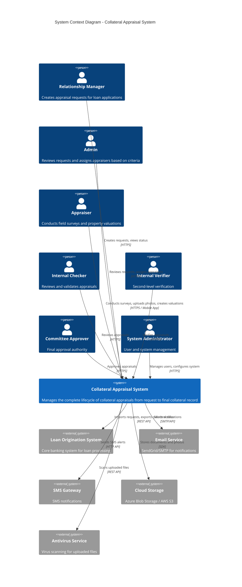
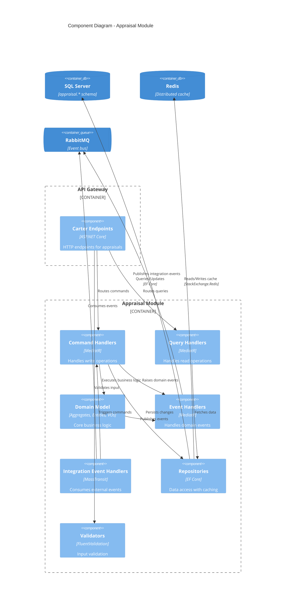
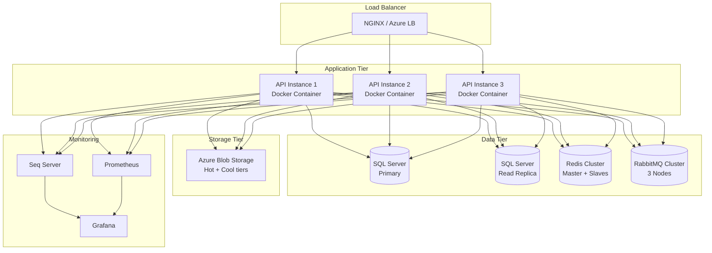

# C4 Model Diagrams - Collateral Appraisal System

## Overview

This document contains C4 Model diagrams for the Collateral Appraisal System. The C4 model provides a hierarchical way to visualize software architecture at different levels of abstraction.

## C4 Model Levels

1. **Level 1 - System Context**: How the system fits into the world
2. **Level 2 - Container**: High-level technology choices and responsibilities
3. **Level 3 - Component**: Components within containers
4. **Level 4 - Code**: Class diagrams (not included here)

---

## Level 1: System Context Diagram

### Overview
Shows the Collateral Appraisal System in the context of users and external systems.



### Key External Dependencies

| System | Purpose | Protocol | Criticality |
|--------|---------|----------|-------------|
| **LOS** | Request import, collateral export | REST API | High - Core integration |
| **Cloud Storage** | Document/photo storage | Azure SDK / AWS SDK | High - All documents |
| **Email Service** | User notifications | SMTP/SendGrid API | Medium - Can queue |
| **Antivirus** | File scanning | REST API | Medium - Can process async |
| **SMS Gateway** | Critical alerts | HTTP API | Low - Optional channel |

---

## Level 2: Container Diagram

### Overview
Shows the containers (applications, databases, file systems) that make up the system.

```mermaid
C4Container
    title Container Diagram - Collateral Appraisal System

    Person(users, "System Users", "RM, Admin, Appraisers, Checkers, Verifiers, Committee, System Admins")
    Person_Ext(mobile_user, "Mobile Appraiser", "Field survey via mobile app")

    System_Boundary(cas, "Collateral Appraisal System") {
        Container(web_ui, "Web Application", "React, TypeScript", "Provides UI for all system functions via browser")
        Container(mobile_app, "Mobile App", "React Native", "Field survey and photo upload on iOS/Android")

        Container(api, "API Gateway", "ASP.NET Core 9.0", "Exposes REST APIs via Carter endpoints, handles authentication")

        Container(request_module, "Request Module", ".NET 9.0", "Manages appraisal requests and title deed info")
        Container(appraisal_module, "Appraisal Module", ".NET 9.0", "Handles appraisal lifecycle, surveys, valuations")
        Container(collateral_module, "Collateral Module", ".NET 9.0", "Maintains collateral records and revaluations")
        Container(document_module, "Document Module", ".NET 9.0", "Centralized document management")
        Container(auth_module, "Auth Module", ".NET 9.0", "Authentication, authorization, user management")

        ContainerDb(sql, "SQL Server Database", "SQL Server 2022", "Stores all business data with schema separation")
        ContainerDb(redis, "Redis Cache", "Redis 7.x", "Caches sessions, permissions, reference data")
        ContainerQueue(rabbitmq, "Message Broker", "RabbitMQ 3.x", "Asynchronous integration events")
        Container(seq, "Logging Service", "Seq", "Structured logging and monitoring")
    }

    System_Ext(cloud, "Cloud Storage", "Azure Blob / AWS S3")
    System_Ext(los, "LOS System", "External banking system")

    Rel(users, web_ui, "Uses", "HTTPS")
    Rel(mobile_user, mobile_app, "Uses", "HTTPS")

    Rel(web_ui, api, "API Calls", "JSON/HTTPS")
    Rel(mobile_app, api, "API Calls", "JSON/HTTPS")

    Rel(api, request_module, "Routes requests", "In-Process")
    Rel(api, appraisal_module, "Routes appraisals", "In-Process")
    Rel(api, collateral_module, "Routes collateral", "In-Process")
    Rel(api, document_module, "Routes documents", "In-Process")
    Rel(api, auth_module, "Authentication", "In-Process")

    Rel(request_module, sql, "Reads/Writes", "EF Core")
    Rel(appraisal_module, sql, "Reads/Writes", "EF Core")
    Rel(collateral_module, sql, "Reads/Writes", "EF Core")
    Rel(document_module, sql, "Reads/Writes", "EF Core")
    Rel(auth_module, sql, "Reads/Writes", "EF Core")

    Rel(request_module, redis, "Caches data", "StackExchange.Redis")
    Rel(appraisal_module, redis, "Caches data", "StackExchange.Redis")
    Rel(auth_module, redis, "Caches sessions/permissions", "StackExchange.Redis")

    Rel(request_module, rabbitmq, "Publishes events", "MassTransit")
    Rel(appraisal_module, rabbitmq, "Publishes/Consumes", "MassTransit")
    Rel(collateral_module, rabbitmq, "Consumes events", "MassTransit")
    Rel(document_module, rabbitmq, "Publishes events", "MassTransit")

    Rel(document_module, cloud, "Stores files", "Azure SDK")

    Rel(request_module, seq, "Logs", "Serilog")
    Rel(appraisal_module, seq, "Logs", "Serilog")
    Rel(collateral_module, seq, "Logs", "Serilog")

    Rel(api, los, "Imports/Exports", "REST API")

    UpdateLayoutConfig($c4ShapeInRow="3", $c4BoundaryInRow="2")
```



### Container Responsibilities

| Container | Technology | Purpose | Deployment |
|-----------|-----------|---------|------------|
| **Web Application** | React + TypeScript | User interface for desktop users | Static hosting (CDN) |
| **Mobile App** | React Native | Field survey and photo upload | App Store / Play Store |
| **API Gateway** | ASP.NET Core 9.0 + Carter | RESTful API endpoints | Docker container |
| **Request Module** | .NET 9.0 | Request management bounded context | Same process as API |
| **Appraisal Module** | .NET 9.0 | Appraisal lifecycle bounded context | Same process as API |
| **Collateral Module** | .NET 9.0 | Collateral management bounded context | Same process as API |
| **Document Module** | .NET 9.0 | Document storage bounded context | Same process as API |
| **Auth Module** | .NET 9.0 | Identity & access management | Same process as API |
| **SQL Server** | SQL Server 2022 | Primary data store | Dedicated server |
| **Redis** | Redis 7.x | Cache and session store | Dedicated server |
| **RabbitMQ** | RabbitMQ 3.x | Message broker for events | Dedicated server |
| **Seq** | Seq | Structured logging | Dedicated server |

---

## Level 3: Component Diagram - Appraisal Module

### Overview
Shows the internal components of the Appraisal Module (most complex module).



### Component Breakdown

#### 1. Carter Endpoints
```csharp
// CreateAppraisalEndpoint.cs
public class CreateAppraisalEndpoint : ICarterModule
{
    public void AddRoutes(IEndpointRouteBuilder app)
    {
        app.MapPost("/appraisals", async (
            CreateAppraisalRequest request,
            ISender sender,
            CancellationToken ct) =>
        {
            var command = request.ToCommand();
            var result = await sender.Send(command, ct);
            return Results.Created($"/appraisals/{result.Id}", result);
        })
        .RequireAuthorization("appraisal.create")
        .WithTags("Appraisals");
    }
}
```

#### 2. Command Handlers (CQRS Write)
```csharp
// CreateAppraisalCommandHandler.cs
public class CreateAppraisalCommandHandler
    : IRequestHandler<CreateAppraisalCommand, Result<AppraisalId>>
{
    private readonly IAppraisalRepository _repository;
    private readonly IEventBus _eventBus;

    public async Task<Result<AppraisalId>> Handle(
        CreateAppraisalCommand command,
        CancellationToken ct)
    {
        // Create aggregate
        var appraisal = Appraisal.Create(command.RequestId, command.PropertyType);

        // Save
        await _repository.AddAsync(appraisal, ct);
        await _repository.UnitOfWork.SaveChangesAsync(ct);

        // Publish event (via domain event dispatcher)
        return Result.Success(appraisal.Id);
    }
}
```

#### 3. Domain Model (Aggregate Root)
```csharp
// Appraisal.cs
public class Appraisal : AggregateRoot<AppraisalId>
{
    public AppraisalNumber Number { get; private set; }
    public RequestId RequestId { get; private set; }
    public AppraisalStatus Status { get; private set; }

    private readonly List<AppraisalAssignment> _assignments = new();
    public IReadOnlyList<AppraisalAssignment> Assignments => _assignments;

    public static Appraisal Create(RequestId requestId, PropertyType propertyType)
    {
        var appraisal = new Appraisal
        {
            Id = AppraisalId.New(),
            Number = AppraisalNumber.Generate(),
            RequestId = requestId,
            Status = AppraisalStatus.Pending
        };

        appraisal.AddDomainEvent(new AppraisalCreatedEvent(appraisal.Id));
        return appraisal;
    }

    public void Assign(UserId appraiserId, UserId assignedBy)
    {
        // Business rule: Cannot assign if already assigned and accepted
        if (_assignments.Any(a => a.Status == AssignmentStatus.Accepted))
            throw new DomainException("Appraisal already assigned");

        var assignment = AppraisalAssignment.Create(Id, appraiserId, assignedBy);
        _assignments.Add(assignment);

        AddDomainEvent(new AppraisalAssignedEvent(Id, appraiserId));
    }
}
```

#### 4. Query Handlers (CQRS Read)
```csharp
// GetAppraisalByIdQueryHandler.cs
public class GetAppraisalByIdQueryHandler
    : IRequestHandler<GetAppraisalByIdQuery, Result<AppraisalDto>>
{
    private readonly IAppraisalRepository _repository;

    public async Task<Result<AppraisalDto>> Handle(
        GetAppraisalByIdQuery query,
        CancellationToken ct)
    {
        // Read from cache-decorated repository
        var appraisal = await _repository.GetByIdAsync(query.Id, ct);

        if (appraisal is null)
            return Result.Failure<AppraisalDto>("Appraisal not found");

        return Result.Success(appraisal.ToDto());
    }
}
```

#### 5. Repositories with Caching
```csharp
// AppraisalRepository.cs (Base)
public class AppraisalRepository : IAppraisalRepository
{
    private readonly AppraisalDbContext _context;

    public async Task<Appraisal?> GetByIdAsync(AppraisalId id, CancellationToken ct)
    {
        return await _context.Appraisals
            .Include(a => a.Assignments)
            .FirstOrDefaultAsync(a => a.Id == id, ct);
    }
}

// CachedAppraisalRepository.cs (Decorator)
public class CachedAppraisalRepository : IAppraisalRepository
{
    private readonly IAppraisalRepository _inner;
    private readonly IDistributedCache _cache;

    public async Task<Appraisal?> GetByIdAsync(AppraisalId id, CancellationToken ct)
    {
        var cacheKey = $"appraisal:{id}";

        // Try cache first
        var cached = await _cache.GetStringAsync(cacheKey, ct);
        if (cached is not null)
            return JsonSerializer.Deserialize<Appraisal>(cached);

        // Fallback to database
        var appraisal = await _inner.GetByIdAsync(id, ct);
        if (appraisal is not null)
        {
            await _cache.SetStringAsync(
                cacheKey,
                JsonSerializer.Serialize(appraisal),
                new DistributedCacheEntryOptions { AbsoluteExpirationRelativeToNow = TimeSpan.FromMinutes(10) },
                ct);
        }

        return appraisal;
    }
}

// Registration (Decorator pattern)
services.AddScoped<IAppraisalRepository, AppraisalRepository>();
services.Decorate<IAppraisalRepository, CachedAppraisalRepository>();
```

#### 6. Integration Event Handlers
```csharp
// RequestCreatedEventConsumer.cs
public class RequestCreatedEventConsumer : IConsumer<RequestCreatedEvent>
{
    private readonly ISender _mediator;

    public async Task Consume(ConsumeContext<RequestCreatedEvent> context)
    {
        var evt = context.Message;

        // Map to command
        var command = new CreateAppraisalCommand
        {
            RequestId = evt.RequestId,
            RequestNumber = evt.RequestNumber,
            PropertyType = evt.PropertyType,
            DueDate = evt.DueDate
        };

        // Send command
        await _mediator.Send(command, context.CancellationToken);
    }
}
```

---

## Deployment View

### Production Deployment Architecture



### Deployment Configuration

| Component | Count | Specs | Purpose |
|-----------|-------|-------|---------|
| **API Instances** | 3 | 4 vCPU, 8GB RAM | Horizontal scaling |
| **SQL Primary** | 1 | 8 vCPU, 32GB RAM, SSD | Write operations |
| **SQL Read Replica** | 1 | 8 vCPU, 32GB RAM, SSD | Read operations (queries) |
| **Redis Cluster** | 3 | 2 vCPU, 4GB RAM | Cache, sessions |
| **RabbitMQ Cluster** | 3 | 4 vCPU, 8GB RAM | Event bus |
| **Blob Storage** | 1 | N/A | Documents, photos |
| **Seq** | 1 | 2 vCPU, 4GB RAM | Structured logs |

---

## Technology Stack Details

### Backend Stack
```yaml
Runtime: .NET 9.0
Web Framework: ASP.NET Core Minimal APIs
API Framework: Carter (Minimal API library)
ORM: Entity Framework Core 9.0
CQRS/Mediator: MediatR
Validation: FluentValidation
Event Bus: MassTransit + RabbitMQ
Caching: StackExchange.Redis
Authentication: OpenIddict (OAuth2/OIDC)
Logging: Serilog → Seq
Testing: xUnit, FluentAssertions, Testcontainers
```

### Frontend Stack
```yaml
Web: React 18 + TypeScript + Vite
Mobile: React Native + TypeScript
State Management: Redux Toolkit / Zustand
API Client: React Query (TanStack Query)
UI Components: Material-UI / Ant Design
Forms: React Hook Form + Zod
Testing: Vitest + React Testing Library
```

### Infrastructure
```yaml
Containerization: Docker
Orchestration: Docker Compose (Dev) / Kubernetes (Prod)
Database: SQL Server 2022
Message Broker: RabbitMQ 3.x
Cache: Redis 7.x
Storage: Azure Blob Storage / AWS S3
Logging: Seq
Monitoring: Prometheus + Grafana
CI/CD: GitHub Actions / Azure DevOps
```

---

## Cross-Cutting Concerns

### 1. Authentication & Authorization Flow
```
Client → API Gateway → JWT Validation (OpenIddict)
                    → Permission Check (Auth Module)
                    → Cache Lookup (Redis)
                    → Authorize Endpoint
```

### 2. Logging Strategy
```
Application → Serilog → Seq
           → Structured Logs
           → Correlation IDs
           → Performance Metrics
```

### 3. Error Handling
```
Exception → Global Exception Handler
        → Log to Seq
        → Map to Problem Details (RFC 7807)
        → Return to Client
```

### 4. Caching Strategy
```
Layer 1: HTTP Response Caching (Client-side)
Layer 2: Redis Distributed Cache (Server-side)
Layer 3: EF Core Query Cache (In-memory)
```

---

**Next**: [06-integration-patterns.md](06-integration-patterns.md) - Detailed integration patterns and anti-corruption layers