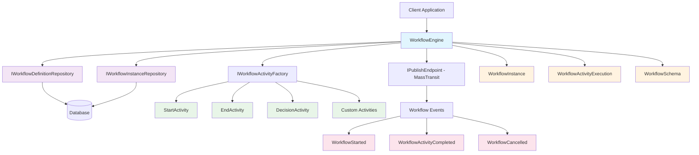
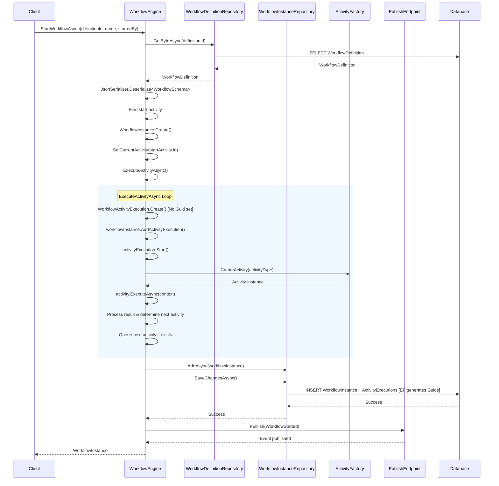
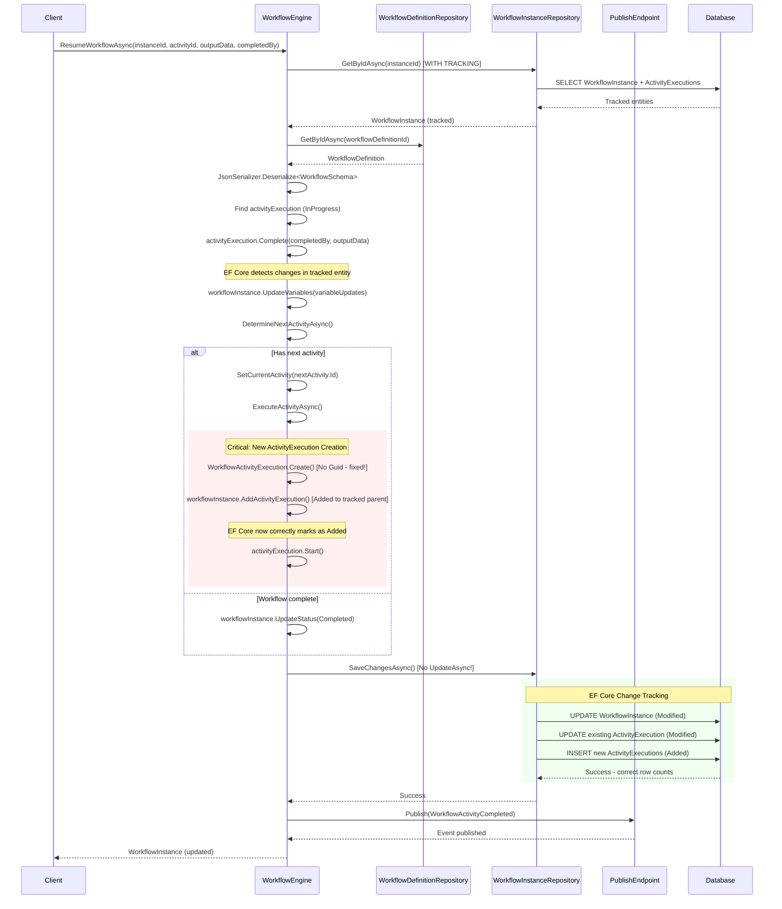
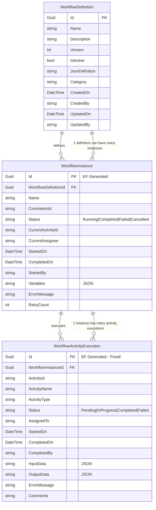
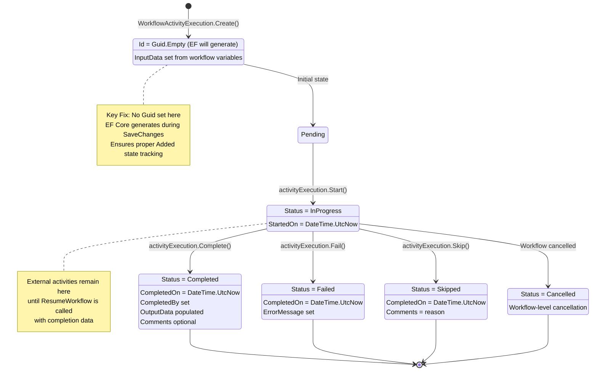

# Workflow Engine Documentation

This document provides comprehensive documentation for the Workflow Engine system, including architecture diagrams, process flows, and the key EF Core fix that was implemented.

## Table of Contents
1. [System Architecture](#system-architecture)
2. [StartWorkflow Process Flow](#startworkflow-process-flow)
3. [ResumeWorkflow Process Flow](#resumeworkflow-process-flow)
4. [Entity Relationship Diagram](#entity-relationship-diagram)
5. [Activity Execution Lifecycle](#activity-execution-lifecycle)
6. [Key Fix: EF Core State Management](#key-fix-ef-core-state-management)
7. [Implementation Notes](#implementation-notes)

## System Architecture

The workflow engine follows a clean architecture pattern with clear separation of concerns:

### Key Components

- **WorkflowEngine**: Central orchestrator that manages workflow execution
- **Repositories**: Data access layer following repository pattern
- **ActivityFactory**: Creates appropriate activity instances based on type
- **Domain Models**: Rich domain entities following DDD principles
- **Event Publishing**: Integration with MassTransit for workflow events

## StartWorkflow Process Flow

This diagram shows how a new workflow is initiated:

### Key Points
- Entire workflow instance graph is new, so EF Core correctly marks all entities as `Added`
- Activities are executed in a queue-based system for sequential processing
- Events are published for external system integration

## ResumeWorkflow Process Flow

This diagram shows how an existing workflow is resumed after an external activity completion:

### Key Points
- Uses EF Core change tracking instead of explicit `Update()` calls
- Mixed entity states: existing entities are Modified, new entities are Added
- The fix ensures new ActivityExecutions are properly marked as Added

## Entity Relationship Diagram

### Database Design Notes
- All primary keys are Guids generated by EF Core
- JSON columns store complex data (Variables, InputData, OutputData)
- Proper foreign key relationships with cascade delete for ActivityExecutions
- Status fields use string conversion for readability

## Activity Execution Lifecycle

### Activity States
- **Created**: Entity instantiated but not persisted
- **Pending**: Default state after creation
- **InProgress**: Activity is actively being executed
- **Completed**: Successfully finished with output data
- **Failed**: Execution failed with error message
- **Skipped**: Activity was bypassed with reason
- **Cancelled**: Workflow-level cancellation

## Implementation Notes

### Key Design Decisions
1. **DDD Principles**: Domain entities manage their own behavior
2. **Repository Pattern**: Clean separation of data access concerns
3. **Event-Driven Architecture**: Integration through domain events
4. **EF Core Change Tracking**: Leveraged instead of manual state management

### Performance Considerations
- EF Core generates random Guids (not sequential)
- For high-volume scenarios, consider `NEWSEQUENTIALID()` configuration
- Change tracking works efficiently for mixed entity states
- Navigation property loading uses `Include()` for efficient queries

### Error Handling
- Comprehensive validation at workflow definition level
- Activity-level error handling with proper state transitions
- Transactional consistency through EF Core unit of work pattern
- Event publishing for external system integration

### Testing Strategies
- Unit tests for domain logic in entities
- Integration tests for repository implementations
- End-to-end tests for complete workflow scenarios
- Mock external dependencies (MassTransit, database)

---