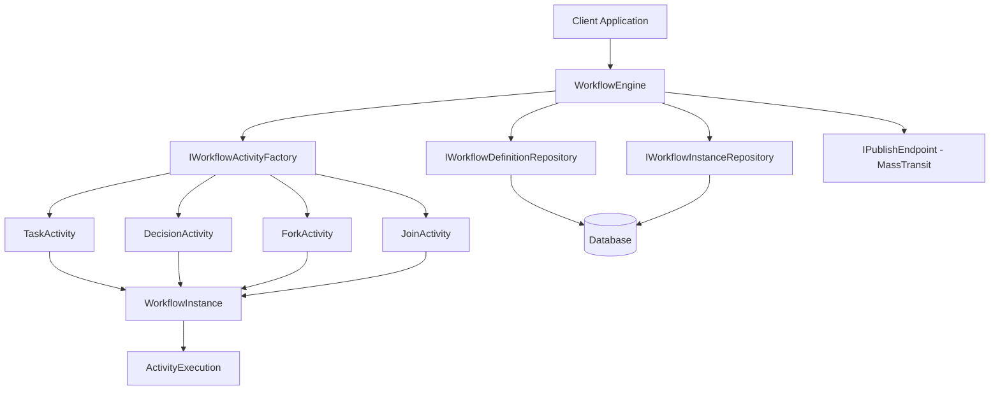
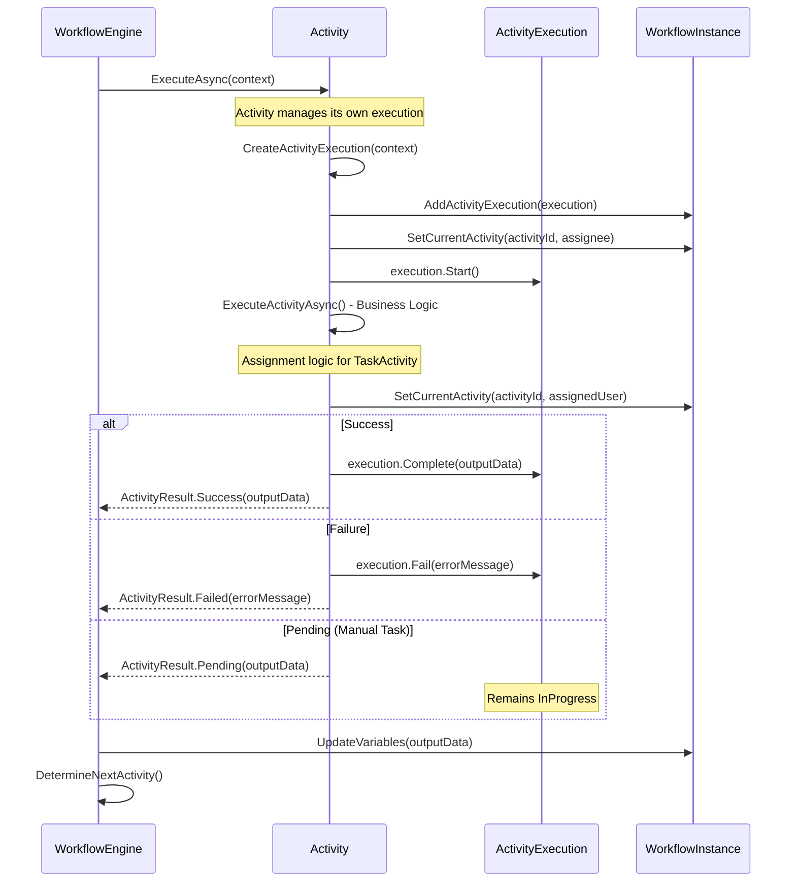

# Workflow System - Complete Developer Guide

## Overview

The Workflow System is a comprehensive business process orchestration engine supporting configurable workflow definitions, activity-managed execution, assignment strategies, conditional routing, parallel execution, and sophisticated input/output mapping.

## Key Features

- ✅ **Activity-Managed Execution**: Activities create and manage their own execution lifecycle and assignee
- ✅ **Assignment Strategies**: Integrated roundrobin, random, workload-based, and manual assignment  
- ✅ **Input/Output Mapping**: Configurable mapping between workflow variables and activity inputs/outputs
- ✅ **Resume Capability**: Workflows can be suspended and resumed with decision-based routing
- ✅ **Enhanced Expression Evaluation**: Advanced expression evaluation for conditional transitions
- ✅ **Unified Input System**: Clean API design using single input parameter
- ✅ **Parallel Execution**: Fork/Join activities for parallel workflow branches

## Architecture

### Core Components

- **WorkflowEngine**: Main orchestration engine managing workflow execution
- **Activities**: Self-managing workflow steps with integrated business logic
- **WorkflowInstance**: Runtime representation of workflow execution
- **ActivityExecution**: Activity-created execution tracking
- **ActivityContext**: Provides workflow context including WorkflowInstance access

### Activity-Managed Execution Pattern

**What Changed**: Activities now have full control over their execution lifecycle, creating executions, setting assignees, and managing state transitions.

**Benefits**:
- Better encapsulation with activities controlling execution details
- Integrated assignment with immediate assignee setting after assignment logic
- Simplified engine focusing on orchestration only
- Flexible execution allowing activities to customize behavior

## System Architecture Diagram



## Activity Execution Flow



## Activity Types

### TaskActivity

**Purpose**: Assigns tasks using various strategies and handles manual completion.

**Key Features**:
- Assignment strategy integration (Manual, RoundRobin, Random, WorkloadBased)
- Input/output mapping support
- Decision-based routing
- Automatic variable generation (`{activityId}_actionTaken`, `{activityId}_assignedTo`)

**Configuration**:
```json
{
  "assigneeRole": "Appraiser",
  "assignmentStrategy": "RoundRobin", 
  "userGroups": ["Senior_Appraisers"],
  "inputMappings": {
    "propertyValue": "estimatedValue"
  },
  "outputMappings": {
    "finalValue": "approvedValue"
  }
}
```

### DecisionActivity

**Purpose**: Routes workflow execution based on conditions and decisions.

**Features**:
- Condition-based routing
- Enhanced expression evaluation
- Decision value matching

### ForkActivity & JoinActivity

**Purpose**: Enable parallel workflow execution with synchronization.

**Fork Configuration**:
```json
{
  "branches": ["branch1", "branch2"],
  "forkType": "all",
  "maxConcurrency": 0
}
```

**Join Configuration**:
```json
{
  "forkId": "fork1",
  "joinType": "all",
  "timeoutMinutes": 30,
  "mergeStrategy": "combine"
}
```

## Input/Output Mapping System

### Input Mapping
Maps workflow variables to activity inputs during execution:
```json
{
  "inputMappings": {
    "propertyValue": "estimatedValue",
    "inspectorId": "assignedAppraiser"
  }
}
```

### Output Mapping  
Maps activity outputs to workflow variables:
```json
{
  "outputMappings": {
    "calculatedValue": "finalPropertyValue",
    "riskAssessment": "propertyRiskScore"
  }
}
```

### Input Processing Flow
1. Check for specific input mappings
2. Apply mapped workflow variable names
3. Use activityId prefix for unmapped inputs
4. Handle control parameters (decisionTaken, comments)

## Expression Engine

### Supported Operators

**Comparison**: `==`, `!=`, `>`, `>=`, `<`, `<=`, `contains`  
**Logical**: `&&`, `||`, `!`  
**Grouping**: `(`, `)`

### Examples

```javascript
// Simple comparisons
"status == 'approved'"
"amount > 1000"
"name contains 'admin'"

// Complex expressions
"(amount > 1000 && status == 'pending') || role == 'manager'"
"propertyType == 'residential' && estimatedValue <= 500000"
```

## API Endpoints

### Start Workflow
```http
POST /api/workflows/instances
{
  "workflowDefinitionId": "guid",
  "instanceName": "Property Appraisal #12345",
  "startedBy": "system",
  "initialVariables": {
    "propertyId": "PROP-12345",
    "estimatedValue": 500000
  }
}
```

### Resume Workflow
```http
POST /api/workflows/instances/{workflowInstanceId}/activities/{activityId}/complete
{
  "completedBy": "user123",
  "comments": "Task completed", 
  "decisionTaken": "APP",
  "input": {
    "propertyValue": "500000",
    "inspectionNotes": "Property is in good condition"
  }
}
```

## Complete Workflow Example

```json
{
  "name": "Property Appraisal Workflow",
  "version": "1.0",
  "variables": {
    "propertyId": "",
    "estimatedValue": 0,
    "finalValue": 0
  },
  "activities": [
    {
      "id": "start",
      "type": "StartActivity",
      "isStartActivity": true
    },
    {
      "id": "admin_review", 
      "type": "TaskActivity",
      "properties": {
        "assigneeRole": "Admin",
        "assignmentStrategy": "RoundRobin",
        "inputMappings": {
          "decision": "admin_review_actionTaken"
        }
      }
    },
    {
      "id": "appraiser_assignment",
      "type": "TaskActivity",
      "properties": {
        "assigneeRole": "Appraiser", 
        "assignmentStrategy": "WorkloadBased",
        "inputMappings": {
          "propertyValue": "estimatedValue"
        },
        "outputMappings": {
          "appraisedValue": "finalValue"
        }
      }
    },
    {
      "id": "approval_decision",
      "type": "DecisionActivity",
      "properties": {
        "conditions": {
          "APP": "finalValue <= 1000000",
          "REJ": "finalValue > 1000000"
        }
      }
    }
  ],
  "transitions": [
    {"from": "start", "to": "admin_review", "type": "Normal"},
    {"from": "admin_review", "to": "appraiser_assignment", "type": "Conditional", "condition": "APP"},
    {"from": "appraiser_assignment", "to": "approval_decision", "type": "Normal"},
    {"from": "approval_decision", "to": "end", "type": "Conditional", "condition": "APP"}
  ]
}
```

## Implementation Details

### Activity Base Class Structure

```csharp
public abstract class WorkflowActivityBase : IWorkflowActivity
{
    // Public interface - called by WorkflowEngine
    public virtual async Task<ActivityResult> ExecuteAsync(ActivityContext context, CancellationToken cancellationToken = default)
    {
        // Activity creates and manages execution
        var execution = CreateActivityExecution(context);
        context.WorkflowInstance.AddActivityExecution(execution);
        context.WorkflowInstance.SetCurrentActivity(context.ActivityId);
        
        execution.Start();
        var result = await ExecuteActivityAsync(context, cancellationToken);
        
        // Handle result and update execution status
        return result;
    }
    
    // Override in derived classes
    protected abstract Task<ActivityResult> ExecuteActivityAsync(ActivityContext context, CancellationToken cancellationToken = default);
    protected virtual Task<ActivityResult> ResumeActivityAsync(ActivityContext context, Dictionary<string, object> resumeInput, CancellationToken cancellationToken = default);
    
    // Helper methods for execution management
    protected virtual WorkflowActivityExecution CreateActivityExecution(ActivityContext context);
    protected virtual void SetActivityAssignee(ActivityContext context, string? assigneeId);
}
```

### TaskActivity Implementation Pattern

```csharp
protected override async Task<ActivityResult> ExecuteActivityAsync(ActivityContext context, CancellationToken cancellationToken = default)
{
    // Assignment logic
    var strategy = AssignmentStrategyExtensions.FromString(assignmentStrategy);
    var selector = _assigneeSelectorFactory.GetSelector(strategy);
    var result = await selector.SelectAssigneeAsync(assignmentContext, cancellationToken);
    
    if (result.IsSuccess)
    {
        // Set assignee immediately after assignment
        SetActivityAssignee(context, result.AssigneeId);
        
        // Generate output data
        outputData["assignedTo"] = result.AssigneeId;
        outputData[$"{context.ActivityId}_actionTaken"] = "pending";
    }
    
    return ActivityResult.Pending(outputData);
}
```

## Best Practices

### Activity Development
1. **Use meaningful activity IDs** - they become part of variable names
2. **Configure input/output mappings** for proper data flow
3. **Choose appropriate assignment strategies** based on requirements
4. **Implement validation** in ValidateAsync method

### Workflow Design  
1. **Start simple** - begin with linear workflows
2. **Use DecisionActivity** for conditional routing
3. **Include error handling** with fallback transitions
4. **Test thoroughly** before deployment

### Expression Usage
1. **Keep expressions simple** for better performance
2. **Use parentheses** for complex logic grouping
3. **Test expressions** separately before workflow integration
4. **Consider case sensitivity** for string comparisons

## Testing Strategies

### Unit Testing

```csharp
[Fact]
public async Task TaskActivity_ExecuteAsync_SetsAssigneeCorrectly()
{
    // Arrange
    var context = CreateTestContext();
    var activity = new TaskActivity(_assigneeSelectorFactory, _logger);
    
    // Act
    var result = await activity.ExecuteAsync(context);
    
    // Assert
    Assert.Equal(ActivityResultStatus.Pending, result.Status);
    Assert.Equal("user123", context.WorkflowInstance.CurrentAssignee);
}
```

### Integration Testing

```csharp
[Fact] 
public async Task WorkflowEngine_CompleteWorkflow_UpdatesVariablesCorrectly()
{
    // Test complete workflow execution with variable flow
}
```

### Expression Testing

```csharp
[Theory]
[InlineData("amount > 1000", 1500, true)]
[InlineData("status == 'approved'", "approved", true)]
public void ExpressionEvaluator_EvaluatesCorrectly(string expression, object value, bool expected)
{
    // Test expression evaluation with various scenarios
}
```

## Performance Considerations

1. **Assignment Caching**: Strategies cache user lists for performance
2. **Variable Updates**: Batch updates when possible  
3. **Expression Complexity**: Keep expressions simple
4. **Concurrent Execution**: Use Fork/Join for parallelizable tasks

## Security Best Practices

1. **User Authorization**: Verify permissions before workflow operations
2. **Input Validation**: Validate all input data before processing
3. **Activity Permissions**: Ensure users can complete assigned activities
4. **Audit Trail**: All operations are logged for compliance

## Migration Notes

### From Previous Versions
1. **Method Names**: Remove "Do" prefix - `DoExecuteAsync` → `ExecuteActivityAsync`
2. **FormData → Input**: Replace `formData` with `input` in API calls
3. **Activity Execution**: Activities now manage their own execution lifecycle
4. **ActivityContext**: Now includes `WorkflowInstance` property for self-management

## Troubleshooting

### Common Issues
1. **Activity Not Found**: Ensure activity type registered in `WorkflowActivityFactory`
2. **Assignment Failures**: Check user groups and strategy configuration
3. **Expression Errors**: Validate expression syntax and variable names
4. **Mapping Issues**: Verify input/output mapping configuration

### Debugging Tips
1. **Enable Logging**: Use structured logging to trace execution
2. **Variable Inspection**: Monitor workflow variables at each step
3. **Activity Status**: Check ActivityExecution status for stuck workflows
4. **Test Expressions**: Validate expressions before using in workflows

---

*This comprehensive guide covers the complete workflow system. For specific implementation details, refer to source code in `/Modules/Assignment/Assignment/Workflow/`.*